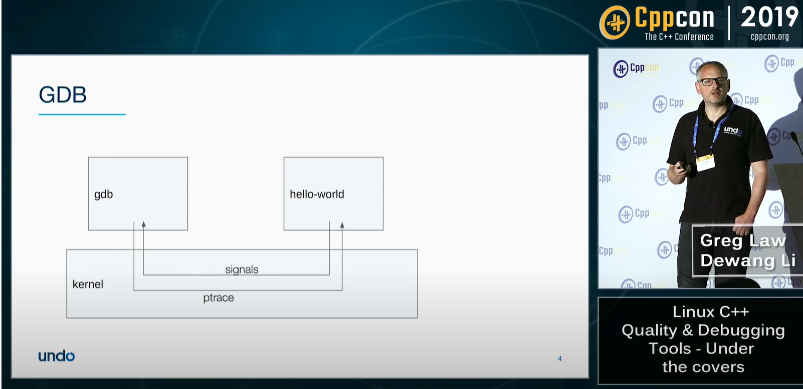

## CppCon 19 modern debugging tools
### Types of tools and some examples
* the debugger ie. GDB, - what is my program doing?
* Record and replay, ie. rr/Live Recorder - what just happened
* Dynamic checkers , ie. Valrind/Sanitizers - did thing X happen?
* Static analysis , ie. cppcheck/ Coverity  - could thing X happen? 

 
Signals and ptrace

## GDB
