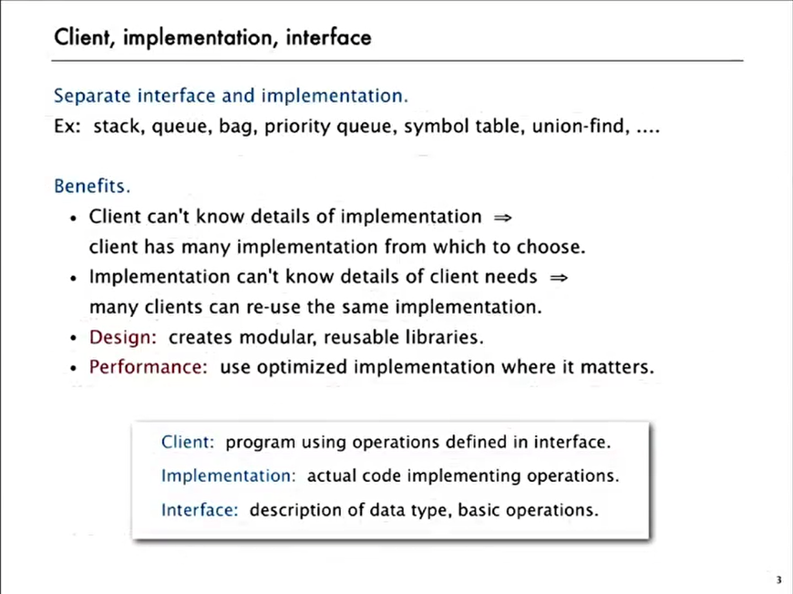
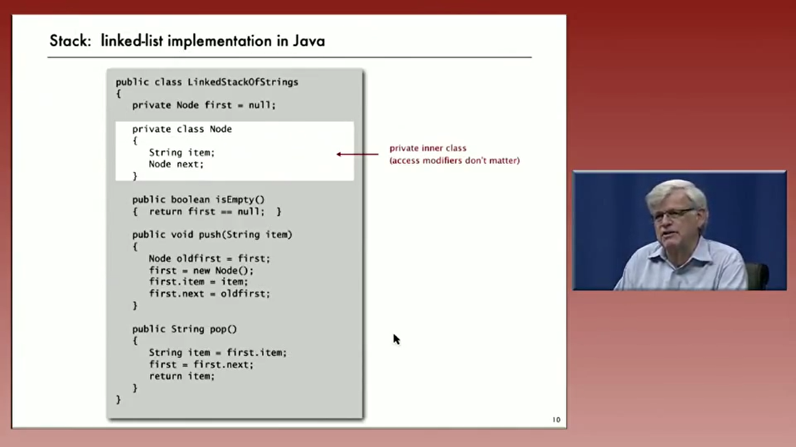
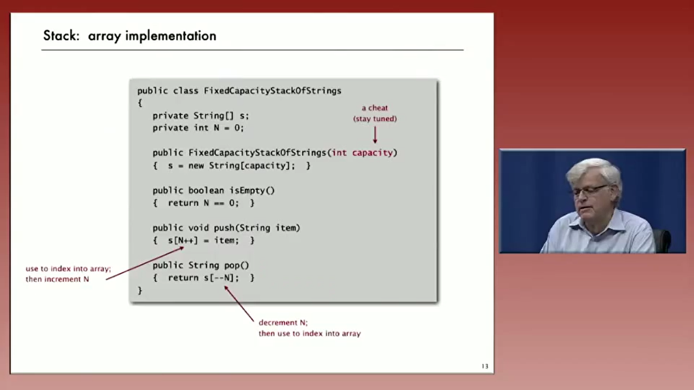
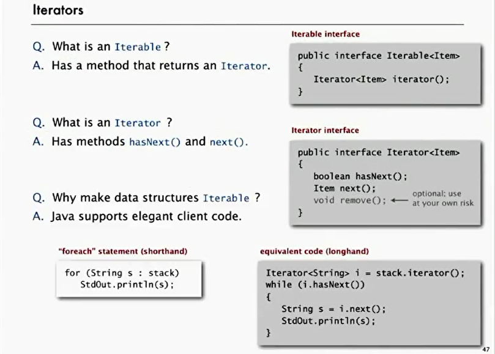
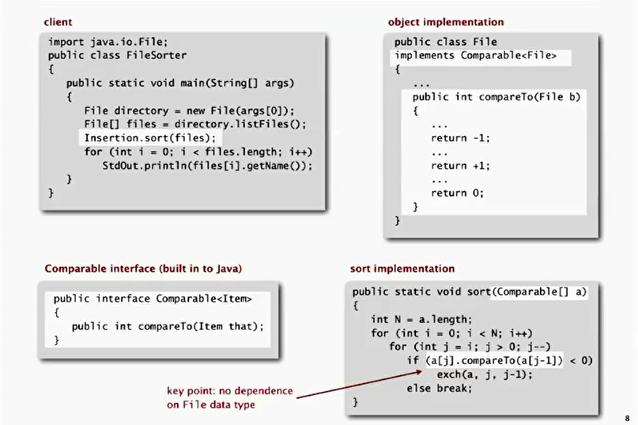
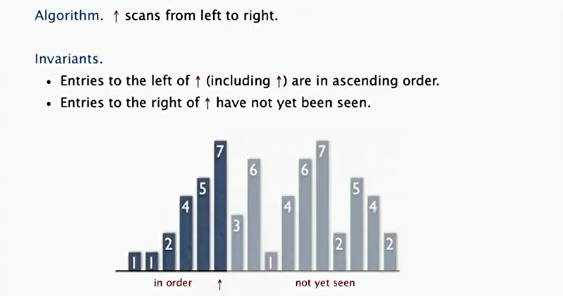
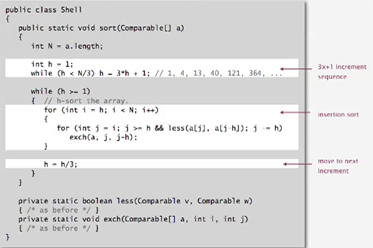

# [Algotrithms OCW](https://cuvids.io/app/course/2/) 

# Part I

## cource Overview 

What is this cource?
**Algorithm** : method for solving a problem
**Data Structure** ： methods to store information 
<div align=center></div>

## 动态链接问题
for a given set of N-Objects,支持以下的操作  
* Union command
* find query

Connect 具备的性质  
* Reflexive(**自反性**): p is connected to p.
* Symmetric(**对称性**):if p is connected to q, then q is connected to p
* Transitive(**传递性**): if p is connected to q and q is connected to r,then p is connected to r

我们设计的类需要支持下

面的接口:
<div align=center></div>

### Quick Find [eager approach]
具体实现的示意图如下： 
<div align=center></div>  

:arrow_forward: 使用一个size为n的array，id[]  
:arrow_forward: 如果两者id一样的话，那么就认为是connected

优缺点： find query非常快，但是 ==union需要消耗太多资源==, 如果对N个对象做 N 次 Union, 那么就需要 $N^2$ 次操作<div align=center></div>

具体实现过程中需要注意的地方：
* 初始构造函数需要给id[i]赋值为i
* union时候需要遍历整个array.

### Quick Union[lazy approach]
具体的数据结构：
- 使用一个size为n的array
- interpretation: `id[i]` 为 i 的parent, root of i is `id[id[...]]`
<div align=center></div>

使用的方法：
- find：只要检测是否为同一个 root
- union: 只要p和q之间 merge 即可

缺点： tree可能会变得非常长，则对大规模的问题无法使用。提升的方法：
- weighting : 把small 的 tree放在下面，因此没有item距离root比较远。
- Path Compression: 加上weighting, 将时间减到`O(n+lg*M)`

### improvment
* weighting
  * 记录每棵树的 size(元素数量), 这需要一个新的 array, `sz[]`,用于记录
  * 每次 union 时将小的树挂在大树的树根下
  <div align=center></div>

* path compression
  <div align=center></div>

<div align=center></div>

`lg* N` 意味着要做多少次 lg 才能到 1, 如 lg* 2 = 1, lg* 4 = 2, lg* 16 = 3... 它一般是小于 5 的($N = 2^{65536}$), 因此实际上可以理解线性算法.
## Analysis of Algorithms

<div align=center></div>
一般而言,有四个角度去理解程序,作为学生,我们必须全部了解他们.为何去分析算法:

* 预测 performance
* 比较算法
* 对程序运行提供一些保证

在算法理论中可能需要 Understand theoretical basis. 我们用这样的方法研究计算机程序的运行时间:
* 细致地观察真实世界的特点，通常还要有精确的测量
* 根据观察结果提出假设模型
* 根据模型预测未来的事件
* 继续观察并核实预测的准确性
* 如此反复直到确认预测和观察一致

### Obersvation
在计算机中有一个 3-Sum 问题, 给定 N 个整数, 数出和为 0 的 triples 个数,最直观的解法就是暴力枚举:
```C++
public static int count(int[] a)
{
    int N = a.length;
    int count = 0;
    for (int i = 0; i < N; i++)
        for (int j = i+1; j < N; j++)
            for (int k = j+1; k < N; k++)
                if (a[i] + a[j] + a[k] == 0)
                    count++;
    return count;
}
```
运行时间在 log-log plot 中是一条斜线, 斜率大概为 3.  
### mathematical models
**cost of basic opeartion**: 大多数的 ==primitive operations== 只需要常量时间.
<div align=center></div>
<div align=center></div>

很多时候可以把离散的求和近似成连续的积分,去评估一个算法的复杂度:  
<div align=center></div>  

### order-of-growth classifications
**常见算法的复杂度**:
<div align=center></div>

**3-Sum 的 $N^2 \log N$ 解法**

* sort the N numbers ($N^2$ with insertion sort)
* for each pair of numbers a[i] and a[j] **binary search** for -(a[i] + a[j]) ($N^2 \log N$)
    ```Java
    public static int binarySearch(int[] a, int key)
    {
        int lo = 0, hi = a.length-1;
        while (lo <= hi)
        {
            int mid = lo + (hi - lo) / 2;
            if (key < a[mid]) hi = mid - 1;
            else if (key > a[mid]) lo = mid + 1;
            else return mid;
        }
        return -1;
    }
    ```
### theory of algorithms
在涉及对算法的评估时, 我们往往会采取下面三个角度:
* Best case: Lower bound on cost.
* Worst case: Upper bound on cost.
* Average case: Expected cost for random input <div align=center></div>
<div align=center></div>
  
在实际上, 人们常常先给出一个实现, 确定算法的上届. 然后尝试给出一个证明, 确定算法的下界. 不断减小其中的 Gap, 即便如此, 很多问题都无法得到一个 Optimal algorithm(上下界相同).  
### 内存使用的定量分析
过去的 32 位系统指针大小是 4 Byte, 64 位系统的指针是 8 Byte, 在过渡期间这个问题比较痛苦.
<div align=center></div>

此外, 还需要注意三点:
* Object overhead. 16 bytes.
* Reference: 8 Bytes
* 内存对齐: Each object uses a multiple of 8 bytes<div align=center></div>


### Stacks and queues

面向对象编程的基本思想，分离interface和implementation.  
  

#### Linked Lists representation

  
不需要构造函数， 然后有一个指向node的reference,初始值为null.分析它的performance:

- 最坏的情况下每个operation都要const time
- N个Item需要约~40N的空间(不包括reference指向的string)

#### array implementation

用array实现，总是会遇到容量的问题，这个实现需要构造函数，同时给capacity(breaked the API),
  
这个实现需要注意几个小的问题:
- Overflow and Underflow: 使用resize解决这个问题
- Loitering(虚度\游荡): pop之后将最后元素设置为null,让Java回收它

##### Array resize
**repreted doubling** 如果array full, 创建new array of twice the size, 然后复制元素. 这样的话Insert N个元素的时间消耗为N+(2+4+8+...+N)~3N.  
在1/4的size时候,将容量变成现在的1/2(new新的再copy).性能分析:
- 内存的使用~8N到~32N之间(不包含string)
- worst下push/pop需要O(N)的时间,best和摊销下都是O(1)

#### Linkde-List Queue
这个时候我们需要Maintain两个pointer,分别对应first和Last Node.

#### 泛型
在实际的应用场景中, 我们通常需要装有不同对象类型的容器, 如有了StackOfStrings, 还想要StackOfURLs, StackOfInts,过去的做法, 使用面向对象的多态:
- [x] 需要在客户端的casting
- [x] 如果出现mismatch, 出现的是run-time error

新的解决方案就是**java generics**,可以避免client端的casting,同时在compile-time发现type dismatch errors.  
注: java 不允许Generic的array, 只能是用casting将Object的转为Item[ ]:  
```Java
S = (Item[]) new Object[capacity];
```

#### 迭代器
  

### Sorting
用define的key将数据排成一个有序的,data可能是 _Double_, _String_ 或者 _java.io.File_ , 具体的做法是实现 _Callbacks_, 在不同的语言中具体的实现可能不同:
* C: function pointers
* C++ : class-type functions
* Java : interfaces  

```Java
Public class Date implements Comparable<Data>{ //尖括号说明只允许和Data对比
    private final int month, day, year;
    Public Data(int m, int d, int y){
        month = m;
        day = d;
        year = y;
    }
    // 实现 compareTo method
    public int compareTo(Data that){
        if(this.year < that.year) return -1;
        if(this.year > that.year) return +1;
        if(this.month < that.month) return -1;
        if(this.month > that.month) return +1;
        if(this.day < that.day) return -1;
        if(this.day > that.day) return +1;
        return 0;
    }
}
```

#### Selection Sort
选择排序的算法描述:
* 在第i次迭代中, 找到剩余部分最小元素的下标 _min_
* Swap _a[i]_ 和 _a[min]_
```Java
    ...
    private static void exch(Comparable[] a; int i,int j){
        Comparable swap = a[i];
        a[i] = a[j];
        a[j] = swap;
    }
    public static void selection_sort(Comparable[] a){
        int N = a.length;
        for(int i =0 ; i < N; i++){
            int min  = i;
            for(int j = i+1; j< N; j++){ 
                if(less(a[j],a[min]))
                    min = j;
            }
            exch(a,i,min);
        }
    }
    ...
```

#### Insertion Sort
前面部分是有序的, 每次迭代中将后面的第一个元素(下标为i)插入前面有序的部分:  
  
这种算法需要 ~ $\frac{1}{4} N^2$ 次比较和交换on average,在最坏的情况下是$\frac{1}{2}$  

#### Shell Sort
每次都move多个位置, 这样的话一次可能就不止改变一个逆序对:
* 间隔非常大的时候, 是处理一个小的subarray
* 间隔不大的时候, 实际上array基本已经有排好序了

间隔的序列
* Powers of two: 这个效率非常差, 因为奇数和偶数的之间的交换只有在最后一个1-sort的时候才会发生
* Powers if two minus one : 可能可以工作
* $3x+1$: 简单实现, 效果还行
* merging of $(9\times 4^i) - (9 \times 2^i) + 1$ 和 $4^i - (3 \times 2^i)+1$


### Merge Sort
#### Intro
* 将array分成两半
* 递归地将每个half排序
* 将两个halves合并

在Java中可以增加很多断言, 可以帮助检测程序的逻辑错误, 同时更有利于文档的编写.   
Merge sort最多使用 $N \log N$ 次 compare 和 $6 N \log N$次array acesses 去给size为N的array排序.  
此外, 还有一个问题是Merge sort对于小的subarray来说效率并不高,可以 **在~ 7个item左右的时候换成insertion sort**.