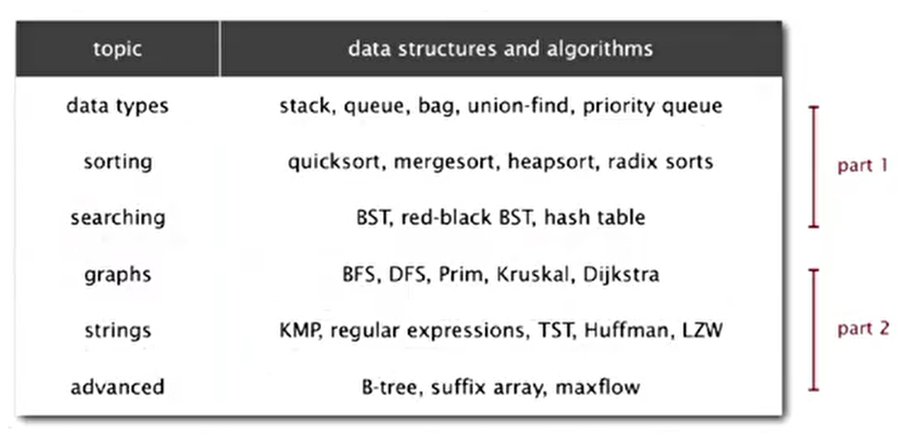
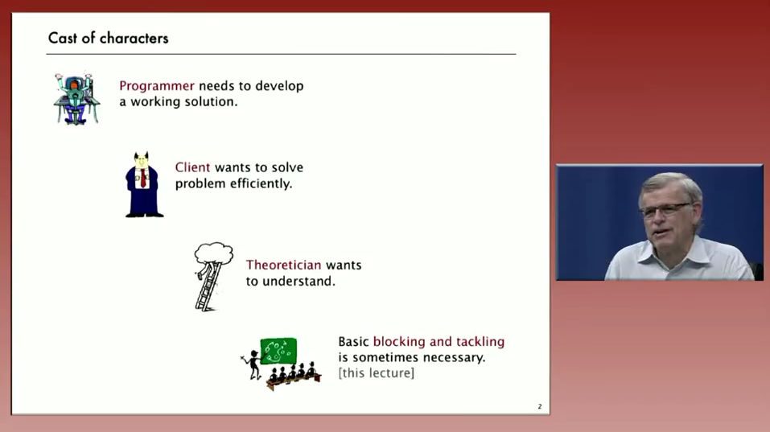
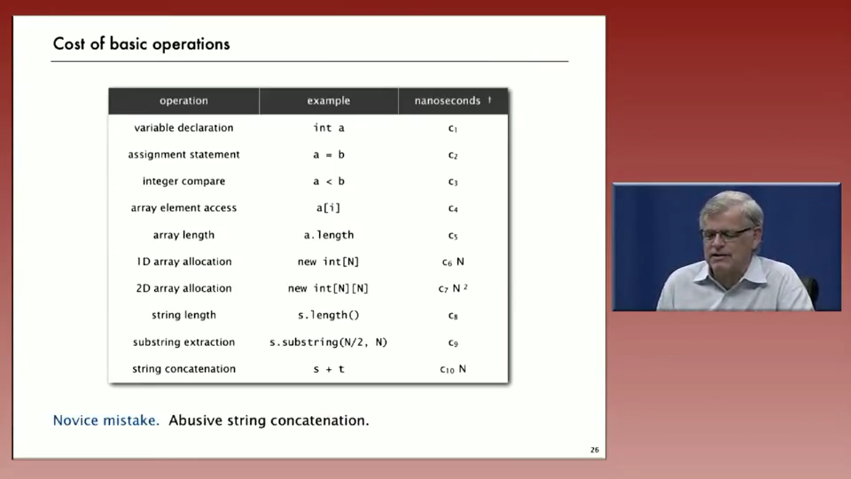
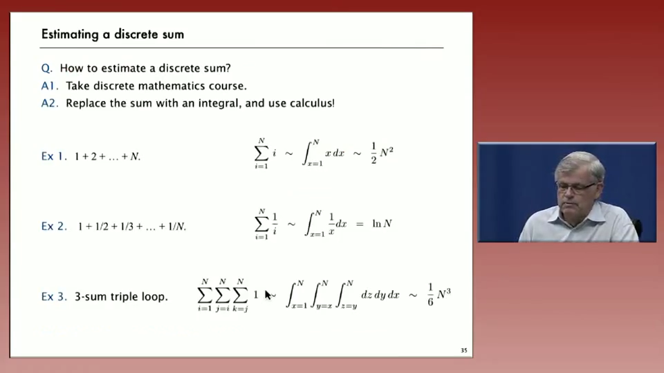
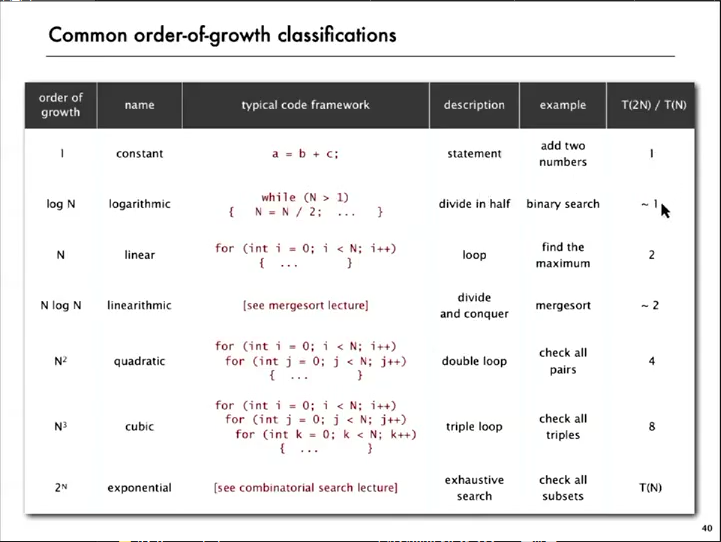
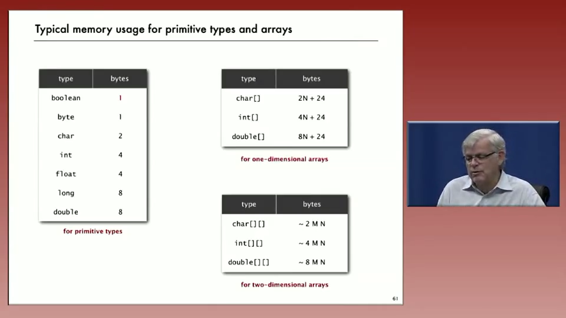
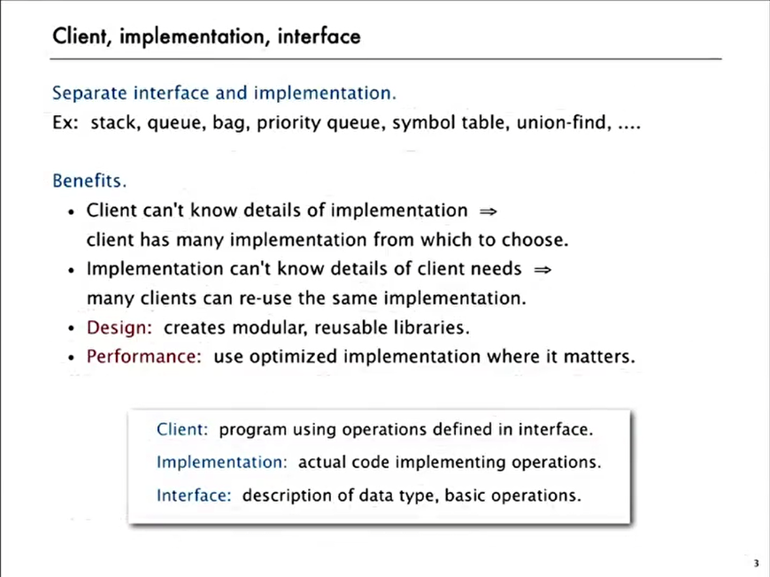
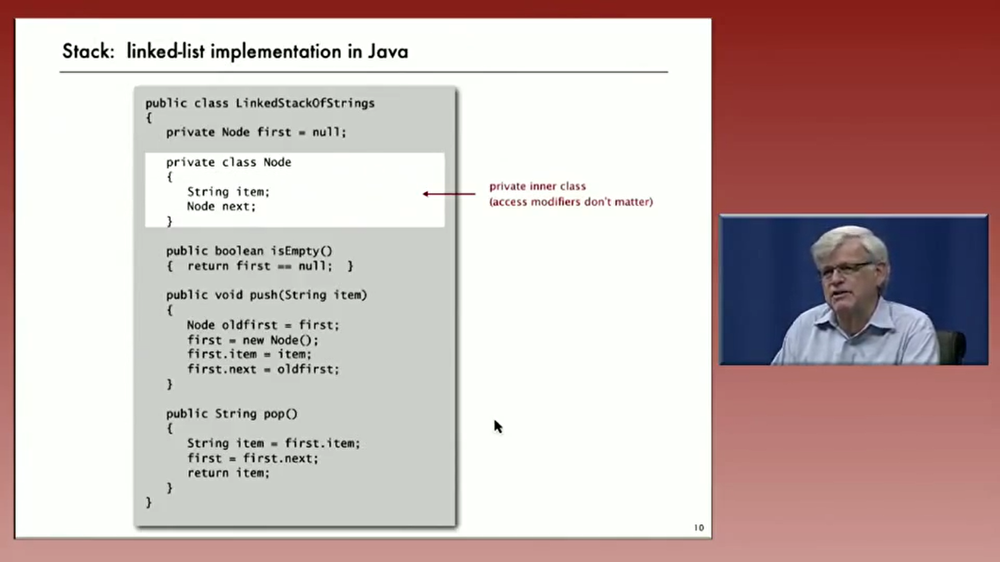
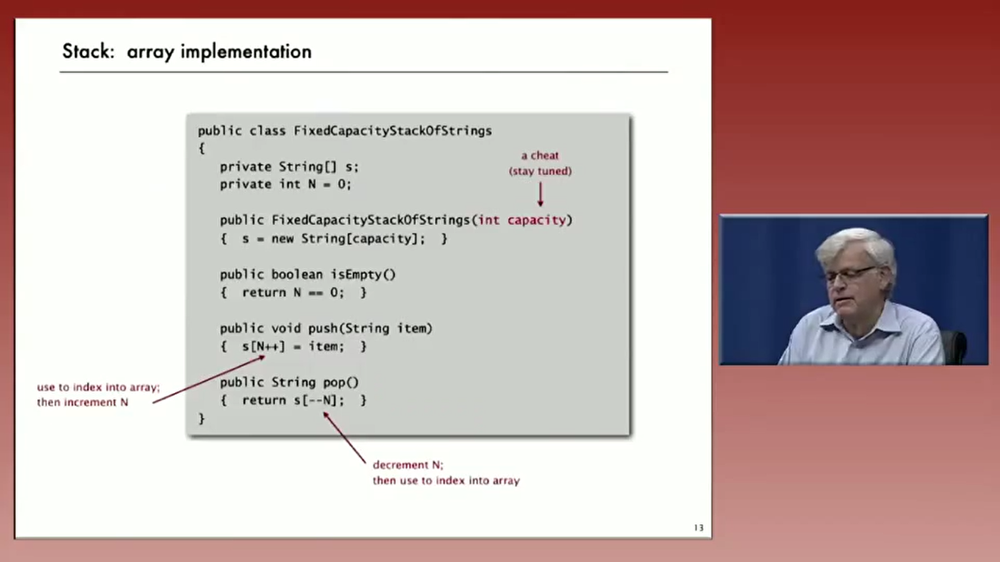

# Algotrithms

## Part I

### cource Overview 

What is this cource?
**Algorithm** : method for solving a problem
**Data Structure** ： methods to store information 

### 动态链接问题
for a given set of N-Objects,支持以下的操作 
* Union command
* find query

Connect 具备的性质 
* reflexive 
* transitive
* Symmetric

#### Quick Find
具体的数据结构： 
- [x] 使用一个size为n的array，id[]
- [x] 如果两者id一样的话，那么就认为是connected

优缺点： find query非常快，但是union需要消耗太多资源。 
具体实现过程中需要注意的地方：
* 初始构造函数需要给id[i]赋值为i
* union时候需要遍历整个array.

#### Quick Union
具体的数据结构：
- 使用一个size为n的array
- interpretation: id[i] 为 i 的parent, root of i is id[id[...]]

使用的方法：
- find：只要检测是否为同一个root
- union: 只要p和q之间merge即可

缺点： tree可能会变得非常长，则对大规模的问题无法使用。提升的方法：
- weighting : 把small 的 tree放在下面，因此没有item距离root比较远。
- Path Compression: 加上weighting, 将时间减到`O(n+lg*M)`

### Analysis of Algorithms

 
一般而言,有四个角度去理解程序,作为学生,我们必须全部了解他们.为何去分析算法:

* 预测performance
* 比较算法s
* 对程序运行提供一些保证

**cost of basic opeartion**  : 
 
很多时候可以把离散的求和近似成连续的积分,去评估一个算法的复杂度: 
 
**常见算法的复杂度** : 
 

**3-Sum 的 $N^2 \log N$ 解法**

* sort the N numbers ($N^2$ with insertion sort)
* for each pair of numbers a[i] and a[j] **binary search** for -(a[i] + a[j]) ($N^2 \log N$)

**内存使用的定量分析:**
 

### Stacks and queues

面向对象编程的基本思想，分离interface和implementation. 
 

#### Linked Lists representation

 
不需要构造函数， 然后有一个指向node的reference,初始值为null.分析它的performance:

- 最坏的情况下每个operation都要const time
- N个Item需要约~40N的空间(不包括reference指向的string)

#### array implementation

用array实现，总是会遇到容量的问题，这个实现需要构造函数，同时给capacity(breaked the API),
 
这个实现需要注意几个小的问题:
- Overflow and Underflow: 使用resize解决这个问题
- Loitering(虚度\游荡): pop之后将最后元素设置为null,让Java回收它

##### Array resize
**repreted doubling** 如果array full, 创建new array of twice the size, 然后复制元素. 这样的话Insert N个元素的时间消耗为N+(2+4+8+...+N)~3N. 
在1/4的size时候,将容量变成现在的1/2(new新的再copy).性能分析:
- 内存的使用~8N到~32N之间(不包含string)
- worst下push/pop需要O(N)的时间,best和摊销下都是O(1)

#### Linkde-List Queue
这个时候我们需要Maintain两个pointer,分别对应first和Last Node.

#### 泛型