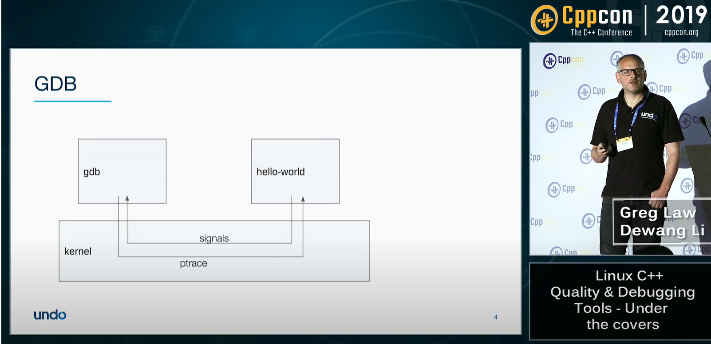

## CppCon 2018 Undo-Debugging Linux C++
程序主要是在调试, 大概 50% 的时间都将消耗在Debug上, 调试是在编程中最容易被低估的地方. 
Two main classes of debugging tools today:
1. Checkers(static or dynamic), 
    * 解决的问题是,我的程序有没有做buffer overrun,...,这些bad things
    * ie. Valgrid, Coverity
2. Debuggers 
    * 解决的问题是,我的程序在干什么
    * ie. GDB, LLDB, rr, Live Recorder

### GDB - More than you knew
* 编译时候启用gdb的支持 : `gcc -ggdb2 hello.c`
* 使用gdb 进入生成的二进制文件 : `gdb a.out`

以下的事情全是在gdb内部做的,这时候命令行显示 _(gdb)_: 
* _list_ 可以列出程序剩下的代码
* \<C-x> \<C-a> 进入一个图形界面
* _next_ 运行到下一行
    
* GDB 现在有了python的支持
    
* `.gdbinit` 是配置文件的地方, 尽量保持简洁
* 设置断点和观察点:
    

## CppCon 19 modern debugging tools
### Types of tools and some examples
* the debugger ie. GDB, - what is my program doing?
* Record and replay, ie. rr/Live Recorder - what just happened
* Dynamic checkers , ie. Valrind/Sanitizers - did thing X happen?
* Static analysis , ie. cppcheck/ Coverity  - could thing X happen? 

 
Signals and ptrace
