# Ｃ++代码整洁之道：C++17可持续软件开发者模式实践

## Chap 1: 简介

很多软件项目的开发形势十分严峻, 而起原因并不是单纯的技术以原因, 其代码可能 **外部质量** 很高, 能够通过质量保证部门的黑盒测试/用户测试以及验收测试, 真正地问题在于能够正常工作的这种代码 **内部质量** 很低, 可读性不高, 维护扩展困难. <br>
软件会随着时间的推移而变得混乱, 其中一个和语言相关的原因是 C++ 是一个中等层次的多范式编程语言, 包含了高级语言和低级语言的特点. 另一个原因是很多程序开发者并没有 IT 背景.<br>
整洁的代码是容易被任何团队的成员理解和维护的, 它是高效工作的基础. 

## Chap 2: 构建安全体系

在过去几年中, 测试已经成为衡量软件质量好坏的一个重要指标, 一个好的测试策略所带来的好处是巨大的, 软件测试是 QA 的一个组成部分.不同级别的质量保证通常用金字塔形式表述:<br>
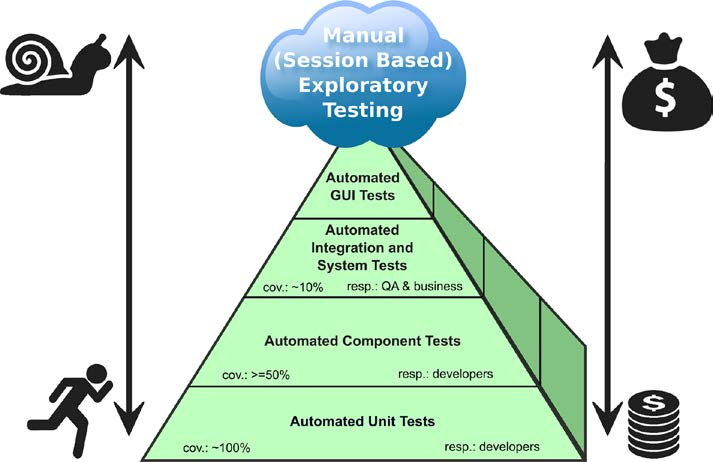<br>
这意味着我们要做更多的低层次单元测试, 测试和维护的成本总是朝着金字塔顶端增长, 例如一个自动化的 UI 测试是很难编写的, 他们也难以检查系统中所有可能的执行情况,系统级别的测试失败了, 也难以找到错误的确切原因.<br>
QA是安全体系的第二道防线, 他们会检查以前的质量保证措施是否充分有效, 在此之前开发人员应该要做充分的测试.<br>
**单元测试**: 在特定上下文环境中,单元测试能执行产品的一部分代码, 在很短时间内展示代码是否达到了预期运行的结果.
* 单元测试阶段修复 bug 的代价相对低
* 得到关于整个代码库(有测试那部分) 的及时反馈
* 让开发人员有信心重构代码, **没有单元测试的重构是非常危险的**
* 高覆盖率的单元测试, 可以防止陷入耗时和让人手足无措的代码调试中
* 可以促进实现整洁且良好的接口

### 良好的单元测试原则
高质量要求产品代码的同时, 也要高质量要求单元测试的代码, 理论上产品代码和测试代码之间不应该有任何区别.
#### 单元测试代码的命名
测试失败后, 开发人员希望得到以下信息:
* 测试单元名称, 谁的单元测试失败了
* 单元测试测了什么, 环境是怎样的(测试场景)
* 预期的结果是什么, 时代的实际结果是什么

因此一个直观而且容易理解的名称应该包含三点:
* 测试的前置条件,执行单元测试前 被测试系统(SUT,System Under Test) 的状态
* 被单元测试的部分(通肠胃过程,函数或者方法的名称)
* 单元测试的结果
    ```C++
    // 建议的名称模板如下
    <PreconditionAndStateOfUnitUnderTest>_<TestedPartOfAPI>_<ExpectedBehavior>
    // 例子 
    void CustomerCacheTest::cacheIsEmpty_addElement_sizeIsOne();
    void CustomerCacheTest::cacheContainsOneElement_removeElement_sizeIsZero();
    void ComplexNumberCalculatorTest::givenTwoComplexNumbers_add_Works();
    void MoneyTest:: givenTwoMoneyObjectsWithDifferentBalance_theInequalityComparison_Works();
    void MoneyTest::createMoneyObjectWithParameter_getBalanceAsString_returnsCorrectString();
    void InvoiceTest::invoiceIsReadyForAccounting_getInvoiceDate_returnsToday();
    ```

另一种直观且容易理解的测试名称, 是直接面熟特定的需求,如:
```C++
void UserAccountTest::creatingNewAccountWithExistingEmailAddressThrowsException();
void ChessEngineTest::aPawnCanNotMoveBackwards();
void ChessEngineTest::aCastlingIsNotAllowedIfInvolvedKingHasBeenMovedBefore();
void ChessEngineTest::aCastlingIsNotAllowedIfInvolvedRookHasBeenMovedBefore();
void HeaterControlTest::ifWaterTemperatureIsGreaterThan92DegTurnHeaterOff();
void BookInventoryTest::aBookThatIsInTheInventoryCanBeBorrowedByAuthorizedPeople();
void BookInventoryTest::aBookThatIsAlreadyBorrowedCanNotBeBorrowedTwice();
```

#### 单元测试的独立性

每个单元测试和其他单元测试都必须是独立的, 如果单元测试之间是以特定的顺序执行, 拿将是致命的. 当离开一个单元测试的时候, 不应该改变测试单元的状态. 同时需要注意, 测试环境也是要独立初始化, 每个单元测试都必须是应用程序的一个独立可运行的实例: 完全自行设置和初始化所需要的环境, 执行单元测试后的清理工作.

#### 一个测试一个断言
一个测试中多个断言带来的问题是显而易见的:
* 开发人员难以快速找到错误的原因
* 我们应该用精确而且富有表现力的方式命名测试, 但是很难为多个测试的单元找到合适的名字
    ```C++
    // 一个测试用一个断言
    void MoneyTest::givenTwoMoneyObjectsWithDifferentBalance_theInequalityComparison_Works(){ 
        const Money m1(-4000.0); 
        const Money m2(2000.0); 
        ASSERT_TRUE(m1 != m2); 
    }
    // 一个测试里面多个断言, 不是好的范例
    void MoneyTest::givenTwoMoneyObjectsWithDifferentBalance_testAllComparisonOperators() {
        const Money m1(-4000.0);
        const Money m2(2000.0);
        ASSERT_TRUE(m1 != m2);
        ASSERT_FALSE(m1 == m2);
        ASSERT_TRUE(m1 < m2);
        ASSERT_FALSE(m1 > m2);
        // ...more assertions here...
    }
    ```
#### 一些提醒 

* **不到对 getters 和 setters 做单元测试**: 测试常见且简单的单元 _getters / setters_ 是没有必要的
* **不要对第三方代码做单元测试**: 我们预设第三方库都是有自己的单元测试, 在自己的项目中, 不要使用那些没有单元测试或者质量可疑的库或者框架
* 不要对外部系统做单元测试: 需要注意的是这不是你的责任, 测试自己的代码而不是别人的
* 处理数据库的访问: **能不使用数据库进行单元测试, 就不使用**, 单元测试为了不同的目的而共享数据库, 对独立性有影响,此外数据库的访问可能使得测试需要多花费几分钟的时间(解决的办法是模拟数据库, 也不要访问磁盘网络)
* **不要混淆测试代码和产品代码**,上面这个例子将用一个布尔值确认是否进入测试代码, 测试时用的替身(FackDAOForTest) 替换 DAO(Data Access Object), 带来两个问题:
    - 增加产品复杂度并且降低代码的可读性
    - 测试类也变成了系统的一部分, 被部署到了生产环境中
    ```C++
    #include <memory>
    #include "DataAccessObject.h"
    #include "CustomerDAO.h"
    #include "FakeDAOForTest.h"
    using DataAccessObjectPtr = std::unique_ptr<DataAccessObject>;
    class Customer {
    public:
        Customer() {}
        explicit Customer(bool testMode) : inTestMode(testMode) {}
        void save() {
        DataAccessObjectPtr dataAccessObject = getDataAccessObject();
        // ...use dataAccessObject to save this customer...
        };
    private:
        DataAccessObjectPtr getDataAccessObject() const {
            if (inTestMode) {
                return std::make_unique<FakeDAOForTest>();
            } else {
                return std::make_unique<CustomerDAO>();
            }
        }
        // ...more operations here...
        bool inTestMode{ false };
        // ...more attributes here...
    };
    ```
    解决办法有很多种, 如在 save 中注入特定的DAO作为一个参数:
    ```C++
    class DataAccessObject;
    class Customer {
    public:
        void save(DataAccessObject& dataAccessObject) {
        // ...use dataAccessObject to save this customer...
        }
    }
    ```
    可以在构造实例的时候完成, 保存一个 DAO 对象的引用, 然后用特定 DAO 构造对象, 同时禁止默认构造函数:
    ```C++
    class DataAccessObject;
    class Customer {
    public:
        Customer() = delete;
        Customer(DataAccessObject& dataAccessObject) : dataAccessObject(dataAccessObject) {}
        void save() {
        // ...use member dataAccessObject to save this customer...
        }
        // ...
    private:
        DataAccessObject& dataAccessObject;
        // ...
    };
    ```
    第三种方式是用一个 Customer 已知的工厂函数创建, 测试环境中可以外部配置工厂创建需要的DAO对象, 这三种做法的目的在于: **Customer 与特定的 DAO 没有依赖关系**.
* **测试必须快速执行** : 单元测试必须为开发者建立一套快速反馈机制. 

#### 测试替身
要测试的单元与其他模块或者外部系统的依赖性应该被**测试替身**(Test DOubles) 替换, 尽量达到被测试单元之间的松耦合, 例如我们写的程序用外部的 Web 服务进行货币转换, 单元测试期间, 外部服务不可得.就必须在代码中间引入一个可变点(通常使用一个接口达到目的, C++ 中形式就是一个仅包含 纯虚成员函数的抽象类), 得益于接口这种抽象, 客户代码在运行时对于不同的实现都很 transparent:
```C++
class CurrencyConverter {
public:
    virtual ~CurrencyConverter() { }
    virtual long double getConversionFactor() const = 0;
};
// Internet 访问被封装在此
class RealtimeCurrencyConversionService : public CurrencyConverter {
public:
    virtual long double getConversionFactor() const override;
    // ...more members here that are required to access the service...
};
// 使用一个测试替身
class CurrencyConversionServiceMock : public CurrencyConverter {
public:
    virtual long double getConversionFactor() const override {
        return conversionFactor;
    }
    void setConversionFactor(const long double value) {
        conversionFactor = value;
    }
private:
    long double conversionFactor{0.5};
};
```
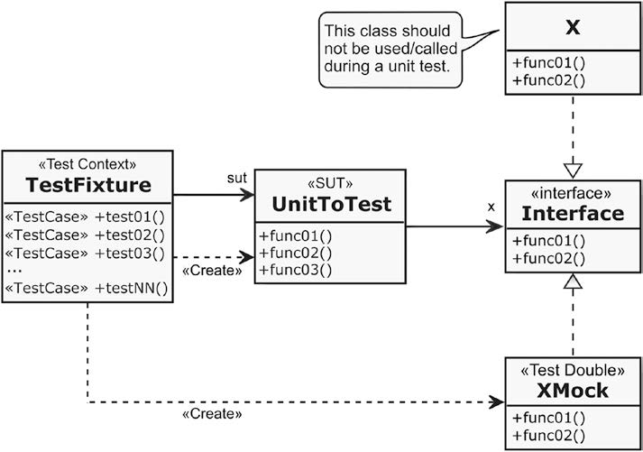<br>

## Chap 3: 原则
原则是一种规则或者指引你的观点, 并不是不可改变的法律, 有时编程必须故意违背其中一些原则, 只要我们有充分的理由, 但是这么做的时候要小心.
* 保持简单和直接: 避免做一些没有必要的复杂性工作, 即使很多时候内在的复杂性不可避免.
* 不需要原则: 总是在真正需要的时候才去实现它们, 确定真正需要的时候再写代码, 那时候重构依旧来得及
* 避免复制原则: 复制和粘贴是一个设计错误, **在一个系统内部, 任何一个知识点都必须有一个单一的/明确的/权威的描述**(知识点包括文档,测试计划和系统配置信息)
* 信息隐藏原则: 一个代码调用了另一段代码, 那么调用者不应该知道被调用者的内部实现.(和封装有一点点区别, 信息隐藏是帮助开发人员找到好的设计模式的原则, 封装是依赖于编程语言的技术, 用于限制对模块内部的访问, 封装有助于但并不保证信息隐藏)
* 高内聚原则: 当模块实现定义确切的功能时, 应该具有高内聚的特性,例如下面的例子中, 想要单独使用功能A/B/C 的时候都需要依赖整个 MyModule 模块, 这会导致太多的依赖, 可维护性也会相应降低:<br>
    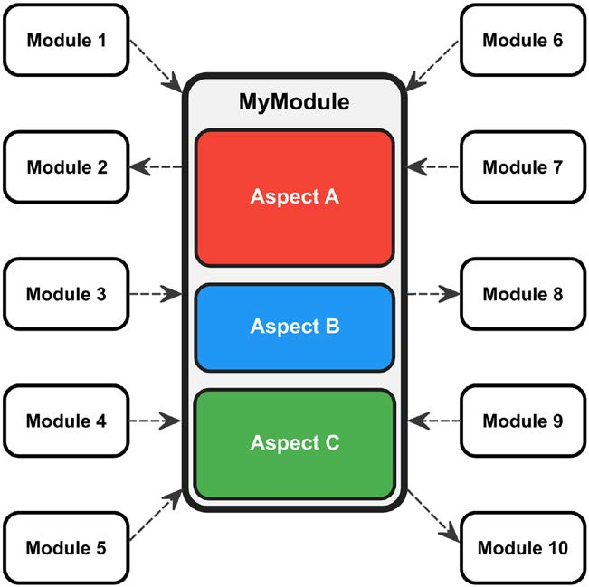<br>
    这个为了提高内聚性, 功能 A/B/C 应该彼此分离:<br>
    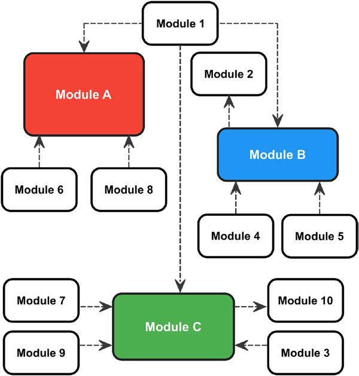<br>
* 松耦合原则: 我们构建的系统中, 每个模块应该很少使用或者不知道其他独立模块的定义. 如我们给一个灯设计开关, 如果开关依赖具体的类会是一个非常糟糕的设计:<br>
    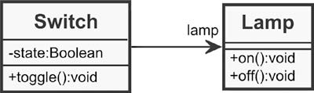<br>
    改进的办法也很简单, 关键是使用接口, 接口类似于一种契约, 声明类的公共行为, 而不涉及该类的具体实现.松耦合可以为系统的各个独立模块提供高的自洽性, 一般而言高内聚会促进松耦合.<br>
    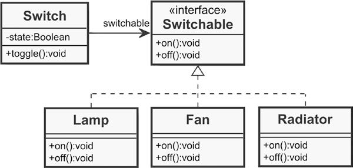<br>
* 最小优化原则: 只要没有明确的性能要求, 就避免优化. 必要的时候可以使用 Profiler 这类动态程序分析工具
* 最小惊讶原则: 不应该让用户对用户界面的意外响应而感到惊讶
* 童子军原则: 离开营地的时候, 应该让露营比你来的时候更干净. 一旦发现了容易引起混乱的东西, 应该立即处理.

## Chap 4: C++ 整洁代码的基本规范

如果还没有开始使用 C++11 的更高版本, 请立即开始使用.

### 良好的命名
源代码文件,命名空间, 类, 模板, 函数, 参数,变量和常量, 都应该有具体并且富有表现力的名称, 我们看一个反面的例子:
```C++
SbxInfo* ProcessWrapper::GetInfo( short nIdx ){
    Methods* p = &pMethods[ nIdx ];
    // Wenn mal eine Hilfedatei zur Verfuegung steht:
    // SbxInfo* pResultInfo = new SbxInfo( Hilfedateiname, p->nHelpId );
    SbxInfo* pResultInfo = new SbxInfo;
    short nPar = p->nArgs & _ARGSMASK;
    for( short i = 0; i < nPar; i++ ){
        p++;
        String aMethodName( p->pName, RTL_TEXTENCODING_ASCII_US );
        sal_uInt16 nInfoFlags = ( p->nArgs >> 8 ) & 0x03;
        if( p->nArgs & _OPT )
        nInfoFlags |= SBX_OPTIONAL;
        pResultInfo->AddParam( aMethodName, p->eType, nInfoFlags );
    }
    return pResultInfo;
}
```
这段代码一个主要的问题就是命名不佳, 如函数名 GetInfo() 非常抽象, 命名空间 `ProcessWrapper` 也不是很有帮助, 如果这个函数提取正在运行的进程信息, `RetrieveProcessInformation()` 就是个很好的名字, 此外函数还用 new 运算符创建新的东西, 为了强调这个事实, `CreateProcessInformation()` 也是一个更好的选择. 此外, 这个函数的参数和返回值都相对较为抽象.<br>
#### 名称应该自注释
所谓自注释代码, 就是不需要注释和解释其用途的代码, 这种自注释代码要求为它的命名空间/类/变量/常量和函数提供自我解释性质的命名. 
```C++
// 没有意义的命名例子
unsigned int num;
bool flag;
std::vector<Customer> list;
Product data;
// 对他们的一些改进
unsigned int numberOfArticles;
bool isChanged;
std::vector<Customer> customers;
Product orderedProduct;
// 太冗长的命名也是不恰当的
totalNumberOfCustomerEntriesWithMangledAddressInformation =
        amountOfCustomerEntriesWithIncompleteOrMissingZipCode +
        amountOfCustomerEntriesWithoutCityInformation +
        amountOfCustomerEntriesWithoutStreetInformation;
```

#### 使用域中的名称
领域驱动设计(Domain-Driven Design) 试图将业务领域中的事务和概念映射到代码中, 使你的软件称为一个真实系统的模型. 这可以促进开发人员与其他利益相关人员之间的沟通和交流. 如一个汽车租赁使用情况的类可以这样设计:
```C++
class ReserveCarUseCaseController {
public:
    Customer identifyCustomer(const UniqueIdentifier& customerId);
    CarList getListOfAvailableCars(const Station& atStation, 
                                   const RentalPeriod&  desiredRentalPeriod) const;
    ConfirmationOfReservation reserveCar(const UniqueIdentifier& carId, 
                                         const RentalPeriod& rentalPeriod) const;
private:
    Customer& inquiringCustomer;
};
```
**选择适当抽象层次的名称**:
为了控制软件系统的复杂性, 这些系统通常是分层的, 将整个问题分解为子任务, 直到软件开发人员确信他们能够处理这些较小部分, 每当我们在结构层次深入一层的时候, 元素的名称就会变得更加具体.<br>
**避免冗余的名称**:
例如将类型的名称放到成员变量名, 就是多余的, 如:
```C++
class Movie {
private:
    std::string movieTitle;// 一个类的成员, 没有必要加上类名
    std::string stringTitle;// 没有必要名字加上 String ,这相当于是小的自我重复
    // ...
};
```
**避免晦涩难懂的缩写**:
这会明显降低代码的可读性, 变量也应该容易发音. 如:
```C++
std::size_t idx; // Bad!
std::size_t index; // Good; might be sufficient in some cases
std::size_t customerIndex; // To be preferred, especially in situations where several objects are indexed
Car ctw; // Bad!
Car carToWash; // Good
```
**避免匈牙利命名和命名前缀**:
使用匈牙利命名法时, 变量的类型被用作该变量命名的前缀. 这种做法其实会带来一些问题, 例如:
* 我们可能在开发期间改变了变量的类型, 但是并没有将变量的前缀修正过来
* 在支持多态的面向对象程序设计语言中, 前缀不能轻易指定, 或者前缀会令人费解

**避免相同的名称用于不同的目的**

### 注释
比较专业的代码必须有适当的注释, 其他开发人员或者新团队成员可以轻松地理解代码的意图. <br>
**代码应该像是讲故事一样**:能够自我解释, 且尽可能避免注释. <br>
**不要为易懂的代码写注释**: 无用的代码注释本身就是代码的一种重复, 还有可能带来的问题就是代码已经被修改了, 但是相应的注释并没有被完全修改. 例如:
```C++
CustomerAccount* account = customer->getAccount(); // Retrieve the customer's account(这是很显然的)
account->setLoyaltyDiscountInPercent(discount); // Grant a 10% discount(这里代码和注释就不同了)
```
**不要通过注释禁用代码**:这除了增加代码的混乱程度外没有带来实际意义的好处. **除了快速进行测试之外, 不要通过注释禁用代码, 同时还需要有一个版本控制系统**.<br>
**不要写块注释**: 这种注释纯粹是引入混乱, 应该立即删除. 我们无需添加版权注释或者进行其他操作即可对自己的作品拥有版权, 如果要添加, 可以将它们放到独立的文件中. 此外, 不要使用注释代替版本控制, `git log --[filename]` 可以轻松查看到修改的历史记录.<br>
**特殊情况的注释是有用的**: 如果一段代码具有高度的内在复杂性, 以至于没有深入专业知识的人无法轻易理解, 那么注释就是合理的. 这时候可能故意偏离了良好的设计原则, 如违背了DRY. 下面是针对不可避免添加的注释的建议:
* 确保你的注释为代码增加了价值
* 应该解释为什么这样做, 而不是怎样做的
* 尽量做到注释尽可能短而且富有表现力

#### 从源代码生成文档
Doxygen 可以从文档生成提取文档, 为了获得有意义的文档, 代码必须以特定的注释格式进行注释. 如果不得不用这种风格注释, 建议**只关注公共API的部分**, 对于其他部分(如内部使用的模块或者私有功能), 不建议配备 Doxygen 注释.
```C++
//! Each customer must have an account, so bookings can be made. The account
//! is also necessary for the creation of monthly invoices.
//! @ingroup entities
//! @ingroup accounting
class CustomerAccount {
    // ...
    //! Regular customers occasionally receive a regular discount on their
    //! purchases.
    void grantDiscount(const PercentageValue& discount);
    // ...
};
```
这时候, 我们就可以用 `const PercentageValue` 替代 `unsigned short`,让参数可以自我解释.

### 函数
函数代表代码之上的第一个组织单位, 编写良好的函数可以显著提高程序的可读性和可维护性. 我们在设计优秀的软件时应该考虑下面的因素:<br>
**只做一件事情**: 一个函数, 必须定义一个非常清晰的任务或者功能,它应该用它的函数签名来表示. 下面是一些判断函数做了太多事情的标志:
* 函数体量比较大
* 如果试图为函数找到一个有意义的词语描述函数的功能的时候, 名字中无法避免使用连词(_and/or_)
* 圈复杂度比较高(包含太多的 if-else 或者 switch)
* 函数的输入参数比较多

**让函数尽可能小**: 函数应该尽可能小, 理想情况下是 5-6 行, 最多 12~15 行. 大函数使用起来, 通常有比较高的复杂性, 难以看出函数的作用, 此外也容易拥有比较多的职责. 当然, 如果一个包含单个 switch 语句的函数极其整洁也容易理解, 这也是可以接受的. 现代的 C++ 编译器已经非常擅长优化, 我们应该将时间花在真正地性能问题上(通常源于糟糕的结构和设计), 不用过于担心函数调用的开销.<br>
**函数命名**: 函数定义了程序的行为, 其名称都有动词, 一般都用动词开头. 如果用于提供信息, 通常用 is/has 开头, 下面是一些良好命名函数的例子:
```C++
void CustomerAccount::grantDiscount(DiscountValue discount);
void Subject::attachObserver(const Observer& observer);
void Subject::notifyAllObservers() const;
int Bottling::getTotalAmountOfFilledBottles() const;
bool AutomaticDoor::isOpen() const;
```
**使用容易理解的名称**(Intention-Revealing): 
函数名称应该很好地表达其目的或者意图, 而不是解释它的工作原理. 我们想要从 HTML 中提取标题, 可以用一行代码 `std::string head = html.substr(startOfHeader, lengthOfHeader);` 做到, 一个更好的做法是提供一个暴露目的的名称:
```C++
std::string ReportRenderer::extractHtmlHeader(const std::string& html) {
    return html.substr(startOfHeader, lengthOfHeader);
}
...
std::string head = extractHtmlHeader(html);
```
#### 函数的参数和返回值
Clean Code 中对于函数参数个数的建议: 理想的参数是 0 个, 接下来是 1 个, 接下来是 2 个, 尽可能避免使用三个参数, 超过 3 个就需要特别的证明, 或者无论如何都不应该使用. <br>
0 个参数包含了隐式参数(_this_), 函数没有参数一定程度上意味着副作用. 函数参数多了会带来一系列的问题:
* 除了内置类型, 每个参数都可能导致依赖关系
* 必须在函数内的某处处理每个参数(如果不是, 参数不是必须的, 应该马上删除), 这让函数变得十分复杂

本书的建议是, 函数的参数应该尽可能地少, 一个参数是比较理想的, 类的成员函数一般没有参数(这种函数一般用于操作对象内部的状态或者从对象中查询内容). <br>
**避免使用标志参数**: 函数根据标志参数的值选择执行不同的操作, 这背后其实是有问题的. 例如:
* 参数标志意味着函数引入了多条执行路径, 这意味着函数没有完全正确地完成一件事(违反单一职责原则)
* 函数在某个地方调用, 不分析函数体的话无法知道 true/false 究竟意味着什么

这种情况下有两种解决办法:
1. 提供单独的,命名良好的函数
    ```C++
    Invoice Billing::createSimpleInvoice(const BookingItems& items) {
        //... 这是简单的服务清单
    }
    Invoice Billing::createInvoiceWithDetails(const BookingItems& items) {
        Invoice invoice = createSimpleInvoice(items);
        //... 在这里, 做 detailed Invoice 额外的事情
    }
    ```
2. 对他们做特殊化处理, 使用多态改变实现不同细节的 Invoice:
    ```C++
    class Billing {
    public:
        virtual Invoice createInvoice(const BookingItems& items) = 0;
        // ... 在基类中声明接口
    };
    class SimpleBilling : public Billing {
    public:
        virtual Invoice createInvoice(const BookingItems& items) override;
        // ...
    };
    class DetailedBilling : public Billing {
    public:
        virtual Invoice createInvoice(const BookingItems& items) override;
        // ...
    private:
        SimpleBilling simpleBilling;
    };
    ```

**避免使用输出参数**: 输出参数就是用作函数返回值的参数, 使得函数可以一次传回多个值. 我们应该<font color=blue> 不惜一切代价也要避免使用输出参数</font>, 因为输出参数很不直观, 可能导致混淆. 这还会使得表达式的简单组合变得十分复杂, 开发人员需要在调用端保存所有的输出变量, 导致调用端的代码十分混乱. 此外, 这种函数对于减少副作用是很大的挑战. <br>
**不要传递或者返回 0 ( _NULL, nullptr_ )**: 返回 NULL 或者 _nullptr_ 让接收端十分困惑, 例如一个应该返回客户 handler 的函数返回了 nullptr, 调用端很难知道具体是客户不存在还是程序运行出了问题. 更主要的原因是,<font color=red>调用端必须检查并且处理它</font>, 太多的控制检查会降低代码的可读性增加其复杂性, 如果忘记了空指针检查, 接引用空指针直接带来应用程序的崩溃.
C++ 还有另一个重要的问题需要考虑: **对象的所有权**, 这种思想直接影响了 rust 等语言. 返回指针则直接将资源的责任强加给了调用者, 如果调用者没有正确处理指针, 可能导致严重的错误(内存泄漏/二次删除...).下面是一些避免使用指针的策略:
* 首先在栈上构造对象而不是在堆上: 从 C++ 11 move 语义的引入开始, 我们不必担心栈对象拷贝的昂贵成本
* 函数参数列表中, 使用 const reference 取代指针: 引用永远不会是 NULL
* 如果不可避免地处理指向资源的指针, 请尽可能使用智能指针
* 如果API返回原始指针, 有了依赖问题. 可以精心设计的 API, 提供创建资源工厂的方法, 并且提供了将资源交还给库以便安全和拓展处理的方法
* 正确地使用 const: 尽可能使用 const

### C++ 工程中的 C 风格代码
现代 C++ 中几乎已经完全没有 C 风格的编程习惯了. <br>
#### 使用 C++ 中的 _steam_ 和 _string_ 替换 C 中的 `char*`
C 中的 `char*` 在处理一系列的字符, 如果 结束符 `\0` 被意外覆盖, 可能会导致各种问题. 相对而言, `std::string` 和 `std::wstring` 有很多优点:
* string 自己管理字符串的内存, 可以相对轻松的复制/创建和销毁
* 他们是可变的, 可以轻松操作: 添加字符串或者单个字符/连接字符串/替换其中的部分
* 提供了方便迭代器的接口, 能够配合 `<algorithm>` 中的算法使用
* 和I/O stream 完美配合使用
* 适配 move 语义

只有极其少数的情况下才使用 C 风格的字符串:
* 不可变字符串: 这时候 `std::string` 没有优势
* 兼容 C 风格的 API 库

#### 避免使用 _printf() sprintf()_ 和 _gets()_ 等

* I/O 本身都是瓶颈, 因此 std::cout 相对 printf() 略慢几乎可以忽略不计. 
* `printf()` 是类型不安全的, 容易出错(当然 std::to_string() 对于 double 有时候也是不安全准确的)
* C++ 可以为复杂类型重载 `operator<<`, 如给类 Invoice 重载操作符:
    ```C++
    std::ostream& operator<<(std::ostream& outstream, const Invoice& invoice) {
        outstream << "Invoice No.: " << invoice.invoiceNumber << "\n";
        outstream << "Recipient: " << *(invoice.recipient) << "\n";
        outstream << "Date/time: " << invoice.getDateTimeOfInvoicingAsString() << "\n";
            outstream << "Items:" << "\n";
        for (const auto& item : invoice.invoiceLineItems) {
            outstream << " " << *item << "\n";
        }
        outstream << "Amount invoiced: " << invoice.getSum() << std::endl;
        return outstream;
    }
    ```

#### 使用标准库中的容器而不是 C 风格的数组
`std::array<TYPE, N>` 也是 fixed-size 的容器, 并且和 C 中的数组一样高效, 使用可以带来一系列的好处
* 它不是指针,因此没有指针相应的问题
* 我们知道容器中元素的个数, 而 使用数组的时候元素个数是必要信息, 需要和指针一起传递
* 它具有和 STL 一样兼容的接口(如可以使用各种迭代器和算法)
* 包括了边界检查, 给定索引值超出范围抛出一个 `std::out_of_bounds` 异常而不是终止程序

#### 使用 C++ 风格的强制类型转换
C++ 风格的类型转换会在编译期间进行检查, 而 C 不会, 这常常带来运行时错误. 另外一个原因是在程序中 C 风格的类型转换很不起眼, 而 C++ 风格的强制类型转换可以轻易被找到. <br>

#### 避免使用宏
显而易见.

## Chap 5: 现代 C++ 的高级概念
### 资源管理
对于软件开发人员而言, 管理资源(包括内存/访问硬盘或者其他介质的文件/网络连接/线程/其他的操作系统资源等) 是一项基本的任务. 但是发生异常之后, 不会回到函数体内, 如果捕获异常的某个分支没有释放资源,就会导致资源泄漏. 但是不是在任何时候, 我我们都能在栈上分配资源.<br>
**RAII**:
在类的构造函数中分配资源, 在析构函数中释放资源(资源申请即初始化).
```C++
template <typename RESTYPE>
class ScopedResource final {
public:
    ScopedResource() { managedResource = new RESTYPE(); }
    ~ScopedResource() { delete managedResource; }
    RESTYPE* operator->() const { return managedResource; }
private:
    RESTYPE* managedResource;
};
```
#### 智能指针
事实上我们不需要 reinvent the wheel, 上面那种包装器实际上就是 C++ 的智能指针.<br>
**具有独占所有权的 _std::unique_ptr<T>_** :
智能指针的使用非常类似于裸指针, 我们可以使用 `*` 和 `->` 操作符来简介引用指针. 更好的是, **智能指针可以很容易地放入容器中**(老式的智能指针`auto_ptr`已经被废弃, 其实现不支持 rvalue 引用和 Move语义), 也不能存储到 STL 库的容器中, `unique_ptr` 是其完美替代者. 此外, 不允许调用 `std::unique_ptr<T>` 的拷贝构造函数, 但是可以使用 Move 语义将资源转给另一个智能指针:
```C++
std::unique_ptr<ResourceType> pointer1 = std::make_unique<ResourceType>();
std::unique_ptr<ResourceType> pointer2; // pointer2 owns nothing yet
pointer2 = std::move(pointer1); // Now pointer1 is empty, pointer2 is the new owner
```
**共享所有权的 _std::shared_ptr<T>_** : 通过引用计数提供简单并且优先的垃圾回收功能, 这种智能指针可以拷贝, 也可以使用 `std::move`.<br>
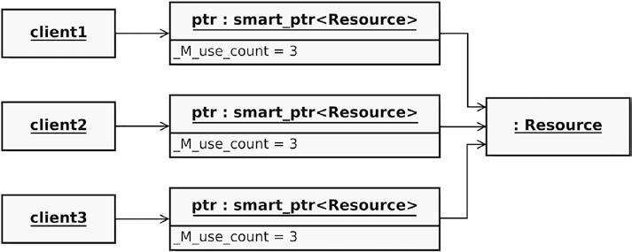<br>
**无所有权但是可以安全访问的 _std::weak_ptr<T>_** : 可以使用 get 得到裸指针, 但是此时如果 `shared_ptr<T>`在程序的某个地方被释放, 这种智能指针就变成野指针. 这时候我们可以使用 `std::weak_ptr<T>` 仅仅观察它指向的资源, 并且检查该资源是否有效.有下面几个具体的使用场景:
* 用于区分软件设计中的资源所有者和资源使用者, 在缓存等场合, 只需要资源完成特定的,有时间限制的任务
* 解决循环依赖的问题 

**避免使用 new/delete**: 在现代 C++ 编程中, new / delete 会增加代码的复杂度, 调用的时候需要注意异常情形/非默认情形/需要特别处理的情形... 我们可以通过以下的方式来避免:
* 尽可能使用栈内存
* 使用 make functions(`std::make_unique<T>` `std::make_shared<T>`) 在堆上分配资源
* 尽量使用容器(标准库容器, boost 容器等): 自己开发数据结构或者序列式容器的时候必须自己实现所有的内存管理细节
* 特殊需求, 利用特有的第三分库封装资源

### Move 语义
在很多情况下, 没有必要保持对象的完整性(创建一个深度的/在运行时效率方面十分耗时的复制,以便源对象保持可用). C++ 11 引入了新的语言特性, 相对于拷贝对象, Move 时候 **原对象的数据只是交给了目标对象, 而用于操作的参数(原对象) 被置于一种空的或者原始的状态**.<br>
**左值和右值**: lvalue 的一个更好的解释是它是一个 locator value, 这可以清楚地表明左值是一个在内存有位置的对象; 右值是一些表达式不是左值得对象, 它是一个临时对象或者子对象, 因为不能给由值赋值. <br>
C++ 11 引入了更多种类的定义(xvalue,gvalue,pvalue)支持 move 语义. 下面是几个常见的误区:
* 左值表达式的一种最简单的形式是类型的声明
    ```C++
    Type var1; /// var1 表达式就是左值类型, 下面这些定义也是
    Type* pointer;
    Type& reference;
    Type& function();
    ```
* 字面值`42` 就是一个右值, 右值也可以占用数据区的内存, 但是这个内存是暂时分配的, 而且赋值结束后就会马上释放
* 上面的 `function()` 是左值,我们可以写下面一段能够通过的代码
    ```C++
    int& function() {
        return theAnswerToAllQuestions;
    }
    int main() {
        function() = 23; // Works!
        return 0;
    }
    ```

**右值引用**: 临时的内存分配给右值引用后, 内存将变成是永久的了. 甚至可以用指针去指向这边内存, 然后再用该指针去操作内存.作为参数和返回值时候的类型推导可以参考effective Modern C++. <br>
**不要滥用Move**:
`std::move<T>()` 的函数名很有误导性, 事实上它并不是所有东西都应该用 move, 更多是对 T 类型的右值引用做强制类型转换. 大多数情况下使用 copy 版本的构造函数还是 move 版本的构造函数, 编译器会通过函数的重载解析进行自动选择. 将 `std::move<T>()` 作为返回值更是完全没有必要, 在影响代码可读性的同时, 让编译器无法正确执行其优化策略. <br>
**零原则**:
在过去有三大原则: **强调一个类应该显式定义其析构函数, 复制构造函数以及赋值构造运算符**, 随着 move 构造器的引入, 三大原则变成了五大原则. 如果没有显式定义构造函数, 编译器会生成一个默认的版本, 这种默认的实现只会创建一个对于源对象的潜拷贝. 此外, 在类中没有明显的理由去显式定义析构函数, 没有被迫定义析构函数, 意味着有个特殊的情况, 对象生命周期结束的时候需要花大量的精力对资源做特殊处理. 如果我们设计良好的类, 大量使用 C++ 标准库类和智能指针去管理资源时, 我们可以实现零原则:**在实现自定义类的时候, 应该不需要声明/定义 析构函数, 也不需要声明/定义 copy/move 构造器和 copy/move 赋值运算符**. 这背后的原则就是 KISS.<br>

### 编译器是你的搭档
#### 自动类型推导
auto 引入使得我们只需要写出 auto,const auto, auto&, const auto& , 剩下的工作交给编译器完成就可以知道赋值的类型, 代码依旧是静态的类型, 而且变量的类型依然是明确定义的. <br>
C++ 14 之后, 支持函数返回值类型推导, 这个对于处理复杂的非标准梳理类型作为返回值是十分有用的:
```C++
auto function() {
    std::vector<std::map<std::pair<int, double>, int>> returnValue;
    // ...fill ’returnValue’ with data...
    return returnValue;
}
```
这么做并不会降低代码的可读性, 反而能够增加. 因为没有必要显式重复类型, 在初始化的时候, 类型就很明显了, 重复反而是违反了 DRY 原则.

#### 编译时计算

C++ 11 的常量表达式说明符`constexpr` 使得在编译时计算出函数或者变量的值变成了可能, C++ 14 移除了对其的一些限制, 例如过去 `constexpr` 类型的函数只能拥有一个 return 语句, 这个限制在 C++ 14 中被废除. 
```C++
constexpr int multiply(const int multiplier, const int multiplicand) {
    return multiplier * multiplicand;
}
```
这种函数在编译阶段就可以调用, 但是在程序运行的时候, 他们也能像普通函数一样接受非常量类型的参数.C++14 废除一些限制之后, 这种函数基本支持所有的C++ 语句, 除非一些需要在运行时才能进行的操作,例如在堆上分配内存或者是抛出异常等.

#### 模板变量
在模板中也能使用 `constexpr`:
```C++
template <typename T>
constexpr T pi = T(3.1415926535897932384626433L);
```
这就是常说的模板变量, 是一个很好的/灵活替代宏定义变量的方法, 实例化的时候, 根据上下文决定字符常量 pi 的类型为 `float` `double` 或者 `long double`. 同样的, `constexpr` 类在运行和编译的时候都能用, 与常规类相反, 这种类中不允许定义虚函数(编译期间没有多态性), 并且其析构函数不能显式地定义出来(Effective C++ 中要求将析构函数定义为虚, 这和前面那条矛盾).
```C++
class Rectangle {
public:
    constexpr Rectangle() = delete;
    constexpr Rectangle(const double width, const double height) :
        width { width }, height { height } { }
    constexpr double getWidth() const { return width; }
    constexpr double getHeight() const { return height; }
    constexpr double getArea() const { return width * height; }
    constexpr double getLengthOfDiagonal() const {
        return std::sqrt(std::pow(width, 2.0) + std::pow(height, 2.0));
    }
private:
    double width;
    double height;
};
```

### 不允许未定义的行为
一个简单的 未定义行为(未正常使用智能指针) 的例子:
```C++
const std::size_t NUMBER_OF_STRINGS { 100 };
std::shared_ptr<std::string> arrayOfStrings(new std::string[NUMBER_OF_STRINGS]);
```
上面的例子中, 智能指针默认的删除操作是 `delete` 而不是 `delete[]`, 因此用智能指针管理一个 `new[]`分配的对象, 不确定会发生什么事情, 可能内存泄漏也可能不会, 与编译器的实现有关, 最终可能导致程序悄无声息地出错. 有集中方案可以考虑, 例如使用 std::vector 或者是 自定义一个删除器对象(仿函数):
```C++
template< typename Type >
struct CustomArrayDeleter{
    void operator()(Type const* pointer){
    delete [] pointer;
    }
};
const std::size_t NUMBER_OF_STRINGS { 100 };
std::shared_ptr<std::string> arrayOfStrings( new std::string[NUMBER_OF_STRINGS],
                                             CustomArrayDeleter<std::string>());
// C++ 11 中也有对 Array 的删除器对象
const std::size_t NUMBER_OF_STRINGS { 100 };
std::shared_ptr<std::string> arrayOfStrings(new std::string[NUMBER_OF_STRINGS],
                                            std::default_delete<std::string[]>());
```

### Type Rich 编程
人难以避免地犯错, 而类型系统就是一个检测错误的良好机制.C++ 中有下面这种成员函数的声明方式, 但是它不够好, double 的意思不是很明确:
```C++
class SpacecraftTrajectoryControl {
public:
    void applyMomentumToSpacecraftBody(const double impulseValue);
}
// 一点改进
class SpacecraftTrajectoryControl {
public:
    void applyMomentumToSpacecraftBody(const Momentum& impulseValue);
};
```
为了使用这种类型, 我们必须先引入该类型.首先我们创建一种需要三个指数作为参数才能实现的模板类, 然后定一种数据, 这种数据需要传入刚才的模板类特化后实例作为单位,同时存入一个数据作为其大小:
```C++
// 引入 K-M-S 单位制, 其中的三个 int 表示单位的指数
template <int M, int K, int S>
struct MksUnit {
    enum { metre = M, kilogram = K, second = S};
};
// Value 是表示值得类模板, 存了一个值(大小), 同时用 KMS 限制类型
template <typename MksUnit>
class Value {
private:
    long double magnitude{ 0.0 };
public:
    explicit Value(const long double magnitude) : magnitude(magnitude) {}
    long double getMagnitude() const {
        return magnitude;
    }
};
using Momentum = Value<MksUnit<1, 1, -1> >;
```
引入类型之后, 并未完全结束, 因为没有合适的构造函数将 double 转为 `Value<MksUint<1,1,-1>>`, 只能用这种写法:
```C++
SpacecraftTrajectoryControl control;
Momentum momentum { 13.75 };
control.applyMomentumToSpacecraftBody(momentum);
```
此外, 可以稍加改变加入关键字 `constexpr`, 就可以在编译时使用物理值进行计算,还能实现带类型的乘法和除法:
```C++
template <typename MksUnit>
class Value {
public:
    constexpr explicit Value(const long double magnitude) noexcept : magnitude{magnitude} {}
    constexpr long double getMagnitude() const noexcept {
        return magnitude;
    }
private:
    long double magnitude { 0.0 };
};
using Acceleration = Value<MksUnit<1, 0, -2>>;
constexpr Acceleration gravitationalAccelerationOnEarth { 9.80665 };
template <int M1, int K1, int S1, int M2, int K2, int S2>
constexpr Value<MksUnit<M1 + M2, K1 + K2, S1 + S2>> operator*
(const Value<MksUnit<M1, K1, S1>>& lhs, const Value<MksUnit<M2, K2, S2>>& rhs) noexcept {
    return Value<MksUnit<M1 + M2, K1 + K2, S1 + S2>>
        (lhs.getMagnitude() * rhs.getMagnitude());
}
constexpr Momentum impulseValueForCourseCorrection = Force { 30.0 } * Time { 3.0 };
SpacecraftTrajectoryControl control;
control.applyMomentumToSpacecraftBody(impulseValueForCourseCorrection);
```
这样坐下来, 我们可以 **让类型安全在编译期得到保障**, C++ 11 之后还允许自己定义后缀:
```C++
constexpr Acceleration operator"" _ms2(long double magnitude) {
    return Acceleration(magnitude);
}
constexpr Acceleration gravitationalAccelerationOnEarth = 9.80665_ms2;
```
我们应该创建强类型的接口, 很大程度上要避免在公共接口中使用通用的\底层的内置类型, 比如 int / double 或者最坏的 `void*`. 

### 了解你使用的库

如果你想提高团队代码的质量, 那么请用一个目标替代所有的编码指南: 没有原始循环.<br>
C++ 标准库提供了一百多种算法,可以用于搜索/计数和操作顺序容器或者序列中的元素.如想要颠倒标准容器中的元素顺序, 可以使用 `std::reverse`:
```C++
std::vector<int> integers = { 2, 5, 8, 22, 45, 67, 99 };
std::reverse(std::begin(integers), std::end(integers));
std::string text { "The big brown fox jumps over the lazy dog!" };
std::reverse(std::begin(text) + 13, std::end(text) - 9);
```
**C++ 17中有简单的并行算法**: C++ 11 开始所谓线程库就支持多线程和并行编程, 这个标准库引入了线程/互斥/条件变量和 futures. C++ 17 中部分标准库根据 C++ 并行扩展技术规范 进了重新设计.

### 恰当的异常错误处理机制
横切点问题指的是难以用模块化概念解决的问题, 通常用那个软件架构和设计来解决. 其中一个关键点就是安全问题, 还有一个关注点是事务处理(必须保证事务要么成功, 要么作为一个完整的单元失败,不可能只完成部分), 日志也是夜个关注点(douman-specific 和 productive被日志打乱,这会降低代码的可读性和可理解性).<br>
异常和作物处理是另外一个横切关注点, 怎样的策略指导异常抛出异常十分重要.
#### 防患于未然
处理错误和异常的基本策略是避免他们, 异常安全是接口设计的一部分, API 不但包括函数签名, 还应该包括函数可能抛出的异常部分.此外还有三个方面必须考虑:
* 前置条件: 在函数或者类的方法调用之前必须要总为真
* 不变式: 在函数调用过程中必须总是为真(如正方形的 `setLength()` 必须保证 `length==height`)
* 后置条件: 函数执行结束后立即返回真, 后置条件不成立, 说明函数调用的过程中肯定出错了

##### 无异常安全
最低的异常安全级别, 完全不能保证任何事情, 任何发生的异常都会导致严重的后果, 如代码的一部分违反了不变式和后置条件, 就可能导致崩溃. 所写的代码**永远不应该提供这个级别的安全保证**.
##### 基本异常安全
这是任何代码都应该至少保证的异常安全级别, 基本可以保证以下方面:
* 如果函数调用过程中发生了异常, 保证无资源泄露(RAII)
* 如果函数调用过程中发生了异常, 所有的不变式不保持不变
* 如果函数调用过程中发生了异常, 不会有数据或者内存损坏, 所有对象都是良好一致的状态,但是不能保证调用函数后数据的内容不变

设计我们代码, 让他们至少保证达到基本异常安全的级别.
##### 强异常安全
除了基本异常安全的所有事情之外, 还要确保发生异常的情况下, 数据内容完全恢复到调用函数或者方法之前一样, 一个典型的例子就是 _copy-and-swap_ 习惯, 这种实现**通常需要花一些功夫,运行时开销可能比较大**. 只有在绝对需要的情况下, 才为代码听强异常安全保证.
##### 保证不抛出异常
函数或者方法的调用用总是成功的, 不会抛出任何异常.所有事情在内部都已经得到处理, 永远也不会违反后置条件和不变式. 但是有很多情况下不可能达到, 例如在函数内使用任何一种动态内存分配, `new`/ `std::make_shared<T>`, 遇到异常的时候, 函数调用绝对不会成功.下面的情况是保证不抛出异常是绝对强制或者是明确建议的:
* 任何情况下应该保证类的析构函数必须绝对不抛出异常
* move 操作应该保证不抛出异常: move 抛出异常那么 move 操作大概率没有起作用
* 默认构造函数最好不抛出异常: 半构造对象可能违反不变式, 对象直接处于"腐败"状态, 也是非常危险的
* 在任何情况下, swap 函数必须保证不抛出异常

#### 异常就是 Literally 的异常
仅仅在于特殊情况下抛出异常, 不要滥用异常来控制正确地程序流程. 
#### 如果不能恢复请尽快退出
如果遇到的异常导致不能恢复, 通常的做法是写日志记录异常(如果可能)或者生成一个 crash dump 文件稍后分析, 然后立即终止程序. **没有什么比 "严重错误之后当作无事发生过继续下去" 更严重**, 比如生成数以万计的错误订单, 在灾难性的后果发生之前退出程序是明智地决定.
#### 用户自定义异常
我们可以通过继承 `std::exception` 创建自定义异常类, 通过重写继承的 `what()`, 可以为调用者提供错误的输出信息:
```C++
#include <stdexcept>
//...
class MyCustomException : public std::exception {
    virtual const char* what() const noexcept override {
        return "Provide some details about what was going wrong here!";
    }
};
```
事实上异常类的设计应该简洁, 为了提供更多异常相关的信息, 我们也可以编写更复杂的异常类:
```C++
class DivisionByZeroException : public std::exception {
public:
    DivisionByZeroException() = delete;
    explicit DivisionByZeroException(const int dividend) {
        buildErrorMessage(dividend);
    }
    virtual const char* what() const noexcept override {
        return errorMessage.c_str();
    }
private:
    void buildErrorMessage(const int dividend) {
        errorMessage = "A division with dividend = ";
        errorMessage += std::to0_string(dividend);
        errorMessage += ", and divisor = 0, is not allowed (Division by Zero)!";
    }
    std::string errorMessage;
};
int divide(const int dividend, const int divisor) {
    if (divisor == 0) {
        throw DivisionByZeroException(dividend);
    }
    return dividend / divisor;
}
int main() {
    try {
        divide(10, 0);
    } catch (const DivisionByZeroException& ex) {
        std::cerr << ex.what() << std::endl;
        return 1;
    }
    return 0;
}
```
但是只能保证上面的`buildErrorMessage` 是强异常安全的, 因为它使用了可能抛出异常的 `std::string::operator+=()`, **初始化构造函数不能保证不抛出异常**. <br>
使用异常的时候还有一些需要注意的事情:
* 值类型抛出异常, 常量引用捕获异常(参考 More Effective C++)
* 注意异常捕获的顺序(异常捕获和重载函数调用不同, 后者编译器会自动解析调用最合适的)

## Chap 6: 面向对象
### 面向对象的思想
面向对象是一种概念, 他要求开发人员以一种全新的方式看待这个世界. Dr. Alan Curtis Kay 认为, 对象像是生物细胞或者网络上的个人电脑, 智能通过消息通信. **OOP 意味着消息传递, 进程状态的本地保存 ,保护和隐藏以及后期绑定**.这种观点目前没有回答几个重要的问题:

* 如何找到并且生成细胞(对象)
* 如何设计这些细胞的公共可用接口
* 如何管理谁可以与谁互通消息(依赖关系)

###  抽象: 解决复杂问题的关键因素

OO 背后的基本理念是, 在软件设计开发中, 从与我们相关的领域对事务和概念进行建模. 可以用构建汽车相同的方式考虑复杂的软件系统, **分层次地分解为粗粒度到细粒度的模块, 提供更强的灵活性, 并且提供可重复性,可维护性和可测试性, 以下是进行这种分解的指导原则:
*  信息隐藏
*  高内聚
*  低耦合
*  单一责任原则(SRP)

### 类的设计原则
类被视为是封装了的软件模块, 它将结构特性(属性/数据成员/字段) 和 行为特性(成员函数/方法/操作) 组合成一个有聚合力的单元. 
#### Keep Classes Small
大类的问题是显而易见的, 如果类包含几千行代码, 那么他们很难被理解, 可维护性和可测试性通常都很差, 更不用说复用性了. Jeff Bay 的文章建议单个类的行数不超过 50行, 把类变小需要将它拆成很多小类, 但是这就是 OO. 但问题在于代码行数(LOC) 往往不是一个好的暗示, 一个更好的标准是类拥有多少项职责.
#### 单一职责原则(SRP)
SRP 规定, 每个软件单元,其中包括组件/类和函数, 应该只有一个单一并且明确定义的职责. 所谓职责就是 只有一个理由改变类. 这是一个比代码行数更好的标准.
#### 开放封闭原则
所有的系统在其声明周期内都会发生变化. 对于类的设计, 另一个重要的指南是开放封闭原则(OCP), 它指出软件实体(类/函数/模板等)对扩展应该是开放的, 但是对修改应该必须是封闭的. 这意味着扩展 **应该以优雅的方式实现, 而且以最可能小的代价, 最好是在不需要修改现有代码的基础上实现**. 面向对象中支持这一原则的一种方法就是继承, 这种设计的另一个优点是现在很容易提供一个测试替身.
#### Liskov 替换原则(LSP)
基本上, 里式替换原则说的是这么一件事情: 你不能通过给一条狗增加四条假腿来创造一只章鱼.<br>
正方形困境: 如果 Square 继承 Rectangle 的所有操作, 意味着可以通过 `Square.setHeight()` 违反 Square 的不变式(`{width == height}`). 有人希望将 `setEdge()/ setWidth()/ setHeight()` 声明为 virtual , 然后用其他实现覆盖这些成员函数, 这是非常糟糕的设计: **派生类不能删除器基类的继承属性** . Martin 阐述的 LSP 如下: **使用基类指针或者基类引用的函数, 必须在不知道派生类的情况下是用它**.于是这个原则有下面的要求:
* 类的前置条件不能在派生类中增强
* 类的后置条件不能在派生类中被削弱
* 基类的所有不变量都不能通过派生子类更改或者违反
* 历史约束: 对象内部的状态只能通过公共接口中的方法调用来改变, 派生类可能允许新的方法更改基类中那些不允许改变的状态, 这个历史约束就是禁止这一点

使用者必须知道他正在使用的是哪一种类型, 这可以通过运行时类型信息(RTTI, C++中有`typeid/dynamic_cast<T>`)来完成.<br>
这个正方形困境可以通过**使用组合而不是继承** 在很大程度上缓解:<br>
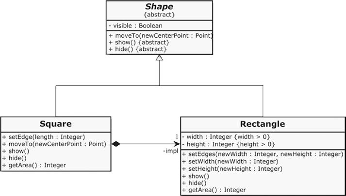<br>
这样的话, 我们在没有违背 DRY 和 LSP 原则的情况下, 实现了 Square 类, 这时候下面的错误就能被编译器检出:
```C++
std::unique_ptr<Rectangle> rectangle = std::make_unique<Square>(); // Compiler error!
```
**通过组合/委托复用 替代继承复用, 可以降低类之间的耦合程度**.
#### 接口隔离原则(ISP)
接口就像是一种契约, 通过契约请求服务, 服务由实现该契约的类提供. 当契约变得更加广泛的时候, 就会带来严重的问题. 如我们定义了鸟类的接口:
```C++
class Bird {
public:
    virtual ~Bird() = default;
    virtual void fly() = 0;
    virtual void eat() = 0;
    virtual void run() = 0;
    virtual void tweet() = 0;
};
// 而一个企鹅试图实现这个接口的时候就会出现问题
class Penguin : public Bird {
public:
    virtual void fly() override {
    // ??? A Penguin cannot fly
    }
//...
};
```
接口隔离原则要求:**接口不应该包含那些与实现类无关的成员函数, 或者这些类不能以有意义方式做到的实现**. 我们这时候应该将宽接口分离成小而内聚的接口:
```C++
class Lifeform {
public:
    virtual void eat() = 0;
    virtual void move() = 0;
};
class Flyable {
public:
    virtual void fly() = 0;
};
class Audible {
public:
    virtual void makeSound() = 0;
};
class Sparrow : public Lifeform, public Flyable, public Audible {
//...
};
class Penguin : public Lifeform, public Audible {
//...
};
```
#### 无环依赖原则
如果需要两个类互相认识, 例如 顾客和账户, 可能就会出现相互依赖的问题, 例如下面的例子就无法通过编译:
```C++
// in file Customer.h
#ifndef CUSTOMER_H_
#define CUSTOMER_H_
#include "Account.h"
class Customer {
    // ...
private:
    Account customerAccount;
};
#endif
// in file Account.h
#ifndef ACCOUNT_H_
#define ACCOUNT_H_
#include "Customer.h"
class Account {
private:
    Customer owner;
};
#endif
```
<br>
当然我们在前面放前置声明, 并且将类中存放的类的实例用一个指针替代. 但是 **前置声明用来处理循环依赖是一个非常糟糕的问题**: 这意味着两个类相互依赖, 不能独立使用, 也不能彼此独立地测试. 环依赖关系总是可以打破, 下面是一些可以使用的原则.

#### 依赖倒置原则(DIP)
**接口是我们处理环依赖问题的好帮手**. 解决这个问题的第一步就是 不再允许两个类的其中一个直接访问另一个类, 只允许通过接口访问. 例如在这里我们引入 Owner 接口:<br>
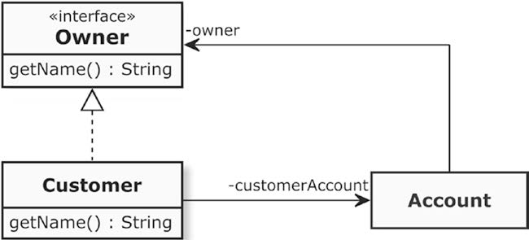<br>
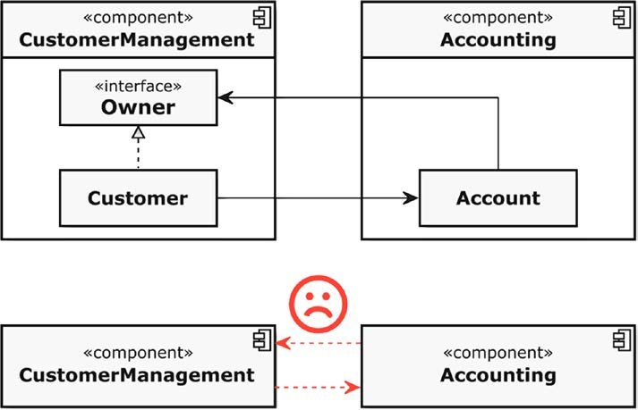<br>
这时候, Account 类已经对 Customer 类一无所知, 但是组件之间的环依赖尚未被打破,两个组件关联关系还是一个组件中的元素到另一个组件中的元素. 这个解决办法也十分简单: 只需将 Owner 接口重新定位到另一个组件中:<br>
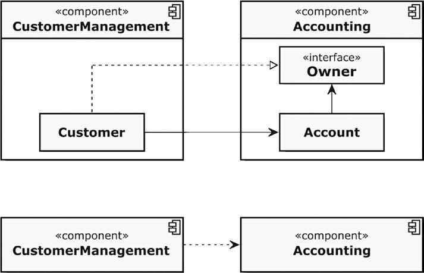<br>
这时候实际上的依赖关系并没有完全被颠覆, 我们引入接口实际上在类的级别上甚至多了一层依赖关系, **我们真正做的就是在颠倒这种依赖性**. Robert C. Martin 制订了如下规则:
* 高级模块不应该依赖于低级模块, 两者都应该依赖于抽象
* 抽象不应该依赖于细节, 而细节应该依赖于抽象

高级和低级不一定指的是分层结构中的概念, 高级模块是需要来自其他模块提供外部服务的软件模块, 提供服务的就是所谓的低级模块.或者说高级模块是调用操作的模块, 低级模块是其内部功能被高级模块调用执行的模块. 

#### 最少知识原则(Demeter 原则)
如果一个汽车驾驶员在驾驶的时候直接操作骑车的底层部分(打开燃油泵/打开点火系统/让马达转起来), 这个过程将十分复杂难以应对变化, 如内燃机被店里系统取代:<br>
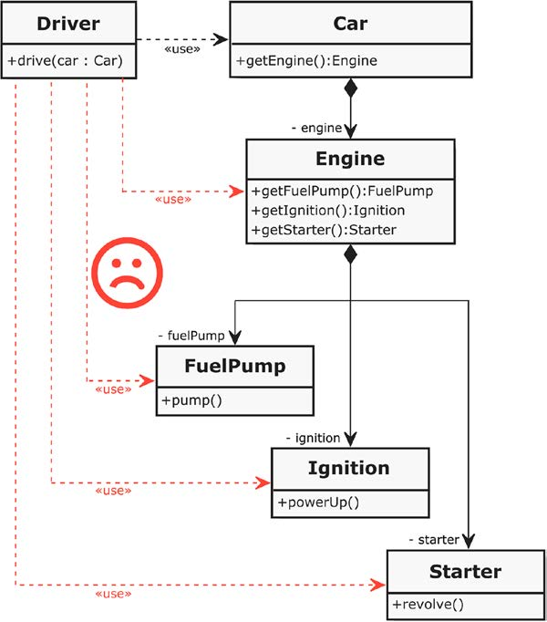<br>
本质上说上面这种软件设计违反了最少知识原则, 这个原则可以认为是像不要和陌生人说话, 这种法则假定以下规则:
* 允许成员函数直接调用其所在类作用域中的其他成员函数
* 允许成员函数调用其所在类作用域中成员变量的成员函数
* 如果成员函数有参数, 允许成员函数直接调用这些参数的成员函数
* 如果函数创建了局部对象, 则允许成员函数调用这些局部对象的成员函数

**如果上述函数中的一种返回了一个结构上比该类的直接相邻元素更远的对象, 应该禁止调用这些对象的成员函数**.<br>
这种情况下驾驶员对于汽车零件烦人的依赖性就消失了, 无论汽车内部的结构如何, 他都能启动汽车.<br>
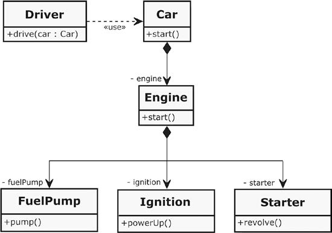<br>
可能有一些例外但是合理的情况, 但是开发人员必须给出非常好的理由才有改变这一规则.<br>
#### 避免贫血症
有的类很傻, 只代表软件系统中的客户不包含任何逻辑, 逻辑在其他的位置, 写这个类的程序员将对象看成是一堆数据的包装, 相应的 setter/ getter 都特别傻, 实际上只需要用一个简单的结构体就能取代, 这种类称为贫血类,应该不惜一切代价避免写这样的类, 因为面向对象思想要求将 **数据和操作数据的功能组合成有凝聚力的单元**. 下面是一个贫血类例子:
```C++
class Customer {
public:
    void setId(const unsigned int id);
    unsigned int getId() const;
    void setForename(const std::string& forename);
    std::string getForename() const;
    void setSurname(const std::string& surname);
    std::string getSurname() const;
    //...more setters/getters here...
private:
    unsigned int id;
    std::string forename;
    std::string surname;
    // ...more attributes here...
};
```
#### 只说不问
这是对那些 get-methods 的 “declaration of war”, 该原则加强了类的封装和信息隐藏, 首要的作用还是增加了类的内聚性. 下面是在此原则指导下对于引擎启动的改进, 原来的 start 方法从各个部分查询信息并且做出相应, 分支数量众多, 圈复杂度非常高, 改进之后,零件可以自己决定如何执行这些命令:
```C++
// 原来的实现
class Engine {
public:
    // ...
    void start() {
        if (! fuelPump.isRunning()) {
            fuelPump.powerUp();
            if (fuelPump.getFuelPressure() < NORMAL_FUEL_PRESSURE) {
                fuelPump.setFuelPressure(NORMAL_FUEL_PRESSURE);
            }
        }
        if (! ignition.isPoweredUp()) {
            ignition.powerUp();
        }
        if (! starter.isRotating()) {
            starter.revolve();
        }
        if (engine.hasStarted()) {
            starter.openClutchToEngine();
            starter.stop();
        }
    }
    // ...
private:
    FuelPump fuelPump;
    Ignition ignition;
    Starter starter;
    static const unsigned int NORMAL_FUEL_PRESSURE { 120 };
};
class Engine {
public:
    // ...
    void start() {
        fuelPump.pump();
        ignition.powerUp();
        starter.revolve();
    }
// ...
private:
    FuelPump fuelPump;
    Ignition ignition;
    Starter starter;
};
class FuelPump {
public:
    // ...
    void pump() {
        if (! isRunning) {
            powerUp();
            setNormalFuelPressure();
        }
    }
// ...
private:
    void powerUp() {
    //...
    }
    void setNormalFuelPressure() {
        if (pressure != NORMAL_FUEL_PRESSURE) {
            pressure = NORMAL_FUEL_PRESSURE;
        }
    }
    bool isRunning;
    unsigned int pressure;
    static const unsigned int NORMAL_FUEL_PRESSURE { 120 };
};
```
这个原则告诉我们, **如果对象能够自行决定, 那我们不应该要求对象提供关于其内部状态的信息, 并在此对象之外决定应该做什么**.并非所有的 getter 本质上都是不好的, 优时需要从对象获取信息, 就应该有 getter.
#### 避免类的静态成员
工具类常常是巨大的"上帝类", 我们为什么要强制工具类创建它的实例, 为不同的目的提供各种各样的功能:这其实是低内聚的标志, 我们称这种东西为 **垃圾商店反模式**. 
```C++
class JunkShop {
public:
    // ...many public utility functions...
    static int oneOfManyUtilityFunctions(int param);
    // ...more public utility functions...
};
// In the Client File
#include "JunkShop.h"
class Client {
    // ...
    void doSomething() {
        // ...
        y = JunkShop::oneOfManyUtilityFunctions(x);
        // ...
    }
};
```
这让客户和垃圾商店中所有静态工具建立了硬连接, 很难用其他东西替换这个函数调用, 这是单元测试所不希望的. 另外在所有类的实例中共享相同的状态本质上不是 OOP, 它破坏了封装, 使得对象不再完全控制器状态. 因此我们**建议避免使用静态的成员变量和静态成员函数**. 这有两个常见的例外:
* 私有常量成员
* 工厂方法(创建对象实例的静态成员函数)

//TODO: 函数式编程暂时跳过

## Chap 8: 测试驱动开发(TDD)
如果项目距离交付的时间越来越短, 那么团队开发通常放弃的第一件事情就是重要的测试. 
### 普通的旧单元测试的缺点
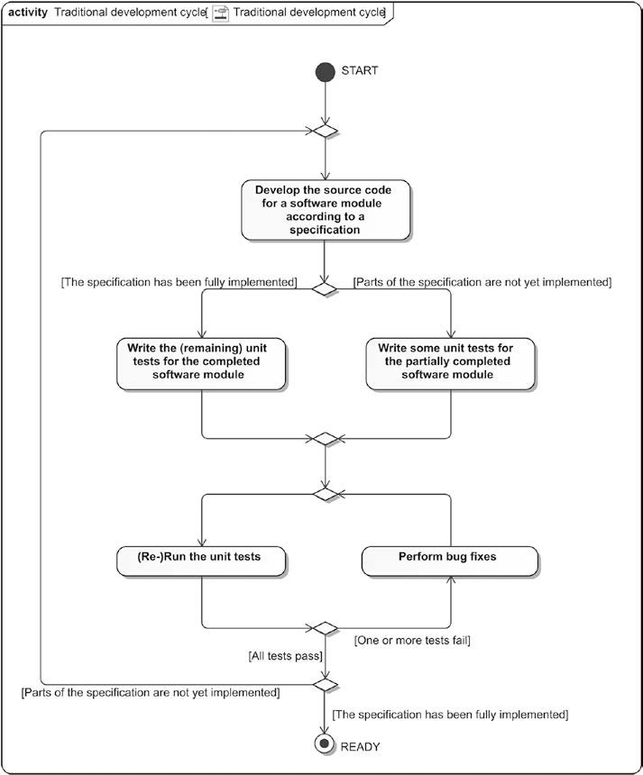<br>
过去广泛使用老式的单元测试(POUT,Plain Old Unit Testing), 这意味着软件是代码优先而不是测试优先,这比没有单元测试要好, 但是依旧有一些缺点:
* 之后没有必要写单元测试: 一旦一个功能工作, 用单元测试改进代码的动机就很小了
* 结果代码很难测试: 用单元测试改进现有代码并不容易, 因为原始代码的课测试性不被重视, 会导致紧耦合代码的出现
* 难以通过改进的单元测试达到较高的测试覆盖率

### 颠覆者: 测试驱动开发
TDD 在相关的的测试代码没有编写之前不允许编写产品的代码, 于是开发过程便严格按照下面的方式进行:**当编写完每个测试之后, 只编写足够让以上测试通过的代码, 直到所有的模块需求开发结束**.<br>
#### TDD 的流程
