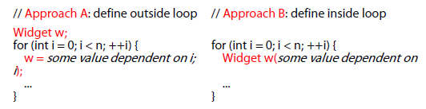
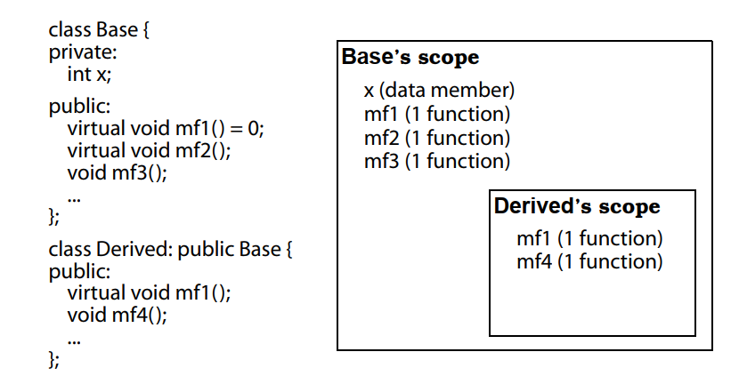
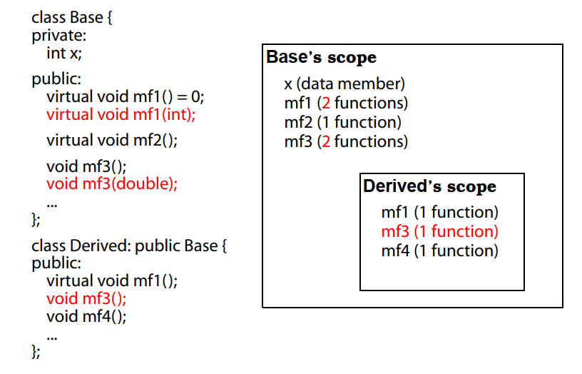
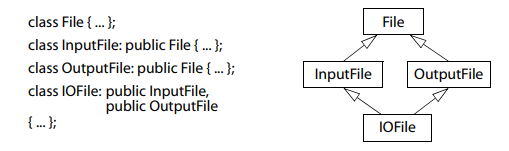
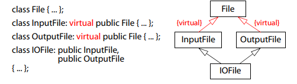

# Effective C++ :  改善程序与设计的55个做法

## Accustoming Yourself to C++

### Item 1 视C++为一个语言联邦
C++为一个多范式的编程语言，同时支持过程形式、面向对象形式、函数形式、泛型形式和元编程形式。为了避免误解，最好将它看成语言的联邦而不是单个语言，互相之间迁移时候，守则可能发生变化。

- C ： 只用其中的C成分工作的时候，高效编程的守则和C相同，没有模板、异常和重载。。。
- Object-Oriented C++ : 面向对象设计的时候，有class(构造、析构)、封装、继承、多态和虚函数（动态绑定）。。。
- Template C++ : 带来了元编程的范式，和TMP的相关规则和主流C++相互之间的影响很小。
- STL：使用template的库，对容器、迭代器、算法和仿函数之间的规约有紧密的配合与协调。

### Item 2 以编译器替换预处理器
```C++
    #define ASPECT_RATIO 1.653
```
在编译前将所有ASPECT_RATIO都替换成了1.653，编译错误的提示信息也是1.653，十分迷惑。
```C++
    const double AspectRatio = 1.653;
```
常量的定义有两点值得注意的：

- 顶层指针（指针指向同一个可变对象）和底层指针（无法通过指针修改对象），同时string比char * based 字符串要好
- class专属的常量，为了将作用域限制在class内部，让它作为member data，同时为了常量只有一个实体，让它成为一个静态成员

旧的编译器不支持static成员在其声明时候获得初值，则可以将初值放在定义式中
```C++
// in the header file
class ConstEstimate{
    private:
        static const double FudgeFactor;
    ...
};
// in the implementation file
const double ConstEstimate::FudgeFactor = 1.35;
```
还有一种情况，就是在class编译期间需要一个常量，但是编译器不允许static整型完成in class初值，使用**enum hack**的补偿做法：
```C++
class GamePlayer{
    private:
        enum{NumTurns = 5};
        ...
        int Scores[NumTurns];
        ...
};
```
对这种trick，我们需要了解，该行为比较像`#define`而不是const，给const取地址是合法的，但是给enum和define取通常都是不合法的。<br>
预处理会带来一些问题，如
```C++
#define CALL_WITH_MAX(a,b) f(((a)>(b)) ? (a) :(b))
CALL_WITH_MAX(++a,b);// a会被累加2次
```
这种时候可以写出template的inline函数：
```C++
template<typename T>
inline void callWithMax(const T&a, const T&b){
    f(a>b ? a :b);
}
```
- 对于单纯的常量，最好用const和enum替换#define
- 对于函数的宏，最好用inline函数替换#define

### Item 3 Use const whenever possiable
const允许语义约束，指定变量不可更改，编译器会强制试试这项约束，只要这是事实，就应该明确要求，让编译器保证该约束不会被违反。对于顶层指针和底层指针，只要记住：如果const出现在*左边，则被指向的对象是一个常量，而右边则表示指针本身是一个常量。
```C++
void f1(const Widget* pw);
void f2(Widget const* pw);
//两者意思相同，都是指向一个Widget类型常量的指针
```
对于迭代器，也有类似的做法，如果希望迭代器指向的数据不可变动，可以声明为const_iterator,如果希望迭代器本身不可变，声明为const。当然，const威力最大的场景在于函数声明中：
```C++
class Rational{...};
const &Rational operator*(const Rational& lhs,const Rational& rhs);
```
如果不声明为const，那么客户就可以这样写：
```C++
Rational a,b,c;
...
(a*b) = c; // 用c给a*b的结果赋值，加了const之后返回一个const Rational那么就会找出这个错误
```
#### Const menber function
将成员函数声明为const的一个很大的作用是，使得该函数可以操作const对象。pass by reference-to-const的一个前提就是可以用const修饰成员函数，<font color=red>否则一般的函数操作const对象，编译器无法得知它是否会改变对象的值，因此报错。</font>
```C++
class TextBlock {
public:
    ...
    const char& operator[](std::size_t position) const // operator[] for
        { return text[position]; } // const objects
    char& operator[](std::size_t position) // operator[] for
        { return text[position]; } // non-const objects
private:
    std::string text;
};
```
值得注意的的是，函数返回的是一个reference to char，如果只是返回char，那么它是local变量，对它赋值没有意义。成员函数为const有两个流行概念，物理const 和 逻辑const:

- menber function只有在不改变对象的任何成员变量时候才可以说是const，但是实际上，通过指针可能可以改变对象成员的值。（编译器强制）
- 逻辑const:const成员函数可以修改对象的某些bits，但是只有在客户端侦测不出时候才可以如此（写程序遵循的守则）

C++中有个与const相关的wiggle room叫做mutable, 它将释放掉non-static成员变量的bitwise constness,
```C++
class CTextBlock {
public:
    ...
    std::size_t length() const;
private:
    char *pText;
    mutable std::size_t textLength; // these data members may
    mutable bool lengthIsValid;     // always be modified, even in
};                                  // const member functions
std::size_t CTextBlock::length() const
{
    if (!lengthIsValid) {
    textLength = std::strlen(pText); // now fine
    lengthIsValid = true; // also fine
    }
    return textLength;
}
```
#### const 和 non-const成员函数中避免重复
如果member function不单返回一个reference指向字符，而且做了很多操作，那么重载函数就变得非常复杂并且没有必要，我们真正要做的是实现一次，然后通过常量性转除去实现：
```C++
class TextBlock {
public:
    ...
    const char& operator[](std::size_t position) const // same as before
    {
        ...
        return text[position];
    }
    char& operator[](std::size_t position) // now just calls const op[]
    {
        return
        const_cast<char&>( // cast away const on op[]’s return type;
                static_cast<const TextBlock&>(*this) // add const to *this’s type;
                [position]                           // call const version of op[]
        );
    }
...
};
```
实际使用的过程中，为了避免no-const operator[]递归调用自己，先将*this从原始的TextBlock& 做static_cast成为const TextBlock&，然后从const operator[]的返回值中移除const。但是，反过来做是不建议的，因为使用const_cast去掉了const的性质之后，操作十分不安全。

### Item 4 确定对象使用前已经被初始化
C++初始化问题：
```C++
int x;  //大多数平台确定了x被初始化
class Point{
    int x,y; 
};
...
Point p;// 数据成员x,y没有被初始化
```
一般而言，C part of C++初始化可能导致运行期成本，不保证发生初始化，non-C parts of C++，规则就相反。内置类型在使用之前将它初始化，对于内置类型之外的类型，初始化<font color=red>由构造函数负责，确保构造函数将对象的每一个成员都初始化。</font>构造函数比较好的写法是member initialization list替换赋值动作.<br>
目前我们奉行的规则是: **确保每一个构造函数都将对象的每一个成员初始化** , 这需要我们不要混淆赋值和初始化,他们之间的区别在于, 赋值是在对象创建之后给他们的值,而初始化是在对象创建的时候给予初值:<br>
```C++
ABEntry::ABEntry(const std::string& name, 
                 const std::string& address,
                 const std::list<PhoneNumber>& phones)
: theName(name),
  theAddress(address), // these are now all initializations
  thePhones(phones),
  numTimesConsulted(0)
{} // the ctor body is now empty
```
上面的做法被称为member initialization list, 对大多数类型而言, 使用它比调用default构造函数再调用copy assignment操作符 要更加高效, 甚至想要default构造成员变量, 都可以使用成员初始列, 只要指定nothing为初始化实参,我们要规定总是在初值列中列出所有的成员变量, 以免需要记住哪些成员变量可以无需初值.
```C++
ABEntry::ABEntry()
:   theName(), // call theName’s default ctor;
    theAddress(), // do the same for theAddress;
    thePhones(), // and for thePhones;
    numTimesConsulted(0) // but explicitly initialize numTimesConsulted to zero
{} // 
```
有些情况下,面对的成员变量是`const`或者 _reference_, **他们就一定要初值,并且不能被赋值**,必须在成员初值列中赋值,此外要注意成员初值列中条列各个成员,最好按照以其声次序排列.<br>
不同编译单元内non-local static对象的初始化顺序:
* static对象, 寿命是沟造出来到程序结束为止, 包括global对象,定义在namespace作用域之内的对象,以及各种作用域中声明为static的对象.
* 编译单元, 就是产出单一目标文件的哪些源代码, 基本就是一个源代码文件加入其所含入头文件

**C++对于定义在不同的编译单元中的non-local static对象初始化次序并没有明确的定义**, 使用一个小的设计去消除定义次序的问题, 可以将non-local static对象搬到自己的专属函数内, 函数返回一个reference指向该对象, 用户调用这个函数,而不是直接涉及这些对象.
```C++
    class FileSystem { ... }; // as before
    FileSystem& tfs() // this replaces the tfs object; it could be
    { // static in the FileSystem class
        static FileSystem fs; // define and initialize a local static object
        return fs; // return a reference to it
    }
    class Directory { ... }; // as before
    Directory::Directory( params ) // as before, except references to tfs are
    { // now to tfs()
        ...
        std::size_t disks = tfs().numDisks();
        ...
    }
    Directory& tempDir() // this replaces the tempDir object; it
    { // could be static in the Directory class
        static Directory td( params ); // define/initialize local static object
        return td; // return reference to it
    }
```
这些函数一般只有两行, 是很好的inline函数例子, 但是需要注意的是, 含有static对象使得他们在多线程系统中有不确定性,处理的做法是: **在程序的单线程启动阶段手工调用所有的reference-returning函数, 这样可以消除与初始化有关的竞速形式**.

***
## 构造、析构和赋值操作

### Item 5 了解C++默认编写并且调用了哪些函数
如果自己没有声明，那么编译器就会为它声明下面几个函数：
- 默认构造函数
- copy 构造函数
- copy assignment 操作符
- 析构函数
```C++
Empty e1;       // default constructor;
                // destructor
Empty e2(e1); // copy constructor
e2 = e1;      // copy assignment operator
```
需要注意的是，编译器自身产生的destructor是一个non-virtual的析构函数，除非base class自己声明有virtual的析构函数。<br>
当我们写了一个构造函数的时候，编译器不会生成默认沟赵函数，但是因为没有copy构造函数和copy赋值operator，编译器依旧会自己默认一个。<br>
编译器生成的copy 构造函数将传入的object每个data member为初值设定新object的值。万一有条件不符合，编译器拒绝给class生成operator=.<br>
例如，我们有一个class包含两个data member，一个referce to string，一个const T，那么使用这个class实例化两个实例，a,b，令a = b 就会出问题，因为reference自身不可变动，而const T也不能再赋值，这种情况下编译器不知道如何生成一个copy assignment operator。

### Item 6 如果不想用编译器自动生成的函数，就应该明确拒绝

有的使用场景中，不允许拷贝赋值和拷贝assignment operator，我们不主动拒绝的话，编译器会声明我们不想要的函数。这种时候一个常见的做法是将copy constructor和copy assignment operator声明为private，这样的话member function和friend function还可以调用他们，如果足够聪明，只声明不调用的话不慎调用会得到一个linkage error.
```C++
class HomeForSale{
    public:
        ...
    private:
        HomeForSale(const HomeForSale&);
        HomeForSale& operator=(const HomeForSale&);
};
```
更好的做法是将这种东西放到一个base类中，然后HomeForSale用private的方式继承该类，这样任何人，<font color=red>甚至是member函数或者friend函数</font>都无法尝试拷贝该对象。使用该方法可能会引发多继承的问题，涉及的empty base class optimization，这将在Item 39、40中讨论。

### Item 7 为多态基类声明virtual析构函数
在很多时候，我们使用指针得到一个derived class对象，而那个对象却经过一个base class的指针被删除，带来的问题是诡异的“局部销毁”，而derived class的析构函数没有被调用。解决该问题的方法十分简单，<font color=red>给base class一个virtual析构函数</font>.
```C++
class TimeKeeper{
    public:
        TimeKeeper();//默认构造函数
        virtual ~TimeKeeper();
        ...
};
TimeKeeper* ptk= getTimeKeeper();
...
delete ptk;
```
这并不意味着virtual函数很好，对于不作为base class的情况，virtual析构函数会带来一系列的问题，没有virtual析构函数的情况下，一个自己定义的Point2D对象可以作为一个64-bit的量传给c/fortran,对于virtual函数，对象必须携带某些信息，用于决定哪个virtual函数会被调用，这种事由virtual table pointer(vptr) 的机制实现。因此，一般而言，只有带class内至少有一个virtual函数的的时候，才为它声明virtual析构函数。<br>
同样的，对于不带virtual析构函数的class，包括所有的STL容器（vector,list,set,unordered_map)和std::string，不要从他们那里继承。<br>
class带一个pure virtual析构函数，pure virtual函数导致抽象class，不能被实例化。如果希望得到类似的class又没有其他的纯虚函数，可以给class声明一个纯虚的析构函数：
```C++
class AMOV{
    public:
        virtual ~AMOV()=0;  // pure virtual destructor
}
AMOV::~AMOV(){ }  // 必须为这个pure virtual析构函数提供一份定义
```
当然，这些性质的讨论都是适用于<font color=red>polymorohic base class</font>, 但是并非所有的base class设计都是为了多态用途，他们不需要virtual析构函数。

### Item 8 别让异常逃离析构函数
```C++
class Widget {
    public:
        ...
        ~Widget() { ... } // assume this might emit an exception
};
void doSomething(){
    std::vector<Widget> v;
    ...
}                           // v is automatically destroyed here
```
只要析构函数突出异常，即使并非使用容器或者vector，程序也可能过早结束或者出现不明确的行为。如果析构函数必须执行某个动作，而该动作可能在失败时抛出异常，这种情况该怎么办？<br>
```C++
class DBConnection {
    public:
        ...
        static DBConnection create(); // function to return
        // DBConnection objects; params
        // omitted for simplicity
        void close(); // close connection; throw an
}; // exception if closing fails
class DBConn { // class to manage DBConnection
    public: // objects
        ...
        ~DBConn() // make sure database connections
        { // are always closed
                db.close();
        }
    private:
        DBConnection db;
};
```
一个做法是使用另一个class，这个class包含DBConnection的数据，并且在析构函数中调用close(),如果程序正常运行，那么这个部分没有问题，如果close()出错，那么这依旧会导致异常离开析构函数，有两个办法可以解决这个问题：

- close()抛出异常就结束程序
- 吞下调用close()发生的异常

但是这两种做法都没有吸引力，更好的做法是重新设计DBConn的接口，如提供一个close()，赋予客户操作”因该操作而发生的异常“，并且追踪管理的connect是否关闭，否的话由connect的析构函数将它关闭。
```C++
class DBConn {
    public:
        ...
        void close(){ // new function for client use 
            db.close();// 这个地方可能导致异常
            closed = true;
        }
        ~DBConn(){
            if (!closed) {
                try { // close the connection
                db.close(); // if the client didn’t
                }
                catch (...) { 
                // if closing fails, make log entry that call to close failed; 
                // note that and terminate or swallow
                ... 
                }
            }
        }
    private:
        DBConnection db;
        bool closed;
};
```
### Item 9 不要在构造和析构函数中调用virtual函数
**Java /C#在这方面和C++不同** derived的构造函数调用之前，base的构造函数一定会更早调用。这个时候，我们在derived class构造函数中调用virtual的函数，先构造base class期间virtual函数不会到derived class的那层，<font color=red>这时候构造期间的virtual函数就不是virtual函数（没有多态）</font>。就是在base class构造期间，对象的类型是base class 而不是derived class。<br>
同样的道理，derived class进入base析构函数中就成了一个base对象，C++的任何部分，virtual 函数、dynamic_cast等等也将它视为是一个base class。<br>
避免此类问题的做法是:**确定构造函数和析构函数都没有调用virtual函数，并且它们调用的函数也服从这个约束。**<br>
此外还有其他方案：在base class中的log函数改成non-virtual，然后要求derived class传递必要的信息给base class的构造函数，之后构造函数就可以安全的调用non-virtual版本的log函数同时在不同的derived class中Log不同。

### Item 10 令operator=返回一个reference to *this
赋值的时候，人们常常将这个写成一个连锁形式：
```C++
int x,y,z;
x = y = z = 15;
//赋值时候的右结合，转义为x = (y = (z=15))
```
为了实现这种行为，赋值操作符必须返回一个reference指向操作符左侧实参：
```C++
class Widget{
    public:
        Widget& operator = (const Widget& rhs){
            ...
            return *this;
        }
    ...
};
```
对于其他赋值相关的运算，`+=` 和 `-=` 之类，也建议遵循这个规则。

### Item 11 在operator=中处理“自我赋值”
自我赋值就是对象自己给自己赋值,大多数时候自我赋值并不是那么明显：
```C++
class Widget { ... };
Widget w;
...
w = w; // assignment to self
a[i] = a[j] //潜在自我复制，i可能等于j
*px = *py ; // px,py可能指向同一对象
```
在尝试自行管理资源的时候，可能会“在停止使用资源之前意外释放了它”，如下面的代码中使用一个 class 来保存一个动态分配的位图:
```C++
class Bitmap { ... }; 
class Widget { 
    ...
private: 
    Bitmap *pb; // ptr to a heap-allocated object 
};
Widget&
Widget::operator=(const Widget& rhs){ // unsafe impl. of operator=
    delete pb;              // stop using current bitmap, 可能rhs就是pb, 在这里就被删除了
    pb = new Bitmap(*rhs.pb); // start using a copy of rhs’s bitmap
    return *this; // operator = 返回一个 reference to *this
}
```
在上面的代码里，这个delete不但销毁了当前对象的bitmap，传入rhs的bitmap也被销毁了。传统的解决办法：<font color=red>在operator=最前面加一个证同测试。</font><br>
```C++
Widget& Widget::operator=(const Widget& rhs) {
    if (this == &rhs) return *this; // identity test: if a self-assignment do nothing
    delete pb; 
    pb = new Bitmap(*rhs.pb); 
    return *this; 
}
```
这个新版本依旧存在异常方面的麻烦，在new Bitmap时候出现异常的话，对象会持有一个指向被删除Bitmap的指针。下面的做法会**在new Bitmap之后再删除原来的Bitmap，出现异常后，原来Bitmap没有丢失**：<br>
```C++
Widget& Widget::operator=(const Widget& rhs) { 
    Bitmap *pOrig = pb; // remember original pb
    pb = new Bitmap(*rhs.pb); // point pb to a copy of rhs’s bitmap
    delete pOrig; // delete the original pb
    return *this; 
} 
```
另一个方案是copy and swap技术：
```C++
class Widget {
    ...
    void swap(Widget& rhs); // exchange *this’s and rhs’s data;
    ...                     // see Item29 for details
};
Widget& Widget::operator=(const Widget& rhs){
    Widget temp(rhs); // make a copy of rhs’s data
    swap(temp); // swap *this’s data with the copy’s
    return *this;
}
```

### Item 12 复制对象的时候别忘了它的每一个部分

当我们自己声明copying函数，实现的代码几乎必然出错编译器并不会告诉你。一个典型的例子是，给一个class写好copying函数之后，随着需求的变化**加入了新的data member**，但是copying 函数没有随之变化。<br>
更极端的情况是，随着该类被继承，我们在继承类的copying函数中更加难以发现base class的data member没有被拷贝的情况。此外，我们必须小心地复制base class成分，而这些成分往往是private的，无法直接访问，因此我们要**让derived class的copying函数调用相应的base class copying 函数**。
```C++
PriorityCustomer::PriorityCustomer(const PriorityCustomer& rhs)
: Customer(rhs), // invoke base class copy ctor
priority(rhs.priority){}
PriorityCustomer&
PriorityCustomer::operator=(const PriorityCustomer& rhs){
    Customer::operator=(rhs); // assign base class parts
    priority = rhs.priority;
    return *this;
}
```
copy构造函数和copy assignment operator有相近的代码，但是**不应该让两者相互调用**,更理想的方式是写一个private的init函数，然后在两个copying函数中都调用它。
***

## 资源管理
C++中最常用的资源就是动态内存分配，除此之外，其他常见资源包括文件描述器、互斥锁、数据库连接以及网络sockets。**无论什么资源，重要的是，当你不再使用它，必须将它归还给操作系统**。<br>

### Item 13 以对象管理资源
```C++
Investment* createInvestment(); //使用工厂函数动态生成Investment对象
void f(){
    Investment *pInv = createInvestment(); // call factory function
    ...                 // use pInv
    delete pInv;        // release object
}
```
这时候，在很多情况下可能没有办法删除pInv指向的对象，比如'...'中有return语句（类似情况在for loop等中由于continue\goto\break 没有释放资源），或者'...'中的语句抛出了异常。为此，需要将资源放入对象中，该对象的析构函数就会释放资源。<font color=red>标准程序库提供auto_ptr（智能指针），析构函数自动对其所指的对象调用delete:</font>
```C++
void f(){
    std::auto_ptr<Investment> pInv(createInvestment()); // call factory function
    ... // use pInv as before
}       // automatically delete pInv via auto_ptr’s dtor
```
* 获得资源后立即放入管理对象内(Resource Acquisition Is Initialization,RAII)
* 管理对象应用析构函数确保资源释放

此外需要注意的是，智能指针被销毁会删除所指之物，不要让多个智能指针指向同一对象。通过copy构造函数和copy assignment operator复制他们后，自己会变成null。<br>
替代方案是"引用计数型指针"，会追踪多少对象指向某个资源，并且在无人指向他们时候自动删除（类似于垃圾回收），但是无法打破环引用（如两个互相指但是不被使用的对象，处于“被使用状态”）。<br>
auto_ptr 和 shared_ptr 析构函数用的是delete而不是delete[],**不要对动态分配得到的array**使用。<br>

### Item 14 在资源管理类中小心copying行为

前面描述的 `auto_ptr` 和 `shared_ptr` 将RAII的思想用在 heap-based 资源，并非所有资源都是 heap-based, 其他有的时候**需要建立自己的资源管理类**。这时候需要注意一些事项,以C API中处理Mutex的互斥对象为例:
```C++
//  apis from c programming language
void lock(Mutex *pm);   // lock mutex pointed to by pm
void unlock(Mutex *pm); // unlock the mutex
//  RAII   规则下管理资源
class Lock {
    public:
        explicit Lock(Mutex *pm): mutexPtr(pm)
        { lock(mutexPtr); } // acquire resource
        ~Lock() { unlock(mutexPtr); } // release resource
    private:
        Mutex *mutexPtr;
};
```
但是一个RAII对象被复制的时候，我们需要一些手段来处理它：

- **禁止复制**, 对于这些不能合理拥有“同步化基础器物”副本的对象，private 继承 Uncopyable类，直接禁止复制。
- **底层资源“引用计数”** 如果对上面的lock想要使用reference counting，那么就可以将`Mutex*`改为`shared_ptr<Mutex>`,默认的操作是删除Mutex*, 但是我们希望的是锁定而非删除，而shared_ptr允许指定删除器
```C++
class Lock {
    public:
        explicit Lock(Mutex *pm) // init shared_ptr with the Mutex
        : mutexPtr(pm, unlock)   // to point to and the unlock func
        {                        // as the deleter†
        lock(mutexPtr.get());    // see Item15 for info on “get”
        }
    private:
    std::tr1::shared_ptr<Mutex> mutexPtr; // use shared_ptr instead of raw pointer
};
```
- **复制底部资源** 如某些标准字符串类型是由指向 heap 内存的指针构成, 深度复制意味着对他复制的时候无论指针还是指针指向的资源都被复制 
- **转移底部资源的拥有权** 希望只有一个RAII对象指向未加工的资源，这时候资源的拥有权会从<u>被复制物</u>转向<u>目标物</u>。

### Item 15 在资源管理类中提供对原始资源的访问

正常情况下, 我们需要很多的在很多情况下，我们需要将RAII对象转换为其所内含的对象，那么就有两种方式，显式和隐式转换：

- 显式转换：shared_ptr和auto_ptr提供一个get()成员函数，允许返回指针内部的原始指针(的复件)；
- 隐式转换：shared_ptr和auto_ptr重载了指针取值操作符，operator -> 和 operator *,允许隐式转换为底层的指针。

例如我们用于字体的 RAII class:
```C++
FontHandle getFont(); // from C API — params omitted for simplicity 
void releaseFont(FontHandle fh); // from the same C API
class Font{ 
public: 
    explicit Font(FontHandle fh) :f(fh) {}	
    // RAII class acquire resource; 
    // use pass-by-value, because the  C API does
    ~Font() { releaseFont(f); }	// release resource
    ... // handle copying (see Item 14)
private:	
    FontHandle f;	// the raw font resource
}
// 使用显示转换, 缺点是每次想要调用 API 时候都要用get
class Font { 
public: 
    ...
    FontHandle get() const { return f; } // explicit conversion function
    ...
};
// 提供隐式类型转换函数
// 具体的做法是重载 operator FontHandle
class Font { 
public: 
    ...
    operator FontHandle() const // implicit conversion function
    { return f; }
    ...
};
// 这样的话, 使用的时候就十分方便
Font FRAII(getFont());
int newFontSize;
... 
changeFontSize(FRAII, newFontSize); // 隐式类型转换
changeFontSize(FRAII.get(), newFontSize); // 提供转换函数
FontHandle f2 = FRAII; // 隐式类型转换, Font 类的对象直接转为 FontHandle 
FontHandle f2 = FRAII.get();
```
具体在使用的时候是添加显式的转换函数还是提供隐式类型转换 **取决于 _RAII class_ 被设计执行的工作, 以及其使用情况, 一般 get 是比较受欢迎的, 但是如果隐式类型转换带来的 "自然用法" 也会引发天秤的倾斜**. RAII classes 并不是为了封装某物而存在的, 他们是为了确保某一类特殊的行为,<font color=red> 资源释放, 会发生</font>.
### Item 16 成对使用new和delete时采取相同的形式

new的时候，两件事情发生：内存被分配出来，然后对这片内存做一个或者多个的构造函数。同样的，delete的时候，先对此内存做一个或者多个析构函数，再释放内存。最大的问题在于：**即将删除的内存究竟有多少个对象**，数组内存通常还包括数组大小的记录，因此我们需要清楚删除的是一个对象还是一个数组。<br>
规则十分简单，调用new时候使用[ ]，那么在delete的时候也使用[ ],反之亦然。但是如果经常使用typedef，new的时候[ ]被typedef掩盖了，那么就要十分注意。**最好尽量不要对数组形式做typedef动作**。
```C++
typedef std::string AddressLines[4]; // a person’s address has 4 lines, 
                                     //each of which is a string
std::string *pal = new AddressLines;
delete pal;    // undefined!
delete [] pal; // fine
```

### Item 17 以独立语句将newed对象置入智能指针

考虑有下面的函数, 接受一个 Widget 类型的只能指针 和一个 int 作为输入参数, 实际调用时候, 如果传入的是裸指针,  `shared_ptr` 构造函数是一个 `explicit` , 无法进行隐式类型转换, 于是会报错,如果使用的是强制类型转换, 依旧可能发生资源泄露:

```C++
int priority();
void processWidget(std::shared_ptr<Widget> pw, int priority);
processWidget(new Widget, priority()); // ERROR
processWidget(std::shared_ptr<Widget>(new Widget), priority());
```
在 `processWidget` 被调用前, 需要完成三件事, 而他们的顺序确实未定义的(但是有一个限制就是 new 了 widget 之后才能构造只能指针):
1. 调用 _priority()_
2. 执行 _new Widget_
3. 调用 `std::shared_ptr` 构造函数

如果调用 priority 介于两者之间, 并且抛出异常的话, 那么 `Widget` 就发生了资源泄露, 于是我们要**将对象放入智能指针这个事情放在独立语句中, 就不会收到异常的干扰**:
```C++
std::shared_ptr<Widget> pw(new Widget);
processWidget(pw, priority());
```

***

## 设计与声明

### Item 18 让接口容易被正确使用

想要开发满足这种要求的接口，首先需要考虑客户可能做出什么样的错误。例如，一般实现一个用于表现日期的class，一般的构造函数可能会犯两个错误：

- 客户可能以错误的次序传递参数
- 客户可能传递无效的天数或者月份

类型系统是主要防范“undesirable code from compiling”的主要盟友，我们可以导入外覆类型(wrapper types)来区别天，月和年份，然后再在date的构造函数中使用这些类型。、
```C++
Date d(30, 3, 1995);                   // error! wrong types
Date d(Day(30), Month(3), Year(1995)); // error! wrong types
Date d(Month(3), Day(30), Year(1995)); // okay, types are correct
```
一旦类型被定位，那么我们可以限制其取值，一个方法是用enum来表现月份，但是其类型不够安全.现在的一个做法是用函数替换对象，表现某个特定月份。
```C++
class Month {
public:
    static Month Jan() { return Month(1); } // functions returning all valid
    static Month Feb() { return Month(2); } // Month values; see below forwhy these are functions, not objects
    ... 
    static Month Dec() { return Month(12); } 
    ... // other member functions
private:
    explicit Month(int m); // prevent creation of new Month values
    ... // month-specific data
};
Date d(Month::Mar(), Day(30), Year(1995));
```
另一个常见的做法是，限制类型内什么可以做什么不能做，常见的限制是加上const.还有一种常见的问题，就是需要客户自行使用智能指针指向想要的资源，而客户常常会做两件事情：没有删除指针，不止一次删除同一指针。好的接口设计者应该先发制人，直接返回一个智能指针。<br>
```C++
std::shared_ptr<Investment> createInvestment();// return a smart pointer
```
// todo: 重新学习shared_ptr删除器

### Item 19 设计class犹如设计type
定义一个新的class也就定义一个新的type，class的设计者，手上有重载函数和操作符、控制内存分配和归还、定义对象的初始化和终结等全部权力,设计之前考虑如下问题：

- **新的type应该怎样创建和销毁**？自己的构造析构函数以及内存分配、释放函数。
- **初始化和赋值有什么差别**
- **如果pass by value会怎样**
- **什么是新type的合法值** 必须维护约束条件，在成员函数（特别是构造函数）进行错误检查
- **新的type配合继承图系** 受父类的限制,virtual & non-virtual etc.
- **新的type需要怎样转换** T1转为T2，在class T1中写类型转换函数(operator T2) 或者在T2中写一个可被单一实参调用的构造函数
- **什么样的operator和member function合理**
- **What standard functions should be disallowed?**
- **How general is your new type?** 也许是一个types家族，需要一个新的class template.
- **确实需要新的type？** 

### Item 20 用pass by reference to const 替换 By value

在default的情况下C++以by value的方式传递对象到函数，而这些对象的副本由<font color=red>对象的拷贝构造函数产出，使得pass-by-value成为昂贵的操作</font>.<br>
```C++
    class Person {
    public:
    Person(); // parameters omitted for simplicity
        virtual ~Person(); // see Item 7 for why this is virtual
        ...
    private:
        std::string name;
        std::string address;
    };
    class Student: public Person {
    public:
        Student(); // parameters again omitted
        virtual ~Student();
        ...
    private:
        std::string schoolName;
        std::string schoolAddress;
    };
```
例如书中的案例，by value的方式传递一次student对象会调用一次student copy构造函数、一次person copy 构造函数，四次string的copy 构造函数。<br>
pass by reference-to-const:
```C++
bool validateStudent(const Student& s);
```
同时可以避免slicing问题: derived class 对象 by value 方式传递并且被视为base class 对象, base class的构造函数被调用,derived class的特性化性质完全被切割掉.<br>
一般而言,可以合理假设pass-by-value不昂贵的唯一对象是**内置类型和STL的迭代器和函数对象**.

### Item 21 必须返回对象时,不要返回reference

在上一条款影响下,会犯一个致命错误:**传递一些references指向其实并不存在的对象**. 如我们设计了一个Rational的有理数类,并且如下调用:
```C++
Rational a(1, 2); // a = 1/2
Rational b(3, 5); // b = 3/5
Rational c = a * b; // c should be 3/10
```

在c中希望原来就有一个value为3/10的对象是不合理的, 如果operator *要返回一个reference 指向该对象, 那么必须要自己创建一个Rational对象并且赋值为3/10,而**创建一个local对象并且返回它的reference是一个未定义的行为**.<br>
那么考虑一个Heap-Based operator*:
```C++
const Rational& operator*(const Rational& lhs,const Rational& rhs){ // warning! more bad code!
Rational *result = new Rational(lhs.n * rhs.n, lhs.d * rhs.d);
return *result;
}
```
Heap-Based 又出现了一个新的问题: **谁该为new的对象实施delete**?<br>
这时候可能会想起operator* return 一个reference 指向被定义在函数内部的static Rational对象, 这会立刻造成对于**多线程安全性的疑问**, 此外还有更深的瑕疵:
```C++
bool operator==(const Rational& lhs,const Rational& rhs); // an operator==for Rationals
Rational a, b, c, d;
...
if ((a * b) == (c * d)) {
//do whatever’s appropriate when the products are equal;
}
if (operator==(operator*(a, b), operator*(c, d)))//等价形式
```
==被要求将"operation* 中的static Rational对象值"拿来和"operation* 中的static Rational对象值"比较, 那么恒为true.<br>
这种情况下,operator* 返回值得构造和析构成本相对不是一个大的代价时,这种代价是可以接受的.

### Item 22 将成员变量声明为private

使用函数可以使得对成员变量的处理有更精确的控制,同时方便封装:<br>
考虑一个使用场景, 写一个自动测速程序, 汽车通过的时候计算速度放到速度搜集器中,需要一个`averageSoFar`的member function, 有两种做法:

- 设计一个成员变量记录平均值,调用时候只要返回该值
- 每次调用该函数时候, 重新计算平均值,该函数可以调用收集器中每一笔速度值

在不同的场景中, 其中一种可能更加高效, 这时候封装的优点就出来了, **可以替换不同的实现方式** ,客户只要重新编译即可在不同场景中使用.此外,protected成员变量的封装性也没有高过public成员变量, **某些东西的封装性与其内容改变时可能造成的代码破坏量成反比** , 所谓改变, 可能是从class中将它移除. 从封装的角度看, 其实只有两种访问权限: private(提供封装所谓)和其他.

### Item 23 宁以 non-member / non-friend 替换 member 函数

**member函数clearEverything带来的封装性比non-member版本低**, 同时non-member函数可允许对WebBrowser相关技能有较大的包裹弹性,在许多方面non-member比较好.<br>
封装的原因在于: **使我们能够改变事物而影响有限客户**. 考虑对象内的数据, 越少的代码可以访问数据, 越多的数据可以被封装. 作为一个粗糙的测量, 越多函数可以访问某块数据, 数据的封装性就越低.因此, 较大封装性的是non-member non-friend函数, 另外需要注意两点:

- friend 函数对class private 成员访问权力和member函数相同,从封装的角度区别不大
- 成为class的non-menber, 也可以是另一个class的member, 如 我们可以让clearBrowser成为某个工具类(unility class)的一个static member函数, 只要不是Browser的一部分.

在C++中的一个常见做法是将clearBrowser成为一个non-member函数并且和WebBrowser处在同一个namespace中, 它和class不同, 可以跨越多个源代码去实现而classes 只能在一个文件中实现. 如一个WebBrowser的类别可能有大量的便利函数,有的与打印有关,有的与书签有关,大多客户只对某些部分有兴趣, 因此相关的部分放在同一个头文件中, 而这种切割机制不适用于class成员函数,他们必须整体定义.<br>

### Item 24 若所有参数都需要类型转换, 请为此采用non-member 函数

class支持隐式类型转换是非常糟糕的主义, 一个常见的例外是建立 **数值类型** 时候, 往往需要类型转换系统:

```C++
class Rational {
public:
    Rational(int numerator = 0,    // ctor is deliberately not explicit;
             int denominator = 1); // 允许隐式类型转换
    int numerator() const; // accessors for numerator and
    int denominator() const; // denominator — see Item22
private:
    ...
};
```
但是在这种情况下在 class 内部实现 operator 时候往往会带来问题, 在下面的情况下, 一个问题就是乘法不再满足交换律:

```C++
class Rational {
public:
    ...
    const Rational operator*(const Rational& rhs) const;
};
Rational oneHalf(1, 2);
result = oneHalf * 2; // fine, 相当于 oneHalf.operator*(2);
result = 2 * oneHalf; // error!, 相当于 2.operator*(oneHalf)
                      // int 的 operator * 不接受一个作为 Rational 的参数
```
问题就出在第二句中 2作为 `this` 本身, 不是隐式类型转换的合格参与者. 此外, 编译器也会试图在全局查找一个 non-member 的 operator*, `result = operator*(2, oneHalf)`, 再这里没有定义, 于是最终无法通过编译. 此外, 如果 Rational 的构造函数y有 `explicit` 声明, 连上面那个 OK 的表达式也无法通过编译. <br>
可行之道就是, <font color=red> 让 _operator*_ 称为一个 non-member 的函数, 同时允许编译器在每个实参身上执行隐式类型转换</font>, 同时不需要将这个函数声明为 friend, member 反面是 non-member, 不是 friend, 可以避免 friend 就尽量避免:

```C++
const Rational operator*(const Rational& lhs, const Rational& rhs) {
    return Rational(lhs.numerator() * rhs.numerator(),
    lhs.denominator() * rhs.denominator());
}
```
这个条款意味着, 当为某个函数的所有参数 (**包括 this 指针所指向的隐喻参数**) 进行类型转换的时候, 这个函数必须是 non-member.
### Item 25 考虑写出一个不抛异常的 _swap_ 函数

swap 是一个有趣的函数, 原来是 STL 的一部分, 后来成为异常安全性编程的脊柱, 是用来处理自我赋值可能性的常见机制, 典型的实现十分简单: <br>

```C++
namespace std {
    template<typename T> // typical implementation of std::swap;
    void swap(T& a, T& b){ // swaps a’s and b’s values
        T temp(a);
        a = b;
        b = temp;
    }
}
```
但是这种默认的实现很大程度是没有必要的, 特别是那种 pointer to implementation 手法的class, 置换两个类似对象的值, 唯一需要做的就是置换其 pImpl 指针, 但是缺省的 swap 算法并不知道这点, 实践这个思路的做法是 swap 对 Widget 特化:

```C++
namespace std {
template<> // this is a specialized version of std::swap for when T is Widget
void swap<Widget>(Widget& a, Widget& b) {
    swap(a.pImpl, b.pImpl); // to swap Widgets, swap their pImpl pointers; this won’t compile
    } 
} 
```
这个函数试图访问 a 和 b 内部 private 的数据, 我们可以将这个特化版本的 swap 声明为 friend, 但是更好的实现还是将它声明为 Widget 的一个 public 成员函数, 然后将 std::swap 特化, 令他调用该成员函数:

```C++
class Widget { 
public:
    void swap(Widget& other){
        using std::swap;
        swap(pImpl, other.pImpl);
    }
    ...
}
namespace std {
    template<>
    void swap<Widget>(Widget& a,Widget& b){
        a.swap(b);
    }
}
```
然而, 如果 Widget 和 WidgetImpl 都是 class template, 在特化 std::swap 时候就会有问题, C++ 只对 class Template 允许偏特化, 在 function template 上做偏特是行不通的. 打算偏特化一个 function 的时候, 通常的做法是为它添加一个重载的版本,同时为了避免污染 std 命名空间:

```C++
namespace WidgetStuff {
    ...                   // templatized WidgetImpl, etc.
    template<typename T>  // as before, including the swap
    class Widget { ... }; // member function
    template<typename T> // non-member swap function;
    void swap(Widget<T>& a,  Widget<T>& b){
        a.swap(b);
    }
}
```
如果想要 class 专属版本在更多语境下被调用, 需要同时在 class 的命名空间内写一个 non-menber 的版本以及一个 std::swap 的特化版本.  我们最想要调用哪个版本的 swap 版本? 希望的是调用 T 专属的版本, 并在该版本不存在的情况下调用 std 内的一般化版本:

```C++
template<typename T>
void doSomething(T& obj1, T& obj2){
    using std::swap; // make std::swap available in this function
    ...
    swap(obj1, obj2); // call the best swap for objects of type T
    ...
}
```
C++ 名称查找法则确保找到 global 作用域或者 T 所在 namespace 中的任何 T 专属的 swap. 但是如果是使用 `std::swap(Obj1, Obj2)` , 强迫编译器只认 std 内的swap, 因此不在可能调用一个定义于别的地方比较适合的 T 专属版本. 
1. 提供一个 public swap 成员函数, 让它高效地置换两个对象值(<font color=red> 这个函数绝不该抛出异常</font>)
2. 在 class 或者 template 所在的命名空间中加入 一个 non-member 的 swap, 内部实现调用上面的 swap
3. 如果编写的是一个 class 而不是 class template, 为你的 class 特化 std::swap

此外, 如果调用 swap , 前面确定包含一个 using 声明式, 在函数内曝光可用, 然后不加任何 namespace 修饰符, 直接赤裸地使用 swap. 

## Implementations

### Item 26 尽可能延后变量定义式的出现时间

在很多情况下,define一个有构造析构函数的变量, 程序到达时候必须承受沟造成本,离开作用域时候有析构成本.很多时候我们可能定义一个没有使用的变量,如:
```C++
std::string encryptPassword(const std::string& password){
    using namespace std;
    string encrypted;
    if (password.length() < MinimumPasswordLength) {
    throw logic_error("Password is too short");
    }
    ... // do whatever is necessary to place an encrypted version of password in encrypted
    return encrypted;
}
```
在这种情况下, 如果抛出异常,那么string就没有被使用,但是依旧 **付出构造析构成本**, 所以应该延后`encrypted`的定义式. 此外通过default构造函数构造对象然后赋值的效率低于直接在构造时候指定初值,一个更好的做法是跳过无意义的default构造过程:
```C++
std::string encryptPassword(const std::string& password)
{
... // import std and check length
string encrypted(password); // define and initialize via copy constructor
encrypt(encrypted);
return encrypted;
}
```
因此我们所谓的延后,是指的延后到非得使用该变量前的一刻为止, 甚至是直到能够给它初值实参为止.在loop中怎么办,有两个方式定义对象:<br>
<br>
上面两种做法的成本如下:

- A: 1个构造+1个析构函数+n个赋值操作
- B: n个构造+n个析构函数

如果赋值成本低于一组构造函数+析构函数,尤其是N很大的时候,A大体而言比较高效,否则B比较好. A中名称w作用域比B大,有时候可能有理解性和易维护性的问题. 除了这两种情况, 都应该使用B.

### Item 27 尽量少做casting

C++设计目标之一是保证"类型错误"绝不可能发生, 不幸的是转型破坏了类型系统, 可能导致任何种类的麻烦, 传统的C/Java/C# 中的转型比较必要而且无法避免,相对C++也没那么危险, 但是C++的类型转换要十分慎重.C++的四种新式cast:<br>
- const_cast\<Type> ( expression ) 用来将对象的常量性移除
- dynamic_cast\<T> ( expression ) 执行安全的向下转型, 用于决定某对象是否归属于继承体系的某个类型(运行成本重大), 无法由旧式转换替代
- reinterpret_cast\<T> ( expression ) 低级转型,结果可能取决于编译器,不可移植, 如 将point to int转为 int, 在低级代码外很少见
- static_cast\<T> ( expression ) 强迫隐式转换, 如 non-const 转为 const, int 转为 double, pointer to base class 转为 pointer to derived class. 但是无法移除常量性.

新语法好用的两个方面:
* 容易在代码中辨识出来
* 转型动作的目标 **窄化**, 如将constness去掉只能用`const_cast`

```C++
class Base { ... };
class Derived: public Base { ... };
Derived d;
Base *pb = &d; // implicitly convert Derived* ⇒ Base*
```
在这种情况下, 使用base的指针和derived的指针, 他们的值不一定相等,这时候有个偏移量(offset) 放置于derived* 指针上, 用去取得正确的base* 指针数值: **单一对象可能拥有一个以上的地址**, 在C/Java/C#中都不可能发生这个事情, 将对象地址转型为char*指针然后做算术运算, 几乎都会导致无定义行为. <br>
转型还有一个问题，就是我们调用基类的函数时，
```C++
class Window { // base class
public:
    virtual void onResize() { ... } // base onResize impl
...
};
class SpecialWindow: public Window { // derived class
public:
    virtual void onResize() { // derived onResize impl;
    static_cast<Window>(*this).onResize(); // cast *this to Window,then call its onResize;
                                           // this doesn’t work!
    ... // do SpecialWindow-specific stuff
    } 
    ...
};
```
这个地方的转型是有很大问题的，我们想让SpecialWindow在运行onResize() 前先运行Window的onResize，实际上调用的并不是当前对象的函数，而是<font color=red>转型动作所建立的一个" *this对象之base成分"的暂时副本上的onResize()</font>,该对象调用成员函数时候会有隐含参数 *this指针，可以在当前对象身上执行SpecialWindow的专属动作， 使得当前对象进入一个伤残状态。<br>
实际中使用请这么写：
```C++
class SpecialWindow: public Window {
public:
    virtual void onResize() {
    Window::onResize(); // call Window::onResize on *this
    //(隐藏的*this传入，用它调用Base的onResiize)
    ...  
    }
    ...
};
```
Dynamic_cast 有非常高的成本，尤其是在深度继承和多重继承的时候，用dynamic_cast的场景是，认定为一个derived class对象身上执行derived的操作函数，而手上只有一个 **Point to Base class** 的指针或者引用,一般有两种方式处理这种问题：

1. 使用容器并且在其中储存直接指向derived classes对象的指针(一般用智能指针)，如假设Window/SpecialWindow只有后者才支持blink效果,前者做法中有危险的dynamic_cast，后者直接用指向derived class的smart pointer容器，有个问题就是只能指向一种derived class，如果有多个derived class，就需要使用多个容器：
    ```C++
    class Window { ... };
    class SpecialWindow: public Window {
    public:
        void blink();
    ...
    };
    // see Item 13 for info on tr1::shared_ptr
    typedef std::vector<std::tr1::shared_ptr<Window> > VPW; 
    VPW winPtrs;
    ...
    for (VPW::iterator iter = winPtrs.begin(); // undesirable code:
    iter != winPtrs.end(); // uses dynamic_cast
    ++iter) {
    if (SpecialWindow *psw = dynamic_cast<SpecialWindow*>(iter->get()))
    psw->blink();
    }
    //我们希望的做法是这样的，不用dynamic_cast
    typedef std::vector<std::tr1::shared_ptr<SpecialWindow> > VPSW;
    VPSW winPtrs;
    ...
    for (VPSW::iterator iter = winPtrs.begin(); // better code: uses
    iter != winPtrs.end(); // no dynamic_cast
    ++iter)
    (*iter)->blink();
    ```
2. 通过base class提供接口，在base class中内置virtual函数做想要派生类做的事情，具体实现如下：
    ```C++
    class Window {
    public:
    virtual void blink() {} // default impl is no-op;
    ... // see Item34 for why a default impl may be a bad idea
    }; 
    class SpecialWindow: public Window {
    public:
    virtual void blink() { ... } // in this class, blink does something
    ... 
    };
    typedef std::vector<std::tr1::shared_ptr<Window> > VPW;
    VPW winPtrs; // container holds (ptrs to) all possible Window types 
    ... 
    for (VPW::iterator iter = winPtrs.begin();
        iter != winPtrs.end();
        ++iter) 
    (*iter)->blink(); // note lack of dynamic_cast
    ```

我们使用这么多方式，就是为了避免 **连串的dynamic_cast**, 这样产生出来的代码又长又慢，而且不好维护。 我们应该尽可能地隔离转型动作， 通常是将它隐藏在某个函数内， 函数的接口会保护调用者不受函数内部任何肮脏龌龊动作的影响。

### Item 28 避免返回handles指向对象内部成分

假设程序涉及一个矩形, 那么我们为了让rectangle对象尽可能小,不会把定义矩形的量放在Rectangle对象中,而是放在辅助的struct中再让Rectangle对象存一个指针指向它:
```C++
class Point{
    // 在这里存点的信息
public:
    void setX(int newVal);
    void setY(int newVal);
};
struct RectData{
    Point ulhc;
    Point lrhc;
};
class Rectangle{
    ...
private:
    std::shared_ptr<RectData> pData;
};
```
然后用成员函数返回左上和右下的点:
```C++
class Rectangle{
public:
    Point& upperLeft() const{return pData->ulhc};
    Point& lowerRight() const{return pData->lrhc};
    ...
};
```
这个时候,问题就出来了, 本意是返回两个点的信息,并不需要让客户修改Rectangle, 但是实际的结果是返回一个reference指向private内部数据.用它可以更改成员:
```C++
rec.upperLeft().setX(100);
```
两个教训:
    1. 成员变量的封装最多只等于"返回其reference"函数的访问级别, 数据封装为private,但是本质上是public的
    2. const成员函数传出一个reference, 所指数据对象自身有关联\又被存储于对象之外,那么函数的调用者可以修改那个数据.
如果返回的不是reference,而是指针或者迭代器(他们统统称为handles),随之而来的就是降低对象封装性的风险.<br>
我们遭遇的两个问题可以通过将他们的返回类型加上const解决:
```C++
class Rectangle{
public:
    const Point& upperLeft() const{return pData->ulhc};
    const Point& lowerRight() const{return pData->lrhc};
    ...
};
```
即便如此, upperLeft还可能导致dangling handles的问题, 这种Handles所指向的对象不存在,如函数调用获得一个新的暂时的Rectangle对象,upperLeft作用在身上产生一个reference指向temp内部的一个部分,这就是handles比对象本身寿命更长的问题.

### Item 29 为异常安全而努力是值得的
    //TODO: Item 29 

### Item 30 透彻了解inlining的里里外外
不恰当的inline造成代码膨胀会导致额外的换页行为,降低高速缓存装置的击中率,以及伴随而来的效率损失,它只是对编译器的一个申请,并不是强制命令.inlining在大多数程序中都是编译时行为,某些环境可以在链接时候inlining,少量建置环境如.NET CLI的托管环境可以在运行期完成inlining. 大多数编译器拒绝将过于复杂的函数inlining, 并且对所有virtual函数的调用也都会使得inlining落空.<br>
除此之外，还有可能编译器将某个函数inline，但是还可能生成一个outlined的主体，例如，想要通过function ptr调用函数， 不生成主体的话将无可调用：
```C++
inline void f() {...} // assume compilers are willing to inline calls to f
void (*pf )() = f; // pf points to f
...
f(); // this call will be inlined, because it’s a “normal” call
pf(); // this call probably won’t be, because it’s through a function pointer
```
此外，构造函数和析构函数往往是inlining的糟糕候选人，原因如下：<br>
C++对构造对象和销毁对象做了保证， 但是具体的实现依赖于编译器的实现者，编译为空的构造函数析构函数产生的代码一定存放于某个地方，有时候就放在构造函数和析构函数内，
```C++
class Base {
public:
...
private:
    std::string bm1, bm2; // base members 1 and 2
};
class Derived: public Base {
public:
    Derived() {} // Derived’s ctor 真的是空的吗
...
private:
    std::string dm1, dm2, dm3; // derived members 1–3
};
// 表面为空的函数
Derived::Derived() {// conceptual implementation of “empty” Derived ctor
    Base::Base(); // initialize Base part
    try { dm1.std::string::string(); } // try to construct dm1
    catch (...) { // if it throws,
    Base::~Base(); // destroy base class part and
    throw; // propagate the exception
    }
    try { dm2.std::string::string(); } // try to construct dm2
    catch(...) { // if it throws,
    dm1.std::string::~string(); // destroy dm1,
    Base::~Base(); // destroy base class part, and
    throw; // propagate the exception
    }
    try { dm3.std::string::string(); } // construct dm3
    catch(...) { // if it throws,
    dm2.std::string::~string(); // destroy dm2,
    dm1.std::string::~string(); // destroy dm1,
    Base::~Base(); // destroy base class part, and
    throw; // propagate the exception
    }
}
```
实际上编译器可能以更复杂的方法处理异常，所以对inline的构造和析构函数一定要有非常谨慎。同时，inline函数无法和程序库的升级而升级，需要重新编译，而non-inline函数的变化客户只需要重新链接就可以。此外，大多数调试器面对inline函数也没有办法，因此 **至少将inline的范围设定在”一定成为inline“或者”十分平淡无奇“的函数上**， 或者一开始不要将任何函数声明为inline.

### Item 31 将文件的编译依存关系降到最低
C++并没有把 **将接口从实现分离** 这件事情做好， 如：
```C++
class Person {
public:
    Person(const std::string& name, const Date& birthday,const Address& addr);
    ...
private:
    std::string theName; // implementation detail
    Date theBirthDate; // implementation detail
    Address theAddress; // implementation detail
};
```
中的Date和Address两个class很可能是在各自的头文件中实现的，依赖的头文件中有任何改变，每个包含Persion的文件都要重新编译，连串的编译依赖关系在项目中可能是灾难。C++不用前置声明解决这个问题，有以下几点原因：

1. string之类的东西不是class，而是一个typedef，正确的前置声明比较复杂，涉及额外的template.
2. 编译器必须在编译期间知道对象的大小，获得信息的唯一方式就是询问class的定义式。(在java等语言中，编译器分配空间给一个指针使用，没有此问题)

在C++中可以合法地用 **声明的依存性** 替代”定义的依存性“，做不到的话将它与文件内的声明式（而不是定义式）相依。下面的具体实现就是来源于这个设计策略：

* 如果使用Object reference或者Object pointer可以完成任务，就不要使用Objects： 前者只需要类型的声明，而后者需要类型的定义。
* 如果可以，尽量用class的声明式替换class定义式，声明一个函数而用到某个class的时候，不需要该class的定义，即使函数以by-value方式传递该class的参数（或者返回值）,why?因为可以将提供class定义（#include）的义务从“函数声明所在的头文件”移动到**含有函数调用的文件**，就可以将并非真正需要的类型定义与客户端之间的编译依赖性去掉。
* **为声明式和定义式提供不同的头文件** 常常需要两个头文件，一个用于声明式、一个用于定义式,而客户程序只需要#include一个声明文件而不是前置声明若干函数,如STD中的<iosfwd>包含iostream中的各个组件声明式,对应的定义就定义在若干不同的头文件中,如<sstream>,<fstream>,<streambuf>和<iostream>,这试用与templates和non-templates.


***

## 继承与面向对象设计
C++中的inheritance有非常多dirty的细节问题, 如virtual函数意味着"接口必须被继承",non-virtual函数意味"接口和实现都必须被继承",我们希望在这个部分仔细区分这些意义.

### Item 32 确定你的public继承塑模出is-a关系
C++ OOP中最重要的一条规则是: **pubic inheritance意味"is-a"的关系**, 如果derived class D 用 public形式继承了base class B, 就是类型D的对象同时也是一个类型B的对象,反之不成立, 如每个学生都是人,但是不意味每个人都是学生,base更加一般化,而derived是base的一种特殊形式.<br>
这个论点只在public继承时候才成立,有时候直觉会误导人,比如:企鹅是一种鸟,一般的鸟可以飞,但是如果直接用直觉写出C++程序,企鹅继承鸟类飞的member function,就会出现事实性的错误,这时候我们应该用双继承体系:
```C++
class Bird {
    ... // no fly function is declared
};
class FlyingBird: public Bird {
public:
    virtual void fly();
    ...
};
class Penguin: public Bird {
    ... // no fly function is declared
};
```
如果程序不考虑飞行,对此一无所知,那么不区分两者反而是一种比较好的设计.另一种想法是让企鹅继承fly() 这个member function, 然后抛出一个运行时错误:
```C++
void error(const std::string& msg); // defined elsewhere
class Penguin: public Bird {
public:
    virtual void fly() { error("Attempt to make a penguin fly!"); }
    ...
};
```
这两者的差异在于前者是一个 **编译时**强制实施的限制,后者是 **运行时**才能显示出来. Item 18中提起过,**好的接口可以防止无效的代码通过编译**,因此宁愿采取前面那个做法.<br>
此外,在别的地方,直觉也可能是错的.Square用public的方式继承Rectangle,直觉上看没有问题,但是某些在矩形上能做的事情,如"宽度可以独立于其高度被外界修改",却不能施加于正方形上.public inheritance要求, **所有能够施加于base class身上的事情,都可以施加于derived class对象身上**,发展经年的直觉在面向对象程序设计中可能会导致错误,我们必须为直觉添加新的洞察力.class之间还有两种常见的关系 **has-a** 和 **is-implemented-in-terms-of**,这两者很可能会被错误的塑造成public inheritance.

### Item 33 避免遮掩继承而来的名称

在处理继承的名称时， 实际的操作是将derived class的scope嵌套在base class中，如果在mf4中要调用mf2()，就要具体分析调用的是哪个：<bt>
<br>
```C++
void Derived::mf4()
{
    ...
    mf2();
    ...
}
```
编译器的做法是，先查找local作用域，看有没有mf2()的声明式，没有找到的话就向外找，看base class作用域中有没有，之后在包含base的namespace中查找，最后在global的全域中查找。<br>
<br>
在这里，base class的mf1()和mf3()都被derived中的函数掩盖了，从名称查找的观点看，这两个函数没有被继承。这种规则，**无论base class和derived class的函数参数类型是否相同，无论是否virtual都适用**，这种遮掩可以通过using声明式取消,继承机制就可以正常运作：
```C++
class Derived: public Base {
public:
    using Base::mf1; // make all things in Base named mf1 and mf3
    using Base::mf3; // visible (and public) in Derived’s scope
    virtual void mf1();
    void mf3();
    void mf4();
    ...
};
```
前面说了，public继承应该继承所有的东西，这个using没有必要，一般应用于private继承之下，如果不想继承某个函数的所有版本，可以使用转交函数：
```C++
class Base {
public:
    virtual void mf1() = 0;
    virtual void mf1(int);
    ... // as before
};
class Derived: private Base {
public:
    virtual void mf1() // forwarding function; implicitly
    { Base::mf1(); } // inline — see Item 30. 
                     // (For info on calling a pure virtual function, see Item 34.)
    ... 
};
...
Derived d;
int x;
d.mf1(); // fine, calls Derived::mf1
d.mf1(x); // error! Base::mf1() is hidden
```

### Item 34 区分接口继承和实现继承
public继承由两个部分组成：**函数接口继承和函数实现继承**，设计者在不同场合有不同的希望：
1. 只继承接口
2. 继承接口和实现，并且希望可以覆写
3. 继承接口和实现，并且不允许覆写

我们以shape类为例，
```C++
class Shape {
public:
    virtual void draw() const = 0;
    virtual void error(const std::string& msg);
    int objectID() const;
    ...
};
class Rectangle: public Shape { ... };
class Ellipse: public Shape { ... };
```
* **成员函数的接口总是会被继承**：对base class为真的事情对于derived class也为真，如果函数可以作用在base class上，也一定可以施行于derived class上(is-a关系)
* **声明pure virtual就是为了derived只继承接口**：强制要求derived必须实现自己的这个函数，但是同时纯虚函数依旧可以有自己的定义。
* **声明普通虚函数可以让derived继承接口和缺省实现**：这个做法很容易造成一个危险，就是当derived class没有明确声明的时候，就直接继承了默认的接口和实现，这个时候使用一个技巧： **切断virtual函数接口和默认实现之间的连接**,derived想用默认实现就对它做一个inline调用。
    ```C++
    class Airplane {
    public:
        virtual void fly(const Airport& destination) = 0;
        ...
    protected:
        void defaultFly(const Airport& destination);
    };
    void Airplane::defaultFly(const Airport& destination)
    {
    //default code for flying an airplane to the given destination
    }
    class ModelA: public Airplane {
    public:
        virtual void fly(const Airport& destination)
        { defaultFly(destination); }
        ...
    };
    ```
    有人反对这种做法，认为雷同的的函数名称可能会引起class命名空间的污染问题，那么可以在将fly设置为纯虚函数的同时，给出定义：
    ```C++
    class Airplane {
    public:
        virtual void fly(const Airport& destination) = 0;
        ...
    };
    void Airplane::fly(const Airport& destination) //an implementation of a pure virtual function
    { 
        // default code for flying an airplane to the given destination
    }
    class ModelA: public Airplane {
    public:
        virtual void fly(const Airport& destination)
        { Airplane::fly(destination); }//必须强制要求fly的实现
        ...
    };
    ```
* **声明non-virtual是要求derived继承函数接口和一份强制性的实现**： 它代表特异性是不变性凌驾于特异性之上。

对此，常常有人犯两个错误：
1. 将所有函数声明为non-virtual: 使得derived classes **没有充分的空间进行特化工作**，non-virtual析构可能带来很大的问题，此外成程序的大部分内容中虚函数的效率成本并不重要，只需要优化执行时间长的那部分。
2. 将所有的函数声明为virtual：invariant重要的时候，一定要说出来。

### Item 35 考虑虚函数之外的选择
// TODO: 重新看这部分内容

### Item 36 绝不重新定义继承而来的non-virtual函数
**non-virtual函数是静态绑定，而virtual是动态绑定**,如果pB是一个Pointer to base class，即使pB指向一个derived class，pB调用的non-virtual函数永远是Base class所定义的版本。这背后的原因在之前is-a关系和不同种类继承之间的区别已经讨论过了，重新定义D的mf(),"每个D对象都是一个B对象"就不为真，因此在这里Item 7就是本条款的一个特殊案例。

### Item 37: 绝不重新定义继承而来的缺省参数值
本Item讨论的内容局限于继承一个带有默认参数值的virtual函数,因为重新定义一个non-virtual是错误的.**virtual函数是动态绑定,而默认参数值是静态绑定** 的,
```C++
class Shape {
public:
    enum ShapeColor { Red, Green, Blue };
    // all shapes must offer a function to draw themselves
    virtual void draw(ShapeColor color = Red) const = 0;
    ...
};
class Rectangle: public Shape {
public:
    // notice the different default parameter value — bad!
    virtual void draw(ShapeColor color = Green) const;
    ...
};
class Circle: public Shape {
public:
    virtual void draw(ShapeColor color) const;
    ...
};
Shape *ps; // static type = Shape*
Shape *pc = new Circle; // static type = Shape*
Shape *pr = new Rectangle; // static type = Shape*
```
这样带来一个灾难性的结果,调用`pr->draw()`,使用的是Rectangle的draw函数,而默认的参数确是Shape的,**C++做出这样的取舍是基于效率上的考虑**,如果提供相同的缺省值给bass和derived的用户,造成的结果是**代码重复又带着依赖性**,聪明的做法是考虑替代设计,如使用NVI(non-virtual-interface),让non-virtual提供default,而private virtual函数负责真正的工作:
```C++
class Shape {
public:
    enum ShapeColor { Red, Green, Blue };
    void draw(ShapeColor color = Red) const // now non-virtual
    {
    doDraw(color); // calls a virtual
    }
    ...
private:
    virtual void doDraw(ShapeColor color) const = 0; // the actual work is done in this func
}; 
class Rectangle: public Shape {
public:
    ...
private:
    virtual void doDraw(ShapeColor color) const; // note lack of a default param val.
    ... 
};
```

### Item 38 通过复合塑模出has-a 或者 is-implemented-in-terms-of
程序中某些对象相当于所塑造世界的的某些事物，如人、汽车，这些是**应用域**，其他可能是实现细节上的人工制品，如缓冲区、查找树，称为**实现域**。复合发生在前者，是has-a关系，后者常表现出is-implementation-in-terms-of的关系。<br>
如一个set对象用list实现,不是is-a关系，public继承肯定是错的，应该使用复合：
```C++
template<class T> // the right way to use list for Set
class Set {
public:
    bool member(const T& item) const;
    void insert(const T& item);
    void remove(const T& item);
    std::size_t size() const;
private:
    std::list<T> rep; // representation for Set data
};
```

### Item 39 明智而审慎地使用private继承
Private继承的两个特点：

1. 编译器不会自动将derived对象转为一个base对象
2. private base class继承的所有成员，在derived中都会变成private属性

这意味着private继承是implementated-in-terms-of,是一种实现技术而不是B\D之间有观念上的关系，区别和复合之间的关系：能用复合尽量复合，当protected成员、virtual函数牵扯进来、或者空间方面的利害关系足以踢翻private继承支柱时候才用。<br>
如我们需要Widget Class有Timer定时器，同时需要重新定义其中的onTick()虚函数， 就必须继承Timer，没有Is-a的关系，public继承不可行。
```C++
class Widget: private Timer {
private:
    virtual void onTick() const; // look at Widget usage data, etc.
    ...
};
```
这时候，onTick同样需要在private中。此外，我们可以用复合的方式取代这种做法，
### Item 40 明智而审慎地使用多重继承
当设计框架涉及多重继承的时候,程序可能从一个以上的base class _继承相同的名称_(如函数,typedef),会导致歧义,即使是private的域将其中之一隐藏无法调用,解决歧义的做法是 _指定_ 从哪个base class 调用`mp.BorrowableItem::checkOut()`, 涉及到钻石继承后, 事情变得更加不可控:<br>
<br>
某个base class和某个derived之间有多条相通的路线,base class的内部成员是否需要经由每一条路径被复制? 
- 默认的做法是都执行复制,对象内有多份成员变量
- 不想要的话,应该把带有这个数据的class成为一个virtual base class
<br>

从正确行为上看, public 继承应该总是virtual,但是实际上 **virtual继承有性能上的代价**:
- 非必要不使用virtual base
- 如果必须使用,尽量不要往里面放置数据,以避免class身上初始化和赋值上带来诡异的事情,这个做法类似于java中的interface, 在java的interface中是不允许含有任何数据的.


## 模板与泛型编程
C++ 的template 机制本身自己是一部完整的图灵机:可以被用来计算任何可计算的值, 即便如此, 有一组核心的观念支撑基于template的元编程(template metaprogramming).

### Item 41 了解隐式接口和编译期多态
面向对象的程序涉及总是以 __显式接口__ 和　__运行时多态__ 解决问题,如在多态使用一个 _Widget_ 时,
```C++
void doProcessing(Widget& w) {
if (w.size() > 10 && w != someNastyWidget) {
        Widget temp(w); 
        temp.normalize(); 
        temp.swap(w); 
     }
}
```
* W被声明为Widget, W必须支持Widget的接口,我们可以在源文件(如Widget.h)中找到该接口(显式接口)
* 某些函数是虚函数, W对哪些函数调用表现出来的特性就是运行时多态

在泛型编程的世界中, 反倒是 **隐式接口** 和 **编译期多态**.
```C++
template<typename T>
void doProcessing(T& w) {
    if (w.size() > 10 && w != someNastyWidget) { 
        T temp(w); 
        temp.normalize();
        temp.swap(w); 
    }
}
```
* 对于这一组代码, 想要通过编译, 那么T必须支持一组隐式接口,它是基于有效表达式组成
* 所有关于w的函数调用, 可能造成template具现化,这些instantiated的过程发生在编译期间

## 定制new和delete

多线程环境下的内存管理, 受到单线程系统不曾遇到过的挑战, heap 是一个可被改动的全局资源, 在多线程系统充斥着疯狂访问这类资源的**race condition** ,如果没有适当的同步控制,一旦使用无锁算法或者精心防止并发访问时,  调用内存的例程很容易导致heap的数据结构内容损坏.此外, STL中使用的内存**是由容器所拥有的分配器对象(allocator objects)管理**, 而不是直接由new和delete管理.


### Item 49 了解new-handler的行为

operator new 无法满足内存分配需求的时候, 会抛出异常(以前是返回一个null指针), 在抛出异常之前, 会调用一个客户指定的错误处理函数(new-handler),为了指定这个函数, 用户必须调用<new>中的set_new_handler,`set_new_handler` 实际上参数和返回值都是一个函数指针.
```C++
namespace std {
typedef void (*new_handler)();
    new_handler set_new_handler(new_handler p) throw();
}
// 具体的例子如下
void outOfMem(){
    std::cerr << "Unable to satisfy request for memory\n";
    std::abort();
}
int main(){
    std::set_new_handler(outOfMem);
    int *pBigDataArray = new int[100000000L];
    ...
}
```
设计良好的new-handler 函数特点:
* **让更多内存可被使用**,如在程序运行开始就分配一大块内存, new-handler调用时候释放给程序使用
* 安装另外一个new-handler, 无法取得更多内存的时候好调用更有能力的new-handler替换自己
* 卸除handler, 将null指针传给set_new_handler
* 抛出bad_alloc异常, 不被operator new捕捉, 从而能传到内存索引处
* 不返回

***
## 杂项讨论
这一章只有三个条款并且文字内容不多,但是它们都很重要, 这些条款帮助写出高效的C++软件.

### Item 53 注意编译器警告
正常情况下, 编译器作者对于即将发生的事情比你有更好的领悟,如:
```C++
class B {
public:
    virtual void f() const;// const也是函数签名的一部分
};
class D: public B {
public:
    virtual void f();
};
```
这里希望D::f重新定义virtual函数B::f,这里有个错误: B中的f为一个const成员函数,但是在D中没有将它声明为const.于是编译器会警告, B中的f并未在D中被重新声明,而是被遮掩了(const也是函数签名的一部分),忽略该警告可能会导致程序的错误行为. 因此在打发某个警告信息之前, 请确定自己了解它的精确意义.<br>
1. 严肃对待编译器的警告信息,并且努力在最高的警告级别争取无任何警告的荣誉.
2. 不要过度依赖编译器的报警能力, 不同编译器对待事情的态度并不相同,移植到另一个编译器上,原本依赖的警告信息可能消失.

### Item 54 熟悉包括TR1在内的标准程序库

C++ 2.0 可能会提供一些有趣的语言特性和语法糖, 但是大部分新机能将以标准程序库的形式体现.
**Before C++ 11**, 标准程序库的部分:<br>

* STL, 包含容器\迭代器\算法\函数对象\函数适配器和函数对象适配器
* iostream
* 数值处理(复数模板和纯数数组)
* 异常阶层体系, 包括base class exception和它的derived classes logic_error 和 runtime_error
* C89 标准库

**TR1的新组件**:

* 智能指针: 包括shared_ptr(引用计数指针)和weak_ptr(非环形shared_ptr数据结构中的环形感生指针,最后一个shared_ptr销毁后,weak_ptr即使指向同一对象,对象依旧被删除)
* tr1::function : 参考 cppman std::function的说明
* tr1::bind : 第二代绑定工具

其他提供独立机能的组件和实现更精巧的template编程技术的组件, 具体refer to github 项目 [modern cpp features](https://github.com/AnthonyCalandra/modern-cpp-features) 和网站 [cppreference](https://en.cppreference.com/w/cpp/11).

### Item 55 : 让自己熟悉Boost

refer to : C++ 11/14 高级编程 - [Boost程序库探秘](../HoujieC11/HouJieC11.md).