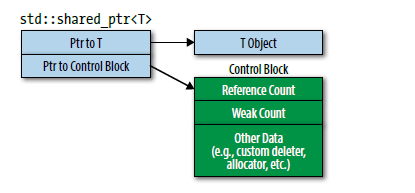

# Effective Modern C++
  <font size=4> Scott Meyers</font>

## Chap 1: Deducing Types

传统的C++支持function Template中的类型推导，在C++ 11中引入了auto 和decltype，在 C++14 中加入了decltype(auto) , 这个可能导致函数更难 reason about， 因此在这里将讨论更加现代的类型推导用法。

### Item 1 理解Template 类型推导
```C++
template<typename T> 
void f(ParamType param);
...
f(expr);  
```
一般我们认为T的类型就是 _ParamType_ 的型别, 如 传入一个 `int` 类型的变量 `x`, `ParamType` 自然就是int, 但是实际上我们要分情况讨论:
* _ParamType_ 是一个 pointer或者reference, 但是不是一个 Universal reference.
* _ParamType_ 是一个 universal reference
* _ParamType_ 既不是 pointer 又不是 reference

#### _ParamType_ 是一个引用或指针, 但不是万能引用
这种情况最简单, 类型推导方式如下:
1. _expr_ 的类型是引用的话, 忽略 reference的部分
2. 用 _expr_ 的pattern和 _ParamType_ 对比决定 T 的类型

重要的是如果传入一个`const` object 到一个 reference参数中, 他们是希望传入的对象 remain unmodifiable. 
```C++
template<typename T>
void f(T& param); 		  // param is a reference
const int& rx = x;       // as before
f(rx);                   // T is int, param's type is const int&
```
从这个例子中可以看到, 传入一个 `const int&` 和 一个 `const int` 对于推导 T的类型都是一样的(忽略 reference 部分, **但是保留 constness**).

#### _ParamType_ 是一个 Universal reference
当template 带有 universal reference parameter,如参数被声明为右值引用时候,分两种情况讨论:
1. _expr_ 是一个 lvalue, T 和 _ParamType_ <font color=red>都被推导为左值引用</font>
2. 如果 _expr_ 是右值, 上一节的规则同样适用

```C++
template<typename T>
void f(T&& param);       // param is now a universal reference
int x = 27;              // as before 
const int cx = x;        // as before 
const int& rx = x;       // as before
f(x);                    // x is lvalue, so T is int&, 
                         // param's type is also int&
f(cx);                   // cx is lvalue, so T is const int&                       
                         // param's type is also 
const int& f(rx);        // rx is lvalue, so T is const int&, 
                         // param's type is also 
const int& f(27);        // 27 is rvalue, so T is int,
                         // param's type is therefore int&&
```
总的来说, 适用了universal reference之后, 传入左值和右值产生的类型推导结果就会不同.

#### _ParamType_ 不是指针也不是引用
这时候我们处理的是pass by value的情况, 如:
```C++
template<typename T>
void f(T param);         // param is now passed by value
const char* const ptr =  // ptr is const pointer to const object
                        "Fun with pointers";
f(ptr);                  // pass arg of type const char * const
```
* 如果传入的 _expr_ 是reference, 忽略引用的部分
* 忽略之后如果 _expr_ 是const, 也忽略

因为传值时候传入的是const, 函数使用的是它的副本, 修改副本的值不会影响传入参数的const性质.上面例子中, __constness of _ptr_ itself is ignored when copying it to create the new pointer, param.__<br>

#### Array/function 参数
从C语言继承而来的特性, array parameter的声明被当成是 pointer的parameter,下面的会被推导成一个 `const char *`:
```C++
const char name[] = "J. P. Briggs";
f(name);  // T被推导成 const char*
```
但是如果 template with by-reference parameter:
```C++
template<typename T>
void f(T& param);      // template with by-reference parameter
f(name);
```
<font color=red>这个时候, 就会将T推导成为array的实际类型,并且包含array size, 这个T就是 `const char[13]`</font>.<br>
此外,函数也会 **_decay_ 成 pointer, 这个时候的类型推导和array类似**:没有&时候传入函数名则推导成为函数指针,否则是函数的引用(其实两者在实际使用过程中的差别很小).

### Item2: 理解 _auto_ 的类型推导
除了一个意外情况, `auto` 的推导和前面的Template机制是一样的.按照前面的三种分类,依旧得到下面的结果:
```C++
auto x = 27;          // case 3 (x is neither ptr nor reference) 
const auto cx = x;    // case 3 (cx isn't either) 
const auto& rx = x;   // case 1 (rx is a non-universal ref.)

auto&& uref1 = x;     // x is int and lvalue, 
                      // so uref1's type is int& 
auto&& uref2 = cx;    // cx is const int and lvalue, 
                      // so uref2's type is const int& 
auto&& uref3 = 27;    // 27 is int and rvalue, 
                      // so uref3's type is int&&
```
下面我们开始讨论那个唯一的例外情况, 在C++11中引入了一致初始化(uniform initialization),下面4个结果在auto类型推导中结果不是完全相同:
```C++
auto	x1 = 27;    // type is int, value is 27
auto	x2(27);
auto	x3 = { 27 };// type is std::initializer_list<int>,value is { 27 }
auto	x4{ 27 };
```
如果是使用这样的一个一致初始化做类型推导, 那么结果就是`std::initial izer_list`, 如果大括号中的type不同, 无法做类型推导, 代码就会出错:
```C++
auto x5 = { 1, 2, 3.0 };	// error! can't deduce T for 
                            // std::initializer_list<T>
```
处理这种花括号中的初始化器就是Template机制和auto推导的唯一区别:_auto_ assumes that a braced initializer represents a `std::initializer_list`, but template type deduction doesn’t.
```C++
auto x = { 11, 23, 9 };	//	x's type is
	                    //	std::initializer_list<int>
template<typename T>	//	template with parameter
void f(T param);	//	declaration equivalent to
	                //	x's declaration
f({ 11, 23, 9 });	//	error! can't deduce type for T
```
since c++14, auto 可以 indicate函数的返回值可以类型推导, 同时在 _lambda_ 表达式中用作参数声明, 这两个情况用的是 **template type deduction**, 不是 auto type deduction. 这时候不接受 `std::initializer_list`作为参数.

### Item 3: 理解 _decltype_
_decltype_ 告诉你name或者表达式的type,它的结果非常直观:
```C++
const int i = 0;           // decltype(i) is const int 
if (v[0] == 0) …           // decltype(v[0]) is int&
```
在C++11中, decltype的主要用途是声明返回值和参数类型有关的函数模板,如我们用`operator []` 得到容器的返回值类型, 一般而言返回的是 `T&`, 但是 `std::vector<bool>` 返回的不是 `bool&`, 而是一个新的 `bool`对象, 就可以使用下面的做法:
```C++
template<typename Container, typename Index> 
auto authAndAccess(Container& c, Index i) -> decltype(c[i]) 
{
    authenticateUser(); 
    return c[i]; 
}
```
C++11 permits return types for single-statement lambdas to be deduced, and C++14 extends this to both all lambdas and all functions, including those with multiple statements. 意味着编译器可以从函数的实现来推导函数的返回值, 前面的 `->decltype(c[i])` 就可以省略.<br>
```C++
template<typename Container, typename Index>    // C++14; 
auto authAndAccess(Container& c, Index i) {
    authenticateUser();
    return c[i];  
}
std::deque<int> d; 
…
authAndAccess(d, 5) = 10; // ERROR
```
此外, 还有一个细节就是 `d[5]` 返回的是一个 `int&`, 但是auto的类型推导会剥去reference,所以两个都是`rvalue`, 是无法这样赋值的, 故编译器会报错.为了避免用auto这种推导, since c++14, 我们可以使用 `decltype(auto)`:
```C++
template<typename Container, typename Index>  
decltype(auto)  authAndAccess(Container& c, Index i)   
{   // C++14, works, still require refinement 
    authenticateUser(); 
    return c[i]; 
}
```
此外, `decltype(auto)` 可以用于声明变量, 此外上面的实现看起来非常好, 但是还有一个问题,容器是通过 `lvalue-reference-to-non-const`, 这意味着可以修改这个容器的内容, 所以 Rvalue 没办法和这种`lvalue-reference`绑定, 除非是`lvalue-reference-to-const`.当然我们可以用一个函数重载,写出两个函数来实现, 但是更简单的一个方式是写出同时可供`lvalue`和`rvalue`使用的版本:
```C++
template<typename Container, typename Index> 
decltype(auto) authAndAccess(Container&& c,Index i);  
{//final C++14 version 
    authenticateUser();
    return std::forward<Container>(c)[i];
}
template<typename Container, typename Index>
auto authAndAccess(Container&& c, Index i)
-> decltype(std::forward<Container>(c)[i])
{//final C++11 version
    authenticateUser(); 
    return std::forward<Container>(c)[i]; 
}
```
对于`decltype`去求name的类型, 直觉得到的结果就是对的, 但是对于表达式, `decltype` 一般会确保得到的结果是一个`lvalue reference`: Putting parentheses around a name can change the type that decltype reports for it!<br>

### Item 4: 知道怎样查看推导的类型
在三个阶段得到推导类型的信息: 编辑代码的时候, 编译代码的时候, 运行代码的时候.<br>
在编辑代码的时候, IDE(如Clion)可以显示出代码的类型, 但是当涉及更多复杂类型的时候, 来自编译器的提示可能就不那么有用了.<br>
在编译期, 可以用导致编译错误的方式去诊断type的类型,如:
```C++
const int theAnswer = 42;
auto x = theAnswer;
auto y = &theAnswer;
template<typename T>	//	declaration only for TD;
class TD;	//	TD == "Type Displayer"
TD<decltype(x)> xType;	// elicit errors containing
TD<decltype(y)> yType;	// x's and y's types
```
这个时候,可能编译器就会提示出错误的类型, 并且帮助推导得到相应的类型信息:<br>error: 'xType' uses undefined class 'TD<int>' <br>
error: 'yType' uses undefined class 'TD<const int *>' <br>
#### 运行时输出
`typeid` 和 `std::type_info::name` 可以产生类型的 C-style string (i.e., a const char*) representation.但是这种结果不一定很直观, 如在 clang/gcc 中就会说 x,y的类型分别是: “i” 和 “PKi”(pointer to konst(const) i). 另外, `std::type_info::name`的结果并不可靠, 它得到的类型和将结果用 _by-value_ 的方式传入一个模板函数是相同的, 会将 reference-ness/ constness 忽略. 如果需要更精确的结果, 我们可能要使用 Boost TypeIndex库(`Boost.TypeIndex`):
```C++
#include <boost/type_index.hpp>
template<typename T> void f(const T& param) { 
    using std::cout; 
    using boost::typeindex::type_id_with_cvr;	
    //with cvr意思是保留 const, volatile, or reference 标识
// show	T
    cout <<	"T =	"<<	type_id_with_cvr<T>().pretty_name()<<	'\n';
// show	param's type
    cout <<	"param ="<<	type_id_with_cvr<decltype(param)>().pretty_name()<<	'\n';
    … 
}	
```
这样的话在clang/gcc/Microsoft的编译器产生一致的并且human-friendly representation.
***
## Chap 2: auto
### Item 5 : 使用 _auto_ 优于显式类型声明
auto类型推导的一个好处是强制使用初始化, 如:
```C++
auto x2; //error, 要求初始化
auto x3 = 0; // 正确
```
此外, 只有编译器知道的类型(如 lambda 表达式类型),也可以使用auto推导:
```C++
auto derefUPLess =	// comparison func.
    [](const std::unique_ptr<Widget>& pl,	// for Widgets
       const std::unique_ptr<Widget>& p2)	// pointed to by
    { return *p1 < *p2; };	// std::unique_ptrs
//since c++ 14, lambda 表达式的参数也可以使用类型推导
auto derefLess =	// C++14 comparison
    [](const auto& pl,	// function for
    const auto& p2)	    // values pointed
    { return *p1 < *p2; };	// to by anything  pointer-like
```
在C++中, `std::function` Objects 可以 refer to 任何**可调用的对象**(函数指针, 函数对象, lambda 表达式), 任何可以像函数一样使用的对象,正如我们使用函数指针的时候需要知道参数的类型, 上面的东西我们可以用`std::function`的template parameter写出, 
```C++
std::function<bool(const std::unique_ptr<Widget>&, 
                   const std::unique_ptr<Widget>&)>
    derefUPLess = [](const std::unique_ptr<Widget>& pl,
                     const std::unique_ptr<Widget>& p2)
                  { return *p1 < *p2; };
```
即便如此, 使用 `std::function`还是和auto不太一样, 使用auto的结果和封装的东西类型一样, 需要的内存也是一样的,但是使用 `std::function` 得到的closure是一个 `std::function`模板的实例,该实例对于任何的函数签名都有固定的size,这个size可能不够存放整个closure,_std::function_ 可能从堆中要内存存放这个closure, 因此会使用更多的内存: **the std::function approach is generally bigger and slower than the auto approach**, 并且可能爆出 _out-of-memory_ 异常.<br>
此外, auto也会避免 "**type shortcut**" 问题:

```C++
std::vector<int> v; 
…
unsigned sz = v.size();
```
实际上 `v.size()` 返回的是一个 `std::vector<int>::size_type`, 在32位系统中它的size和Unsigned相同, 但是在64-bit 的系统中, Unsigned 依旧是32 bits, while `std::vec tor<int>::size_type` is 64 bits.此外, 从下面的例子中也可以看出auto使用起来更加精确:<br>
```C++
std::unordered_map<std::string, int> m; 
...
for (const std::pair<std::string, int>& p : m)
 { 
     …	
     // do something with p
 }
```
还有很多时候我们自己写的类型可能是错的, `std::unordered_map` 的key部分应该是 **_const_**,所以在hash table中其实是 `std::pair <const std::string, int>.` 结果就是编译器产生一个类型p临时对象然后将m中的每个对象拷贝给那个对象, 然后将p的引用和那个临时对象绑定.特别是将对象取地址的时候, 使用auto取得的地址是对的, 而用上面那种声明取得地址是临时变量的地址.auto并不完美, 前面item 1提到 initializing expressions相关的问题,但是因为auto的类型可以传播, 而且并没有过分减少程序的可读性.

### Item 6: 如果使用auto推导出不想要的type,使用显示的类型声明
有的时候, auto的类型推导得到的结果是 _zags_ 而我们想要的是 _zag_, 这时候就需要手动写指定我们想要的类型.
```C++
std::vector<bool> features(const Widget& w);
Widget w; 
auto highPriority = features(w)[5];  // is w high priority? no, explained as followed
processWidget(w, highPriority);      // undefined behavior!
```
除了bool之外, opetator[] 返回的都是 T&, 但是 **<font color = red>C++不允许reference to bits</font>**, 这个auto返回的是一个`std::vector<bool>::reference`,它的行为像是 `bool&`,此外, 它可以隐式转换成bool, 所以下面的做法是没有问题的:
```C++
bool highPriority = features(w)[5];  // declare highPriority's type explicitly
```
前面 _auto_ 的错误用法的结果取决于`std::vector<bool>::reference` 是怎样实现的, 如果是包含指向保存引用位的机器word的指针，以及该位在该word中的偏移量,那么auto的 highPriority 包含一个 pointer to a word in temp, 同时有对 bit 5的偏移量. 在那句话结束后, temp就被销毁, 然后 highPriority 包含的指针就相当于是一个 dangling pointer.<br>
实际上, 这是一个 _Proxy_ 的例子, 有的 proxy非常直观(`std::shared_ptr`), 但是有的proxy更像是invisible, 一般来说, **"invisible"的proxy不太适合用auto做类型推导**,因此我们要**避免**下面形式的auto语句:<br>
<font color=#000fff size=4>auto someVar = expression of "invisible" proxy class type;</font><br>
怎样确定一个返回值是否是proxy, 一般而言文档中会有很好的说明, 就算是没有的话, 也很难从源代码中把这种性质藏起来, 我们可以根据这来判断, 如:<br>

```C++
namespace std {	// from C++ Standards
    template <class Allocator> 
    class vector<bool, Allocator> { 
        public:	
            … 
            class reference {…};	
            reference operator[](size_type n);	
            … 
    };
}	
```
这样的话就可以发现, 一般的operator[] 都是返回的一个`T&`, 而这是返回一个类内定义的reference,显然就能看出是一个 _Proxy_.如果依旧想要使用auto, 那么可能用 _the explicitly typed initializer idiom_:<br>
```C++
auto highPriority = static_cast<bool>(features(w)[5]);
```
同样的, 在别的时候也可以使用这个特性:
```C++
double calcEpsilon();            // return tolerance value
// 如果float精度已经够了,就可以这么做
float ep = calcEpsilon();        // impliclitly convert double → float
auto ep = static_cast<float>(calcEpsilon());
```
## Chap 3: Moving to Modern C++
C++ 11/14中引入了很多新的东西, `auto`,智能指针, move语义, lambda 表达式, 并发, 接下来深入理解这里面的东西.<br>
### Item 7: 创建对象的时候分清楚 `( )` 和 `{ }`
C++中实际上有三种创建并初始化对象的方式, 使用 parenthess, 等号 或者 brace:
```C++
int x(0); 
int y = 0; 
int z{ 0 }; 
// 在很多时候, 等号和braces可以一起合作使用
int z = { 0 };        // initializer uses "=" and braces,
                      // C++ 把这种和直接使用braces相同处理
```
对于 built-in 类型(如int), 这几种只有理论上的区别, 但是对于 _user-define-type_, 他们实际上调用的是不同的构造函数:
```C++
Widget w1;	// call default constructor
Widget w2 = w1;	// not an assignment; calls copy ctor
w1 = w2;	// an assignment; calls copy operator=
```
之前的初始化依旧不够好, C++11 introduce _uniform initialization_: 
1. 可以更好的对容器指定每个元素做初始化
    ```C++
    std::vector<int> v{ 1, 3, 5 }; // v's initial content is 1, 3, 5
    ```
2. 可以用于类内非静态元素的初始化(和`=`类似, 但是不允许小括号这么做)
    ```C++
    class Widget { 
        …		
    private:		
        int x{ 0 };	//	fine, x's default value is 0
        int y = 0;	//	also fine
        int z(0);	//	error!
    };
    ```
3. 对于uncopyable的对象, 可以使用 小括号和一致初始化, 但是不能用`=`
    ```C++
    std::atomic<int> ai1{ 0 };	// fine
    std::atomic<int> ai2(0);	// fine
    std::atomic<int> ai3 = 0;	// error!
    ```

同时, **一致初始化可以防止 built-in types 隐式 narrowing conversions**, 而等号不能做此保证.<br>
过去的C++是要求 _vexing parse_:anything that can be parsed as a declaration must be interpreted as one. 而在调用默认构造函数的时候最可能出现这个问题,现在这个问题被一致初始化解决:
```C++
Widget w2();	// most vexing parse! declares a function named w2 that returns a Widget!
```
但是这个东西并不是完美的, 括号表达式实际上是一个 `std::initializer_list`,然后构造函数对它做了重载, 如果没有做`std::initializer_list`版本的构造函数, 它将和括号调用同样的构造函数, 但是重载之后行为就有所不同:
```C++
class Widget	{			
public:				
    Widget(int	i,	bool b);	//	as before
    Widget(int	i,	double d);	//	as before
    Widget(std::initializer_list<long double> il); // added
};
Widget w1(10, true);	// uses parens and, as before,  calls first ctor
Widget w2{10, true};	// uses braces, but now calls std::initializer_list ctor 
                        // (10 and true convert to long double)
Widget w3(10, 5.0);	    // uses parens and, as before, // calls second ctor
Widget w4{10, 5.0};	    // uses braces, but now calls // std::initializer_list ctor 
                        // (10 and 5.0 convert to long double)
```
这种情况下, copy / move 构造器也可能被 `std::initializer_list` 劫持, 如果Widget有operator float(), 那么下面就会出现一个诡异的行为:
```C++
class Widget	{			
public:				
    ...                     //as before
    operator float() const; // convert  to float(允许类型转换)
};
Widget w6{w4};	//	uses braces, calls
                //	std::initializer_list ctor
                //	(w4 converts to float, and float
                //	converts to long double)
Widget w8{std::move(w4)};   // use braces, calls
                            //	std::initializer_list ctor
                            //	(for same reason as w6)
```
这时候如果**窄化类型转换之后可以匹配 `std::initializer_list`,就会报错**(如int /float　可以转成bool), 但是没有办法转换之后匹配的话, 就会吧控制权交回到其他的构造函数中. 值得注意的是,**you use an empty set of braces to construct an object that supports default construction and also supports `std::initializer_list` construction**.
```C++
Widget w1;	// calls default ctor
Widget w2{};	// also calls default ctor
Widget w3();	// most vexing parse! declares a function!
Widget w4({});	// calls std::initializer_list ctor with empty list
Widget w5{{}};	// 和上面一样
```
在使用标准库的时候, 小括号和大括号**可能有不同的意思**:
```C++
std::vector<int> v1(10, 20);	// use non-std::initializer_list
                                // ctor: create 10-element
                                // std::vector， all elements have
                                // value of 20
std::vector<int> v2{10, 20};	// use std::initializer_list ctor:
                                // create 2-element std::vector，
                                // element values are 10 and 20
```
因为这个问题, 一般的程序员默认一种分界符, 然后在只能使用另一种的时候少量用另一个. 而在 STL 的函数`std::make_unique`和 `std::make_shared` 则内部使用小括号并且在文档中详细说明这个 _interface_.

### Item 8: Prefer nullptr to 0 and NULL
在C++98中,如果一个函数三种方式重载:
```C++
void f(int); 
void f(bool); 
void f(void*);	// three overloads of f
f(0)；   // calls f(int) not f(void*)
f(NULL); // might not compile, but typically calls  f(int). Never calls f(void*)
```
如果NULL是用`0L`定义的, 那么从 long 到 int/bool/void的转换都被认为是equally good. `nullptr`的好处是它没有integral的类型, 它的类型实际上是`std::nullptr_t`,并且 **可以隐式转换成所有的raw pointer**类型.<br>
此外, 他还有一个好处是, 在搭配 _auto_ 使用的时候可以方便阅读, 没有二义性. 而当使用template的时候, 它的好处就更明显了.在之前可能需要各种代码的duplication,现在可以用模板来做:
```C++
int    f1(std::shared_ptr<Widget> spw);  // call these only when 
double f2(std::unique_ptr<Widget> upw);  // the appropriate 
bool   f3(Widget* pw);                   // mutex is locked
std::mutex f1m, f2m, f3m;         // mutexes for f1, f2, and f3 
template<typename FuncType, 
         typename MuxType,
         typename PtrType>
auto lockAndCall(FuncType func,MuxType& mutex,PtrType ptr) 
                -> decltype(func(ptr)) 
{
    using MuxGuard = std::lock_guard<std::mutex>; 
    MuxGuard g(mutex);
    return func(ptr);
}
auto result3 = lockAndCall(f3, f3m, nullptr);    // fine, 但是传入0或者NULL的时候
                                                 //编译都无法通过
```
因为 `std::nullptr_t` 可以被隐式转换成为各种指针类型, 因此使用裸指针和智能指针都可以,因此上面的过程提高了代码的复用性.

### Item 9: Prefer alias declarations to typedefs
在涉及函数指针的时候, 我们发现alias声明比 _typedef_ 更加方便理解:
```C++
typedef void (*FP)(int, const std::string&);	// typedef
// same meaning as above	
using FP = void (*)(int, const std::string&);	// alias declaration
```
而alias更好的情况在涉及template的时候,它 **可以被 templatized, 但是 `typedef` 不能**,因此可以轻易写出C++98要typedefs nested inside templatized structs才可以实现的东西.
```C++
template<typename T>                           // MyAllocList<T>  is synonym for
using MyAllocList = std::list<T, MyAlloc<T>>;  // std::list<T,MyAlloc<T>>
MyAllocList<Widget> lw;                 // client code
// 如果使用typedef , 那么就要用struct hack
template<typename T>  
struct MyAllocList {
    typedef std::list<T, MyAlloc<T>> type;
};
MyAllocList<Widget>::type lw;            // client code
```
如果遇到想要在template 中用一个装有 type specified by template的list的时候, 就要在前面的基础上再加 `typename`:
```C++
template<typename T> 
class Widget {//Widget<T> contains
private:	  //a MyAllocList<T> as a data member
    typename MyAllocList<T>::type list;
    … 
};
```
因为 `MyAllocList<T>::type` 指向的类型depend on template type parameter (T), 它本身也是一个dependant tyoe, **dependent types must be preceded by `typename`.**<br>
但是如果我们使用alias实现的话, 就比这个要轻松许多:
```C++
template<typename T>
using MyAllocList = std::list<T, MyAlloc<T>>;  // as before

template<typename T> class Widget { 
private:
    MyAllocList<T> list;                         // no "typename",
    …                                            // no "::type"
};
```
这看上去和使用typedef一样是依赖于 template parameter T, 但是编译器处理alias的时候知道  `MyAllocList` 是 alias template: `MyAllocList<T>` 一定是在 name a type, 是 non-dependent type.在某些例子中, `MyAllocList<T>::type list` 可能是类的一个数据成员, 所以编译器要求加上`typename` 的前缀.<br>
C++ 11 引入了使用 _type traits_ 转化类型的机制(在头文件 <type_traits> 中), 使用的方法就是 `std::transformation<T>::type`, 例如:

```C++
std::remove_const<T>::type // yields T from const T
std::remove_reference<T>::type // yields T from T& and T&&
std::add_lvalue_reference<T>::type // yields T& from T
```
在 C++ 11 中这些特性都是在 templatized struct 中 使用 nested typedefs 实现的, C++ 14 引入了一个新的转换, `std::transformation_t`, 可以更好的和 alias 配合:

```C++
std::remove_const_t<T>::type 
std::remove_reference_t<T>  
std::add_lvalue_reference_t<T> 

template <class T>
using remove_const_t = typename remove_const<T>::type;

template <class T>
using remove_reference_t = typename remove_reference<T>::type;

template <class T>
using add_lvalue_reference_t = typename add_lvalue_reference<T>::type;
```

### Item 10: 优先考虑限域枚举而⾮未限域枚举

花括号中声明的名字限制其作用域, 对于 C++ 98 中的 enum 类型是不成立的, 但是 C++ 11 中引入了 scoped enums 例如:

```C++
enum Color { black, white, red }; // black, white, red are in same scope as Color
auto white = false; // Error: 这个 scope 中已经声明了 white, 无法再声明

enum class Color { black, white, red }; // black, white, red are scoped to Color
auto white = false; // fine, scope 中没有其他的 white
// scoped enums 的使用如下:
Color c = Color::white; // fine
auto c = Color::white;  // fine
```

除了不会污染名字空间, 这种新型的 enums 还有一个好处: **这是一个强类型**, unscoped enums 可以隐式类型转换成为 整型(现在也可以转化为浮点类型), 使用 scoped 的枚举类型只能使用 强制类型转换实现:

```C++
enum class Color { black, white, red }; // enum is now scoped
Color c = Color::red;
if (static_cast<double>(c) < 14.5) { // odd code, but it's valid
    auto factors = primeFactors(static_cast<std::size_t>(c)); // suspect, but it compiles
    ...
}
```
此外, scoped 枚举类型还可以支持前置声明(forward-declared), 
```C++
enum Color; // error!
enum class Color; // fine
```
这背后的原因在于编译器在枚举类型使用以前就需要知道其尺寸, 而限定作用域的枚举类型底层的型别是已知的(默认是int, 如果不适应可以推翻), 而不限作用域的枚举类型底层型别,可以指定.

在需要引用C++11 中的 `std::tuple` 型别中个各个域时, 不限制作用域的枚举还是有用的. 

```C++
using UserInfo = // type alias; see Item 9
    std::tuple<std::string, //name
    std::string, // email
    std::size_t> ; // reputation
UserInfo uInfo; // object of tuple type
enum UserInfoFields { uiName, uiEmail, uiReputation };
auto val = std::get<uiEmail>(uInfo); // ah, get value of  email field
// 作为对比, 
enum class UserInfoFields { uiName, uiEmail, uiReputation };
auto val =
    std::get<static_cast<std::size_t>(UserInfoFields::uiEmail)>(uInfo);
```
这样其实还是不够, **因为 `std::get<>` 中间的数必须在编译期计算出结果**, 这必须使用 `constexpr`, 如果做了函数模板, 其返回值也需要泛化, 不能返回 `std::size_t`, 需要返回底层型别(使用 `std::underlying_type` 得到):

```C++
template<typename E>
constexpr typename std::underlying_type<E>::type
    toUType(E enumerator) noexcept
{
return
static_cast<typename
std::underlying_type<E>::type>(enumerator);
}
// since C++ 14
template<typename E> // C++14
constexpr std::underlying_type_t<E>
    toUType(E enumerator) noexcept
{
return static_cast<std::underlying_type_t<E>>(enumerator);
}
// 甚至直接使用返回值推导
template<typename E> // C++14
constexpr auto
    toUType(E enumerator) noexcept
{
return static_cast<std::underlying_type_t<E>>(enumerator);
}
```

在转化出底层类型的函数模板帮助之下, 我们就可以更加简单地在 `std::tuple` 中使用限定作用域的枚举类型:

```C++
auto val = std::get<toUType(UserInfoFields::uiEmail)>(uInfo);
```
### Item 11: 优先选用删除函数, 而非 private 未定义函数
C++ 98 中为了阻止一些类的成员函数(构造器/拷贝赋值运算符...)被使用, 采用的做法是声明其为 private ,并且不提供定义. C++ 11 中有了更好的途径达成相同的效果, **使用 `=delete` 将他们标识为删除函数**:

```C++
template <class charT, class traits = char_traits<charT> >
class basic_ios : public ios_base {
public:
    …
    basic_ios(const basic_ios& ) = delete;
    basic_ios& operator=(const basic_ios&) = delete;
    …
};
```

这个好处在于, 删除函数无法通过任何方法使用, 即使是成员和友元函数中的代码想要复制`basic_ios` 也会无法工作, 这种不当使用在 C++98 中直到链接阶段才能诊断出来.同时删除函数习惯声明为 public, 而非 private, 客户使用某个成员函数的时候, C++ 会先校验其可访问性,然后才是校验删除状态, 声明为 public 会得到较好的错误信息. 

还有一个优点是**任何的函数都可以成为删除函数, 但是只有成员函数可以被声明为 private**,这个特性常常用于为我们想要滤掉的型别创建删除重载版本.

```C++
bool isLucky(int number); // original function
bool isLucky(char) = delete; // reject chars
bool isLucky(bool) = delete; // reject bools
bool isLucky(double) = delete; // reject doubles and floats

if (isLucky('a')) … // error! call to deleted function
if (isLucky(true)) … // error!
if (isLucky(3.5f)) … // error!
```

还有一个用法就是 **阻止那些不应该进行的模板具现**.
```C++
template<typename T>
void processPointer(T* ptr);
template<>
void processPointer<void>(void*) = delete;
template<>
void processPointer<char>(char*) = delete;
template<>
void processPointer<const void>(const void*) = delete;
template<>
void processPointer<const char>(const char*) = delete;
```

如果是类内部的函数模板,想要通过private 声明来禁用某些具现是做不到的.
```C++
class Widget {
public:
    …
    template<typename T>
    void processPointer(T* ptr)
    { … }
private:
    template<> // error!
    void processPointer<void>(void*);
};
// 但是它可以在类外被删除
class Widget {
public:
    …
    template<typename T>
    void processPointer(T* ptr)
    { … }
    …
    };
template<> 
void Widget::processPointer<void>(void*) = delete; // still public, but deleted
```
总的来说, 前者只是 delete 的一种模拟动作, 自然不如后者好用.

### Item 12: 为意在改写的函数添加 override 声明
虚函数的改写使得通过基类接口调用派生类的函数称为了可能, 要使得多态发生, 有一系列的要求必须被满足:
1. 基类中的函数必须是虚函数
2. 基类和派生类的函数名字必须完全相同(析构函数除外)
3. 基类和派生类的函数形参型别必须完全相同
4. 基类和派生类中函数的常量性必须相同
5. 基类和派生类中的函数返回值和异常规格必须 **兼容**

在 C++ 11 中又添加了一条:
1. 基类和派生类中的函数引用修饰词必须完全相同

改写有这么多的要求, 意味着小的错误可以造成大的偏差. C++ 11 中提供了一种方法显式标明派生类中的函数是为了改写基类的版本, 这时候有错误就无法通过编译. 

成员函数引用修饰词的作用是针对发起成员函数调用的对象(this指针指向的对象), 加一些区分度. 例如我们想要对 Widget 类中的某个 `std::vector` 型别的数据成员提供访问函数:
```C++
class Widget {
public:
    using DataType = std::vector<double>; 
    DataType& data() { return values; }
    …
private:
    DataType values;
};
Widget w;
…
auto vals1 = w.data(); // copy w.values into vals1
```

现在如果有一个创建 `Widget` 型别对象的工厂函数, 从返回对象里面的 vector 来初始一变量:
```C++
Widget makeWidget();
auto vals2 = makeWidget().data();
```

这一次, makeWidget() 返回的是一个右值(临时对象), 复制其中的 vector 是纯属浪费时间, 我们更应该做的是移动而不是复制, 于是我们对这个类做一些改进:
```C++
class Widget {
public:
    using DataType = std::vector<double>;
    …
    DataType& data() & // for lvalue Widgets,
    { return values; } // return lvalue
    DataType data() && // for rvalue Widgets,
    { return std::move(values); } // return rvalue
    …
private:
    DataType values;
};
auto vals2 = makeWidget().data(); // calls rvalue overload for Widget::data, move-constructs vals2
```

### Item 13: 优先调用 _const\_iterator_, 而非 _iterator_
_const\_iterator_ 相当于指向 const 的指针的等价物, 指向不可修改的值. 任何时候需要一个迭代器而且其指向的内容没有修改必要, 都应该使用 _const\_iterator_.过去的C++98 对这种迭代器支持不够全面, 例如我们想要在一个向量中找到 1983, 然后在此位置插入 1998:
```C++
typedef std::vector<int>::iterator IterT;
typedef std::vector<int>::const_iterator ConstIterT;
std::vector<int> values;
ConstIterT ci =
    std::find(static_cast<ConstIterT>(values.begin()), // cast
              static_cast<ConstIterT>(values.end()), // cast
              1983);
values.insert(static_cast<IterT>(ci), 1998);  // 可能无法编译
```

最后一行并没有想象中那么简单, 因为没有什么简单的办法能从一个非const容器得到气象的const 容器, 一旦得到了 const_iterator, 结果就变得更糟糕, 因为 C++ 98 中插入位置只能由 iterator 指定, 而不接受 const_iterator, **const_iterator 就是无法完成到 iterator 类型的型别转换, 无论这种转换看起来是多么理所当然**. 

C++11 中获取和使用 _const\_iterator_ 都变得容易(cbegin()/cend()返回 _const\_iterator_ 型别, 对于非 const 的容器也可以这么做),STL 成员函数要取用指示位置的迭代器(如插入删除之用),也要求使用 _const\_iterator_ 型别:
```C++
auto it = std::find(values.cbegin(),values.cend(), 1983);
values.insert(it, 1998);
```

如果想要撰写最通用化的库代码时, 需要考虑到某些容器或者类似容器的数据结构会以非成员函数的方式提供 begin/end/cbegin/cend. 
```C++
template<typename C, typename V>
void findAndInsert( C& container, // in container, find
                    const V& targetVal, // first occurrence of targetVal,
                    const V& insertVal) //  then insert insertVal
{ 
    using std::cbegin; // there
    using std::cend;
    auto it = std::find(cbegin(container), // non-member cbegin
    cend(container), // non-member cend
    targetVal);
    container.insert(it, insertVal);
}
```

上面的代码在 C++14 之后可以使用, 但是 C++11 中没有引入全局版本的 cbegin/cend/rbegin/rend/crbegin/crend, 这个时候需要我们自己提供它的实现:
```C++
template <class C>
auto cbegin(const C& container)->decltype(std::begin(container))
{
    return std::begin(container); // see explanation below
}
```
这种情况下如果 C 是一个传统的容器型别(如 `std::vector<int>`), container 就是对应的 const reference, 调用全局的 begin 传入一个 `const std::vector<int>&`就会产生一个 _const\_iterator_. 这个函数模板对于内建的数组类型也适用, 非成员函数的 begin 特化版本返回的就是指向首元素的指针.

### Item 14: 只要函数不会发射异常, 就为其加上 noexcept 声明
在过去, 异常安全函数提供三种保证:
* 基本保证: 无资源泄露, 所有的不变式不保持不变, 不会有数据或者内存损坏, 所有对象都是良好一致的状态,但是不能保证调用函数后数据的内容不变
* 强烈保证: 确保发生异常的情况下, **数据内容完全恢复到调用函数或者方法之前一样**
* 不抛出异常保证: 函数或者方法的调用用总是成功的, 不会抛出任何异常.所有事情在内部都已经得到处理, 永远也不会违反后置条件和不变式

C++ 11 后逐渐形成一个共识, 关于函数发射异常这件事, **真正重要的信息是它到底会不会发射**, 非黑即白. 这样一来, 函数是否带有 noexcept 声明, 就和成员函数是否带有const 声明是同等重要的信息, **函数是否抛出异常是函数接口的一部分, 一个不会发射异常的函数没有加上 _noexcept_ 声明的话就是接口规格缺陷**.
```C++
int f(int x) throw(); // no exceptions from f: C++98 style
int f(int x) noexcept; // no exceptions from f: C++11 style
```

上面的两种异常规格区别在于, C++98 异常规格下, 调用栈会解开到 f 调用的地方, 然后执行一些与本条款无关的动作之后程序执行终止, C++11 的异常规格下, 栈只是可能会开解. 这为下面的优化带来了可能性:
* 优化器不需要在异常传出函数前提下, 将执行期栈保持在可开解状态
* 不需要在异常逸出函数的前提下, 保证其中的对象以其被构造顺序的逆序完成析构

在过去, _vector_ 的 _push\_back_ 函数是提供强烈的异常安全保证, 如果尾后元素复制过程出现异常(vector 需要空间增长...), 原有的 _vector_ 对象会保持不变, 因为**旧内存中元素直到所有元素都复制到新内存以后才会执行析构**.  但是在提供 转移语义后, _push\_back_ 内部要把复制操作用移动替代, 除非**移动操作不会发射异常**, 否则如果 n 个元素已经从旧内存移出, 在移动低 n+1 个元素时候抛出异常, 原始的 _vector_ 对象已经被修改, n 个元素已经从其中移出. 

其他强异常安全的函数(`std::vector::reserve`, `std::deque::insert`) 把复制换成了移动操作. **仅仅在已知移动操作不会发生异常的情况下才能继续做出强的异常安全保证**, 而确认操作不抛出异常的方法就是看这个操作是否带有 `noexcept` 声明.

高阶数据结构的 swap 行为要有 `noexcept` 性质, 一般的, 仅当构建它的低阶数据结构的 swap 具备 `noexcept` 性质, 例如 std::pair 准备的 swap 函数:
```C++
template <class T, size_t N>
void swap(T (&a)[N], 
T (&b)[N]) noexcept(noexcept(swap(*a, *b)));
template <class T1, class T2>
struct pair {
    …
    void swap(pair& p) noexcept(noexcept(swap(first, p.first)) &&
                                noexcept(swap(second, p.second)));
    …
};
```

事实上, 大多数函数都是异常中立的: **他们本身并不抛出异常, 但是它们调用的函数可能发射异常**. 对于某些函数来说, 具备 `noexcept` 性质是如此重要, 所以他们默认是这样的, 如 C++11 中默认内存释放的所有析构函数(无论是用户自定义的还是编译器自动生成的)都隐式具备 `noexcept` 性质, 除非其有数据成员显式地将其析构函数声明为可能发射异常的(为其加上 `noexcept(false)`).

有些接口设计者将函数区分成为:
* 宽松契约: 没有前置条件, 无需关系程序状态, 对于调用方式传入的实参也没有限制
* 狭隘契约: 区别于上面的宽松契约, 如`string`形参不超过 32个字符等等..

对于宽松契约的函数, 并且我们知道它不发射异常, 为其添加`noexcept` 声明十分容易, 但是对于狭隘契约如果不发射其他异常, 发现违反前置条件, 而一般这种时候需要抛出一个异常 "前置条件已经违背", 添加 `noexcept` 声明后, 一来异常程序就会终止, 因此 **一般只把 `noexcept` 声明留给那些带有宽松契约的函数**.

为了保证和旧代码的兼容等原因, 带有 `noexcept` 声明的函数依赖缺乏这种声明的代码, 依旧可以通过并且编译器一般不会生成警告.

### Item 15: 只要有可能使用 _constexpr_ 就使用它
**_constexpr_ 应用于对象的时候, 是一个加强的 const, 应用于函数时候却又有不同的含义**, 对于 _constexpr_ 函数的结果, 我们既不能确定它是一个const, 也不能假定其在编译阶段就已知. 

_constexpr_ 对象十分简单, 他们真实具备 const 属性, 而且**在编译阶段就已知**(严格说是在翻译期间决定的, 包括编译和链接, 可以毫无顾虑地认为是在编译期间决定的). 简单来说所有的 _constexpr_ 对象都是 _const_ 对象, 但是反过来不成立(如一个 _constexpr int_ 可以用于 `std::array<T,N>` 中N的指定, 但是 _const int_ 不能). 

_constexpr_ 函数的行为正确地理解方式如下:
* 可以用于要求编译期间求值得语境中, 传给它的实参值是在编译期间已知的, 则结果也会在编译期间计算出来
* 如果传入的值有一个或者多个在编译期间未知, 它的运作方式和普通函数无异

例如我们需要使用一个在编译期间可以得到 size 的array:
```C++
constexpr int pow(int base, int exp) noexcept{
    return (exp == 0 ? 1 : base * pow(base, exp - 1));
} // C++ 11 实现, 函数体内不得多于一个可执行语句(即一条return 语句)
constexpr int pow(int base, int exp) noexcept{} // C++14
    auto result = 1;
    for (int i = 0; i < exp; ++i) result *= base;
    return result;
}
constexpr auto numConds = 5;
std::array<int, pow(3, numConds)> results;
```
这种 constexpr 函数仅限传入和返回字面型别(literal type, 所有的内建型别, 除了void 都符合这个条件), 当然我们也可以有用户自定义的字面型别(构造函数和其他成员函数也可能是`constexpr`函数):
```C++
class Point {
public:
    constexpr Point(double xVal = 0, double yVal = 0) noexcept
        : x(xVal), y(yVal){}
    constexpr double xValue() const noexcept { return x; }
    constexpr double yValue() const noexcept { return y; }
    void setX(double newX) noexcept { x = newX; }
    void setY(double newY) noexcept { y = newY; }
private:
    double x, y;
};
constexpr Point p1(9.4, 27.7); // fine, "runs" constexpr ctor during compilation

constexpr
Point midpoint(const Point& p1, const Point& p2) noexcept{
    return { (p1.xValue() + p2.xValue()) / 2, // call constexpr
             (p1.yValue() + p2.yValue()) / 2 }; // member funcs
}
constexpr auto mid = midpoint(p1, p2); // init constexpr object w/result of constexpr function
```

这意味着初始化过程中涉及的构造函数, 访问器还有非成员函数的调用, 却依旧可以在只读内存中得到创建. 这时候`mid.xValue()*10` 这种表达式可以运用到模板形参中, 或是用于指定枚举常量表达式中. 上面 C++ 11 中修改了对象的两个成员函数无法变成 `constexpr`(他们修改了操作对象,constexpr 隐式声明为 const成员函数, 无法修改对象; 其次他们的返回型别为 void,不是字面型别), 但是 C++ 14 中解除了这种限制, 就可以写出类似的代码:
```C++
class Point {
public:
    …
    constexpr void setX(double newX) noexcept // C++14
    { x = newX; }
    constexpr void setY(double newY) noexcept // C++14
    { y = newY; }
    …
};
// return reflection of p with respect to the origin (C++14)
constexpr Point reflection(const Point& p) noexcept
{
    Point result; // create non-const Point
    result.setX(-p.xValue()); // set its x and y values
    result.setY(-p.yValue());
    return result; // return copy of it
}
constexpr Point p1(9.4, 27.7);
constexpr Point p2(28.8, 5.3);
constexpr auto mid = midpoint(p1, p2);
// C++ 14:
constexpr auto reflectedMid = reflection(mid); 
```
到现在, 我们可以说, **只要有可能使用 _constexpr_, 就应该使用它**. 当然还是有一些场合无法使用, 例如通常 _constexpr_ 函数里是不能够有 I/O 操作的. 

### Item 16: 保证 const 成员函数的线程安全性
计算多项式的成本非常高, 因此我们设计一个多项式类的时候常常会使用 lazy-evaluation 的方法:
```C++
class Polynomial {
public:
    using RootsType = std::vector<double>;
    RootsType roots() const{
        if (!rootsAreValid) { // if cache not valid
            … // 计算结果, 将结果存入 roorVals 中
            rootsAreValid = true;
            }
        return rootVals;
    }
private:
    mutable bool rootsAreValid{ false }; // see Item 7 for info
    mutable RootsType rootVals{}; // on initializers
};
```
在多线程下, 这个设计就变得不再安全, 这些线程中的一个或者两个可能都在试图改变私有的数据成员, 这就是数据竞险(data race), **问题就在于 roots 这个成员函数声明为 const, 但实际上不是线程安全的**. 一个解决的简单方法是引入互斥量(mutex, mutual exclusion):
```C++
class Polynomial {
public:
    using RootsType = std::vector<double>;
    RootsType roots() const
    {
        std::lock_guard<std::mutex> g(m); // 加上互斥量
        if (!rootsAreValid) { 
            … 
            rootsAreValid = true;
        }
        return rootVals;
    } // 解除互斥量
private:
    mutable std::mutex m;
    mutable bool rootsAreValid{ false };
    mutable RootsType rootVals{};
};
```

`std::mutex` 是只移型别, 加上m之后的副作用是 `class Polynomial` 失去了可复制性. 当然, 很多时候引入互斥量代价高昂且没有比较, 在计算一个成员函数被调用次数的场景中, 就可以使用 `std::atomic` 型别的计数器(**确保其他线程可以以不加分割的方式观察到操作的发生**), 这种型别的操作和 加上与解除互斥量对比, **开销往往比较小**:
```C++
class Point { // 2D point
public:
    …
    double distanceFromOrigin() const noexcept 
    { 
        ++callCount; // atomic increment
        return std::sqrt((x * x) + (y * y));
    }
private:
    mutable std::atomic<unsigned> callCount{ 0 };
    double x, y;
}
```

但是涉及两个或者多个变量或者内存区域需要作为一整个单位进行操作的时候, 就要用互斥量了:
```C++
class Widget {
public:
    …
    int magicValue() const
    {
        std::lock_guard<std::mutex> guard(m); // lock m
        if (cacheValid) return cachedValue;
        else {
            auto val1 = expensiveComputation1();
            auto val2 = expensiveComputation2();
            cachedValue = val1 + val2;
            cacheValid = true;
            return cachedValue;
        }
    } // unlock m
    …
private:
    mutable std::mutex m;
    mutable int cachedValue; // no longer atomic
    mutable bool cacheValid{ false }; // no longer atomic
};
// 使用原子类型操作的错误示例:
class Widget {
public:
    …
    int magicValue() const
    {
        if (cacheValid) return cachedValue;
        else {
            auto val1 = expensiveComputation1();
            auto val2 = expensiveComputation2();
            cachedValue = val1 + val2;  // uh oh, part 1
            cacheValid = true;          // uh oh, part 2
            return cachedValue;
        }
    }
private:
    mutable std::atomic<bool> cacheValid{ false };
    mutable std::atomic<int> cachedValue;
};
```

这时候按照上面这种顺序放置两个原子数据, 可能在两个线程中都观察到 bool 为 false 然后计算两次, 这就违背了使用缓存的初衷. 如果将设置值和设置 bool 的顺序反过来, 则可能是 bool 类型设置成 true,但是计算没有完成, 造成返回值不正确的结果.

### Item 17: 理解特殊函数的生成机制
C++98 有四种特殊的成员函数(默认构造函数,析构函数, 复制构造函数,复制赋值运算符), 这些函数仅在需要的时候才会生成. **C++11 中加入了两位新的成员, 移动构造函数和移动赋值运算符**:
```C++
class Widget {
public:
    …
    Widget(Widget&& rhs); // move constructor
    Widget& operator=(Widget&& rhs); // move assignment operator
    …
};
```

但是移动操作某个数据成员或者基类部分上执行移动构造或者移动赋值的时候, 并不能保证移动操作真的会发生, 更像是一种请求, 对于不可移动的型别将通过复制实现移动,移动操作生成的精准条件, 和复制操作有些不同:
* 两种复制操作彼此独立, 声明了其中一个并不会阻止编译器生成另一个
* 两种移动操作彼此不独立, 声明了其中一个, 就会阻止编译器生成另一个: 原因在于自定义其中一个说明按成员进行移动的构造操作有不合理的地方, 那么按照成员进行移动赋值运算符也极有可能是不合理的.

过去有三大律: 如果声明了复制构造函数\复制赋值运算符或者析构函数中的任何一个, 我们就得同时声明所有三个. 推论是如果存在用户声明的析构函数, 那么平凡的按成员复制也不适用于该类. 这推动了C++ 11 中的规定:**如果用户声明了析构函数, 就不会生成移动操作**. 于是移动操作生成的条件:
* 该类未声明任何复制操作
* 该类未声明移动操作
* 该类未声明任何析构函数

移动操作被抑制后了加上 `=default` 就能再次给予编译器生成移动操作的机会. 总之, 特种函数的机制如下:
* 默认构造函数：和C++98规则相同。仅当类不存在⽤⼾声明的构造函数时才⾃动⽣成。
* 析构函数：基本上和C++98相同；稍微不同的是现在析构默认noexcept。和C++98⼀样，仅当基类析构为虚函数时该类析构才为虚函数。
* 拷⻉构造函数：和C++98运⾏时⾏为⼀样：逐成员拷⻉⾮static数据。仅当类没有⽤⼾定义的拷⻉构造时才⽣成。如果类声明了移动操作它就是delete。当⽤⼾声明了拷⻉赋值或者析构，该函数自动生成已经变成废弃的行为
* 拷⻉赋值运算符：和C++98运⾏时⾏为⼀样：逐成员拷⻉赋值⾮static数据。仅当类没有⽤⼾定义的拷⻉赋值时才⽣成。如果类声明了移动操作它就是delete。当⽤⼾声明了拷⻉构造或者析构，该函数的自动生成已经变成了废弃的行为
* 移动构造函数和移动赋值运算符：都对⾮static数据执⾏逐成员移动。仅当类没有⽤⼾定义的拷⻉操作，移动操作或析构时才⾃动⽣成。

## Chap 4: 智能指针
裸指针在过去的使用中发现了很多问题:
* 声明中没有指出指向的是单个对象还是对象数组
* 没有提示使用完指向的对象后是否需要析构它(ownership 问题)
* 要保证析构在代码的所有路径上都要执行一次, 包括那些异常导致的路径

智能指针是解决这些问题的办法, c++ 11 中有四种智能指针, 但是 `auto_ptr` 没有实现移动语义, 是通过复制操作来完成移动任务, 还有一些奇怪的使用限制(不能在容器中存储 `std::auto_ptr` 对象等), 因此在 C++ 17 中被弃用.

### Item 18: 使用 `std::unique_ptr` 管理专属所有权的资源

可以认为在默认情况下 `std::unique_ptr` 和裸指针有着相同的尺寸(在 gcc 中试过带有自定义删除器指向自定义类的智能指针依旧是 8 个字节), 并且对于绝大多数操作它们底层都是执行了相同的指令. 它实际上实现的是专属所有权语义, 不允许复制, 是一个只移型别. 执行析构期间由非空的 `std::unique_ptr` 析构其资源, 默认的析构是通过对内部的裸指针实施 delete 完成的, 但是我们可以自定义析构器: 析构资源时候调用的函数(或者函数对象, lambda 表达式产生的闭包). 
```C++
auto delP = [](Point2D* ptr){
    makeLogEntry(ptr);
    delete ptr;
};
std::unique_ptr<Point2D, decltype(delP)> ptrWithCustomDel;
```
使用默认析构器或者无状态的函数对象(如 无捕获的 lambda 表达式, 没有成员的函数对象) 不会浪费任何存储尺寸, 但是使用函数指针的话会增加一到两个字长(64位系统实测是8个byte).析构器如果采用带有大量状态的函数对象实现, 使得这种智能指针对象的尺寸增加是客观的, 这时候可能就需要改变一下设计.

此外, `std::unique_ptr` 还提供数组的形式(`std::unique_ptr<T[]>`), 这种施行提供下标索引运算符但是不提供提领运算符(`operator*` 和 `operator->`), 除了使了 C 风格的 API 需要这种形式的智能指针, 其他的场景都可以使用标准库中的容器去实现.

### Item 19: 使用 `std::shared_ptr` 管理具备共享所有权的资源
std::shared_ptr 通过访问资源的引用计数来确定是否自己是最后一个指向某个资源的智能指针, 引用计数带来了一些性能上的影响:
* `std::shared_ptr` 的尺寸是裸指针的两倍, 因为还包含一个指向该资源控制块的的裸指针, 该控制块包含了很多信息(引用计数/弱计数/自定义删除器or分配器...)<br>
  
* 引用计数内存必须动态分配, 该计数和对象向关联, 但是对象却对它一无所知, 无论是否使用`std::make_shared`引用计数都会作为动态分配数据来存储
* 引用计数的递增和递减必须是原子操作, 比一般的操作要慢

移动`std::shared_ptr` 比复制块, 移动不涉及任何的引用计数操作. 而这种指针和 `std::unique_ptr` 的重要区别在于, 析构器型别不是智能指针型别的一部分, 因为引用计数是控制块的一部分, 这个数据结构中包含了自定义析构器的一个控制, 从三种情况创建的控制块行为不同:
* `make_shared` 会产生一个用于指向的新对象, 并且**总是创建一个控制块**
* 从具备专属所有权的指针(`unique_ptr`或者`auto_ptr`)出发构建的时候, 会创建一个控制块, 并且那个专属所有权的智能指针会被置空
* 使用裸指针调用构造函数的时候, 也会创建一个控制块, 如果从已经有控制块的对象出发创建`shared_ptr`, 应该传递一个只能指针而非裸指针构建, 否则可能的后果是**多重控制块导致的未定义行为**
  * 因此我们要**尽可能避免将裸指针传递给 `shared_ptr` 的构造函数, 常用的方式就是使用`make_shared`
  * 使用了自定义的析构器无法使用 `make_shared` 时候直接在构造函数中写 new 语句

还有一种令人惊讶的方式是涉及到 this 指针的多重控制块:
```C++
std::vector<std::shared_ptr<Widget>> processedWidgets;
class Widget {
public:
    …
    void process();
    …
};
void Widget::process()
{
    …
    processedWidgets.emplace_back(this);
    ...
}
```

这看起来没什么问题, 但是如果成员函数外再套一层 `std::shared_ptr` 肯定会引发未定义行为. 这时候一个解决的办法就是继承一个类模板, 它提供了一个成员函数:
```C++
class Widget: public std::enable_shared_from_this<Widget> {
public:
    …
    void process();
    …
}
void Widget::process()
{
    …
    // add std::shared_ptr to current object to processedWidgets
    processedWidgets.emplace_back(shared_from_this());
}
```
需要注意的是**要有指向当前对象的控制块之后才能`share_from_this`**, 为了避免在有`shared_ptr`指向对先前就调用引发 `shared_from_this` 的成员函数, 通常将此类对象的构造构造函数声明为私有, 并且只允许用户通过返回`shared_ptr` 的工厂函数创建对象:
```C++
class Widget: public std::enable_shared_from_this<Widget> {
public:
    // factory function that perfect-forwards args
    // to a private ctor
    template<typename... Ts>
    static std::shared_ptr<Widget> create(Ts&&... params);
    …
    void process(); // as before
    …
private:
    … // ctors
};
```
另外还有三点需要注意:
* 资源和指向它的 `shared_ptr` 的规约是至死方休的, 不能离异,不能废止,不能免除.
* 它不能用于处理数组
* `std::unique_ptr/shared_ptr` 支持从派生类到基类的型别转换, 但是后者不支持数组, 前者用于数组的情形也不能这么做, 它会在型别系统上开天窗

