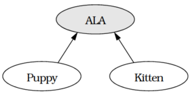

# More Effective C++ by Scott Meyers

## Basics

### Item 1 仔细区别pointers 和 references

Pointer和reference的接口看起来差别巨大,(pointer使用*和-> operator,reference使用.),而他们具体在什么时候使用?<br>
1. 首先,reference必须代表某个对象,没有null reference, 这样使用起来比pointer更有效率,因为使用reference之前不需要检验其有效性:
    ```C++
    void printDouble(const double& rd){
        cout << rd; // no need to test rd; it must refer to a double
    }
    void printDouble(const double *pd){
    if (pd) { // check for null pointer
        cout << *pd;
        }
    }
    ```
2. Pointer可以被重新赋值指向另一个对象,但是reference总是指向它最初获得的那个对象.
    ```C++
    string s1("Nancy");
    string s2("Clancy");
    string& rs = s1; // rs refers to s1
    string *ps = &s1; // ps points to s1
    rs = s2; // rs still refers to s1, but s1’s value is now "Clancy"
    ps = &s2; // ps now points to s2; s1 is unchanged
    ```
因此,当你需要指向某个东西,而且绝不会指向其他东西或
者当你实现一个操作符而其语法需求无法由pointer完成时,应该使用reference,其他时候使用pointer.

### Item 2 最好使用C++的转型操作符

新的cast形式十分容易被辨识出来, _static\_cast_ 基本与C旧式转型有相同的威力和限制, 比如我们不能够用 _static\_cast_ 将一个 _struct_ 转型为一个 _int_,或者将一个double转型为一个指针, 不能移除表达式的constness.<br>
其他转型操作符更适用于范围狭窄的目的, 如const_cast最常见的目的就是将常量性移除,dynamic_cast用来执行继承体系下的安全向下转型或者是跨系转型动作.<br>
我们可以用dynamic_cast将指向base class对象的pointer或者reference转型为指向derived或者sibling base的pointer和reference.它无法应用于缺乏虚函数的类型上,也不能改变类型的常量性.<br>
reinterpret_cast最常见的用途是 **转换函数指针类型,函数指针的转型动作,并不具备可移植性**.<br>

### Item 3 绝对不要以多态的方式处理数组

C++允许以base class的pointer和reference来操作"derived class object 所形成的数组"。如果有继承至BST的BalancedBST, 用BST的指针去便利BalancedBST, 就会出问题:
```C++
class BST { ... };
class BalancedBST: public BST { ... };
void printBSTArray(ostream& s,
const BST array[],
int numElements){
    for (int i = 0; i < numElements; ++i) {
    s << array[i]; // this assumes an
    }              // operator<< is defined
}                  // for BST objects
BalancedBST bBSTArray[10];
...
printBSTArray(cout, bBSTArray, 10);
```
bBSTArray[i]实际是一个指针运算表达式的缩写, 代表*(bBSTArray+i),相距$i \times sizeof(\text{数组中的对象})$, 编译器将它视为$i \times sizeof(BST)$, 但是derived class 通常比base class 对象大, 这样就会出现问题.<br>
此外, 如用base 指针删除derived class object组成的数组, 编译器看到`delete[] array`的句子, 通常理解为:
```C++
for (int i = the number of elements in the array - 1;i >= 0;--i){
    array[i].BST::~BST(); // call array[i]’s destructor
} 
```
而**通过base pointer删除一个derived classes object构成的数组, 其结果是未定义的**.

### Item 4 非必要不提供default constructor

默认构造函数(i.e, 一个可以无参数调用的构造器)使用时有下面的要求: **必须要有某些外来信息才能生成对象的 classes, 则不必要拥有默认的构造函数**.<br>
```C++
class EquipmentPiece { 
public: 
    EquipmentPiece(int IDNumber);
    ...
};
```
这意味着, 如果类缺乏default constructor, 使用这个class的时候会有一些限制:
1. 在产生数组的时候,没有默认构造函数就会出问题:
    ```C++
    Equipmentpiece bestPieces[10]； // error! No way to call  EquipmentPiece ctors
    Equipmentpiece *bestPieces = new EquipmentPiece[10]； // error! same problem
    ```
    可以有一些方法解决这个问题:
    * 使用Non-heap数组, 提供构造参数生成相应的数组
    * 使用指针数组而非对象数组:
        ```C++
        typedef Equipmentpiece* PEP； // a PEP is a pointer to // an EquipmentPiece
        PEP bestPieces[10]； // fine, no ctors called
        PEP *bestPieces = new PEP[10]； // also fine
        for (int i = 0； i < 10； ++i)
            bestPieces[i] = new EquipmentPiece( ID_Number);
        ```
    使用指针数组依旧是有问题的, <font color=red> 第一是必须记得将指针所指的所有对象删除, 第二是如果内存总量很大, 需要一些空间来放置指针,还需要一些空间来放 _EquipmentPiece_ 对象 </font> 过度使用内存的问题可以避免, 方法是先为此数组分配 raw memory, 然后使用 _placement new_ 在这块内存上构造 _EquipmentPiece_ 对象.这种做法要求你在数组内对象生命周期结束时, 以手动的方式调用其析构函数, 再调用 _operator delete[]_ (因为rawMemory不是用 _new_ 操作符得到的, 一般的数组删除操作作用在它上的结果是未定义的).

2. 它将不适用于很多 template-based container classes, 因为他们的实例化目标类型必须要有一个默认构造器. **因为在这些template内部几乎总是产生一个以 template类型参数 作为类型而架构起来的数组.**<br>
    ```C++
    template<class T> 
    class Array { 
    public: 
        Array(int size);
        ...
    private： 
        T *data； 
    };  
    template<class T> 
    Array<T>::Array(int size) { 
        data = new T[size]；//calls T::T() for each element of the array
    }
    ```
    如果谨慎设计template, 可以消除对默认构造器的需求.
3. 最后 一点考虑和虚基类有关, 如果虚基类缺乏默认构造函数, 与之合作十分困难, 因为**虚基类的构造函数的参数必须由想要产生的对象的派生层次最深的class提供, 缺乏默认构造器的虚基类, 要求所有派生的类都必须了解其意义, 并且提供虚基类构造器的参数**.

如果类构造函数可以确保对象的所有fields都会被正确地初始化, 添加无意义的默认构造函数的效率/复杂性成本可以免除, 如果无法保证, 最好避免让 _default constructor_ 出现.

## 操作符
### Item 5 : 对定制的"类型转换函数"保持警觉
对于user define type, 我们可以选择是否提供某些函数, 供编译器拿来实现隐式类型转换.两种函数允许编译器执行这样的转换, **单参数构造器和隐式类型转换操作符.**<br>
1. 单参数构造器:
    ```C++
    class Name { 
        public: 
        Name(const std::string& s); // 将一个 string 转成了name类型
    };
    ```
2. 隐式类型转换操作符, 是一个拥有奇怪名称的成员函数: operator 之后加上一个类型名称:
    ```C++
    class Rational {
    public: 
        ...
        operator double() const； // converts Rational to double
    }；
    Rational r(1,2); // r的值为 1/2
    double d = 0.5 * r; // r隐式转换成为double, 然后做乘法
    ```

而提供这种函数的问题在于, 它将在你从未打算也从未预期的情况下被调用,得到的结果可能是不正确不直观的程序行为并且难以调试. 如我们在打印 r 的时候, 如果忘记给 _Rational_ 写一个 _operator <<_ , r将隐式转换成一个double并且被打印出来: **隐式类型转换的出现可能导致错误(非预期)的函数被调用**. 解决的办法也很简单, **<font color=red>使用一个对等的函数取代类型转换操作符</font>**. <br>
而通过单参数构造器完成的隐式类型转换, 则比较难以消除. 下面就是一个错误使用的例子:
```C++
template<typename T> 
class Array { 
public: 
    Array(int lowBound, int highBound)； 
    Array(int size);  // 可能被使用成单参数构造器
    T& operator[](int index); 
    ... 
};
bool operator==( const Array<int>& Ihs, const Array<int>& rhs)；
Array<int> a(10) ;
Array<int> b(10) ;
for (int i = 0；i < 10； ++i) { 
    if (a == b[i]) { // oops! "a" should be "a[i]"
        // do something when a[i] and b[i] are equal
    } else { 
        // do somethingwhen they're not；
    }
}
```
这个错误带来的结果是, 写错代码后, 原来的 `==` 无法调用, 但是只要调用 _Array(int size)_ 这个构造器,那么每次就是 a和一个大小为b[i]的临时对象做比较. <br>
简单的解决办法是, **使用关键词 _explicit_**, 只要将构造函数声明为 _explicit_, 就无法因为隐式类型转换的需要而调用他们, 不过**显式类型转换依旧是允许的**.<br>
一条判断隐式类型转换是否合法的规则是, **没有任何一个转换程序可以内含一个以上的"用户定制转换行为(包含上面两种转换)"**, 可以利用这种规则, 将你希望的对象构造行为合法化, 将不希望的隐式构造非法化.<br>
考虑之前的Array Template, 我们可以产生一个新的class, ArraySize, 单参数的构造器接收一个ArraySize对象, 而非一个 int. <br>
`Array<int> a(10)` : 10 可以隐式类型转换成为一个临时的ArraySize对象, 该对象正是 Array<int> 构造函数需要的, 可以做. <br>
`a == b[i]` : 编译器不能考虑将int转为一个临时性的ArraySize对象, 然后根据这个临时对象产生Array<int> 对象, **那将调用两个用户定制的转换行为**.<br> 
这种做法其实是proxy技术的一个特殊实例.

### Item 6: 区别 increment/decrement 操作符的前置和后置形式

前置和后置操作符increment/decrement, 都没有参数, 这个语言学的漏洞只好让后置式有一个int作为参数.
```C++
class UPInt { // "unlimited precision int"
public：  
    UPInt& operator++()； // prefix ++
    const UPInt operator++(int)； // postfix ++
    UPInt& operator--()； // prefix --
    const UPInt operator--(int); // postfix --
    UPInt& operator+=(int); // a += operator for UPInts and ints
    ... 
};
```
前置的意思是 increment and fetch(累加然后取出),后置的意义是 fetch and increment(取出之后再累加). 
```C++
// prefix form： increment and fetch 
UPInt& UPInt::operator++() { 
    *this += 1； // increment
    return *this; // fetch
}
// postfix form： fetch and increment
const UPInt UPInt::operator++(int){
    const UPInt oldValue = *this； // fetch
    ++(*this)；         // increment
    return oldValue； // return what was fetched
}
```
后置操作符并未调动其参数, 参数的唯一目的是为了区别前置和后置形式.<br>
两者都是会改变 _UPInt_ 的值, 所以不能声明为const成员函数, 而将后置形式的函数的返回值声明为const UPInt, 那么这个动作 `i++++` 就是非法的(返回的一个oldValue无法再被修改), 这是因为, 内置的int就不允许后置的两个 `++`, 因为第二个 `operator++` 所改变的对象是第一个 `++` 操作符所返回的对象,而不是原对象. 因此设计为const, 返回的对象是一个const对象, 不能调用 `operator++` 这种 non-const的成员函数.<br>
单从效率的角度, 用户也更应该喜欢前置式的increment, 除非需要后置increment的行为. 如何保证两者的行为一致, 具体的做法是: **后置的操作应该以其前置的兄弟为基础, 这样的话我们只需要维护前置式的版本**, 后置的版本会自动调整为一致的行为.

### Item 7: 千万不要重载 &&, || 和 , 操作符
C++对布尔表达式采用骤死式评估方式, 但是C++允许用户为自定义的类型定制 `&&` 和 `||` 操作符, 这样的话函数调用语义将取代骤死式语义, 从根本层面改变规则. <br>
如果重载 operator&&, 那么下面的式子将会被理解为后面两者之一:
```C++
if (expressionl && expression?) ... 
// when && is a member function
if (expression1.operator&&(expression2)) ... 
// when && is a global function
if (operator&&(expression1, expression2)) ... 
```
函数调用和骤死式语义有两个重要的区别:
* 函数调用动作被执行, 所有参数的值都必须评估完成
* C++语言的规范并未明确规定调用函数动作中各个参数的评估顺序, 而骤死式总是从左往右评估

同样的, 如果表达式内含 `,`, 那么逗号左侧将会先被评估(evaluating), 然后是右侧, 而整个包含逗号的表达式求值的结果取得是逗号右边的值.<br>
**把操作符写成一个non-menber function, 绝对无法保证左侧表达式一定比右侧更先被evaluating**, 这样的话非成员函数的做法就不可行. 唯一剩下的可能是写成一个成员函数,但是依旧不能保证能像之前逗号的那种行为.<br>
这是不能被重载的操作符:<br>
<br>
这些操作符则可以重载:<br>
<br>
即便如此, 如果没有好的理由要去重载某个操作符, 那就不要这样做.

### Item 8: 了解不同意义的new和delete
new opetator是语言内建的, 不能改变其意义只能做相同的事情,无论如何都无法改变其行为 它的动作分成两个方面:
1. 分配足够多的内存,用来放置某种类型的对象
2. 调用一个构造器, 为刚分配的内存中的那个对象设定初值

我们可以改变的是其中的1, 可以重写或者重载那个函数,函数名为 operator new, 通常的声明是`void * operator new(size_t size)`, 此外我们可以重载这个`operator new`, 加上额外的参数, 但是**第一参数的类型必须总是 size_t**.<br>
operator new 也可以直接调用, 像malloc一样, 唯一的任务就是分配内存. `string *ps = new string("memory management")` 实际上反映的是以下的行为:
```C++
void *memory = operator new(sizeof(string));
call string::string("memory management") on memory;
string *ps = static_cast<string*>(memory); 
```

#### Placement new
偶尔会有一些分配好的内存, 我们需要在上面构建对象, 有个特殊版本的 operator new, 称为placement new,允许我们这么做. 
```C++
class Widget {
public:
    Widget(int widgetSize)；
    ...
};
Widget * constructWidgetInBuffer(void *buffer,
                                 int widgetSize){
    return new (buffer) Widget(widgetSize)；
}
void * operator new(size_t, void *location){
    return location；
}
```
在这个构建Widget的过程中, 对象必须置于特定的地址, 或者特殊函数分配出来的内存上. 于是我们写出几种new 的区别:
* 希望对象产生于堆中, 使用 new operator, 分配内存并且为该对象调用一个构造器
* 只是打算分配内存, 调用operator new, 没有构造函数被调用
* 打算在heap对象产生时候自己决定内存分配方式, 使用 new operator并且调用自己写的operator new.
* 打算在已经分配内存(拥有指针)上构造对象, 使用placement new

#### 删除与内存释放
内存释放是由函数opearator delete执行,通常的声明类似于 `void operator delete(void *memoryToBeDeallocated)`, 于是 `delete ps` 会造成编译器产生类似于下面的代码:
```C++
ps->~string(); // 调用析构函数
operator delete(ps); // 释放对象所占用的内存
```
于是打算处理原始的未设置初值的内存, 应该避免使用 new operator和 delete operator, 改调用operator new 获得内存 和 operator delete归还系统.(相当于在C++中调用`malloc`和`free`).

#### Arrays
1. 如果面对尚未支持 `new[]` 的编译器, 定制数组内存管理行为往往不是一个理想的决定
2. 数组版本与单一对象版的区别是, 他所调用的构造器的数量, array new必须针对数组中的每一个对象调用一个构造器
    ```C++
    string *ps = new string[10]; // 调用operator new[] 分配可以放下十个string的内存
                                 // 然后对每个element 调用构造器
    delete [] ps;                // 对每个string 调用析构函数
                                 // 然后再调用opereator delete[] 删除array的内存
    ```

我们也可以重载 operator new[] 不过两者的重载有着相同的限制.<br>
总的来说, **_new / delete operator_ 的任务已经被语言规范限制死了, 但是我们可以修改它完成任务的方式**.

## 异常
C++增加了异常特性之后, 深远而根本地改变了很多事情, 原始指针如今成了一种高风险的事情,我们必须更加小心, 防止程序在执行时候突然中止. 而程序之所以在异常出现的时候仍然有良好的行为, 不是因为碰巧如此, 而他们加入的异常的考虑. <br>
使用返回错误码的方式发出异常信号, **无法保证此函数的调用者会检查那个变量或者那个错误码**,  于是程序可能会一直运行下去, 远离错误发生地点. 如果是以抛出exception的方式发出异常信号, 如果异常未被捕捉, 程序便会立刻终止.<br>

### Item 9: 利用destructors避免资源泄漏
使用指针可能会有很大的问题, 如果我们在下图所示的类结构中, 一次次处理不同的类的实例:<br>
<br>
```C++
void processAdoptions(istream& dataSource) {
    while (dataSource){                 // while there’s data
        ALA *pa = readALA(dataSource) ; // get next animal
        pa->processAdoption();          // process adoption
        delete pa;                      // delete object that readALA returned
    }                                   
}
```
这里需要注意的是, 我们在每次得带的最后, 需要删除 _pa_, 否则很快就会出现资源泄漏的问题. 如果 `pa->processAdoption()` 这行抛出异常, 而函数`processAdoptions`无法捕捉它, 那么这个异常就会传播到函数的调用端, `pa->processAdoption()` **之后的语句都会被跳过, 无法执行** . 要避免这个也十分简单, 在那句上加入 `try{...} catch(...){delete pa; throw;}`, 这个简单的处理让我们**被迫重复撰写可被正常路线和异常路线共享的清理代码**, 这里指的是 delete这个动作. <br>
解决的办法很简单, 只要将 "一定得执行的清理代码" **转移到 _processAdoptions()_ 函数的某个局部对象的析构函数中就可以, 用一种行为类似于指针的对象(但是动作更多)取代pa, 这种对象被我们称为智能指针**.<br>
智能指针背后的实现十分复杂, 但是背后的观念十分清楚: <font color=red> 用智能指针取代原始指针, 就不用担心heap objects 没有被阐述, 即使是在异常被抛出的情况下</font>.
```C++
void processAdoptions(istream& dataSource) {
    while (dataSource) { 
        auto_ptr<ALA> pa(readALA(dataSource)); 
        pa->processAdoption(); 
    }
}
```
只要坚持这个原则, 将资源封装在对象中, 通常便可以在 exceptions 出现的时候避免资源泄漏, 但是如果异常是在你正在取得资源的过程中抛出的, 需要其他的特殊设计.<br>

### Item 10 : 在constructor内阻止资源泄露
```C++
BookEntry::BookEntry(const string& name, 
                     const string& address, 
                     const string& imageFileName, 
                     const string& audioClipFileName)
: theName(name), theAddress(address), 
  theImage(0), theAudioClip(0) {
    if (imageFileName != "") { theImage = new Image(imageFileName); }
    if (audioClipFileName != "") { theAudioClip = new AudioClip(audioClipFileName); }
}
BookEntry::~BookEntry() {
    delete theImage; 
    delete theAudioClip; 
}
```
这样一个通讯簿系统, 看起来是安全的,如果 _imageFileName_ 是空的, 那么被初始化为null指针的在被删除时候, C++ 可以保证删除 null 指针是安全的.<br>
但是, 如果执行BookEntry的构造函数的时候有异常被抛出:
```C++
if (audioClipFileName != "") { 
    theAudioClip = new AudioClip(audioClipFileName); 
}
```
可能是new operator 在发生 operator new的时候无法分配足够的内存, 可能是 `AudioClip` 构造器本身抛出一个 exception, 最终异常都会传播到到 BookEntry 对象的那一端没这时候谁来删除 theImage 已经指向的那个对象? 控制权已经转移到了 `BookEntry` 上, 但是其析构函数绝对不会调用, **因为C++只会析构已经完成的对象, 构造函数执行完毕之后才能算是完成的构造.**<br>
```C++
void testBookEntryClass(){
    BookEntry *pb = 0；
    try {
        pb = new BookEntry( "Addison-Wesley Publishing Company", "One Jacob Way, Reading, MA 01867");
        ...
    }
    catch (...){ // catch all exceptions
        delete pb; // delete pb when an exception is thrown
        throw; // propagate exception to caller
    }
    delete pb; // delete pb normally
}
```
上面用 try-catch的方法, 看似是在异常发生的时候可以删除pb, 但是实际上 Image Object依旧是泄漏了, assignmentd的动作其实也不会施加于 pb 身上, 使用 smart pointer `auto_ptr<BookEntry>` 取代原来的裸指针也不会让情况有所好转. <br>
要用让未完全构造好的对象调用析构函数, 必须在对象内部哪些数据身上附带某种指令, 指示构造器进行到什么程度, 如此繁重的工作**会降低构造器的速度, 使得每一个C++对象变得庞大**, C++为了效率不这么做, 那么我们就必须自己设计 constructor, 使得在异常发生的情况下依旧能够自我清理, 通常 **只需要将所有可能的异常捕捉起来, 执行某种清理工作, 然后重新抛出异常使得异常可以传播出去即可.**<br>
```C++
BookEntry::BookEntry (  const string& name,
                        const string& address,
                        const string& imageFileName,
                        const string& audioClipFileName)
:theName(name), theAddress(address),
 theImage(0), theAudioClip(0){
    try { // this try block is new
        if (imageFileName != "") {
            theImage = new Image(imageFileName);
        }
        if (audioClipFileName != "") {
            theAudioClip = new AudioClip(audioClipFileName);
        }
    }
    catch (...) {        // catch any exception
        delete theImage;     // perform necessary
        delete theAudioClip; // cleanup actions
        throw;           // propagate the exception
    }
}
```
可以看到, 如果 BookEntry的构造函数本体开始执行的时候, 四个对象已经完全构造好了, 所以 BookEntry对象被销毁, data member 的销毁无需我们介入. 此外可以看到处理异常时候的代码和析构函数中的代码可能有所重合, 那么我们可以将他们写成一个 private的成员函数, 然后在构造和析构的过程中调用它.<br>
现在剩下一个最后的问题, theImage 和 theAudioClip 变成一个常量指针(只能在成员初始化列表中初始化), 带来的问题就是 <font color=red> 在初始化过程中发生异常, _theImage_ 所指对象不会被销毁, 我们也无法再构造函数本体中加入try/catch 语句解决问题, 他们是语句而初始化列表只接受表达式 </font>. <br>
* 一种**解决的具体做法就是将 Try/catch 语句放在一个Private的成员函数中, 然后初始化列表中调用该函数**.带来的问题就是将构造函数完成的动作分布到多个函数中, 造成维护上的困难.
* 另一种做法就是将 theImage 和 theAudioClip 所指的对象视为资源, 使用局部的对象(智能指针)
    ```C++
    class BookEntry {
    public:
    ... // as above
    private：
    ...
        const auto_ptr<Image> theImage;         // these are now
        const auto_ptr<AudioClip> theAudioClip; // auto_ptr objects 
    };
    ```

### Item 11: 禁止异常( _exceptions_)流出析构函数(_destructprs_)之外
两种情况下析构函数会被调用,我们无法在析构函数内区分这些状态:
* 对象正常情况下被销毁(离开自己的生命周期或者被明确地销毁)
* 对象被 exceptions的处理机制(传播过程中的 stack-unwinding,栈展开机制) 销毁

如果**控制权基于exception的因素离开析构函数, 而此时正有一个exception处以作用状态, C++便会调用 terminate 函数, 将程序结束, 甚至不等局部对象被销毁**. <br>
```C++
class Session {
public:
    Session();
    ~Session();
    ...
private:
    static void logCreation(Session *objAddr);
    static void logDestruction(Session *objAddr);
};
Session::~Session(){
    logDestruction(this); // 这里可能抛出异常
}
```
在log函数中抛出一个异常, 这个异常并没有被对象的析构函数捕获, 所以会传到析构函数的调用端, 万一异构函数本身也是因为某个异常被调用的, terminate函数便会被自动调用. <br>
阻止异常传出构造器之外的唯一办法, 是使用 try-catch 语句, 如果在catch语句中依然有代码, 其中依然可能导致异常的产生:
```C++
Session::~Session(){
    try {
        logDestruction(this);
    }
    catch (...) {}
}
```
这样取代的办法就是, 如果logDestruction函数抛出一个异常, 我们便把忘记记录析构这个任务.<br>
如果exception从析构函数中抛出, 而且没有在当地捕捉, 那么析构函数便是执行不全, 没有完成析构函数应该做完的所有事情,可能造成资源泄漏, 因此我们应该 **全力阻止exception传出析构函数外**. 

### Item 12 : 了解抛出一个异常 与 传递一个参数 或者调用一个虚函数之间的差异

函数参数声明的语法与catch 子句声明的语法相同(可以 by-value, by-ref, by-pointer),但是 **从抛出端传递一个exception到catch语句 和 从函数调用端传递一个自变量到函数参数** 两者之间有重大的不同点.<br>
当我们调用一个函数, 除非函数失败以至于无法返回, 控制权最终还是会回到调用端, 但是当我们抛出一个exception, 控制权不会再回到抛出端. 
```C++
istream operator>>(istream& s, Widget& w);
void passAndThrowWidget(){
    Widget localWidget;
    cin >> localWidget; // pass localWidget to operator>>
    throw localWidget; // throw localWidget as an exception
}
```
`operator>>` 的reference w绑定到 localWidget 上, **而无论是by-value 还是 reference 传递异常, 都会发生 localWidget 对象的复制, 而交到catch手上的正是那个副本**. 即使是抛出的异常没有被瓦解的风险, 如一个静态变量, 抛出 exception还是会产生一个副本, 复制的过程是由异常对象的 cony constructor执行的, 相应于对象的"静态类型" 而不是 "动态类型":
```C++
class Widget { ... };
class SpecialWidget: public Widget { ... };
void passAndThrowWidget(){
    SpecialWidget localSpecialWidget;
    ...
    Widget& rw = localSpecialWidget; // rw refers to a SpecialWidget
    throw rw; // this throws an exception of type  Widget
}
```
这和其他所有的 C++复制对象情况一致, **复制动作永远是以对象的静态类型为本**.因此下面的两个catch语句看起来相同， 但是依旧是有区别的：
```C++
catch (Widget& w) {
    ...     // handle the exception
    throw； // rethrow the exception so it
}           // continues to propagate
catch (Widget& w) {
    ...       // handle the exception
    throw w； // propagate a copy of the
}             // caught exception
```
一般而言， 我们只有使用`throw;`才能重新抛出当前的exception, 同时也比较有效率. 如果最初的异常类型是 _SpecialWidget_, 第二个语句块抛出一个新的异常, 类型是 _Widget_, 因为那是`w`的静态类型. 下面三种catch语句, 都可以捕捉 _passAndThrowWidget_ 抛出的 _Widget exception_, 于是抛出异常和传参之间的另一个区别, 一个被抛出的对象(必定为临时对象) 可以简单用 by-reference捕捉, 但是 **函数调用过程中将一个临时变量传递一个 `non-const reference` 参数是不允许的, 但是对 exception是合法的**.<br>
抛出exceptions和函数传递参数相比, 会多构造一个 "被抛出物" 的副本, 如果是 `by-value` 的方式传递异常, 还要将临时对象再拷贝到 `w` 上.<br>
throw exception `by-pointer` 有一个很大的问题, 是传出一个局部对象的指针, 在异常的的时候离开局部对象的 scope, 对象被销毁, 因此 catch 子句会获得一个指向"已被销毁的对象"的指针, 这是义务性复制规则设计下要避免的情况.<br>
#### exception 与 catch 子句相匹配
这个过程中只有两种类型转换是可以允许的, 不同于函数传参中可以发生各种类型转换:
1. **继承构架中的类转换**: 一个针对 base class exception 而编写的 catch子句, 是可以处理类型为 derived class 的 exceptions. 
    <br>
2. **有型指针转为无型指针**: 一个针对 `const void*` 设计的catch语句可以捕捉任何指针类型的 exception.

此外, catch语句总是依出现的顺序做匹配尝试, try语句中同时有针对 base class 和 derived class 设计的catch语句时候, derived class exception依旧可能被 针对 base class 设计的catch 子句处理掉,就是**相当于采用first fit的策略. 而我们调用虚函数的时候, 采用的是 best fit 的策略**,因此我们绝对不要将base 的 catch放在derived之前.

### Item 13: 用by-reference 的方式捕捉异常
首先我们考虑 by-pointer的方式, 如果是在栈上的对象, 异常对象再控制器离开了那个抛出指针的函数之后就被销毁了, 如果是使用 heap-base object, catch语句将面临一个更大的问题: 是否应该删除他们获得的指针.<br>
四个标准的exceptions: `bad_alloc`, `bad_cast`, `bad_typeid` 和`bad_exception` 统统都是对象, 不是对象指针, 我们要用 `by-value` 或者 `by-reference` 的方式捕捉他们.<br>
`by-value` 的方式捕捉异常, 他们要复制两次, 而且也会引起对象切割的问题, 如果在derived class exception中重新定义了虚函数, 对象切割的行为几乎不可能和我们的想要的一致.<br>
by-reference是一个很好的折衷, 不会发生slicing的问题, 也不会发生对象删除的问题, 异常对象也只会被复制一次, 唯一需要我们做的就是在catch中加入一个`&`.<br>

### Item 14: 明智地使用 exception specification

expection specification 明确地指出一个函数可能抛出怎样的异常, 让代码更容易理解,编译器在编译的时候也能检测到和specification不一致的行为.<br>
unexpected 的默认行为是 terminate, terminate的默认行为是调用 abort, 局部变量便不会获得销毁的机会, 而编译器只会对 exception specifications 做局部性检验, 没检验的事情也很简单: **调用某个函数, 而该函数可能违反吊用端函数本身的exception specification**,带有exception specification的新代码和不带的旧代码整合的话这种弹性十分必要.<br>
1. 我们需要避免将exception specification 放在需要类型参数的模板上, 下面这个模板看起来好像不会抛出任何异常:
    ```C++
    // a poorly designed template wrt exception specifications template<class T>
    bool operator==(const T& lhs, const T& rhs) throw(){
        return &lhs == &rhs;
    }
    ```
    因为内部的 operator& 可能已经被某个类型重载了, 在 operator== 调用它时候就可能抛出异常.更一般的情况是, 没有任何方法可以知道一个 template的类型参数可能抛出什么exception, 因此, <font color=red> 不应该将 templates 和 exception specification 混合使用 </font>.<br>
2. 另一个经验是, 如果 A 函数内部调用了B函数, B没有 exception specification, A函数本身也不要设定.这个十分直观的想法在允许用户注册所谓的回调函数的时候容易被遗忘:
    ```c++
    // 如果typedef不加throw()的话就容易出现上面的问题
    typedef void (*CallBackPtr)(int eventXLocation, 
                                int eventYLocation, 
                                void *dataToPassBack) throw();
    // 然后有一个callback的类, 内部放一个函数指针, 和一个 void *data
    // a callback function without an exception specification 
    void callBackFcn1(int eventXLocation, int eventYLocation, void *dataToPassBack);
    void *callBackData;
    ...
    CallBack c1(callBackFcn1, callBackData); // error! callBackFcn1 might throw an exception 
    // a callback function with an exception specification 
    void callBackFcn2(int eventXLocation, int eventYLocation, void *dataToPassBack) throw(); 
    CallBack c2(callBackFcn2, callBackData); // okay, callBackFcn2 has a conforming ex. spec.
    ```
    在函数指针传递之际也可以检验expection specification.<br>
3. 处理系统可能抛出的异常, 最常见的谁 `bad_alloc`.如果阻止非预期的异常发生是一个不切实际的事情, 那么C++允许你以不同类型的exception取代非预期的exceptions.
    ```C++
    class UnexpectedException {}; // all unexpected exception objects 
                                  // will be replaced  by objects of this type 
    void convertUnexpected(){ // function to call if an unexpected exception is thrown
         throw UnexpectedException(); 
    }
    //用convertUnexpected取代默认的unexpected函数
    set_unexpected(convertUnexpected);
    ```
    只要expection specification中含有UnexpectedException, exception的传播就会继续下去.<br>
    将非预期的异常转化为一个已知类型的另一个做法依赖以下事实: 非预期函数的替代者重新抛出当前的异常, 该异常会被标准的 `bad_exception` 取而代之. 
    ```C++
    void convertUnexpected() { throw; }	// function to call if 
                                        // an unexpected exception is thrown; just rethrow 
                                        // the current exception
    set_unexpected(convertUnexpected)；	
	// install convertUnexpected as the unexpected replacement
    // 这样的设计之后, 不必担心程序会在遇到非预期的异常情况下终止
    ```
    exception specification还有一个问题, 当一个较高层次的调用者准备处理发生的异常时, unexpected函数却被调用, 对应这种问题的做法就是将unexpected函数用上面的技术取代它.
    

### Item 15: 了解异常处理的成本
为了能在运行时处理exceptions, 程序必须做大量的簿记工作.即使从未使用关键词try, throw 或者 catch, 我们也必须付出某些成本.<br>
程序是由多个独立完成的Object file构成, 其中一个不做任何和exception相关的事情, 不代表其他的也都如此. <br>
大部分编译器允许你自行决定是否要在它们产生的代码上放置exception支持能力,如果我们决定不使用exceptions, 并且让编译器知道, 编译器可以适度完成某些性能优化.<br>
异常处理机制的第二种成本来自try语句块, 使用的话代码膨胀 5% ~ 10%, 执行速度也大概下降这个数.<br>
和正常的函数返回动作相比, 抛出异常而导致的函数返回, 其速度可能比正常情况下慢三个数量级.<br>
了解到这些后, 我们的做法是将 try语句块 和exception specification使用限制在非用不可的地点, 并且在真正异常的情况下才抛出异常.

## 效率
C++有可能对原已存在的性能问题无能为力,一个角度与语言无关, 相关讨论适合任意的编程语言.有的思考角度和C++本身有强烈的关系, 比如产生和销毁过多的对象. 

### Item 16: 谨记80-20法则
一个程序80%的资源用于20%的代码上,软件的整体性能几乎总是由其构成要素的一小部分决定的. 如果性能上有问题, 我们不只需要找出造成问题的那一小段瓶颈所在, 还必须找出大幅度提升其性能的办法. 其中最麻烦的还是在于找出瓶颈所在. <br>
大部分人采用的方法是猜, 但是他们对于程序的性能特质, 都有错误的直觉, 因为程序的性能特质倾向于高度的非直觉性.<br>
辨别之道应该是借助某个程序的分析器, 并且是可以直接测量你所在意的资源的分析器.而分析器在某次特定执行过程中的行为可能是无法重现的, 应该用尽可能多的数据来分析你的软件, 并且确保每一组数据对于所有用户(至少是重要的客户)而言都是可重制(representative)的.

### Item 17: 考虑使用缓式评估
拖延战术有个非常高贵的名称: 缓式评估,就意味着用某种方式撰写你的class, 是他们延缓运算, 知道那些运算结果刻不容缓地需要为止.<br>
#### Reference counting
```C++
class String{...};
String s1 = "hello";
String S2 = s1;
```
这时候我们做一些簿记工作, 直到s1或者s2被改变的时候才为内容做一个副本, 因为在某些应用领域我们可能永远都不需要这样的副本.

#### 区分读和写
如果s已经是一个reference counting 的字符串, 那么下面两行代码:
```C
cout << s[3];
s[3] = 'x';
```
对于s的读,代价非常低廉, 但是对于写入的操作, 可能需要先为s做出一个副本. 而问题在于, **我们无法得知 operator[]是在怎样的环境下被调用的**.如果使用lazy-evaluation加上proxy classes,我们可以延缓决定到底是读还是写, 知道能确认这个问题的答案再做动作.

#### lazy-fetching
如果使用的大型对象, 其中包含很多constituent fields, 为了保持在执行前后的一致性与连贯性, 他们必须存储在一个数据库中, 用对象识别码从中取出对象.<br>
这时候, 如果取出对象的所有数据, 成本可能极高. 这个问题的lazy做法是, 我们产生一个 LargeObject对象的时候, 只产生该对象的外壳, 只有其中的某个字段被需要了, 才从数据库中取回相应的数据. 
```C++
class LargeObject { 
public: 
    LargeObject(ObjectID id); 
    const string& field1() const; 
    int field2() const; 
    double field3() const; 
    const string& field4() const; 
    ...
private: 
    ObjectID oid; 
    mutable string *field1Value;  
    int *field2Value;             
    mutable double *field3Value; 
    mutable string *field4Value; 
    ...
};
LargeObject::LargeObject(ObjectID id) : oid(id),
                                        field1Value(0), 
                                        field2Value(0), 
                                        field3Value(0), ... 
{} // 构造函数, 默认将各个指针初始化为null
const string& LargeObject::field1() const {
    if (field1Value == 0) { 
        read the data for field 1 from the database and make field1Value point to it; 
    }
    return *field1Value; 
}
```
上面这些代码的意思是, 对象负责指向某个字段的指针都是初始化为 `null`, 在通过指针访问数据前, 先检查指针是否为空, 是的话必须先从数据库读入, 然后才能操作这个数据.

#### lazy expression evaluation
这个例子来源于数值上的应用:
```C++
template<class T> class Matrix { ... };
Matrix<int> m1(1000, 1000); // a 1000 by 1000 matrix 
Matrix<int> m2(1000, 1000); // 同上
...
Matrix<int> m3 = m1 + m2; // add m1 and m2
```
正常的operator+ 采用 eager evaluation, 但是这个是大规模的计算, 成本非常高, lazy-evaluation的策略是, 先设立一个数据结构在 m3 中, 表示 m3 为前两者之和, 这种数据结构可能只是包含两个指针(指向前两个矩阵)和一个 enmu(表示加法), 然后采用拖延战术, 这是很多矩阵库采用的策略, 这背后可能需要维护一些数据结构以存储数值\相依关系,还需要重载各种操作符, 但是能节省大量的时间.

#### 总结
如果计算是必要的, 那么lazy-evaluation不会节省任何时间, 在绝对必要的情况下使程序更缓慢, 增加内存使用(除了必要计算之外还要处理为了lazy-evaluation而设计的数据结构), 只有当 **软件被要求执行某些运算,而那些计算其实可以在很大程度上避免的时候, lazy-evaluation才有用处** .<br>
几乎所有的数据流语言已经接受这种观念成为语言的一个部分, 但是主流语言如 C++ 依旧采用 eager evaluation, 但是因为它支持封装性质, 我们可能把 lazy-evaluation加入某个class内而不必让客户知道详情.

### Item 18: 分期摊还预期的计算成本
另一个该改善软件性能的办法是, **令它超前进度地做要求以外的更多工作(over-eager evaluation)**.<br>
这背后的思想是, 如果预期程序常常会用到某个计算, 你可以通过设计一个数据结构以便高效处理需求,从而降低每次计算的平均成本.<br>
1. 最简单的做法就是将计算好而有可能再被需要的数值保留下来(caching).
    ```C++
    int findCubicleNumber(const string& employeeName) {
        typedef map<string, int> CubicleMap; 
        static CubicleMap cubes; // 用map做local cache
        CubicleMap::iterator it = cubes.find(employeeName); 
        if (it == cubes.end()) { 
            int cubicle = the result of looking up employeeName’s cubicle number in the database; 
            cubes[employeeName] = cubicle; // add the pair (employeeName, cubicle) // to the cache
            return cubicle; 
        }
        else { 
          return (*it).second; 
        }
    } 
    ```
    这背后的思想是将比较昂贵的数据库查询动作用比较廉价的内存上map查找取代.

2. Prefetching 是另一种分摊预期计算成本的办法, 我们可以将它想象成购买大量物品时候的折扣,例如磁盘控制器从磁盘读取数据的时候, 读的是整个数据块或者 sectors, 因为一次读一大块数据比分成两三次每次读小块数据,速度上快得多. 还有一个例子是 _vector_ 的扩容, 在每次需要扩张的时候分配两倍内存:
    ```C++
    template<class T>
    T& DynArray<T>::operator[](int index)
    {
        if (index < 0) throw an exception;
        if (index > the current maximum index value) {
            int diff = index - the current maximum index value;
            call new to allocate enough additional memory so that
            index+diff is valid;
        }
        return the indexth element of the array;
    }
    ```

需要注意的是, 较佳的速度往往导致较大的内存成本.

### Item 19: 了解临时对象的来源
不同于临时变量, C++ 中真正所谓临时对象是不可见的, 只要产生一个 non-heap 对象并且没有给他命名, 便诞生了一个临时对象. 他们通常在下面两种场景中发生:
* 当隐式类型转换实施以便函数调用能够成功
* 函数返回对象的时候

```C++
// returns the number of occurrences of ch in str
size_t countChar(const string& str, char ch);
char buffer[MAX_STRING_LEN];
char c;
// read in a char and a string; use setw to avoid
// overflowing buffer when reading the string
cin >> c >> setw(MAX_STRING_LEN) >> buffer;
cout << "There are " << countChar(buffer, c)
     << " occurrences of the character " << c
     << " in " << buffer << endl;
```
上面的 `countChar` 接收的第一个参数是 `const string&`, 而实际上传入的是 `char[]`, 于是实际上发生的事情就是`buffer`作为参数调用`string`的构造函数, str 绑定到这个新的 `string` 对象中, `countChar` 返回的时候临时对象自动销毁. 有两种做法解决:
* 重新设计代码, 使得这种类型转换不会发生(一个表达式中不能出现两种类型转换)
* 修改代码, 使得这类转换不再需要

只有当对象以 by-value 方式传递, 或者是传递给一个 reference-to-const 参数时候, 这类转换才会发生, 如果传给一个 reference-to-non-const, 并不会发生这类转换.
```C++
void uppercasify(string& str);
char subtleBookPlug[] = "Effective C++";
uppercasify(subtleBookPlug); // error!
```
上面这个例子中, 不能产生临时对象以完成这个函数的调用, 因为在函数中对临时对象的修改并不会影响原来的 `char []`, 因此C++ 禁止产生这种临时对象.

函数返回一个对象的时候, 也会产生临时对象, 例如返回一个对象表示其操作数的总和:
```C++
const Number operator+( const Number& lhs,
                        const Number& rhs);
```
任何只要看到一个 reference-to-const 参数, 极有可能会有一个临时对象被产生出来绑定到该参数上. 任何时候看到函数返回一个对象, 就会产生临时对象(并稍后销毁).

### Item 20: 协助完成 RVO
很多时候我们必须返回一个对象, 尽管我们努力寻找消除它的办法. 
* 一个拙略的办法是返回指针,这种做法非常不自然
    ```C++
    class Rational {
    public:
        Rational(int numerator = 0, int denominator = 1);
        ...
        int numerator() const;
        int denominator() const;
    };
    const Rational * operator*(const Rational& lhs,
                               const Rational& rhs);
    Rational a = 10;
    Rational b(1, 2);
    Rational c = *(a * b);
    ```
* 另一些程序员可能想要返回引用, 但是这是危险而且不正确的, 因为很可能返回一个reference, 指向一个不存活的对象

如果一个函数一定要以by-value 的方式返回对象, 我们用的方法是 **返回 _constructor argument_ 以取代返回对象**:
```C++
// an efficient and correct way to implement a
// function that returns an object
const Rational operator*(const Rational& lhs,
                         const Rational& rhs)
{
    return Rational(lhs.numerator() * rhs.numerator(),
                    lhs.denominator() * rhs.denominator());
}
```
这种返回一个产生的临时对象, C++ 允许编译器将临时对象优化, 使得它们不存在. 
```C++
Rational a = 10;
Rational b(1, 2);
Rational c = a * b;
```
一般而言, 这种时候编译器会直接将返回值表达式所定义的对象直接在变量 c 的内存上构造, C是一个命名独享, 命名是不能被消除的, 我们可以将上面的函数声明为内联:
```C++
inline const Rational operator*(const Rational& lhs,
                                const Rational& rhs)
{
    return Rational(lhs.numerator() * rhs.numerator(),
                    lhs.denominator() * rhs.denominator());
}
```

### Item 21: 利用重载技术避免隐式类型转换
如果我们有个用于无限精密的整数类:
```C++
class UPInt {
public:
    UPInt();
    UPInt(int value);
    ...
}; 
const UPInt operator+(const UPInt& lhs, const UPInt& rhs);
upi3 = upi1 + 10;
upi3 = 10 + upi2;
```
这些语句是可以成功的, 因为 10 会隐式类型转换产生一个临时对象, 但是我们很多时候不想付出这种成本, 这时候很自然的想法就是利用重载:
```C++
const UPInt operator+(const UPInt& lhs,
                      int rhs); // and int
const UPInt operator+(int lhs, // add int and UPInt
                      const UPInt& rhs); 
UPInt upi1, upi2;
...
UPInt upi3 = upi1 + upi2; // fine, no temporary for
// upi1 or upi2
upi3 = upi1 + 10; // fine, no temporary for
// upi1 or 10
upi3 = 10 + upi2; // fine, no temporary for
// 10 or upi2
```
但是我们无法定义两个参数都是 int 的重载版本, 因为**C++ 要求重载操作符必须获得至少一个用户自定义的自变量**, 不然两个 Int 相加的结果既是 int 又是 UPInt, 会带来很大的混乱.<br>
总的而言, 增加一大堆重载函数不见得是件好事, 要综合来看, 如果我们在瓶颈处使用重载函数后能整体提高效率, 那么重载是值得的.

### Item 22: 考虑以操作符复合形式(`op=`)取代其独身形式(`op`)
到目前为止C++并不考虑在 opetator+, operator= 和 opetator+= 之间设定任何互动形式, 如果希望有符合自身期望的互动关系, 我们必须自己实现. 一个好的方法就是以 `op=`为基础实现 `op`:
```C++
class Rational {
public:
    ...
    Rational& operator+=(const Rational& rhs);
    Rational& operator-=(const Rational& rhs);
};
// operator+ implemented in terms of operator+=; see
// Item 6 for an explanation of why the return value is
// const and page 109 for a warning about implementation
const Rational operator+(const Rational& lhs,
                         const Rational& rhs)
{
    return Rational(lhs) += rhs;
}
// operator- implemented in terms of operator -=
const Rational operator-(const Rational& lhs,
                         const Rational& rhs)
{
    return Rational(lhs) -= rhs;
}
```
采用这种设计, 操作符中只有复合形式需要维护, 如果不介意独身形式放在全局范围内, 可以利用 template 完全消除独身形式操作符的撰写必要:
```C++
template<class T>
const T operator+(const T& lhs, const T& rhs)
{
    return T(lhs) += rhs; // see discussion below
}
template<class T>
const T operator-(const T& lhs, const T& rhs)
{
    return T(lhs) -= rhs; // see discussion below
}
...
```
接下来我们考虑相应的效率问题:
* 一般而言复合版本的效率比独身版本高, 它不需要临时对象来放置返回值
* 同时提供复合形式和独身形式, 可以方便客户在效率和便利性之间做取舍
    ```C++
    Rational a, b, c, d, result;
    ...
    result = a + b + c + d; // probably uses 3 temporary
    // objects, one for each call
    // to operator+
    result = a; // no temporary needed
    result += b; // no temporary needed
    result += c; // no temporary needed
    result += d; // no temporary needed
    ```
* 借助返回值优化, 可以写出效率高但是有点晦涩的代码
    ```C++
    template<class T>
    const T operator+(const T& lhs, const T& rhs)
    { return T(lhs) += rhs; }
    // 下面版本有命名对象, 无法 RVO
    template<class T>
    const T operator+(const T& lhs, const T& rhs)
    {
        T result(lhs); // copy lhs into result
        return result += rhs; // add rhs to it and return
    }
    ```
`return T(lhs) += rhs`可能超出了很多编译器RVO 的能力范围,于是可能会带来函数中的 _temporary object_, 但是对比两个版本, 匿名对象总是比命名对象更容易消除, 于是我们最好选临时对象.

### Item 23: 考虑使用其他程序库
程序库的设计是一种折中态度的练习, 例如 iostream 和 stdio, 前者有类型安全的特性而且可扩充, 然而效率比后者低: 不同的程序库即使提供相似的机能, 也往往表现出不同的性能取舍策略. 一旦找出程序的瓶颈, 我们应该思考是否有可能改用灵异程序库从而移除那些瓶颈. 

### Item 24: 了解虚函数/多继承/虚基类/运行时类型鉴定的成本
当一个虚函数被调用, 执行的代码必须对应于调用者的动态类型, 对象为 pointer 或者 reference 时候, 其类型是无形的, 大部分编译器是使用所谓的 virtual tables 和 virtual table pointers 来提供这种行为.<br>
vtbl 通常是一个由函数指针构成的数组(有的编译器会用链表), 每个 class 凡声明(或者继承)虚函数, 都会有自己的 vtbl, 而其中的条目(entries) 就是各个虚函数实现体的指针. 
```C++
class C1 {
public:
    C1();
    virtual ~C1();
    virtual void f1();
    virtual int f2(char c) const;
    virtual void f3(const string& s);
    void f4() const;
    ...
};
class C2: public C1 {
public:
    C2(); // nonvirtual function
    virtual ~C2(); // redefined function
    virtual void f1(); // redefined function
    virtual void f5(char *str); // new virtual function
    ...
};
```
<br>
我们必须为美国拥有虚函数的 class 耗费一个 vtbl 空间, 大小和虚函数个数(包括继承而来的)有关. 这是对编译器有个问题, 应该将它放在哪里, 对此编译器厂商分成两个阵营: 有的在每个需要 vtbl 的目标文件中都有一个副本, 然后由链接器剥离重复的副本; 更常见的是用一种勘探式的做法, 决定哪个目标文件应该包含某个 class 的 vtbl, class's vtbl 被包含在其第一个 non-inline, non-pure 虚函数定义式的目标文件中. <br>
虚表只是虚函数实现机制的一半, 我们还需要 **有某种方法指示每个对象相应于哪一个虚表**.但凡声明有虚函数的 class, 对象内都有一个隐藏的 data member, 用来指向该 calss 的 vtbl, 这个对象被称为虚指针(vptr). 如果我们的对象内含 4 byte 的data member, 增加虚函数导致其对象大小翻倍, 较大的对象难以塞入缓存分页和虚内存分页, 意味着换页活动可能增加, 带来性能降低.<br>

```C++
void makeACall(C1 *pC1)
{
    pC1->f1();
}
```
这时候pC1 可能指向 C1 或者 C2 的对象, 那么函数调用的时候就是完成下面的动作:
1. 根据对象的 vptr 找出其 vtbl
2. 找出被调用函数在 vtbl 对应的指针
3. 调用上面步奏得到的函数

于是产生出来的代码相当于 `(*pC1->vptr[i])(pC1)`(后面的 pC1 相当于 this 指针), 这样看的话效率几乎和调用一个非虚函数相当. **虚函数真正运行时成本发生在和 inline 互动的时候**, 因为inline 在编译期, 调用端调用动作被函数本体取代, virtual 是等待直到运行时才知道哪个函数被调用.于是虚函数事实上等于放弃了 inlining. <br>
在多继承的情况下, 事情变得更加复杂, 这时候一个对象会有多个 vtbl(每个 base class 对应一个), 这时候往往导致 virtual base classes 的需求:
```C++
class A { ... };
class B: virtual public A { ... };
class C: virtual public A { ... };
class D: public B, public C { ... };
```
这种菱形继承的情况下, D 的内存布局看起来可能是这样的:<br>
<br>
如果 A 中有任何虚函数, D 对象的内存布局就更加复杂:<br>
<br>
可以很轻易地发现, virtual base classes 可能导致对象内隐藏的指针增加.<br>
最后我们考虑一下 运行时类型辨识(runtime type identification,RTTI). C++ 规范书中说明, 只有当某种类型拥有至少一个虚函数, 才能保证我们能够检测该类型对象的动态类型, RTTI 的设计理念是根据 class 的 vtbl 来实现.下面就是一个实现, 将虚指针的第一个元素(下标0)指向类型信息:<br>
<br>
总体而言, 虚函数,多重继承,虚基类和 RTTI 的成本摘要如下:<br>
<br>
如果我们要这些性质提供的机能, 我们就必须忍受相应成本.

## Techniques, Idioms, Patterns
### Item 25: 将 constructor 和 non-member function 虚化
_virtual constructor_ 似乎有点荒谬, 但是它们很有用.例如我们在下面的结构中, 如果想要根据 stream 的数据决定创建对象的种类, 就称为一个 virtual constructor.<br>
<br>
还有一种特别的 virtual constructor, 所谓的 virtual copy constructor, 返回一个指针,指向其调用着的一个新副本:
```C++
class NLComponent {
public:
    // declaration of virtual copy constructor
    virtual NLComponent * clone() const = 0;
    ...
};
class TextBlock: public NLComponent {
public:
    virtual TextBlock * clone() const // virtual copy
    { return new TextBlock(*this); } // constructor
    ...
};
class Graphic: public NLComponent {
public:
    virtual Graphic * clone() const // virtual copy
    { return new Graphic(*this); } // constructor
    ...
};
```
上面的实现手法利用一个虚函数的宽松点:**当 derived class 重新定义其 base class 的一个虚函数时, 不再需要一定得声明与原本相同的返回类型**. 如果返回类型是一个指针, 指向一个base class, 那么 derived class 函数同样可以返回一个指针, 指向该 base class 的一个 derived class.于是我们为 NewsLetter 实现一个 copy constructor:
```C++
class NewsLetter {
public:
    NewsLetter(const NewsLetter& rhs);
    ...
private:
    list<NLComponent*> components;
};
NewsLetter::NewsLetter(const NewsLetter& rhs)
{
    // iterate over rhs’s list, using each element’s
    // virtual copy constructor to copy the element into
    // the components list for this object. For details on
    // how the following code works, see Item 35.
    for (list<NLComponent*>::const_iterator it =
                            rhs.components.begin();
        it != rhs.components.end();
        ++it) {
    // "it" points to the current element of rhs.components,
    // so call that element’s clone function to get a copy
    // of the element, and add that copy to the end of
    // this object’s list of components
    components.push_back((*it)->clone());
    }
}
```

#### 将 _Non-Member Functions_ 虚化
就像我们可以为某个函数构造出不同类型的新对象一样, 我们也应该可以让 non-member 的行为视其参数的动态类型而不同.例如我们想要为上面的 textBlock 和 Graphic 实现不同的输出, 如果是使用in-class 的虚函数, 客户习惯将 stream 对象放在操作符 `<<` 的右手端, 和这种实现矛盾了:
```C++
class NLComponent {
public:
    // unconventional declaration of output operator
    virtual ostream& operator<<(ostream& str) const = 0;
    ...
};
class TextBlock: public NLComponent {
public:
    // virtual output operator (also unconventional)
    virtual ostream& operator<<(ostream& str) const;
};
class Graphic: public NLComponent {
public:
    // virtual output operator (still unconventional)
    virtual ostream& operator<<(ostream& str) const;
};
TextBlock t;
Graphic g;
...
t << cout;  // print t on cout via
            // virtual operator<<; note
            // unconventional syntax
g << cout; // print g on cout via
           // virtual operator<<; note
           // unconventional syntax
```
好的做法是需要non-menber function, 具体的实现是同时定义 `operator`<< 和print, 并用前者调用后者:
```C++
class NLComponent {
public:
    virtual ostream& print(ostream& s) const = 0;
    ...
};
class TextBlock: public NLComponent {
public:
    virtual ostream& print(ostream& s) const;
    ...
};
class Graphic: public NLComponent {
public:
    virtual ostream& print(ostream& s) const;
    ...
};
inline
ostream& operator<<(ostream& s, const NLComponent& c)
{
    return c.print(s);
}
```

### Item 26: 限制某个 class 能产生的对象数量
#### 允许零个或者一个对象
阻止某个clsss产生的最简单方式是将 constructor 声明为 private(or public delete since C++11).<br>
如果我们需要只能存在一台打印机, 这时候可以将打印机对象封装在一个函数中:
```C++
class PrintJob; // forward declaration
class Printer {
public:
    void submitJob(const PrintJob& job);
    void reset();
    void performSelfTest();
    ...
    friend Printer& thePrinter();
private:
    Printer();
    Printer(const Printer& rhs);
    ...
};
Printer& thePrinter()
{
    static Printer p; // the single printer object
    return p;
}
...
thePrinter().reset();
thePrinter().submitJob(buffer);
```
需要强调这段代码中的三点:
1. constructor 属性为私有, 可以压制对象的诞生
2. 全局函数 `thePrinter()` 是class 的一个友元, 不受 private constructor 限制
3. thePointer 中内含一个 static 对象, 只有一个 Printer 对象会被产生出来

函数在全局的空间中, 这可能会污染全局的 namespace, 我们可以将它放到类中或者放到一个单独的 namespace 中:
```C++
//  static member function
class Printer {
public:
    static Printer& thePrinter();
    ...
private:
    Printer();
    Printer(const Printer& rhs);
    ...
};
Printer& Printer::thePrinter()
{
    static Printer p;
    return p;
}
Printer::thePrinter().reset();
Printer::thePrinter().submitJob(buffer);

//  name space
namespace PrintingStuff {
    class Printer { // this class is in the
    public: // PrintingStuff namespace
        void submitJob(const PrintJob& job);
        void reset();
        void performSelfTest();
        ...
        friend Printer& thePrinter();
    private:
        Printer();
        Printer(const Printer& rhs);
            ...
    };
    Printer& thePrinter() // so is this function
    {
        static Printer p;
        return p;
    }
}
using PrintingStuff::thePrinter; // import the name
thePrinter().reset();
thePrinter().submitJob(buffer);
```
这里需要了解类的 static 和函数的 static 变量的区别:
1. 函数中的 static 对象在函数第一次调用时候才产生,并且全局只有一份 
2. 类的 static 对象即使没有用到也会构造

我们可以明确的知道一个function static 的初始化时机(函数第一次被调用的时候, 在 static 的定义处),而一个 class static 则不一定在什么时候初始化. **C++ 中不同编译单元中的statics 初始化顺序是未定义的**.

static 对象和 inline的互动也是一个问题, 一个对象声明为 static 就是只有一份, 而 inline 是每个调用用函数本身替代, 对于 non-member 的 inline, 还意味着函数有内部连接. 
* 内部连接:如果一个编译单元(.cpp)内的名称对编译单元(.cpp)来说是局部的，在链接的时候其他的编译单元无法链接到它且不会与其它编译单元(.cpp)中的同样的名称相冲突。如被定义为inline的函数（关键字inline须与函数定义体放在一起才能使函数成为内联，仅将inline放在函数声明前不起作用），static函数（关键字static只要放在函数声明前就可以了），还有类(类中定义的函数一般会被处理成inline)。
* 外部连接：如果一个编译单元(.cpp)内的名称对编译单元(.cpp)来说不是局部的，而在链接的时候其他的编译单元可以访问它，也就是说它可以和别的编译单元交互。如全局变量，全局函数等。

如果函数有内部连接, 程序目标代码可能会对带有内部连接的函数复制一份以上的代码, 这种复制行为也包含 static 对象(1996年inline函数的默认连接从内部改为外部).所以**千万不要产生内含 local static 对象的 inline non-member functions**.

如果我们用一个 numObject 记录存在多少个对象, 在 constructor 累加, 在 destructor 中递减, 则可以将最大对象数量设定为 1 以外的值:
```C++
class Printer {
public:
    class TooManyObjects{}; // exception class for use
                            // when too many objects
                            // are requested
    Printer();
    ~Printer();
    ...
private:
    static size_t numObjects;
    Printer(const Printer& rhs); // there is a limit of 1
                                // printer, so never allow copying
}
// Obligatory definition of the class static
size_t Printer::numObjects = 0;
Printer::Printer()
{
    if (numObjects >= 1) {
        throw TooManyObjects();
    }
    proceed with normal construction here;
    ++numObjects;
}
Printer::~Printer()
{
    perform normal destruction here;
    --numObjects;
}
```
