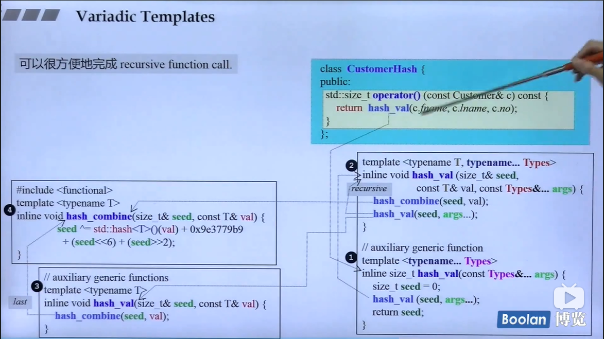
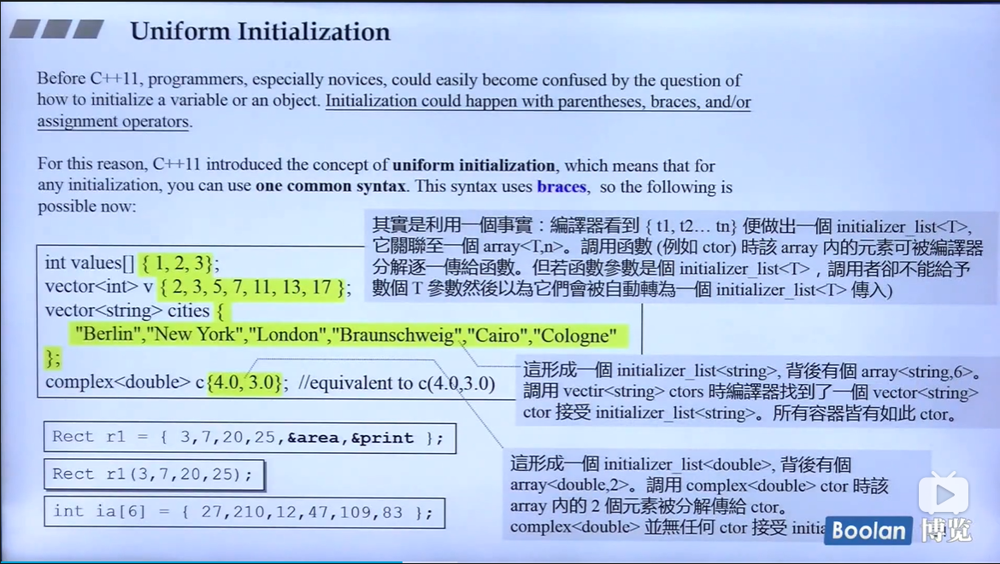
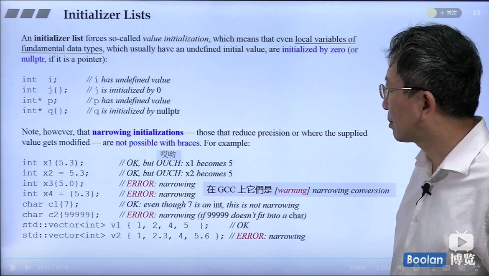
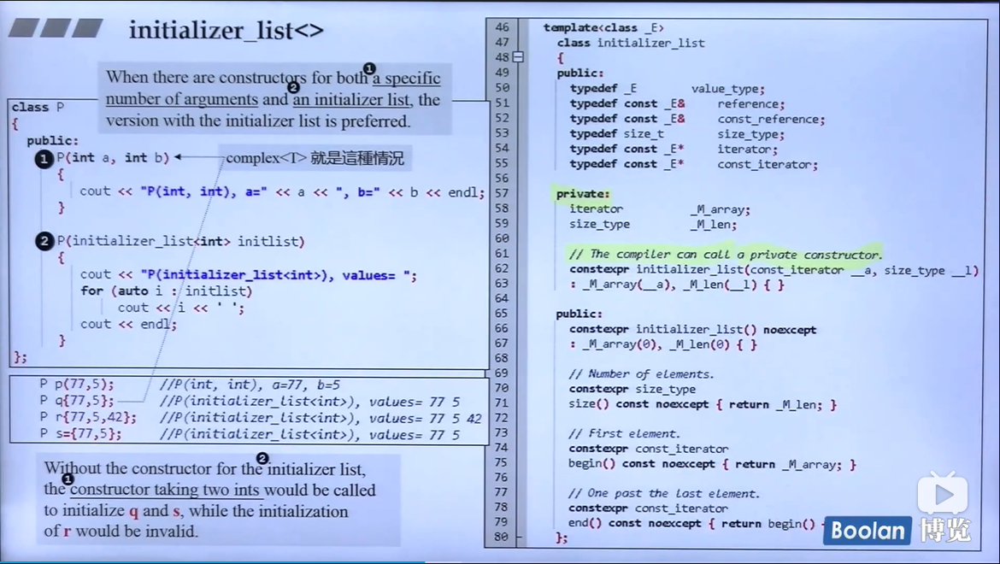
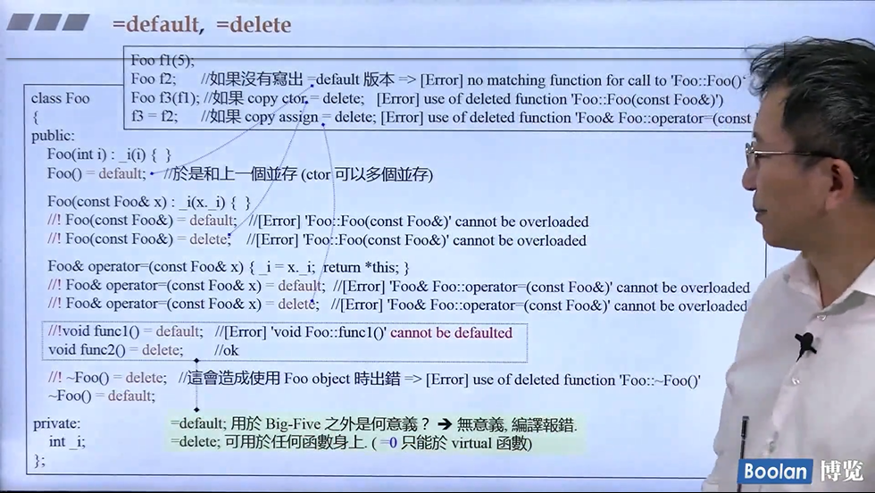
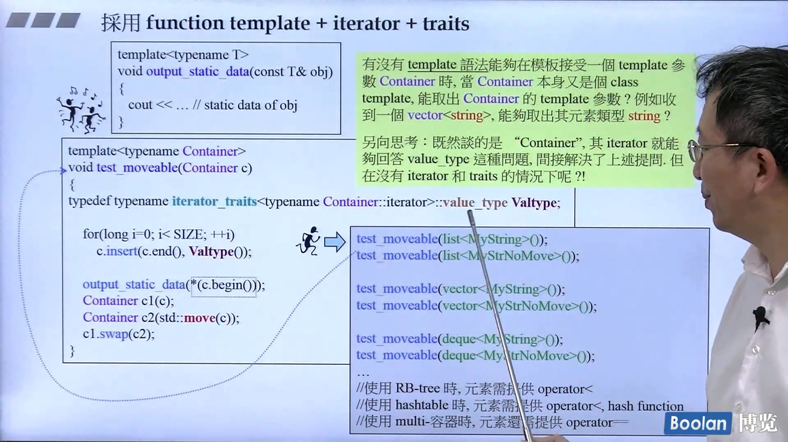
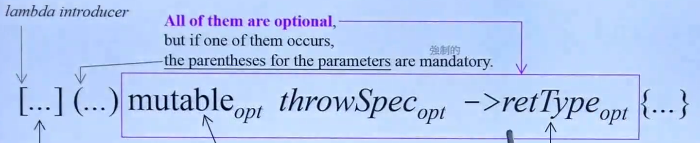
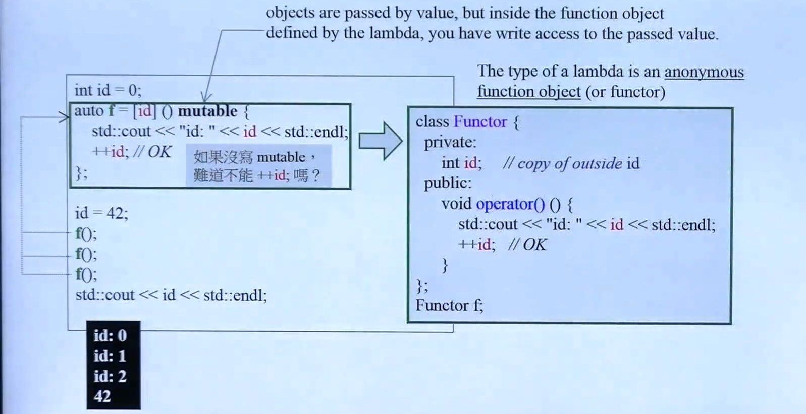
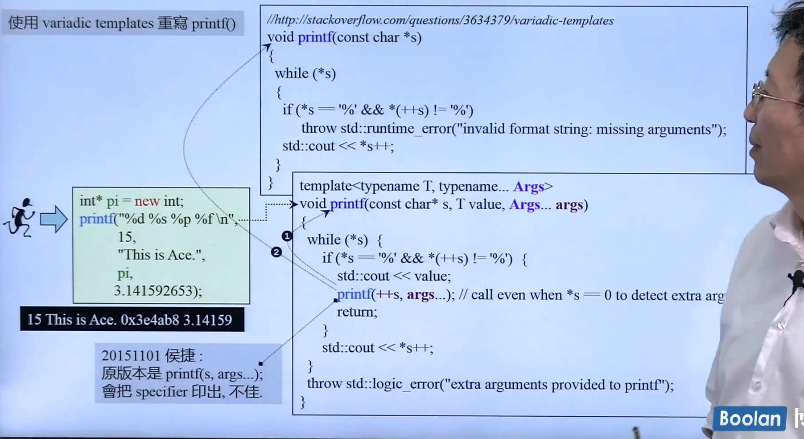
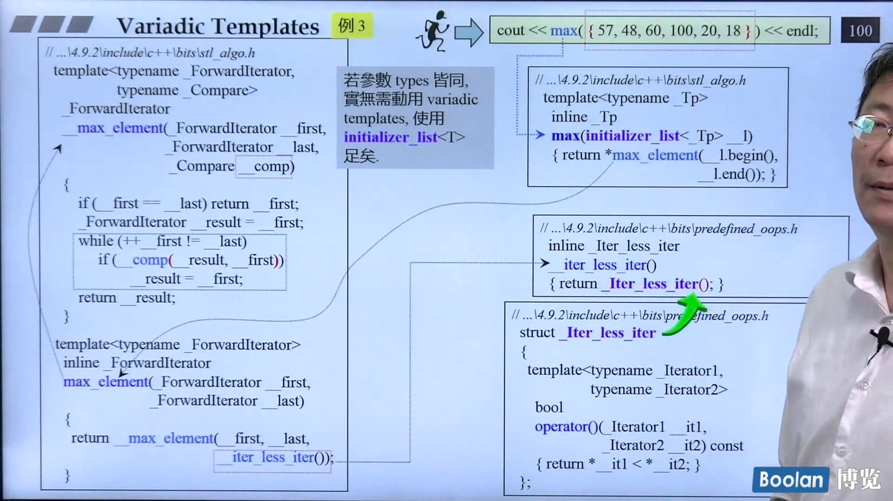

# Hou Jie C++ 11 新特性

## 演进 环境 与资源

重要的帮助网页:
- [cplusplus.com](https://cplusplus.com)
- [cppreference.com](https://cppreference.com)
- [gcc.gnu.org](https://gcc.gnu.org)

全文检索工具 : wingrep,source insight

## Variadic Templates-intro

可变参数函数的实例,帮助做recursive,n个写成 1 + 其他
```C++
void print(){}   // 一定要包含,不然args为空时候无法通过,相当于递归的base case
template <typename T, typename... Types>
void print(const T& fitstArg, const Types&... args){
    std::cout << fitstArg << std::endl;
    print(args...);
}
print(7.5,"hello",bitset<16>(377),43);
```
...为所谓的parameter pack,可以是模板参数包,函数参数包<font color=red> sizeof...(args) 可以得到参数的个数 </font>.
<br>
函数可以有多个候选,优先调用特化的版本,没有的时候才调用泛化的版本.tuple(任意个数的任意东西)的实现就是一个例子:<br>
<br>

## 一些小的语法变动

```c++
vector<list<int> >;//在过去要留一个空格,否则会认为这个 >> 是一个操作符
vector<list<int>>  // since c++ 11
```

c++ 11 使用**nullptr** instead of 0 or NULL, 在之前,如果重载函数`f(int)`和`f(int*)`, 那么`f(NULL)`就无法确定调用哪个,出现二义性. nullptr它是一个`std::nullptr_t` : <br>
```c++
typedef decltype(nullptr) nullptr_t;
```

**auto** 一般是在很长或者很复杂的时候使用, 自己要清楚变量的类型.
```C++
vector<string> v;
...
//pos 是 std::vector<std::string>::iterator
auto pos = v.begin();
// 另一个例子, l是一个表现lambda表达式的对象
auto l = [](int x) ->bool{
    ...
};
```

**一致初始化** 在过去,初始化一个对象怎么写,让新手十分困惑,它可能发生在小括号\大括号\assignment operator中,在新的标准中,任何初始化都可以用**one common syntax**:在变量后面直接放大括号.<br>
<br>

- 大多时候`array<T,n>`中的元素一个一个拿出来给 ctor.
- 若ctor函数参数就是`initializer_list`,黄色的部分就整包发过去,调用者需要注意这点

## Initializer Lists

```C++
int i;    // i has undefined value
int j{};  // j is initialized by 0
int* p{}; // p us initialized by nullptr
```
这种初始化**不允许窄化**:<br>
<br>
`std::initialized_list<>` 是 C++ 的 class template, 参数可变模板比这个更方便的是, 这个需要任意个数同样的类型.<br>
<br>
`initialized_list<>`背后是一个`array`, array 在c++ 11 中接口类似于其他的容器, initializer_list指向这个array但是 **without containing them**, copy的话只是一个浅拷贝. 它的存在相当大程度影响了标准库的实现, 如 vector用这个方式实现会简化很多,实现的min/max等算法也可以接受多个参数(旧版本依然存在,只接受两个参数).<br>
<br>

## explicit for ctor taking more than one argument
 
`explicit` 关键字, 在2.0之前,用在一个实参的构造函数之前,用于拒绝暗中进行的类型转换:
```C++
class Complex{
    ...
} ;
Complex c1(12,5);
Complex c2 = c1 + 5; // 5会被默认构造函数变成5+0i
//如果在Complex构造函数加入关键词explicit,上面的自动类型转换就无法进行
    explicit Complex(int re, int im=0):real(re),imag(im){}
//  operand types are 'Complex' and int
```
2.0之后不再有单一实参的限制,可以给多实参的构造函数禁止做转换.

## range-based for statement

```C++
for(decl : coll){
    statement
}
```
将coll中的对象一个一个拿出来赋值给左边, 然后做statement中的动作, 相当于用迭代器全部走一遍. **no explicit type conversions are possible in such decalation** :
```C++
class C {
    public:
        explicit C(const std::string&s);
    ...
};
std::vector<std::string> vs;
for(const C& elem :vs){// ERROR: no conversion form string to C
    //do something
}
```

## =default, =delete

- 强制加上 =default,重新获得并且使用default 构造函数
- 加上 =delete, 表示不要这个该构造函数

一般用于**Big-3**(其实有4个+右值引用)函数中,default什么时候可以使用什么时候会出错见下图:
<br>
如果是非Big-3,**编译器不会自动生成,然后令他为default会报错**,但是其他member function, 不需要的话不声明即可,**声明后令他为delete也不会报错** .如果不自己声明的话,C++有默认的Big-3 函数并且它们是public 并且inline的.<br>
什么类需要自己写Big-3? 一般而言, 只要 data member有指针, 那样都需要自己写Big-3. 如:

- complex<T> , 默认的拷贝data member就可以了
- string包含一个指针, 指针有浅拷贝和深拷贝(指针指向内存中的字符串也要拷贝过去), 默认的浅拷贝是不够的

### No-Copy and Private-Copy

No-Copy 跟拷贝有关的都写成`=delete`, NoDtor 使用delete需要后果自负.  还有一种做法,把拷贝构造和拷贝赋值放到private中, 不允许一般的code去 copy, 但是可以对friends 和 members 拷贝. 在boost::noncopyable中就是用类似的方法实现的, 继承它的话就有它的性质, 只有friends 和 member可以拷贝.

## Alias Template
```C++
template <typename T>
using Vec = std::vector<T, MyAlloc<T>>; // 这个vector 使用我自己写的allocator
Vec<int> coll;
// is equivalent to
std::vector<int, MyAlloc<T>> coll;
```
用typedef无法实现,因为这样无法接受一个int作为参数, 类似的结果用macro无法实现. **做了化名之后无法做特化和偏特化** . <br>
<br>
希望使用`test_moveable(Container cntr, T elem)`测试可不可搬移(C++2.0 新语法), 希望取出容器(是一个模板)的类型并且容器做insert动作, typename+小括号为临时对象,list要加尖括号才是全名(有省略), 传入的为一个object,新的解法就是把迭代器取出来放到萃取机(traits),取出来作为Valtype:<br>
<br> 
假设容器没有迭代器,迭代器没有traits的情况呢(标准库不会出现这个问题).

## template template parameter
//TODO: 

## decltype
使用这个新的关键字, 可以让编译器找出表达式的type,这更像是我们对于gcc中非标准的`typeof`的需求, 在c++中有`typeid`, 但不好用, decltype的用法如下:
1. 用于声明return type, 允许后置返回类型,和lambdas声明return type很像
    ```C++
    template<typename Ty1, typename Ty2>
    auto add(Ty1 x, Ty2 y)-> decltype(x+y);
    ```
2. 运用于metaprogramming
    ```C++
    typedef typename decltype(obj)::iterator iType;// 有::就要加typename,不然容易不被识别
    decltype(obj) anotherObj(obj);
    ```
3. 用于pass the type of a lambda
    ```C++
    auto cmp =[](const Person& p1, const Person &p2){...};
    ...
    std::set<Persion,decltype(cmp)> coll(cmp);
    ```

```C++
map<string, float> coll;
decltype(coll)::value_type elem; // 容器中有value_type,因此可以从对象中找到它的value类型
```

## Lambdas 

C++ 11 引入了lambdas, 允许定义一个inline functionality, 用于当做是parameter or local对象, 它改变了我们对c++标准库的使用方式.<br>
它是一种可以定义在statements 或者expressions中间的functionality定义,当做一个Inline function使用. 
```C++
[]{
    //function body
}();  // 加小括号直接调用,或者可以将它pass给一个object然后get called
auto lam = []{
    std::cout <<　"hello lambda" <<std::endl;　
};
...
lam();
```

<br>
三个opt都是可选的, 只要有其中一个,就要有小括号.[]是用by value/reference 的形式取用想要见的外部变量,**mutable才可以改变它**,[]中的加=接受其他的objects by value,其行为是一个匿名的functor:<br>
<br>
`std::set<Persion,decltype(cmp)> coll(cmp);`set 需要一个比大小函数的type, 我们就将这个工作转给编译器, 如果auto和template没办法拿到lambda的type(无法使用)时候,如**pass a lambda to hash function or ordering or sorting criterion**,使用decltype,同时set也需要一个lambda对象传给构造函数, 否则它将调用一个默认的构造函数,但是**lambda没有构造函数,也没有赋值操作**, 作为一个排序准则的东西, 写成一个functor更直观一些,下面一个就是使用lambda(inline)替代functor(不是一个inline).<br>
```C++
    std::vector<int> vi{33,3,67,170,7,64};
    int x = 30;
    int y = 70;
    vi.erase(std::remove_if(vi.begin(),
                            vi.end(),
                            [x,y](int n){return x<n && n< y;}),
             vi.end());
    for(auto i:vi) std::cout << i << " ";
```

## Variadic Templates

* 用参数个数**逐个递减**,实现递归函数的调用.
* 参数类型也可以有变化, 类型也相对应减少

在模板编程中, 编译器调用的是更特化的函数, 因此使用variadic template,可以写一个泛化的函数, 实际调用中它永远不会被调用, 但是可以编译通过, 没有二义性.<br>
//todo: add variadic_temp.cpp

例2:用variadic template 重写printf<br>
<br>
例3 :使用initializer_list实现多个输入的最大值<br>
<br>
例4: 使用variadic template 实现maximum
//todo: add variadic_max.cpp

//TODO: video 19 

## 标准库的新特性-Intro
visual c++
...\include 子目录
...\include\cliext

GNU C++
```C++
4.9.2\include
4.9.2\include\C++
4.9.2\include\C++\bits //stl开投的文件
4.9.2\include\C++\ext  //extention
```
## Rvalue and move 语义
Rvalue reference是一种新的reference type, 是为了解决**不必要的copying**,当赋值的右手边是一个rvalue, 左手边的接受段可以偷右手边的资源而不是执行一个单独的allocation.

* Lvalue: 可以出现于operator=左侧者(也可能出现在右边)
* Rvalue: 只能出现在operator右侧者(最常见的就是临时对象)


```C++
string s1("hello");
string s2("world");
s1+s2= s2;//居然可以通过编译
string() = "world"; // 居然可以对temp 对象赋值
//这两个做法对于int 不可以, 但是对于string 和complex都可以做
```
Rvalue reference
```C++
int foo(){return 5;}
int x = foo(); // OK
int *p = &foo();//error: 对rvalue取其reference, before c++0x没有所谓的Rvalue reference
foo() = 7; // error
```
vector的insert 有两个版本, 
```C++
insert(...,&x); //会调用x的拷贝构造
insert(...,&&x);//会调用x的拷贝构造,因该要有move的构造函数版本
```
<br>
move之后, 原来的指针就应该被打断, 否则就是代码有问题.如果Insert 是一个左值, 而且将来不会再用到之后, 可以使用`std::move(v)`就相当于拿到了Rvalue reference.

## Perfect forwarding
<br>
C++ 2.0之后有新的move aware的 insert 版本, 但是在做搬移的时候, 还是有需要注意, 如果没有特殊的设计, 那么转交的动作是不完美的,标准库使用forward实现完美的转交<br>
<br>
那么不完美的转交是怎样的?<br>
<br>
在[...\4.9.2\include\c++\bits\move.h]() 中, 用forward这个模板函数实现了完美的转发.<br>
**最终的目的是设计一个可以被偷的类型,增加效率, 其中用到了`std::move()`和`std::forward()`**.

## 一个move-aware的class
### 实现
如一个String(带指针),传统的拷贝构造(深拷贝)之外要有move构造函数(浅拷贝):
```C++
MyString(MyString &&str) noexcept // move的版本
: _data(str._data),_len(str._len){ // 将原来的指针_data和长度都偷过来
    str._len = 0;
    str._data = nullptr; //非常重要,需要打断原来的指针,否则声明消失析构函数调用起来,数据就被delete,
    //同时析构函数要判断它不为nullptr才delete
}
virtual ~MyString(){
    if(_data){  // 配合move的版本, 需要不是null才删除
        delete _data; 
    }
}
```
### 测试
// TODO:video 26

*** 
# 内存管理-从平地到万丈高楼
## 第一讲: primitives
我们的目标是从最基础的C++语言构建到高知名度的内存管理器,彻底了解内存管理高高低低的方方面面.<br>
Doug Lea的作品 DL Malloc,[主页](http://gee.cs.oswego.edu/dl/), 推荐的书籍:

1. STL源代码剖析, Chap 2
2. Modern C++ Design, Chap 4
3. Small Memory Software (相对抽象)

<br>
// TODO: vedio 3 2 min


***
# C++ 11/14 高级编程 : Boost 程序库探秘

## Chap 1 : 全新的C++语言
### 左值和右值
* 左值是一个函数或者对象的实例
* 失效值是生命期即将结束的对象
* 右值包括失效值\临时对象以及不关联对象的值(如字面值)
* 纯右值是指非失效的那些右值

简单解释: 左值是一个**可以用来储存数据的变量, 有实际的内存地址(即有变量名而且可以取地址), 表达式结束后依旧存在**. 非左值是一个 **"匿名"的"临时"变量,在表达式结束时生命周期终止**,不能存放数据, 可以被修改也可以不被修改.<br>
**右值引用**: 对一个对象使用右值引用, 显式标记这个对象是一个右值, 可以被转移来优化, 同时对象不会在表达式结束时候消失,与右值引用绑定在了一起, 可以用const修饰, 但是没有意义.<br>
**转移语义**: rvalue对象可以被转移进而优化代码,在C++2.0 `<utility>`定义了便捷函数`std::move()`来转移对象,相当于`static_cast<T&&>(t)`,将一个对象明确地转换为右值引用,该对象确认是右值对象,可以被安全地转移,如一个moveable类中一个工厂函数, 返回函数内部的局部变量obj,是一个rvalue, 可以直接用临时变量的值来创建对象, 避免了拷贝的代价.
```C++
    moveable m1;
    moveable m2(std::move(m1));
    moveable m3 = moveable::create();//转移赋值
```

**完美转发**: `<utility>`中还有一个函数,`std::forward()`,可以把函数参数原封不动地转给其他函数.
```C++
void check(int&){
    cout << "lvalue" << endl;
}

void check(int&&){
    cout << "rvalue" << endl;
}
template<typename T>
void print(T&& v){ // print的参数是一个rvalue引用,但是依旧可以将原来的lvalue提取出来
    check(std::forward<T>(v));
}
void case5()
{
    int x = 10;
    print(x);
    print(std::move(x)); // 传入的是一个左值
}
```
### 自动类型推导
**auto**:
- auto只能用于赋值语句的类型推导, 声明变量(无表达式无法推导)
- auto总是推断出值类型(非引用)
- auto允许使用"`const/volatile/&/*`"修饰, 得到新的类型
- auto&& 总是推断出引用类型

**decltype**: `auto`能实现 __赋值__ 语句中的类型推导, 但是在实际使用中,这是很少的场景,在任意时候都能得到表达式类型要使用`decltype`, 其形式像是函数调用:
```C++
    decltype(expression)
    // 如在下面的场景中
    decltype(std::less<int>()) functor; // declear a functor
    decltype(0.0f) func(decltype(0L) x){// in function parameter and return type
        return x*x;
    }
    typedef decltype(func)* func_ptr;
```
用法和`auto`一样简单,但是需要注意以下细节:
- decltype(e) 获得表达式值的类型
- decltype((e)) 获得表达式计算结果的**引用类型**

since c++ 14, 出现了`decltype(auto)`, 用法简单不再介绍.

### 面向过程编程

**nullptr**:可以隐式转换成其他任何指针类型,但是不能转化成非指针类型, 此外它是**强类型的**,并不能转为`int`或者`void*`,而是专门的'nullptr_t'.<br>
**列表初始化**: 统一使用`{ }`初始化变量,语法将括号内生成一个`std::initializer_list`对象,具有类似于标准容器的接口.<br>
**range-based for loop**: 使用auto 推导值类型的时候为了避免出现值拷贝的开销可以使用`auto&`, 只是语法糖,相当于使用iterator实现的.<br>
**新式的函数声明**: 将返回值后置, 使用`auto` 和 `decltype`的类型推导能力,基本形式是`auto func(...) -> type{...}`, 因为在泛型编程的时候, 函数的返回值类型可能需要实际的参数来决定, 因此必须将返回值类型声明后置,
```C++
template<typename T, typename U>
auto calc(T t, U u) -> decltype(t + u){
//typename std::common_type<T,U>::type calc(T t, U u)
    return t+u;
}
```

### OO 编程
**default/delete**:显示地生成/禁用编译器可能自己生成的函数,如类的构造/析构函数,使用的方法如下:
```C++
class default_demo{
public:
    default_demo() = default;
    ~default_demo() = default;

    default_demo(const default_demo&) = default;
    default_demo& operator=(const default_demo&) = default;

    default_demo(default_demo&&) = default;
    default_demo& operator=(default_demo&&) = default;
public:
    default_demo(int x) {}
};
class delete_demo{
public:
    delete_demo() = default;
    ~delete_demo() = default;

    delete_demo(const delete_demo&) = delete;
    delete_demo& operator=(const delete_demo&) = delete;
};
```

**override**, 在C++中, 如果一个member function是virtual的, 那么它的所有派生出来的子类中所有的同名函数也会是虚函数,无需`virtual`修饰, 因此在阅读时候可能会有一点困难,无法区别哪些函数是继承自父类,哪些函数是自己写测,同时可能使用一个同名但是签名不同的函数,为了解决这个问题, 2.0中引入了一个新的关键字, **显式标记虚函数的重载**:
```C++
struct abstract : public interface{
    virtual ~abstract() = default;

    void f() override final {}
    void g() override {}
};

struct last final : public abstract{
    virtual ~last() = default;

    //void f() override {}
    void g() override {}
};
```

**final** 用于控制类的继承和虚函数:
- 在类名后使用final, 显示禁止类被继承, **无法继续派生**
- 虚函数名后使用final, **显示禁止该函数在子类里面被重载**

**成员初始化**, C++ 2.0 标准放松了成员变量初始化的要求, 允许类在声明时使用赋值或者花括号的方式直接初始化,而无需在构造函数中特别指定.<br>
**委托沟造**: 过去的程序中,为了避免代码重复, 往往会使用特殊的初始化函数供构造函数调用, 在2.0中引入了委托构造函数,可以**将对象的构造过程"委托"给其他构造函数来使用**:
```C++
class demo
{
private:
    int x,y;

public:
    demo() : demo(0, 0) {}
    demo(int a) : demo(a, 0) {}
    demo(int a, int b){
        x=a;y=b;        //相当于过去private的初始化函数init(a, b);
    }
};
```

### 泛型编程

**类型别名** 2.0引入了`using alias = type` 形式的类型别名, 超越了原来`typedef`的范围, 可以结合template作为模板类声明"偏特化"的别名:
```C++
template<typename T>
using int_map = std::map<int, T>;
int_map<std::String> intStrMap;
```
**编译期常量** 在C++中用关键词`const`限定的量只是一个运行期不可修改的常量, 在泛型编程中可能需要编译期不可修改的常量,c++新增 __constexpr__, 相当于编译期的常量, 可以让编译器更好地优化代码,C++11中constexpr函数用法比较严格, 只允许一个return, 但是在14中有一些放宽.<br>

**静态断言** 可以在编译期加入诊断信息, 提前检查可能发生的错误,使用的基本形式如下,一般需要配合type_traits库使用, 检查各种编译期的条件.
```C++
    static_assert(condition, message);
    //如判是多少位的int
    static_assert(sizeof(int)==4,"int must be 32bit");
```
**可变参数模板** 基本使用的方式如下(用`...`声明不确定的参数):
* 模板函数 `template<typename ... T> void some_fun{};`
* 模板类 `template<typename ... T> class some_class{};`

声明了可变模板参数之后, 还需要解包之后才能使用:
```C++
    template<typename ... Args>
    int print( const char *format, const Args& ... args){
        return printf(format, args...);
        //return printf(format, std::forward<Args>(args)...);
    }
```

### 函数式编程
functional programming是一种编程范式, 基于$\lambda$演算理论,**把计算过程视为数学函数的组合运算**.
:star: //TODO: 1.7~1.9 

### 其他特性
* __cplusplus宏
* 超长整型(long long),至少64位
* 原始字符串,`R"(somt string here)"`, 例如`string s = R"(this is a "\string\")"`
* 自定义字面值, 允许用户为字面值添加后缀, 从而简化代码
    ```C++
    long operator"" _kb(unsigned long long v){
        return v * 1024;
    }
    auto x = 2_kb;
    // 一般形式为
    return_type operator"" _suffix(argument);
    ```

## Chap 2: Intro to 模板元编程

### 常用语言元素

:smile: enum \ static用于定义编译期的整数变量<br>
:smile: typedef \ using 最重要的元编程关键字， 用于定义数据<br>
:smile: template,模板元编程的起点，主要用于定义元函数<br>
:cry: “::”, 用于解析类型作用域获取计算结果

### 元数据

C++编译器在编译期可以操作的数据， 不可变，不能就地修改，常见的为整型和c++的类型，它不是普通的运行时变量， 而是如int\double\class(非模板类) 这样的抽象数据类型。since C++ 11/14， 常用using和typedef关键字和 using关键字声明元数据：
```C++
    using meta_data1 = int;
    using meta_data2 = std::vector<float>;
```

### 元函数

模板元编程中用于操作元数据的“构件”， 可以在编译期被调用, **编写元函数就像是一个普通的运行时函数, 但在形式上确实一个模板类**.

* 函数参数列表由圆括号"()"变成了模板列表声明的尖括号"< >"
* 函数的形参变成了模板参数,并且要使用 `typename`修饰
* 元函数本质上是一个类,用";"结束
* 不能使用运行时关键字, 所以不能用return计算返回值,而是在其中用`typedef`/`using`定义一个名为type或者value值作为返回
```C++
templata<int N, int M>
struct meta_fun{
    static const int value = N + M; // 编译期计算整数之和,since c++11
};
cout << meta_fun<10,10>::value << endl;
```
这个实际上是编译期常量, 以下过程发生在运行时, 所以代码不成立:
```C++
int i =10, j = 10;
meta_fun<i,j>::value; // ERROR: 元函数无法处理运行时的普通数据
```
### 元函数的转发
相当于运行时的函数转发调用,在模板类元编程中使用public继承实现, 模板参数传递给父类完成函数的"调用",子类自动获得父类`::type`定义, 就完成了元函数的返回.
```C++
template<typename T1, typename T2>
struct select1st{
    typedef T1 type;
};

template<typename T1, typename T2>
struct forward : select1st<T2, T1>//相当于完成了select2nd的功能
{};
```
### 易用工具宏
分别把template \ typename \ struct 和typedef 进行了重命名, 使得他们与普通的泛型代码区别开来.
```C++
#define mp_arglist      template
#define mp_arg          typename
#define mp_function     struct
#define mp_data         typedef
#define mp_return(T)        mp_data T type
//#define mp_return(T)  using type=T
#define mp_exec(Func)   Func::type
#define mp_eval(Func)   Func::value
```
### summary
元编程是一种超越普通程序的程序, 可以由C++编译器在编译期执行, 提高程序的运行效率,更大的用途是类型推导, 实现普通程序无法实现的功能.
* 元数据是元编程的操作对象, 可以是整数(含boolean)或任意c++类型.
* 元函数是元编程的核心, 表现为c++的模板类,可以内部定义`::type`or `::value`返回计算结果.

## Chap 3 : 类型特征萃取
在这里我们讨论模板元编程工具type_traits,它以库的形式实现了类型的特性萃取功能, 是**泛型编程和模板元编程所必须的基础设施**.
### Intro
type_traits 库提供的一组特征(traits)类, <font color=red> 可以在编译器确定类型时候具有某种特征</font>, 例如是否是原生数组, 是否是整数,是否重载了operator<等,这些东西都是compile-time检查, 不会有任何运行时效率损失.type_traits库中的元函数有两大类,

# Mastering C++ STL
## Move 语义
