# Unstanding and Using C Pointers

## Introduction

一个重要的问题是程序运行过程中变量的**scope**
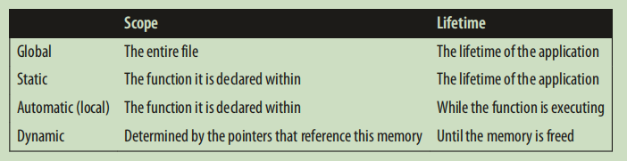<br>
因此，使用指针的时候常常出现下列问题：<br>
* Accessing arrays and other data structures beyond their bounds.
* Referencing automatic variables after they have gone out of existence.
* Referencing heap allocated memory after it has been released.
* Dereferencing a pointer before memory has been allocated to it.
<font color=red> 使用dynamic 分配内存，意味着这些部分将由自己管理分配，使用完没有释放的情况下就会出现内存泄漏。</font>

总之，问题分成两类，释放了内存之后依然用指针引用，还没分配内存就使用。<br>
**如何阅读声明** 从后往前读，如`const int *pci` pci is a pointer to const integer,`const int* const pci` cpci is a const pointer to const integer.<br>
**virtual memory** The addresses return by a program running in a virtual operation system, the operation system maps the virtual address to a real physical memory address when needed.<br>
**concent of Null** null在使用的时候有多种意思，具体要结合语境，因此特别容易搞混淆。NULL分配给了一个指针，就是说明该指针不含任何东西。NULL concept是对null指针的抽象，两个指向不同类型的空指针应该是相等的。在语言中是使用宏来实现
```c
#define NULL (void*(0))
```
同时我们要知道，空指针和未初始化的指针不是一回事，前者不指向任何地方，后者有可能指向任何地方。<br>
<font color=red> 有一个非常不安全的事情，就是空指针可以作为int被强制类型转化为0</font>,如作为函数的输入,在c++中有一个类型安全的空指针nullptr。<br>
**Pointer to void** 其中的两个特性：<br>
* 使用pointer to char来实现，在内存分配之类的上
* 无法==其他的pointer，特例是两个NULL的void pointer是相等的

使用pointer to void时候需要注意，如一个int point 被 cast 成 void，再可以cast成其他类型，这是非常危险的。<br>
**全局和静态pointer** 
```c
int *globalpi;
void foo() {
 static int *staticpi;
 ...
}
int main() {
 ...
}
```
其中，可以发现他们的存储结构可以认为是没有从堆栈中要空间，是全局的。<br>
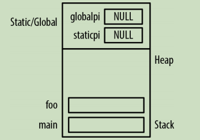<br>
**Pointer Size and Types** 
* 不同编译器和系统中的pointer size可能不同，但是一般所有data pointer 都是等长的
* pointer to function 的 size可能和其他pointer不同

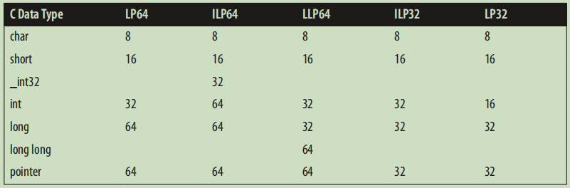<br>
几个常用的数据类型，在处理pointer时候有优势：<br>
* size_t size type,本质上是一种unsigned int 
* ptrdiff_t 使用处理pointer之间的算术
* `intptr_t & uintptr_t` is a new invention, created after 64-bit and even 128-bit memory addresses were imagined.If you ever need to cast a pointer into an integer type, always use `intprt_t`.<br>
<font color = red> 使用强制类型转换可以把其他的类型cast成intprt_t,但是永远不要将pointer 转换成int。</font>
```
#ifndef __SIZE_T
#define __SIZE_T
typedef unsign int size_t
#endif
```
normally,the maximum possible vaule for size_t is `SIZE_MAX`.<br>

**Pointer Arithmeric**
* 指针自增/自减
* 两个指针之间作差/对比

## Dynamic Memory Management in C

动态分配内存一个很大的作用就是帮助实现高级的数据结构，如linked list 或者 queue<br>
**动态分配步骤**
* 使用malloc分配内存
* 使用内存完成程序的部分
* 使用free释放内存

```c
int *pi = (int*)malloc(sizeof(int));
*pi = 5;
printf("*pi:%d\n",*pi);
free(pi);
```

malloc 使用的argument决定了分配内存的大小，成功返回一个指向heap地址的指针，失败则返回NLLL.<br>
在实际使用中发现，有时候free的内存仍可以通过指针取它的地址，因此一个合理的做法是free之后的指针赋NULL。<br>
**Memory leaks**<br>
losing the address:
```c
int *pi = (int *) malloc(sizeof(int));
*pi = 5;
...
int *pi = (int *) malloc(sizeof(int));
```
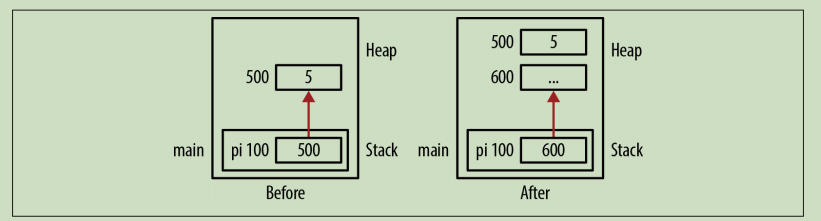<br>

还有一种，就是指针遍历之后变成了NULL，就丢失了相应的信息。<br>
**hiden memory leaks**

**Allocation Functions**<br>
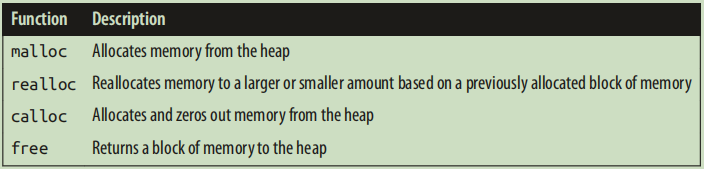<br>
malloc的函数原型为<br>
`void* malloc(size_t)`
具体作的事情，有几点需要注意：<br>
* memory从heap中分配
* 除非cleared，内存不会变化
* 返回的为第一个byte的地址

**cast or not** 在早期没有void类型的pointer时候，分配内存要显示表示出来pointer的类型，但是void指针可以指向任何东西，现在就不需要了，但是基于下面两个理由，我们依旧认为cast是一个好的习惯：<br>
* 方便记录malloc的类型
* 和c++/早期的C兼容

**几个典型的错误**<br>
* 分配了内存，但是没有往里面写东西就取数据，特别是面对char*想用作string时候问题特别明显
* malloc要的内存size不对
* 使用malloc初始化global 或者static的指针，但是我们可以用于赋值。
```c
static int *pi;
pi = malloc(sizeof(int));
```
这种做法是允许的。

**Using the calloc Funciton** `void *callloc(size_t numElement, size_t elementSize)` , 用来辅助malloc的运行，相当于`malloc(numElement*elementSize)`之后再`memset`为0.<br>
**Using the realloc Function** `void *realloc(viod *ptr, size_t size)`,它的具体行为如下：<br>
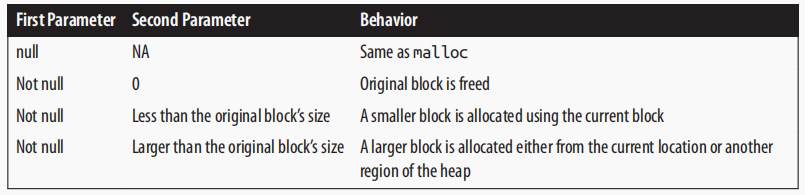<br>
其中重要的一点是，使用它要求分配更多的内存，地址可能会发生变化。<br>
**Variable Length Arrays** (since c99) <font color = red >允许在函数中的变长数组</font>.
```c
void compute(int size){
    char* buffer[size];
    ...
}
```

size大小为runtime确定，而此前数组大小必须在编译时候确定。<br>
**Deallocating Memory Using free Function** <br>
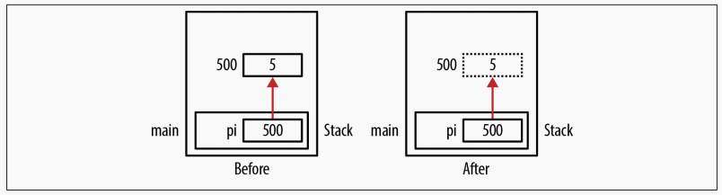<br>
但是需要注意，free不是由malloc定义的指针是未定义的行为。
```c
int mun;
int *pi = &num;
free(pi);
```

此外，free之后指针再取地址上的值也是未定义的行为，free之后再定义为NULL.<br>
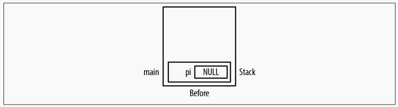<br>
**Double Free** 一个很重要事情是，不要对同一块内存free两次，如
```c
p1  = (int*)malloc(sizeof(int));
int *p2 = p1;
free(p1);
...
free(p2);
```

这种做法相当于对同一个内存做了两次free, 会引起corrupt heap和程序终止.<br>
**Dangling Pointers** pointer被free之后依然指向原来的地址，会带来一系列的问题：<br>
* 对该地址取值导致不可预测的行为
* 该地址不可accessible时候的分割错误
* 安全问题

常见的问题就是多个指针指向同一个东西，然后一个free之后另外的指针还在操作。<br>
```c
int *p1 = (int *) malloc(sizeof(int));
*p1 = 5;
...
int *p2 = p1;
...
free(p1);
...
*p2 = 10;//Dangling Pointer
```

还有一种可能是在语句块中，一般将他们处理成stack frame,其中释放之后，还有指针指向这些地方。<br>
```c
{
    int tmp = 5;
    pi = &tmp;
}//pi 这时候成了dangling pointer
foo();
```

其地址如下图所示：<br>
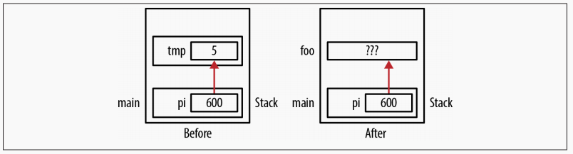<br>
**Dealing with Dangling Pointers** 有很多处理这种的方式，包括：<br>
* free的指针设置成NULL
* 使用自己定义的free函数
* 第三方工具检查

## Pointers and Functions

**程序的堆和栈** 
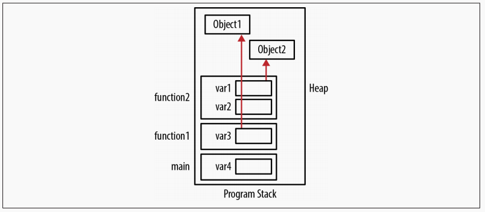<br>
一般而言，自己管理的内存在于程序的堆区，而函数调用栈和堆分别占用内存的低地址区和高地址区域，main调用的funciton1调用了function2,这样从上面就可以看出函数调用栈的LIFO特性（<font color= red> Last In First Out</font>）<br>
**管理stack frame** <br>
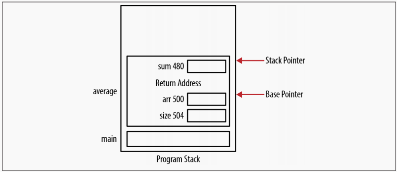<br>
每个stack frame有很多东西，其中包括系统管理的stack and base pointer用于管理stack,返回地址，local data和parameter的存储。<br>
它们一般是按照Opposite的order去Push到stack中，而一个语句块相当于mini function。<br>
**Passing and returning by Pointers** <br>
 by pointer很重要的一点是可以改变pointer指向的地址的值，同时对于比较大的数据结构，拷贝带来的消耗也明显减少。<br>
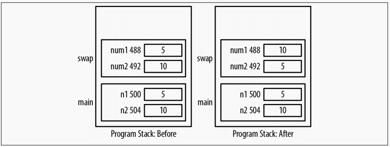<br>
对于不想要修改的数据，可以选择<font color=red> passing a Pointer to const </font>.
```c
void passingAddressOfConst(const int* num1,int *num2){
    *num2 = *num1;
}
```
返回一个指针很简单，只需要将函数声明为对应的指针类型，一般有两种做法：<br>
* 在函数内部分配内存(malloc),处理完返回指针，这时候调用者需要自己deallocatingei内存。
* 将内存地址传参进入函数，这时候调用人需要自己分配和释放内存。

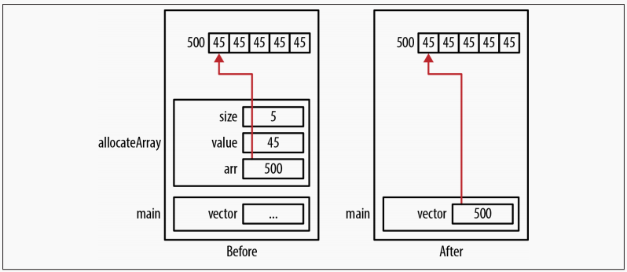<br>
常见的问题有以下的部分：<br>
* 返回没有初始化的内存
* 返回一个invalid的地址
* 返回一个<font color=red>local </font> 变量的地址
* 返回了地址但是用完之后没有free

**Passing Null Pointers** <br>
```c
int* allocateArray(int *arr,int size,int value){
    if(arr != NULL){
        for(int i = 0; i < size; i++){
            arr[i] = value;
        }
    }
    return arr; // arr为一个pointer
}
```
调用的时候，首先使用一个malloc分配好内存，再传入函数。<br>
**Passing A pointer to a Pointer**<br>
##### function Pointers
excution functions in an order that may be not known at compile time and without using conditional statements.<br>
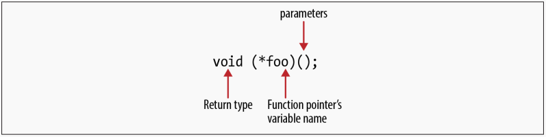<br>
<font color=red> 注意要用到括号，不然就会理解成为返回一个pointer的function而不是function pointer.</font><br>
**使用function pointer** 
```c
int (*fptr)(int);
int square(int num){
    return num * num;
} 
int n = 5;
ftpr = square;
ftpr(n);
```
同时，也可以使用function作为函数的参数列表。
```c
int add(int num1,int num2){
    return num1 +num2;
}
int subtract(int num1,int num2){
    return num1 - num2;
}
typedef int (*foperation)(int,int);
int compute(foperation operation,int num1,num2){
    return operation(num1,num2);
}
printf("%d",compute(add,3,5));
```
<font color=red>函数指针也可以作为返回值,或者构成array</font><br>
```c
typedef int (*fptrOperation)(int,int); //
fptrOperation select(char opcode){
    switch(opcode){
        case '+': return add;
        case '-': return subtract;
    }
}
int evaluate(char op, int num1,int num2){
    fptrOperation oper = select(op);
    teturn oper(num1,num2);
}
```
**function pointer** 也可以用于判断是否相等
```c
fptrOperation ftpr1 = add;
if(ftpr1 == add){
    ...
}
```
**Function pointer Cast** 使用`void*`无法很好的处理function pointer的问题，但是我们可以先定义一个指向void函数的指针，然后再cast到指向int,(int,int)等等。
```c
typedef void (*fptrBase)();
fptrBase basePointer;
fptrOperation opera = add;
basePointer = (fptrOperation)add;
basePointer(3,5);
``` 

## Pointers and Arrays
**Quick Review**<br>
使用sizeof去读取一个array的地址，返回的是length*`sizeof(dataType)`.<br>
单独去使用array名字的时候，它相当于是一个指向首元素地址的指针常量。<br>
有一个经常发生的问题就是out bound，需要相当小心，因为内置的array不会帮助我们去check.<br>
**Difference** <br>
* vect[i] 一般是从vect地址开始，移动i个单位，载取其中的内容，而vect+i为在地址上做运算，再从新地址取内容。（区别不大）
* sizeof运算符得到的结果不同，一个是之前说的，一个是pointer的size;
* pointer pv为lvalue,可以做更改，如`pv++`,但是vect不是lvalue,并且不能更改。

**malloc 和 realloc** <br>
malloc得到的空间可以使用array的interface去使用，更加直观，如
```c
int *pv = (int*)malloc(5 * sizeof(int));
for(int i = 0; i<5; i++){
    pv[i] = i+1;
}
```

在变长数组出现之前，可以使用realloc去改变相应的size。

**passing a 1-D Array**<br>
注意pass的时候一定要传入size,并且不能用sizeof直接得到，因为array可能不是满的，如传入一个空间为20的array，只有10个元素，传入再sort可能出现意想不到的结果。<br>
传入1-D的array,同样可以用pointer的notation去操作，传入首元素的指针，也可以使用array的notation去操作。<br>

**Passing a 1-D array of Pointers**<br>


<font color=red>指针和数组并不是完全可以交换的</font>。</br>
在大多数情况下，使用array传递数据必须带上数据的size，因为array的内部表示没有携带关于number of elements的信息，使用size of会出现意料不到的后果。<br>
**multi-D Arrays** 实际上，在实现多维数组时候，计算机是按照row-column-rank的反顺序将信息存储在一片连续的空间中的.<br>
**Pointer Notation** pointer和array有很多相似的地方，
```c
int vector[5] = {1,2,3,4,5};
int *pv = vector;
```
这样的话，下面的结果是相同的
```c
*(pv + i);
*(vector +1);
vector[i];
```
**Difference Between Arrays and Pointers** <br>
* Pointer `pv` 为一个lvalue, and must be capable of being modified,但是array名是无法更新其value的。<br>
* 使用sizeof得到的结果不相同。

**使用malloc和realloc管理array内存** 需要注意的是，使用realloc之后不需要再free，否则相当于做了两次free，程序会终止。<br>
**Passing a 1-D Array** 传入的时候，因为我们不知道array的大小，必须同时传入size，如果传入的size大小不合适，程序依旧会按照该大小去访问内存，导致出错。但是对于string就没有这个必要，因为string有自己的终止符`NUL`。此外，传入的array相当于指向首个element的pointer，因此可以用array和pointer的notation去操作传入的数据。<br>
**Using a 1-D Array of Pointers** 
```c
int* arr[5]; // 定义了一个由5个指针构成的array
for(size_t i = 0; i< 5; i++){
    arr[i] = (int*)malloc(sizeof(int));
    *arr[i] = i;
}
//for loop 也可以写成
*(arr + i) = (int*)malloc(sizeof(int));//用指针对array notation 的指针赋值
**(arr + i) = i; //用pointer to pointer dereference arr[i]的东西，赋值
```
<font color=red>理解这种各种各样神奇的表示方法的要点在于，用pointer和array的notation都可以去访问array的元素，我们只需要从左到右读，并且不忽略括号即可</font>。<br>
**Pointers and Multi-D Arrays** <br>
首先使用array的notation去定义一个2-D的array:
```c
int matrix[2][5] = {{1,2,3,4,5},{6,7,8,9,10}};
int (*pmatrix)[5] = matrix;
```
有没有括号之间的区别：<br>
`int (*pmatrix)[5]`: 一个指向array的指针 
`int   *pmatrix[5]`: 一个由5个to int 指针构成的array

## Pointers and Strings
// TODO: 第五章的string 暂时跳过
## Pointers and Structures 

### Introduction
结构体定义的两种方式：
* 使用`struct`关键字直接定义
* 使用typedef，使得接下来使用该结构体更加方便。
```c
struct _Persion{
    char* firstName;
    char* lastName;
    char* title;
    unsigned int age;
};
typedef struct _Persion{
    char* firstName;
    char* lastName;
    char* title;
    unsigned int age;
} Persion;
Persion chenht;
Persion *ptrChenht;
ptrChenht = (Persion*)malloc(sizeof(Persion));
```
上面的两种方式定义Persion的一个实例chenht，取用结构体数据的方式也不一样：
* 简单的实例化用dot notation就可以额，如`chenht.first = (char *)malloc(strlen("haitao")+1)`;
* 后面用指针的实例化要使用point to operator(->),如 `ptrChenht->firstName = (char*)malloc(strlen("haitao")+1)`;或者指针+dot operator方法`(*ptrChenht).firstName=...`

### Struct memory allocation
一般而言，structure的size是individual fields size的和，但是实际上要比这更大，因为padding会在structure 的field之间occur.这时候需要注意两点：
* 做pointer算术的时候必须小心
* array of structure 的element之间可能会有extra memory.

如：
```c
typdedef struce _alterntePersion{
    char* firstName;
    char* lastName;
    char% title;
    short age; // two byte
} alternatePersion;
printf("%d \n", sizeof(alternatePersion) ); // result 16
alternatePersion people[30];
```
### Structure 内存 deallocation
<font color=red> allocation 一个结构体的时候，运行时环境不会自动allocation结构体中的指针，同样，deallocation的时候也不会，这些都需要手动操作。</font><br>
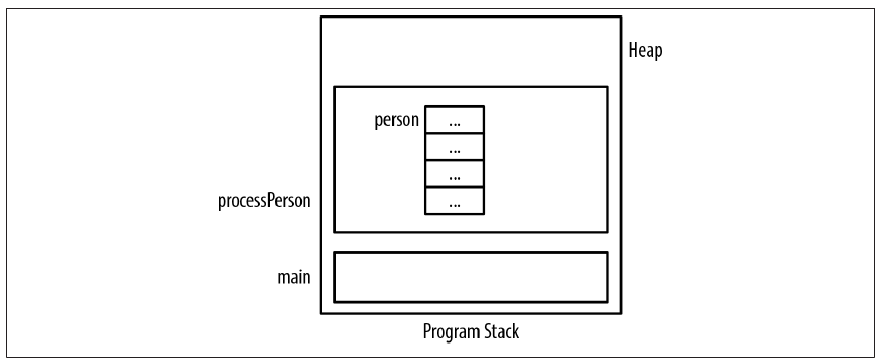<br>
在自己分配内存平且赋值之后，就变成了:<br>
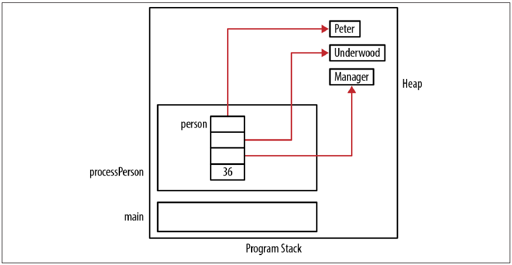<br>

### Avoiding malloc/free Overhead
一般而言，如果结构体重复allocate和deallocate，有时候会出现overhead, 导致性能严重降低。解决这个问题的方法就是维护自己的list of allocated structures. 用户不需要某个instance of structure时候，将它归还给池子，要的时候从池子里获取。<br>
但是这也会导致一些问题，比如，如果池子太小，就要一直allocate/deallocate，如果池子太大就会占用太多没必要的空间。<br>

### Using Pointers to Support Data Structure

在这里我们会实现四种常见的数据结构：
- [x] Linked List: A single-linkde List.
- [x] Queue: A simple first-in-first-out queue.
- [x] Stack: A simple stack.
- [x] Tree: A binary tree.

// TODO: to implement a real data structure by my self
#### Single-Linked List 


## Security issues and the improper use of pointers

使用C语言写安全的程序非常困难，主要是由于程序的固有属性决定的，如C语言不会帮助检查array的pointer越界，同时错误使用Pointer也是很多安全问题的来源。<br> 
### 指针声明和初始化
```c
int* ptr1, ptr2;// 不是好的习惯,ptr2是一个int类型而不是指向int的指针
int *ptr1, *ptr2; //推荐使用
```
同时，我们推荐使用typedef而不是macro.
```c
#define PINT int*
PINT ptr1,ptr2;    //避免使用
typedef int* PINT;
PINT ptr1,ptr2;   //推荐使用
```
使用指针的时候，我们要避免野指针问题：
```c
int *ptr;
...
printf("%d\n", *ptr);
```
怎样避免未初始化指针的问题
- 使用NULL去初始化指针
- 使用assert断言
- 使用第三方工具

```c
int *ptr = NULL;
...
if(ptr == NULL){
    // ptr 没有被赋值
} else{
    //正常使用该指针
}
```
`assert(ptr != NULL);`使用断言，如果断言成功则无事发生，失败的话则程序退出。<br>
### 指针使用问题
Buffer overflow occurs when <font color=red> memory outside the object's bound is overwritten</font>.<br>
#### Test for NULL
用malloc返回的指针一定要检查是否为NULL。
```c
float *vec = malloc(20 *sizeof(float));
if(vec == NULL){
    // malloc 没有要到内存
}else{
    // do something with the pointer
}
```
#### Dereference 操作符的错误使用
```c
// correct use
int num;
int *ptr = &num;
// misuse
int num;
int *ptr;
*ptr = &num;//除了定义时候，其他时候的*ptr中*是作为解引用存在的
```
**Danging Pointer** 除非用于类似于VTable的方式处理函数指针，其他时候应该没有安全问题。<br>
#### 使用array边界之外的memory
```c
    char firstName[8] ="1234567";
    char middleName[8]="1234567";
    char lastName[8] = "1234567";
    middleName[-2] = 'X';
    middleName[0] = 'X';
    middleName[10] ='X';
```
在内存上，就变成了这样：<br>
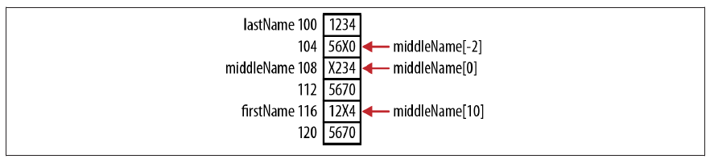
#### 使用不正确的array size
```c
void replace(char buffer[], char replacement, size_t size) {
    size_t count = 0;
    while(*buffer != '\0' && count++<size) {
        *buffer = replacement;
        buffer++;
    }
}
//之后，使用该方式调用
    strcpy(name,"Alexanderiii");
    replace(name,'+',sizeof(name));
```
问题就在于，strcpy这个函数是允许buffer overflow,假设用户是按照正确的方式pass size,因此我们在使用这类函数的时候要非常的小心，同时pass一个buffer的size去加一层保险。
#### misusing of sizeof operator
有时候，我们直接使用sizeof对array求bound，但是这个大部分时候都是有问题的，如我们对一个int array求bound，那么需要用`sizeof(arr)/sizeof(int)`才能得到正确的结果，诸如此类。
#### Bounded Pointers
这个条款的意思是，再严格控制pointer valid区域中使用。首先说明它的tedious的用法：
```c
#define SIZE 32

char name[SIZE];
char *p = name;
if(name != NULL){
    if(p>=name && p < name+SIZE){
        // 使用pointer
    } else{
        // valid pointer, do something
    }
}
```
此外，我们可以<font color=red>使用static analysis tools.</font>

#### String 的安全问题
现在一般直到，使用strcpy和strcat可能导致buffer overflow,传入size_t的参数可能缓解这个问题，现在可以使用strcpy_s和strcat_s，它们遇到overflow时候会返回error.同样，scanf_s 和 wscanf_s 函数也可以解决buffer overflow的问题。

#### Pointer 算术运算和结构体
<font color=red> 指针算术运算严格只运用于array中，Structure的field可能没有allocate在一块连续的内存区域，因此不应该使用指针算术。</font>如以下例子中：<br>
```c
typedef struct _Persion{
    char name[10];
    int age;
} Persion;
Persion chenht;
char* pc = chenht.name;
int *pi = &(chenht.age);
printf("%d",(char *)(pi)-pc);//这种类型转换可能不安全
```
从结果上看，name 和 age之间有两个闲置的byte没有使用。

#### Function pointer的问题
一个可能的错误是，使用function pointer去得到一个数值，然后用这个数值用于boolen的判断，如果忘记了括号，那么function pointer的值一直不为0，被认定为true.<br>
同时，fptr的签名和指向函数的签名不一致的时候，也会出现未定义的行为。<br>
```c
int (*ftpr)(int,int);
int tripAdd(int n1, int n2, int n3){
    return n1+n2+n3;
}
ftpr = tripAdd;//error:在c++中会报错，需要用reinterpret_cast<>()做显式类型转换
ftpr(2,3);
```
### memory deallocation Issues
#### Double free
```c
char *name = (char*)malloc(...);
char *newName = name;
...
free(name);
...
free(newName);
```
解决的一个办法是，如果将一个指针free之后,将该指针的值设为nullptr.<br>
#### Clearing Sensitive Data
```c
char *name = (char *)malloc(...);
...
memset(name,0,sizeof(name));
free(name);
```
因为释放内存之后，操作系统不一定会zero out 内存上的值，其他程序还有可能访问到该程序的数据。
#### Using static analysis tools
如GCC的-Wall选项可以帮助捕捉更多的问题，具体需要参考其他的资料。

## Odds and Ends
### Casting Pointers
我们可以使用字节转换来干很多事情：
- accessing a special purpose address
- Assigning an address to represent a port
- Determining a machine's endianness(字节顺序)

```c
int num = 8;
int *pi = (int*)num;
```
这种做法非常危险，因为指向的地址不一定由该程序管理，更长见的做法是将pointer cast 成 int，做完相对的运算之后再cast回去，这种做法也不推荐，更好的实践是使用一个**union**，可以存一个int或者int *.
```c
pi = &num;
printf("before casting: %p\n",pi);
int tmp = (int)pi;
pi = (int*)tmp;
printf("casting back: %p \n",pi);
```
#### accessing a special purpose address
在嵌入式系统的媒体访问中，经常要用到这个方式。例如，在有的low-level OS 核心中，video RAM为`0XB8000`,显示的第一行第一列的字母就存在该地址。
```c
#define VIDEO_BASE 0X8000
int *vedio = (int*)VEDIO_BASE;
*vedio = 'A'
```
但是如果需要访问location zero的地址，有时候编译将它视为`NULL`,对于low-level kernel程序，经常要方位地址0，这种时候有以下做法：

- set pointer to zero(有时候不管用)
- assign a zero to int, 然后 cast 到 int*
- 使用一个Union
- 使用`memset`函数去assign a zero to a pointer`memset((void*)&ptr,0,sizeof(ptr))`

#### Accessing a Port
Port即是软件概念也是硬件概念，一般而言，软件access一个port是OS的一部分，下面是一个使用port的实例：
```C
#define PORT 0XB0000000
unsigned int volatile *const port = (unsigned int*) port;
```
其中，volatile关键词意思是<font color=red> the variable can be changed outside of the program.</font>

#### Accessing Memory using DMA
Direct Memory Access(DMA) 是用于辅助