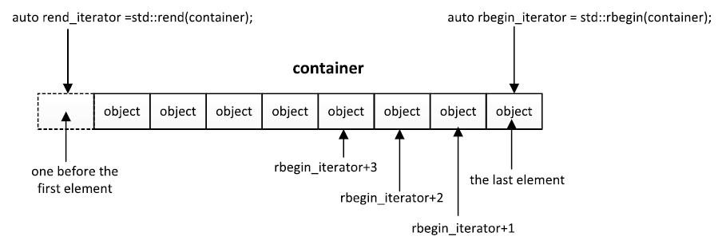
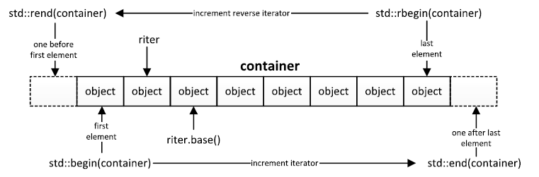
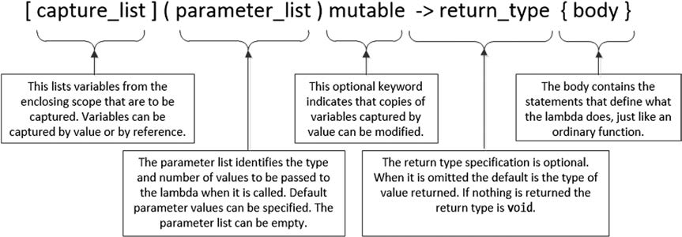
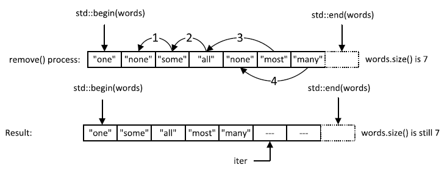
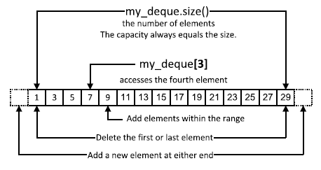
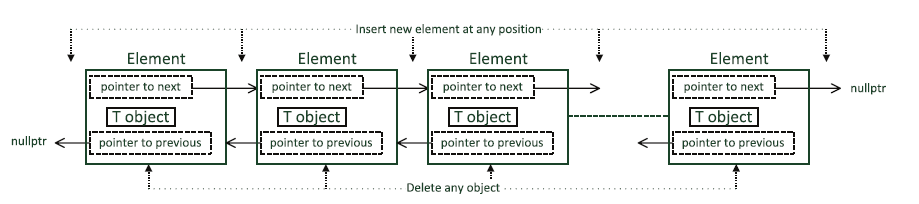
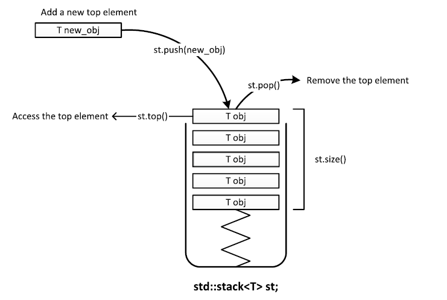
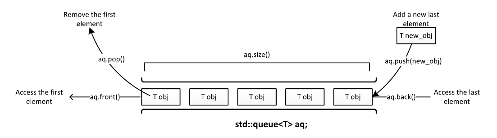
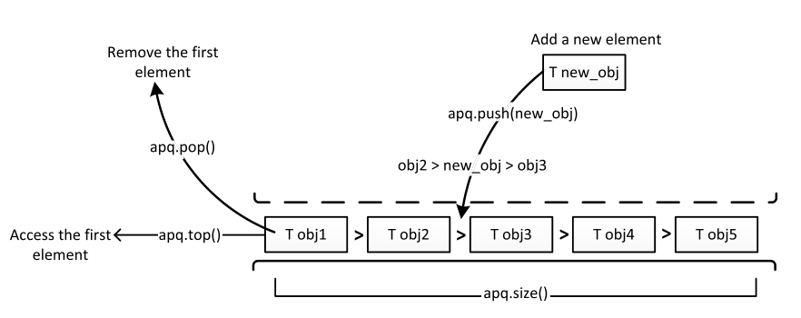

# Using The C++ Standard Template Libraries
<font size=4>**Ivor Hortan**</font>
***

## Chap 1: intruction to STL
STL为一个功能强大且可扩展的工具集,用于组织和处理数据,STL可以划分为四个概念库:

1. 容器库
2. 迭代器库
3. 算法库
4. 数值库

### 模板
__模板并不是可执行的代码, 而是用于生成代码的蓝图或者配方__.在程序中, 如果一个模板从来没有被实例化过, 那么它将被编译器忽略.当模板的实例化类型存在歧义的时候, 可以显式指定消除多义性.(一般而言, 定义类模板的时候喝定义其他类一样, 需要拷贝构造,移动构造,拷贝赋值运算符,移动赋值运算符以及析构函数五个成员)<br>
类的模板类型参数需要一个实参,除非有默认实参.实例化一个模板的时候, 发生了三个事情:
1. 确定了参数类型
2. 生成了构造函数的定义
3. 析构函数也被生成用来销毁对象

### 容器
STL 提供了下面的三种容器:
1. 顺序容器: 用线性的方式组织对象, 但是可能不需要连续的存储空间
2. 关联容器: 可以用 key 去得到对应的 value
3. 容器适配器: 提供了替换机制的适配器模板, 可以用来访问基础的序列容器或者关联容器

__容器在堆上存放对象__,并且自动管理他们所占用的内存. 默认的内存分配器(allocator)性能还是不错的, 在这里不讨论自定义的内存分配器相关的话题.<br>

### 迭代器
是一种类似于指针的模板类对象, 使用STL算法的时候, 迭代器将容器和算法联系在了一起, 通常使用一对迭代器表示一段数据(from begin to end),通常使用 _c.begin() / c.end()_ 或者 _std::begin(c) / std::end(c)_ 得到对象的两个典型迭代器. 
#### 迭代器的类别
所有类型的迭代器都必须要有一个拷贝构造函数, 一个析构函数以及一个拷贝赋值运算符. 而迭代器指向的对象必须是可交换的(swappable).
1. 输入迭代器:提供对象的可读访问
2. 输出迭代器: 提供对象的只写访问
3. 正向迭代器: 结合了输入迭代器输出迭代器的功能
4. 双向迭代器: 在前者基础上增加了自减运算
5. 随机访问迭代器: 可以支持对元素的随机访问. 这意味着它支持以下操作:
   * 通过一个整数进行自增/自减 `iter+=n`, `iter-=n`...
   * 通过一个整数进行索引访问 `iter[n]` 意思是 `*(iter+n)`
   * 两个迭代器之间做差得到迭代器之间元素个数
   * 迭代器可以进行大小比较

这些迭代器之间通过 `iterator_tag`(一种 traits)标识, 可以通过它来指定算法的参数, 表明他们满足算法需要的最小条件. 
#### 流迭代器
可以使用流迭代器, **在流和可以通过迭代器访问的数据之间参数文本模式的数据**. STL 算法可以通过指定一对迭代器来输入数据, 所有对于任何可以通过输入流访问的数据源, 都可以将算法运用到他们的元素上, 例如算法, 可以像运用到容器中的对象上那样运用到流中的对象上. 可以创建流迭代器对象, 来处理指定类型的流对象数据. `istream_iterator<T>` 这个输入流迭代器, 可以从文件流或者标准输入流`cin`, 输出流迭代器为对象提供了一个向输出流输出的功能. 下面这段代码就通过 accumulate() 函数, 计算 `cin` 流迭代器输入的一些数据的和:
```C++
std::cout << "\nThe sum of the values you entered is "
    << std::accumulate(std::istream_iterator<double>(std::cin),
    std::istream_iterator<double>(), 0.0)
    << std::endl;
```
#### 迭代器适配器
这是一个类模板, 为标准的迭代器提供了一些特殊的行为, 使得他们能够从迭代器模板得到派生, 下面分别介绍这三种适配器模板.
##### 反向迭代器
工作机制和标准迭代器相反, 可以创建双向或者随机访问迭代器的反向迭代器:<br>
<br>
容器元素的反向迭代器相对于标准迭代器, 向左偏移了一个 Object. 每个反向迭代器都有一个成员函数 `base()`, 返回一个基础迭代器, 指向 rIter 的下一个位置:<br>
<br>
##### 插入迭代器
一般的迭代器只能访问或者改变序列中存在的元素, **插入迭代器通常用于在容器的任何位置添加新的元素, 不能作用在`array<T,n>`这种 fixed-size 容器上**:
* 向后插入迭代器: 通过调用成员函数`push_back()` 将一个新的元素添加到容器的尾部, 如果容器没有定义 `push_back()` 函数,向后插入迭代器将无法使用(`vector, list, deque` 都有这个函数)
* 向前插入迭代器: 通过调用成员函数`push_front()`, 将新元素添加到容器的头部, 同样的没有定义这种函数的话就无法使用(`list, forward_list, deque` 都有)
* 插入迭代器: 用于向任何有 `insert()` 函数的容器插入一个新的元素

##### 移动迭代器
移动迭代器是从普通迭代器创建的, 指向一定范围内的元素, 可用于将某个范围内类的对象移动到目标范围, 而不需要拷贝去移动. 

### 迭代器上的运算
迭代器头文件中定义了四个迭代器的运算模板
* `advance(iter, n)`, n 可以为负数
* `distance(iter1, iter2)`, 返回两个迭代器之间元素个数
* `next(iter,n)` `perv(iter, n)`, n 的默认值为1, iter 必须有双向迭代器功能

### 智能指针
智能指针是模仿原生指针的模板类, 大多情况下没有差别, 只有下面的两点:
* 只能保存堆上分配的内存的地址
* 不能做自增或者自减运算

#### 使用`unique_ptr<T>`
指定一个对象并且独享所有权, 一般使用 `std::make_unique<T>()` 更高效地生成. 
```C++
size_t arrLen{10};
std::unique_ptr<int[]> ptrArr = std::make_unique<int[]>(arrLen);
// 这里可以使用 auto 做自动类型推导
```
使用时候需要注意, **不能以传值的方式将 `unique_ptr` 对象传入函数中**. 因为他们不支持拷贝, 必须用引用传递的方式, 同时, 作为函数的返回值, 必须以隐式移动运算的方式返回. 
##### 重置 `unique_ptr` 对象
当这种智能指针生命周期结束析构时, 所指向的对象也会被析构. 有一些方式可以改变这种行为
* `reset()` 可以析构它原来指向的对象, `unique_ptr<T>` 对象中的指针会被替换成为空指针或者指向新的对象, 不要将原来指向的一个对象的地址传给 reset,或者在已经包含`unique_ptr<T>`的地址创建一个新的智能指针`unique_ptr`, 这可以通过编译但是一定会让程序崩溃:
    ```C++
    auto pname = std::make_unique<std::string>("Algernon");
    pname.reset(new std::string{"Fred"});
    ```
* `release()`: 在不释放对象内存的情况下将 `unique_ptr<T>` 的内部原生指针设为空
* 可以使用 swap, 通过交换连个指针的方式交换对象:
    ```C++
    auto pn1 = std::make_unique<std::string>("Jack");
    auto pn2 = std::make_unique<std::string>("Jill");
    pn1.swap(pn2);
    ```

##### 比较和检查 `unique_ptr` 对象

STL 中的非成员模板函数定义了全套的比较运算符用于比较两个`unique_ptr<T>`对象或者 `unique_ptr<T>` 和空指针. 具体就是 `.get()` 得到的裸指针之间的比较. 此外, `unique_ptr<T>` 还能隐式类型转换成 boolean 类型.

#### 使用 `shared_ptr<T>`
这种指针用引用计数的方式共享对象, 我们可以使用 `std::make_shared<T>` 更加高效地创建 `shared_ptr<T>` 对象, 也可以用一个定义好的指针来初始化另一个 `shared_ptr<T>` 指针(通过由其他指针 get() 的裸指针得到 `shared_ptr<T>` 可能导致程序的崩溃):
```C++
auto pdata = std::make_shared<double>(999.0); // Points to a double variable
std::shared_ptr<double> pdata2 {pdata};
```
**不能使用 `shared_ptr<T>` 保存一个默认生成的数组, 但是可以用于保存自己生成的 `array<T>` 或者 `vector<T>` 对象**:
```C++
auto shareArr = std::make_shared<int[]>(10);
//Process finished with exit code -1073740940 (0xC0000374)
```
##### 重置 `shared_ptr<T>`
将 `shared_ptr<T>` 对象设置为空指针, 地址设为空的同时, 引用计数也将 -1. 调用 `reset()` 也可以得到同样的效果, 同时可以让指针指向别的对象:
```C++
auto pname = std::make_shared<std::string>("Charles Dickens");
pname.reset(new std::string{"Jane Austen"});
```
##### 比较和检查 `shared_ptr<T>` 对象
同样的, 这个指针可以一作比较和转为 bool 指针, 此外还有两个新的成员函数:
* `unique()` , 如果指向对象的实例数目为 1, 返回 true
* `use_count()` 返回指向对象的实例的个数

#### 使用 `weak_ptr<T>` 指针
`weak_ptr<T>` 对象只能从 `shared_ptr<T>` 或者已有的 `weak_ptr<T>` 对象创建,能做的事情优先, 不能用解引用的方式去访问其指向的对象, 但是可以有一些场景可以使用:
* 判断对象是否依然存在
    ```C++
    if(pwData.expired())
        std::cout << "Object no longer exists.\n";
    ```
* 可以使用`weak_ptr<T>` 对象创建一个 `shared_ptr<T>对象`: `std::shared_ptr<X> pNew {pwData.lock()};`

### 算法
提供一些可以用于计算和分析的函数, 运用于一些由一对迭代器指定的对象.**可以将算法运用到任何序列上, 只要能够提供特定的迭代器去访问**. 
* 非可变序列运算(Non-mutating sequence operations): 不改变值和顺序
* 可变序列运算(Mutating sequence operations): 改变序列元素中的值
* 排序/合并/关联运算: 使用时候改变序列中的顺序

### 将函数作为实参传入
有三种方式将一个函数作为实参传入另一个函数:
* 使用一个函数指针
* 传入一个函数对象
* 传入一个 lambda 表达式
  
#### 函数对象
这被称为仿函数, 是一个重载了函数调用操作符`operator()(parameter list)` 的类对象, 提供一个比使用原生函数更高效将函数作为实参传入另一个函数的方式:
```C++
class Volume{
public:
    double operator()(double x, double y, double z) {return x*y*z; }
    double operator()(const Box& box){ 
        return box.getLength() * box.getWidth() * box.getHeight(); 
    }
};
Volume volume; // Create a functor
double room { volume(16, 12, 8.5) };
Box box{1.0, 2.0, 3.0};
double roomOfBox{ volume(box)};
```
#### Lambda 表达式
用于定义匿名函数, 可以捕获他们作用域内的变量,然后使用他们, 函数的返回值为默认返回类型, 当然也可用在 return_type 中定义. <br>
<br>
我们常常使用自动类型推导命名 lambda 表达式, 例如 `auto cube = [](double length)->double {return length* length * length; };`.
##### 将 lambda 表达式传给函数
对于编程人员,一个十分困难的问题就是**如何确定 lambda 表达式的类型**, 然后写入函数的参数列表, 简单的回答是定义一个函数模板, 让编译器特话后处理不同的 lambda 表达式:
```C++
template <typename ForwardIter, typename F>
void change(ForwardIter first, ForwardIter last, F fun){
    for(auto iter = first; iter != last; ++iter) // For each element in the range...
    *iter = fun(*iter); // ...apply the function to the object
}
int data[] {1, 2, 3, 4};
change(std::begin(data), std::end(data), [] (int value){ return value*value; });
```
在这种情况下, `fun` 就是一个函数模板,可以接受一个函数对象/一个函数指针或者一个 lambda 表达式. <br>
标准库中有一个模板类型`std::function<>` 对任意类型的函数指针的封装, 包含了参数类型和返回值, 这也就包含了 lambda 表达式, 可以写成一个:
```C++
std::function<double(double)> op { [] (double value) { return value*value*value; } };
std::function<double(double,double)> sizeOfRectangle 
        {[](double length, double width)->double {return length* width; }};
```
##### 捕获子句
lambda 的引入符不一定为空, 可以有捕获子句, 指定一些封闭范围内的变量, 使得他们可以在 lambda 表达式主体中使用, 如果这里没有任何参数的话, 那么只能去引用lambda 内部的变量, 这被称为无状态的 lambda 表达式.
* 方括号中加入 `=` , 表示用值的方式访问所有封闭范围内的自动变量, 只有加入 `mutable` 之后才能改变这些量副本的值
* 方括号中加入 `&`, 用引用的方式使用封闭范围中的变量, 都能改变且不需要 `mutable` 关键字
  

不能将 auto 用于任何使用了正在定义变量的变量的 lambda 表达式, auto 不能用于自引用. 为了捕获指定变量,只要在捕获子句中列出他们的名称, 用 `&` 的话是引用传递,如`[&, factor]` 表示其他所有变量都是按引用传递, factor 使用值, 而且要加 `mutable` 才能改变 lambda 表达式中 factor 的值.<br>

## Chap 02: 使用序列容器
序列容器用线性的方式存取元素, 主要有五种标准的序列容器:
* `array<T,n>`: fixed-size array
* `vector<T>`: 可以动态扩容的容器, `push_back()`/ `pop_back()` 操作效率比较高
* `deque<T>`: 双端队列, 长度可变, 可以自动增长的序列, 两端添加/删除元素都比较搞笑
* `list<T>`: 双向链表
* `forward_list<T>`: 正向链表容器

### 使用 `array<T,n>` 容器
需要指定元素类型和个数, 和常规的数据使用没有太大区别, 相应的有两个优点:
* 可以使用 `at()`, 越界会抛出 `std::out_of_range` 异常
* 容器知道元素个数, 传入函数时候不需要指定 `size`

需要注意的是 n 必须为常量表达式(note: C++ 需要常量表达式,计算结果为常量的表达式, 以便声明数组边界/case 语句中的选择器/位域长度规范/枚举初始值设定项,常量表达式中唯一合法的操作有文本/枚举常量/声明为常量表达式初始化的常量的值 和 `sizeof`), 并且容器中的元素个数不能发生改变. 

#### 访问元素
* 可以使用`opetator[]`访问, 这种实现没有做边界检查, 性能要好一些. 
* 使用 `at()` 访问, 当越界的时候抛出 `std::out_of_range` 异常
* 为了保持和其他容器的一致性操作, 也有成员函数 `empty()`(意义不大).<br>
* 函数模板 `std::get<n>()` 的实参必须是一个在编译期能确定的常量表达式, 提供了一个不需要在运行时检查, 但是能安全访问元素的方式(编译期检查, 别的容器无法编译期间检查大小, 故无法这么做)

#### 使用数组容器的迭代器
模板定义了成员函数 `begin()` 和 `end()`, 分别返回首元素和最后元素后一个位置的迭代器. 我们一般使用 auto 做自动类型推导, 实际上迭代器被定义在容器类型种, 类型类似于这种: `std::array<unsigned int, 19>::iterator`. 最好不用成员函数, 而是用全局的 `std::begin()`, 因为它们是通用的,例如普通的数组无法使用成员函数, 但是可以使用全局的非成员函数获取迭代器.<br>
算法是独立于容器类型的, 对于任何具有指定类型迭代器的容器来说, 算法都可以运用到他们的元素上. 只想访问元素而不做修改时候, 最好使用函数`cbegin()` 和 `cend()`.<br>
#### 比较数组容器
两个数组容器只要大小相同/保存的元素类型相同而且重载了比较云算符, 就可以支持比较操作:
```C++
std::array<double,4> these {1.0, 2.0, 3.0, 4.0};
std::array<double,4> those {1.0, 2.0, 3.0, 4.0};
std::array<double,4> them {1.0, 3.0, 3.0, 2.0};
if (these == those) std::cout << "these and those are equal." << std::endl;
if (those != them) std::cout << "those and them are not equal." << std::endl;
if (those < them) std::cout << "those are less than them." << std::endl;
if (them > those) std::cout << "them are greater than those." << std::endl;
```

### 使用 `vector<T>` 容器
`vectory<T>` 大小可以自动增长, 从而可以包含任意数量的元素, 因此只需要类型信息一个参数.
#### 创建 `vector<T>`容器
一般情况下, 可以这样生成一个存放元素类型的vector容器: `std::vector<double> weightOfPeople;`,这时候没有元素也就没有分配空间, 我们可以使用成员函数 `reserve(n)`来指定内存分配保证至少可以容纳 n 个元素.<br>
当然也可以用初始化列表指定初值和元素个数:`std::vector<int> idOfStudents{ 1, 3, 4,5,6};`. <br>
还可以使用其构造函数来创建 vector 对象: `std::vector<double> vecOfZeros(10. 0.0);`. 这里需要注意的是, **使用小括号创建 vector 对象和使用大括号指定的初始化列表出来的结果是完全不同的**.<br>
使用元素类型相同的容器也可以初始化 vector 对象:
```C++
std::array<std::string, 5> words {"one", "two", "three", "four", "five"};
std::vector<std::string> words_copy {std::begin(words), std::end(words)};
// 如果使用移动的话, 原来的数组就会变成空的
std::vector<std::string> words_copy {std::make_move_iterator(std::begin(words)),
                                     std::make_move_iterator(std::end(words))};
```
#### 容量和大小
vector 对象可以通过调用 `.size()`/`.capacity()` 来获取相应的大小和容量. 显然其大小不能超过容量, 当两者相等的时候, 向 vector 中插入元素就会导致更多的内存分配(例如 gcc 的实现是容量翻倍). `vector<T>` 对象的容量和大小的数据类型是`vector<T>::size_type`, 需要用变量保存的大小的时候最好使用自动类型推导. <br>
此外可以调用 `resize()` 来改变容量的大小,区别在于使用这个成员函数的话会导致元素个数的变化:
```C++
std::vector<int> values {1,2,3}; // 1 2 3 : size is 3
values.resize(5); // 1 2 3 0 0 : size is 5
values.resize(7, 99); // 1 2 3 0 0 99 99 : size is 7
values.resize(6); // 1 2 3 0 0 99 : size is 6
```

#### 访问元素
* 使用方括号加索引为现有的元素设定值, 或者使用现有的值 :`vec[10] = 9u`;
* 上面的做法不能用于生成新的元素, 同时可能越界的时候通过 `.at()` 使用元素, 越界时候抛出`std::out_of_range` 异常
* `.front()`/`.back()` 返回一个引用, 可以出现在赋值运算符的左边
* `.data()` 返回一个指向数组的指针

#### 使用 vector 容器的迭代器
vector 实现了所有可以返回迭代器的成员函数, 也可以调用全局的 `back_inserter()` 获取一个向后插入的迭代器, 因为没有实现 `push_front()`, 无法使用 front_insert_iterator:
```C++
std::vector<double> data {32.5, 30.1, 36.3, 40.0, 39.2};
// template< class InputIt, class OutputIt >
// OutputIt copy( InputIt first, InputIt last, OutputIt d_first );
std::copy(std::istream_iterator<double>(std::cin), std::istream_iterator<double>(),
          std::back_inserter(data)); // 将流迭代器中的数据通过back_insert_iterator 写入 data
std::copy(std::begin(data), std::end(data), std::ostream_iterator<double>(std::cout, " "));
```
这里我们做的就是两个事情, 第一个是从输入流中将数据写到 data, 然后再将 data 的数据写到 输出流中.<br>

#### 向 vector 容器中添加元素
向容器中添加元素的唯一方式是使用它的成员函数.
##### 增加元素
可以使用`push_back()` 成员函数, 向末尾添加一个元素, 需要注意的是这个函数也可以使用右值引用参数, 通过转移语义来添加元素:
```C++
std::vector<std::string> words;
words.push_back(string("adiabatic")); // Move string("adiabatic") into the vector
```
还有一种更好的方式: `emplace_back()`, <font color=red>直接使用 vector 中的元素构造函数所需要的参数直接在容器中构造对象</font>:
```C++
words.emplace_back("abstemious"); 
std::string str {"alleged"};
words.emplace_back(str, 2, 3); // Create string object corresponding to "leg" in place
```
##### 插入元素
* `emplace()` 这个成员函数接受的第一个参数是迭代器, 指定对象生成的位置, 新对象会插入到迭代器之后. 后面的参数都是作为插入元素构造函数的需要. 
    ```C++
    std::vector<std::string> words {"first", "second"};
    // Inserts string(5, 'A') as 2nd element
    auto iter = words.emplace(++std::begin(words), 5, 'A');
    ```
* `insert()` 可以在 vector 中插入一个或者多个元素, 元素会被插入到第一个参数所指定的迭代器的前面(如果是反向迭代器则是后面)
  * 插入第二个参数指定的单个元素, 新元素会在迭代器指定的位置插入, 相应的所有其他元素向后移动一位:
    ```C++
    std::vector<std::string> words {"one", "three", "eight"}; // Vector with 3 elements
    auto iter = words.insert(++std::begin(words), "two");
    ```
  * 插入第二个参数和第三个参数指定的序列:
    ```C++
    std::string more[] {"five", "six", "seven"}; // Array elements to be inserted
    iter = words.insert(--std::end(words), std::begin(more), std::end(more));
    ```
  * 在vector 的末尾插入元素, `iter = words.insert(std::end(words), "ten");`
  * 在插入点插入多个元素, 第二个参数指的是第三个参数插入的次数`iter = words.insert(std::cend(words)-1, 2, "nine");`
  * 在插入点插入初始化列表指定的元素:`iter = words.insert(std::end(words), { std::string {"twelve"},std::string {"thirteen"}});`

#### 删除元素
同样的, 我们也只能通过容器的成员函数来删除元素.
* 通过 `clear()` 删除又有的元素
  ```C++
  std::vector<int> data(100, 99);
  data.clear();
  ```
* 通过成员函数`pop_back()` 删除最后一个元素
* 如果需要删除多余的容量, 使用 `shrink_to_fit()`, 如果生效之后, 现有的迭代器全部失效, 需要重新获取迭代器
* 使用`.erase()` 删除一个或者多个元素, 需要传入一个迭代器(删除一个)或者序列两端的迭代器(删除多个元素):`auto iter = data.erase(std::begin(data)+1, std::begin(data)+3);`意思就是删除 data+1 和 data+2 两个元素
* remove() 算法是由 algorithm 头文件中的模板生成, 可以删除匹配特定值得一段元素, **remove 是一个全局的函数, 因此严格说不能删除容器中的元素, 这里的做法是采用匹配元素的右边覆盖匹配元素的方式移除元素**:
  ```C++
  std::vector<std::string> words { "one", "none", "some", "all", "none", "most", "many"};
  auto iter = std::remove(std::begin(words), std::end(words), "none");
  ```
  <br>
  如果需要删除剩下空的位置, 还是需要调用上面的.erase():
  ```C++
  words.erase(iter, std::end(words)); // Remove surplus elements, 两部合起来相当于下面一句
  words.erase(std::remove(std::begin(words), std::end(words), "none"), std::end(words));
  ```

#### `vector<bool>` 容器
是模板的特例化, 通常一个 bool 只需要一个 Bit, 如果不特例化的化需要一个 Byte. 这个没有成员函数 `.data()`, 一些成员函数的行为也和一般模板的实例不同.在要用布尔值而且知道用多少的时候, 使用`bitset<N>` 相对是个好的选择.

### 使用 `deque<T>` 容器
当应用包含先入先出的事务处理时, 都应该使用 deque, 这种容器可以在头部和尾部高效地添加或者删除对象. <br>
<br>
#### 生成 deque 容器
* 默认构造生成 `deque<T>` 容器没有任何元素, 添加第一个元素之后才会导致内存的分配, 这点和 vector 是一样的. 
* 也可以指定元素个数生成容器(`std::deque<int> my_deque(10);`,这种定义之下每个元素保存的都是默认值0)
* 之外可以用初始化列表来生成容器: `std::deque<std::string> words { "one", "none", "some", "all", "none", "most", "many" };`
* 或者从其他deque容器生成一个新的副本
  * 从已经有的容器中调用构造器:`std::deque<std::string> words_copy { words };` 
  * 接受两个迭代器生成新的 deque: `std::deque<std::string> words_part { std::begin(words), std::begin(words) + 5 };`

#### 访问元素
* 可以使用下标运算符访问元素, 同时这种操作没有做边界检查
* 同样可以使用带有边界检查并且可以抛出异常的`.at()`成员函数
* 组织元素的方式导致大小和容量总是一样的, 因此没有 capacity 成员函数
* 元素并不是存放在一个数组中故没有返回 T* 的 `.data()` 成员函数
* resize() 三种重载版本基本和vector 相同
* front/back 用法也相同, 返回一个头/尾巴的引用
  
#### 添加和移出元素

* push/pop/emplace 除了 back 之外, 还有 front 版本, 在序列头部执行类似的操作
* insert/emplace 同样也可以在 deque 中使用, erase/ clear 也一样
* 由于内部实现不同, 除了在头部的操作效率比vector 高, 其他过程都要相对慢一些

#### 替换 deque 中的内容
`.assign()` 成员函数可以替换现有的所有函数, 有三个重载的版本:
* 可以由初始化列表指定的元素
* 可以是迭代器指定的一段元素
* 可以是特定对象的多个副本

```C++
//case 1:
std::deque<std::string> words {"one", "two", "three", "four"};
auto init_list = {std::string{"seven"}, std::string{"eight"}, std::string{"nine"}};
words.assign(init_list);
// case 2: 
std::vector<std::string> wordset {"this", "that", "these", "those"};
words.assign(std::begin(wordset)+1, --std::end(wordset)); // Assigns "that" and "these"
// case 3:
words.assign(8, "eight"); // Assign eight instances of string("eight")
```
值得注意的是 case 1 中需要用 `std::string` 生成 string 对象, init_list 被推导为 `initializer_list<const char*>` 后面assign 就会报错, 当然可以不单独定义 init_list 直接将初始化列表放入参数中(`words.assign({"seven", "eight", "nine"});`). 

### 使用 `list<T>` 容器
这是一个包含 T 类型对象的双向链表, 可以在常规时间内在序列已知的任何位置插入或者删除元素, 但是**不能索引元素**, 如果需要访问内部的一个元素, 必须从头/尾 开始遍历:<br>
<br>
可以和其他容器一样获得list的迭代器, 但是**无法随机访问list中的元素,故获取的都是双向迭代器**.
#### 生成 list 容器
list的构造函数用法类似于 vector 或者 deque. 
* `std::list<std::string> words;` 生成空的list
* `std::list<std::string> sayings (20,"hello");` 生成给定数量个默认对象的列表
* `std::list<double> save_values {values};` 复制 value
* `std::list<double> samples {++cbegin(values), --cend(values)};` 从两个迭代器指定的一段元素生成

当然这个是双向迭代器而不是随机访问迭代器, 只能自增/减而不能加减一个整数.

#### 添加元素
同样可以使用成员函数 `push_front()`/`push_back()`, 这两个函数都有右值引用版本, 而相对而言成员函数`emplace_front()`/`emplace_back()`可以做得更好(它们是在容器中之间构造元素, 而不是构造完之后拷贝/搬移过去):
```C++
std::list<std::string> names {"Jane", "Jim", "Jules", "Janet"};
names.emplace_front("Ian"); // Create string("Ian") in place at the front of the list
```
同样的insert有三个版本:
* 在指定迭代器的位置插入一个元素
* 在给定的位置插入几个相同的元素
* 由给定的两个迭代器, 往指定位置插入一段元素

#### 删除元素
* clear() 和 erase() 这两个成员函数的作用和前面两种容器相当.
* 有成员函数 `remove()` 移除和参数相匹配的元素
  ```C++
  std::list<int> numbers { 2, 5, 2, 3, 6, 7, 8, 2, 9};
  numbers.remove(2); // List is now 5 3 6 7 8 9
  ```
* `remove_if()` 引入一个一元断言为参数, 接受一个和元素同类型的参数或者引用, 返回一个布尔值
  ```C++
  numbers.remove_if([](int n){return n%2 == 0;}); // Remove even numbers. Result 5 3 7 9, 如果lambda 表达式返回 true 就需要删除
  // 全局的非成员 remove_if, example from cppreference.com
  std::string str2 = "Text\n with\tsome \t  whitespaces\n\n";
  str2.erase(std::remove_if(str2.begin(),
                            str2.end(),
                            [](unsigned char x){return std::isspace(x);}),
             str2.end());
  ```
* 成员函数 `unique()` 移除连续的重复元素, 只留下其中的一个
  
#### 排序和合并元素
全局的sort() 函数模板位于 algorithm 中, 要求使用随机访问迭代器, 但是 list 并不支持. **list模板定义了自己的 sort() 函数**, 它有两个版本:
* 无参版本按照升序排列所有元素
* 接受一个参数(函数对象或者 lambda 表达式) , 用参数定义的断言来比较两个元素
  
```C++
names.sort(std::greater<>()); // Function object uses perfect forwarding
```
`merge()`成员函数接受另一个相同类型的 list 作为参数, 两个容器中所有的元素都必须为升序, 参数 List 中所有元素会被合并到当前的 list 中. 这种操作之后 List 节点在内存中的位置不变, 但是操作他们的指针变了. <br>
list 容器的 `splice()` 有几个版本, 将参数 list 容器中的元素移动到当前容器中指定元素的前面.它可以移动单个元素/一段元素或者源容器的全部元素. 

#### 访问元素

list 的成员函数 `front()`/`back()` 可以返回第一个元素和最后一个元素的引用, 同时可以通过第迭代器的自增/减来访问list 内部的元素. 获取迭代器的方式也是相同的, `begin()/end()/rbegin()/rend()`. 


### 使用`forward_list<T>` 容器

这种容器是以单向链表的形式存储元素, 和 `list` 的主要区别在于 **它不能反向遍历元素, 只能从头到尾遍历**. 这意味着有很多东西无法使用:

* 首先无法使用反向迭代器 

* 无法使用 `back()`, 只有成员函数 `begin()`

* `push/pop/emplace_back()` 也无法使用

* 没有成员函数 `size()`,无法用一个向前迭代器减去另一个, 但是可以通过定义在头文件 iterator 中的 `distance()` 得到元素的个数

  ```c++
  std::forward_list<std::string> my_words {"three", "six", "eight"};
  auto count = std::distance(std::begin(my_words), std::end(my_words));
  ```

* `forward_list<T>` 是正向链接元素, 故只能在元素后面插入, `splice_after()`/`insert_after()` 用来替代 list 容器中的 `splice()`/`insert()` 

* 但是需要在表头的时候还是会有问题, 使用成员函数 `cbefore_begin()`/`before_begin()` 来解决

* 和list 容器一样, 它有 sort()/merge()/remove()/remove_if()和 unique(), 用法也是一样的

### 自定义迭代器

STL 对定义了迭代器类的类型有一些特定的要求, **这是为了保证所有接受这种迭代器的算法都能正常工作**.<br>
使用迭代器模板的时候经常会出现一个问题, 就是我们通常不知道迭代器容器的数据类型, 于是我们就可以使用 `value_type` 的别名来指定类型:
```C++
template <typename Iter> void my_swap(Iter a, Iter b)
{
  typename Iter::value_type tmp = *a; // Better - but has limitations...
  *a = *b;
  *b = tmp;
}
```
但是, 问题又出现了:**算法既可以使用指针, 也可以使用迭代器, 而指针不是类, 无法包含定义的别名**. 就是说上面的代码 Iter 为迭代器的时候能用, 传入一个指针的时候, `int*::value_type` 是没有意义的.  STL 用模板优雅地解决了这个问题.<br>
`iterator_traits`模版的定义如下:
```C++
template<class Iterator>
struct iterator_traits
{
    typedef typename Iterator::difference_type difference_type;
    typedef typename Iterator::value_type value_type;
    typedef typename Iterator::pointer pointer;
    typedef typename Iterator::reference reference;
    typedef typename Iterator::iterator_category iterator_category;
};
``` 
上面的别名十分直观, 一个满足 STL 要求的迭代器必须全部定义这些别名, 但是对于输入迭代器, 除了 `iterator_category`,其他都可以定义为 void. 于是我们往其中传入一个迭代器, 如 `std::iterator_traits<MyIter>::value_type`, 就萃取出了元素的类型. 
```C++
template <typename Iter>
void my_swap(Iter a, Iter b)
{
    typename std::iterator_traits<Iter>::value_type tmp = *a;
    *a = *b;
    *b = tmp;
}
std::vector<std::string> words {"one", "two", "three"};
my_swap(std::begin(words), std::begin(words)+1); // Swap first two element
```
现在我们来看上面的代码发生了什么, 传入 word 的一个迭代器之后, 确定 tmp 的类型为 `iterator_traits<iterator<std::string>>::value_type`, 它实际上是 `iterator<std::string>::value_type` 的一个别名, `iterator<std::string>` 是从迭代器的模版产生的, 于是它包含了value_type 的定义:
```C++
typedef std::string value_type;
```
当传入的参数为指针 `T*` 的时候, 我们给出其特化的版本,这种专门针对指针类型的特化是符合语法的:
```C++
template<class T>
struct iterator_traits<T*>
{
    typedef ptrdiff_t difference_type;
    typedef T value_type;
    typedef T* pointer;
    typedef T& reference;
    typedef random_access_iterator_tag iterator_category;
};
```
STL 定义了迭代器模版, 于是我们可以从中生成我们自己的迭代器:
```C++
template<class Category, class T, class Difference = ptrdiff_t,
        class Pointer = T*,class Reference = T&>
struct iterator
{
typedef T value_type;
typedef Difference difference_type;
typedef Pointer pointer;
typedef Reference reference;
typedef Category iterator_category
};
class My_Iterator : public std::iterator<std::random_access_iterator_tag, int>
{
    // Members of the iterator class...
};
```
此外自定义的迭代器有了上面这一套别名后, 还需要成员函数.
* 根据经验,如果迭代器定义了一个Big-3 中的任意一个函数, 就需要显式定义一个析构函数
* 对于随机访问迭代器类, 需要一整套关系运算符,当然可以使用utility 中的标准库头文件中的模版来完成这些定义, 如果我们实现的同时还包含了下面的代码, 那么我们的实现优先级更高, 这些操作符对搜索和比较操作很重要 
  ```C++
  #include <utility>
  using namespace std::rel_ops;
  ```
* 迭代器的其他操作由它的类别决定


## Chapter 3: 容器适配器

容器适配器是一个封装了序列容器的类模板, 它 **在一般序列容器的基础上提供了一些别的功能**.适配器的含义就是**通过适配容器现有的接口来提供一些不同的功能**, 这里有三种容器适配器:

* `stack<T>` 封装了一个 `deque<T>` 容器的适配器类模板, 默认一个 LIFO
* `queue<T>` 封装了一个 `deque<T>` , 默认实现一个 FIFO 的队列
* `priority_queue<T>` 封装了`vector<T>` 容器的适配器类模板, 默认的实现是一个会对元素排序, 从而最大元素总是在队列最前面的队列

### 创建和使用 `stack<T>` 容器适配器

<br>

`stack<T>` 容器适配器模板有两个参数, 第一个 T 存储元素的类型, 第二个是使用的底层容器的类型, 只要支持`back() push_back() pop_back() empty() size()` 这些操作,默认是 `deque<T>`.例如我们可以使用一个 list 作为底层的容器:

```C++
std::stack< std::string, std::list<std::string>> fruit;
```

值得注意的是, **[不能在初始化列表中用对象来初始化容器适配器, 但是可以用一个容器来初始化, 只要底层容器的类型和用于初始化容器类型一致](https://stackoverflow.com/questions/10293302/why-cant-i-construct-a-queue-stack-with-brace-enclosed-initializer-lists-c1)**.这个问题是因为适配器中没有对应与 initializer_list 匹配的构造函数, 并不是语言特性本身带来的问题, 如果自己定义一个适配器并且带有初始化列表的构造函数, 就可以使用. 

```C++
std::list<double> values {1.414, 3.14159265, 2.71828};
std::stack<double, std::list<double>> my_stack (values);
// 适配器的底层的容器 list<double> 和用于构造的对象容器类型一致
```

`stack<T>` 模板定义了拷贝构造函数, 使用的时候可以用圆括号和初始化列表.

```C++
std::stack<double, std::list<double>> copy_stack {my_stack};
std::stack<double, std::list<double>> copy_stack(my_stack);
```

#### stack 操作

* `top()`: 返回栈顶元素的引用
* `push(const T& obj) / push(T&& obj)` 压入栈顶, 通过调用底层容器的 `push_back()` 实现
* `pop()` 弹出栈顶元素
* `size()/ empty()/ emplace()` 从字面就能理解其意义
* `swap(stack<T> & other_stack)` 当前栈中的元素和参数中的交换(两者的类型必须相同), 同时全局的 std::swap 也有对 stack 特化的版本

此外, stack 对象有一套比较运算符, 通过字典的方式来比较. 

### 创建和使用 `queue<T>`容器适配器

只能访问`queue<T>`容器适配器的第一个和最后一个元素. **只能在头部添加元素, 在尾部移除元素**. <br>
<br>
同样的, 我们也可以通过第二个参数指定底层的容器类型, 只要它能提供以下类型的操作:`front(), back(), push_back(), pop_front, empty() , size()`. 
#### queue 的操作
* `front()`/`back()` 同样的返回第一个元素最后一个元素的引用, 如果 queue 是常量则返回常引用
* `push(const T&Obj)`/`push(T && Obj)` 在队尾添加一个元素(通过调用底层容器的 `push_back()` 实现)
* `pop()`/`size()`/`empty()` 这些操作就是按照字面理解
* `emplace()` 用传给的参数调用 T 的构造函数, 在尾部生成对象
* `swap(queue<T> &otherQueue)` 交换两者的元素, 同样的可以使用全局的 swap. 
* 和 stack 一样, 有一套比较运算符.

### 使用优先队列
`priority_queue<T>` 容器适配器定义了一个元素有序排列的队列, 默认**队列头部的元素优先级最高**. 这个处理过程有点类似于急救室抢救病人, 它并不总是先到先处理. 适配器模板有三个参数, 存储对象类型, 底层容器类型(默认是一个向量) 和 一个函数对象(用于决定元素的顺序). 

#### 创建优先队列
我们使用初始化列表或者迭代器初始化优先队列的时候, 不需要有序, 优先队列会对他们进行排序:
```C++
std::string wrds[] {"one", "two", "three", "four"};
std::priority_queue<std::string> words { std::begin(wrds),
                                        std::end(wrds)}; // "two" "three" "one "four"
```
