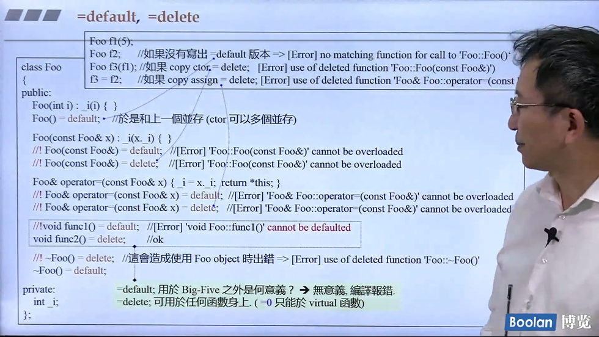
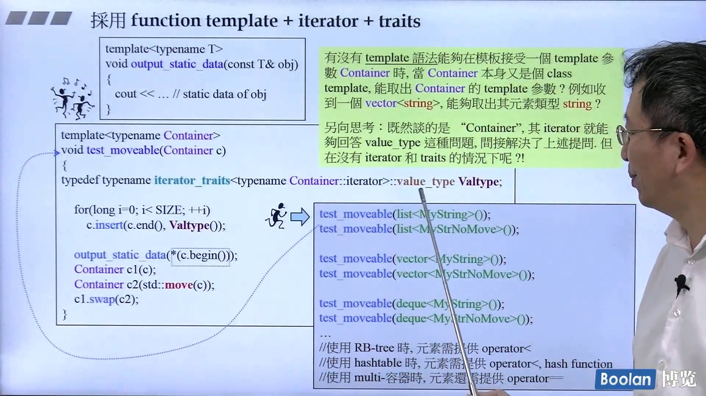
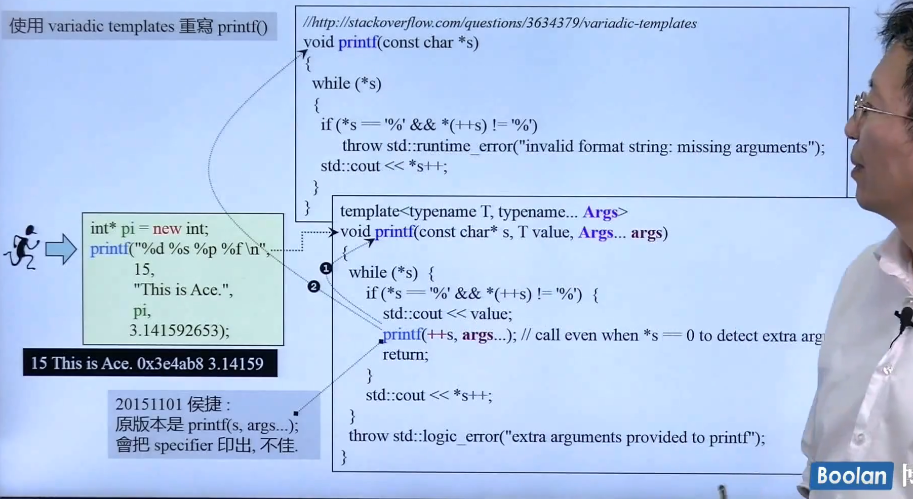
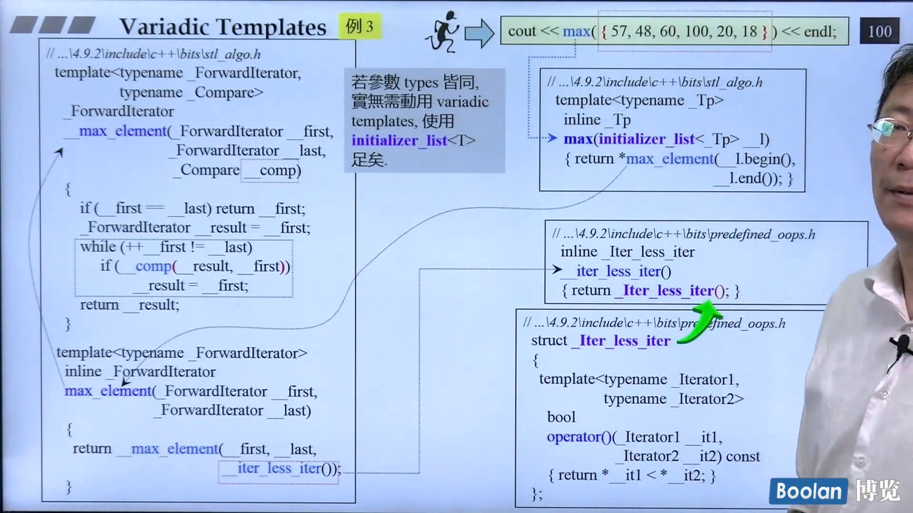

# Hou Jie C++ 11 新特性<!-- omit in toc -->
- [演进 环境 与资源](#演进-环境-与资源)
- [Variadic Templates-intro](#variadic-templates-intro)
- [一些小的语法变动](#一些小的语法变动)
- [Initializer Lists](#initializer-lists)
- [explicit for ctor taking more than one argument](#explicit-for-ctor-taking-more-than-one-argument)
- [range-based for statement](#range-based-for-statement)
- [=default, =delete](#default-delete)
  - [No-Copy and Private-Copy](#no-copy-and-private-copy)
- [Alias Template](#alias-template)
- [template template parameter](#template-template-parameter)
- [Type Alias(类似于 typedef)](#type-alias类似于-typedef)
  - [Using 关键字](#using-关键字)
  - [noexcept](#noexcept)
  - [override & final](#override--final)
- [decltype](#decltype)
- [Lambdas](#lambdas)
- [Variadic Templates](#variadic-templates)
- [标准库的新特性-Intro](#标准库的新特性-intro)
- [Rvalue and move 语义](#rvalue-and-move-语义)
- [Perfect forwarding](#perfect-forwarding)
- [一个move-aware的class](#一个move-aware的class)
  - [实现](#实现)
  - [测试](#测试)
## 演进 环境 与资源

重要的帮助网页:
- [cplusplus.com](https://cplusplus.com)
- [cppreference.com](https://cppreference.com)
- [gcc.gnu.org](https://gcc.gnu.org)

全文检索工具 : wingrep,source insight

## Variadic Templates-intro

可变参数函数的实例,帮助做recursive,n个写成 1 + 其他
```C++
void print(){}   // 一定要包含,不然args为空时候无法通过,相当于递归的base case
template <typename T, typename... Types>
void print(const T& fitstArg, const Types&... args){
    std::cout << fitstArg << std::endl;
    print(args...);
}
print(7.5,"hello",bitset<16>(377),43);
```
...为所谓的parameter pack,可以是模板参数包,函数参数包<font color=red> sizeof...(args) 可以得到参数的个数 </font>.
<br>
函数可以有多个候选,优先调用特化的版本,没有的时候才调用泛化的版本.tuple(任意个数的任意东西)的实现就是一个例子:<br>
<br>

## 一些小的语法变动

```c++
vector<list<int> >;//在过去要留一个空格,否则会认为这个 >> 是一个操作符
vector<list<int>>  // since c++ 11
```

c++ 11 使用 **nullptr** instead of 0 or NULL, 在之前,如果重载函数`f(int)`和`f(int*)`, 那么`f(NULL)`就无法确定调用哪个,出现二义性. nullptr它是一个`std::nullptr_t` : <br>
```c++
typedef decltype(nullptr) nullptr_t;
```

**auto** 一般是在很长或者很复杂的时候使用, 自己要清楚变量的类型.
```C++
vector<string> v;
...
//pos 是 std::vector<std::string>::iterator
auto pos = v.begin();
// 另一个例子, l是一个表现lambda表达式的对象
auto l = [](int x) ->bool{
    ...
};
```

**一致初始化** 在过去,初始化一个对象怎么写,让新手十分困惑,它可能发生在小括号\大括号\assignment operator中,在新的标准中,任何初始化都可以用**one common syntax**:在变量后面直接放大括号.<br>
<br>

- 大多时候`array<T,n>`中的元素一个一个拿出来给 ctor.
- 若ctor函数参数就是`initializer_list`,黄色的部分就整包发过去,调用者需要注意这点

## Initializer Lists

```C++
int i;    // i has undefined value
int j{};  // j is initialized by 0
int* p{}; // p us initialized by nullptr
```
这种初始化**不允许窄化**:<br>
<br>
`std::initialized_list<>` 是 C++ 的 class template, 参数可变模板比这个更方便的是, 这个需要任意个数同样的类型.<br>
<br>
`initialized_list<>`背后是一个`array`, array 在c++ 11 中接口类似于其他的容器, initializer_list指向这个array但是 **without containing them**, copy的话只是一个浅拷贝. 它的存在相当大程度影响了标准库的实现, 如 vector用这个方式实现会简化很多,实现的min/max等算法也可以接受多个参数(旧版本依然存在,只接受两个参数).<br>
<br>

## explicit for ctor taking more than one argument
 
`explicit` 关键字, 在2.0之前,用在一个实参的构造函数之前,用于拒绝暗中进行的类型转换:
```C++
class Complex{
    ...
} ;
Complex c1(12,5);
Complex c2 = c1 + 5; // 5会被默认构造函数变成5+0i
//如果在Complex构造函数加入关键词explicit,上面的自动类型转换就无法进行
    explicit Complex(int re, int im=0):real(re),imag(im){}
//  operand types are 'Complex' and int
```
2.0之后不再有单一实参的限制,可以给多实参的构造函数禁止做转换.

## range-based for statement

```C++
for(decl : coll){
    statement
}
```
将coll中的对象一个一个拿出来赋值给左边, 然后做statement中的动作, 相当于用迭代器全部走一遍. **no explicit type conversions are possible in such decalation** :
```C++
class C {
    public:
        explicit C(const std::string&s);
    ...
};
std::vector<std::string> vs;
for(const C& elem :vs){// ERROR: no conversion form string to C
    //do something
}
```

## =default, =delete

- 强制加上 =default,重新获得并且使用default 构造函数
- 加上 =delete, 表示不要这个该构造函数

一般用于**Big-3**(其实有4个+右值引用)函数中,default什么时候可以使用什么时候会出错见下图:
<br>
如果是非Big-3,**编译器不会自动生成,然后令他为default会报错**,但是其他member function, 不需要的话不声明即可,**声明后令他为delete也不会报错** .如果不自己声明的话,C++有默认的Big-3 函数并且它们是public 并且inline的.<br>
什么类需要自己写Big-3? 一般而言, 只要 data member有指针, 那样都需要自己写Big-3. 如:

- complex<T> , 默认的拷贝data member就可以了
- string包含一个指针, 指针有浅拷贝和深拷贝(指针指向内存中的字符串也要拷贝过去), 默认的浅拷贝是不够的

### No-Copy and Private-Copy

No-Copy 跟拷贝有关的都写成`=delete`, NoDtor 使用delete需要后果自负.  还有一种做法,把拷贝构造和拷贝赋值放到private中, 不允许一般的code去 copy, 但是可以对friends 和 members 拷贝. 在boost::noncopyable中就是用类似的方法实现的, 继承它的话就有它的性质, 只有friends 和 member可以拷贝.

## Alias Template
```C++
template <typename T>
using Vec = std::vector<T, MyAlloc<T>>; // 这个vector 使用我自己写的allocator
Vec<int> coll;
// is equivalent to
std::vector<int, MyAlloc<T>> coll;
```
用typedef无法实现,因为这样无法接受一个int作为参数, 类似的结果用macro无法实现. **做了化名之后无法做特化和偏特化** . <br>
<br>
希望使用`test_moveable(Container cntr, T elem)`测试可不可搬移(C++2.0 新语法), 希望取出容器(是一个模板)的类型并且容器做insert动作, typename+小括号为临时对象,list要加尖括号才是全名(有省略), 传入的为一个object,新的解法就是把迭代器取出来放到萃取机(traits),取出来作为Valtype:<br>
<br> 
假设容器没有迭代器,迭代器没有traits的情况呢(标准库不会出现这个问题).

## template template parameter

```C++
template <typename T, // 元素的类型
          template<class>
          class Container>
class XCLs{
private:
    Container<T> c;    // 只接受唯一参数
public:
    XCLs(){
        for(long i=0; i < SIZE; ++i)
            c.insert(c.end(),T());
        
        Container<T> c1(c);
        Container<T> c2(std::move(c));
        c1.swap(c2);
    }
} // 编译通过
XCLs<MyString, vector> cl; // ERROR: why?
// 考察 vector 的构造函数, 其实是需要两个构造参数 _Tp 和 _Alloc
// 在别的情况下有默认值, 但是这里是模板, _Alloc 的默认值是依赖 _Tp 的
// 第二参数是以第一参数为参数的, 在 template 中无法推导出
template<typename _Tp, typename _Alloc=std::allocator<_Tp> >
class vector : proctected _Vector_base<_Tp, _Alloc>{...}
// 解决办法:
template<typename T>
using Vec = vector<T, allocator<T> >; // 不能在function body 中声明
XCLs<MyString, Vec> c1; // OK
```
编译器编译模板的时候只是检查基本语法, 实际上给模板传入参数的时候能否符合要求是不确定的
## Type Alias(类似于 typedef)
```c++
//用法1
//typedef void (*func)(int,int);
using func = void(*)(int,int);
// 用法 2
// 在容器中有很多自己的 typedef
template<typename T>
struct Container{
    using value_type = T;
    // typedef T value_type;
}
template<typename Cntr>
void fn2(const Cntr&c){
    typename Cntr::value_type n;
    ...
}
// 用法 3 
// Alias template
template<class CharT> using myStr = 
    std::basic_string<CharT, std::char_traits<CharT>>;
myStr<char> str;
```
### Using 关键字
* using-directives(`using namespace std`) 或者 using-declarations for namespace members(`using std::cout`)
* 对 class member 使用 using declaration 
  ```C++
  ...
  protected:
    using _Base::M_allocater;
    using _Base::M_deallocater;
  ...
  ```
* type alias 或者 alias template(since C++ 11) 

### noexcept
```C++
void foo() noexcept;
// void foo() noexcept(true);
void swap(Type&x, Type&y) noexcept(noexcept(x.swap(y)))
{
    x.swap(y);
}
```
这些被声明为不抛出异常的函数, 如果出现异常并且没有在内部处理, 程序就会终止(通过调用 `std::terminate()` , 这个函数默认调用 `std::abort()`). <br>
一般而言`std::vector` 中有了 Move 版本后, 需要加上 noexcept 才能有强的安全保证, 否则 `std::vector` 不能调用它, 因为 grow 过程中搬移出现了异常之后就无法恢复现场了. 其他的容器如果熟悉其内存上的安排就知道不会有这种 size 翻倍成长的过程. 

### override & final
覆写, 用在虚函数上. final 可能用于虚函数声明和类声明中, 表示无法override 或者 无法继承. 具体可以参考 effective modern C++ 的说明. 
## decltype
使用这个新的关键字, 可以让编译器找出表达式的type,这更像是我们对于gcc中非标准的`typeof`的需求, 在c++中有`typeid`, 但不好用, decltype的用法如下:
1. 用于声明return type, 允许后置返回类型,和lambdas声明return type很像
    ```C++
    template<typename Ty1, typename Ty2>
    auto add(Ty1 x, Ty2 y)-> decltype(x+y);
    ```
2. 运用于metaprogramming
    ```C++
    typedef typename decltype(obj)::iterator iType;// 有::就要加typename,不然容易不被识别
    decltype(obj) anotherObj(obj);
    ```
3. 用于pass the type of a lambda
    ```C++
    auto cmp =[](const Person& p1, const Person &p2){...};
    ...
    std::set<Persion,decltype(cmp)> coll(cmp);
    ```

```C++
map<string, float> coll;
decltype(coll)::value_type elem; // 容器中有value_type,因此可以从对象中找到它的value类型
```

## Lambdas 

C++ 11 引入了lambdas, 允许定义一个inline functionality, 用于当做是parameter or local对象, 它改变了我们对c++标准库的使用方式.<br>
它是一种可以定义在statements 或者expressions中间的functionality定义,当做一个Inline function使用. 
```C++
[]{
    //function body
}();  // 加小括号直接调用,或者可以将它pass给一个object然后get called
auto lam = []{
    std::cout <<　"hello lambda" <<std::endl;　
};
...
lam();
```

<br>
三个opt都是可选的, 只要有其中一个,就要有小括号.[]是用by value/reference 的形式取用想要见的外部变量,**mutable才可以改变它**,[]中的加=接受其他的objects by value,其行为是一个匿名的functor:<br>
<br>
`std::set<Persion,decltype(cmp)> coll(cmp);`set 需要一个比大小函数的type, 我们就将这个工作转给编译器, 如果auto和template没办法拿到lambda的type(无法使用)时候,如**pass a lambda to hash function or ordering or sorting criterion**,使用decltype,同时set也需要一个lambda对象传给构造函数, 否则它将调用一个默认的构造函数,但是**lambda没有构造函数,也没有赋值操作**, 作为一个排序准则的东西, 写成一个functor更直观一些,下面一个就是使用lambda(inline)替代functor(不是一个inline).<br>
```C++
    std::vector<int> vi{33,3,67,170,7,64};
    int x = 30;
    int y = 70;
    vi.erase(std::remove_if(vi.begin(),
                            vi.end(),
                            [x,y](int n){return x<n && n< y;}),
             vi.end());
    for(auto i:vi) std::cout << i << " ";
```

## Variadic Templates

* 用参数个数**逐个递减**,实现递归函数的调用.
* 参数类型也可以有变化, 类型也相对应减少

在模板编程中, 编译器调用的是更特化的函数, 因此使用variadic template,可以写一个泛化的函数, 实际调用中它永远不会被调用, 但是可以编译通过, 没有二义性.<br>
//todo: add variadic_temp.cpp

例2:用variadic template 重写printf<br>
<br>
例3 :使用initializer_list实现多个输入的最大值<br>
<br>
例4: 使用variadic template 实现maximum
//todo: add variadic_max.cpp

//TODO: video 19 

## 标准库的新特性-Intro
visual c++
...\include 子目录
...\include\cliext

GNU C++
```C++
4.9.2\include
4.9.2\include\C++
4.9.2\include\C++\bits //stl开投的文件
4.9.2\include\C++\ext  //extention
```
## Rvalue and move 语义
Rvalue reference是一种新的reference type, 是为了解决**不必要的copying**,当赋值的右手边是一个rvalue, 左手边的接受段可以偷右手边的资源而不是执行一个单独的allocation.

* Lvalue: 可以出现于operator=左侧者(也可能出现在右边)
* Rvalue: 只能出现在operator右侧者(最常见的就是临时对象)


```C++
string s1("hello");
string s2("world");
s1+s2= s2;//居然可以通过编译
string() = "world"; // 居然可以对temp 对象赋值
//这两个做法对于int 不可以, 但是对于string 和complex都可以做
```
Rvalue reference
```C++
int foo(){return 5;}
int x = foo(); // OK
int *p = &foo();//error: 对rvalue取其reference, before c++0x没有所谓的Rvalue reference
foo() = 7; // error
```
vector的insert 有两个版本, 
```C++
insert(...,&x); //会调用x的拷贝构造
insert(...,&&x);//会调用x的拷贝构造,因该要有move的构造函数版本
```
<br>
move之后, 原来的指针就应该被打断, 否则就是代码有问题.如果Insert 是一个左值, 而且将来不会再用到之后, 可以使用`std::move(v)`就相当于拿到了Rvalue reference.

## Perfect forwarding
<br>
C++ 2.0之后有新的move aware的 insert 版本, 但是在做搬移的时候, 还是有需要注意, 如果没有特殊的设计, 那么转交的动作是不完美的,标准库使用forward实现完美的转交<br>
<br>
那么不完美的转交是怎样的?<br>
<br>
在[...\4.9.2\include\c++\bits\move.h]() 中, 用forward这个模板函数实现了完美的转发.<br>
**最终的目的是设计一个可以被偷的类型,增加效率, 其中用到了`std::move()`和`std::forward()`**.

## 一个move-aware的class
### 实现
如一个String(带指针),传统的拷贝构造(深拷贝)之外要有move构造函数(浅拷贝):
```C++
MyString(MyString &&str) noexcept // move的版本
: _data(str._data),_len(str._len){ // 将原来的指针_data和长度都偷过来
    str._len = 0;
    str._data = nullptr; //非常重要,需要打断原来的指针,否则声明消失析构函数调用起来,数据就被delete,
    //同时析构函数要判断它不为nullptr才delete
}
virtual ~MyString(){
    if(_data){  // 配合move的版本, 需要不是null才删除
        delete _data; 
    }
}
```
### 测试
// TODO:video 26

***
