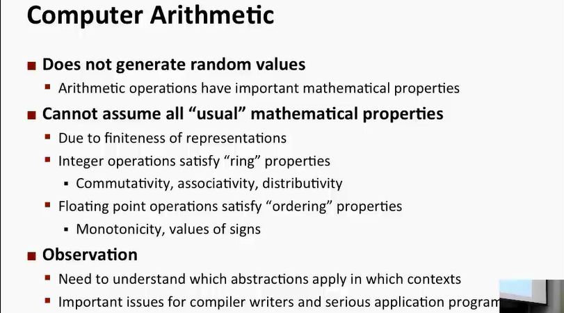
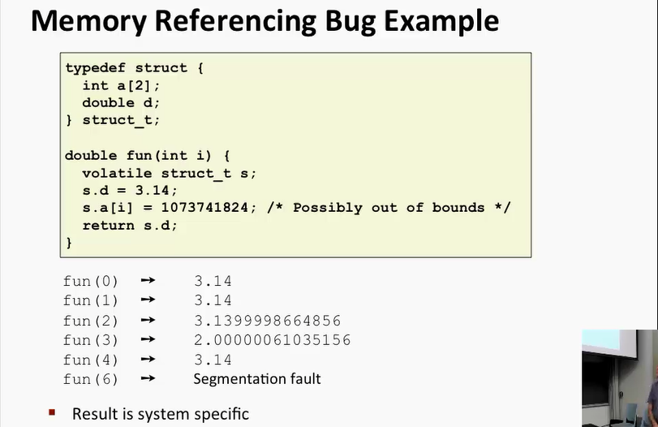
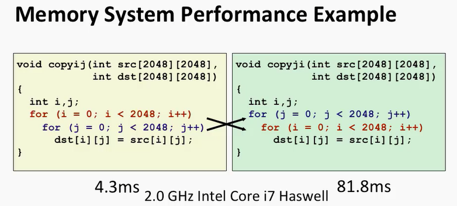
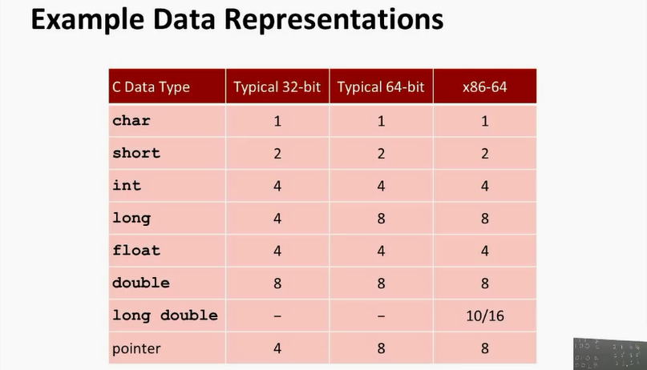
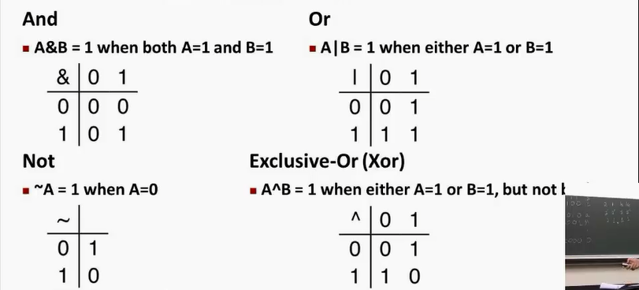
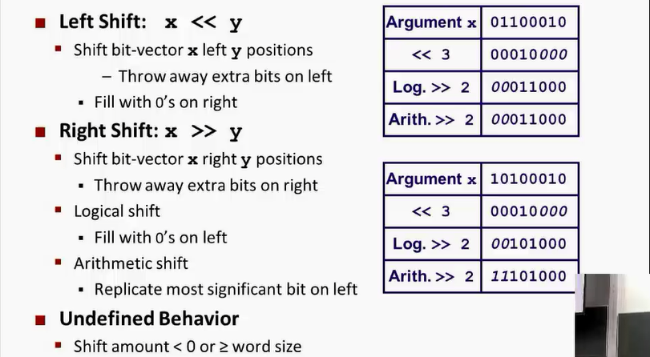

# COMPUTER SYSTEM: A Programmer's Perspective
author: **Randal Bryant & David Hallaron**

### Chap 1 A Tour to Computer System
In a sense, the goal of this book is to help you understand what happens and why when you run hello on your system.
#### Information Is Bits + Contexts
The source program is a sequence of bits, each with a value of 0 or 1, organized in 8-bit chunks called bytes. Each byte represents some text character in the program.
***
# CMU 15-213 2015 fall CSAPP
## Lecture 1 : cource overview
### Several Reality of how the machine works
1. **Ints are not Integers, Floats are not Reals**
    Example1: Is $x^2 \geq 0$ ? For Floats: yes. for Ints, there are overloading problems. 
    Example2: Is (x+y)+z = x+(y+z) ? For ints: yes. For Floats:not.  
    
2. **You've got to know Assembly** 阅读编译器生成的汇编代码
3. **Memory Matters** : Random Access Memory Is an Unphysical Abstraction:
    * Memery is not unbounded 
    * Memory referencing bugs 十分致命
    * Memory performance is not uniform
    
4. **除了渐进复杂度还有很多performance的问题**:
    * 常数因子也很重要
    * Must understand system to optimize performance
    
5. **Computers do more than execute programs**:
    * They need to get data in and out (I/O System)
    * 电脑使用网络相互通信

## Lecture 2 Bit,Byte and Integers
在C语言中的各种数据大小: 
 
布尔代数的运算规则: 
 
需要注意的是这个C的 **bit operator和表达式的逻辑运算是不同的**, 注意区分.
shift Operations: 
 

# 程序员的自我修养 -- 链接\装载与库
## Chap1: Intro
这本书的目的是讲清楚从最基本的编译\静态链接到操作系统如何装载程序\动态链接以及运行库和标准库的实现, 甚至操作系统的机制.
### 万变不离其宗
对于系统程序开发者而言, 三个部件几乎就是计算机的核心: **中央处理器, 内存和IO控制芯片** .