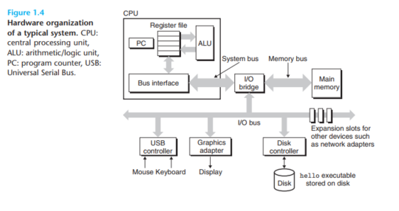

# [COMPUTER SYSTEM: A Programmer's Perspective](http://www.csapp.cs.cmu.edu/)
author: **Randal Bryant & David Hallaron**

### Chap 1 A Tour to Computer System
In a sense, the goal of this book is to help you understand what happens and why when you run hello on your system.
#### Information Is Bits + Contexts
The source program is a sequence of bits, each with a value of 0 or 1, organized in 8-bit chunks called bytes. Each byte represents some text character in the program. __系统中的所有信息(disk file, programs stored in memory, data transferd across a network)都是用 a bunch of bits 表示的__, 在不同的context中, 一串的bytes可能表示string,double, int 或者 机器指令.

#### Programs Are Translated by Other Programs into Different Forms
C语言是一种高级语言,它的语句将被翻译成 low-level machine-language 指令, 然后打包成Binary Disk file 的可执行程序,在Unix系统中的过程如下图:<br>
<br>
1. __预处理阶段__: 根据字符 _#_ 开头的命令,修改原始的C程序
2. __编译阶段__: 将文本文件.c翻译成包 __含汇编语言程序的文本文件__ `.s`
3. __汇编阶段__: 汇编器将 `.s` 翻译成可重定位目标程序格式(relocatable object
program) `.o`
4. __链接阶段__: 负责处理相互依赖的 .o 文件之间的merging.如 The printf function resides in a separate precompiled object file called printf.o, which must somehow be merged with our hello.o program.

#### It Pays to Understand How Compilation Systems Work
程序使用的mechine code是编译系统生成的,但是我们依旧需要知道编译系统是如何工作的:
1. 优化程序的性能
2. 理解linking-time errors
3. 避免安全漏洞

#### Processors Read and Interpret Instructions Stored in Memory
##### Hardware Organization of a System
<br>
__Bus__ 总线是用于不同组件沟通的electrical conduits, 一般用于传输fixed-size chunk of bytes(words,一般是4个字节(32位)或者8个(64位)).<br>
__Main memory__ 临时存储系统, 一般是由一系列动态随机存储器构成,逻辑上它是Linear array of bytes, 每个都有自己的地址.<br>
__Processor__ 

***
# CMU 15-213 2015 fall CSAPP
## Lecture 1 : cource overview
### Several Reality of how the machine works
1. **Ints are not Integers, Floats are not Reals**<br>
    Example1: Is $x^2 \geq 0$ ? For Floats: yes. for Ints, there are overloading problems.<br>
    Example2: Is (x+y)+z = x+(y+z) ? For ints: yes. For Floats:not. <br>
    
2. **You've got to know Assembly** 阅读编译器生成的汇编代码
3. **Memory Matters** : Random Access Memory Is an Unphysical Abstraction:
    * Memery is not unbounded 
    * Memory referencing bugs 十分致命
    * Memory performance is not uniform
    
4. **除了渐进复杂度还有很多performance的问题**:
    * 常数因子也很重要
    * Must understand system to optimize performance
    
5. **Computers do more than execute programs**:
    * They need to get data in and out (I/O System)
    * 电脑使用网络相互通信

## Lecture 2 Bit,Byte and Integers
Everything is bits. 存储一个bit的值比其他方式更容易实现.依然而言, 使用4个bit去用16进制能更简单地表示数据, 而8个bit就是一个Byte(字节).<br>
在C语言中的各种数据大小:<br>
<br>
布尔代数的运算规则,这些运算规则可以用来 Manipulating Sets:<br>
<br>
需要注意的是这个C的 **bit operator和表达式的逻辑运算是不同的**, 注意区分, 而表达式地逻辑运算会有短路求值(Early Termination).
shift Operations:<br>
<br>
注意的是右移是有两种,逻辑上的和算术上的.

### 数字表示
<br>
对于Unsigned 的数字,最高为是 $2^{w-1}$, 对于 Signed,是$- 2^{w-1}$, 就是上面的等式所描述的. <br>
我们可以使用一个五位的数字来简化理解, w位数据能到的最小值和最大值:<br>
<br>
理解了之后, 就可以在T和U之间做 Map,以一个4bit的表示为例:<br>
<br>
在进行比较的时候, 这些signed可能会被casting成 unsigned, 就会出现我们意料之外的结果:<br>
<br>
问题就是在于从signed到unsigned的 casting:
* 操作是在bit level pattern
* 但是这个结果是reinterpreted(重新解释)
* 于是会有意料之外的结果 (加上或者减去 $2^w$)

```c
for(unsigned i = n-1; i >= 0; --i){//error: i是unsigned的话, 无论如何做减法, 都是大于0的
    // 在这里从后向前对array操作
}
```

__sign extension__: 对于一个w-bit的signed integer X,要转成(w+k)-bit的integer with the same value, 所需要做的就是 __make k copies of sign bit__, 前面的多个位之间可以相互抵消, 得到的结果是一样的:<br>
<br>
__sign truncating__ : 对于unsigned, 有点类似于mod operation, 对于大的负数,也可以从mod上理解. 对于small的数字, 就会得到期望的相等结果.