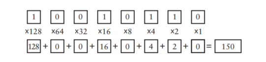
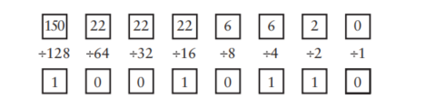

# Code : the hidden language of Computer Hardware and Software

## 亲密挚友
在本书中,编码是一种用来在人和机器之间传递信息的方式,大部分编码必须易于理解,因为他们是人类交流的基础. 
在摩尔斯码中, 简单而短促的编码, 被分配给字母表中使用频率较高的字母.
## 编码的组合
在这里我们只需要记住一点, $\text{码字的数目} = 2 ^{\text{编码的位数}}$, 摩尔斯码也常常被称为二进制码(binary code),因为编码的数目只有两个(点 和 下划线)

## 布莱叶盲文与二进制码
在布莱叶盲文中,书写用的符号被编写成 $2 \times 3$ 点码单元中的凸起点, 这些点码都是二进制的,于是一共有 $2^6$种组合,这64组编码中的很大一部分, __根据上下文有着不同的双重身份__.

## 手电筒的剖析
开关只能是闭合或者断开状态, 二进制码与电气电路之间的相似性是后面章节的基础.

## 电报机与继电器
电报机的发明人使用一个继电器作为中继,使得人类第一次能够在视线或者听力范围之外的地方进行实时交流,而且这个发明使用了二进制码, 在后来的电子和无线通信(电话\无线电\电视)所使用的通信模式中, 二进制码被废弃了,直到后来被运用在了电脑/光盘和高清电视上. 
继电器是一个开关,但是它的闭合和断开并不是由人来操纵, 而是电流控制, 实际上, 使用它甚至能装配出一台近乎完美的计算机.

## 我们的十个数字
古老的罗马数字做加减法十分方便, 但是不利于做乘除法,阿拉伯数字系统的先进行体现在以下几个方面:
1. 阿拉伯数字系统是和位置相关的: 一个数字的位置不同, 其代表的数量也不同
2. 实际的阿拉伯数字有一点早期数字系统没有的,那就是符号 `0`
3. 早期的数字系统有代表 `10`的符号, 但是阿拉伯系统没有

位置计数系统的好处在于, 对于非十进制系统,它依旧是易于简单地实现计数.

## 十的替代品
在结构上,八进制数字系统与十进制数字系统并没有什么不同, 他们只是在细节上存在一些差异.可以使用下面的模板很方便地将二进制数转化为十进制: 
 
而10进制转为二进制要复杂一些: 
 
而两个二进制数字的加法和乘法就变得十分简单, 因为加法表和乘法表只有四个数字.而二进制系统在算术与电子技术之间搭起了一座桥梁.

## 二进制数
二进制系统存在一点特殊性, 在于 __它是人们所能得到的最简单的数字系统__ 在很多时候我们会运用**冗余**来抵消噪声的影响.,同时,信息是多种可能性中的一种,可以被转换成两种或者多种选择的可能性, 都可以用比特来表示,某一位或者一连串比特位所表示的意义通常是和上下文相关. 
比特通常无法直接从日常中观察找到, 而是隐藏在电子设备中.最常见的应该是在商品中的通用产品代码(条形码),它实质上就是一个95bit的二进制数, 其中包含了内置式的检错码,数字的编码都含有奇数哥1(奇偶校验)和最后一位模校验字符. 
在用比特表示其他信息的时候我们所需要计算的就是有多少种可能性, 这决定了我们需要的比特位数.

## 逻辑与开关