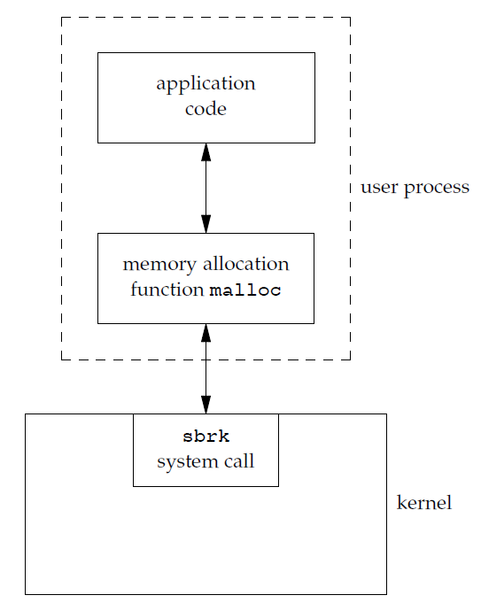

# Unix 环境高级编程
## Chap 1: Unix 基础知识
所有操作系统都为它们所运行的程序提供服务,操作系统定义为一种软件，它控制计算机硬件资源，提供程序运行环境。 
 
内核的接口被称为系统调用(System Call), 公用函数库构建在系统调用接口之上, 广义上说，操作系统包括了内核和些其他软件，这些软件使得计算机能够发挥作用，并使计算机具有自己的特性。 

Shell 是一个命令行解释器, 读取用户输入然后执行命令. 

### 文件系统和目录
UNIX文件系统是目录和文件的一种层次结构, 在逻辑上可以认为目录是一个包含目录项的文件, 每个目录项目包含文件名和说明该文件属性的信息.  
只有斜线(/) 和空字符(null), 但是 POSIX 建议只使用 letters,numbers,period(.) dash(-) 和 underscore(\_)作为文件名. 
路径名一般区分绝对路径(`/`开头)和相对路径(其他), `/` 为文件系统根. 
每个进程都有一个工作目录, 有时候被称为当前工作目录, 所有的相对路径就是从那里开始解释, 进程中可以使用 `chdir` 函数更改其工作目录. 登录后的工作目录设置为起始目录, 从口令文件`/etc/passwd`中得到. 

### 输入和输出
文件描述符(File descriptors) 被内核使用于标识一个特定进程正在访问的文件, Unix 底层提供了不带缓冲的 I/O, 使用开销比较大, 标准 I/O 为那些不带缓冲的 I/O 函数提供了一个带缓冲的接口. 

### 程序和进程
程序是储存在磁盘某个目录中的可执行文件, 内核使用 `exec` 函数将程序度入内存并且执行程序, 而**程序的执行实例被称为进程**(Process), Unix 系统为每个进程提供一个特殊的数字标识符(进程ID, process ID,可以使用 `getpid()` 得到). 
**进程控制**:主要是用三个函数,`fork/exec/waitpid`,控制.  
**线程和线程ID**:通常而言, 一个进程只有一个控制线程, 多个控制进程可以充分利用多处理器的并行能力,一个进程的所有线程功效同一地址空间,文件描述符,栈以及进程相关的属性. 线程也用ID表示, 但是它只在所属进程内其作用. 

### 错误处理
Unix 系统出错时, 通常返回一个负数, 而且整形变量通常被设置为具有特定信息的值(在`errno.h`中定义), 在支持线程的环境中,多个线程共享地址空间, **但是每个线程都有属于自己的局部 errno**.使用的时候需要注意, 如果没有出错, 其值不会被 routine 清楚, 当返回值指名出错时才检验其值, 另外任何函数都不会将errno值 设置为0. 
C 中定义了两个函数用于打印错误信息:
* `strerror`:返回值为指向消息字符串的指针
* `perror`: 基于 errno 的当前值，在标准错误上产生一条出错消息，然后返回.

errno.h 中将错误分成两类
* 致命性的错误， 无法执行恢夏动作。
* 非致命性的出错, 有时可以较妥善地进行处理

对于资源相关的非致命性出错的典型恢复操作是延退段时间，然后重试. 

**用户标识**:
口令文件中包括了两个数值, 用户ID 和 组ID, 表示不同的用户和用户组, 对于磁盘上的每个文件，文件系统都存储该文件所有者的用户ID和组ID. 

### 信号
信号(signal)用于通知进程发生了某种情况, 进程有三种处理信号的方式:
1. 忽略信号
2. 按照系统默认的方式处理
3. 提供自定义的信号处理函数

### 系统调用和库函数
各种版本的 UNIX 实现都**提供良好定义、数量有限、直接进入内核的入口点**，这些入口点被称为系统调用(System Call). 系统调用接口是用 C 语言定义的, 和具体的实现技术无关. 通用库函数虽然可能会调用一个或多个内核的系统调用，但是它们并不是内核的入口点. UNIX 所使用的技术是为每个系统调用在标准C库中设置一个具有同样名字的函数, 从实现者的角度来看，系统调用和库函数之间有根本的区别，但从用户角度来看，其区别并不重要,应用程序既可以调用系统调用也可以调用库函数,很多库函数则会调用系统调用。 
 
系统调用和库函数之间的另一个差别是：系统调用通常提供种最小接口, 而库函数提供比较复杂的功能. 