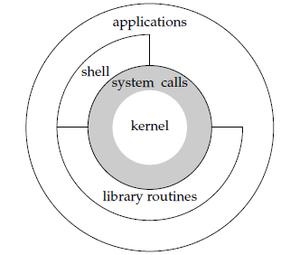

# Unix 环境高级编程
## Chap 1: Unix 基础知识
所有操作系统都为它们所运行的程序提供服务,操作系统定义为一种软件，它控制计算机硬件资源，提供程序运行环境。 
 
内核的接口被称为系统调用(System Call), 公用函数库构建在系统调用接口之上, 广义上说，操作系统包括了内核和些其他软件，这些软件使得计算机能够发挥作用，并使计算机具有自己的特性。 

Shell 是一个命令行解释器, 读取用户输入然后执行命令. 

### 文件系统和目录
UNIX文件系统是目录和文件的一种层次结构, 在逻辑上可以认为目录是一个包含目录项的文件, 每个目录项目包含文件名和说明该文件属性的信息.  
只有斜线(/) 和空字符(null), 但是 POSIX 建议只使用 letters,numbers,period(.) dash(-) 和 underscore(\_)作为文件名. 
路径名一般区分绝对路径(`/`开头)和相对路径(其他), `/` 为文件系统根. 
每个进程都有一个工作目录, 有时候被称为当前工作目录, 所有的相对路径就是从那里开始解释, 进程中可以使用 `chdir` 函数更改其工作目录. 登录后的工作目录设置为起始目录, 从口令文件`/etc/passwd`中得到. 

### 输入和输出
文件描述符(File descriptors) 被内核使用于标识一个特定进程正在访问的文件, Unix 底层提供了不带缓冲的 I/O, 使用开销比较大, 标准 I/O 为那些不带缓冲的 I/O 函数提供了一个带缓冲的接口. 

### 程序和进程
程序是储存在磁盘某个目录中的可执行文件, 内核使用 `exec` 函数将程序度入内存并且执行程序, 而**程序的执行实例被称为进程**(Process), Unix 系统为每个进程提供一个特殊的数字标识符(进程ID, process ID,可以使用 `getpid()` 得到). 
**进程控制**:主要是用三个函数,`fork/exec/waitpid`,控制. 