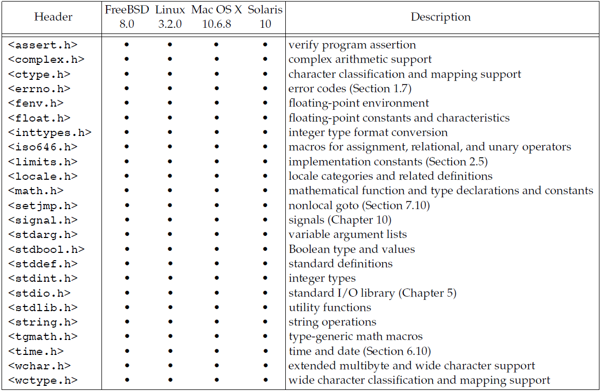

# Unix 环境高级编程
## Chap 1: Unix 基础知识
所有操作系统都为它们所运行的程序提供服务,操作系统定义为一种软件，它控制计算机硬件资源，提供程序运行环境。<br>
<br>
内核的接口被称为系统调用(System Call), 公用函数库构建在系统调用接口之上, 广义上说，操作系统包括了内核和些其他软件，这些软件使得计算机能够发挥作用，并使计算机具有自己的特性。<br>

Shell 是一个命令行解释器, 读取用户输入然后执行命令. 

### 文件系统和目录
UNIX文件系统是目录和文件的一种层次结构, 在逻辑上可以认为目录是一个包含目录项的文件, 每个目录项目包含文件名和说明该文件属性的信息. <br>
只有斜线(/) 和空字符(null), 但是 POSIX 建议只使用 letters,numbers,period(.) dash(-) 和 underscore(\_)作为文件名.<br>
路径名一般区分绝对路径(`/`开头)和相对路径(其他), `/` 为文件系统根.<br>
每个进程都有一个工作目录, 有时候被称为当前工作目录, 所有的相对路径就是从那里开始解释, 进程中可以使用 `chdir` 函数更改其工作目录. 登录后的工作目录设置为起始目录, 从口令文件`/etc/passwd`中得到. 

### 输入和输出
文件描述符(File descriptors) 被内核使用于标识一个特定进程正在访问的文件, Unix 底层提供了不带缓冲的 I/O, 使用开销比较大, 标准 I/O 为那些不带缓冲的 I/O 函数提供了一个带缓冲的接口. 

### 程序和进程
程序是储存在磁盘某个目录中的可执行文件, 内核使用 `exec` 函数将程序度入内存并且执行程序, 而**程序的执行实例被称为进程**(Process), Unix 系统为每个进程提供一个特殊的数字标识符(进程ID, process ID,可以使用 `getpid()` 得到).<br>
**进程控制**:主要是用三个函数,`fork/exec/waitpid`,控制. <br>
**线程和线程ID**:通常而言, 一个进程只有一个控制线程, 多个控制进程可以充分利用多处理器的并行能力,一个进程的所有线程功效同一地址空间,文件描述符,栈以及进程相关的属性. 线程也用ID表示, 但是它只在所属进程内其作用. 

### 错误处理
Unix 系统出错时, 通常返回一个负数, 而且整形变量通常被设置为具有特定信息的值(在`errno.h`中定义), 在支持线程的环境中,多个线程共享地址空间, **但是每个线程都有属于自己的局部 errno**.使用的时候需要注意, 如果没有出错, 其值不会被 routine 清楚, 当返回值指名出错时才检验其值, 另外任何函数都不会将errno值 设置为0.<br>
C 中定义了两个函数用于打印错误信息:
* `strerror`:返回值为指向消息字符串的指针
* `perror`: 基于 errno 的当前值，在标准错误上产生一条出错消息，然后返回.

errno.h 中将错误分成两类
* 致命性的错误， 无法执行恢夏动作。
* 非致命性的出错, 有时可以较妥善地进行处理

对于资源相关的非致命性出错的典型恢复操作是延退段时间，然后重试. 

**用户标识**:
口令文件中包括了两个数值, 用户ID 和 组ID, 表示不同的用户和用户组, 对于磁盘上的每个文件，文件系统都存储该文件所有者的用户ID和组ID. 

### 信号
信号(signal)用于通知进程发生了某种情况, 进程有三种处理信号的方式:
1. 忽略信号
2. 按照系统默认的方式处理
3. 提供自定义的信号处理函数

### 系统调用和库函数
各种版本的 UNIX 实现都**提供良好定义、数量有限、直接进入内核的入口点**，这些入口点被称为系统调用(System Call). 系统调用接口是用 C 语言定义的, 和具体的实现技术无关. 通用库函数虽然可能会调用一个或多个内核的系统调用，但是它们并不是内核的入口点. UNIX 所使用的技术是为每个系统调用在标准C库中设置一个具有同样名字的函数, 从实现者的角度来看，系统调用和库函数之间有根本的区别，但从用户角度来看，其区别并不重要,应用程序既可以调用系统调用也可以调用库函数,很多库函数则会调用系统调用。<br>
<br>
系统调用和库函数之间的另一个差别是：**系统调用通常提供种最小接口, 而库函数提供比较复杂的功能**. 

## Chap 02 : Unix 标准及实现
### UNIX 标准化
#### ISO C
按照该标准定义的各个头文件可将 ISO C 库分成24个区, 
<br>
#### IEEE POSIX
POSIX 指的是可移植操作系统接口(Portable Operating System Interface), 该标准的目的是提升应用程序在各种 UNIX 系统环境之间的可移植性,定义了"符合POSIX的" 操作系统必须提供的各种服务.标准说明了一个接口而不是一种实现, 所以并不区分系统调用和库函数.<br>
后续的标准中包括了必需部分和可选部分, 总的来看FreeBSD,Linux,Mac OSX, Solaris 对它的支持都是接近的. POSIX.1 没有包括超级用户（superuser）这样的概念，代之以规定某些操作要求“适当的优先权”，POSIX.1将此术语的含义留由具体实现进行解释. 

#### Single UNIX Specification(单一Unix规范)
SUS 是 POSIX.1 标准的-个超集, 它定义了一些附加接口扩展 POSIX.1 规范提供的功能. 

Unix 系统主要的具体实现有 UNIX System V Release 4/ 4.4BSD/ FreeBSD/ Linux/ Mac OS X/ Solaris 等.

#### 标准和实现的关系
前面提到的各个标准定义了任一实际系统的子集,我们主要关心4个系统：FreeBSD 8.0、Linux 3.2.0, Mac OS X 10.6.8 Solaris 10, 其中只有 MacOSX 和 Solaris 能称自己是一种 UNIX 系统, 但是所有系统都提供 UNIX 编程环境.我们将重点关注POSIX.1标准所要求的功能，并指出这4种系统具体实现与POSIX之间的差别.

### 限制
UNIX系统实现定义了很多幻数和常量, 其中有很多己被硬编码到程序中，或用特定的技术确定. 需要下面两种限制:
1. 编译时限制
2. 运行时限制

编译时限制可在头文件中定义, 程序在编译时可以包含这些头文件. 但是，运行时限制则要求进程调用-个函数获得限制值。某些限制在个给定的实现中可能是固定的, 而在另一个实现中则可能是变动的. 例如文件名的最大字符, 为了解决这类问题,提供了三种限制:
1. 编译时限制（头文件）
2. 与文件或目录无关的运行时限制（sysconf函数）
3. 与文件或目录有关的运行时限制（pathconf和fpathconf函数）

#### ISO C 限制
1SO C 定义的所有编译时限制都列在头文件`<limits.h>`中,这些限制常量在一个给定系统中并不会改变。<br>
我们将会遇到的一个区别是系统是否提供带符号或无符号的的字符值, 另一个 ISO C常量是FOPEN_MAX(保证可同时打开的标准 I/0流 的最小个数).

#### POSIX 限制
POSIX.1 接口相关的限制被分成下面7类
1. 数值限制
2. 最小值：25个常量。
3. 最大值：_POSIX_CLOCKRES_MIN
4. 运行时可以增加的值：CHARCLASS_NAME_MAX, COLL WEIGHTS_MAX, LINE_MAX、 NGROUPS_MAX 和 RE _DUP_MAX
5. 运行时不变值（可能不确定）
6. 其他不变值：NL_ARGMAX、NL_MSGMAX、NL_SETMAX 和 NL_TEXTMAX
7. 路径名可变值：FILESIZEBITS, LINK_MAX、MAX_CANON、MAX_INPUT, NAME_MAX, PATH_MAX、PIPE_BUF 和 SYMLINK_MAX。

最小值是不变的(不随系统而改变)它们指定了这些特征最具约束性的值。个符合POSIX.1的实现应当提供至少这样大的值. 这25个不变最小值的每个都有一个相关的实现值，其名字是将名字删除前缀 `_POSIX_`后构成的。<br>
如果没有在头文件中定义它们，则不能在编译时使用它们作为数组边界。所以.POSIX.I提供3个运行时函数以供调用, 数可以在运行时得到实际的实现值.

#### 函数 `sysconf` `pathconf` 和 `fpathconf`
某些限制值在编译时是可用的，而另外-些则必须在运行时确定, 
```C++
#include <unistd.h>
long sysconf(int name);
long pathconf(const char *pathname, int name);
long fpathconf(int fd, int name);
//返回值 corresponding value if OK, −1 on error
```
* 如果name参数并不是个合适的常域，这3个函数都返回 -1,并把errno置为EINVAL。
* 有些name会返网一个变量值（返回值 >= 0）或者提示该值是不确定的。不确定的值通过 返回 -1来体现，而不改变errno的值.
* _SC_CLK_TCK的返回值是每秒的时钟滴答数，用于times函数的返回值

对于 pathconf 的参数 pathname 和 fpathconf 的参数 fd 有很多限制, 如果不满足这些限制那么结果就是未定义的. 

#### 不确定的运行时限制
