# [COMPUTER SYSTEM: A Programmer's Perspective](http://www.csapp.cs.cmu.edu/)
<font size=5> **Randal Bryant & David Hallaron** </font>

### Chap 1: A Tour to Computer System
In a sense, the goal of this book is to help you understand what happens and why when you run hello on your system.
#### Information Is Bits + Contexts
The source program is a sequence of bits, each with a value of 0 or 1, organized in 8-bit chunks called bytes. Each byte represents some text character in the program. __系统中的所有信息(disk file, programs stored in memory, data transferd across a network)都是用 a bunch of bits 表示的__, 在不同的context中, 一串的bytes可能表示string,double, int 或者 机器指令.

#### Programs Are Translated by Other Programs into Different Forms
C语言是一种高级语言,它的语句将被翻译成 low-level machine-language 指令, 然后打包成Binary Disk file 的可执行程序,在Unix系统中的过程如下图:<br>
<br>
1. __预处理阶段__: 根据字符 _#_ 开头的命令,修改原始的C程序
2. __编译阶段__: 将文本文件.c翻译成包 __含汇编语言程序的文本文件__ `.s`
3. __汇编阶段__: 汇编器将 `.s` 翻译成可重定位目标程序格式(relocatable object
program) `.o`
4. __链接阶段__: 负责处理相互依赖的 .o 文件之间的merging.如 The printf function resides in a separate precompiled object file called printf.o, which must somehow be merged with our hello.o program.

#### It Pays to Understand How Compilation Systems Work
程序使用的mechine code是编译系统生成的,但是我们依旧需要知道编译系统是如何工作的:
1. 优化程序的性能
2. 理解linking-time errors
3. 避免安全漏洞

#### Processors Read and Interpret Instructions Stored in Memory
##### Hardware Organization of a System
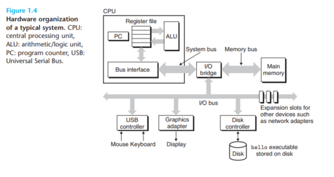<br>
__Bus__ 总线是用于不同组件沟通的electrical conduits, 一般用于传输fixed-size chunk of bytes(words,一般是4个字节(32位)或者8个(64位)).<br>
__Main memory__ 临时存储系统, 一般是由一系列动态随机存储器构成,逻辑上它是Linear array of bytes, 每个都有自己的地址.<br>
__Processor__ A processor appears to operate according to a very simple instruction execution model, defined by its _instruction set architecture_, 比如下面四种操作: **Load Store Operate** and **Jump**.

#### Caches Matter
A major goal for system designers is __to make these copy operations run as fast as possible__.To deal with the processor–memory gap, system designers include smaller, faster storage devices called cache memories.One of the most important lessons in this book is that application programmers who are aware of cache memories can exploit them to improve the performance of their programs by an order of magnitude. 一般而言, 每个设备中的存储组织成了一个存储层次结构,__The main idea of a memory hierarchy is that storage at one level serves as a cache for storage at the next lower level__:<br>
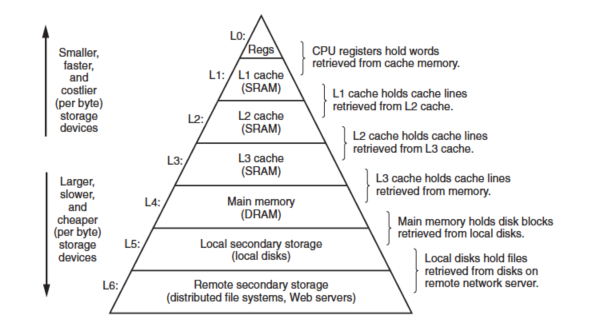<br>

#### 操作系统管理硬件
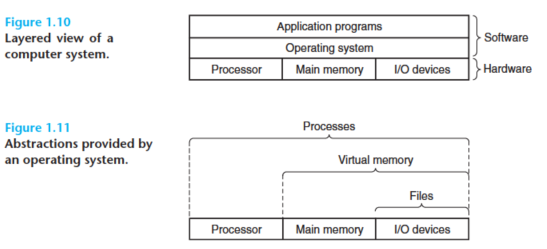<br>
操作系统有两个作用:
1. to protect the hardware from misuse by runaway applications
2. to provide applications with simple and uniform mechanisms for manipulating complicated and often wildly different low-level hardware devices. 
##### 进程
一个进程是操作系统给运行程序的的抽象, 多个进程可以同时在系统中运行, 进程似乎是独占处理器\主存和IO设备.<br>
在任何一个时刻，单处理器系统都只能执行一个进程的代码。当操作系统决定要把控制权从当前进程转移到某个新进程时，就会进行 _上下文(context)_ 切换，即保存当前进程的上下文、恢复新进程的上下文，然后将控制权传递到新进程。新进程就会从它上次停止的地方开始。<br>
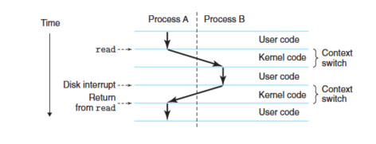<br>

##### 线程
尽管通常我们认为一个进程只有单一的控制流，但是在现代系统中，一个进程实际上可以由多个称为线程的执行单元组成，每个线程都 __运行在进程的上下文中，并共享同样的代码和全局数据__。由于网络服务器中对并行处理的需求，线程成为越来越重要的编程模型，因为 __多线程之间比多进程之间更容易共享数据__，也因为线程一般来说都比 __进程更高效__。<br>
##### 虚拟内存
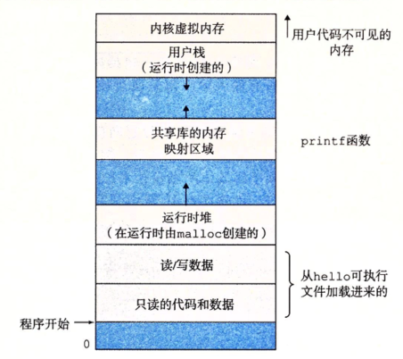<br>
虚拟内存是一个抽象概念，它为每个进程提供了一个假象，即每个进程都在独占地使用主存。每个进程看到的内存都是一致的，称为虚拟地址空间。
##### Files
A file is a sequence of bytes, nothing more and nothing less. 

#### 重要主题
##### Amdahl 定律 
$T_{new} = (1-\alpha) T_{old} + \frac{\alpha T_{old}}{k}$ <br>
$S= T_{old} / T_{new} = \frac{1}{(1-\alpha) + \alpha /k}$ <br>
要想显著加速整个系统，必须提升全系统中占用资源大的部分的速度.<br>
$S_{\inf} = \frac{1}{1 - \alpha}$
##### 并发和并行
并发(concurrency)是一个通用的概念，指一个同时具有多个活动的系统;并行(parallelism)指的是 __用并发来使一个系统运行得更快__, 并发可以在计算机系统的多个抽象层次上运用, 从高到低重点强调三个层次:
###### 线程级并发
传统意义上，这种并发执行只是模拟出来的，是通过使一台计算机在它正在执行的进程间快速切换来实现的. 多核处理器和超线程 (hyperthreading) 的出现，这种系统才变得常见。在线程的帮助下, **我们可以在一个进程中有多个控制流**. 

###### 指令级并行
在较低的抽象层次上，现代处理器可以同时执行多条指令的属性称为指令级并行。如果处理器可以达到比一个周期一条指令更快的执行速率，就称之为超标量(super­ scalar)处理器。大多数现代处理器都支持超标最操作。

###### 单指令\多数据并行
在最低层次上，许多现代处理器拥有特殊的硬件，允许一条指令产生多个可以并行执行的操作，这种方式称为单指令、多数据，即 SIMD 并行。

##### 计算机系统中抽象的重要性
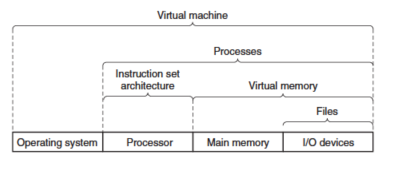<br>
抽象的使用是计算机科学中最为重要的概念之一,在处理器里，指令集架构(ISA)提供了对实际处理器硬件(微结构)的抽象。在学习操作系统时，我们介绍了三个抽象：__文件是对 I/0 设备的抽象，虚拟内存是对程序存储器的抽象，而进程是对一个正在运行的程序的抽象__。

## Part I: 程序结构和执行
### Chap 2: 信息的表示和处理
孤立地讲，单个的位不是非常有用。然而，当把位组合在一起，再加上某种解释(inter­pretation) , 即赋予不同的可能位模式以含意，我们就能够表示任何有限集合的元素.<br>
计算机的表示法是 __用有限数量的位来对一个数字编码__，因此，当结果太大以至不能表示时，某些运算就会溢出 (overflow) 。通过研究数字的实际表示，我们能够了解可以表示的值的范围和不同算术运算的属性。<br>
#### 信息存储
机器级程序将内存视为一个非常大的字节数组，称为虚拟内存(virtual memory),实际的实现是将动态随机访问存储器(DRAM) 、闪存、磁盘存储器、特殊硬件和操作系统软件结合起来，为
程序提供一个看上去统一的 byte array。__C 编译器维护着指针的类型信息，但是它生成的实际机器级程序并不包含关于数据类型的信息__。
##### 十六进制表示法
在 C 语言中，以 0x 或 x 开头的数字常量被认为是十六进制的值.
##### Word 大小
每台计算机都有一个字长 (word size), 指明指针数据的标称大小 (nominal size).32 位字长限制虚拟地址空间为 4 千兆字节(4GB),扩展到 64 位字长使得虚拟地址空间为 16EB, 大约是$1.84 \times 10^{19}$字节,一般他们使用47位的地址空间。 <br>
大多数 64 位机器也可以运行为 32 位机器编译的程序，这是一种向后兼容。计算机和编译器支持多种不同方式编码的数字格式，如不同长度的整数和浮点数。为了避免由于依赖＂典型"大小和不同编译器设置带来的奇怪行为，ISO C99 引入了一类数据类型，其数据大小是固定的，不随编译器和机器设置而变化,这是程序员准确控制数据表示的最佳途径。__可移植性的一个方面就是使程序对不同数据类型的确切大小不敏感__,许多程序的编写都假设为32 位程序的字节分配,随着 64 位机器的日益普及，在将这些程序移植到新机器上时，许多隐藏的对字长的依赖性就会显现出来，成为错误。
##### 寻址和字节顺序
In virtually all machines, 多字节对象都被存储为连续的字节序列，对象的地址为所使用字节中最小的地址。某些机器选择在内存中按照从最低 有效字节到最高有效字节的顺序存储对象，而另一些机器则按照从最高有效字节到最低有效字节的顺序存储:<br>
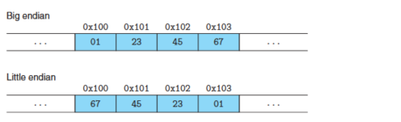<br>
there is no technological reason to choose one byte ordering convention over the other, for most application programmers, the byte orderings used by their machines are totally invisible.有以下例外:
1. 不同类型的机器之间通过网络传送二进制数据时
2. 当阅读表示整数数据的字节序列时字节顺序也很重要
3. 当编写规避正常的类型系统的程序时

实际上, 可执行文件也是一系列的二进制代码序列, 只是一般而言 **Binary code is seldom portable across different combinations of machine and operating system**,它依赖于体系结构.<br>
##### Intro to Boolen Algebra
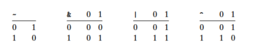<br>
最简单的布尔代数就是在双元素集合{0,1}上的operation.然后香农提出将这个布尔代数和数字逻辑结合起来, 将布尔代数的东西推广到两个bit vector $[a_{w−1}, a_{w−2}, ..., a_0]$ 和 $[b_{w−1}, b_{w−2},..., b_0]$ 之间:<br>
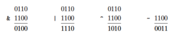<br>
<font size=4> Bit-level operation in C </font>
在C语言中,需要注意区分bit-level的操作符,` &, |, ^, ~` ,和逻辑运算符 `&&, ||, !` , 一般而言, 只有当值限制成{0,1}的时候两者才有可比性, 并且逻辑运算符有短路求值的特点.<br>
<font size=4> 移位运算 </font> 在C中提供了移位运算,对于左移运算, 就是丢弃最高的k位, 然后在右端补k个0. 而右移动作则有两种,逻辑右移和算术右移.<br>
1. 逻辑右移在左端补 k 个 0, 得到的结果是$[0, …, 0,x_{w-1},x_{w-2},..., x_k]$
2. 算术右移在左端补 k 个最高位的有效值, 得到的结果是 $[x_{w-1}, …, x_{w-1},x_{w-1},x_{w-2},..., x_k]$

对于C语言来说, 没有定义对于有符号数使用哪种右移(可能有可移植问题), 而对于无符号数来说必须是逻辑右移动, 而在Java语言中分别使用 `>>` 和 `>>>` 代表算术右移和逻辑右移.

#### 整数表示
对于C语言来说, 根据字节分配，不同的大小所能表示的值的范围是不同的, C 语言标准定义了每种数据类型必须能够表示的最小的取值范围, 而对于signed的类型, 只要求正数和负数的取值范围是对称的, 实际上负数要多一个值.

##### Unsigned 编码
对于向量 $\hat{x} =  [x_{w−1}, x_{w−2}, . . . , x{0}]:$ <br>
    $B2U_w(\hat{x}) \doteq \sum_{i=0}^{w-1} x_i 2^i$<br>
可以轻易的观察到, 这是一个 **双向单射**.

##### 补码
对于向量 $\hat{x} =  [x_{w−1}, x_{w−2}, . . . , x{0}]:$ <br>
    $B2T_w(\hat{x}) \doteq -x_{w-1} 2^{w-1} + \sum_{i=0}^{w-2} x_i 2^i$<br>
同样的, 这也是一个 **双向单射**: For a number x, such that $TMin_w ≤ x ≤ TMax_w$, $T2B_w(x)$ is the (unique) w-bit pattern that encodes x.<br>
值得注意的是,C语言**没有强制要求 _signed_ number用2's 补码表示**,但是几乎所有的平台都是这么做的.同时, 我们可以使用C library `<limits.h>` 查看所支持的最大最小值, 避免出现因为默认这种补码带来的问题.<br>
对于Java语言而言, 它对数据格式的要求更为具体:two’s-complement representation with the exact ranges shown for the 64-bit case.<br>

##### signed 和 Unsigned 之间的转换
C语言允许在各种不同的数字数据类型之间做强制类型转换, 对于signed 和 Unsigned之间转换, 对千大多数 C 语言的实现来说，对这个问题的回答都是从bit-level 来看的，而不是数的角度: 转换过程中数值的大小可能会发生变化, **但是 bit pattern 是不变的**.<br>
在这个思想的指导下, 我们很快可以得到两者的转换规律,如从signed到 Unsigned的公式:<br>
$$
T2U_w(x) = \{ \begin{matrix} x+2^w ,& x<0 \\ x,& x>0 \end{matrix}
$$
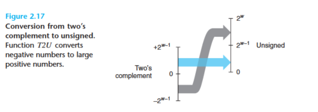<br>
同样的, 我们可以得到Unsigned到signed的结果:
$$
U2T_w(x) = \{ \begin{matrix} u, & u\leq TMax_w \\ u - 2^w , & u > Tmax_u \end{matrix}
$$
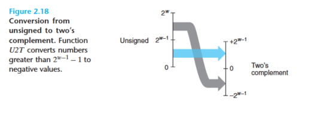<br>

##### C 语言中的有符号数与无符号数
大多数数字都默认为是有符号的, 要创建一个无符号常量，必须加上后缀字符 'U' 或者 'u'.值得注意的是, 在相互赋值的时候, signed和Unsigned会发生隐式类型转换:
```C
int tx, ty; 
unsigned ux, uy;
tx = ux; /* Cast to signed */ 
uy = ty; /* Cast to unsigned */
```
这个过程同时也发生在printf的时候, 比如用 %u的格式打印-1得到的结果就是Umax.当执行一个运算时，**如果它的一个运算数是有符号的而另一个是无符号的，那么 C语言会隐式地将有符号参数强制类型转换为无符号数，并假设这两个数都是非负的，来执行这个运算**.

##### 拓展和截断一个数字
无符号的数只需要用零拓展, 有符号的数字的拓展只要将前面拓展的位都**用最高位(_sign bit_)填占就可以**.<br>
截断一个无符号的数, 相当于对 $2^k$ 取模: 一个Bit vector $\hat{x},[x_{w−1}, x_{w−2}, ..., x_0]$ 截断称为k Bits, $\hat{x^{'}} = [x_{k−1}, x_{k−2}, ..., x_0]$, 得到的结果 $x^{'} = x \ \text{mod}\ 2^k$.<br>
而补码的做法是, 将他们转成 unsigned, **做完取模运算之后再转成补码表示** : $x^{'} = U2T_k(x \ \text{mod} 2^k)$.(x为该补码转为Unsigned的值).<br>
从中可以发现, signed和Unsigned之间的相互转换, 特别是在同时包含两者的表达式中, signed会隐式转换成 Unsigned , 会带来严重的非直观的问题, 因此在日常使用中我们需要特别注意这个问题, 一般不使用 unsigned的数字, 除了在某些特定的情况,如使用word来表示collection(没有 numeric interpretation的场景), 使用 unsigned会非常方便.<br>

#### Integer Arithmetic
理解计算机运算的细微之处能够帮助程序员编写更可靠的代码.
##### Unsigned Addition
两个可以分别用w-bit表示的结果之和, 原则上需要 (w+1)-bit来表示, 除了支持无限精度运算的语言,一般的编程语言只支持固定精度的运算，因此像“加法”和＂乘法”这样的运算**不同于它们在整数上的相应运算**。<br>
在固定精度的情况下, 计算相当于是将整数 $(x+y)$ 在w-bit的条件下截断得到的结果, 结合前面关于截断的介绍, 就是相当于结果 mod $2^w$. 于是, 无符号数的加法如下:<br>
$$
x + _w^u y = \{ \begin{matrix} x+y,& x+y < 2^w & \text{Normal case} \\ x+y-2^w,& x+y\geq 2^w & \text{Overflow}\end{matrix}
$$
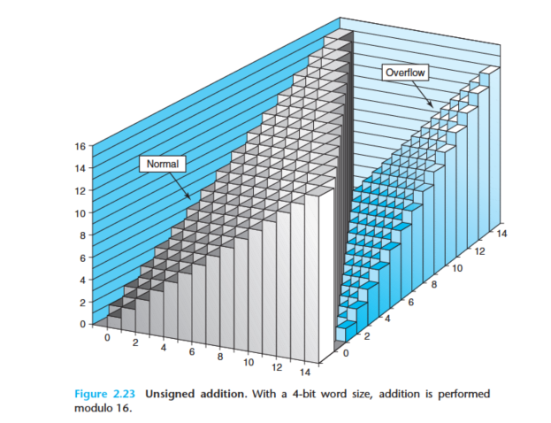<br>
当执行 C 程序时，**不会将溢出作为错误而发信号**。我们可以从结果判断溢出是否发生, 如果两个unsigned之和小于其中任何一个数, 那就说明发生了溢出.<br>
模数加法和算术意义的加法结果不同,但是它依旧形成一个阿贝尔群(可交换).<br>
##### signed Addition(这里讨论补码)
对于补码的加法, 情况更加复杂,但是可以认为是:
$$
x +_w^t y =\{ \begin{matrix} & x + y - 2^w & 正溢出\\
                             & x + y       & 正常\\
                             & x + y + 2^w & 负溢出 \end{matrix}
$$
从Bit-level 看, signed 运算结果和 unsigned 是一样的, 于是我们可以从Bit level 去理解这个事情:<br>
$$
\begin{aligned}
x+_{w}^{\mathrm{t}} y &=U 2 T_{w}\left(T 2 U_{w}(x)+_{w}^{\mathrm{u}} T 2 U_{w}(y)\right) \\
&=U 2 T_{w}\left[\left(x_{w-1} 2^{w}+x+y_{w-1}^{2 w}+y\right) \bmod 2^{w}\right] \\
&=U 2 T_{w}\left[(x+y) \bmod 2^{w}\right]
\end{aligned}
$$
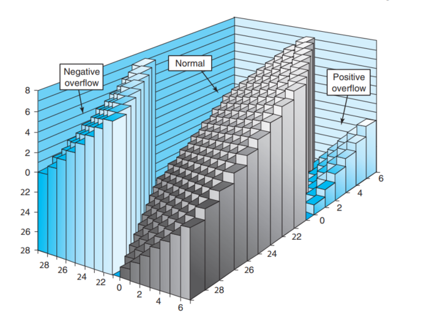<br>
而对于做相反数这个问题, 除了 $TMin_w$ 的相反数是它本身, 其他数字的相反数都和数学上是相同的. (例如对于4bit的补码 1000 + 1000 = 0/ 1111 + 0001 =0, 他们都互为相反数).

##### Unsigned multiplication
对于两个 w - bit 数字的乘法, 我们需要 2w - bit 才能存下他们的结果, 而在w-bit的限制下, Unsigned的乘法可以理解为, 两个数字在数学上的乘法之后对 $2^w$ 取模 :
$$
x *^u_w y = (x \cdot y) \bmod 2^w 
$$
同样的, 在 Bit-level , 乘法的操作对于signed和 Unsigned 也是一样的, 于是我们得到了补码的乘法:
$$
x *^t_w y = U2T_w(x\cdot y) \bmod 2^w
$$

##### 乘以常数
Shifting—required only 1 clock cycle. Even on the Intel Core i7 Haswell we use as our reference machine, integermultiply requires 3 clock cycles: **编译器使用了一项重要的优化，试着用移位和加法运算的组合来代替乘以常数因子的乘法**.<br>
与2 的幕相乘的无符号乘法:C表达式补码表示的数值数值x和Unsigned k, `x<<k` 的结果产生数值: $x * ^u_w 2^k$, 但是值得注意的是, 无论是补码运算还是无符号运算, 这个结果必然可能会发生溢出($\bmod 2^w$).**由千整数乘法比移位和加法的代价要大得多，许多C 语言编译器试图以移位、加法和减法的组合来消除很多整数乘以常数的情况**: 如 _x * 14_, $14 = 2^4 - 2$, 于是上面的乘法可以写成 $(x << 4) - (x << 1)$, 这就只需要两个移位操作和一个减法.<br>

##### 除以2的若干次幂
在大多数机器上, 整数除法要比整数乘法更慢(需要30个或者更多的时钟周期), 除以2的幕也可以用移位运算(右移)来实现, **整数除法总是向0的方向做舍入**.<font color=red>对无符号运算使用移位是非常简单的，部分原因是由千无符号数的右移一定是逻辑右移。</font><br>
除以 2 的幕的补码除法，向下舍入.<br>
**总的来说, 计算机执行整数运算实际上是一种取模的运行形式, 表示数字的有限字长限制了可能的值得范围, 结果可能溢出**. 
#### 浮点数
浮点数的表示将有理数用 $V = x \times 2^y$ 表示, 对执行非常大和非常接近于 0的数字,以及作为实数的近似计算都是非常有用. 而 IEEE 的标准 754规定了浮点数的表示和他们上的操作, 现在几乎所有的机器都支持这个标准. 
##### 二进制分数
首先我们考虑更熟悉的十进制数
$$
d_m d_{m-1} \cdots d_1 d_0 . d_{-1}d_{-2}\cdots d_{-n}
$$
$d_i$ 的范围是 0~9, 可以写成:
$$
d = \sum_{i = -n}^{m} 10^i \times d_i
$$
这个表示的方式同时也适用于二进制系统:<br>
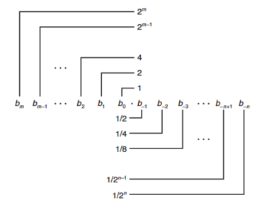<br>
将binary point向右移相当于值乘以2.由于编码的长度有限, 对大多数数字都不能精确编码.

##### IEEE 浮点数表示
IEEE 浮点标准用 $ V = (-1)^s \times M \times 2^E $ 表示一个数:
* 符号位: 用于表示它是正数还是负数, 对于数值为 0 的符号位解释作为特殊情况处理
* 尾数: M 为一个二进制小数, 范围是 $1 \sim 2 - \epsilon $ 或者是 $0 \sim 1 - \epsilon$
* 阶码: 对浮点数赋予 2 的 E 次幂作为权重
  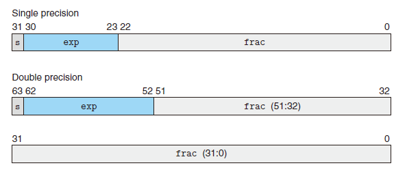<br>

根据 E 那个部分的数字发现有下面几种情况:
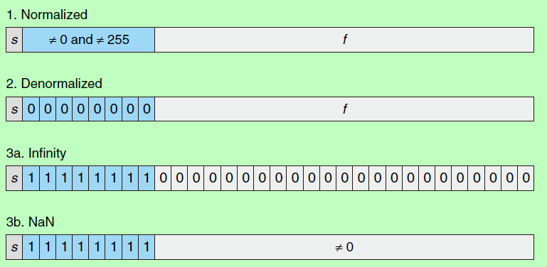<br>
1. 规格化情况, exp 的位模式不全是 0 也不全为 1, 阶码用偏置的方式表示有符号的整数, 实际代表的幂次为 $E = e_{unsigned} - Bias$, 小数部分可以通过约定使得尾数 M 为 1 + f, 在 1,2 这个左闭右开区间中.
2. 当阶码全为0时候是非规格话情况, M 的值是 f, 此时没有隐含有的开头1, 它有两个好处
   1. 一个是用来表示 0, 刚好全部都是0
   2. 用来表示非常接近 0 的那部分数字
3. 特殊值,阶码全为 0的时候, 两种情况, 如果小数部分全为0则表示无穷大, 否则表示NaN(Not a Number)

##### 舍入
因为表示方法限制了浮点数的范围和精度，所以浮点运算只能近似地表示实数运算, 这时候我们就需要做舍入运算, IEEE 浮点格式定义了四种不同的舍入方式, 其中 Round-to-even 是默认的方式.<br>
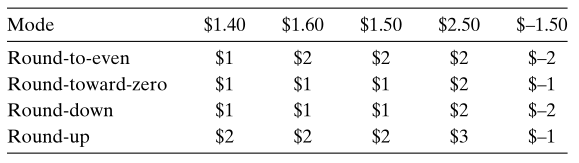<br>
向偶数舍入在大多数现实情况中避免了统计偏差, 相对于一般的四舍五入带来平均值略高的结果, 这种舍入在 50% 的时间里,它将向上舍入，而在 50% 的时间里，它将向下舍入。在二进制中可以这么做, 最后 `X.Y1000000` , 根据 Y 的最后一位判断是要向上还是向下舍入.<br>

##### 浮点运算
浮点的加法不具备结合性, 因为定义了某个运算 $\bigodot$, 计算产生的结果将会是 $Round(a \bigodot b)$, 顺序的改变会使得舍弃的值不同.<br>
但是浮点的加法满足了单调性属性, 如果$a \geq b$, 那么对于任何a 、b 以及x 的值，除了NaN, 都有$x+a \geq x+b$ 。无符号或补码加法不具有这个实数（和整数）加法的属性。<br>
浮点乘法也遵循通常乘法所具有的许多属性, 它是可交换的, 但是因为可能发生溢出和舍入, 依然不具备可结合性. 此外, 浮点乘法在加法上不具备分配性. 而单调性是可以保证的,这个在无符号或者补码的乘法中不具备这样的单调性.
### Chap 3 : 程序的机器级表示
GCC先将代码用汇编的形式产生输出, 然后调用汇编器和链接器, 根据汇编生成可执行的机器代码. 阅读编译器产生的代码, 我们就可以理解编译器的优化能力, 分析其中隐藏的inefficiencies. 此外, 高级语言提供抽象层隐藏了我们想要理解程序运行时的行为.在此我们从数据的表示和处理以及控制的实现开始,了解如何实现C语言中的控制结构, 讲到过程的实现(程序如何维护一个运行栈来支持过程间数据和控制的传递，以及局部变量的存储), 接下来考虑如何在机器级实现像数组/结构和联合这样的数据结构.

#### 程序编码
```shell
gcc -Og -o p p1.c p2.c
```
使用这种方式调用编译器, 让优化代码可以follow C源代码的整体的结构,使用高级别的优化产生的代码会严重变形, 使得产生的机器码和初始源代码之间的关系难以理解.

##### 机器级代码
计算机系统使用多种形式的抽象, 利用简单的抽象模型来隐藏实现的细节. 对于机器级编程而言, 两个抽象尤为重要:
* 指令集体系结构(ISA): 定义了处理器状态\指令个格式以及每条指令对状态的影响
* 虚拟内存, 提供的内存模型好像是一个大的byte array, 具体的实现是将多个硬件存储器和操作系统软件结合起来.

编译器将把用 C 语言提供的相对比较抽象的执行模型表示的程序转化成处理器执行的非常基本的指令, **一些通常对C程序员隐藏的处理器状态在这里都是可见的**:
* 程序计数器(PC,`%rip`): 将要执行的下一条指令在内存中的地址
* 整数寄存器文件: 可以存放地址(对应C语言中的指针)或者整数数据
* 条件码寄存器: 存储最近执行的算术或者逻辑指令的状态信息
* 一组向量寄存器可以存放一个或多个整数或浮点数值

值得注意的是, 机器级代码和C有很大的不同,如C在分配内存的时候会声明数据类型, 但是机器代码只将它看成一个很大的按字节寻址的数组. 对于变量数据类型, 汇编代码不区分有符号和无符号整数, 不区分各种类型的指针, 甚至不区分整数和指针. <br>
操作系统负责管理虚拟地址空间，将虚拟地址翻译成实际处理器内存中的物理地址。

##### 代码实例
从生成的汇编代码看, 代码中已经除去了所有关于局部变星名或数据类型的信息, 机器执行的程序只是一个字节序列, 机器对于产生这些指令的源代码几乎一无所知, 要查看二进制代码文件的内容, 一类被称为反汇编器的程序非常有用.
```shell
objdump -d mstore.o
```
* x86-64的指令长度从1到15byte不等,从某个给定位置开始，可以将字节唯一地解码成机器指令
* 反汇编器依据的是机器代码文件中的字节序列来确定汇编代码, 不需要访问程序的源代码或者汇编代码

一般而言, GCC产生的汇编代码包含很多我们不关心的信息(如以"."开头指导汇编器和链接器的伪指令), 同时不提供任何程序的描述. <br>
此外, 在本书中使用的是ATT的汇编代码格式, 与Intel的有很多不同, 如在带有多个操作数的指令情况下，列出操作数的顺序相反。

#### 数据格式
Intel一般把两个Byte称为一个word, 在64位系统中, 在long和pointer的操作就是对四字(quad word)数据类型的操作,此外x86-64的指令集包含完整的对字节\字和双字的指令.<br>
浮点数包括单精度(4-byte,float)和双精度(8-byte,double),x86体系结构在历史上实现了一种80bit(10-byte)的浮点数进行全套的浮点运算(long double), 但是我们不建议使用, 因为它不方便移植,实现的硬件也不如单精度和单精度算术运算高效.<br>
大多数GCC生成的汇编代码都有一个字符的后缀, 表明操作数的大小.例如数据传送指令, movb(传送字节),movw(传送字) movl(传送双字) movq(传送4字). 

#### 访问信息
x86-64 的中央处理器包含了一组16个存储64位值的通用目的寄存器, 用于存储 **整数** 和 **指针**, 他们的命名有不同的规则(历史演化的结果).在过去8086时代有8个16位寄存器, 每个有特定的用途.<br>
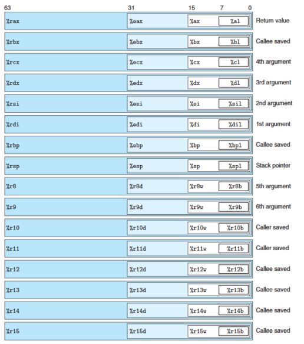<br>
指令可以对这 16 个寄存器的低位字节中存放的不同大小的数据进行操作。字节级操作可以访问最低的字节，16 位操作可以访问最低的 2 个字节， 32 位操作可以访问最低的 4 个字节，而 64 位操作可以访问整个寄存器。<br>
* 生成 1 字节和 2 字节数字的指令会保持剩下的字节不变；
* 生成 4 字节数字的指令会把高位 4 个字节置为 0。后面这条规则是作为从 IA32 到x86-64 的扩展的一部分而采用的。 

不同的寄存器扮演不同的角色, 其中最特别的是栈指针(stack pointer) `%rsp`, 用来指明运行时栈的结束位置,其他十五个寄存器特别灵活.<br>

##### 操作数指示符
大多数指令有一个或多个操作数(operand), 指示出执行一个操作中要使用的源数据值，以及放置结果的目的位置。 x86-64的操作数可以分成三种类型:
* immediate: 用来表示const value, 如 `$-577` 或者 `$0x1F`
* 寄存器: 用来表示某个寄存器的的内容
* 内存引用: 根据计算出来的地址访问某个内存的位置(有多种addressing mode,如下表)
    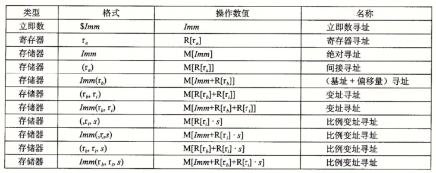<br>

##### 数据传送指令
最频繁使用的指令是将数据从一个位置复制到另一个位置的指令, 再此我们将介绍不同的数据传送指令, 他们或者源类型和目的类型不同, 或者执行的转换不同, 或者具有不同的副作用. <br>
最简单的数据移动指令就是 mov 类, 使用的形式为 `mov Source, Destination`, 包括 `movb`, `movw`, `movl`, `movq`, 分别对应 Move byte/ word/ long(double word)/ quad word.<br>
Source 可以在 immediate/ 寄存器值/ 内存上, Destination 可以是 寄存器或者内存上.<font color=red> 但是两个operand 不能都是 refer to memory location</font>, 这需要分成两个指令. 此外 `movabsq` 可以操作任意的 64 位立即数, 而且只能以寄存器作为 Destination. <br>
还有另外两种移动数据的指令, 将较小的源值复制到较大的目的的时候使用, 这些指令都是从源(内存或寄存器) 复制到寄存器. 