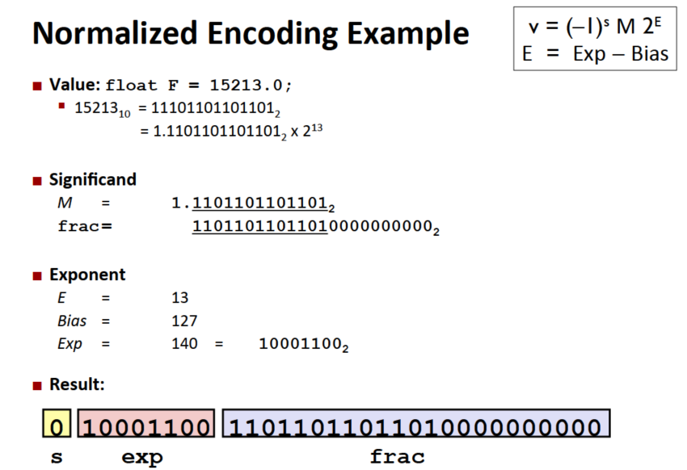

# CMU 15-213 2015 fall CSAPP
## Lecture 1 : cource overview
### Several Reality of how the machine works
1. **Ints are not Integers, Floats are not Reals**<br>
    Example1: Is $x^2 \geq 0$ ? For Floats: yes. for Ints, there are overloading problems.<br>
    Example2: Is (x+y)+z = x+(y+z) ? For ints: yes. For Floats:not. <br>
    
2. **You've got to know Assembly** 阅读编译器生成的汇编代码
3. **Memory Matters** : Random Access Memory Is an Unphysical Abstraction:
    * Memery is not unbounded 
    * Memory referencing bugs 十分致命
    * Memory performance is not uniform
    
4. **除了渐进复杂度还有很多performance的问题**:
    * 常数因子也很重要
    * Must understand system to optimize performance
    
5. **Computers do more than execute programs**:
    * They need to get data in and out (I/O System)
    * 电脑使用网络相互通信

## Lecture 2 Bit,Byte and Integers
Everything is bits. 存储一个bit的值比其他方式更容易实现.依然而言, 使用4个bit去用16进制能更简单地表示数据, 而8个bit就是一个Byte(字节).<br>
在C语言中的各种数据大小:<br>
<br>
### 位操作
布尔代数的运算规则,这些运算规则可以用来 Manipulating Sets:<br>
<br>
需要注意的是这个C的 **bit operator和表达式的逻辑运算是不同的**, 注意区分, 而表达式地逻辑运算会有短路求值(Early Termination).
shift Operations:<br>
<br>
注意的是右移是有两种,逻辑上的和算术上的.

### Integers 表示
<br>
对于Unsigned 的数字,最高为是 $2^{w-1}$, 对于 Signed,是$- 2^{w-1}$, 就是上面的等式所描述的. <br>
我们可以使用一个五位的数字来简化理解, w位数据能到的最小值和最大值:<br>
<br>
理解了之后, 就可以在T和U之间做 Map,以一个4bit的表示为例:<br>
<br>
在进行比较的时候, 这些signed可能会被casting成 unsigned, 就会出现我们意料之外的结果:<br>
<br>
问题就是在于从signed到unsigned的 casting:
* 操作是在bit level pattern
* 但是这个结果是reinterpreted(重新解释)
* 于是会有意料之外的结果 (加上或者减去 $2^w$)

```c
for(unsigned i = n-1; i >= 0; --i){//error: i是unsigned的话, 无论如何做减法, 都是大于0的
    // 在这里从后向前对array操作
}
```

__sign extension__: 对于一个w-bit的signed integer X,要转成(w+k)-bit的integer with the same value, 所需要做的就是 __make k copies of sign bit__, 前面的多个位之间可以相互抵消, 得到的结果是一样的:<br>
<br>
__sign truncating__ : 对于unsigned, 有点类似于mod operation, 对于大的负数,也可以从mod上理解. 对于small的数字, 就会得到期望的相等结果.

## Lecture 3 : Bits, Bytes and Integers (Part 2)

补码表示是我们最常见的编码表示, 在讨论补码的加法之前, 我们先讨论 Unsigned 的 加法 <br>
### Unsigned and Two's Complement Addition
首先考虑的是最高位如果存在的话就直接丢弃, 相当于是 $s = UAdd_w( u, v) = u + v\ mod \ 2^w $, 下图是一个很好的可视化理解: <br>
<br>
TAdd 和 UAdd 有相同的 Bit-level 行为, 因此才会称为大多数系统中的首选方案, Overflow的case, 如一个4 bit的数据(从-8 到 7), -6 + (-3) 的结果是 7 (negetative overflow, 正常应该是 -9), 7+5 的结果是 -4 (positive overflow, 本来应该是12, 刚好是 -4 的 Unsigned 表达), 它可以用下面的图来表示:<br>
<br>

### 乘法表示
如果我们使用两个 w bit 的数据做乘法, 通常是需要 两倍(2w bit)的空间才能将结果容纳下来,不然会有各种溢出的问题. 对于 Unsigned的乘法, 结果就相当于 $UMult_w (u,v) = u \cdot v \ mod  \ 2^w $ <br>
对于补码的乘法表示, 就更加复杂了, 在有的时候依旧可以得到想要的结果: 如 -3(相当于13的表示)乘以-2(相当于14的UnSigned 表示), 结果是 (13*14) mod 16, 是6 ,符合预期. <br>

#### power-of-2 Multiply with Shift
* Operation u << k gives $u * 2^k $
* Both Signed and unsigned

在过去, 可能计算机可以在一个clock cycle做shift操作, 但是要 12~13 个 clock cycle 去做一个乘法,除法可能要30个clock cycle.现在可能要快一些, 但是依旧没有移位快. <br>
同样的, 除法要做左移, 使用Unsigned 的话是逻辑左移, 使用补码未定义, 大概率是算术左移.<br>

#### 为什么要用 _Unsigned_
- [x] 除非理解了implications, 否则不要用(容易犯错, 非常麻烦):
    <br>
    这个时候或者直接将所有UINT直接显式转换成为一个signed数字使用,我们可以使用unsigned来做count,如
    ```C
    size_t i;
    for(i = cnt -2; i < cnt; i--) //即使 cnt = UMAX 依旧可以正确运行
        a[i] += a[i+1];
    ```
- [x] 做 Modular Arithmetic 时候必须用到
- [x] 使用Bits表示集合的时候一定会用到

### 在内存中的表示(Pointers, Strings)
<br>
现在很难看到前面那种组织方式了, 具体的表达方式如下,对于int和Pointer都是相反的:<br>
<br>
对于String的表示, 两者都是相同的:<br>
<br>

## Lecture 04: Floating point
### Fractional Binary Numbers
<br>
* Divide by 2 by shifting right(unsigned)  
* Multiply by 2 by shifting left
* Can only exactly represent numbers of the form $x/2^k$(Other rational numbers have repeating bit representations,类似于10进制中的循环小数)

标准的浮点数表示如下:<br>
<br>
其中的S为标记位, 而 E是一个Exp 减去一个偏移量(单精度为127,双精度为1023),不用unsinged的原因是可以直接用其比较大小(最小的为00000000,最大的为11111111)<br>
M被normalized称为 $1.f$ 的形式, get one more bit for free. 举一个通常的例子:<br>
<br>
1. 在 $exp$ 的part 和 $frac$ 的part 都是 0的时候, 就代表浮点数0.但是因为有signed bit, 因此可能出现正的0和负的0. 如果 这时候 $frac \neq 00...0$, 就是代表一个很小的数字
2. $exp = 111…1$, $frac = 00...0$ , 代表的是无穷大
3. $exp = 111…1$, $frac \neq 00...0$ , 代表 NaN(Not-a-Number)

<br>
值得注意的是, 越接近0, 数字越密集, 以 6-bit 的 IEEE-like的数字为例:<br>
<br>

### Rounding,addition,multiplication  
Rounding(浮点数舍入称为整数) 有很多种做法:
* round towards zero
* Round down
* Round up
* <font color=blue>round Nearest Even</font> (default)

同样的, 我们对于 Binary Number 也可以做类似的Round, 实际的做法就是 round to even:<br>
如一个binary float: 1. ...y (to round)...,最末尾y为需要保留的最后一位
1. 只要第一个1后续数字还包含有1,尾数y+1
2. 如果第一个为1,但是后续的值均为0,则说明其后续的值 =$(1/2)^n * 1/2$ 则这时候说明舍入的距离都是相同的，这时候查看y的值，如果y为1,则y+1，如果y为0,则保持y为0
3. 如果靠近y的那个为0, 则全部舍弃

<br>
<br>

需要注意的是, 在 signed 和 Unsigned 之间做cast, 它的bit representation, 但是 **int 和 float/double 之间的cast 是会改变bit representation的**.

## Lecture 5: Machine-­‐Level Programming I: Basics
在本课程中不讨论Microarchitecture(architecture 的实现), 在Assembly/Machine code的角度,计算机是下面的结构:<br>
<br>
编译生成汇编代码的方法:<br>
`gcc -Og -S someSourceFile.c` (-S 选项生成汇编代码, -Og是启用用于debug的优化选项, 生成方便阅读的代码)<br>
Assembly 中的单个Operation只能做一个事情, 比如:
* Perform arithmetic function on register or memory data  
* Transfer data between memory and register
    * Load data from memory into register  
    * Store register data into memory  
* Transfer control  

对于已有的二进制代码, 我们也可以用Disassembler:<br>
    `objdump –d someObjectCode`<br>
或者在GDB中使用(sumstore为可执行文件sum原码中的某个函数):<br>
```
gdb sum 
disassemble sumstore
```
**Disassembler examines bytes and reconstructs assembly source** .
#### Regisiter
在过去IA32中只有8个寄存器, %e**, 在最早的使用中, 某些寄存器常用于特定的功能, 因此影响到了他们的名字,但是现在而言, 除了特定的 `%esp` 作为stack pointer(IA32/x86-64)和 `%ebp` 作为base pointer(IA32),其他都可以通用,具体指代的内容如下:<br>
<br>

#### 寄存器上的操作
##### Moving Data
`movq Source, Dest`<br>
面对的操作数有三种: 
1. Immediate: Constant integer data  
    * Example: `$0x400`, `$-533` 
2. Register: One of 16 integer registers(在IA 32上可能是8个)
    * Example: `%rax`, `%r13`
3. Memory: 8 consecutive bytes of memory at address given by register  
    * simplest example: `(%rax)` (有点像C中取寄存器指向的那个地方的内容) 

<br>
此外, move也可以有displacement, 具体的做法就是
* Register $R$ specifies start of memory region 
* Constant displacement $D$ specifies offset  
`movq 8(%rbp),%rdx`
之后, 可以用这样的形式来实现一个array:<br>
<br>

#### Arithmetic  &  logical  operations 
<br>

## Lecture 6: Machine-­‐Level  Programming  II:  Control  
寄存器这个东西既不是内存的一部分也不是缓存的一部分,如果是用C语言编程,程序员感受不到它的存在.<br>
### Condition codes
* `%rsp` Current stack top 
* `%rip` Instruction pointer

Single bit regisiters:
* CF: Carry Flag(for unsigned)
* ZF: Zero Flag
* SF: sign Flag(for signed)
* OF: Overflow Flag(for signed)

例如
1. 在arithmetic operations中 `add Src, Dest` => `t = a + b`:<br>
    <br>
2. 在compare指令 `cmpq Src2, Src1`, 像是在计算 `Src1 - Src2` 但是不存储结果:<br>
    <br>
3. 在test指令中, `testq Src1, Src2` 就像是在计算 `Src1 & Src2` 但是不存储结果:<br>
    <br>
4. Set 指令就是根据前一行指令的 Condition code, 设置目标的low order byte是 0或者1, **不改变寄存器剩下的7个bytes:<br>
    <br>

### Jumping
实际上有两种类型的Jump, 一种是无条件的Jump, 直接跳到某个位置, 一种是有条件的 Jump, 根据condition code决定要不要Jump.<br>
<br>
一般这个算术指令接受两个参数, 是将结果复写在后面那个参数上.生成的汇编代码有一点像是使用 `goto` 去实现的, 如 C的代码 `val = test ? Then_expr : Else_expr;`, 它的goto version 就有点像是:
```C
ntest = !Test;
if(ntest) goto Else;
val = Then_expr;
goto Done;
Else:
    val = Else_expr;
Done:
    ...
```

### Using Conditional Move
计算机就通过预测去加速, 因此对于前面的Jump来说, 对 pipeline中的 instruction flow 做分支带来的代价是比较大的, 因此condition Move的效果是支持类似的指令: `if(Test) Dest <- Src`.<br>
```C++
val = Test ? Then_expr
           : Else_expr;
// GOTO version
result = Then_expr;
val = Else_expr;
nt = !Test;
if(nt) result = val;
return result;
```
<br>

**一般而言, conditional Move 用于两只值都要计算, 但是计算相对简单的情形, 如果计算可能有非常高的代价/ 出现难以接受的后果后者side effect, 则不建议使用** . <br>

### Loop
#### Do-While 循环例子
```C
long pcount_do (unsigned long x) { 
    long result = 0; 
    do { 
        result += x & 0x1; 
        x >>= 1;
    } while (x); 
    return result; 
}
// goto version
long pcount_goto (unsigned long x) { 
    long result = 0;
loop:
    result += x & 0x1; 
    x >>= 1; 
    if(x) goto loop; 
    return result; 
}
// assembly code
    movl    $0, %eax  #  result = 0 
.L2:   # loop: 
    movq    %rdi, %rdx 
    andl    $1, %edx  #  t = x & 0x1 
    addq    %rdx, %rax #  result += t 
    shrq    %rdi  #  x >>= 1 
    jne     .L2  #  if (x) goto loop 
    rep; ret
```
#### General Do-while translation
##### 第一种变化
* Jump to middle translation(其他地方一般不用这个称呼)
* used with -Og
```C
while(Test)
    Body
// goto version
    goto test;
loop:
    Body
test: 
    if(Test)
        goto loop;
done:
```
##### 第二种变化
把 while -> do while, used with -O1
```C
if(!Test)
    goto done;
do 
    Body
    while(Test);
done:
// goto version
if(!Test)
    goto done;
loop:
    Body
    If(Test)
    goto loop;
done:
```

For Loop Form 可以和while相互转换.

### Switch statement
实际上并不是用if-else实现的, 而是用一个被称为Jump table的结构:<br>
<br>

## Lecture 7 : Machine-Level Programming: Procedures

ABI(Application Binary Interfaces): 系统的各个组分管理资源时候的约定.<br>
<font size=4> Mechanisms in Procedures</font>
* Passing control  
    * 控制流到了procdeure code 的开头
    * 返回后又回到调用函数的point
* 传递数据
    * procedure 的参数匹配
    * 返回值
* 内存管理
    * 在procedure执行的时候分配
    * 返回的时候deallocate

### x86-64 Stack
Stack 是用来管理内存的一种方式, 在函数调用过程中十分有用(Last in First out)<br>
Stack Pointer(`%rsp`) 保存着最下面的stack 的地址(逻辑上是top element), stack 要这 grow 的时候实际上是 `%rsp` 向下移(address grows from top to Bottom)<br>

#### Push 
`pushq Src` (Src为寄存器)做的事情是:
* 取得在 src 处的操作数
* 把 `%rsp` 减小 8
* 向 `%rsp` 的地址写入第一步 fetch 的 操作数

#### Pop
`popq Dest`
* 读取 `%rsp` 指向地址上的值
* `%rsp` 增加8
* 将取到的值写到 Dest 上(同样 Dest 为寄存器, 不能直接从内存写到内存)

### Calling Convension

#### Procedure Control Flow
使用栈来支持 procedure 的调用和返回
* procedure call : call label
  * 将返回地址压入stack
  * 跳转到那个 label
* 返回地址: 
  * 函数调用完毕之后执行的下一条指令的地址
* procedure return: ret
  * 将地址从栈中 pop 出来
  * 跳转到那个地址
  


#### Passing Data
* 返回值存在寄存器 `%rax` 中
* 六个参数分别存在 `%rdi, %rsi, %rdx, %rcx, %r8, %r9` 中
* 如果还有更多参数, 则存在 stack 中


#### 管理 local data
首先我们引入 stack Frame 的概念: 


一个 frame 中有 返回值信息, local 存储(如果需要的话) 和临时空间(如果需要的话).


需要注意的是, 每个stack frame 需要管理自己的数据. 


我们在调用函数的时候, 首先就是在当前的frame 中将数据存储下来,后面接着的两行的意思就是将两个参数放到寄存器中, 调用函数结束之后, 将两个数字之和放到 `%rax`中, 然后再将stack pointer 加回去(这个简单的case, 一开始 %rep 减了多少后面就加回去):


调用函数的时候寄存器中的内容可能被覆写. 于是需要 caller saved 和 callee saved并且在其中维持一个保持数据的协议:
* Caller Saved: 在调用之前, caller 将临时数据在自己的 frame 中管理
* Callee Saved: Callee 在使用前将临时数据存在自己的 frame 中, 在返回前 restre them


如果我们将返回值改为 x + v2, 就会有下面的结果:


区别在于使用了 `%rbx` 这个 callee saved 寄存器. 

### 递归详解
有了这些寄存器约定之后, 我们就可以在 callee saved 寄存器的帮助下实现一个递归


## Lecture 8: Machine-­‐Level Programming IV Data
### Arrays
在 machine level, 没有复杂的数据结构(Array/Structure), 都是一个 byte 的 sequence. 因此 Array 内存分配的基本原理是 `T A[L]` 声明一个数据类型为 T, 长度为 L 的数组, 实际对应的是一个连续的长度为 $L \times sizeof(T)$ 的内存区域. 

#### 多维 Arrays
多维的 array 使用 `T A[R][C];`声明, 一共有 R 行 C 列, 总的尺寸为 $R \times C \times sizeof(T)$ , 内存的 Arrangement 方式为 Row-­‐Major Ordering. 


其中的每一行也是一个含有 C 个元素的 Array, 开始的地址为 $A + i \times C \times K$(K 为每个元素的大小), 需要注意的是, 一个2D Array 和一个指针构成的数组, 肯能还是有略微的区别:


### 结构体
* 结构体代表一大块的内存, 足够放下所有的数据域
* 结构体的域是按照声明的顺序排列(即使有更紧凑的排列方式)
* 编译器决定域总体的 size 和 位置


#### 内存的排布原则
* 需要排列的数据至少需要 K = sizeof(T) 个 byte, 地址一定是 K 的整数倍数
* 我们访问的地址块最好是 4 个或者 8 个 byte
* 编译器会在结构体重插入gap 保证 field 的正确排布


### 浮点数
我们可以使用 XMM Registers 来提高浮点运算的性能:


## Lecture 9 : Machine-­‐Level Programming V - Advanced Topics
### 内存布局
