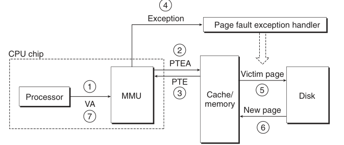

# CMU 15-213 2015 fall CSAPP
- [CMU 15-213 2015 fall CSAPP](#cmu-15-213-2015-fall-csapp)
    - [Several Reality of how the machine works](#several-reality-of-how-the-machine-works)
  - [Lecture 2 Bit,Byte and Integers](#lecture-2-bitbyte-and-integers)
    - [位操作](#位操作)
    - [Integers 表示](#integers-表示)
  - [Lecture 3 : Bits, Bytes and Integers (Part 2)](#lecture-3--bits-bytes-and-integers-part-2)
    - [Unsigned and Two's Complement Addition](#unsigned-and-twos-complement-addition)
    - [乘法表示](#乘法表示)
      - [power-of-2 Multiply with Shift](#power-of-2-multiply-with-shift)
      - [为什么要用 _Unsigned_](#为什么要用-unsigned)
    - [在内存中的表示(Pointers, Strings)](#在内存中的表示pointers-strings)
  - [Lecture 04: Floating point](#lecture-04-floating-point)
    - [Fractional Binary Numbers](#fractional-binary-numbers)
    - [Rounding,addition,multiplication](#roundingadditionmultiplication)
  - [Lecture 5: Machine-­‐Level Programming I: Basics](#lecture-5-machine-level-programmingibasics)
      - [Regisiter](#regisiter)
      - [寄存器上的操作](#寄存器上的操作)
        - [Moving Data](#moving-data)
      - [Arithmetic  &  logical  operations](#arithmetic----logical--operations)
  - [Lecture 6: Machine-­‐Level  Programming  II:  Control](#lecture-6-machine-level--programming--ii--control)
    - [Condition codes](#condition-codes)
    - [Jumping](#jumping)
    - [Using Conditional Move](#using-conditional-move)
    - [Loop](#loop)
      - [Do-While 循环例子](#do-while-循环例子)
      - [General Do-while translation](#general-do-while-translation)
        - [第一种变化](#第一种变化)
        - [第二种变化](#第二种变化)
    - [Switch statement](#switch-statement)
  - [Lecture 7 : Machine-Level Programming: Procedures](#lecture-7--machine-level-programming-procedures)
    - [x86-64 Stack](#x86-64-stack)
      - [Push](#push)
      - [Pop](#pop)
    - [Calling Convension](#calling-convension)
      - [Procedure Control Flow](#procedure-control-flow)
      - [Passing Data](#passing-data)
      - [管理 local data](#管理-local-data)
    - [递归详解](#递归详解)
  - [Lecture 8: Machine-­‐Level Programming IV Data](#lecture-8-machine-level-programming-iv-data)
    - [Arrays](#arrays)
      - [多维 Arrays](#多维-arrays)
    - [结构体](#结构体)
      - [内存的排布原则](#内存的排布原则)
    - [浮点数](#浮点数)
  - [Lecture 9 : Machine-­‐Level Programming V - Advanced Topics](#lecture-9--machine-level-programming-v---advanced-topics)
    - [内存布局](#内存布局)
    - [Buffer Overflow](#buffer-overflow)
    - [Union Allocation](#union-allocation)
  - [Lecture 10: 程序优化(Chap 5)](#lecture-10-程序优化chap-5)
    - [Optimizing Compilers](#optimizing-compilers)
    - [利用指令级并行](#利用指令级并行)
      - [使用 AVX2 编程](#使用-avx2-编程)
      - [分支](#分支)
  - [Lecture 11: 存储器层次结构](#lecture-11-存储器层次结构)
    - [存储器技术和发展趋势](#存储器技术和发展趋势)
      - [随机访问存储器](#随机访问存储器)
      - [机械硬盘](#机械硬盘)
      - [固态硬盘](#固态硬盘)
    - [Locality](#locality)
    - [内存层次结构](#内存层次结构)
      - [Caches](#caches)
  - [Lecture 12: Cache Memories](#lecture-12-cache-memories)
    - [Cache 组成和操作](#cache-组成和操作)
      - [Example: Direct Mapped Cache(E=1)](#example-direct-mapped-cachee1)
      - [E-­‐way Set Associative Cache(这里E=2)](#e-way-set-associative-cache这里e2)
      - [Cache 的 Write](#cache-的-write)
      - [Cache 性能测量](#cache-性能测量)
      - [编写 Cache 友好型代码](#编写-cache-友好型代码)
    - [cache对性能的影响](#cache对性能的影响)
      - [The Memory Mountain](#the-memory-mountain)
      - [Rearranging loops to improve spatial locality](#rearranging-loops-to-improve-spatial-locality)
      - [using bolcking to improve temporal locality](#using-bolcking-to-improve-temporal-locality)
  - [Lecture 13: Linking](#lecture-13-linking)
    - [Symbols](#symbols)
      - [Local Symbols](#local-symbols)
      - [编译器如何解决重复的 Symbol 定义](#编译器如何解决重复的-symbol-定义)
    - [Relocation](#relocation)
    - [Linking and Libraries](#linking-and-libraries)
      - [静态库](#静态库)
      - [动态库](#动态库)
    - [Case Study: Library Interpositioning](#case-study-library-interpositioning)
  - [Lecture 14: Exceptional Control Flow:Exceptions and Processes](#lecture-14-exceptional-control-flowexceptions-and-processes)
    - [Exceptions](#exceptions)
      - [异步异常](#异步异常)
      - [同步异常](#同步异常)
    - [Processes(进程)](#processes进程)
      - [进程并发](#进程并发)
    - [进程控制](#进程控制)
      - [系统调用错误处理](#系统调用错误处理)
      - [创建和终止进程](#创建和终止进程)
      - [使用进程图模拟 fork](#使用进程图模拟-fork)
      - [回收子进程](#回收子进程)
  - [Lecture 15: Excep&onal Control Flow: Signals and Nonlocal Jumps](#lecture-15-exceponal-control-flow-signals-and-nonlocal-jumps)
    - [Shell](#shell)
    - [Signal](#signal)
      - [信号的等待和屏蔽](#信号的等待和屏蔽)
      - [发送信号](#发送信号)
      - [接收信号](#接收信号)
      - [阻塞和解除阻塞信号](#阻塞和解除阻塞信号)
  - [Lecture 16: 系统级 I/O](#lecture-16-系统级-io)
    - [Unix I/O](#unix-io)
      - [打开和关闭文件](#打开和关闭文件)
      - [读和写文件](#读和写文件)
    - [RIO 包](#rio-包)
    - [读取文件元数据](#读取文件元数据)
    - [IO 重定向](#io-重定向)
    - [标准 I/O 函数](#标准-io-函数)
  - [Lecture 17: Virtual Memory - Concepts](#lecture-17-virtual-memory---concepts)
    - [地址空间](#地址空间)
    - [VM as a Tool for Caching](#vm-as-a-tool-for-caching)
      - [DRAM 缓存的组织结构](#dram-缓存的组织结构)
      - [页表](#页表)
      - [局部性](#局部性)
    - [虚拟内存作为内存管理的工具](#虚拟内存作为内存管理的工具)
      - [简化链接和加载](#简化链接和加载)
    - [虚拟内存作为内存保护的工具](#虚拟内存作为内存保护的工具)
    - [地址翻译](#地址翻译)
      - [利用TLB 加速地址翻译](#利用tlb-加速地址翻译)
      - [多级页表](#多级页表)
  - [Lecture 18: Virtual Memory - Systems](#lecture-18-virtual-memory---systems)
  - [Lecture 19: Dynamic Memory Allocation - Basic Concepts](#lecture-19-dynamic-memory-allocation---basic-concepts)
    - [malloc 和 free 函数](#malloc-和-free-函数)
    - [性能目标: throughput(吞吐量) 和 峰值利用率](#性能目标-throughput吞吐量-和-峰值利用率)
    - [碎片](#碎片)
### Several Reality of how the machine works
1. **Ints are not Integers, Floats are not Reals**<br>
    Example1: Is $x^2 \geq 0$ ? For Floats: yes. for Ints, there are overloading problems.<br>
    Example2: Is (x+y)+z = x+(y+z) ? For ints: yes. For Floats:not. <br>
    
2. **You've got to know Assembly** 阅读编译器生成的汇编代码
3. **Memory Matters** : Random Access Memory Is an Unphysical Abstraction:
    * Memery is not unbounded 
    * Memory referencing bugs 十分致命
    * Memory performance is not uniform
    
4. **除了渐进复杂度还有很多performance的问题**:
    * 常数因子也很重要
    * Must understand system to optimize performance
    
5. **Computers do more than execute programs**:
    * They need to get data in and out (I/O System)
    * 电脑使用网络相互通信

## Lecture 2 Bit,Byte and Integers
Everything is bits. 存储一个bit的值比其他方式更容易实现.依然而言, 使用4个bit去用16进制能更简单地表示数据, 而8个bit就是一个Byte(字节).<br>
在C语言中的各种数据大小:<br>
<br>
### 位操作
布尔代数的运算规则,这些运算规则可以用来 Manipulating Sets:<br>
<br>
需要注意的是这个C的 **bit operator和表达式的逻辑运算是不同的**, 注意区分, 而表达式地逻辑运算会有短路求值(Early Termination).
shift Operations:<br>
<br>
注意的是右移是有两种,逻辑上的和算术上的.

### Integers 表示
<br>
对于Unsigned 的数字,最高为是 $2^{w-1}$, 对于 Signed,是$- 2^{w-1}$, 就是上面的等式所描述的. <br>
我们可以使用一个五位的数字来简化理解, w位数据能到的最小值和最大值:<br>
<br>
理解了之后, 就可以在T和U之间做 Map,以一个4bit的表示为例:<br>
<br>
在进行比较的时候, 这些signed可能会被casting成 unsigned, 就会出现我们意料之外的结果:<br>
<br>
问题就是在于从signed到unsigned的 casting:
* 操作是在bit level pattern
* 但是这个结果是reinterpreted(重新解释)
* 于是会有意料之外的结果 (加上或者减去 $2^w$)

```C++
for(unsigned i = n-1; i >= 0; --i){//error: i是unsigned的话, 
                                   //无论如何做减法, 都是大于0的
}
```

__sign extension__: 对于一个w-bit的signed integer X,要转成(w+k)-bit的integer with the same value, 所需要做的就是 __make k copies of sign bit__, 前面的多个位之间可以相互抵消, 得到的结果是一样的:<br>
<br>
__sign truncating__ : 对于unsigned, 有点类似于mod operation, 对于大的负数,也可以从mod上理解. 对于small的数字, 就会得到期望的相等结果.

## Lecture 3 : Bits, Bytes and Integers (Part 2)

补码表示是我们最常见的编码表示, 在讨论补码的加法之前, 我们先讨论 Unsigned 的 加法 <br>
### Unsigned and Two's Complement Addition
首先考虑的是最高位如果存在的话就直接丢弃, 相当于是 $s = UAdd_w( u, v) = u + v\ mod \ 2^w $, 下图是一个很好的可视化理解: <br>
<br>
TAdd 和 UAdd 有相同的 Bit-level 行为, 因此才会称为大多数系统中的首选方案, Overflow的case, 如一个4 bit的数据(从-8 到 7), -6 + (-3) 的结果是 7 (negetative overflow, 正常应该是 -9), 7+5 的结果是 -4 (positive overflow, 本来应该是12, 刚好是 -4 的 Unsigned 表达), 它可以用下面的图来表示:<br>
<br>

### 乘法表示
如果我们使用两个 w bit 的数据做乘法, 通常是需要 两倍(2w bit)的空间才能将结果容纳下来,不然会有各种溢出的问题. 对于 Unsigned的乘法, 结果就相当于 $UMult_w (u,v) = u \cdot v \ mod  \ 2^w $ <br>
对于补码的乘法表示, 就更加复杂了, 在有的时候依旧可以得到想要的结果: 如 -3(相当于13的表示)乘以-2(相当于14的UnSigned 表示), 结果是 (13*14) mod 16, 是6 ,符合预期. <br>

#### power-of-2 Multiply with Shift
* Operation u << k gives $u * 2^k $
* Both Signed and unsigned

在过去, 可能计算机可以在一个clock cycle做shift操作, 但是要 12~13 个 clock cycle 去做一个乘法,除法可能要30个clock cycle.现在可能要快一些, 但是依旧没有移位快. <br>
同样的, 除法要做左移, 使用Unsigned 的话是逻辑左移, 使用补码未定义, 大概率是算术左移.<br>

#### 为什么要用 _Unsigned_
- [x] 除非理解了implications, 否则不要用(容易犯错, 非常麻烦):
    <br>
    这个时候或者直接将所有UINT直接显式转换成为一个signed数字使用,我们可以使用unsigned来做count,如
    ```C
    size_t i;
    for(i = cnt -2; i < cnt; i--) //即使 cnt = UMAX 依旧可以正确运行
        a[i] += a[i+1];
    ```
- [x] 做 Modular Arithmetic 时候必须用到
- [x] 使用Bits表示集合的时候一定会用到

### 在内存中的表示(Pointers, Strings)
<br>
现在很难看到前面那种组织方式了, 具体的表达方式如下,对于int和Pointer都是相反的:<br>
<br>
对于String的表示, 两者都是相同的:<br>
<br>

## Lecture 04: Floating point
### Fractional Binary Numbers
<br>
* Divide by 2 by shifting right(unsigned)  
* Multiply by 2 by shifting left
* Can only exactly represent numbers of the form $x/2^k$(Other rational numbers have repeating bit representations,类似于10进制中的循环小数)

标准的浮点数表示如下:<br>
<br>
其中的S为标记位, 而 E是一个Exp 减去一个偏移量(单精度为127,双精度为1023),不用unsinged的原因是可以直接用其比较大小(最小的为00000000,最大的为11111111)<br>
M被normalized称为 $1.f$ 的形式, get one more bit for free. 举一个通常的例子:<br>
<br>
1. 在 $exp$ 的part 和 $frac$ 的part 都是 0的时候, 就代表浮点数0.但是因为有signed bit, 因此可能出现正的0和负的0. 如果 这时候 $frac \neq 00...0$, 就是代表一个很小的数字
2. $exp = 111…1$, $frac = 00...0$ , 代表的是无穷大
3. $exp = 111…1$, $frac \neq 00...0$ , 代表 NaN(Not-a-Number)

<br>
值得注意的是, 越接近0, 数字越密集, 以 6-bit 的 IEEE-like的数字为例:<br>
<br>

### Rounding,addition,multiplication  
Rounding(浮点数舍入称为整数) 有很多种做法:
* round towards zero
* Round down
* Round up
* <font color=blue>round Nearest Even</font> (default)

同样的, 我们对于 Binary Number 也可以做类似的Round, 实际的做法就是 round to even:<br>
如一个binary float: 1. ...y (to round)...,最末尾y为需要保留的最后一位
1. 只要第一个1后续数字还包含有1,尾数y+1
2. 如果第一个为1,但是后续的值均为0,则说明其后续的值 =$(1/2)^n * 1/2$ 则这时候说明舍入的距离都是相同的，这时候查看y的值，如果y为1,则y+1，如果y为0,则保持y为0
3. 如果靠近y的那个为0, 则全部舍弃

通过上面的做法, 如果值和上下两个数同样近, 向偶数舍入可以在在50% 的时间里，它将向上舍入，而在50% 的时间里，它将向下舍入。避免了平均值变化的统计偏差. 
<br>
<br>

需要注意的是, 在 signed 和 Unsigned 之间做cast, 它的bit representation, 但是 **int 和 float/double 之间的cast 是会改变bit representation的**.

## Lecture 5: Machine-­‐Level Programming I: Basics
在本课程中不讨论Microarchitecture(architecture 的实现), 在Assembly/Machine code的角度,计算机是下面的结构:<br>
<br>
编译生成汇编代码的方法:<br>
`gcc -Og -S someSourceFile.c` (-S 选项生成汇编代码, -Og是启用用于debug的优化选项, 生成方便阅读的代码)<br>
Assembly 中的单个Operation只能做一个事情, 比如:
* Perform arithmetic function on register or memory data  
* Transfer data between memory and register
    * Load data from memory into register  
    * Store register data into memory  
* Transfer control  

对于已有的二进制代码, 我们也可以用Disassembler:<br>
    `objdump –d someObjectCode`<br>
或者在GDB中使用(sumstore为可执行文件sum原码中的某个函数):<br>
```shell
gdb sum 
disassemble sumstore
```
**Disassembler examines bytes and reconstructs assembly source** .
#### Regisiter
在过去IA32中只有8个寄存器, %e**, 在最早的使用中, 某些寄存器常用于特定的功能, 因此影响到了他们的名字,但是现在而言, 除了特定的 `%esp` 作为stack pointer(IA32/x86-64)和 `%ebp` 作为base pointer(IA32),其他都可以通用,具体指代的内容如下:<br>
<br>

#### 寄存器上的操作
##### Moving Data
`movq Source, Dest`<br>
面对的操作数有三种: 
1. Immediate: Constant integer data  
    * Example: `$0x400`, `$-533` 
2. Register: One of 16 integer registers(在IA 32上可能是8个)
    * Example: `%rax`, `%r13`
3. Memory: 8 consecutive bytes of memory at address given by register  
    * simplest example: `(%rax)` (有点像C中取寄存器指向的那个地方的内容) 

<br>
此外, move也可以有displacement, 具体的做法就是
* Register $R$ specifies start of memory region 
* Constant displacement $D$ specifies offset  
`movq 8(%rbp),%rdx`
之后, 可以用这样的形式来实现一个array:<br>
<br>

#### Arithmetic  &  logical  operations 
<br>

## Lecture 6: Machine-­‐Level  Programming  II:  Control  
寄存器这个东西既不是内存的一部分也不是缓存的一部分,如果是用C语言编程,程序员感受不到它的存在.<br>
### Condition codes
* `%rsp` Current stack top 
* `%rip` Instruction pointer

Single bit regisiters:
* CF: Carry Flag(for unsigned)
* ZF: Zero Flag
* SF: sign Flag(for signed)
* OF: Overflow Flag(for signed)

例如
1. 在arithmetic operations中 `add Src, Dest` => `t = a + b`:<br>
    <br>
2. 在compare指令 `cmpq Src2, Src1`, 像是在计算 `Src1 - Src2` 但是不存储结果:<br>
    <br>
3. 在test指令中, `testq Src1, Src2` 就像是在计算 `Src1 & Src2` 但是不存储结果:<br>
    <br>
4. Set 指令就是根据前一行指令的 Condition code, 设置目标的low order byte是 0或者1, **不改变寄存器剩下的7个bytes:<br>
    <br>

### Jumping
实际上有两种类型的Jump, 一种是无条件的Jump, 直接跳到某个位置, 一种是有条件的 Jump, 根据condition code决定要不要Jump.<br>
<br>
一般这个算术指令接受两个参数, 是将结果复写在后面那个参数上.生成的汇编代码有一点像是使用 `goto` 去实现的, 如 C的代码 `val = test ? Then_expr : Else_expr;`, 它的goto version 就有点像是:
```C
ntest = !Test;
if(ntest) goto Else;
val = Then_expr;
goto Done;
Else:
    val = Else_expr;
Done:
    ...
```

### Using Conditional Move
计算机就通过预测去加速, 因此对于前面的Jump来说, 对 pipeline中的 instruction flow 做分支带来的代价是比较大的, 因此condition Move的效果是支持类似的指令: `if(Test) Dest <- Src`.<br>
```C++
val = Test ? Then_expr
           : Else_expr;
// GOTO version
result = Then_expr;
val = Else_expr;
nt = !Test;
if(nt) result = val;
return result;
```
<br>

**一般而言, conditional Move 用于两只值都要计算, 但是计算相对简单的情形, 如果计算可能有非常高的代价/ 出现难以接受的后果后者side effect, 则不建议使用** . <br>

### Loop
#### Do-While 循环例子
```C
long pcount_do (unsigned long x) { 
    long result = 0; 
    do { 
        result += x & 0x1; 
        x >>= 1;
    } while (x); 
    return result; 
}
// goto version
long pcount_goto (unsigned long x) { 
    long result = 0;
loop:
    result += x & 0x1; 
    x >>= 1; 
    if(x) goto loop; 
    return result; 
}
// assembly code
    movl    $0, %eax  #  result = 0 
.L2:   # loop: 
    movq    %rdi, %rdx 
    andl    $1, %edx  #  t = x & 0x1 
    addq    %rdx, %rax #  result += t 
    shrq    %rdi  #  x >>= 1 
    jne     .L2  #  if (x) goto loop 
    rep; ret
```
#### General Do-while translation
##### 第一种变化
* Jump to middle translation(其他地方一般不用这个称呼)
* used with -Og
```C++
while(Test)
    Body
// goto version
    goto test;
loop:
    Body
test: 
    if(Test)
        goto loop;
done:
```
##### 第二种变化
把 while -> do while, used with -O1
```C++
if(!Test)
    goto done;
do 
    Body
    while(Test);
done:
// goto version
if(!Test)
    goto done;
loop:
    Body
    If(Test)
    goto loop;
done:
```

For Loop Form 可以和while相互转换.

### Switch statement
实际上并不是用if-else实现的, 而是用一个被称为Jump table的结构:<br>
<br>

## Lecture 7 : Machine-Level Programming: Procedures

ABI(Application Binary Interfaces): 系统的各个组分管理资源时候的约定.<br>
<font size=4> Mechanisms in Procedures</font>
* Passing control  
    * 控制流到了procdeure code 的开头
    * 返回后又回到调用函数的point
* 传递数据
    * procedure 的参数匹配
    * 返回值
* 内存管理
    * 在procedure执行的时候分配
    * 返回的时候deallocate

### x86-64 Stack
Stack 是用来管理内存的一种方式, 在函数调用过程中十分有用(Last in First out)<br>
Stack Pointer(`%rsp`) 保存着最下面的stack 的地址(逻辑上是top element), stack 要这 grow 的时候实际上是 `%rsp` 向下移(address grows from top to Bottom)<br>

#### Push 
`pushq Src` (Src为寄存器)做的事情是:
* 取得在 src 处的操作数
* 把 `%rsp` 减小 8
* 向 `%rsp` 的地址写入第一步 fetch 的 操作数

#### Pop
`popq Dest`
* 读取 `%rsp` 指向地址上的值
* `%rsp` 增加8
* 将取到的值写到 Dest 上(同样 Dest 为寄存器, 不能直接从内存写到内存)

### Calling Convension

#### Procedure Control Flow
使用栈来支持 procedure 的调用和返回
* procedure call : call label
  * 将返回地址压入stack
  * 跳转到那个 label
* 返回地址: 
  * 函数调用完毕之后执行的下一条指令的地址
* procedure return: ret
  * 将地址从栈中 pop 出来
  * 跳转到那个地址
  


#### Passing Data
* 返回值存在寄存器 `%rax` 中
* 六个参数分别存在 `%rdi, %rsi, %rdx, %rcx, %r8, %r9` 中
* 如果还有更多参数, 则存在 stack 中


#### 管理 local data
首先我们引入 stack Frame 的概念: 


一个 frame 中有 返回值信息, local 存储(如果需要的话) 和临时空间(如果需要的话).


需要注意的是, 每个stack frame 需要管理自己的数据. 


我们在调用函数的时候, 首先就是在当前的frame 中将数据存储下来,后面接着的两行的意思就是将两个参数放到寄存器中, 调用函数结束之后, 将两个数字之和放到 `%rax`中, 然后再将stack pointer 加回去(这个简单的case, 一开始 %rep 减了多少后面就加回去):


调用函数的时候寄存器中的内容可能被覆写. 于是需要 caller saved 和 callee saved并且在其中维持一个保持数据的协议:
* Caller Saved: 在调用之前, caller 将临时数据在自己的 frame 中管理
* Callee Saved: Callee 在使用前将临时数据存在自己的 frame 中, 在返回前 restre them


如果我们将返回值改为 x + v2, 就会有下面的结果:


区别在于使用了 `%rbx` 这个 callee saved 寄存器. 

### 递归详解
有了这些寄存器约定之后, 我们就可以在 callee saved 寄存器的帮助下实现一个递归


## Lecture 8: Machine-­‐Level Programming IV Data
### Arrays
在 machine level, 没有复杂的数据结构(Array/Structure), 都是一个 byte 的 sequence. 因此 Array 内存分配的基本原理是 `T A[L]` 声明一个数据类型为 T, 长度为 L 的数组, 实际对应的是一个连续的长度为 $L \times sizeof(T)$ 的内存区域. 

#### 多维 Arrays
多维的 array 使用 `T A[R][C];`声明, 一共有 R 行 C 列, 总的尺寸为 $R \times C \times sizeof(T)$ , 内存的 Arrangement 方式为 Row-­‐Major Ordering. 


其中的每一行也是一个含有 C 个元素的 Array, 开始的地址为 $A + i \times C \times K$(K 为每个元素的大小), 需要注意的是, 一个2D Array 和一个指针构成的数组, 肯能还是有略微的区别:


### 结构体
* 结构体代表一大块的内存, 足够放下所有的数据域
* 结构体的域是按照声明的顺序排列(即使有更紧凑的排列方式)
* 编译器决定域总体的 size 和 位置


#### 内存的排布原则
* 需要排列的数据至少需要 K = sizeof(T) 个 byte, 地址一定是 K 的整数倍数
* 我们访问的地址块最好是 4 个或者 8 个 byte
* 编译器会在结构体重插入gap 保证 field 的正确排布


### 浮点数
我们可以使用 XMM Registers 来提高浮点运算的性能:


## Lecture 9 : Machine-­‐Level Programming V - Advanced Topics
### 内存布局
虚拟内存理论上是一个很大的array, 64bit 机器的实际上支持的最大的内存只有 47 bit.作为一个 array 它这样安排的:
* Stack 在内存的最上面, 所以 stack 增加的话其 pointer 是减小的, 通过 linux 的limit 命令得到 stacksize 为 8 _Mb_, 一般用于 local 变量
* Heap 是在需要的时候动态分配(C调用 `malloc()` / `calloc()`, C++ 调用 `new()`)
* data 是静态分配的, 如全局的变量, 静态变量 和 string 常量
* Text/ Shared Library: 执行机器指令, Read Only


实际测试中发现, 动态分配的内存小块的在上面而大块的在下面.

### Buffer Overflow
* 通常我们访问超过 array size 的元素的时候就会有造成 buffer overflow
* 通常发生在下面的场景中
  * 在 string 输入的时候没有检查 length, 其他的函数如 strcpy/strcat/scanf/fscanf/sscanf 也有类似的问题
    ```C++
    /* Get string from stdin */
    char *gets(char *dest)
    {
        int c = getchar();
        char *p = dest;
        while (c != EOF && c != '\n') {
            *p++ = c;
            c = getchar();
        }
        *p = '\0';
        return dest;
    }
    ```
    
    在输入超过 24 个字符时候, 就会 crash return address.下面就是一个代码注入攻击的例子, 我们将返回地址付下之后, Q 返回会跳转到 exploit code 处(Buffer overflow bugs can allow remote machines to execute arbitrary code on victim machines):<br>
    

避免 Buffer Overflow 的方法:
* 在代码中避免 Overflow Vulnerabilities:
  * 例如使用限制 string length 的库函数(gets -> fgets, strcpy -> strncpy, `%s` -> `%ns`)
* 系统级的保护可能有作用
  * Randomize stack offsets
  * Nonexecutable code segments
* Stack Canaries can help
  * Place special value (“canary”) on stack just beyond buffer
  * Check for corruption before exiting function
  * gcc 选项 `-fstack-protector`(现在已经默认)

### Union Allocation
* 分配最大的 element 需要的内存
* 一次只能使用一个 field

对于 Big Endian 和 Little Endian , Byte 的 Ordering 可能有区别.

## Lecture 10: 程序优化(Chap 5)

### Optimizing Compilers
优化编译器需要做的事情和具体的编译器/处理器无关:
* 移动代码, 将频繁需要做的事情提前计算好, 例如将代码移出循环体(实际上-O1 优化选项就会这么做)
  
* 削减强度, 将成本高的操作用低成本的替代
  * 使用 shift/add 替代 乘法和除法
  * 识别出序列中的乘积
    
* 共享通用的子句(GCC -O1 选项也会这么做)
    

我们看下面的一个例子:

 

最后发现它的运行时间居然是平方增长的, 问题就在于, 每次调用的时候都是要调用 `strlen`, 它的时间复杂度为 n.我们将 `strlen` 放到外面能够观察到时间成本的显著降低. 为什么编译器不把 strlen 的调用移到循环外面?
* 函数调用可能有 side effects( 移到外面可能副作用次数少了)
* 函数不是每次调用都是返回龙一个值(取决于其他部分的状态,而且 `lower` 可能和 `strlen`相互作用)

因此, 编译器将函数调用看成是一个黑盒子, 相关的优化就比较弱. 

此外, 编译器假定了可能存在内存的 aliasing(两个不同的指针指向同一块内存地址), 因此我们可能引入 local 变量, 我们可以使用自己的方式告诉编译器不要检查

### 利用指令级并行
引入 CPE(Cycles Per Element) 来评估在vector 或者 list 上操作的性能. 如果长度为 n 那么 时间就是 $n \times CPE + Overhead$.

最基础的优化, 将取 vector length 的操作放到循环外面, 避免边界检查, 并且将累加放到临时变量中.

超标量处理器(可以在一个时钟周期中分发执行多个指令):<br>
<br>
流水线功能单元<br>
<br>

Loop Unrolling(在其中的一个循环中, 每次步进多个step, 每个 step 做多个 OP):
```C++
void unroll2a_combine(vec_ptr v, data_t *dest)
{
    long length = vec_length(v);
    long limit = length-1;
    data_t *d = get_vec_start(v);
    data_t x = IDENT;
    long i;
    /* Combine 2 elements at a time */
    for (i = 0; i < limit; i+=2) {
        x = (x OP d[i]) OP d[i+1];
    }
    /* Finish any remaining elements */
    for (; i < length; i++) {
        x = x OP d[i];
    }
    *dest = x;
}
```
<br>
Loop Unrolling with Reassociation
```C++
void unroll2aa_combine(vec_ptr v, data_t *dest)
{
    long length = vec_length(v);
    long limit = length-1;
    data_t *d = get_vec_start(v);
    data_t x = IDENT;
    long i;
    /* Combine 2 elements at a time */
    for (i = 0; i < limit; i+=2) {
        x = x OP (d[i] OP d[i+1]);
    }
    /* Finish any remaining elements */
    for (; i < length; i++) {
        x = x OP d[i];
    }
    *dest = x;
}
```
<br>

#### 使用 AVX2 编程
YMM 寄存器是 XMM 寄存器的升级, 它有16个, 每个为 32 byte.<br>
<br>

#### 分支
分支中可能会有预测, 如果预测正确则提前执行再 fetch 结果,错误的话就重置.<br>


## Lecture 11: 存储器层次结构
### 存储器技术和发展趋势
#### 随机访问存储器
随机访问存储器, 有动态和静态 RAM, 传统上被打包成 chip, 多个 chip 形成一个内存. 他们都是易失性存储器(断电后会丢失信息),非易失性存储即使在断电后也能保持其值.  传统的CPU 和内存通过总线连接. <br>
Memory 读取的过程有三步:
* CPU places address A on the memory bus
* Main memory reads A from the memory bus, retrieves word x, and places it on the bus.
* CPU read word x from the bus and copies it into register `%rax`.
  

同样的写入过程也是三步:
* CPU places address A on bus. Main memory reads it and waits for the corresponding data word to arrive.
* CPU places data word y on the bus.
* Main memory reads data word y from the bus and stores it at address A.

#### 机械硬盘
机械硬盘的几何结构:<br>
<br>
<br>
上面是一个典型的读取过程, 我们从中得到盘的访问时间组成为 $T_{access} = T_{avg seek} + T_{avg rotation} + T_{avg transfer}$ :
* Seek time (Tavg seek)
  * Time to position heads over cylinder containing target sector.
  * Typical Tavg seek is 3—9 ms
* Rotational latency (Tavg rotation)
  * Time waiting for first bit of target sector to pass under r/w head.
  * Tavg rotation = 1/2 x 1/RPMs x 60 sec/1 min
  * Typical Tavg rotation = 7200 RPMs
* Transfer time (Tavg transfer)
  * Time to read the bits in the target sector.
  * Tavg transfer = 1/RPM x 1/(avg # sectors/track) x 60 secs/1 min.

总的来说, access 时间是由 seek time 和旋转颜值决定的, 总速度比 DRAM 慢约 2500倍. <br>
现在的disk 提供一个逻辑 Block 的抽象, 扇区被抽象成逻辑 blocks, 逻辑区块和扇区之间有一个 Mapping. 从一个 Disk 扇区读取数据的过程分三个部分: 
* CPU initiates a disk read by writing a command, logical block number, and destination memory address to a port (address) associated with disk controller.
* Disk controller reads the sector and performs a direct memory access (DMA) transfer into main memory.
* When the DMA transfer completes,the disk controller notifies the CPU with an **interrupt** (i.e., asserts a special “interrupt” pin on the CPU)

#### 固态硬盘
对于CPU来说它和机械硬盘没有区别, 总线和 Flash Memory 之间有一个 Flash translation layer, 有个特性就是 Page can be writen only after its block has been erased, 超过一定读写次数后可能会损坏. 各种存储器的访问速度之间的区别如下:


可以看到内存和硬盘之间有很大的 gap.

### Locality
Locality 原则: 程序更倾向于使用他们最近使用过位置临近的指令或者地址. <br>
<br>
**对 Locality 的量化评估**, 下面就是一个很不好的例子:<br>
<br>

### 内存层次结构
<br>
#### Caches
* Cache: A smaller, faster storage device that acts as a staging area for a subset of the data in a larger, slower device.(有点像是背着书包去上学, 这样需要某个东西时候在包里找而不用直接回去拿)
* The memory hierarchy creates a large pool of storage that costs as much as the cheap storage near the bottom, but that serves data to programs at the rate of the fast storage near the top.

<br>
* Cold (compulsory) miss
    * Cold misses occur because the cache is empty.
* Conflict miss
    * Most caches limit blocks at level k+1 to a small subset (sometimes a singleton) of the block positions at level k.
        * E.g. Block i at level k+1 must be placed in block (i mod 4) at level k.
    * Conflict misses occur when the level k cache is large enough, but multiple data objects all map to the same level k block.
        * E.g. Referencing blocks 0, 8, 0, 8, 0, 8, ... would miss every time.
* Capacity miss
    * Occurs when the set of active cache blocks (working set) is larger than the cache.

## Lecture 12: Cache Memories
### Cache 组成和操作
Cache Memory 是硬件自动管理的容量小\基于静态随机存储器的内存, CPU 首先在 cache 中查找资源, 然后才是在main memory中找, 典型的结构如下:
<br>
其具体的缓存结构如下图所示, 每个 set 依旧可能有多行. 最低的几个位是在 block 中的偏移量, s 为 set 的下标, 剩下的几位为 tag:
<br>
#### Example: Direct Mapped Cache(E=1)
每个 set 只有一行, 在 Cache 模拟中发现 hit 的概率非常低. 
#### E-­‐way Set Associative Cache(这里E=2)
<br>
<br>

#### Cache 的 Write
Data 在不同的层次中有多个拷贝, L1/L2/L3,主内存/硬盘..., 在 Hit 和 miss 的时候有不同的策略:
* What to do on a write-­‐hit?
  * Write-­‐through (write immediately to memory)
  * Write-­‐back (defer write to memory un;l replacement of line)
    * Need a dirty bit (line different from memory or not)
* What to do on a write-­‐miss?
  * Write-­‐allocate (load into cache, update line in cache)
    * Good if more writes to the location follow
  * No-­‐write-­‐allocate (writes straight to memory, does not load into cache)

#### Cache 性能测量
* Miss Rate
  * Fraction of memory references not found in cache (misses / accesses)= 1 – hit rate
  * Typical numbers (in percentages):
    * 3-­‐10% for L1
    * can be quite small (e.g., < 1%) for L2, depending on size, etc.
* Hit Time
  * Time to deliver a line in the cache to the processor
    * includes time to determine whether the line is in the cache
  * Typical numbers:
    * 4 clock cycle for L1
    * 10 clock cycles for L2
* Miss Penalty
  * Addi;onal ;me required because of a miss
    * typically 50-­‐200 cycles for main memory (Trend: increasing!)

#### 编写 Cache 友好型代码
* Make the common case go fast
  * Focus on the inner loops of the core func;ons
* Minimize the misses in the inner loops
  * Repeated references to variables are good (temporal locality)
  * Stride-­‐1 reference panerns are good (spatial locality)

### cache对性能的影响
#### The Memory Mountain
<br>
#### Rearranging loops to improve spatial locality
<br>
<br>
<br>

#### using bolcking to improve temporal locality
```C++
c = (double *) calloc(sizeof(double), n*n);
/* Multiply n x n matrices a and b */
void mmm(double *a, double *b, double *c, int n) {
    int i, j, k;
    for (i = 0; i < n; i++)
        for (j = 0; j < n; j++)
            for (k = 0; k < n; k++)
                c[i*n + j] += a[i*n + k] * b[k*n + j];
}
c = (double *) calloc(sizeof(double), n*n);
/* Multiply n x n matrices a and b */
void mmm(double *a, double *b, double *c, int n) {
int i, j, k;
for (i = 0; i < n; i+=B)
    for (j = 0; j < n; j+=B)
        for (k = 0; k < n; k+=B)
            /* B x B mini matrix multiplications */
            for (i1 = i; i1 < i+B; i++)
            for (j1 = j; j1 < j+B; j++)
            for (k1 = k; k1 < k+B; k++)
            c[i1*n+j1] += a[i1*n + k1]*b[k1*n + j1];
}
```
<br>
<br>
<br>
<br>

## Lecture 13: Linking
<br>
翻译的过程其实是三步, 首先调用预处理器(cpp)然后调用编译器(cc1)然后调用汇编器(as), 生成目标文件 `*.o`, 我们为什么需要链接器:
* 模块化: 将程序写成一系列的小源文件, 而不是一个巨无霸,同时可以构建库文件
* 效率:
  * 时间上, 分离编译更快
  * 空间上, 公用库可以节约空间

链接器做的事情:
1. Symbol resolution
   *  程序定义和引用 symbols(全局变量和函数)
   *  symbol 定义存储在目标文件的 symbol table 中, 这种表示 struct 构成的 array, 每个入口有symbol 的 names size 和 location
   *  在这个 resolution 的过程中, linker 将每个 symbol reference 和 它的定义关联起来
2. Relocation 
     *  Merges separate code and data sections into single sections
     *  Relocates symbols from their relative locations in the .o files to their final absolute memory locations in the executable.
     *  Updates all references to these symbols to reflect their new positions.

三种目标文件:
1. 可重定位目标文件(.o): 包含二进制代码和数据，其形式可以在编译时与其他可重定位目标文件合并起来，创建一个可执行目标文件 。
2. 可执行目标文件(.out): 包含二进制代码和数据，其形式可以被直接复制到内存并执行 。
3. 共享目标文件(.so): 一种特殊类型的可重定位目标文件，可以在加载或者运行时被动态地加载进内存并链接。

可执行和可链接格式(ELF)对于上面的三种目标文件是一样的,其格式如下:
<br> 
<br>
`.bss` 来表示未初始化的数据是很普遍的, `.data` 和`.bss` 节之间区别的简单方法是把"bss" 看成是”更好地节省空间(Better Save Space)"的缩写。<br>
### Symbols
#### Local Symbols 
* local non-static 变量 和 local static 变量的区别
  * 前者一般在栈中存储
  * 后者在 `.bss` 或者`.data`中存储, 离开了 local 的作用域同样不能访问

#### 编译器如何解决重复的 Symbol 定义
* Program 符号可能是强的或者弱的
  * Strong: procedure 或者已初始化的的 globals
  * Weak: 未初始化的globals
1. Rule 1: 多个 Strong Symbols 是不被允许的
   * 每个 item 只能定义一次, 否则出现链接错误
2. Rule 2: 给定一个强符号和若干弱符号, 选择强符号
   1. 弱符号的references 也是弱符号
3. Rule 3: 如果有多个弱符号, 选择任意一个(可以用 `gcc -fno-common` 覆盖)
 <br>

因此, 尽可能去避免全局变量, 如果实在无法避免:
1. 尽可能使用 static
2. 在定义的时候初始化全局变量
3. 使用 `extern` 如果引用一个外部的全局变量

### Relocation
callq 用的是一个绝对的地址表示函数, 链接的时候会更新 pc - relative 地址:`0x4004e8 = 0x4004e3 + 0x5`. <br>
编译生成的二进制文件可以直接加载在内存中, `.init, .text , .rodata` 这些会加载在只读代码部分, `.data, .bss` 加载在读写数据部分, heap 向上增长, stack 向下增长.两者之间是 shared libraries. heap 之上是内核的虚拟内存,对于 code 是 invisible. 

### Linking and Libraries
目前有两个linker framework:
* 选项一: 将所有的函数放在一个单独的文件中, 程序员这时候将大的目标文件链接到程序中, 空间可时间上都是 Ineffecient
* 选项二: 将每个函数放到不同的source file中, 链接的时候只要链接合适的二进制文件, 更高效但是对程序员任务更重

#### 静态库
* `.a` archive 文件是其他可重定位目标合成带有 index 的单个文件
* 如果archive 的某个文件被引用了, 只需要将对应的 .o 链接到可执行文件中

<br>

它决定外部引用的算法如下:
* 按照命令行的顺序扫描 .o 和 .a 文件
* 扫描过程中, 持有一个记录当前未决定的引用
* 进入新的 .o/.a 文件,用二进制文件中的符号表 试着解析每个未解析的符号
* 如果扫描之后还有 unrasolved entry, 就会报错

带来的问题就是命令行的顺序会影响结果, 好的做法是将库放在命令行的后面.

#### 动态库
动态库并不是在编译的时候链接到二进制文件中, 而是在程序加载甚至运行的时候动态链接到应用中. `.DLL(for Windoes) .so`<br>
<br>
```C++
#include <stdio.h>
#include <stdlib.h>
#include <dlfcn.h>

int x[2] = {1, 2};
int y[2] = {3, 4};
int z[2];

int main()
{
    void *handle;
    void (*addvec)(int *, int *, int *, int);
    char *error;

    /* Dynamically load the shared library that contains addvec() */
    handle = dlopen("./libvector.so", RTLD_LAZY);
    if (!handle) {
        fprintf(stderr, "%s\n", dlerror());
        exit(1);
    }
    ...
    /* Get a pointer to the addvec() function we just loaded */
    addvec = dlsym(handle, "addvec");
    if ((error = dlerror()) != NULL) {
        fprintf(stderr, "%s\n", error);
        exit(1);
    }

    /* Now we can call addvec() just like any other function */
    addvec(x, y, z, 2);
    printf("z = [%d %d]\n", z[0], z[1]);

    /* Unload the shared library */
    if (dlclose(handle) < 0) {
        fprintf(stderr, "%s\n", dlerror());
        exit(1);
    }
    return 0;
}
```

### Case Study: Library Interpositioning
给函数中使用 wrapper 函数, 这样的话调用某函数的时候实际上是调用其wrapper<br>
在 安全/测试/Monitoring 和 Profiling 中可以使用.
* 编译期 Interpositioning
  
* 链接期 Interpositioning
    ```C++
    #ifdef LINKTIME
    #include <stdio.h>
    
    void *__real_malloc(size_t size);
    void __real_free(void *ptr);
    
    /* malloc wrapper function */
    void *__wrap_malloc(size_t size)
    {
        void *ptr = __real_malloc(size); /* Call libc malloc */
        printf("malloc(%d) = %p\n", (int)size, ptr);
        return ptr;
    }
    
    /* free wrapper function */
    void __wrap_free(void *ptr)
    {
        __real_free(ptr); /* Call libc free */
        printf("free(%p)\n", ptr);
    }
    #endif
    ```
    
* 加载/运行期
    ```C++
    #ifdef RUNTIME
    #define _GNU_SOURCE
    #include <stdio.h>
    #include <stdlib.h>
    #include <dlfcn.h>
    
    /* malloc wrapper function */
    void *malloc(size_t size)
    {
        void *(*mallocp)(size_t size);
        char *error;
        
        mallocp = dlsym(RTLD_NEXT, "malloc"); /* Get addr of libc malloc */
        if ((error = dlerror()) != NULL) {
            fputs(error, stderr);
            exit(1);
        }
        char *ptr = mallocp(size); /* Call libc malloc */
        printf("malloc(%d) = %p\n", (int)size, ptr);
        return ptr;
    }
    /* free wrapper function */
    void free(void *ptr)
    {
        void (*freep)(void *) = NULL;
        char *error;
        if (!ptr)
        return;
        
        freep = dlsym(RTLD_NEXT, "free"); /* Get address of libc free */
        if ((error = dlerror()) != NULL) {
            fputs(error, stderr);
            exit(1);
        }
        freep(ptr); /* Call libc free */
        printf("free(%p)\n", ptr);
    }
    #endif
    ```
    

## Lecture 14: Exceptional Control Flow:Exceptions and Processes
处理器只做一个事情, 就是读取和执行一系列的指令, 每次执行一条, 长记性的指令序列就被称为是 CPU 的控制流. 异常控制流存在于计算机系统的所有层次:
* 底层机制
  1. 异常(Exceptions)
     * 对系统时间相应改变控制流
     * 使用软硬件结合来实现
* 高层机制
    1. 处理上下文切换(OS 软件和硬件Timer 实现)
    2. 信号(OS 软件实现)
    3. NonLocal Jumps: `setjmp()` 和 `longjmp()`, 由 C 运行时库实现

### Exceptions
- 异常是为了响应一些事件将控制权转给 OS 内核
  - Kernel 是OS 的常驻内存部分
  - 事件有很多种,例如 I/O 请求完成, 算术溢出, 分页错误等


对于不同的异常,它们放在 Exception Table 中, 每个元素执行一个 exception handler.下面是部分异常的分类:
<br>
#### 异步异常
* 由处理器外部的时间导致,具体类型由处理器中断pin的设置给出,Handler 返回到下一个指令
* 例如: Timer 中断, 外设的I/O 中断

#### 同步异常
由执行执行结果导致, 典型的有下面几种:
*  Traps
   *  Intentional
   *  Examples:system calls,breakpoint traps,special instructions
   *  Returns control to “next” instruction
*  Faults
   *  Unintentional but possibly recoverable
   *  Examples: page faults(recoverable), protection faults(unrecoverable),floating point exceptions
   *  Either re-‐executes faulting(“current”) instruction or aborts
*  Aborts
   *  Unintentional and unrecoverable
   *  Examples:illegal instruction, parity error, machine check
   *  Aborts current program

Fault Example: 错误的内存引用<br>
<br>

### Processes(进程)
定义: 进程是一个正在运行程序的实例(和程序或者处理器都不同).进程给程序提供两个抽象:
* Logic control flow
  * 每个程序似乎都是独自占有CPU
  * 由内核的上下文切换机制提供
* 提供私有的地址空间
  * 每个程序似乎都独自使用主内存
  * 由内核的虚拟内存机制提供

#### 进程并发
每个进程都是一个独立的逻辑控制流, 如果两个进程在时间上有重叠我们就称它为并发运行(这个定义是和处理器数无关, 多核同时运行也是并发). 如下面的 A&B, A&C 都是并发运行, 而 B&C 是顺序执行.
<br>
进程是又驻留在shared chunk of memory 的 OS code (kernel) 管理. <br>

### 进程控制
#### 系统调用错误处理
Unix 系统级函数出现错误的时候通常会返回 -1, 并且设置全局变量 `errno` 表示错误原因. 于是我们我们有下面两个规则
* 我们必须检查每个系统级函数的返回值错误
* 只有少数返回 void 的函数例外

**使用错误处理包装函数可以进一步缩减代码**:
```C++
pid_t Fork(void)
{
    pid_t pid;
    if ((pid = fork()) < 0)
        unix_error("Fork error");
    return pid;
}
```
#### 创建和终止进程
从程序员的角度看, 进程有三种状态: 运行/停止/终止. 

Parent 进程可以通过调用 `fork` 创建一个新的进程:
* 子进程得到与父进程用户级虚拟地址空间相同的（但是独立的）一份副本
* 子进程还获得与父进程任何打开文件描述符相同的副本
* frok 函数只调用一次, 但是却会返回两次(一次在父进程中, 一次在新撞见的子进程中, 前者返回子进程的PID, 后者返回0)
```C++
int main()
{
    pid_t pid;
    int x = 1;

    pid = Fork(); 
    if (pid == 0) {  /* Child */
        printf("child : x=%d\n", ++x); 
	exit(0);
    }

    /* Parent */
    printf("parent: x=%d\n", --x); 
    exit(0);
}
```
上面这段代码有几点需要注意:
* 父进程子进程并发执行, 无法确定哪个先执行
* 两者有复制的但是独立的地址空间
* 两者分享相同的已经打开文件(如这里的 stdout)

#### 使用进程图模拟 fork
<br>

#### 回收子进程
当进程终止时, 内核并不是立即把它从系统中清除。相反，进程被保持在一种已终止的状态中，直到被它的父进程回收(reaped) :
* reaping 是父进程对已经终止的子进程的操作
* 会给父进程退出状态信息
* 此后内核删除子进程

如果父进程没有reap 而父进程已经终止了, 那么内核会安排 init 进程成为它的孤儿进程的养父。 一般而言长时间运行的程序, 例如 shell , 总是应该回收它们的僵死子进程。因为**即使僵死子进程没有运行，它们仍然消耗系统的内存资源**。
* 如果 child 没有被回收
    ```C++
    void fork7(){
        if(fork() ==0){
            printf("Terminating Chind PID= %d\n",getpid());
            exit(0);
        }
        else {
            printf("running Parent, PID = %d\n", getpid());
        while(1)
            ;
        }
    }
    ```
    ```shell
    ❯ ./fork1&
    [1] 1877
    running Parent, PID = 1877
    Terminating Chind PID= 1878
    ❯ ps
    PID TTY          TIME CMD
    11 pts/0    00:00:02 zsh
    45 pts/0    00:00:00 gitstatusd
    1877 pts/0    00:00:01 fork1
    1878 pts/0    00:00:00 fork1 <defunct>
    1882 pts/0    00:00:00 ps
    ```
* `wait`: 和子进程同步
    (父进程通过调用 `wait` 函数回收子进程)
    ```C++
    void fork9() {
        int child_status;

        if (fork() == 0) {
            printf("HC: hello from child\n");
            exit(0);
        } else {
            printf("HP: hello from parent\n");
            wait(&child_status);
            printf("CT: child has terminated\n");
        }
        printf("Bye\n");
    }
    ```
    <br>
* `waitpid`: 等待一个特定的进程 
    ```C++
    void fork11() {
        pid_t pid[N];
        int i;
        int child_status;
        
        for (i = 0; i < N; i++)
            if ((pid[i] = fork()) == 0)
                exit(100+i); /* Child */
        for (i = N-1; i >= 0; i--) {
            pid_t wpid = waitpid(pid[i], &child_status, 0);
            if (WIFEXITED(child_status))
                printf("Child %d terminated with exit status %d\n",
                wpid, WEXITSTATUS(child_status));
            else
                printf("Child %d terminate abnormally\n", wpid);
            }
    }
    ```
* `execve`加载运行程序`int execve(char *filename, char *argv[], char *envp[])`, 它 OverWrite code , data 和 stack, 保留 PID, 打开的文件和信号内容. 
    

## Lecture 15: Excep&onal Control Flow: Signals and Nonlocal Jumps
### Shell
<br>
Shell 是一个应用程序, 它代表用户运行其他程序. 在实现 Shell 的时候我们发现简单的实现存在一个问题: 后台的 job 可能无法正常地回收, 解决的办法就被称为 signal.

### Signal
信号是一个小的信息, 通知一个进程系统中某类事情正在发生, 这将允许进程和内核中断其他进程. 
* 发送信号: 内核给目标进程发送信号的方式是更新目标进程上下文的一些状态, 在谢丽尔原因下内核会发送一个信号
    1. 内核发现了一个系统事件(如除以0或者某个子进程的终止)
    2. 其他的进程调用了 kill 系统调用, 要求内核给目标进程发送一个信号以终止进程

* 接收信号: 目标进程被内核强迫用某种方式回应信号, 有几种可能的处理方式
    1. 忽略信号
    2. 终止进程
    3. 以调用用户级程序(信号处理程序)的方式捕获信号(和异常不同的是, 捕获异常是内核级行为)
        

#### 信号的等待和屏蔽
* 信号在 pending 如果它已经发出但是没有被接收
  * 某种特定的信号最多只能有一个, 无法 queued
* 一个进程可以屏蔽(block)特定型号的接收
  * Blocked 信号可以被发送, 但是在解除屏蔽之前不会被接收
* Pending 的信号最多能被接收一次

内核给每个进程的上下文维护 pending 和 blocking 的 bit vector. 

#### 发送信号
每个进程都从属于一个进程组, 在调用kill 的时候给 id 前面加入 - 表示是终止一个进程组:
```shell
> /bin/kill -9 24818 # 删除进程号为 24818 的进程
> /bin/kill -9 -24817 # 删除进程组号为 24817 的一组进程
```
可以通过键盘来发送信号
* ctrl-z : SIGTSTP – default action is to stop (suspend) each process
* ctrl-c : SIGINT – default action is to terminate each process

```C++
void fork12()
{
    pid_t pid[N];
    int i;
    int child_status;

    for (i = 0; i < N; i++)
        if ((pid[i] = fork()) == 0) {
            /* Child: Infinite Loop */
            while(1)
                ;
        }
    
    for (i = 0; i < N; i++) {
        printf("Killing process %d\n", pid[i]);
        kill(pid[i], SIGINT);
    }

    for (i = 0; i < N; i++) {
        pid_t wpid = wait(&child_status);
        if (WIFEXITED(child_status))
            printf("Child %d terminated with exit status %d\n",
                   wpid, WEXITSTATUS(child_status));
        else
            printf("Child %d terminated abnormally\n", wpid);
    }
}
```
#### 接收信号
每个类型的信号有又一个预先定义的默认行为, 它可能是终止程序/终止程序并转储内存/ 进程停止直到被 SIGCONT 信号重启/ 忽略信号. `signal` 函数可以改变和 `signum` 关联的默认行为, handler 可以是:
* SIG_IGN: ignore signals of type signum
* SIG_DFL: revert to the default ac;on on receipt of signals of type signum
* 其他用户自定义的 signal handler

```C++
void sigint_handler(int sig) /* SIGINT handler */
{
    printf("So you think you can stop the bomb with ctrl-c, do you?\n");
    sleep(2);
    printf("Well...");
    fflush(stdout);
    sleep(1);
    printf("OK. :-)\n");
    exit(0);
}

int main()
{
    /* Install the SIGINT handler */
    if (signal(SIGINT, sigint_handler) == SIG_ERR)
        unix_error("signal error");

    /* Wait for the receipt of a signal */
    pause();

    return 0;
}
```
<br>
此外, Signal Handler 可以嵌套, 它可以被别的信号打断, 但是不能被同类型的信号打断. <br>

#### 阻塞和解除阻塞信号
Linux 有两种阻塞机制:
* 内核默认阻塞任何当前处理程序正在处理信号类型的待处理的信号。
* 应用程序可以使用sigprocmask 函数和它的辅助函数，明确地阻塞和解除阻塞选定的信号。

编写安全的信号处理程序非常困难
1)  处理程序与主程序并发运行，共享同样的全局变量，因此可能与主程序和其他处理程序互相干扰； 
2)  如何以及何时接收信号的规则常常有违人的直觉；
3)  不同的系统有不同的信号处理语义。

这里给出一些避免错误的 Guideline:

0. 处理程序要尽可能简单,例如简单设置一个全局标志位然后返回
1. 在处理程序中只调用异步信号安全的函数(要么是可重入的,即访问的所有数据都在其自身的frame中, 要么不能呗信号处理程序中断)
2. 保存和恢复errno
3. 阻塞所有的信号，保护对共享全局数据结构的访问。
4. 用volatile 声明全局变量(编译器不要缓存这个变量, 防止编译器将它放到寄存器中, 寄存器中的值在信号出现的时候可能不更新这个变量)
5. 用sig_atomic_t 声明标志 

* 正确地信号处理, 有一个非常重要的点是**未处理的信号是不排队的**。
* 如果需要可移植性, 不同的系统有不同的信号处理语义, 需要用到 Posix 标准定义的 `sigaction` 函数. 
* **同步流以避免讨厌的并发错误**,
*  显式地等待信号(使用 `sigsuspend` 来替代一般的的循环检查等待)

## Lecture 16: 系统级 I/O
### Unix I/O
一个 Linux 的文件是 m byte 的序列, 所有的 I/O 设备都用文件来表示(甚至包括内核). 各种I/O 都被简化成了很简单的接口:
* 打开关闭文件: `open()` 和 `close()`
* 读取写入文件: `read()` 和 `write()`
* 改变当前文件位置(read / write 文件的一个 offset, `lseek()`)

每个 Linux 文件都有一个类型来表明它在系统中的角色:
* 普通文件包含任意数据, 应用程序区分文本和二进制文件(目标文件,JPEG图像...), 对于内核而言两者没有区别
* 目录是包含一组链接的文件
  * 其中有两个特殊的条目(`.`和`..`)
  * Each link maps a filename to a file
* 套接字(socket) 是用来与另一个进程进行跨网络通信的文件

还有其他文件类型, 命名通道/符号链接/字符和块设备 不在此讨论. 

#### 打开和关闭文件
进程是通过调用`open()` 函数来打开一个已存在的文件或者创建一个新文件的：
```C++
#include <sys/types.h>
#include <sys/stat.h>
#include <fcntl.h>
int open(char *filename, int flags, mode_t mode);
```
它的返回值是一个文件描述符, 如果是 -1 则表明有错误发生, 每个由 Linux Shell 创建的进程都有和终端关联的三个文件, 0(stdin),1(stdout),2(stderr).<br>
关闭文件是使用`close()`和文件描述符fd:
```C++
#include <unistd.h>
int close(int fd); // 若成功则为o, 若出错则为-1 。
```

#### 读和写文件
应用程序是通过分别调用`read()` 和 `write()`函数来执行输入和输出的。
```C++
#include <unistd.h>
ssize_t read(int fd, void *buf, size_t n);
//若成功则为读的字节数，若EOF 则为o, 若出错为一1 。
ssize_t write(int fd, const void *buf, size_t n);
//返回：若成功则为写的字节数，若出错则为一1 。
```
read 和write 传送的字节比应用程序要求的要少。这些不足值(short count) 不表示有错误。如果你想创建健壮的,诸如Web 服务器这样的网络应用，就必须通过反复调用read 和write 处理不足值，直到所有需要的字节都传送完毕。
* 读时遇到EOF
* 从终端读文本行。
* 读和写网络套接宇(socket)

### RIO 包
RIO 包提供了方便、健壮和高效的I/O, 它提供两类不同的函数:
* 无缓冲的输入输出函数
    ```C++
    #include "csapp.h"
    ssize_t rio_readn(int fd, void *usrbuf, size_t n);
    ssize_t rio_writen(int fd, void *usrbuf, size_t n);
    //若成功则为传送的宇节数，若EOF 则为0 ( 只对r io_readn 而言)，若出错则为— 1 。
* 带缓冲的输入函数
    ```C++
    void rio_readinitb(rio_t *rp, int fd);

    ssize_t rio_readlineb(rio_t *rp, void *usrbuf, size_t maxlen);
    ssize_t rio_readnb(rio_t *rp, void *usrbuf, size_t n);
    // 若成功则为读的字节数，若EOF 则为o, 若出错则为一1 。
    ```
    <br>

### 读取文件元数据
关千文件的信息也被称为文件的元数据(metadata), 可以通过调用 `stat` 和 `fstat` 函数得到. 
```C++
#include <unistd.h>
#include <sys/stat.h>
int stat(const char *filename, struct stat *buf);
int fstat(int fd, struct stat *buf);
//返回值: 若成功则为0, 若出错则为— l 。
```
**Unix 内核是如何表示 Open 的文件**?<br>
<br>
如果有两个 Table Emtry 指向同一个文件:<br>
<br>
更大的问题在于如果一个进程打开了两个文件, 子进程有一个父进程描述表的副本:<br>
<br>

### IO 重定向
实际上shell 的 I/O 重定向是通过调用 `dup2(oldfd,newfd)` 函数实现的, `dup2(4,1)`:
<br>

### 标准 I/O 函数
标准 I/O 库将一个打开的文件模型化为一个流。类型为FILE 的流是对文件描述符和流缓冲区的抽象。流缓冲区的目的和 RIO 读缓冲区的一样：**就是使开销较高的Linux I/O 系统调用的数量尽可能得小**.
```C++
#include <stdio.h>
extern FILE *stdin; /* Standard input (descriptor 0) */
extern FILE *stdout; /* Standard output (descriptor 1) */
extern FILE *stderr; /* Standard error (descriptor 2) */
```
<br>
Standard I/O 和 RIO 是使用底层的 Unix I/O 实现的
// TODO: 插入 选择不同IO 函数的场景

## Lecture 17: Virtual Memory - Concepts
### 地址空间
<br>
* 地址空间(address space) 是一个非负整数地址的有序集合：$\{ 0,1,2,\cdots \}$
* CPU 从一个有 $N = 2^n$ 个地址的地址空间中生成虚拟地址，这个地址空间称为虚拟地址空间(virtual address space)
* 一个系统还有一个物理地址空间(physical address space) , 对应于系统中物理内存的 M 个字节.

我们为什么要使用虚拟内存
* 可以让我们更高效使用主存(VM是一种缓存工具)
* 简化内存管理: 每个进程都有相同的线性地址空间
* 隔离地址空间

### VM as a Tool for Caching
概念上, 虚拟内存被组织为一个由存放在磁盘上的 N 个连续的字节大小的单元组成的数组。从下面可以看到, 虚拟内存中的有三种状态<br>
<br>
* 未分配的： VM 系统还未分配（或者创建）的页。未分配的块没有任何数据和它们相关联，因此也就不占用任何磁盘空间。
* 缓存的：当前已缓存在物理内存中的已分配页。
* 未缓存的：未缓存在物理内存中的已分配页。
#### DRAM 缓存的组织结构
DRAM 比 SRAM 要慢大约10 倍，而磁盘要比 DRAM 慢大约 100 000 倍。因此这种缓存的策略和我们之前提到的有很大区别, 因为大的不命中处罚和访问第一个字节的开销. 归根到底, DRAM 缓存的组织结构完全是由巨大的不命中开销驱动的。
* 虚拟页往往很大.
* DRAM 缓存是全相联的: 任何虚拟页都可以放置在任何的物理页中
* 不命中时的替换策略也很重要, 操作系统对 DRAM 缓存使用了更复杂精密的替换算法
* 对磁盘的访问时间很长， DRAM 缓存总是使用写回，而不是直写
#### 页表
页表是一个由 page table entries(PTEs) 构成的 array,将虚拟页映射到物理页, 虚拟地址空间中的每个页在页表中一个固定偏移量处都有一个PTE. 
<br>
* Page hit(页命中): reference to VM word that is in physical memory(DRAM cache hit)
* Page fault(缺页): reference to VM word that is not in physical memory (DRAM cache miss)
  * Page miss causes page fault (an exception)
  * Page fault handler 会选择一个牺牲页
  * 如果牺牲页被更改则会复制回磁盘, 然后从磁盘中将未缓存的页放入物理内存中, 然后将新内容从磁盘复制到内存中更新 PTE

#### 局部性
了解了虚拟内存的概念之后, 我们的第一印象是它的效率应该很低, 但实际上虚拟内存工作得相当好，这主要归功于我们的老朋友局部性(locality)。<br>
它保证了任意时刻, 程序将趋向于在一个较小的活动页面(active page) 集合上工作，这个集合叫做工作集, 将工作集页面调度到内存中之后，接下来对这个工作集的引用将导致命中，而不会产生额外的磁盘流量. <br>
工作集的大小超出了物理内存的大小，那么程序将产生一种不幸的状态，叫做抖动(thrashing),这时页面将不断地换进换出。

### 虚拟内存作为内存管理的工具
这背后的关键思想是, 每个进程都有自己的虚拟地址空间, 这都可以看成是一个简单的线性array, 应该选择好的 Mapping 提升局部性. 

#### 简化链接和加载
* 简化链接: 独立的地址空间允许每个进程的内存映像使用相同的基本格式，而不管代码和数据实际存放在物理内存的何处。
* 简化加载: 虚拟内存还使得容易向内存中加载可执行文件和共享对象文件
* 简化共享

### 虚拟内存作为内存保护的工具
任何现代计算机系统必须为操作系统提供手段来控制对内存系统的访问。
* 将 PTEs 拓展, 加入许可位
* 缺页处理程序将在 remapping 前检查这些许可位
  * 如果未返回, 给进程发送 SIGSEGV (segmentation fault)


### 地址翻译         
|      **Symbol Description**  |   |     
|:---------------------------------------|:-------------|
| Basic parameters| 
|N = $2^n$  | Number of addresses in virtual address space|
|M = $2^m$  | Number of addresses in physical address space|
|P = $2^p$  | Page size (bytes)|
| |
|Components of a virtual address (VA)|
|VPO| Virtual page offset (bytes)
|VPN| Virtual page number|
|TLBI| TLB index|
|TLBT| TLB tag|
|       |
|Components of a physical address (PA)|
|PPO| Physical page offset (bytes)|
|PPN| Physical page number|
|CO|  Byte offset within cache block|
|CI|  Cache index|
|CT|  Cache tag |

<br>
Page Hit 情况下的地址翻译:
1. 处理器将虚拟地址发给 MMU
2. MMU 生成PTE 地址，并从高速缓存／ 主存请求得到它
3. 高速缓存／ 主存向MMU 返回PTE 
4. MMU 构造物理地址，并把它传送给高速缓存／ 主存。
5. 高速缓存／ 主存返回所请求的数据字给处理器。


如果是 Page Fault, 还需要多一些异常处理的过程:<br>
<br>

#### 利用TLB 加速地址翻译
很多系统在MMU 中包括了一个关于 PTE 的小的缓存，称为翻译后备缓冲器(Translation Lookaside Buffer, TLB) 。它是一个小的、虚拟寻址的缓存,每一行都保存着一个由单个PTE 组成的块. <br>
<br>

#### 多级页表
<br>

## Lecture 18: Virtual Memory - Systems
// TODO: 这部分听不太懂

## Lecture 19: Dynamic Memory Allocation - Basic Concepts
程序员使用动态内存分配器(例如 C 中的 `malloc`) 在运行时请求虚拟内存, 动态内存分配器维护着一个进程的虚拟内存区域，称为堆(heap).<br>
分配器将堆视为一组不同大小的块(block) 的集合来维护。每个块就是一个连续的虚拟内存片(chunk),要么是已分配的，要么是空闲的。分配器有两种类型, 都要求显式分配块, 区别在于谁负责释放已分配的块:
* 显式分配器(explicit allocator) , 要求应用显式地释放任何已分配的块。
* 隐式分配器(implicit allocator), 另一方面，要求分配器检测一个已分配块何时不再被程序所使用，那么就释放这个块。

### malloc 和 free 函数
```C++
#include <stdlib.h>
void *malloc(size_t size);
//Returns: pointer to allocated block if OK, NULL on error
```
在 32 位模式中， malloc 返回的块的地址总是 8 的倍数。在 64 位模式中，该地址总是 16 的倍数。malloc 不初始化它返回的内存。那些想要已初始化的动态内存的应用程序可以使用calloc, calloc 是一个基千malloc 的瘦包装函数，它将分配的内存初始化为零。

```C++
#include <unistd.h>
void *sbrk(intptr_t incr);
//Returns: old brk pointer on success, −1 on error
```
sbrk 函数通过将内核的 brk 指针增加 incr 来扩展和收缩堆。

```C++
#include <stdlib.h>
void free(void *ptr);
```
程序通过调用 free 函数来释放已经分配的堆块, ptr 参数必须指向一个从malloc 、calloc 或者 realloc 获得的巳分配块的起始位置。**如果不是，那么free 的行为就是未定义的, 同时 void 函数不反悔值, 无法告诉你应用出现了错误.**<br>
malloc 对应用端以及分配器端的约束:
* 应用端
  * 可以随意提出一个 malloc 和 free 请求的序列
  * 但是 free 的请求必须是一个 由 malloc等动态申请的块
* 分配器端
  * 无法控制分配得到块的大小
  * 必须马上响应 malloc 请求
  * 必须从空闲的内存分配块
  * 必须对齐区块以符合系统的对齐要求
  * 一旦分配之后无法再移动分配的块

### 性能目标: throughput(吞吐量) 和 峰值利用率
* 对于某个 malloc 和 free 请求的序列
* 目标是最大化吞吐量 和 峰值利用率
  * 这两个目标经常是互相矛盾的。分配器设计中一个有趣的挑战就是在两个目标之间找到一个适当的平衡。
* 吞吐量: 每个单位使用完成的请求数量
* 峰值利用率: 如果一个应用程序请求一个p 字节的块，那么得到的已分配块的有效栽荷(payload) 是p字节。在请求 $R_k$ 完成之后，聚集有效栽荷(aggregate payload) 表示为 $P_k$ 为当前已分配的块的有效载荷之和，而 $H_k$ 表示堆的当前的（单调非递减的）大小。那么 k+1 个请求的峰值利用率可以表示为
  \[
      U_k = \frac{\max_{i\leq k} P_i}{H_k}
    \]

### 碎片
造成堆利用率很低的主要原因是一种称为碎片(fragmentation) 的现象
* 内部碎片: 是在一个已分配块比有效载荷大时发生的,内部碎片的量化是简单明了的。它就是已分配块大小和它们的有效载荷大小之差的和。
* 外部碎片是当空闲内存合计起来足够满足一个分配请求，但是没有一个单独的空闲块足够大可以来处理这个请求时发生的. 外部碎片比内部碎片的量化要困难得多，因为它不仅取决于以前请求的模式和分配器的实现方式，还取决于将来请求的模式。

