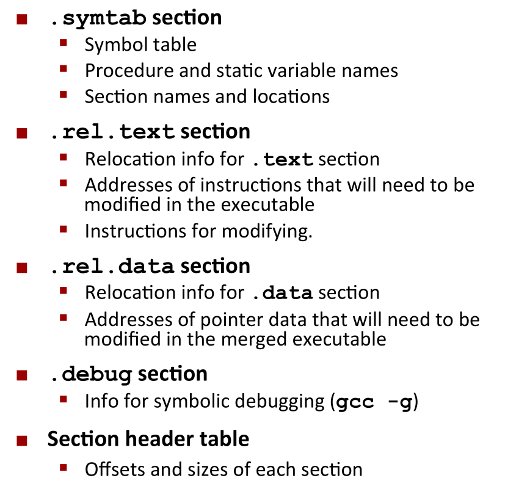

# CMU 15-213 2015 fall CSAPP
## Lecture 1 : cource overview
### Several Reality of how the machine works
1. **Ints are not Integers, Floats are not Reals**<br>
    Example1: Is $x^2 \geq 0$ ? For Floats: yes. for Ints, there are overloading problems.<br>
    Example2: Is (x+y)+z = x+(y+z) ? For ints: yes. For Floats:not. <br>
    
2. **You've got to know Assembly** 阅读编译器生成的汇编代码
3. **Memory Matters** : Random Access Memory Is an Unphysical Abstraction:
    * Memery is not unbounded 
    * Memory referencing bugs 十分致命
    * Memory performance is not uniform
    
4. **除了渐进复杂度还有很多performance的问题**:
    * 常数因子也很重要
    * Must understand system to optimize performance
    
5. **Computers do more than execute programs**:
    * They need to get data in and out (I/O System)
    * 电脑使用网络相互通信

## Lecture 2 Bit,Byte and Integers
Everything is bits. 存储一个bit的值比其他方式更容易实现.依然而言, 使用4个bit去用16进制能更简单地表示数据, 而8个bit就是一个Byte(字节).<br>
在C语言中的各种数据大小:<br>
<br>
### 位操作
布尔代数的运算规则,这些运算规则可以用来 Manipulating Sets:<br>
<br>
需要注意的是这个C的 **bit operator和表达式的逻辑运算是不同的**, 注意区分, 而表达式地逻辑运算会有短路求值(Early Termination).
shift Operations:<br>
<br>
注意的是右移是有两种,逻辑上的和算术上的.

### Integers 表示
<br>
对于Unsigned 的数字,最高为是 $2^{w-1}$, 对于 Signed,是$- 2^{w-1}$, 就是上面的等式所描述的. <br>
我们可以使用一个五位的数字来简化理解, w位数据能到的最小值和最大值:<br>
<br>
理解了之后, 就可以在T和U之间做 Map,以一个4bit的表示为例:<br>
<br>
在进行比较的时候, 这些signed可能会被casting成 unsigned, 就会出现我们意料之外的结果:<br>
<br>
问题就是在于从signed到unsigned的 casting:
* 操作是在bit level pattern
* 但是这个结果是reinterpreted(重新解释)
* 于是会有意料之外的结果 (加上或者减去 $2^w$)

```C++
for(unsigned i = n-1; i >= 0; --i){//error: i是unsigned的话, 
                                   //无论如何做减法, 都是大于0的
}
```

__sign extension__: 对于一个w-bit的signed integer X,要转成(w+k)-bit的integer with the same value, 所需要做的就是 __make k copies of sign bit__, 前面的多个位之间可以相互抵消, 得到的结果是一样的:<br>
<br>
__sign truncating__ : 对于unsigned, 有点类似于mod operation, 对于大的负数,也可以从mod上理解. 对于small的数字, 就会得到期望的相等结果.

## Lecture 3 : Bits, Bytes and Integers (Part 2)

补码表示是我们最常见的编码表示, 在讨论补码的加法之前, 我们先讨论 Unsigned 的 加法 <br>
### Unsigned and Two's Complement Addition
首先考虑的是最高位如果存在的话就直接丢弃, 相当于是 $s = UAdd_w( u, v) = u + v\ mod \ 2^w $, 下图是一个很好的可视化理解: <br>
<br>
TAdd 和 UAdd 有相同的 Bit-level 行为, 因此才会称为大多数系统中的首选方案, Overflow的case, 如一个4 bit的数据(从-8 到 7), -6 + (-3) 的结果是 7 (negetative overflow, 正常应该是 -9), 7+5 的结果是 -4 (positive overflow, 本来应该是12, 刚好是 -4 的 Unsigned 表达), 它可以用下面的图来表示:<br>
<br>

### 乘法表示
如果我们使用两个 w bit 的数据做乘法, 通常是需要 两倍(2w bit)的空间才能将结果容纳下来,不然会有各种溢出的问题. 对于 Unsigned的乘法, 结果就相当于 $UMult_w (u,v) = u \cdot v \ mod  \ 2^w $ <br>
对于补码的乘法表示, 就更加复杂了, 在有的时候依旧可以得到想要的结果: 如 -3(相当于13的表示)乘以-2(相当于14的UnSigned 表示), 结果是 (13*14) mod 16, 是6 ,符合预期. <br>

#### power-of-2 Multiply with Shift
* Operation u << k gives $u * 2^k $
* Both Signed and unsigned

在过去, 可能计算机可以在一个clock cycle做shift操作, 但是要 12~13 个 clock cycle 去做一个乘法,除法可能要30个clock cycle.现在可能要快一些, 但是依旧没有移位快. <br>
同样的, 除法要做左移, 使用Unsigned 的话是逻辑左移, 使用补码未定义, 大概率是算术左移.<br>

#### 为什么要用 _Unsigned_
- [x] 除非理解了implications, 否则不要用(容易犯错, 非常麻烦):
    <br>
    这个时候或者直接将所有UINT直接显式转换成为一个signed数字使用,我们可以使用unsigned来做count,如
    ```C
    size_t i;
    for(i = cnt -2; i < cnt; i--) //即使 cnt = UMAX 依旧可以正确运行
        a[i] += a[i+1];
    ```
- [x] 做 Modular Arithmetic 时候必须用到
- [x] 使用Bits表示集合的时候一定会用到

### 在内存中的表示(Pointers, Strings)
<br>
现在很难看到前面那种组织方式了, 具体的表达方式如下,对于int和Pointer都是相反的:<br>
<br>
对于String的表示, 两者都是相同的:<br>
<br>

## Lecture 04: Floating point
### Fractional Binary Numbers
<br>
* Divide by 2 by shifting right(unsigned)  
* Multiply by 2 by shifting left
* Can only exactly represent numbers of the form $x/2^k$(Other rational numbers have repeating bit representations,类似于10进制中的循环小数)

标准的浮点数表示如下:<br>
<br>
其中的S为标记位, 而 E是一个Exp 减去一个偏移量(单精度为127,双精度为1023),不用unsinged的原因是可以直接用其比较大小(最小的为00000000,最大的为11111111)<br>
M被normalized称为 $1.f$ 的形式, get one more bit for free. 举一个通常的例子:<br>
<br>
1. 在 $exp$ 的part 和 $frac$ 的part 都是 0的时候, 就代表浮点数0.但是因为有signed bit, 因此可能出现正的0和负的0. 如果 这时候 $frac \neq 00...0$, 就是代表一个很小的数字
2. $exp = 111…1$, $frac = 00...0$ , 代表的是无穷大
3. $exp = 111…1$, $frac \neq 00...0$ , 代表 NaN(Not-a-Number)

<br>
值得注意的是, 越接近0, 数字越密集, 以 6-bit 的 IEEE-like的数字为例:<br>
<br>

### Rounding,addition,multiplication  
Rounding(浮点数舍入称为整数) 有很多种做法:
* round towards zero
* Round down
* Round up
* <font color=blue>round Nearest Even</font> (default)

同样的, 我们对于 Binary Number 也可以做类似的Round, 实际的做法就是 round to even:<br>
如一个binary float: 1. ...y (to round)...,最末尾y为需要保留的最后一位
1. 只要第一个1后续数字还包含有1,尾数y+1
2. 如果第一个为1,但是后续的值均为0,则说明其后续的值 =$(1/2)^n * 1/2$ 则这时候说明舍入的距离都是相同的，这时候查看y的值，如果y为1,则y+1，如果y为0,则保持y为0
3. 如果靠近y的那个为0, 则全部舍弃

<br>
<br>

需要注意的是, 在 signed 和 Unsigned 之间做cast, 它的bit representation, 但是 **int 和 float/double 之间的cast 是会改变bit representation的**.

## Lecture 5: Machine-­‐Level Programming I: Basics
在本课程中不讨论Microarchitecture(architecture 的实现), 在Assembly/Machine code的角度,计算机是下面的结构:<br>
<br>
编译生成汇编代码的方法:<br>
`gcc -Og -S someSourceFile.c` (-S 选项生成汇编代码, -Og是启用用于debug的优化选项, 生成方便阅读的代码)<br>
Assembly 中的单个Operation只能做一个事情, 比如:
* Perform arithmetic function on register or memory data  
* Transfer data between memory and register
    * Load data from memory into register  
    * Store register data into memory  
* Transfer control  

对于已有的二进制代码, 我们也可以用Disassembler:<br>
    `objdump –d someObjectCode`<br>
或者在GDB中使用(sumstore为可执行文件sum原码中的某个函数):<br>
```
gdb sum 
disassemble sumstore
```
**Disassembler examines bytes and reconstructs assembly source** .
#### Regisiter
在过去IA32中只有8个寄存器, %e**, 在最早的使用中, 某些寄存器常用于特定的功能, 因此影响到了他们的名字,但是现在而言, 除了特定的 `%esp` 作为stack pointer(IA32/x86-64)和 `%ebp` 作为base pointer(IA32),其他都可以通用,具体指代的内容如下:<br>
<br>

#### 寄存器上的操作
##### Moving Data
`movq Source, Dest`<br>
面对的操作数有三种: 
1. Immediate: Constant integer data  
    * Example: `$0x400`, `$-533` 
2. Register: One of 16 integer registers(在IA 32上可能是8个)
    * Example: `%rax`, `%r13`
3. Memory: 8 consecutive bytes of memory at address given by register  
    * simplest example: `(%rax)` (有点像C中取寄存器指向的那个地方的内容) 

<br>
此外, move也可以有displacement, 具体的做法就是
* Register $R$ specifies start of memory region 
* Constant displacement $D$ specifies offset  
`movq 8(%rbp),%rdx`
之后, 可以用这样的形式来实现一个array:<br>
<br>

#### Arithmetic  &  logical  operations 
<br>

## Lecture 6: Machine-­‐Level  Programming  II:  Control  
寄存器这个东西既不是内存的一部分也不是缓存的一部分,如果是用C语言编程,程序员感受不到它的存在.<br>
### Condition codes
* `%rsp` Current stack top 
* `%rip` Instruction pointer

Single bit regisiters:
* CF: Carry Flag(for unsigned)
* ZF: Zero Flag
* SF: sign Flag(for signed)
* OF: Overflow Flag(for signed)

例如
1. 在arithmetic operations中 `add Src, Dest` => `t = a + b`:<br>
    <br>
2. 在compare指令 `cmpq Src2, Src1`, 像是在计算 `Src1 - Src2` 但是不存储结果:<br>
    <br>
3. 在test指令中, `testq Src1, Src2` 就像是在计算 `Src1 & Src2` 但是不存储结果:<br>
    <br>
4. Set 指令就是根据前一行指令的 Condition code, 设置目标的low order byte是 0或者1, **不改变寄存器剩下的7个bytes:<br>
    <br>

### Jumping
实际上有两种类型的Jump, 一种是无条件的Jump, 直接跳到某个位置, 一种是有条件的 Jump, 根据condition code决定要不要Jump.<br>
<br>
一般这个算术指令接受两个参数, 是将结果复写在后面那个参数上.生成的汇编代码有一点像是使用 `goto` 去实现的, 如 C的代码 `val = test ? Then_expr : Else_expr;`, 它的goto version 就有点像是:
```C
ntest = !Test;
if(ntest) goto Else;
val = Then_expr;
goto Done;
Else:
    val = Else_expr;
Done:
    ...
```

### Using Conditional Move
计算机就通过预测去加速, 因此对于前面的Jump来说, 对 pipeline中的 instruction flow 做分支带来的代价是比较大的, 因此condition Move的效果是支持类似的指令: `if(Test) Dest <- Src`.<br>
```C++
val = Test ? Then_expr
           : Else_expr;
// GOTO version
result = Then_expr;
val = Else_expr;
nt = !Test;
if(nt) result = val;
return result;
```
<br>

**一般而言, conditional Move 用于两只值都要计算, 但是计算相对简单的情形, 如果计算可能有非常高的代价/ 出现难以接受的后果后者side effect, 则不建议使用** . <br>

### Loop
#### Do-While 循环例子
```C
long pcount_do (unsigned long x) { 
    long result = 0; 
    do { 
        result += x & 0x1; 
        x >>= 1;
    } while (x); 
    return result; 
}
// goto version
long pcount_goto (unsigned long x) { 
    long result = 0;
loop:
    result += x & 0x1; 
    x >>= 1; 
    if(x) goto loop; 
    return result; 
}
// assembly code
    movl    $0, %eax  #  result = 0 
.L2:   # loop: 
    movq    %rdi, %rdx 
    andl    $1, %edx  #  t = x & 0x1 
    addq    %rdx, %rax #  result += t 
    shrq    %rdi  #  x >>= 1 
    jne     .L2  #  if (x) goto loop 
    rep; ret
```
#### General Do-while translation
##### 第一种变化
* Jump to middle translation(其他地方一般不用这个称呼)
* used with -Og
```C++
while(Test)
    Body
// goto version
    goto test;
loop:
    Body
test: 
    if(Test)
        goto loop;
done:
```
##### 第二种变化
把 while -> do while, used with -O1
```C++
if(!Test)
    goto done;
do 
    Body
    while(Test);
done:
// goto version
if(!Test)
    goto done;
loop:
    Body
    If(Test)
    goto loop;
done:
```

For Loop Form 可以和while相互转换.

### Switch statement
实际上并不是用if-else实现的, 而是用一个被称为Jump table的结构:<br>
<br>

## Lecture 7 : Machine-Level Programming: Procedures

ABI(Application Binary Interfaces): 系统的各个组分管理资源时候的约定.<br>
<font size=4> Mechanisms in Procedures</font>
* Passing control  
    * 控制流到了procdeure code 的开头
    * 返回后又回到调用函数的point
* 传递数据
    * procedure 的参数匹配
    * 返回值
* 内存管理
    * 在procedure执行的时候分配
    * 返回的时候deallocate

### x86-64 Stack
Stack 是用来管理内存的一种方式, 在函数调用过程中十分有用(Last in First out)<br>
Stack Pointer(`%rsp`) 保存着最下面的stack 的地址(逻辑上是top element), stack 要这 grow 的时候实际上是 `%rsp` 向下移(address grows from top to Bottom)<br>

#### Push 
`pushq Src` (Src为寄存器)做的事情是:
* 取得在 src 处的操作数
* 把 `%rsp` 减小 8
* 向 `%rsp` 的地址写入第一步 fetch 的 操作数

#### Pop
`popq Dest`
* 读取 `%rsp` 指向地址上的值
* `%rsp` 增加8
* 将取到的值写到 Dest 上(同样 Dest 为寄存器, 不能直接从内存写到内存)

### Calling Convension

#### Procedure Control Flow
使用栈来支持 procedure 的调用和返回
* procedure call : call label
  * 将返回地址压入stack
  * 跳转到那个 label
* 返回地址: 
  * 函数调用完毕之后执行的下一条指令的地址
* procedure return: ret
  * 将地址从栈中 pop 出来
  * 跳转到那个地址
  


#### Passing Data
* 返回值存在寄存器 `%rax` 中
* 六个参数分别存在 `%rdi, %rsi, %rdx, %rcx, %r8, %r9` 中
* 如果还有更多参数, 则存在 stack 中


#### 管理 local data
首先我们引入 stack Frame 的概念: 


一个 frame 中有 返回值信息, local 存储(如果需要的话) 和临时空间(如果需要的话).


需要注意的是, 每个stack frame 需要管理自己的数据. 


我们在调用函数的时候, 首先就是在当前的frame 中将数据存储下来,后面接着的两行的意思就是将两个参数放到寄存器中, 调用函数结束之后, 将两个数字之和放到 `%rax`中, 然后再将stack pointer 加回去(这个简单的case, 一开始 %rep 减了多少后面就加回去):


调用函数的时候寄存器中的内容可能被覆写. 于是需要 caller saved 和 callee saved并且在其中维持一个保持数据的协议:
* Caller Saved: 在调用之前, caller 将临时数据在自己的 frame 中管理
* Callee Saved: Callee 在使用前将临时数据存在自己的 frame 中, 在返回前 restre them


如果我们将返回值改为 x + v2, 就会有下面的结果:


区别在于使用了 `%rbx` 这个 callee saved 寄存器. 

### 递归详解
有了这些寄存器约定之后, 我们就可以在 callee saved 寄存器的帮助下实现一个递归


## Lecture 8: Machine-­‐Level Programming IV Data
### Arrays
在 machine level, 没有复杂的数据结构(Array/Structure), 都是一个 byte 的 sequence. 因此 Array 内存分配的基本原理是 `T A[L]` 声明一个数据类型为 T, 长度为 L 的数组, 实际对应的是一个连续的长度为 $L \times sizeof(T)$ 的内存区域. 

#### 多维 Arrays
多维的 array 使用 `T A[R][C];`声明, 一共有 R 行 C 列, 总的尺寸为 $R \times C \times sizeof(T)$ , 内存的 Arrangement 方式为 Row-­‐Major Ordering. 


其中的每一行也是一个含有 C 个元素的 Array, 开始的地址为 $A + i \times C \times K$(K 为每个元素的大小), 需要注意的是, 一个2D Array 和一个指针构成的数组, 肯能还是有略微的区别:


### 结构体
* 结构体代表一大块的内存, 足够放下所有的数据域
* 结构体的域是按照声明的顺序排列(即使有更紧凑的排列方式)
* 编译器决定域总体的 size 和 位置


#### 内存的排布原则
* 需要排列的数据至少需要 K = sizeof(T) 个 byte, 地址一定是 K 的整数倍数
* 我们访问的地址块最好是 4 个或者 8 个 byte
* 编译器会在结构体重插入gap 保证 field 的正确排布


### 浮点数
我们可以使用 XMM Registers 来提高浮点运算的性能:


## Lecture 9 : Machine-­‐Level Programming V - Advanced Topics
### 内存布局
虚拟内存理论上是一个很大的array, 64bit 机器的实际上支持的最大的内存只有 47 bit.作为一个 array 它这样安排的:
* Stack 在内存的最上面, 所以 stack 增加的话其 pointer 是减小的, 通过 linux 的limit 命令得到 stacksize 为 8 _Mb_, 一般用于 local 变量
* Heap 是在需要的时候动态分配(C调用 `malloc()` / `calloc()`, C++ 调用 `new()`)
* data 是静态分配的, 如全局的变量, 静态变量 和 string 常量
* Text/ Shared Library: 执行机器指令, Read Only


实际测试中发现, 动态分配的内存小块的在上面而大块的在下面.

### Buffer Overflow
* 通常我们访问超过 array size 的元素的时候就会有造成 buffer overflow
* 通常发生在下面的场景中
  * 在 string 输入的时候没有检查 length, 其他的函数如 strcpy/strcat/scanf/fscanf/sscanf 也有类似的问题
    ```C++
    /* Get string from stdin */
    char *gets(char *dest)
    {
        int c = getchar();
        char *p = dest;
        while (c != EOF && c != '\n') {
            *p++ = c;
            c = getchar();
        }
        *p = '\0';
        return dest;
    }
    ```
    
    在输入超过 24 个字符时候, 就会 crash return address.下面就是一个代码注入攻击的例子, 我们将返回地址付下之后, Q 返回会跳转到 exploit code 处(Buffer overflow bugs can allow remote machines to execute arbitrary code on victim machines):<br>
    

避免 Buffer Overflow 的方法:
* 在代码中避免 Overflow Vulnerabilities:
  * 例如使用限制 string length 的库函数(gets -> fgets, strcpy -> strncpy, `%s` -> `%ns`)
* 系统级的保护可能有作用
  * Randomize stack offsets
  * Nonexecutable code segments
* Stack Canaries can help
  * Place special value (“canary”) on stack just beyond buffer
  * Check for corruption before exiting function
  * gcc 选项 `-fstack-protector`(现在已经默认)

## Union Allocation
* 分配最大的 element 需要的内存
* 一次只能使用一个 field

对于 Big Endian 和 Little Endian , Byte 的 Ordering 可能有区别.

## Lecture 10: 程序优化(Chap 5)

### Optimizing Compilers
优化编译器需要做的事情和具体的编译器/处理器无关:
* 移动代码, 将频繁需要做的事情提前计算好, 例如将代码移出循环体(实际上-O1 优化选项就会这么做)
  
* 削减强度, 将成本高的操作用低成本的替代
  * 使用 shift/add 替代 乘法和除法
  * 识别出序列中的乘积
    
* 共享通用的子句(GCC -O1 选项也会这么做)
    

我们看下面的一个例子:

 

最后发现它的运行时间居然是平方增长的, 问题就在于, 每次调用的时候都是要调用 `strlen`, 它的时间复杂度为 n.我们将 `strlen` 放到外面能够观察到时间成本的显著降低. 为什么编译器不把 strlen 的调用移到循环外面?
* 函数调用可能有 side effects( 移到外面可能副作用次数少了)
* 函数不是每次调用都是返回龙一个值(取决于其他部分的状态,而且 `lower` 可能和 `strlen`相互作用)

因此, 编译器将函数调用看成是一个黑盒子, 相关的优化就比较弱. 

此外, 编译器假定了可能存在内存的 aliasing(两个不同的指针指向同一块内存地址), 因此我们可能引入 local 变量, 我们可以使用自己的方式告诉编译器不要检查

### 利用指令级并行
引入 CPE(Cycles Per Element) 来评估在vector 或者 list 上操作的性能. 如果长度为 n 那么 时间就是 $n \times CPE + Overhead$.

最基础的优化, 将取 vector length 的操作放到循环外面, 避免边界检查, 并且将累加放到临时变量中.

超标量处理器(可以在一个时钟周期中分发执行多个指令):<br>
<br>
流水线功能单元<br>
<br>

Loop Unrolling(在其中的一个循环中, 每次步进多个step, 每个 step 做多个 OP):
```C++
void unroll2a_combine(vec_ptr v, data_t *dest)
{
    long length = vec_length(v);
    long limit = length-1;
    data_t *d = get_vec_start(v);
    data_t x = IDENT;
    long i;
    /* Combine 2 elements at a time */
    for (i = 0; i < limit; i+=2) {
        x = (x OP d[i]) OP d[i+1];
    }
    /* Finish any remaining elements */
    for (; i < length; i++) {
        x = x OP d[i];
    }
    *dest = x;
}
```
<br>
Loop Unrolling with Reassociation
```C++
void unroll2aa_combine(vec_ptr v, data_t *dest)
{
    long length = vec_length(v);
    long limit = length-1;
    data_t *d = get_vec_start(v);
    data_t x = IDENT;
    long i;
    /* Combine 2 elements at a time */
    for (i = 0; i < limit; i+=2) {
        x = x OP (d[i] OP d[i+1]);
    }
    /* Finish any remaining elements */
    for (; i < length; i++) {
        x = x OP d[i];
    }
    *dest = x;
}
```
<br>

#### 使用 AVX2 编程
YMM 寄存器是 XMM 寄存器的升级, 它有16个, 每个为 32 byte.<br>
<br>

#### 分支
分支中可能会有预测, 如果预测正确则提前执行再 fetch 结果,错误的话就重置.<br>


## Lecture 11: 内存层次结果
### 存储器技术和发展趋势
#### 随机访问存储器
随机访问存储器, 有动态和静态 RAM, 传统上被打包成 chip, 多个 chip 形成一个内存. 他们都是易失性存储器(断电后会丢失信息),非易失性存储即使在断电后也能保持其值.  传统的CPU 和内存通过总线连接. <br>
Memory 读取的过程有三步:
* CPU places address A on the memory bus
* Main memory reads A from the memory bus, retrieves word x, and places it on the bus.
* CPU read word x from the bus and copies it into register `%rax`.
  

同样的写入过程也是三步:
* CPU places address A on bus. Main memory reads it and waits for the corresponding data word to arrive.
* CPU places data word y on the bus.
* Main memory reads data word y from the bus and stores it at address A.

#### 机械硬盘
机械硬盘的几何结构:<br>
<br>
<br>
上面是一个典型的读取过程, 我们从中得到盘的访问时间组成为 $T_{access} = T_{avg seek} + T_{avg rotation} + T_{avg transfer}$ :
* Seek time (Tavg seek)
  * Time to position heads over cylinder containing target sector.
  * Typical Tavg seek is 3—9 ms
* Rotational latency (Tavg rotation)
  * Time waiting for first bit of target sector to pass under r/w head.
  * Tavg rotation = 1/2 x 1/RPMs x 60 sec/1 min
  * Typical Tavg rotation = 7200 RPMs
* Transfer time (Tavg transfer)
  * Time to read the bits in the target sector.
  * Tavg transfer = 1/RPM x 1/(avg # sectors/track) x 60 secs/1 min.

总的来说, access 时间是由 seek time 和旋转颜值决定的, 总速度比 DRAM 慢约 2500倍. <br>
现在的disk 提供一个逻辑 Block 的抽象, 扇区被抽象成逻辑 blocks, 逻辑区块和扇区之间有一个 Mapping. 从一个 Disk 扇区读取数据的过程分三个部分: 
* CPU initiates a disk read by writing a command, logical block number, and destination memory address to a port (address) associated with disk controller.
* Disk controller reads the sector and performs a direct memory access (DMA) transfer into main memory.
* When the DMA transfer completes,the disk controller notifies the CPU with an **interrupt** (i.e., asserts a special “interrupt” pin on the CPU)

#### 固态硬盘
对于CPU来说它和机械硬盘没有区别, 总线和 Flash Memory 之间有一个 Flash translation layer, 有个特性就是 Page can be writen only after its block has been erased, 超过一定读写次数后可能会损坏. 各种存储器的访问速度之间的区别如下:


可以看到内存和硬盘之间有很大的 gap.

### Locality
Locality 原则: 程序更倾向于使用他们最近使用过位置临近的指令或者地址. <br>
<br>
**对 Locality 的量化评估**, 下面就是一个很不好的例子:<br>
<br>

### 内存层次结构
<br>
#### Caches
* Cache: A smaller, faster storage device that acts as a staging area for a subset of the data in a larger, slower device.(有点像是背着书包去上学, 这样需要某个东西时候在包里找而不用直接回去拿)
* The memory hierarchy creates a large pool of storage that costs as much as the cheap storage near the bottom, but that serves data to programs at the rate of the fast storage near the top.

<br>
* Cold (compulsory) miss
    * Cold misses occur because the cache is empty.
* Conflict miss
    * Most caches limit blocks at level k+1 to a small subset (sometimes a singleton) of the block positions at level k.
        * E.g. Block i at level k+1 must be placed in block (i mod 4) at level k.
    * Conflict misses occur when the level k cache is large enough, but multiple data objects all map to the same level k block.
        * E.g. Referencing blocks 0, 8, 0, 8, 0, 8, ... would miss every time.
* Capacity miss
    * Occurs when the set of active cache blocks (working set) is larger than the cache.

## Lecture 12: Cache Memories
### Cache 组成和操作
Cache Memory 是硬件自动管理的容量小\基于静态随机存储器的内存, CPU 首先在 cache 中查找资源, 然后才是在main memory中找, 典型的结构如下:
<br>
其具体的缓存结构如下图所示, 每个 set 依旧可能有多行. 最低的几个位是在 block 中的偏移量, s 为 set 的下标, 剩下的几位为 tag:
<br>
#### Example: Direct Mapped Cache(E=1)
每个 set 只有一行, 在 Cache 模拟中发现 hit 的概率非常低. 
#### E-­‐way Set Associative Cache(这里E=2)
<br>
<br>

#### Cache 的 Write
Data 在不同的层次中有多个拷贝, L1/L2/L3,主内存/硬盘..., 在 Hit 和 miss 的时候有不同的策略:
* What to do on a write-­‐hit?
  * Write-­‐through (write immediately to memory)
  * Write-­‐back (defer write to memory un;l replacement of line)
    * Need a dirty bit (line different from memory or not)
* What to do on a write-­‐miss?
  * Write-­‐allocate (load into cache, update line in cache)
    * Good if more writes to the location follow
  * No-­‐write-­‐allocate (writes straight to memory, does not load into cache)

#### Cache 性能测量
* Miss Rate
  * Fraction of memory references not found in cache (misses / accesses)= 1 – hit rate
  * Typical numbers (in percentages):
    * 3-­‐10% for L1
    * can be quite small (e.g., < 1%) for L2, depending on size, etc.
* Hit Time
  * Time to deliver a line in the cache to the processor
    * includes time to determine whether the line is in the cache
  * Typical numbers:
    * 4 clock cycle for L1
    * 10 clock cycles for L2
* Miss Penalty
  * Addi;onal ;me required because of a miss
    * typically 50-­‐200 cycles for main memory (Trend: increasing!)

#### 编写 Cache 友好型代码
* Make the common case go fast
  * Focus on the inner loops of the core func;ons
* Minimize the misses in the inner loops
  * Repeated references to variables are good (temporal locality)
  * Stride-­‐1 reference panerns are good (spatial locality)

### cache对性能的影响
#### The Memory Mountain
<br>
#### Rearranging loops to improve spatial locality
<br>
<br>
<br>

#### using bolcking to improve temporal locality
```C++
c = (double *) calloc(sizeof(double), n*n);
/* Multiply n x n matrices a and b */
void mmm(double *a, double *b, double *c, int n) {
    int i, j, k;
    for (i = 0; i < n; i++)
        for (j = 0; j < n; j++)
            for (k = 0; k < n; k++)
                c[i*n + j] += a[i*n + k] * b[k*n + j];
}
c = (double *) calloc(sizeof(double), n*n);
/* Multiply n x n matrices a and b */
void mmm(double *a, double *b, double *c, int n) {
int i, j, k;
for (i = 0; i < n; i+=B)
    for (j = 0; j < n; j+=B)
        for (k = 0; k < n; k+=B)
            /* B x B mini matrix multiplications */
            for (i1 = i; i1 < i+B; i++)
            for (j1 = j; j1 < j+B; j++)
            for (k1 = k; k1 < k+B; k++)
            c[i1*n+j1] += a[i1*n + k1]*b[k1*n + j1];
}
```
<br>
<br>
<br>
<br>

## Lecture 13: Linking
<br>
翻译的过程其实是三步, 首先调用预处理器(cpp)然后调用编译器(cc1)然后调用汇编器(as), 生成目标文件 `*.o`, 我们为什么需要链接器:
* 模块化: 将程序写成一系列的小源文件, 而不是一个巨无霸,同时可以构建库文件
* 效率:
  * 时间上, 分离编译更快
  * 空间上, 公用库可以节约空间

链接器做的事情:
1. Symbol resolution
   *  程序定义和引用 symbols(全局变量和函数)
   *  symbol 定义存储在目标文件的 symbol table 中, 这种表示 struct 构成的 array, 每个入口有symbol 的 names size 和 location
   *  在这个 resolution 的过程中, linker 将每个 symbol reference 和 它的定义关联起来
2. Relocation 
     *  Merges separate code and data sections into single sections
     *  Relocates symbols from their relative locations in the .o files to their final absolute memory locations in the executable.
     *  Updates all references to these symbols to reflect their new positions.

三种目标文件:
1. 可重定位目标文件(.o): 包含二进制代码和数据，其形式可以在编译时与其他可重定位目标文件合并起来，创建一个可执行目标文件 。
2. 可执行目标文件(.out): 包含二进制代码和数据，其形式可以被直接复制到内存并执行 。
3. 共享目标文件(.so): 一种特殊类型的可重定位目标文件，可以在加载或者运行时被动态地加载进内存并链接。

可执行和可链接格式(ELF)对于上面的三种目标文件是一样的,其格式如下:
<br> 
<br>
`.bss` 来表示未初始化的数据是很普遍的, `.data` 和`.bss` 节之间区别的简单方法是把"bss" 看成是”更好地节省空间(Better Save Space)"的缩写。<br>
### Symbols
#### Local Symbols 
* local non-static 变量 和 local static 变量的区别
  * 前者一般在栈中存储
  * 后者在 `.bss` 或者`.data`中存储, 离开了 local 的作用域同样不能访问

#### 编译器如何解决重复的 Symbol 定义
* Program 符号可能是强的或者弱的
  * Strong: procedure 或者已初始化的的 globals
  * Weak: 未初始化的globals
1. Rule 1: 多个 Strong Symbols 是不被允许的
   * 每个 item 只能定义一次, 否则出现链接错误
2. Rule 2: 给定一个强符号和若干弱符号, 选择强符号
   1. 弱符号的references 也是弱符号
3. Rule 3: 如果有多个弱符号, 选择任意一个(可以用 `gcc -fno-common` 覆盖)
 <br>

因此, 尽可能去避免全局变量, 如果实在无法避免:
1. 尽可能使用 static
2. 在定义的时候初始化全局变量
3. 使用 `extern` 如果引用一个外部的全局变量

### Relocation
callq 用的是一个绝对的地址表示函数, 链接的时候会更新 pc - relative 地址:`0x4004e8 = 0x4004e3 + 0x5`. <br>
编译生成的二进制文件可以直接加载在内存中, `.init, .text , .rodata` 这些会加载在只读代码部分, `.data, .bss` 加载在读写数据部分, heap 向上增长, stack 向下增长.两者之间是 shared libraries. heap 之上是内核的虚拟内存,对于 code 是 invisible. 

### Linking and Libraries
目前有两个linker framework:
* 选项一: 将所有的函数放在一个单独的文件中, 程序员这时候将大的目标文件链接到程序中, 空间可时间上都是 Ineffecient
* 选项二: 将每个函数放到不同的source file中, 链接的时候只要链接合适的二进制文件, 更高效但是对程序员任务更重

#### 静态库
* `.a` archive 文件是其他可重定位目标合成带有 index 的单个文件
* 如果archive 的某个文件被引用了, 只需要将对应的 .o 链接到可执行文件中

<br>

它决定外部引用的算法如下:
* 按照命令行的顺序扫描 .o 和 .a 文件
* 扫描过程中, 持有一个记录当前未决定的引用
* 进入新的 .o/.a 文件,用二进制文件中的符号表 试着解析每个未解析的符号
* 如果扫描之后还有 unrasolved entry, 就会报错

带来的问题就是命令行的顺序会影响结果, 好的做法是将库放在命令行的后面.

#### 动态库
动态库并不是在编译的时候链接到二进制文件中, 而是在程序加载甚至运行的时候动态链接到应用中. `.DLL(for Windoes) .so`<br>
<br>
```C++
#include <stdio.h>
#include <stdlib.h>
#include <dlfcn.h>

int x[2] = {1, 2};
int y[2] = {3, 4};
int z[2];

int main()
{
    void *handle;
    void (*addvec)(int *, int *, int *, int);
    char *error;

    /* Dynamically load the shared library that contains addvec() */
    handle = dlopen("./libvector.so", RTLD_LAZY);
    if (!handle) {
        fprintf(stderr, "%s\n", dlerror());
        exit(1);
    }
    ...
    /* Get a pointer to the addvec() function we just loaded */
    addvec = dlsym(handle, "addvec");
    if ((error = dlerror()) != NULL) {
        fprintf(stderr, "%s\n", error);
        exit(1);
    }

    /* Now we can call addvec() just like any other function */
    addvec(x, y, z, 2);
    printf("z = [%d %d]\n", z[0], z[1]);

    /* Unload the shared library */
    if (dlclose(handle) < 0) {
        fprintf(stderr, "%s\n", dlerror());
        exit(1);
    }
    return 0;
}
```

### Case Study: Library Interpositioning
给函数中使用 wrapper 函数, 这样的话调用某函数的时候实际上是调用其wrapper<br>
在 安全/测试/Monitoring 和 Profiling 中可以使用.
* 编译期 Interpositioning
  
* 链接期 Interpositioning
    ```C++
    #ifdef LINKTIME
    #include <stdio.h>
    
    void *__real_malloc(size_t size);
    void __real_free(void *ptr);
    
    /* malloc wrapper function */
    void *__wrap_malloc(size_t size)
    {
        void *ptr = __real_malloc(size); /* Call libc malloc */
        printf("malloc(%d) = %p\n", (int)size, ptr);
        return ptr;
    }
    
    /* free wrapper function */
    void __wrap_free(void *ptr)
    {
        __real_free(ptr); /* Call libc free */
        printf("free(%p)\n", ptr);
    }
    #endif
    ```
    
* 加载/运行期
    ```C++
    #ifdef RUNTIME
    #define _GNU_SOURCE
    #include <stdio.h>
    #include <stdlib.h>
    #include <dlfcn.h>
    
    /* malloc wrapper function */
    void *malloc(size_t size)
    {
        void *(*mallocp)(size_t size);
        char *error;
        
        mallocp = dlsym(RTLD_NEXT, "malloc"); /* Get addr of libc malloc */
        if ((error = dlerror()) != NULL) {
            fputs(error, stderr);
            exit(1);
        }
        char *ptr = mallocp(size); /* Call libc malloc */
        printf("malloc(%d) = %p\n", (int)size, ptr);
        return ptr;
    }
    /* free wrapper function */
    void free(void *ptr)
    {
        void (*freep)(void *) = NULL;
        char *error;
        if (!ptr)
        return;
        
        freep = dlsym(RTLD_NEXT, "free"); /* Get address of libc free */
        if ((error = dlerror()) != NULL) {
            fputs(error, stderr);
            exit(1);
        }
        freep(ptr); /* Call libc free */
        printf("free(%p)\n", ptr);
    }
    #endif
    ```
    

## Lecture 14: Exceptional Control Flow:Exceptions and Processes
处理器只做一个事情, 就是读取和执行一系列的指令, 每次执行一条, 长记性的指令序列就被称为是 CPU 的控制流. 异常控制流存在于计算机系统的所有层次:
* 底层机制
  1. 异常(Exceptions)
     * 对系统时间相应改变控制流
     * 使用软硬件结合来实现
* 高层机制
    1. 处理上下文切换(OS 软件和硬件Timer 实现)
    2. 信号(OS 软件实现)
    3. NonLocal Jumps: `setjmp()` 和 `longjmp()`, 由 C 运行时库实现

### Exceptions
