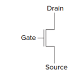
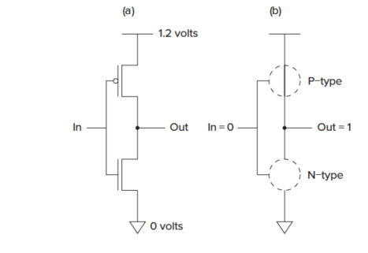
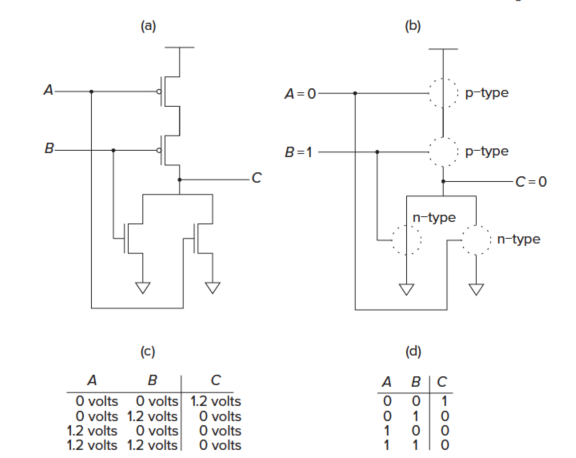
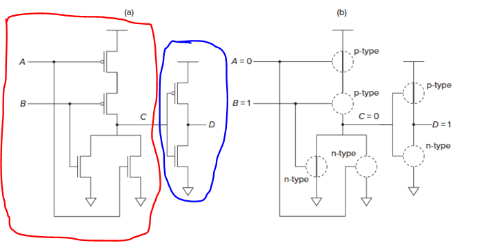
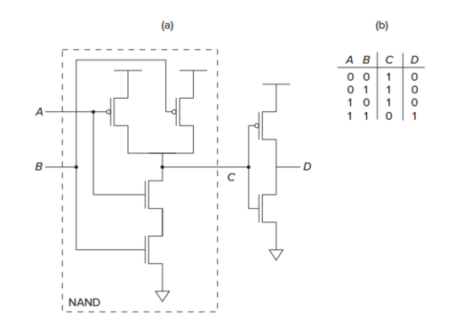
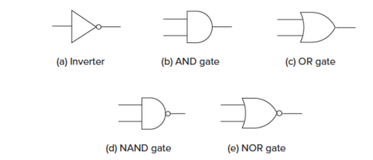
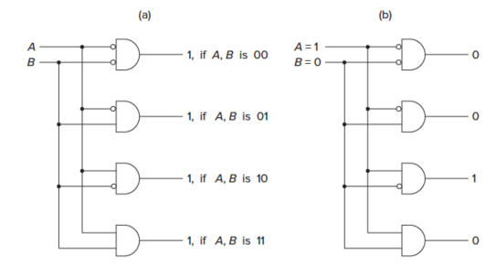
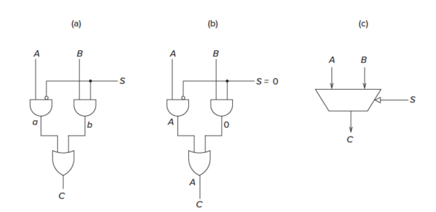
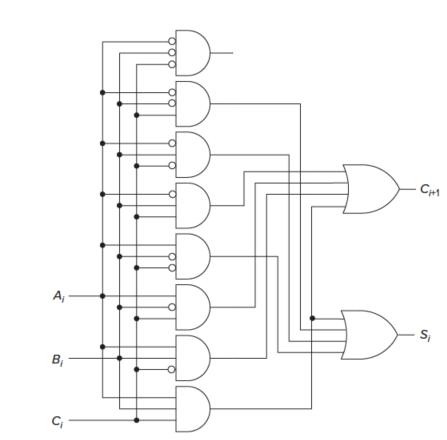

# Introduction to Computer Systems, from Bits and Gates to C and Beyond
[Yale N. Patt](http://users.ece.utexas.edu/~patt/) & [Sanjay Patel](https://ece.illinois.edu/about/directory/faculty/sjp) 

## Chap 1: Intro
计算机不过是一个电子设备, 它由许多电子部件构成, 这些部件又通过导线相连. 在这本书中, 我们将会了解 怎样用晶体管构建现代微处理器(加法器和存储信息的记忆部件),冯诺依曼机, LC-3机器以及如何编程. 
在本书中, 两个重要的理念就是: **抽象** 和 **不要对硬件和软件做任何区分**. 抽象让我们学会站在更高的层次看问题(前提是每个方面的细节都是运转正常的),抽象的层次越高越好, 它与工作效率成正比. 而不管职业是面向计算机软件还是硬件, 两者都懂会使你更强. 
计算机被称为通用计算设备(Universal Computational Devices): 在计算机出现之前, 最常见的加法器或者算盘,都只能做一类固定的操作, 通用计算概念的产生归功于图灵提出的假设, 任何计算都可以由这样一台机器(图灵机)来完成, One way to try to construct a machine more powerful than any particular Turing machine was to make a machine U that could simulate all Turing machines. 
 算法  
* 确定性: 表明操作的步骤的描述是清晰的, 可定义的
* 可计算型:  每一步都可以被计算机执行
* 有限性: 即过程是会终止的

 指令集结构  
ISA是程序和计算机硬件之间接口的一个完整定义, 包括:
1. 计算机可执行的 **指令集合**, 计算机所能执行的操作, 以及每个操作的数据是什么
2. 可接受的操作数的表达方式, 即 **数据类型**
3. 获取操作数的机制, 即定位各种操作数的不同方法(**寻址模式**)

在设计ISA的时候, 还要折衷考虑计算机的内存大小以及每个存储单元的宽度. 下一步的任务是将 ISA 转为对应的实现, 实现的具体组织被称为 微结构,ISA像是驾车人在车内看到的一切,几乎所有的汽车都提供了相似的接口, 而微结构就是车盖板下的内容,这个取决于设计者在制造之前所做的权衡策略. 

## Chap 2: bit\数据类型及其运算
### Bit和数据类型
如果只需要检测电路中的任意两点之间是否有电压, 而不是测量其精确的电压值, 电路的复杂性会大大降低. 一个要么是1要么是0 的符号被称为一个bit, 数值的表达方式有多种, 但是**只是表达数值还是不够, 计算机必须具备操作这些数值的能力.**  

对于有符号的整数, 表达的方式有多种, 包括符号位表示方法, 反码和 补码,而一个算术逻辑单元, **它只会对两个二进制数做加法(ADD)而不考虑其他操作**, 这意味着我们必须为它选择一个合适的方式, 以保证无论输入的是什么形式, 它都将产生正确的结果, 显然补码在这个方面是胜出的.  

 十进制与二进制数之间的转换
二进制转十进制特别简单, 只需要在讲每个数乘以对应的位次方, 再加起来, 如 $10010 = 0 + 2^1 + 0 + 0 + 2^4$, 十进制转二进制相对复杂一些, 可以考虑是递归的过程
1. 看最低位是奇数还是偶数, 结果就是 $n\ mod 2$
2. n/2 作为输入,重复上面的过程

符号扩展, 如一个4 bit的数扩展成8bit的signed数, 正数前面加0, 负数前面加1 : 就是和最高位是一样的. 

而两个符号相同的数之间加法是可能导致符号溢出的, 这个过程可以使用UINT _mod_ 的结果去理解.

### Bit 的逻辑运算
Bit 的逻辑运算的结果可以从真值表(truth table)来理解: 
 AND 
|  A  |  B  | AND |
| --- | --- | --- |
|  1  |  1  |  1  |
|  1  |  0  |  0  |
|  0  |  1  |  0  |
|  0  |  0  |  0  |

 OR 
|  A  |  B  | AND |
| --- | --- | --- |
|  1  |  1  |  1  |
|  1  |  0  |  1  |
|  0  |  1  |  1  |
|  0  |  0  |  0  |

 NOT 
|  A  | NOT |
| --- | --- |
|  1  |  0  |
|  0  |  1  |

 eXclusive-OR 
|  A  |  B  | AND |
| --- | --- | --- |
|  1  |  1  |  0  |
|  1  |  0  |  1  |
|  0  |  1  |  1  |
|  0  |  0  |  0  |

应用举例 : 

如果一个8个bit的数A, 只有其中最低两位有特殊含义, 可以使用屏蔽字位的方法, 将我们感兴趣的那几位提取出来.  
判断两个二进制数是否相同, 只需要XOR的操作, 相同的输出必定为0.

### 其他类型
#### 位矢量
存在n个单元, 我们可以用一个 _n-bit_ 的二进制数代表,某个单元空闲的时候将它设置为0, 忙碌的时候将它设置为1, 就称这种二进制数为 **位矢量**(bit vector).
#### 浮点数
浮点数的引入解决无法表示小数或者更大的数字的问题, 具体的解决方案是: 并不是将所有bit都用于精度表示, 一部分用于表达范围,一部分用于表达数字精度. 如广泛使用的 _float_ 类型:
1. 符号: 1 bit
2. 数值范围: 8 bit
3. 数值精度: 23bit

#### ASCII 码
将常见的字符和一个 Byte的 二进制表示出来

## Chap 3 : 数字逻辑

### MOS晶体管与逻辑门
如今大多数的计算机, 至少是大多数的微处理器, 都是由MOS晶体管构成, 我们可以通过一个n型号或者p型的MOS管替代开关, p型MOS管和n型MOS管工作机制互补.对于N-MOS晶体管,在栅极(G)接入2.9V的电压, 那么就在source 和 Drain 之间产生一条通路. 
 
#### NOT gate
 
上图就是一个简单的非门实现, 可以看到, 当输入为1的时候, 下面导通, 输出为0, 输入为0的时候, 上面导通, 输出为1.
#### NOT OR Gata
只有两个输入都为0的时候,输出才是1, 其他的时候输出都是0,其结果与或门刚好相反,称为或非门(NOR Gate): 
 
因此, 只需要在后面加入一个反相器, 得到的结果就是或门(OR Gate, 红圈中的为NOR/蓝圈中的为NOT): 
 

#### AND/NAND Gate
 
上图中虚线部分就是一个与非门, 而再加一个反相器, 就得到了一个与门.在今后, 就可以将这些门简写成下面的形式: 
 

#### De Morgan's Law
$\overline{\overline{A}\ \text{AND}\ \overline{B}} = A\ \text{OR}\ B$

### 组合逻辑
逻辑结构分成两类, 一类是可以存储信息的, 另一类是不能存储信息的.后者有时候被称为决策单元或者组合逻辑结构.我们将介绍三种组合逻辑结构:译码器,多路复用器 和全加器. 
#### 译码器
在输出中仅有一个为1, 其他为0, 一般而言有n个输入, 就有 $2^n$ 种输出, 该结构用于检测/匹配不同的输入模式: 
 
**译码器主要用于解释一个二进制数.**
#### 多路复用器
目的在于从多个输入中选择一个, 将它和输出相连, 选择信号负责决定选择哪一个, 如下图中的多路复用器, 当S=0的时候, 输出和A一致, 否则输入和B一致: 
 

#### 全加器
二进制的加法每个位有三个输入$A_i , B_i, \text{和 }  Carrier_{i}$, 输出为两个Bit,一个为$Carrier_{i+1}$,另一个为当前位.一个全加器的典型实现如下, 多个全加器串联起来就是多个Bit的加法器: 
 

**通过足够数量的{AND, NOT, OR}, 可以实现任意的真值表,他们是逻辑完备的**. 

### 存储单元
前面提到的几个电路, 都属于不能存储信息的逻辑电路.下面将介绍几个具有信息存储功能的数字逻辑. 

#### R-S 锁存器
