# CODE : the Hidden Language of Computer Hardware and Software

## 亲密挚友
在本书中,编码是一种用来在人和机器之间传递信息的方式,大部分编码必须易于理解,因为他们是人类交流的基础.  
在摩尔斯码中, 简单而短促的编码, 被分配给字母表中使用频率较高的字母.
## 编码的组合
在这里我们只需要记住一点, $\text{码字的数目} = 2 ^{\text{编码的位数}}$, 摩尔斯码也常常被称为二进制码(binary code),因为编码的数目只有两个(点 和 下划线)

## 布莱叶盲文与二进制码
在布莱叶盲文中,书写用的符号被编写成 $2 \times 3$ 点码单元中的凸起点, 这些点码都是二进制的,于是一共有 $2^6$种组合,这64组编码中的很大一部分, __根据上下文有着不同的双重身份__.

## 手电筒的剖析
开关只能是闭合或者断开状态, 二进制码与电气电路之间的相似性是后面章节的基础.

## 电报机与继电器
电报机的发明人使用一个继电器作为中继,使得人类第一次能够在视线或者听力范围之外的地方进行实时交流,而且这个发明使用了二进制码, 在后来的电子和无线通信(电话\无线电\电视)所使用的通信模式中, 二进制码被废弃了,直到后来被运用在了电脑/光盘和高清电视上.  
继电器是一个开关,但是它的闭合和断开并不是由人来操纵, 而是电流控制, 实际上, 使用它甚至能装配出一台近乎完美的计算机.

## 我们的十个数字
古老的罗马数字做加减法十分方便, 但是不利于做乘除法,阿拉伯数字系统的先进行体现在以下几个方面:
1. 阿拉伯数字系统是和位置相关的: 一个数字的位置不同, 其代表的数量也不同
2. 实际的阿拉伯数字有一点早期数字系统没有的,那就是符号 `0`
3. 早期的数字系统有代表 `10`的符号, 但是阿拉伯系统没有

位置计数系统的好处在于, 对于非十进制系统,它依旧是易于简单地实现计数.

## 十的替代品
在结构上,八进制数字系统与十进制数字系统并没有什么不同, 他们只是在细节上存在一些差异.可以使用下面的模板很方便地将二进制数转化为十进制:  
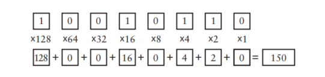  
而10进制转为二进制要复杂一些:  
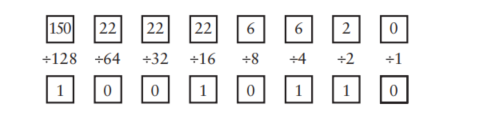  
而两个二进制数字的加法和乘法就变得十分简单, 因为加法表和乘法表只有四个数字.而二进制系统在算术与电子技术之间搭起了一座桥梁.

## 二进制数
二进制系统存在一点特殊性, 在于 __它是人们所能得到的最简单的数字系统__ 在很多时候我们会运用**冗余**来抵消噪声的影响.,同时,信息是多种可能性中的一种,可以被转换成两种或者多种选择的可能性, 都可以用比特来表示,某一位或者一连串比特位所表示的意义通常是和上下文相关.  
比特通常无法直接从日常中观察找到, 而是隐藏在电子设备中.最常见的应该是在商品中的通用产品代码(条形码),它实质上就是一个95bit的二进制数, 其中包含了内置式的检错码,数字的编码都含有奇数个1(奇偶校验)和最后一位模校验字符.  
在用比特表示其他信息的时候我们所需要计算的就是有多少种可能性, 这决定了我们需要的比特位数.

## 逻辑与开关
在传统的代数中, 有一些规则十分顽固,以至于成为任何形式数学运算的基础:
1. 加法和乘法的交换律
2. 加法和乘法也遵循结合律
3. 乘法遵循加法的分配率

在布尔代数中, 操作数不是数字而是类(一个事物的群体,后来被称为集合),在布尔代数中:
1. "$+$" 表示两个集合的并集
2. "$\times$" 表示两个集合的交集

在布尔代数中,交换律\结合律和分配率同样成立, 此外, **加法还可以分配乘法** :  
$\bf{W + (B \times F) = (W +B)\times(W+F)}$  
此外, 布尔代数中还有两个概念十分重要`1`和`0`

* "$+$" 现在可以用 OR 表示
* "$\times$"现在可以用 AND 表示
* "$1 - $" 现在可以用 NOT 表示

布尔代数的一个例子,顾客 想要一只公猫(M),已经绝育的(N),白色(W)或者褐色(T)都可以,或者一只母猫(F),也是要绝育的(N),除了白色(W)任何颜色都可以,或者只要是黑猫都行.写成布尔表达式就是:  
$\bf{(M \times N \times (W+T)) + (F\times N \times(1-W)) + B}$  
一只白色的母猫, 就意味着 F和W为1, 其他为0, 带入上面算的结果为0, 不符合条件.这个过程就是 **将要求写成bool代数式,然后满足的设为1, 其他设为0, 看计算的结果**.这个过程可以用电路表达, AND 就是串联, OR 就是并联, NOT用一个反的开关(默认是联通,满足就断开)表示.  
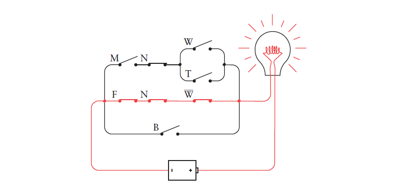

## 门
电子工程师可以用布尔代数的工具去设计开关电路,如果你简化了一个描述网络的布尔表达式,就意味着简化了相应的网络.理论上,只需要四个开关来定义心中的猫咪即可,因为 __每个开关都是一个二进制数,__ 需要一个开关表示猫的性别,一个开关表示是否绝育, 两个开关表示猫的颜色(黑/白/褐和其他颜色).  
继电器像开关一样,可以串联或者并联在电路中执行简单的逻辑任务,这种继电器的组合被称为逻辑门(logic gate),输入不一定是和开关相连,输出也不一定是和灯泡相连, 我们关心的是输入端和输出端的电压,四种逻辑门和两个器件构成了我们的全部工具:
1. 与门:两个继电器都被触发的时候灯泡才会亮,  
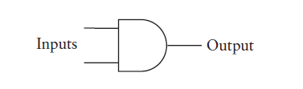
2. 或门: 其中的一端是弯的,像字母'O'一样:  

3. 反向器不是逻辑门,但是用途依旧非常广泛:  
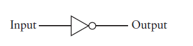
4. 或非门 : 输出的结果与或门刚好相反:  
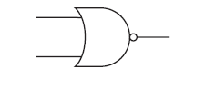 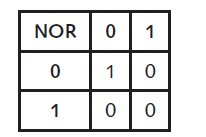
5. 与非门 : 输出的结果和与门刚好相反  
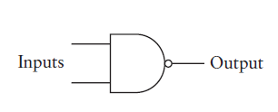 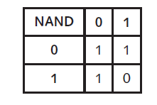
6. 此外还有一种被称为缓冲器  
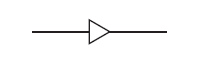

此外, 常用的还有简化布尔表达式常用的 **摩根定律** :  
$ \overline A \times \overline B = \overline{A+B}$   
$ \overline A + \overline B = \overline{A \times B}$   

## 二进制加法器
加法计算是计算机要做唯一的事情, 可以做出加法器, 就会有办法实现减法乘法和除法,而在底层, 加法的实现就类似于一系列开关的操作.  
我们没的加法器中, __加法和进位是分别进行的__:
1. 加和的输出, 是一个或门和一个与非门作为与门的输入实现的  
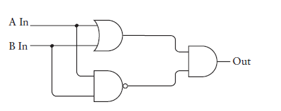 
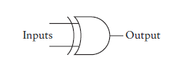
2. 进位的输出只需要一个与门就可一实现,这就得到了一个半加器:  
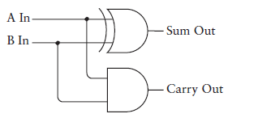 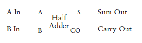
3. 由于进位的存在, 我们需要加三个数, 就相当于将两个半加器连在一起得到一个全加器:  
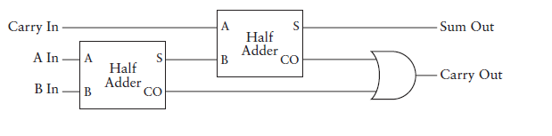
4. 8个全加器全部连起来, 就是一个Byte的加法器,而更多byte的加法器只需要按照这样的需求就可以实现:  
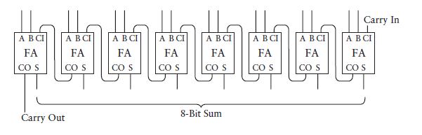

## 如何实现减法
在减法中, 为了不做很多借位的工作, 我们会把 253-176变成 253+(999-176)+1-1000,括号中的做差是不需要借位的.  
如果减数大于被减数,可以将两者反过来,然后给结果加上一个负号,在二进制中, 这个过程会变得更加简单.
1. 我们求某个数对 _9999..._ 的补数时, 需要做各种减法运算, 但是**在二进制中求某个数对 _0b111111..._ 的补数时, 只需要对该数的01反转过来.**
2. 被减数与补数相加
3. 结果再 + 1, 然后减去 _0b100000..._

下免就是上述过程在电路中的实现:
1. 需要一台能做加减法的计算器, 因此有一个信号表示是做加法还是减法:  
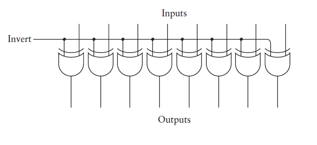  
2. 加一的操作通过最低位的地方实现  
  

这样的话我们就可以得到一个看上去不错的减法器, 目前存在的问题是它不能表示负数.那么,负数将如何表示呢?  
这时候就可以使用2的补码. 以1开头的每个数都表示负数, 
对于bit向量 $\hat{x} =  [x_{w−1}, x_{w−2}, . . . , x{0}]:$   
    $B2T_w(\hat{x}) \doteq -x_{w-1} 2^{w-1} + \sum_{i=0}^{w-2} x_i 2^i$  
这个时候某个正数比如 5(0b00101)相反数的补码, 只需要将所有的bit都翻转, 然后加一(0b11010+1, 0b11011,$-16+8+0+2+1=-5$).
## 反馈与触发器
在前面, 我们所提到的所有事情实际上是静态的, 其状态的改变来源于人为的干预, 但是存在一种振荡器, 在不要要人的干预下能够完全自发地工作.  
  
这样的话输出来的结果就是一个震荡的形式:  
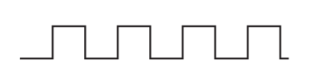  

如果再调节电路的组织形式， 可以组成一个很奇怪的电路， 这时候**在两个开关都断开的时候， 电路有两个稳定的状态，这种被称为是触发器**， 触发器可以保持（记住）信息。最简单的触发器就是R-S触发器， 在R/S 两端都为0的时候。简单来说, 这个电路会有两个稳定的状态, 但是不会长期处在不稳定的中间状态.  
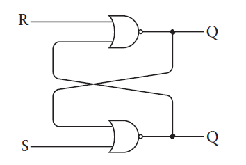 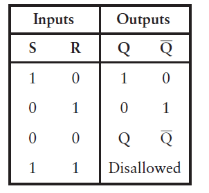  
上面的真值表代表不同输入组合所对应的输出结果, 可以发现, 当 Set/ ReSet 都是0时, 电路可以保持上一次设置的状态. 这突出的优点在于: **它可以记住哪个输入端的最终状态是1**. 
现在想要一个记忆力更强大的电路, 例如能够记住某个特定的时间点上一个信号是0 还是 1.  
// TODO:

## 字节与十六进制
十六进制缺少的6个符号由拉丁字母表示, 从十进制数得到十六进制数的方法也十分简单, 每次除以 16, 商保留下来, 余数则继续作为下次运算的被除数.

## 存储器组织
在之前我们学习了一种触发器, 只要时钟不再设定位 1 , 就认为输出端的数据不再发生变化. 我们在这重新命令, 将时钟输入端命名为写操作端:  
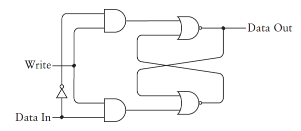  
这时候存进去的数据就好像被锁住了一样,将它抽象成一个只有两个输入一个输出的单元, 然后很正常的想法就是将多个锁存器阻止在一起:  
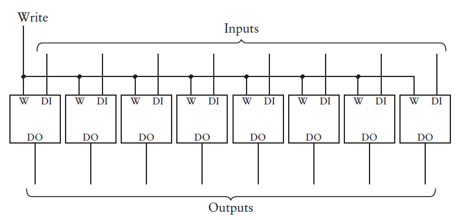  
但是我们存储了8个单独的比特后, 很多情况下不能够有实际的 8 位输出,例如我们只有一个灯泡, 这时候我们需要一个  8-Line-to-1-Line Data Selector. 它的功能十分简单, 通过三个 bit 的选择数据让最后的输出和存储的 8 个 bit 中的某一位相同, 
## 定点数和浮点数
数字计算机对连续数据无能为力, 数字计算机只处理离散(discrete)数据. 但是小数依旧可以表示为二进制数,最简单的方式可能就是BCD(二进制编码的十进制数), 0~9 之间的每一个数字需要用4个Bit, 两个BCD数字存放在一个字节, 如在处理美元和美分的表示的钱款账户时这些东西特别合适, 这种情况下**小数点的位置总是在某个特定的位置, 因此被称为是 定点格式**(fixed-point format). 在表示非常大或者非常小的数时, 使用定点格式是绝对不合适的.  
这时候科学家和工程师往往会使用科学记数法, 在计算机中, 除了定点格式外还有另外一种选择, 被称为浮点格式(floating-point notation). 在科学记数法的规范化表示中, 第一位是大于等于1而且小于10的, 二进制中大于等于1小于等于2(二进制的10), 因此这位只能是1, 当代大部分计算机程序处理浮点数的时候都是遵循IEEE的标准, 浮点数有两种基本的格式 4 byte和8byte(双精度).  
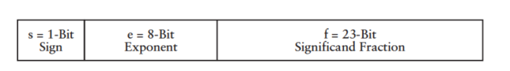  
指数部分的取值为 0~255, 称为偏移指数, 实际代表的数字要减去偏移量(单精度是减去127):
$$
(-1)^s \times 1.f \times 2^{e-127}
$$
其中的s为标志位的取值, $1.f$ 表示的是小数点后跟着23位有效数, 那么如何表示 `0f` ?   