# 操作系统(RISC-V ed) 清华大学 [Spring 2020](http://os.cs.tsinghua.edu.cn/oscourse/OS2020spring)
<font size = 4> 向勇 & 陈渝 </font>

## 第 1 讲：操作系统概述
预备知识:   
* 程序设计语言（汇编、C 和 Rust(语言级别的并发和同步)）
* 数据结构 
* 计算机组成原理(Pttterson的RISC-V)
* 编译原理(影响不大)

推荐参考书:   
* 操作系统:三大简易元素
* 操作系统概念
* 操作系统:精髓与设计原理

教学内容: 主要与操作系统的内核有关,实验使用QEMU模拟器写一个教学操作系统   
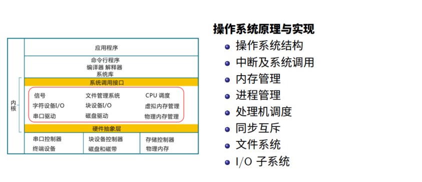   

### 什么是操作系统
* 没有公认的定义, 从wiki看,操作系统是管理硬件资源、控制程序运行、改善人机界面和为应用软件提供支持的一种系统软件.   
    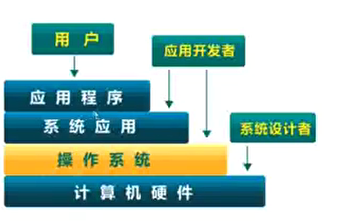   
* 操作系统是一个控制程序
    * 一个系统软件,控制程序执行过程, 防止错误
    * 执行用户程序, 给程序提供服务,方便用户使用计算机系统
* 操作系统是一个资源管理程序
    * 应用程序与硬件之间的中间层,管理各种软硬件资源
    * 提供访问软硬件资源的高效手段,解决访问冲突, 确保公平使用

   
实际上, 操作系统就是一种抽象, 将CPU抽象成了进程...:   
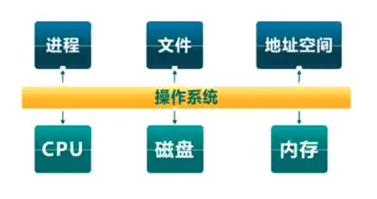   
内核的特征:   
* 并发：计算机系统中同时存在多个运行程序
* 共享：程序间**同时**访问互斥共享各种资源(CPU一段时间给这个进程,一段时间给另一个,而内存则是不同段内存分给了不同的进程,他们的共享方式是不一样的)
* 虚拟：每个程序**看上去独占**一个完整的计算机(内存和磁盘都有这个问题, 看上去独立, 实际上是共享的)
* 异步：服务的完成时间不确定，也可能失败(不能用时钟去数运行了多久)

<font size=4 > 为什么学习操作系统</font>
它是一门综合的课程, 同时在计算机科学中一个基础的部分.操作系统中的关键问题:   
* 操作系统管理并发
* 操作系统代码必须是高效的, 低耗能，安全可靠

学习操作系统需要具有系统思维:   
* 操作系统并不仅仅是琐碎的调度算法
* 并发性是操作系统的一小部分内容
* 权衡资源 软硬协同

### 操作系统历史
操作系统的发展随着硬件共同演化: 
* 单用户系统: 装载器 (loader)+ 程序库 (libraries)
* 批处理系统: 装载器 (loader)+ 程序控制器 (sequencer)+ 输出处理器 (output processor)
* 多道程序系统 : 装载器 + 程序调度 + 内存管理 + 输出管理
* 分时系统: 装载器 + 程序调度 + 内存管理 + 中断处理 +...
* 个人计算机: 走向大众，老的服务和功能不存在，越来越多的安全问题
* 分布式系统: 分布式(装载器 + 程序/OS 调度 + 内存管理),重要的是:重点是网络/存储/计算的效率
* AIoT 系统: 走向设备，走向网络，新的挑战 (不可靠/大数据)

### 操作系统结构
1. 简单结构 : 在这种结构下, __常驻系统程序就是操作系统__,它在最小的空间, 设计用于提供大部分功能,没有拆分为模块,主要用汇编编写,没有安全保护.   
    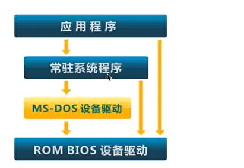   
2. 单体分层结构:到了Unix/Linux系统, 就出现了.将单体操作系统 (Monolithic OS) 划分为多层 (levels): 
    * 每层建立在低层之上
    * 最底层(layer 0),是硬件驱动 最高层(layer N)是用户界面
    * 每一层仅使用更低一层的功能和服务   
    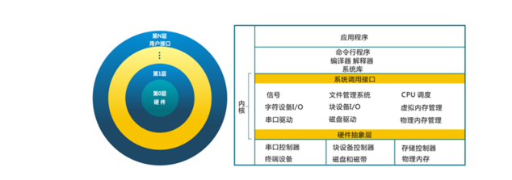
3. 微内核结构: 
    * 尽可能把内核功能移到用户空间
    * 用户模块间的通信使用消息传递
    * 优点: 灵活/安全  缺点: 性能
4. 外核结构:把资源保护和资源隔离再分开, 让内核分配机器的物理资源给多个应用程序, 并让每个程序决定如何处理这些资源,操作系统的功能变成了库的一部分(LibKernel)
5. 虚拟机结构 VMM : 拟机管理器将单独的机器接口转换成很多的虚拟机, 每个虚拟机都是一个原
始计算机系统的有效副本, 并能完成所有的处理器指令。

## 第 2 讲：操作系统与系统结构和程序设计语言
### 从 OS 角度看计算机系统
有了操作系统, 机器能够同时运行多个程序, 就需要系统层面能做好 **隔离**,只要的支持技术是**虚拟内存**和**中断**.
* 强制隔离以避免对整个系统的可用性/可靠性/安全影响
* 运行的程序通常是是隔离的单元
* 防止程序 X 破坏或监视程序 Y, 防止进程干扰操作系统,错误的过程可能会试图欺骗硬件或内核

<font size=4> 主要的隔离方法</font>
1. 地址空间 (虚拟内存)
    * 程序只允许访问自己的内存
    * 每个程序如果没有许可, 则不允许访问不属于自己的内存
2. CPU 硬件中的特权模式/中断机制(硬件支持不同的特权模式, 内核模式VS用户模式)
    * 防止应用程序访问设备和敏感的 CPU 寄存器
    * 中断是异步发生，是来自处理器外部的 I/O 设备的信号的结果,硬件中断的异常处理程序通常称为中断处理程序(interrupt handle):
        * I/O设备通过向处理器芯片的一个引脚发信号，并将异常号放到系统总线上，以 触发中断；
        * 在当前指令执行完后，处理器从系统总线读取异常号，保存现场，切换到Kernel Mode；
        * 调用中断处理程序，当中断处理程序完成后，它将控制返回给下一条本来要执行 的指令。

### 从 OS 角度看 RISC-V CPU
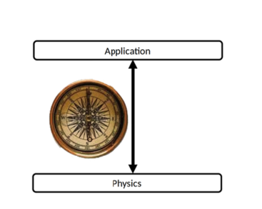 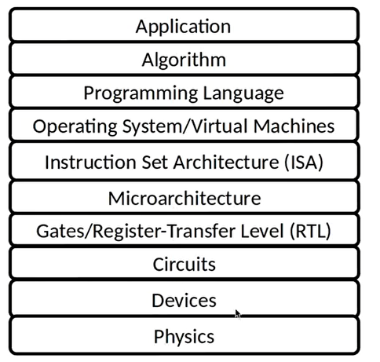   

<font size=4> RISC-V 中断机制: </font>
也可由高特权模式下的软件授权低特权模式软件处理中断.

### Rust 语言与系统编程
**系统编程语言**:用于构建控制底层计算机硬件的软件系统，并提供由用于构建应用程序和服务的更高级应用程序编程语言使用的软件平台。

Rust的主要特性:
* 内存 + 线程安全(同步互斥/锁 容易出错, 这有语言上的支持)
* 高级语言特性
* 成熟的工具链
* 友好的助教 + 社区（OS 示例代码 + 文档）生态
* 学习 Rust 的入门门槛比较高, 在实验中对减少 bug 有好处

```Rust
fn sum_to(n:i32)->i32{
    let mut acc = 0;
    for i in 0..n{
        acc += i;
    }
    return acc
}
```

为了支持混合编程, 我们最好遵循下面这种约定:

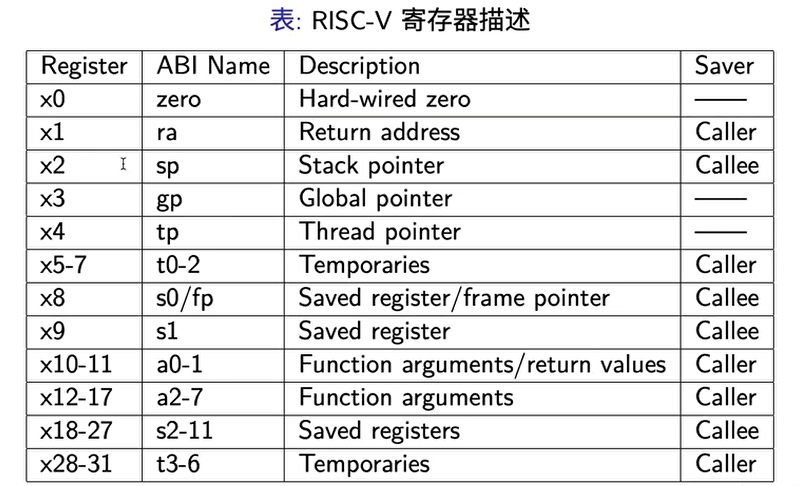

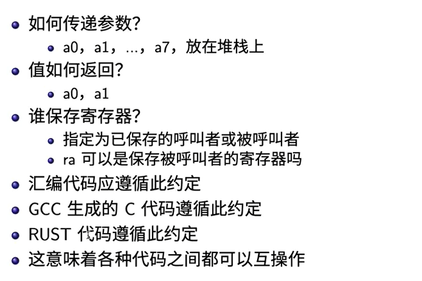

想理解函数调用需要理解函数调用栈, 通过回溯栈理解函数调用关系. 

### RISC-V CPU 启动
需要从 QEMU 模拟器中看相关的信息, RISC-V CPU 启动过程:
1. 初始化 CPU/寄存器
   
   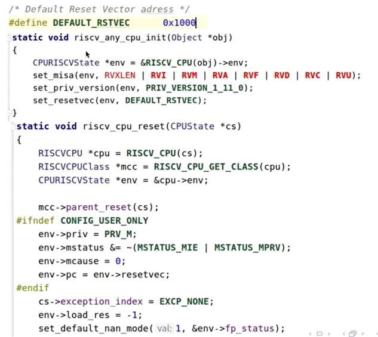
2. 初始化内存
   
   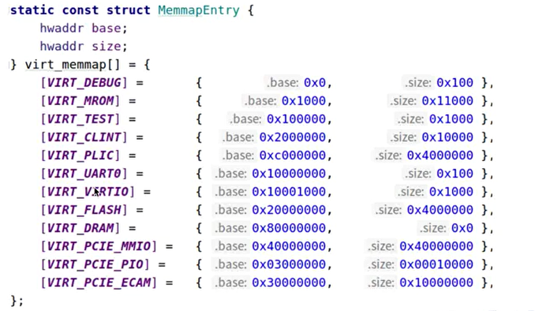
3. 初始化基本外设
   
   
4. 执行 ROM 中固化的代码(指定我们写的第一条指令的位置)
   
   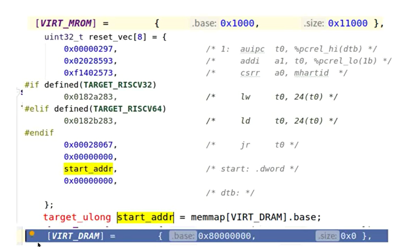
   
## 第 3 讲 : 中断, 异常 和 系统调用
### 基本概念与原理
**系统调用**(System Call): 应用程序 **主动** 向操作系统发出的服务请求. (和函数调用之间一个很大的区别是应用程序跑在用户态, 而操作系统跑在内核态).

异常(exception): 非法指令或者其他原因导致 **当前指令执行失败**(如内存出错) 后的处理请求. (也可能在操作系统中出现, 此时可能导致整个系统崩溃)

中断: 来自硬件设备(外设/device) 的处理请求. 

三者都是由操作系统进行统一的管理, 为什么需要中断/异常和系统调用:
* OS 内核是被信任的第三方
* OS 内核可以执行特权指令, 管理硬件
* OS 内核提供了各种 Service

如果没有中断, CPU 需要不停地去查询外设的状态. 异常希望解决当应用处理意想不到的行为, 系统调用是提供一系列的服务, 使得应用程序可以简单完成很多很重要的额功能. 

响应方式
* 中断: 异步(什么时候打断我们并不知道)
* 异常: 同步
* 系统调用: 异步或同步

处理机制:
* 中断: 持续, 对应用程序透明(应用程序看不到中断)
* 异常: 杀死或者中心执行
* 系统调用: 等待和持续

### 硬件架构支持
RISC-V FU540 手册上可以看到, 它有两个层次的中断处理机制:
* Core Local Interruptor(CLINT)
* Platform-Level Interrupt Controller(PLIC)

三种中断源:
* 软件中断通过内存映射寄存器中存数来除法
* 时钟中断 
* 由平台级中断控制器引发外部中断(可以由各种各样的外设产生)

### 中断处理机制
#### OverView
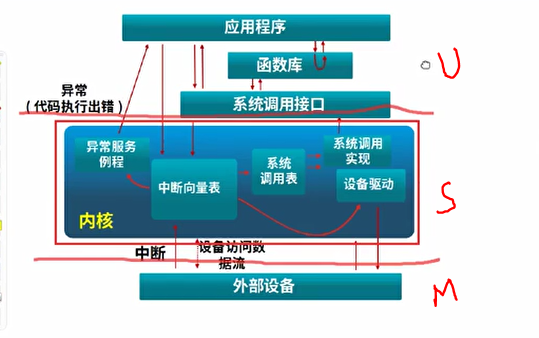

OS 运行在 S 态, 用户应用程序运行在 U 态,建立中断机制:
* 建立中断服务例程
* 让 CPU 能够响应中断(对控制状态寄存器进行相应的设置)
* 响应并处理中断
* 保存/恢复现场

#### Details
建立中断机制:
* 让 CPU 能响应中断
  * sstatus: 保存全局中断使能位
  * sie: 指出 CPU 目前能处理或者忽略的中断
  * stvec: 中断入口地址(一旦产生中断, CPU 跳到那个地方去执行)
* 例如一个timer 中断
  * 初始化: 设置 sie的 TI 使能 STIE 位
  * 初始化: 设置 sstatus 的使能中断 SIE 位
  * 初始化: 实现中断服务的总控函数
  * 初始化: 设置 stvec 指向中断服务总控函数的入口地址

怎样建立中断服务例程? 
* 初始化: 设置时钟中断触发次数
* 初始化: 设置 sie 的 TI 使能 STIE 位
* 服务例程: 调用 OpenSBI 提供的接口设置下次时钟中断触发时间

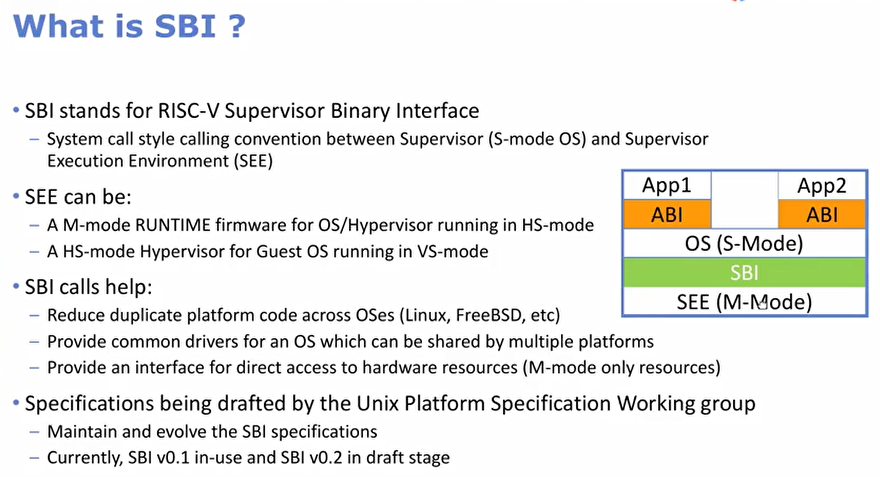

在这种架构下, OS 并没有直接控制硬件, 使得 OS 可以更加简化. 

怎样保存/恢复现场:
* 还需要为被中断的程序保存和恢复当时程序运行时的上下文:
* SAVE_ALL 寄存器
  * x[0-31]: 通用寄存器
  * sstatus: 系统状态(当前 enable/disable)
  * spec: 除法异常/中断的指令地址
  * scause: 指示发生异常/中断的种类
  * stval: 保存了发生异常/中断的附加信息

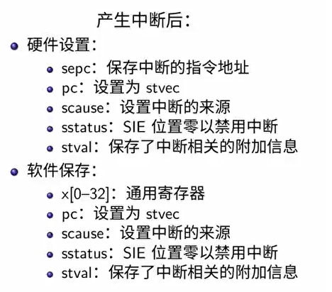

总的而言, 就是下面五个过程:
* 硬件设置
* 软件保存被打断的现场
* 执行软件实现的中断服务例程
* 软件恢复被打断的现场
* 继续执行

中断服务例程也可能被打断
* 不同硬件中断源可能在硬件中断处理时出现
* 中断请求会保持到 CPU 做出响应
* 硬件中断服务例程中要临时禁止中断请求

### 系统调用
操作系统服务的应用编程接口
* 通常由高级语言编写
* 程序通常访问高层次的 API 接口

系统调用
* RISC-V 中, ecall 和 sret 用于系统调用
* 堆栈切换和特权级的转换(隔离的需要)

函数调用
* RISC-V 中, call 和 ret 指令用于函数调用
* 无堆栈切换和特权级的转换

系统调用的开销超过函数调用:
* 切换内核堆栈
* 验证参数
* 可能切换页表
* 需要拷贝数据(不能简单传指针)

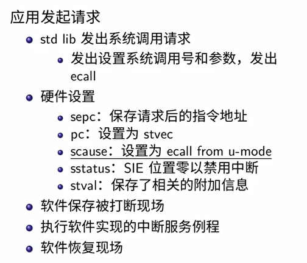

## 第四讲: 物理内存管理与连续内存分配
### 计算机体系结构/内存层次
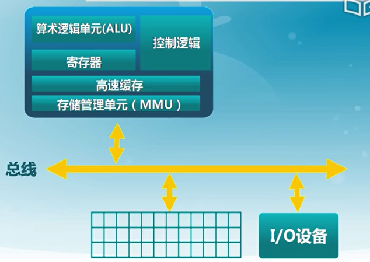

做操作系统的管理的时候需要准确地理解对应体系结构的存储情况,从层次结构上看, 不同层次的内存访问速度差别非常大:

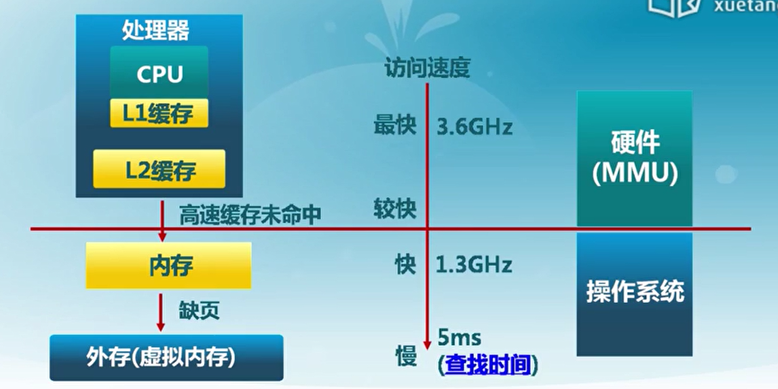

存储管理单元将逻辑的虚拟地址空间转换成为物理地址空间:
* 抽象: 逻辑地址空间
* 保护: 独立地址空间
* 共享: 访问相同内存(如内核)
* 虚拟化: 更大的地址空间

操作系统中采用的内存管理方式:
* 重定位: 段地址加偏移量
* 分段: 逻辑结构不是必须连成一块的
* 分页: 将内存分成最基本的单位
* 虚拟存储
  * 目前多数系统(如 linux) 采用按需页式虚拟存储

### 地址空间和地址生成
* 物理地址空间 -- 硬件支持的地址空间
    * 起始地址0, 直到 $MAX_{sys}$
* 逻辑地址空间 -- 在 CPU 运行的进程看到的地址
    * 起始地址是0, 直到 $MAX_{prog}$

后面我们一直会遇到的问题就是逻辑地址和物理地址是什么, 它们的转换关系是怎样的.

#### 逻辑地址生成和检查
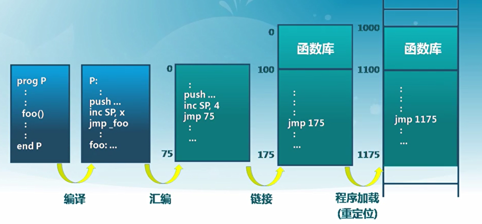

地址生成实际和限制
* 编译时
  * 假设其实地址已知
  * 如果起始地址改变, 必须重新编译
* 加载时
  * 如果编译时其实位置未知, 编译器需要生成可重定位的代码(relocatable code)
  * 加载时, 生成绝对地址
* 执行时
  * 执行时代码可移动
  * 需要地址转换(映射)硬件支持

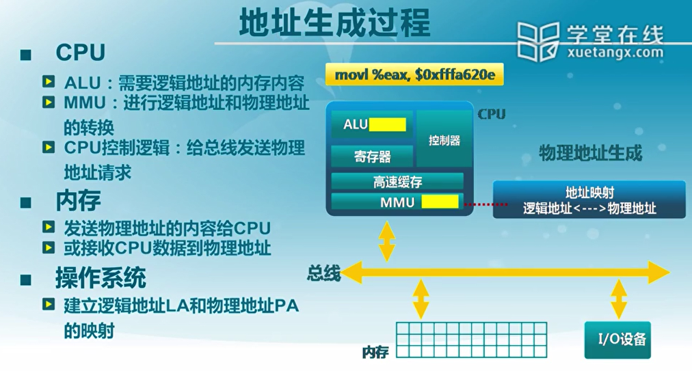

此外还要有地址检查:

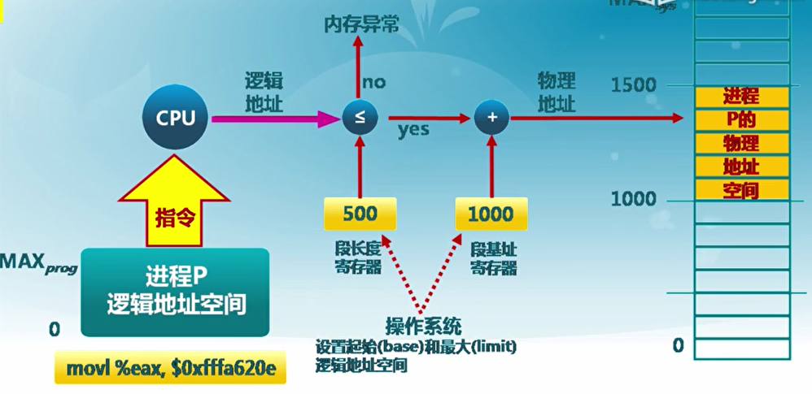

### 连续内存分配
计算机体系结构/内存层次
* 给进程分配一块不小于指定大小的连续物理内存区域  
  
内存碎片:
* 空闲内存不能被利用
<div align=center></div>

* 外碎片
  * 分配单元之间的未被使用内存
* 内碎片
  * 分配单元内部的未被使用内存
  * 取决于分配单元的大小是否需要取整(如想要 510 字节, 而系统只能给 512 字节)

#### 动态分区分配
* 当程序被加载执行时, 分配一个进程指定大小可变的分区(块/内存块)
* 分区地址是连续的

操作系统需要维护两个数据结构
* 当前进程的已分配分区
* 空闲分区

动态分区的分配策略
* 最先匹配(分配 N 个字节, 使用第一个可用空间比 N 大的空闲块)
  * 优点: 简单/在高地址空间有大块的空闲分区
  * 缺点: 外部碎片, 分配大块时比较慢
* 最佳匹配(分配 N 个字节, 查找并使用不小于 N 的最小空闲块)
  * 实现: 空闲分区列表按照大小排序, 分配时查找一个合适的分区, 释放时查找并且合并临近的空闲分区(地址临近, 而非在列表中临近)
  * 优点: 大部分匹配的尺寸较小时,效果很好
    * 可避免大的空闲分区被拆分
    * 可减小外部碎片的大小
    * 相对简单
  * 缺点: 外部碎片很多, 释放分区较慢, 容易产生很多无用的小碎片
* 最差匹配(分配 N 个字节, 查找并使用不小于 N 的最大空闲块)
  * 空闲分区由大到小排列, 分配时选择最大分区, 释放时需要检查是否可以合并, 并调整分区列表的顺序
  * 优点: 中等大小的分配较多时, 效果最好, 可以避免出现太多的小碎片
  * 缺点: 释放分区缓慢/外部碎片/ 容易破坏大的空闲分区,因此以后难以分配大的分区

#### 碎片整理
碎片整理: 通过调整进程占用的分区位置, 来减少或避免分区碎片.  
碎片紧凑 
* 通过移动分配给进程的分区位置, 以合并外部碎片.  
* 碎片紧凑条件: 所有的应用程序可以动态重定位
* 需要解决的问题:
  * 什么时候移动: 一般是等待时
  * 开销? 

分区对换(swapping in/out)
* 通过抢占并回收出于等待状态进程的分区, 以增大可用的内存空间
<div align=center></div>
swapping 名称的由来:
<div align=center></div>

### 伙伴系统
* 整个可分配分区大小为 $2^U$
* 需要的分区大小为 $ 2^{U-1} < s \leq 2^U$ 时, 整个块分配给该进程
  * 如果 $s \leq 2^{i-1}$ 将大小为 $2^i$ 的当前空闲分区划分为两个大小为 $2^{i-1}$ 的空闲分区
  * 重复划分过程, 直到 $2^{i-1} < s \leq 2^{i}$, 并把一个空闲分区分配给该进程

#### 伙伴系统的实现
数据结构:
* 空闲块按大小和起始地址组织成二维数组
* 初始状态只有一个大小 为 $2^U$ 的空闲块

分配过程:
* 由小到大在空闲块数组中找到最小的可用空闲块 
* 入股空闲块过大, 对可用空闲块进行二等分, 直到得到核实的可用空闲块

释放过程:
* 把释放的块放入空闲块数组
* 合并满足合并条件地空闲块
  * 大小相同 $2^i$
  * 地址相邻
  * 低地址的空闲块起始地址必须是 $2^{i+1}$ 的倍数

<div align=center></div>

### Slab 分配器
rCore 中的物理内存管理接口如下:
<div align=center></div>

如果前面我们介绍了伙伴系统, 其最小的单元可能是一个页面(4K), 而如果需要分配更小的内存, 使用伙伴系统就会有很大的浪费. 我们使用 Slab 分配器, 充当中间商, 从页分配器器获得资源, 充当一个中间商. 
<div align=center></div>

SLAB 分配器源于 Solaris 2.4 的分配算法, 工作于内存的物理页分配算法之上, **管理特定大小对象的缓存**, 进行快速高效的物理内存分配, 其引入想解决下列问题:
* 内核对象远小于页的大小
* 内核对象会被频繁地申请和释放
* 内核对象初始化时间超过分配和释放内存的总时间

<div align=center></div>

其基本的特征如下:
* 为每种使用的内核对象建立单独的缓存区
* 按对象大小分组
* 有两种 SLAB 对象状态: 已分配或空闲
* 三类缓存区队列: Full/Partial/Empty
* 优先从 partial 队列中分配对象
* 缓存区为每个处理器维护一个本地缓存(避免锁的问题)

<div align=center></div>

#### CPU 缓存着色与 SLAB
<div align=center></div>

#### SLAB 的数据结构
<div align=center></div>

<div align=center></div>

#### SLOB 的数据结构
针对嵌入式系统 SLAB 的简化版本
* 没有本地 CPU 高速缓存和本地节点的概念
* 只存在三哥全局 partial free 链表
* 链表按照对象大小划分

<div align=center></div>

#### SLUB 分配器
目标
* 简化设计理念
思路
* 简化SLAB 的结构：取消了大量的队列和相关开销
* 一个SLAB 是一组一个或多个页面，封装了固定大小的对象，内部没有元数据
* 将元数据存储在页面相关的页结构
* 没有单独的Empty SLAB 队列

<div align=center></div>
<div align=center></div>

## 第 5 讲: 物理内存管理 非连续内存分配
### 需求背景
连续分配的缺点:
* 分配给程序员的内存地址必须连续
* 存在外碎片和内碎片
* 内存分配的动态修改困难
* 内存利用率比较低

非连续内存分配的设计目标:**提高内存利用效率** & **管理灵活性**.
* 允许一个程序使用非连续地物理地址空间
* 允许共享代码与数据
* 支持动态加载和动态链接

需要解决的问题:
* 虚拟地址和物理地址的转换
  * 软件实现: 灵活, 开销大
  * 硬件实现: 够用, 开销小
* 非连续分配的硬件辅助机制
  * 如何选择非连续分配中的内存分块大小
    * 段式存储管理(segmentation)
    * 页式存储管理(paging)
  
### 段式存储管理
进程的段地址空间可以看成由多个段组成:
* 主代码段
* 子模块代码段
* 公用库代码段
* ...

这样就可以用**更细粒度和灵活**的方式分离与共享.
<div align=center></div>

#### 段的访问机制
段的概念
* 段表示访问方式和存储数据等属性相同的一段地址空间
* 对应一个连续地内存 "块"
* 若干个段组成进程逻辑地址空间

段访问: 逻辑地址由二元组表示
* s - 段号
* addr - 段内偏移
<div align=center></div>

段访问的硬件实现:
<div align=center></div>

### 页式存储管理
* 页帧(Frame,物理页面)
  * 把物理地址空间划分为大小相同的基本分配单位
  * 2 的 n 次方  
* 页面(page, 逻辑页面)
  * 把逻辑地址空间也划分为相同大小的基本分配单位
  * 帧和页的大小必须是相同的
* 页面到页帧之间转换
  * 页表
  * MMU/TLB

#### Frame
物理内存被划分成大小相同的帧, 地址使用二元组(f,o) 表示
* f - 帧号, F 位的话共有 $2^F$ 个帧
* o - 偏移量, S 位表示每帧有 $2^S$ 个字节

于是物理地址 $ = f \times 2^s + o$

#### Page
进程的逻辑地址空间被划分称为大小相等的页
* 页内偏移 = 帧内偏移
* 通常情况下 页号大小 $\neq$ 帧号大小

进程的逻辑地址也是用二元组(p,o) 表示

#### 地址映射
* 逻辑地址中的页号是连续的
* 物理地址中的帧号是不连续的
* 不是所有的页都有对应的帧

#### 页表
页表保存了逻辑地址 - 物理地址之间的映射关系. 
<div align=center></div>

### 页表
#### 结构
每个进程都有一个页表
* 每个也变对应一个也表项
* 随着进程运行状态而动态变化
* 叶表基址寄存器(Page Table Base Register, PTBR)
  <div align=center></div>

#### 页式存储管理机制的问题
* 内存访问性能问题
  * 访问一个内存需要两次内存访问
    * 第一次访问:获取页表项
    * 第二次访问: 访问数据 
* 页表大小问题
  * 页表可能非常大

解决的两种做法:
* 缓存(快表)
* 间接访问(多级页表)

### 快表和多级页表
快表(Translation Look-aside Buffer, TLB), 缓存近期访问的页表项
* TLB 使用关联存储实现, 具备快速访问性能
* 如果 TLB 命中, 物理页号可以很快被获取
* 如果 TLB 不命中, 对应的表项可被更新到 TLB 中

<div align=center></div>

多级页表: 通过间接引用将页号分成 K 级:
* 建立页表树
* 减小每一级页表的长度
<div align=center></div>
<div align=center></div>

### RISC-V 的页映射机制
RISC-V 对页表的硬件支持
* 64 的 Sv39 虚地址与物理地址(虚地址比物理地址短)
  <div align=center></div>

* 页表基址(放在 stap 寄存器中)
<div align=center></div>
<div align=center></div>
<div align=center></div>

#### RISC-V 地址转换
* Sv32 in RV32
  * 当在satp 寄存器中启用了分页时, 虚拟地址
映射启动。
  * 1. satp.PPN 给出一级页表基址,VA[31:22] VPN[1] 给出一级页号,CPU 会读取位于地址
(satp. PPN × 4096 + VA[31: 22] × 4) 的页表项。
  * 2. 该PTE 包含二级页表的基址,VA[21:12]给出二级页号,CPU 读取位于地址(PTE.PPN × 4096 + VA[21: 12] × 4) 的叶节点页表项。
  * 1. 叶节点页表项的PPN 字段和页内偏移(原始虚址的最低12 个有效位) 组成了最终结果: 物理地址就是(LeafPTE. PPN × 4096+ VA[11: 0])
  
### 使能 RISC-V 页表
<div align=center></div>

页表也是放在内存中, 于是 OS 配置页表的流程如下:
* 为页表分配物理内存
* 确定映射的物理空间与虚拟空间
* 创建页表
* 设置satp, 刷新TLB，使能页表