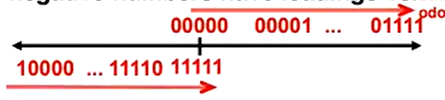
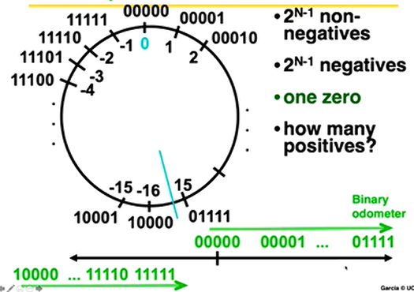

# CS61C: Great Ideas in Computer Archicture

## Lecture 1: Cource Introduction
**计算机体系结构的六大思想**
1. 抽象
2. 摩尔定律
3. 局部性原则/内存层次结构
4. 并行(Amdahl's Law)
5. 性能测量&提升
6. 通过冗余提高可靠性

为什么现在体系结构还是 Exciting? 
* 部署的设备数量一直在增加, 但是没有单个 killer App, 这意味着有不同的需求和体系结构
* Clock Cycle 和 Thermal Design 增长变平了

## Lecture 2: 数字表示
#### Data Input : Analog `->` Digital
为了导入模拟信号, 我们必须做两个事情:
* 采样
* 量化

#### Big Idea: Bit 可以表示任何事情
* 字符?
  * 26个字母需要 5 Bit
  * 7 Bit(in 8) 的 ASCII, 16 32 的 Unicode
* 逻辑值 1 Bit
* **N Bit 可以表示最多 $2^N$ 个东西**

几种常见的进制 2,10, 16.从十进制转为其他进制的时候, 可以理解成用不同大小的盒子装东西, 先用最大的盒子, 然后依次递减. 

负数表示:
1. One's Complement(正数保持不变, 负数翻转):
    
2. Two's Complement(翻转后再加一)
    
3. Bias 编码 : 数字代表的值 = Signed + bias(例如-15)
 
