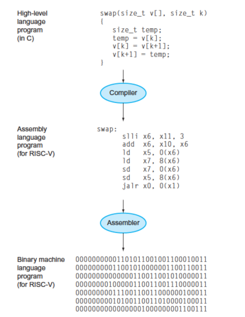
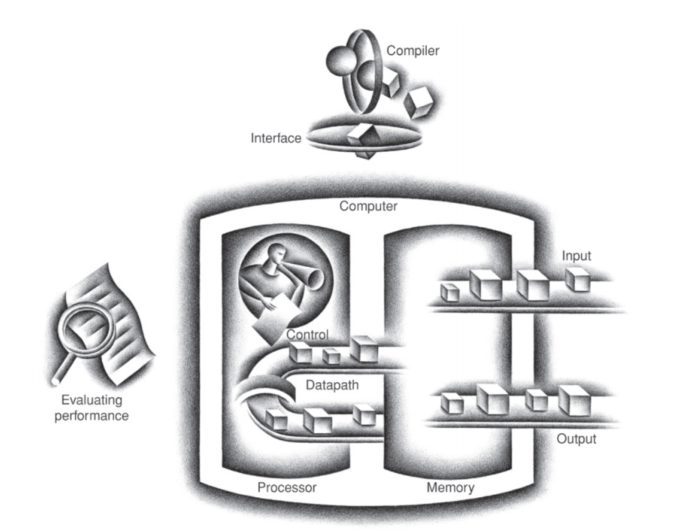

# Computer Organization and Design: the Hardware/Software Interface
<font size=4> [David A. Patterson](https://www2.eecs.berkeley.edu/Faculty/Homepages/patterson.html) and [John L. Hennessy ](https://web.stanford.edu/~hennessy/) </font>

## Chap 1: 计算机抽象和技术
### Introduction
#### 传统的计算机分类和应用
PCs: 对单用户在低价区间提供良好的性能, 通常运行第三方软件.<br>
服务器: 执行大负载任务, 一般要求更强的**可靠性**.<br>
嵌入式计算机:目标是运行单一应用程序或者一组相关的应用程序, 一般对于故障的容忍度低.<br>

### 计算机体系结构中的八大伟大思想
#### Design for Moore's Law
计算机设计者面临的一个永恒的问题就是摩尔定律驱动的快速变化, 他们必须预测其完成时候的工艺水平,而不是用设计开始时候的.

#### 使用抽象简化设计
提高软件硬件生产能力的一个major technique 就是使用抽象来表示不同的设计层次, 在高的层次上只能看到底层低的简化模型, 而细节被隐藏起来了.

#### 加速common 的事件
加速大概率事件意味着你需要知道大概率事件是什么, 这需要仔细的实验和测量评估.

#### 通过并行提高性能
从计算机诞生开始, 计算机的设计者就通过并行执行操作来提高性能. 

#### 通过流水线提高性能
在计算机体系结构中一个特别的并行场景就是流水线.

#### 通过预测来提高性能
执行错误的恢复代价不高而且预测相对准确的时候, 可以用猜测的方式提前开始某些操作.

#### 存储器层次
程序员想要更快/更大/更便宜的内存, 设计师们发现通过存储器的层次结构来解决这些相互矛盾的需求.

#### 通过冗余提高可靠性
任何一个人物理器件都可能失效, 因此可以使用冗余部件的方式来提高系统的可靠性.**冗余部分可以替代失效部分并且帮助检测错误.**

### 程序的背后
系统软接位于应用软件和硬件之间, 两种系统软件对于现代计算机来说是必须的: 
* **操作系统** 是用户程序和硬件之间的接口, 为用户提供各种服务和监控功能.
    1. 处理基本的输入输出操作
    2. 分配storage and memory
    3. 为多个应用程序同时提供受保护的共享的计算机资源服务
* **编译器** 将高级语言翻译成计算机所能识别的机器语言程序.

#### 从高级语言到硬件语言
计算机服从于我们的指令(instruction,能被计算机识别并执行的位串，可以将其视为数).<br>
后来程序员发明了一种被称为汇编器(assembler)的软件, 将symbolic版本的程序(汇编语言写成)翻译成binary版本, 如`add A,B` 被翻译成`1000110010100000`,而机器可以理解的二进制语言是机器语言. 汇编语言的程序效率依旧比较低下, 后来人们创造了高级程序设计语言.<br>
<br>
高级程序设计语言的使用带来了很多好处, 包括
* 用更像自然语言的方式思考, 同时可以为特定的应用设计语言
* 提高了程序生产效率

### Under the Covers
任何一个计算机的基础硬件目标都是完成相同的基本功能: **输入数据、输出数据 处理数据 和 存储数据**.于是计算机的主要部分分别为input, output, memory,datapath(也叫运算器), and control.<br>
<br>
#### 显示器
图像由像素矩阵组成，可以表示成二进制位的矩阵，称为位图 (bit map).计算机硬件采用光栅刷新缓冲区（又称为帧缓冲区）来保存位图以支持图像, 要显示的图像保存在帧缓冲区中，每个像素的二进制值以刷新频率读出到显示设备。

#### Opening the Box
处理器从逻辑上包括两个主要部件：**数据通路和控制器**．数据通路 (datapath)负责完 成算术运算 ，控制器 (control) 负责指导数据通路、存储器和 IO 设备按照程序的指令正确执行.<br>
内存(memo­ry,由动态随机访问存储器(DRAM)组成)是程序运行时的存储空间，它同时也用于保存程序运行时所使用的数据.<br>
在处理器内部有另一种存储器, 被称为**缓存(chche)**,它采用的是另一种被称为SRAM(静态随机访问存储器)的存储技术，速度更快而且不那么密集,SRAM 和 DRAM 是存储器层次中的两层。<br>
抽象层次中的一个关键接口是指令集体系结构(ISA) 一 硬件和底层软件之间的接口。

#### 数据安全
计算机中的内存是易失性存储器(volatile memory),而在存储器层次中它的下一层是非易失性存储器(nonvolatile memory, 也叫secondary memory), 在过去的计算机中它可能是磁盘,而在ipad等设备中使用非易失性半导体存储器,闪存 (flash memory).

#### 与其他计算机通信
* 局域网(local area network, LAN)：一种在一定地理区域（例如在同一栋大楼内）使用的传输数据的网络。
* 广域网(wide area network, WAN)：一种可将区域扩展到几百千米范围的网络。

### 处理器和存储器制造技术
晶体管(transistor) 仅仅是一种受电流控制的开关。 集成电路 (IC) 是由成千上万个晶体管组成的芯片, 它的制造是从硅锭(silicon crystal ingot),经切片机切成厚度不超过 0.1 英寸的晶圆 (wafer)。圆晶经过一系列化学加工过程最终产生之前所讨论的晶体管、导体和绝缘体。晶圆中或是在图样化的几十个步骤中出现一个细微的瑕疵就会使其附近的电路损坏，这些瑕疵 (defect) 使得制成一个完美的晶圆几乎是不可能的。 通过切分，可以只淘汰那些有瑕疵的芯片(chip).合格芯片要连接到 1/0 引脚上，这一过程称为封装。在封装之后，必须进行最后一次测试，因为封装过程也可能出错。最后芯片被交付给用户。

### 性能
* 响应时间：也叫执行时间 (execution time) , 是计算机完成某任务所需的总时间，包括硬盘访问 、内存访问 、 I/O 活动、操作系统开销和 CPU 执行时间等。
* 吞吐率：也叫带宽 (bandwidth), 性能的另一种度量参数，表示单位时间内完成的任务数量。

#### 性能的度量
时间来度量计算机的性能，那么完成同样的计算任务，需要时间最少的计算机是最快的。 
* 墙上时钟时间: 完成任务所需的总时间，包括了硬盘访问、内存访问、 I/O 操作和操作系统开销等一切时间。
* CPU 执行时间 (CPU executiontime) , 简称 CPU 时间，它只表示在 CPU 上花费的时间，而不包括等待 I/O 或运行其他程序的时间。

**要改进一个程序的性能，必须明确性能的定义，然后通过测量程序执行时间来寻找可能的性能瓶颈**。

#### CPU 性能及其因素
$$
\begin{aligned}
一个程序的CPU 执行时间 &=& 程序的CPU时钟周期数 \times 时钟周期时间 \\
一个程序的CPU 执行时间 &=& 程序的CPU时钟周期数 / 时钟频率
\end{aligned}
$$

#### 指令的性能
$$
CPU时钟周期数 = 程序的指令数 \times 每条指令的平均时钟周期(CPI)
$$

#### 经典性能公式
在前面两者的基础上, 我们可以得到经典CPU性能公式,它特别有用，因为它们把性能分解为三个关键因素。
$$
\begin{aligned}
CPU时间 &=& 指令数 \times &CPI \times 时钟周期时间\\
CPU时间 &=& 指令数 \times &CPI / 时钟频率
\end{aligned}
$$
一般而言, CPI和总的指令数相对于CPU时间和clock rate是难以获得的, 而指令数量取决于指令集架构(ISA)而不是其实现(微结构),我们可以在不知道计算机全部实现细节的情况下对指令数进行测量。 

### 功耗墙
CMOS (互补型金属氧化半导体)，其主要的能耗来源是动态能耗(静态能耗也是存在的)，即在晶体管开关过程中产生的能耗，即晶体管的状态从 0 翻转到 1 或从 1 翻转到 0 消耗的能量。
$$
能耗 \propto 负载电容 \times 电压^2
$$
这表示的是一个010 和 101 的逻辑转换过程中消耗的能量, 一个晶体管消耗的能量是这个的一半, 而其功耗是能耗乘以开关频率:
$$
功耗 \propto 负载电容 \times 电压^2 \times 开关频率
$$
开关频率是时钟频率的函数，负载电容是连接到输出上的晶体管数量和工艺的函数.

### 从单处理器向多处理器转变
程序员要想显著改进响应时间，必须重写他们的程序以充分利用多处理器的优势。过去的流水线技术是指令级并行的一个例子, 在抽取了硬件的并行本质之后，程序员或编译程序可认为在硬件中指令是串行执行的, 但是将来程序员最终将成功跃进到显式并行编程. <br>
并行编程带来了很大的挑战, 包括：调度、负载平衡、通信以及同步等开销。 

### 谬误与陷阱
陷阱：在改进计算机的某个方面时期望总性能的提高与改进大小成正比。<br>
实际上这是由Amdahl 定律计算得到的.
$$
改进后的执行时间＝受改进影响的执行时间／改进量＋不受影响的执行时间
$$
谬误：利用率低的计算机功耗低。<br>
谬误：面向性能的设计和面向能量效率的设计具有不相关的目标。<br>
由于能耗是功耗和时间的乘积，在通常情况下，对千软硬件的优化而言，即使在优化的部分起作用时能耗可能高了一些，但是这些优化缩短了系统运行时间 ， 因此整体上还是节约了能量。<br>
陷阱：用性能公式的一个子集去度量性能。<br>
有一种用 MIPS(每秒百万条指令)取代时间以度量性能的方法,但是它是有问题的.MIPS 规定了指令执行的速率，但没有考虑指令的能力。一计算机上，不同的程序会有不同的 MIPS, 因而一台计算机不会只有一MIPS值, **如果一个新程序执行的指令数更多，但每条指令的执行速度更快，则 MIPS 的变化是与性能无关的**。

## Chap2: 指令--计算机的语言
计算机语言中的基本单词称为指令，一台计算机的全部指令称为该计算机的指令集(IS).<br>
不同的指令集有很大的相似性, 因为计算机都是基于基本原理相似的硬件技术所构建的,此外所有计算机都必须提供一些基本操作.<br>
理解如何表达指令, 读者也将发现计算的秘密: 存储程序概念(stored-program concept).

### 计算机硬件的操作
每个RISC-V 算术指令只执行一个操作, 并且有且仅有3个变量,这一点符合硬件的简单性设计原则(操作数个数可变将给硬件设计带来更大的复杂性).
**设计原则 1: 简单源于规整**

### 计算机硬件的操作数
算术指令的操作数是很严格的, 他们必须来自寄存器(由硬件直接构建并且数量有限).<br>
**设计原则 2: 越小越快** 设计者必须在程序期望更多寄存器和加快时钟周期之间进行权衡, 在RISC-V中用`x0` ~ `x31`代表32个寄存器.
#### 存储器操作数
RISC-V的算术运算指令只对寄存器进行操作,所以RISC-V 必须包含在存储器和寄存器之间传输数据的指令(data transfer instruction),指令听过存储器地址访问其中的字,将数据从存储器复制到寄存器的数据传送指令通常叫取数(load)指令, 真实的RISC-V的取数指令名字为 `ld`(load doubleword缩写).<br>
```c
g = h + A[8]; // C code
ld x9, 8(x22) // Temporary reg x9去存到A[8]
add x20, x21, x9 // 将 h和 temp reg值加起来放到 x20
```
汇编中使用偏移来处理数组, x22(存放A的首元素地址)被称为基础寄存器(base register), 指令中的常量(本例中为8) 被称为偏移量(offset).
