# 数据结构 浙江大学 陈越
## Introduction
**什么是数据结构** [数据结构](https://simple.wikipedia.org/wiki/Data_structure)是计算机中存储、组织数据的方式，通常情况下精心选择的数据结构可以带来最优效率的算法，一般是抽象数据类型(ADS, Abstruct Data Type)
* 数据对象在计算机中的组织方式
    - 逻辑结构（线性结构、树、图）
    - 物理存储结构
* 数据对象必定与一系列加在其身上的操作相关联
* 完成这些操作所用的方法就是**算法**

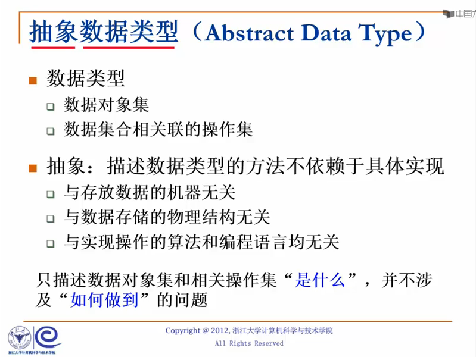<br>
**什么是算法** 
* 有限的指令集
* 接受一些输入（可能不需要输入）
* 产生输出 
* 在有限步骤后终止
* 每一条指令必须满足
    - 有充分明确的目标（没有任何歧义）
    - 计算机能处理的范围内
    - 描述不应该依赖任何计算机语言以及具体的实现手段

**什么是好的算法** ： 千万不要设计出复杂度为 $2^{n}\  or \  n!$ 的算法
* 空间复杂度
* 时间复杂度
    - 最坏情况的复杂度 $T_{worst}(n)$
    - 平均复杂度 $T_{average}(n)$

**最大子列和问题** ：
- 暴力枚举: $O(n^3)$
- 优化后的暴力枚举（相同的I不同的J只需要累加一项）： $O(n\log(n))$
- 分治算法：$O(n\log(n))$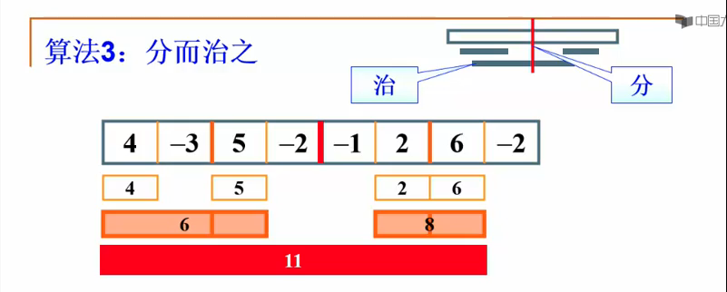
- 在线处理：$O(n)$,正确性不是特别明显，在线的意思是每输入一个数据就进行即时处理，在任何一个地方终止输入，算法都能正确给出当前的解

## 线性结构

### 线性表及其实现
多项式的实现：
* 顺序存储结构直接表示
* 顺序存储结构表示非零项（按照指数大小有序进行）
* 用链表结构存储非零项

**线性表** 由同类型的数据元素构成有序序列的线性结构，它可以由下面的抽象数据类型描述：<br>
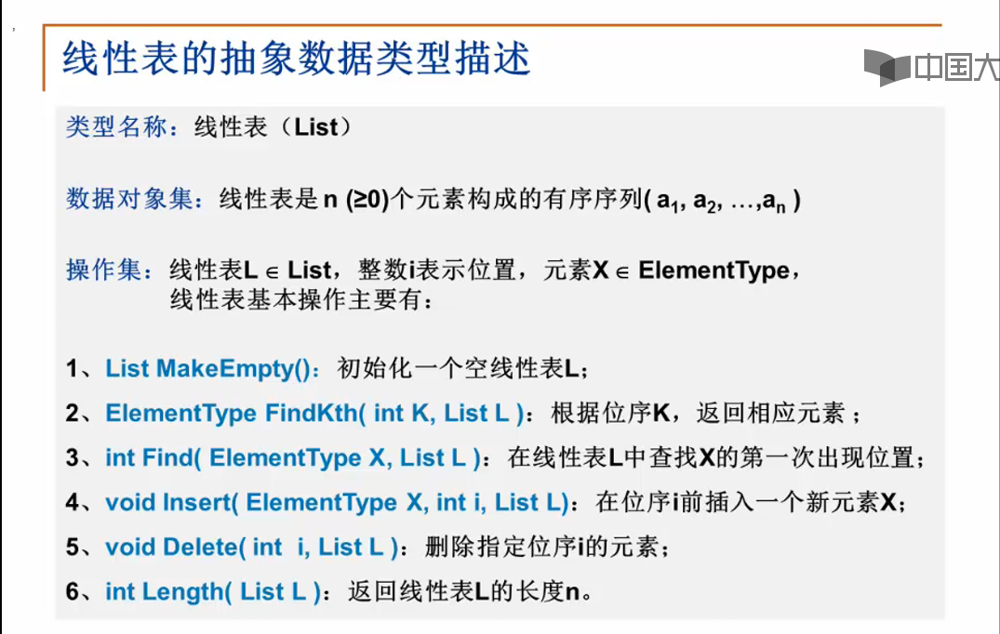<br>
存储实现也可以分为 **顺序存储实现**和 **链式存储实现**。
顺序存储的插入实现：从后到前，（n-1）到i的元素都要向后挪一位。链式存储很多操作都需要用遍历完成。

**广义表** 如用更复杂的链表实现多元的多项式。
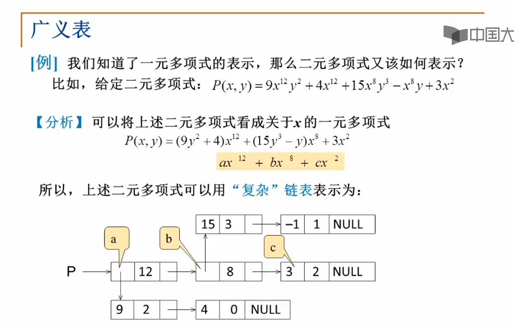<br>
* 它是线性表的推广
* 广义表的元素可以是一个单元素也可以是另一个广义表（在C中用Union实现）

**多重链表** 链表中的节点可能同时隶属于多个链（注意和双向链表区分），用途广泛，在数、图等复杂的数据结构都可以采用多重链表方式实现存储，如对于大型稀疏矩阵的存取：
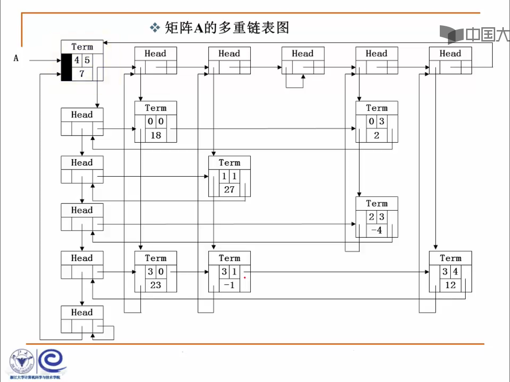<br>

### 堆栈
例：**表达式的求值** ：
* 两类对象构成 
    - 运算数，如 2、3、4
    - 运算符号，如 +、-、*、/
* 不同运算符号的优先级不同

后缀表达式：求值相对比较容易，从左往右扫描，处理运算数和运算符号，遇到运算数记住，遇到运算符号就求值。时间复杂度$O(n)$.使用Stack数据结构实现LIFO:
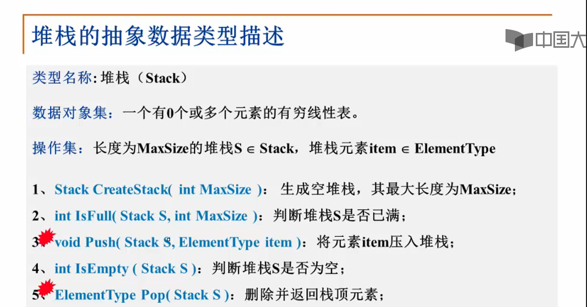<br>
同样，堆栈也可以有数组实现和链表实现。
- 数组实现：用一个[一维数组]()和一个记录[栈顶元素位置的变量]()组成,也可以用一个array存两个stack，一个向上增长，一个向下增长，两个Tag相遇就是堆栈满了
    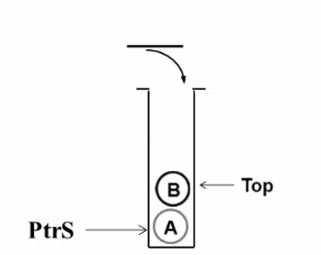<br>
- 链表实现：_Push_ 和 _Pop_ 都在头部进行， 头结点用一个哑节点(dummy node)

**中缀表达式求值** 

- 运算数相对顺序不变,直接输出
- 运算符号顺序发生改变
    * 需要存储"等待中"的运算符号
    * 当前运算符号与等待中最后一个运算符号进行比较
    * 遇到括号,先左括号入栈,遇到右括号把之间的运算符号符号弹出
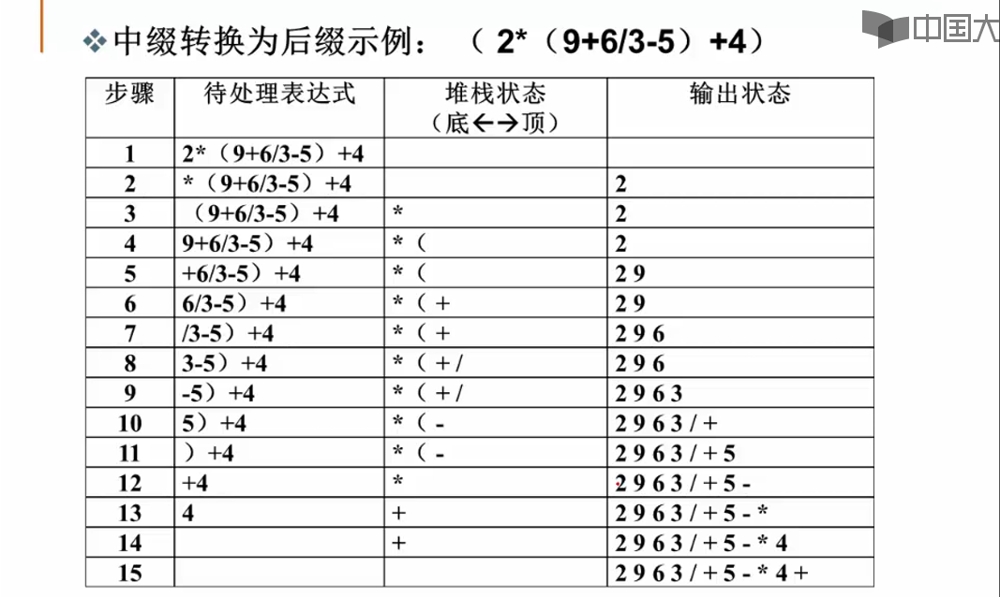<br>

### 队列
受操作约束的线性表, 插入和删除分别在两端,具体的抽象数据类型描述如下:
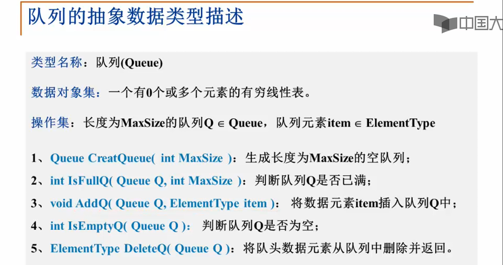<br>

* 数组实现: 由一个一维数组和记录队列头元素位置变量 _front_ 和队尾元素变量 _rear_ 组成.
    循环队列: front==rear时候是满的还是空的如何判断? 增加额外的标记(Size或者Tag)或者仅使用n-1个元素
* 链表实现: 单向链表的前面做删除(前面插入删除都方便),后面做插入.

## 树

### 引子

查找:
    - 静态查找: 集合中记录是固定的(没有插入删除操作)
    - 动态查找: 集合中记录是动态变化的

静态查找
    1. 顺序查找(可以在`elem[0]`放置一个哨兵)
    2. 二分查找(元素必须是在数组中有序存放)
        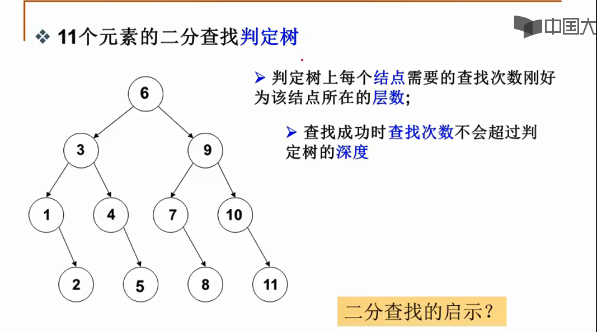

树的定义,采用递归的办法:
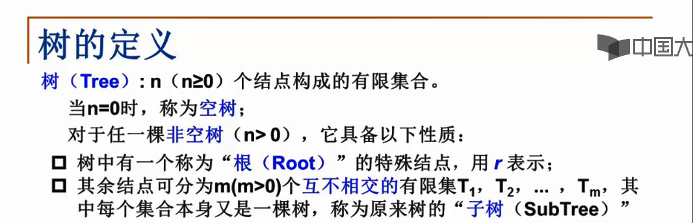
树的表示: 一般使用链表实现,比较好的做法是**儿子-兄弟表示法**,旋转一下就是一个二叉树(度为2的树)
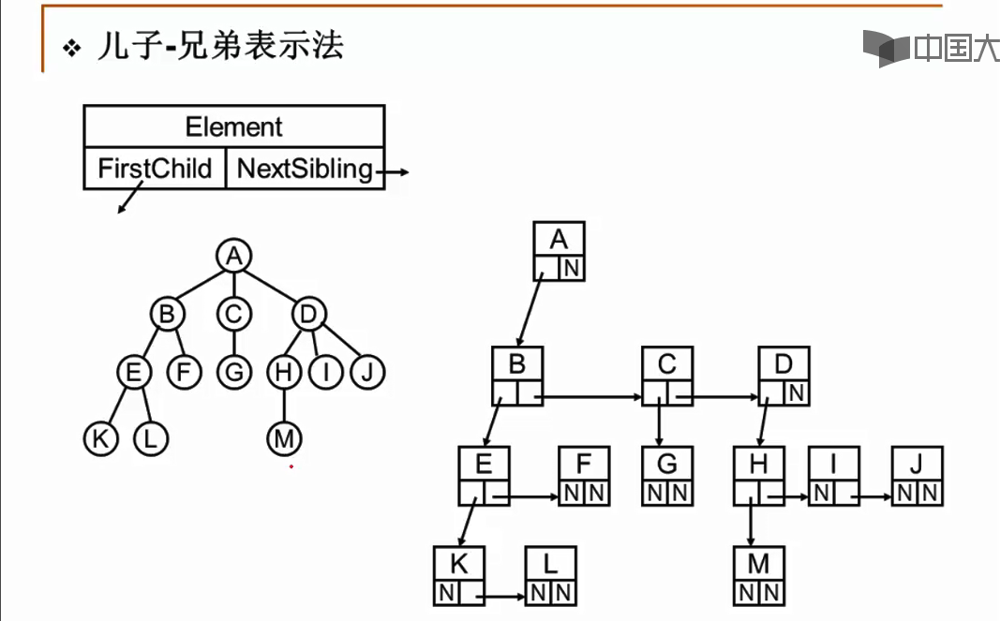

### 二叉树
和一般树的区别在于, 它的**左右子树有顺序之分**.
最主要的四种遍历:
* 先序
* 中序
* 后序
* 层次遍历

#### 二叉树的存储结构
1. 顺序存储结构: 对于**完全二叉树**,可以按照从上到下, 从左到右顺序存储
    * 对于非根节点, 它的父节点序号为[i/2]
    * 节点的左孩子序号为`2*i`, 右孩子的序号是`2*i+1`
   
   对于一般的二叉树, 也可以用类似的结构, 但可能造成空间的浪费
2. 链表存储

#### 二叉树的遍历(递归)

1. 先序遍历(递归)
    * 访问根节点
    * 先序遍历其左子树
    * 先序遍历其又子树

2. 中序遍历(访问根节点调到两个递归之间)
3. 后序遍历

#### 二叉树的非递归遍历

递归的实现**本质上还是用的堆栈**,因此我们在此直接使用堆栈,得到非递归实现中序遍历<br>
:star: 遇到一个节点,就将它压栈,然后遍历**左子树**
:star: **左子树遍历完之后**, 从栈顶弹出节点并访问它
:star: 然后按照其右指针再去中序遍历该节点的右子树<br>

#### 层次遍历

从节点访问左儿子之后, 右边的儿子怎么办? **使用队列访问**
* 首先根节点入队列
* 从队列取出一个元素,访问该元素所指的节点
* 若左\右节点非空, 将其左右节点的指针按照顺序入队

应用:
* 表达式树-前缀\后缀表达式就是对应的遍历, 中缀得加括号
* 有中序遍历+ 前序\后序中的一个可以确定二叉树
* **二叉树的列表和静态链表表示**

## 二叉搜索树(BST)

### BST 的查找
查找问题有 "静态查找" 与 "动态查找",针对动态查找, **二叉查找树**是一个比较好的存储结构.<br>
:star: 左子树所有节点都比根节点的值小
:star: 右子树所有节点都比根节点值大
:star: 左右节点都是BST(递归定义)

查找算法: 使用的实际上是尾递归, 因此可以将函数改为迭代的形式
```C++
    Position IterFind(ElementType match, BinTree BST){
        while(BST){
            if(match > BST->data) BST = BST->right;
            else if(match < BST->data) BST = BST->left;
            else return BST;
        }
        return NULL;//查找失败
    }
```
### BST 的插入

```C++
    BinTree Insert(Elemtype X, BinTree BST){
        if(BST == nullptr){
            BST = (struct Node*)malloc(sizeof(struct Node));
            BST->data = X;
            BST->left = nullptr;
            BST->right = nullptr;
        }
        else if(X < BST->data) BST->left = Insert(X,BST->left);
        else if(X > BST->data) BST->right = Insert(X,BST->right);
        return BST;
    }
```

### BST 的删除

:stars: 一个叶节点: 直接删除
:stars: 只有一个左/又 child,父节点指向要删除节点的child
:cry: 有左右两个child,用右子树最小节点的值or左子树最大的值替代( **他们都为前两种情况之一** )
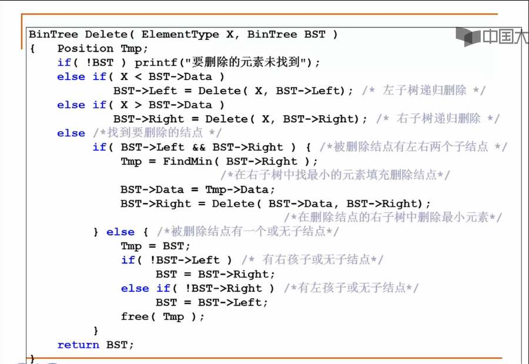<br>

### 平衡二叉树 - Intro
不同的节点插入顺序会导致**平均查找长度(ASL)**的不同, 用平衡因子(BF)= $H_l - H_r$, 平衡二叉树(AVL树):
* 空树或者
* 任一节点左右子树高度差绝对值不超过1, $|BF(T)\leq 1|$

平衡二叉树高度h, 构成最小的节点树,  $n_h = n_{h-1} + n_{h-2} + 1$, 两边加一,大概就和斐波那契数列差一位, 但是增长都是指数增长.

### 平衡二叉树的调整

- 麻烦者在发现者(某个作为根的节点)**右** 子树的**右边**, 叫RR插入, 需要 RR旋转:
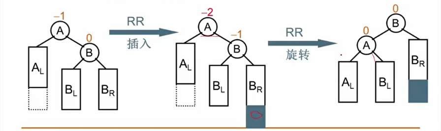
- 同样的, 作为对称出现的还有LL旋转:
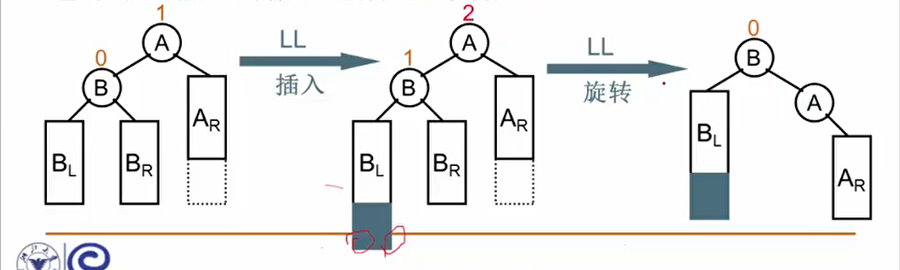
- LR旋转:麻烦节点在 __左__ 子树的 __右__ 边,左LR 插入
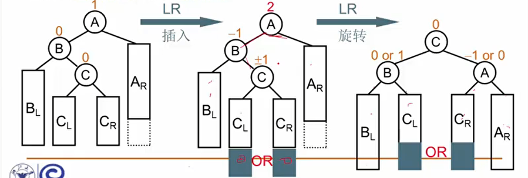
- RL 旋转: 上面的对称
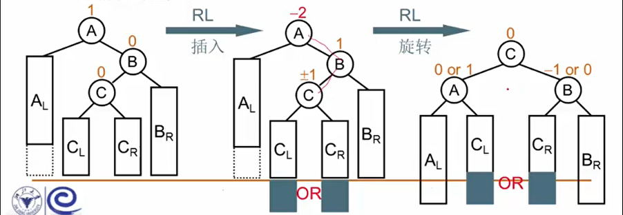

### case study: 判别是不是同一个二叉搜索树
给定一个插入序列, 判断是否是同一个二叉搜索数(一个插入序列唯一确定一个BST,但是一个BST可能对应多个序列)<br>
1. 分别建立两个BST, 然后递归实现判断
2. 不建树也可以判别:
    根据第一个输入的数字作为根节点,比较两个左右子数是否一样(递归)
    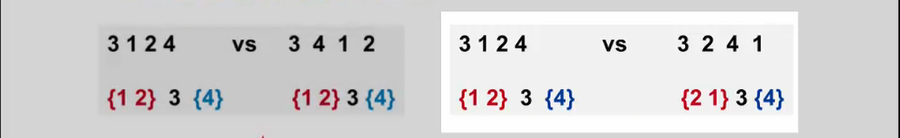
3. 建一个树, 然后比较序列是否一致
    - 读入数据建立搜索树T(依次用递归的Insert实现)
    - 判断一个序列是否和T构成相同的搜索树

如何判别?  **在T中按顺序搜索需要查找序列的某个树, 如果经过的节点在前面均被访问过,则一致,遇到未访问过的节点,则不一致**.

## 堆
### Intro
优先队列: 特殊的队列, 取出元素是按照优先权的大小, 而不是元素进入队列的先后顺序.<br>
1. 数组实现:
    - 插入: 总是插入尾部 $\sim \Theta(1)$
    - 删除: 
        * 查找最大(或者最小)的关键字$\sim \Theta(n)$
        * 删除相关需要移动的元素$\sim O(n)$

2. 链表实现:
    * 插入和查找是相同的 ,删除元素需要的时间$\sim O(1)$

3. 有序的数组:
    * 插入:
        * 寻找合适的位置 $\sim O(n) \text{ or} \sim O (\log_2 n)$
        * 移动元素并插入 $\sim O(n)$
    * 删除操作: 删除最后一个元素 $\sim \Theta(1)$

4. 有序链表
    * 插入无法用binary search, 找合适的位置 $\sim O(n)$, 插入元素 $\sim \Theta(1)$

__考虑树的实现__:<br>
二叉搜索树:sob: 一直删除的都是最右的节点,可能导致树的严重不平衡, 采用二叉树结构, 应该更加关注**删除** 操作:<br>
* 最大/小值在根节点(有序性)
* 完全二叉树(结构性)

### 堆的插入
先按照完全二叉树的最后一位插入, 然后在交换位置保证有序性(不断和父节点比较,一般零号位置可以做哨兵(maxData)), 单次插入的时间复杂度为$O \log N$

### 堆的删除
1. 取出根节点的元素,同时删除堆的一个节点
2. 把最后的元素换到根节点处
3. 取较大的儿子, 和根不断交换位置(如果有序性不满足)

### 堆的建立
堆的一个应用: **堆排序**, 需要先建堆,将已经存在的N个元素按照最大堆的要求存放在一个一维数组中.
1. 通过插入操作, 将N个元素相继插入到一个初始为空的堆中, 时间代价为$O(N \log N)$
2. 在线性时间复杂度下建立最大堆
    1. 将N个元素按照输入顺序存入, 先满足完全二叉树的结构特性 $ O(n)$
    2. 调整各个节点的位置, 以满足最大堆的有序特性(从右下方最后一个有儿子的节点开始调整)

### 哈夫曼树与编码

如何根据不同节点的查找频率构造更有效的搜索树? 带权路径长度(WPL):假设二叉树有n个**叶子节点**, 每个节点的权值为$W_k$,从根节点到每个叶节点的长度为$l_k$, 那么带全路径长度之和为$\text{WPL} = \sum_{k=1}^n w_k l_k$ , **哈夫曼树: WPL**最小的二叉树.<br>

哈夫曼树的构造: 每次把权值最小的两颗二叉树合并(选择最小的就可以用堆实现).<br>
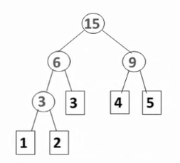

* 没有度为1的节点
* n个叶节点的哈夫曼树共有2n-1个节点
* 哈夫曼树的任意非叶结点的左右子树交换后依然是哈夫曼树
* 同样一组权值, 可能存在不同构的两颗哈夫曼树

进行不等长编码避免二义性: 前缀码,任何字符的编码都不是另一个字符编码的前缀,用二叉树进行编码, 字符只出现在叶结点上.(哈夫曼树应用于编码)

### 集合的表示与运算
就是Union-find问题, 一般只有两个操作, 将两个集合合并, 或者查询一个元素是否在集合中, 一般是使用一个指针指向自己的父类, 实际上可以采用数组的存储方式.
```C++
typedef struct{
    ElementType data;
    int parent;//类似于指向父节点的指针
} SetType;
```
find 操作就是先循环, 找出X, 然后不断寻根.<br>
union 的操作就是将一个根节点的根放到另一个根节点下面.(根节点的负数可以设置为集合的大小)

//TODO: vedio 60