# 数据结构 浙江大学 陈越
## Introduction
**什么是数据结构** [数据结构](https://simple.wikipedia.org/wiki/Data_structure)是计算机中存储、组织数据的方式，通常情况下精心选择的数据结构可以带来最优效率的算法，一般是抽象数据类型(ADS, Abstruct Data Type)
* 数据对象在计算机中的组织方式
    - 逻辑结构（线性结构、树、图）
    - 物理存储结构
* 数据对象必定与一系列加在其身上的操作相关联
* 完成这些操作所用的方法就是**算法**

<br>
**什么是算法** 
* 有限的指令集
* 接受一些输入（可能不需要输入）
* 产生输出 
* 在有限步骤后终止
* 每一条指令必须满足
    - 有充分明确的目标（没有任何歧义）
    - 计算机能处理的范围内
    - 描述不应该依赖任何计算机语言以及具体的实现手段

**什么是好的算法** ： 千万不要设计出复杂度为 $2^{n}\  or \  n!$ 的算法
* 空间复杂度
* 时间复杂度
    - 最坏情况的复杂度 $T_{worst}(n)$
    - 平均复杂度 $T_{average}(n)$

**最大子列和问题** ：
- 暴力枚举: $O(n^3)$
- 优化后的暴力枚举（相同的I不同的J只需要累加一项）： $O(n^2)$
- 分治算法：$O(n\log(n))$
- 在线处理：$O(n)$,正确性不是特别明显，在线的意思是每输入一个数据就进行即时处理，在任何一个地方终止输入，算法都能正确给出当前的解

## 线性结构

### 线性表及其实现
多项式的实现：
* 顺序存储结构直接表示
* 顺序存储结构表示非零项（按照指数大小有序进行）
* 用链表结构存储非零项

**线性表** 由同类型的数据元素构成有序序列的线性结构，它可以由下面的抽象数据类型描述：<br>
<br>
存储实现也可以分为 **顺序存储实现**和 **链式存储实现**。
顺序存储的插入实现：从后到前，（n-1）到i的元素都要向后挪一位。链式存储很多操作都需要用遍历完成。

**广义表** 如用更复杂的链表实现多元的多项式。
<br>
* 它是线性表的推广
* 广义表的元素可以是一个单元素也可以是另一个广义表（在C中用Union实现）

**多重链表** 链表中的节点可能同时隶属于多个链（注意和双向链表区分），用途广泛，在数、图等复杂的数据结构都可以采用多重链表方式实现存储，如对于大型稀疏矩阵的存取：
<br>

### 堆栈
例：**表达式的求值** ：
* 两类对象构成 
    - 运算数，如 2、3、4
    - 运算符号，如 +、-、*、/
* 不同运算符号的优先级不同

后缀表达式：求值相对比较容易，从左往右扫描，处理运算数和运算符号，遇到运算数记住，遇到运算符号就求值。时间复杂度$O(n)$.使用Stack数据结构实现LIFO:
<br>
同样，堆栈也可以有数组实现和链表实现。
- 数组实现：用一个[一维数组]()和一个记录[栈顶元素位置的变量]()组成,也可以用一个array存两个stack，一个向上增长，一个向下增长，两个Tag相遇就是堆栈满了
    <br>
- 链表实现：_Push_ 和 _Pop_ 都在头部进行， 头结点用一个哑节点(dummy node)

**中缀表达式求值** 

- 运算数相对顺序不变,直接输出
- 运算符号顺序发生改变
    * 需要存储"等待中"的运算符号
    * 当前运算符号与等待中最后一个运算符号进行比较
    * 遇到括号,先左括号入栈,遇到右括号把之间的运算符号符号弹出
<br>

### 队列
受操作约束的线性表, 插入和删除分别在两端,具体的抽象数据类型描述如下:
<br>

* 数组实现: 由一个一维数组和记录队列头元素位置变量 _front_ 和队尾元素变量 _rear_ 组成.
    循环队列: front==rear时候是满的还是空的如何判断? 增加额外的标记(Size或者Tag)或者仅使用n-1个元素
* 链表实现: 单向链表的前面做删除(前面插入删除都方便),后面做插入.

## 树

### 引子

查找:    
- 静态查找: 集合中记录是固定的(没有插入删除操作)
- 动态查找: 集合中记录是动态变化的

静态查找
1. 顺序查找(可以在`elem[0]`放置一个哨兵)
2. 二分查找(元素必须是在数组中有序存放)
    

树的定义,采用递归的办法:

树的表示: 一般使用链表实现,比较好的做法是**儿子-兄弟表示法**,旋转一下就是一个二叉树(度为2的树)


### 二叉树
和一般树的区别在于, 它的**左右子树有顺序之分**.
最主要的四种遍历:
* 先序
* 中序
* 后序
* 层次遍历

#### 二叉树的存储结构
1. 顺序存储结构: 对于**完全二叉树**,可以按照从上到下, 从左到右顺序存储
    * 对于非根节点, 它的父节点序号为[i/2]
    * 节点的左孩子序号为`2*i`, 右孩子的序号是`2*i+1`
   
   对于一般的二叉树, 也可以用类似的结构, 但可能造成空间的浪费
2. 链表存储

#### 二叉树的遍历(递归)

1. 先序遍历(递归)
    * 访问根节点
    * 先序遍历其左子树
    * 先序遍历其又子树

2. 中序遍历(访问根节点调到两个递归之间)
3. 后序遍历

#### 二叉树的非递归遍历

递归的实现**本质上还是用的堆栈**,因此我们在此直接使用堆栈,得到非递归实现中序遍历<br>
:star: 遇到一个节点,就将它压栈,然后遍历**左子树**<br>
:star: **左子树遍历完之后**, 从栈顶弹出节点并访问它<br>
:star: 然后按照其右指针再去中序遍历该节点的右子树<br>

#### 层次遍历

从节点访问左儿子之后, 右边的儿子怎么办? **使用队列访问**
* 首先根节点入队列
* 从队列取出一个元素,访问该元素所指的节点
* 若左\右节点非空, 将其左右节点的指针按照顺序入队

应用:
* 表达式树-前缀\后缀表达式就是对应的遍历, 中缀得加括号
* 有中序遍历+ 前序\后序中的一个可以确定二叉树
* **二叉树的列表和静态链表表示**

## 二叉搜索树(BST)

### BST 的查找
查找问题有 "静态查找" 与 "动态查找",针对动态查找, **二叉查找树**是一个比较好的存储结构.<br>
:star: 左子树所有节点都比根节点的值小<br>
:star: 右子树所有节点都比根节点值大<br>
:star: 左右节点都是BST(递归定义)<br>

查找算法: 使用的实际上是尾递归, 因此可以将函数改为迭代的形式
```C++
    Position IterFind(ElementType match, BinTree BST){
        while(BST){
            if(match > BST->data) BST = BST->right;
            else if(match < BST->data) BST = BST->left;
            else return BST;
        }
        return NULL;//查找失败
    }
```
### BST 的插入

```C++
    BinTree Insert(Elemtype X, BinTree BST){
        if(BST == nullptr){
            BST = (struct Node*)malloc(sizeof(struct Node));
            BST->data = X;
            BST->left = nullptr;
            BST->right = nullptr;
        }
        else if(X < BST->data) BST->left = Insert(X,BST->left);
        else if(X > BST->data) BST->right = Insert(X,BST->right);
        return BST;
    }
```

### BST 的删除

:stars: 一个叶节点: 直接删除<br>
:stars: 只有一个左/又 child,父节点指向要删除节点的child<br>
:cry: 有左右两个child,用右子树最小节点的值or左子树最大的值替代( **他们都为前两种情况之一** )<br>
<br>

### 平衡二叉树 - Intro
不同的节点插入顺序会导致**平均查找长度(ASL)**的不同, 用平衡因子(BF)= $H_l - H_r$, 平衡二叉树(AVL树):
* 空树或者
* 任一节点左右子树高度差绝对值不超过1, $|BF(T)\leq 1|$

平衡二叉树高度h, 构成最小的节点树,  $n_h = n_{h-1} + n_{h-2} + 1$, 两边加一,大概就和斐波那契数列差一位, 但是增长都是指数增长.

### 平衡二叉树的调整

- 麻烦者在发现者(某个作为根的节点)**右** 子树的**右边**, 叫RR插入, 需要 RR旋转:

- 同样的, 作为对称出现的还有LL旋转:

- LR旋转:麻烦节点在 __左__ 子树的 __右__ 边,左LR 插入

- RL 旋转: 上面的对称


### case study: 判别是不是同一个二叉搜索树
给定一个插入序列, 判断是否是同一个二叉搜索数(一个插入序列唯一确定一个BST,但是一个BST可能对应多个序列)<br>
1. 分别建立两个BST, 然后递归实现判断
2. 不建树也可以判别:
    根据第一个输入的数字作为根节点,比较两个左右子数是否一样(递归)
    
3. 建一个树, 然后比较序列是否一致
    - 读入数据建立搜索树T(依次用递归的Insert实现)
    - 判断一个序列是否和T构成相同的搜索树

如何判别?  **在T中按顺序搜索需要查找序列的某个树, 如果经过的节点在前面均被访问过,则一致,遇到未访问过的节点,则不一致**.

## 堆
### Intro
优先队列: 特殊的队列, 取出元素是按照优先权的大小, 而不是元素进入队列的先后顺序.<br>
1. 数组实现:
    - 插入: 总是插入尾部 $\sim \Theta(1)$
    - 删除: 
        * 查找最大(或者最小)的关键字$\sim \Theta(n)$
        * 删除相关需要移动的元素$\sim O(n)$

2. 链表实现:
    * 插入和查找是相同的 ,删除元素需要的时间$\sim O(1)$

3. 有序的数组:
    * 插入:
        * 寻找合适的位置 $\sim O(n) \text{ or} \sim O (\log_2 n)$
        * 移动元素并插入 $\sim O(n)$
    * 删除操作: 删除最后一个元素 $\sim \Theta(1)$

4. 有序链表
    * 插入无法用binary search, 找合适的位置 $\sim O(n)$, 插入元素 $\sim \Theta(1)$

__考虑树的实现__:<br>
二叉搜索树:sob:<br> 一直删除的都是最右的节点,可能导致树的严重不平衡, 采用二叉树结构, 应该更加关注**删除** 操作:<br>
* 最大/小值在根节点(有序性)
* 完全二叉树(结构性)

### 堆的插入
先按照完全二叉树的最后一位插入, 然后在交换位置保证有序性(不断和父节点比较,一般零号位置可以做哨兵(maxData)), 单次插入的时间复杂度为$O \log N$

### 堆的删除
1. 取出根节点的元素,同时删除堆的一个节点
2. 把最后的元素换到根节点处
3. 取较大的儿子, 和根不断交换位置(如果有序性不满足)

### 堆的建立
堆的一个应用: **堆排序**, 需要先建堆,将已经存在的N个元素按照最大堆的要求存放在一个一维数组中.
1. 通过插入操作, 将N个元素相继插入到一个初始为空的堆中, 时间代价为$O(N \log N)$
2. 在线性时间复杂度下建立最大堆
    1. 将N个元素按照输入顺序存入, 先满足完全二叉树的结构特性 $ O(n)$
    2. 调整各个节点的位置, 以满足最大堆的有序特性(从右下方最后一个有儿子的节点开始调整)

### 哈夫曼树与编码

如何根据不同节点的查找频率构造更有效的搜索树? 带权路径长度(WPL):假设二叉树有n个**叶子节点**, 每个节点的权值为$W_k$,从根节点到每个叶节点的长度为$l_k$, 那么带全路径长度之和为$\text{WPL} = \sum_{k=1}^n w_k l_k$ , **哈夫曼树: WPL**最小的二叉树.<br>

哈夫曼树的构造: 每次把权值最小的两颗二叉树合并(选择最小的就可以用堆实现).<br>


* 没有度为1的节点
* n个叶节点的哈夫曼树共有2n-1个节点
* 哈夫曼树的任意非叶结点的左右子树交换后依然是哈夫曼树
* 同样一组权值, 可能存在不同构的两颗哈夫曼树

进行不等长编码避免二义性: 前缀码,任何字符的编码都不是另一个字符编码的前缀,用二叉树进行编码, 字符只出现在叶结点上.(哈夫曼树应用于编码)

### 集合的表示与运算
就是Union-find问题, 一般只有两个操作, 将两个集合合并, 或者查询一个元素是否在集合中, 一般是使用一个指针指向自己的父类, 实际上可以采用数组的存储方式.
```C++
typedef struct{
    ElementType data;
    int parent;//类似于指向父节点的指针
} SetType;
```
find 操作就是先循环, 找出X, 然后不断寻根.<br>
union 的操作就是将一个根节点的根放到另一个根节点下面.(根节点的负数可以设置为集合的大小)

#### 堆中的路径
* 堆的表示及其操作: 使用一个数组进行存放, 方便找到父节点,和左右child

### 小白专场: file transfer
union-find 的典型应用, 可以做简化: 任何有限集合的元素(N个)都可以一一映射成为整数$0 \sim N-1$, 直接定义整型数组就可以表示集合中的袁术, 而不用专门使用一个`SetType`.<br>
**按秩归并**: 简单的`Union(Find(2),Find(1))`, 树会越长越高,最终形成一个类似于单链表的结构,需要矮的树并到高的树上,可以将树的高度存在**根节点处**,S[root]= 树高,两者等高的时候,树的高度都要加一.另一个做法是可以比较树的规模, 把小树贴到大树上.最坏情况的树高为$O(\log N)$.<br>
**路径压缩**: 对find的改进,用递归的做法, 让所有的点直接指向root, 调用一次后多花时间, 以后再调用就快很多, 这里使用的是尾递归, 实际上编译器编译产生的是被优化后的循环代码.
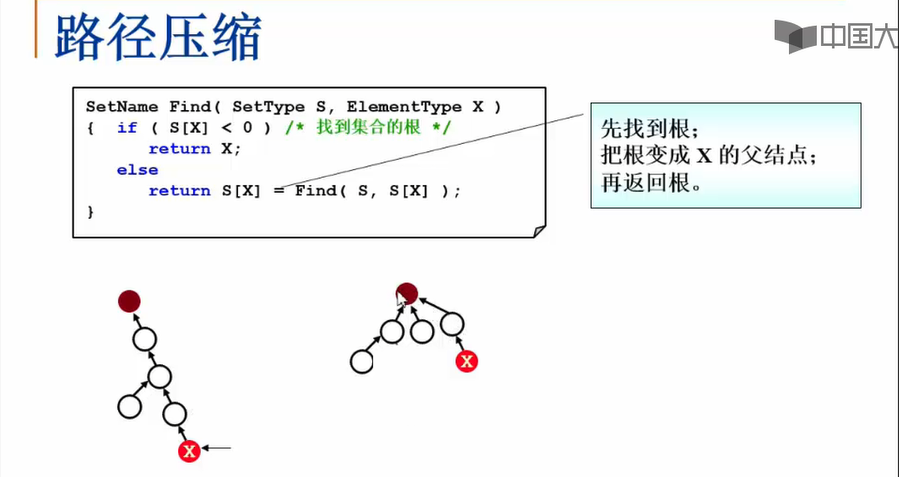<br>
这个题目的设计, 要体会路径压缩的优越性是很难的, 因为:<br>
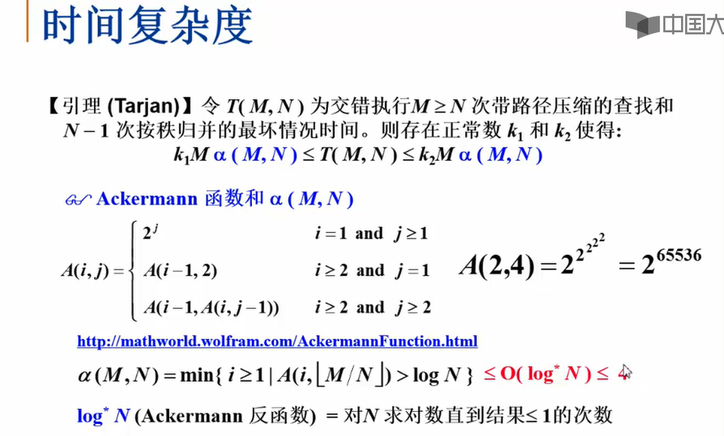<br>

## 图
### 什么是图
* 表示多对多的关系
* 包含
    * 一组顶点,通常用V(vertex)表示顶点的集合
    * 一组边, 通常用E(Edge)表示边的集合(不考虑重边和自回路)
        * 双向边:$(v,w) \in E$, while $v,w \in V$
        * 有向边:$\langle v,w \rangle$ 表示v指向w的单行线

### 图的表示法

#### 邻接矩阵
- 邻接矩阵$G[N][N]$ - N 个顶点从 0 到 N-1 编号
\[
G[i][j] = 1 \  如果\langle v_i,v_j \rangle 是G中的边 \\ 
        or\   0 \ \ \ 否则
\] 
- 对角元全为0(不允许自回路)
- 无向图,为一个对称矩阵
    * 可以使用一维数组只存下三角矩阵的部分$G[i][j]$对应的下标为$(i \times (i+1) /2) + j$
    * 对于网络(带权的无向图),只要将原来的 1 改成边的权重即可(//TODO:0需要怎么改)

邻接矩阵的好处:<br>
:star: 方便,直观<br>
:star: 方便检查任意一对顶点之间是否存在边<br>
:star: 方便找任意顶点的所有"邻接点"(有边直接连接的顶点)<br>
:star: 方便计算任意顶点的度(有向图分为"出度"和"入度")<br>

邻接矩阵的不足:<br>
:cry: 空间浪费(存储稀疏图时候有大量无效元素,对于稠密图还算合算)<br>
:cry: 时间浪费(统计稀疏矩阵的边时,有过多无效的扫描)

#### 邻接表
**邻接表**: $G[N]$为指针数组, 对应邻接矩阵每行一个链表, 只存储非零元素.(**一定要足够稀疏才合算**)<br>
- [x] 方便找所有的邻接点
- [x] 节约稀疏图的空间 
    * 需要N个头指针和 2E个节点(每个节点至少2个域)
- [x] 方便计算任意顶点的度?
    * 对于无向图, 这个说法是正确的
    * 对有向图, 只能计算出度, 需要构造"逆邻接表"才能方便计算"入度"(相当于存邻接矩阵的列)

:cry: 检查任意一对顶点之间是否存在边则非常困难<br>
此外, 对于具体的问题, 还有五花八门的图表示方法, 在这里只讨论这两个.

### 图的遍历

#### DFS
访问完了节点的所有邻接节点之后,一定是要做原路返回(类似于堆栈), 伪代码描述如下:
```C++
void DFS(Vertex V){ // 树先序遍历的推广
    visited[i] = true;
    for(v的每个邻接点W)
        if(!visited[W]) DFS(W);
}
```
如果有N个顶点,E条边:
* 如果是邻接表的结构,$O(E+N)$
* 如果是邻接矩阵的结构,$O(N^2)$

#### BFS

类似于树的层次遍历过程, 使用队列实现:<br>
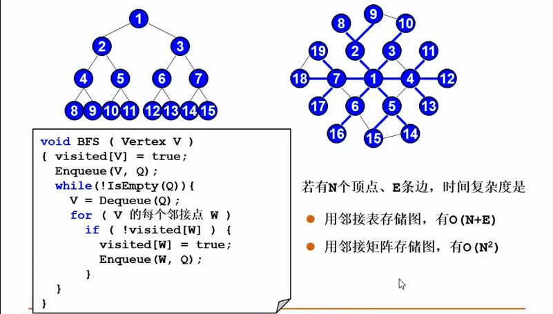<br>

#### 图不连通怎么办
图不连通, 每次遍历只能做一个联通分量, 因此自能对G的每个点V, 如果没访问过, 则再次调用BFS/DFS.

### 小白专场: 如何建立图
#### 邻接矩阵
简单的做法用接邻矩阵`WeightType G[MaxVertexNum][MaxVertexNum]`, 然后再有两个 int 类型的变量声明当前的节点数和边数即可.<br>
更好的做法是将它封装在一个结构体里面:
```C++
typedef struct Gnode *PtrGnode;
struct Gnode{
    int NumVertex;
    int NumEdges;
    WeightType G[MaxVertexNum][MaxVertexNum];
    DataType Data[MaxVertexNum]; // 存顶点中的数据,在某些图中可能有用
};
typedef PtrGnode MatrixGraph; // pass by pointer 比 value更高效
```
- [x] 初始化一个由VertexNum 个顶点但是没有边
- [x] 像图中插入一条边
    ```C++
    typedef struct ENode *PtrEdge;
    struct ENode{
        Vertex V1, V2;
        WeightType Weight;
    };
    typedef PtrEdge Edge;
    void insertEdge(MatrixGraph Graph, Edge E){
        Graph->G[E->V1][E->V2] = E->Weight;
        // 对于无向图, 需要插入两条边
        Graph->G[E->V2][E->V1] = E->Weight;
    }
    ```
#### 邻接表
```C++
// 定义图
typedef struct Gnode *PtrGnode;
struct Gnode{
    int NumVertex;
    int NumEdges;
    AdjList G;
};
typedef PtrGnode ListGraph;
// 定义节点
typedef struct Vnode{
    PtrToAdjVNode FirstEdge;
    DataType Data;  
} AdjList[MaxVertexNum];
// 定义边
typedef struct AdjVNode *PtrAdjVNode;
struct AdjVNode{
    Vertex AdjV;  // 邻接点下标
    WeightType Weight; // 权重
    PtrAdjVNode Next; 
}
```

- [x] 初始化一个由顶点但是没有边(for each Node, `Graph->G[V].FirstEdge= nullptr`)
- [x] 插入一条边
// todo: chap 7 讲解题目全部放弃
## 图的算法
### 最小生成树问题


## 排序
### Intro
```C++
void x_sort(ElementType[], int N)
```
* 大多数情况下只讨论从小到大的整数排序
* N 是正整数
* 只讨论基于比较的排序(>/=/<有定义)
* 只讨论**内部**排序(内存空间足够大,不需要考虑存不下从硬盘读写的问题)
* 稳定性: 任意两个相等的数据,排序前后相对位置不发生变化

:cry: 没有一种排序在任何情况下都表现得最好(有取舍,不然无需介绍其他的排序)

### 冒泡排序
* 一趟排序做完之后, 最大的泡泡总是在最下面
* 接下来只需要处理前N-i个元素
```C++
void Bubble_sort(ElementType A[], size_t N){
    for(P=N-1; P>=0; --P){
        flag = 0 ;              // 表示没有做交换
        for(i = 0; i< P; i++){  // 一次冒泡
            if(A[i] > A[i+1]) swap(A[i],A[i+1]);
            flag = 1; // 标志发生了交换
        }
        if(flag == 0) break;    //全程无交换的时候直接是有序的
    }
}
```
* 最好的情况 $O(N)$
* 最坏的情况 $O(N^2)$

值得注意的是, 这个做法对于链表也可以进行, 但是有的排序算法就不一定了.

### 插入排序
有点类似于打牌时候摸牌的处理过程,伪代码描述如下:

```C++
void Insertion_sort(ElementType A[], size_t N){
    for(P=1; P<N; ++P){
        Temp = A[P];         // 摸牌
        for(i = P; i>0 && A[i-1]> Temp; --i){
            A[i] = A[i-1];   // 移除空位
        }
        A[i] = Temp;         // 新牌落位
    }
}
```
* 最好的情况 $O(N)$
* 最坏的情况 $O(N^2)$, 倒序输入时候发生

### 时间复杂度的下界
对于下标i < j,如果 $A[i] > A[j]$, 就称$(i, j)$ 为一对逆序对, 交换相邻的元素正好消除一个逆序对,插入排序$T(N,I) = O(N+I)$, 如果序列**基本有序**, 插入排序简单而且高效.<br>
定理: 任意N个不同元素组成的序列**平均具有$N(N-1)/4$个逆序对**.<br>
定理: 任意**仅以交换相邻元素排序**的算法, 其平均时间复杂度为$\Omega (N^2)$.<br> 
提高算法效率的做法:<br>
- [x] 每次消去不止一个逆序对
- [x] 每次交换相距比较远的两个元素

### 希尔排序
举一个简单的例子:<br>
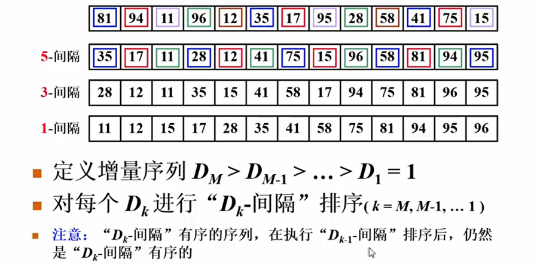<br>
原始希尔排序 $D_M = [N/2], D_k = [D_{k+1} /2]$
- 最坏的情况 $T= \Theta (N^2)$
- 增量元素不互质, 很多活白干
    * Hibbard 增量序列 $D_k = 2^k -1$(响铃元素互质),最坏情况$T=\Theta (N^{3/2})$,猜想$T_{avg} = O(N^{5/4})$
    * Sedgewick 增量序列 $9 \times 4^i - 9 \times 2^i +1 $ or $4^i - 3\times 2^i +1$, 猜想 $T_{avg} = O(N^{7/6})$, $T_{worst} = O(N^{4/3})$

### 堆排序

**选择排序**: 每次找到最小元,将它位置赋值给MinPosition, 然后 `A[i]`和 `A[MinPosition]`互换,无论如何,$T = \Theta (N^2)$, 问题就在于如何找到最小元<br>
堆排序就是选择排序的一个改进,一个非常傻的算法:
```C++
void heap_sort(ElementType A[], int N){
    BuildHeap(A);                   //  O(N)
    for (i = 0; i<N ; ++i){
        TempA[I] = DeletaMin(A);    // 每次循环O(log N)
    }
    for(i = 0; i< N; ++i)           // O(N)
        A[i] = TempA[i];
}
```
问题:
* 需要额外的N空间
* 复制也是需要时间的

下面是一个改进的算法:
```C++
void Heap_Sort(ElementType A[], int N){
    for(i = N/2; i>=0; i--) 
        PercDown(A,i,N);
    for(i = N-1; i>0; i--){
        Swap(&A[0],&A[i]);      // delete max
        PercDown(A,0,i);
    }    
}
```
* 定理: 堆排序处理N个不同元素的随机排列平均次数是$2N\log N - O(N \log \log N)$
* 堆排序给出最佳的平均复杂度(略小于$N\log N$), 但是实际效果不如Sedgewick 增量序列的希尔排序

### MergeSort 
核心思想是**给两个有序的子序列排序**, 这样需要一个Help function:<br>
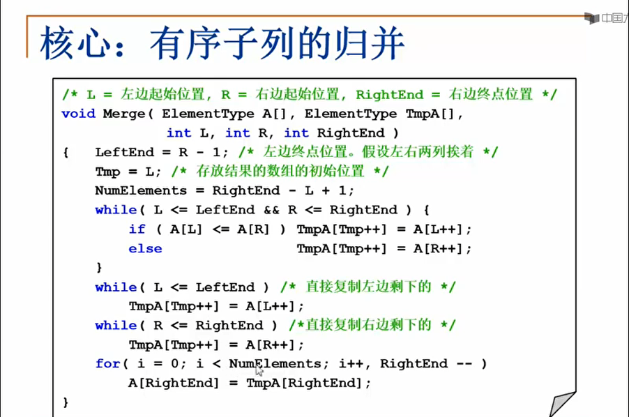<br>

#### 递归实现

典型的 devide and conquer 算法设计<br>
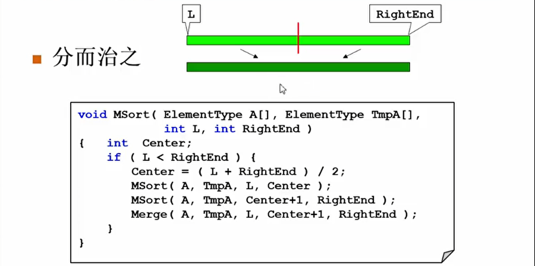<br>
* 没有好坏的说法, 都是$O(N \log N)$ 
* 算法是稳定的
* 然后用Merge_Sort 统一接口, 只做一次malloc,然后每个merge在数组的不同部分去做

#### 非递归实现
空间复杂度最低要求依然是$O(N)$,可以在A和Atemp之间来回倒腾数据:<br>
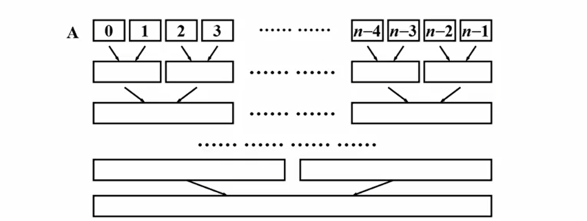<br>
一趟归并的实现如下图:<br>
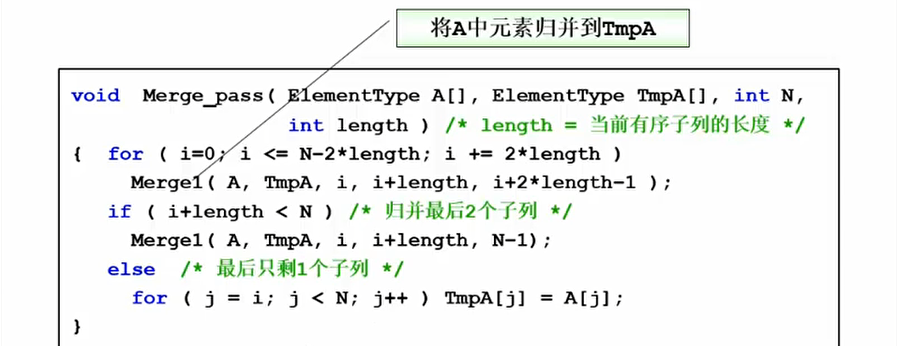<br>
注意每次都是做两个Merge pass,这样完成时候 , A 就是已经merge sort 好的版本, 可以直接将TempA free
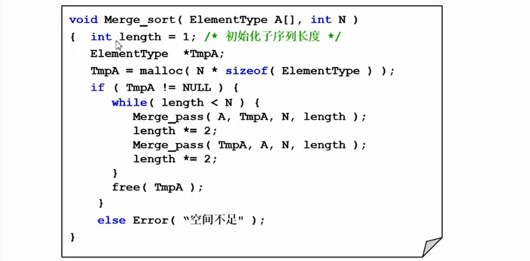<br>

* 在外排序时候是一个非常好用的工具

### 快速排序

在大量随机的数据时候使用性能非常出色, 但是有非常多dirty的细节如果没有注意就无法得到良好的性能,其伪代码描述如下:<br>
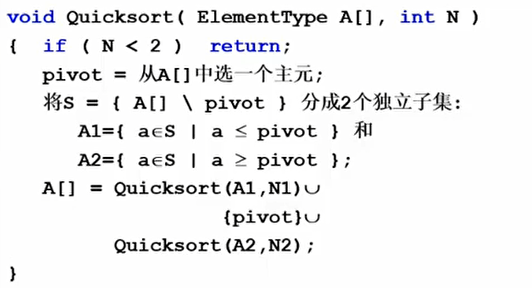<br>
* [如何选择主元]()
* [如何将数据分成两个部分]()

#### 如何选主元
* 如果选则第一个元素, 那么对于一个已经有序的数组, 需要$O(N^2)$的时间复杂度
* 如果随机选择pivot, `rand()` 函数并不便宜
* 取头/中/尾三个数字的中位数

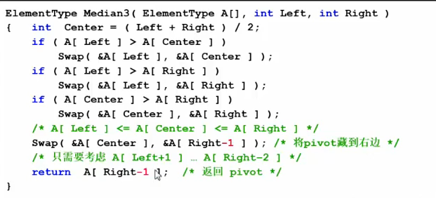<br>

#### 子集划分

* 定义一个左边的标兵i和右边的标兵j
* 左边标兵元素比pivot小, 则i++
* 否则发生一个警告, 转向右边的标兵
* 右边的标兵比Pivot大的话, j--,
* 否则左右都发出警告,交换两者的值
* 直到两个标兵相遇, 那个地方就是Pivot应该待的地方(A[i]和主元交换)
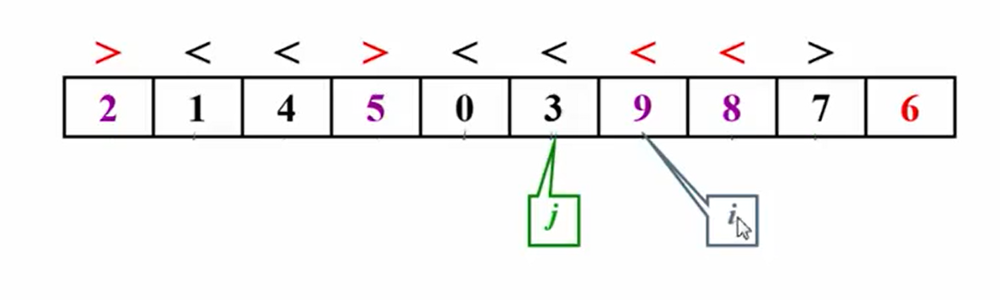<br>

主元被选定之后,<font color=red>就会钉在正确的位置</font>,这就是它对插入排序的一个很大改进.<br>

如果元素刚好和Pivot相等怎么办?
* 停下来交换?  全部相等的时候, 主元基本是在中间, $N \log N$
* 不理他,继续移动指针?  在这种情况下最坏的得到 $N^2$ 的复杂度

问题:
* 使用递归, 有大量入栈出栈调用的操作十分消耗资源
* 对于小规模数据, 可能不如插入排序块

解决方案:
* 当数据规模充分小的时候,停止递归,直接调用简单排序(如插入排序), 程序中设定一个阈值
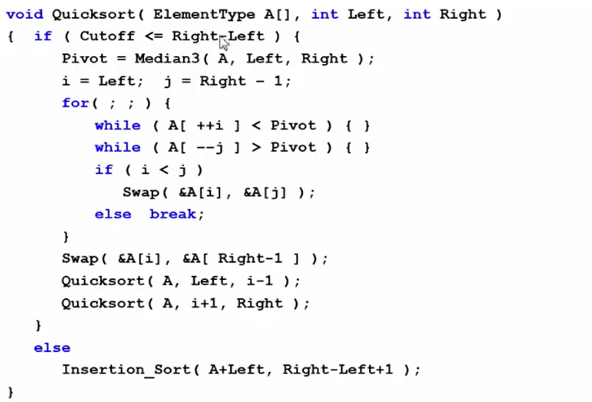<br>

### 表排序
对于移动元素的开销比较大的时候, 是一个比较恐怖的事情, 在这种场景下我们想要做的事情是不移动数据本身而是移动它的指针(**间接排序**).<br>
* 定义一个指针数组作为表(table)
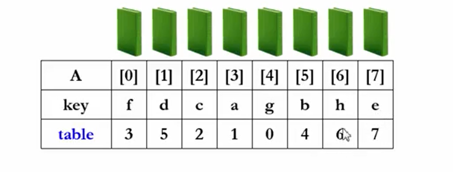<br>

#### 物理排序
* N个数字的排列由若干个独立的环组成(以下三个环相互独立)
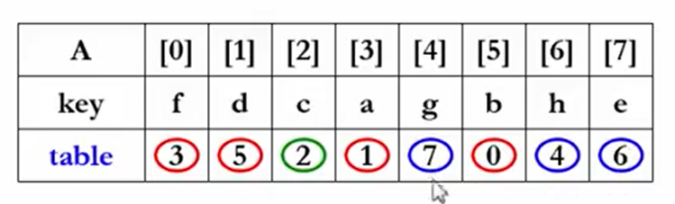<br>

复杂度分析:
* 最好的情况,初始就是有序
* 最坏的情况: 每个环包含2元素, 有N/2个环, 需要 3N/2 次元素移动
    $T = O( mN )$,m为每个元素A的复制时间,可能比较大

### 基数排序
#### 桶排序
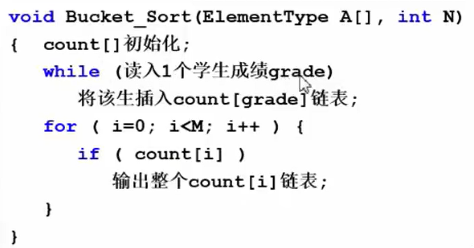<br>
变量的数量多,但是取值是有限的,时间复杂度为$T(M+N)$, 如果M非常小, 可以忽略不计,那么就是线性的时间复杂度.<br>
#### 改进
用"次位优先"的办法, 在这里, 十进制那么它的基数就是10.$T = O(P(N+B))$,P为最高位,B为基数
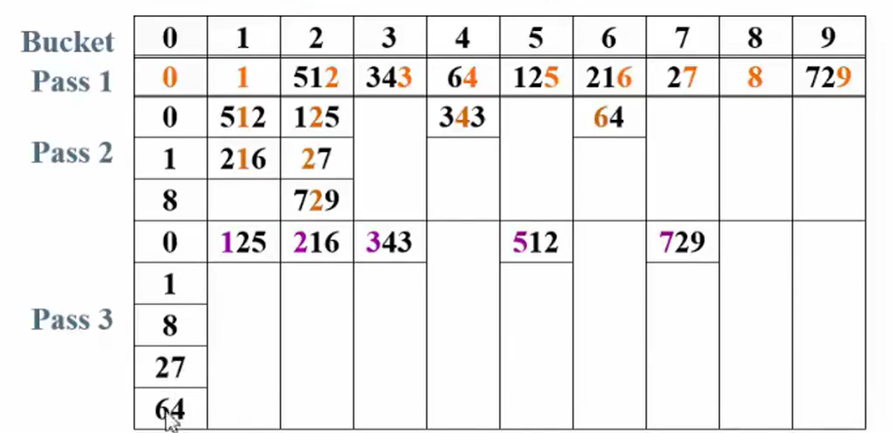<br>
#### 多关键字的排序
每一个关键字理解为整数的某一位, 也可以使用主位优先的排序.

### 不同算法的比较
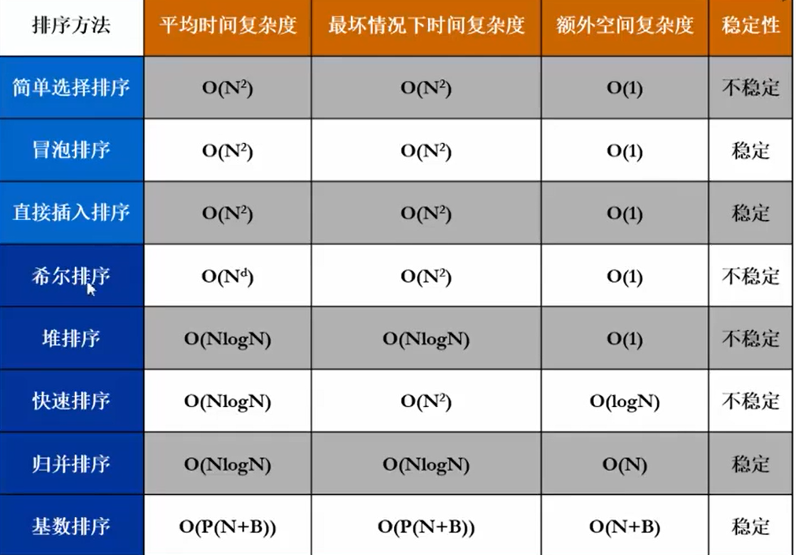

## Hash Table
### Intro
如何快速搜索到需要的关键词, 如果关键词不方便比较怎么办?
* 有序安排对象: 全序(二分)/ 半序(如BST)
* 直接算出对象的位置: hash

散列查找法的两个基本工作:
1. 计算位置: 沟造合适的散列函数确定关键词存储位置
2. 解决冲突: 应用策略解决多个关键词位置相同的问题

具体实现的是一个符号表,"名字(name) - 属性(attribute)" 对的集合.

//TODO:vedio 126