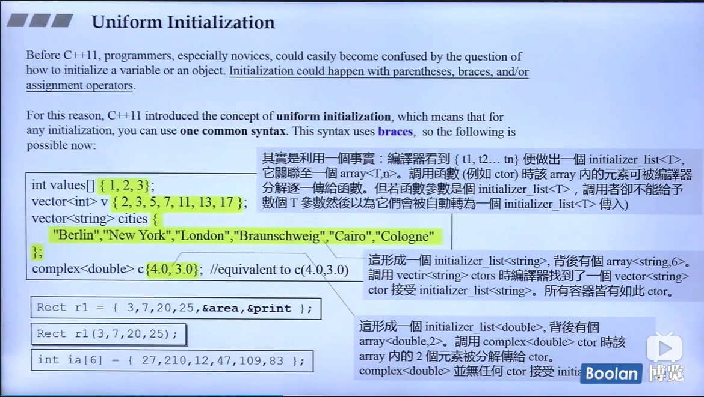

# Hou Jie C++ 11 新特性

## 演进 环境 与资源

重要的帮助网页:
- cplusplus.com
- cppreference.com
- gcc.gnu.org

全文检索工具 : wingrep,source insight

## Variadic Templates

可变参数函数的实例,帮助做recursive,n个写成 1 + 其他
```C++
void print(){}   // 一定要包含,不然args为空时候无法通过,相当于递归的base case
template <typename T, typename... Types>
void print(const T& fitstArg, const Types&... args){
    std::cout << fitstArg << std::endl;
    print(args...);
}
print(7.5,"hello",bitset<16>(377),43);
```
...为所谓的parameter pack,可以是模板参数包,函数参数包<font color=red> sizeof...(args) 可以得到参数的个数 </font>.
<br>
函数可以有多个候选,优先调用特化的版本,没有的时候才调用泛化的版本.tuple(任意个数的任意东西)的实现就是一个例子:<br>
<br>

## 一些小的语法变动

```c++
vector<list<int> >;//在过去要留一个空格,否则会认为这个 >> 是一个操作符
vector<list<int>>  // since c++ 11
```

c++ 11 使用**nullptr** instead of 0 or NULL, 在之前,如果重载函数`f(int)`和`f(int*)`, 那么`f(NULL)`就无法确定调用哪个,出现二义性. nullptr它是一个`std::nullptr_t` : <br>
```c++
typedef decltype(nullptr) nullptr_t;
```

**auto** 一般是在很长或者很复杂的时候使用, 自己要清楚变量的类型.
```C++
vector<string> v;
...
//pos 是 std::vector<std::string>::iterator
auto pos = v.begin();
// 另一个例子, l是一个表现lambda表达式的对象
auto l = [](int x) ->bool{
    ...
};
```

**一致初始化** 在过去,初始化一个对象怎么写,让新手十分困惑,它可能发生在小括号\大括号\assignment operator中,在新的标准中,任何初始化都可以用**one common syntax**:在变量后面直接放大括号.<br>
<br>

- 大多时候`array<T,n>`中的元素一个一个拿出来给 ctor.
- 若ctor函数参数就是`initializer_list`,黄色的部分就整包发过去,调用者需要注意这点

## Initializer Lists

```C++
int i;    // i has undefined value
int j{};  // j is initialized by 0
int* p{}; // p us initialized by nullptr
```
这种初始化**不允许窄化**:<br>
<br>
`std::initialized_list<>` 是 C++ 的 class template, 参数可变模板比这个更方便的是, 这个需要任意个数同样的类型.<br>
<br>
`initialized_list<>`背后是一个`array`, array 在c++ 11 中接口类似于其他的容器, initializer_list指向这个array但是 **without containing them**, copy的话只是一个浅拷贝. 它的存在相当大程度影响了标准库的实现, 如 vector用这个方式实现会简化很多,实现的min/max等算法也可以接受多个参数(旧版本依然存在,只接受两个参数).<br>
<br>

## explicit for ctor taking more than one argument

在2.0之前,// todo: 2min in vedio 7 

## range-based for statement

```C++
for(decl : coll){
    statement
}
```
将coll中的对象一个一个拿出来赋值给左边, 然后做statement中的动作, 相当于用迭代器全部走一遍. **no explicit type conversions are possible in such decalation** :
```C++
class C {
    public:
        explicit C(const std::string&s);
    ...
};
std::vector<std::string> vs;
for(const C& elem :vs){// ERROR: no conversion form string to C
    //do something
}
```

## =default, =delete

- 强制加上 =default,重新获得并且使用default 构造函数
- 加上 =delete, 表示不要这个该构造函数

一般用于**Big-3**(其实有4个+右值引用)函数中,default什么时候可以使用什么时候会出错见下图:
<br>
如果是非Big-3,**编译器不会自动生成,然后令他为default会报错**,但是其他member function, 不需要的话不声明即可,**声明后令他为delete也不会报错** .如果不自己声明的话,C++有默认的Big-3 函数并且它们是public 并且inline的.<br>
什么类需要自己写Big-3? 一般而言, 只要 data member有指针, 那样都需要自己写Big-3. 如:

- complex<T> , 默认的拷贝data member就可以了
- string包含一个指针, 指针有浅拷贝和深拷贝(指针指向内存中的字符串也要拷贝过去), 默认的浅拷贝是不够的

### No-Copy and Private-Copy

No-Copy 跟拷贝有关的都写成`=delete`, NoDtor 使用delete需要后果自负.  还有一种做法,把拷贝构造和拷贝赋值放到private中, 不允许一般的code去 copy, 但是可以对friends 和 members 拷贝. 在boost::noncopyable中就是用类似的方法实现的, 继承它的话就有它的性质, 只有friends 和 member可以拷贝.

## Alias Template
```C++
template <typename T>
using Vec = std::vector<T, MyAlloc<T>>; // 这个vector 使用我自己写的allocator
Vec<int> coll;
// is equivalent to
std::vector<int, MyAlloc<T>> coll;
```
用typedef无法实现,因为这样无法接受一个int作为参数, 类似的结果用macro无法实现. **做了化名之后无法做特化和偏特化** . <br>
<br>
希望使用`test_moveable(Container cntr, T elem)`测试可不可搬移(C++2.0 新语法), 希望取出容器(是一个模板)的类型并且容器做insert动作, typename+小括号为临时对象,list要加尖括号才是全名(有省略), 传入的为一个object,新的解法就是把迭代器取出来放到萃取机(traits),取出来作为Valtype:<br>
<br> 
假设容器没有迭代器,迭代器没有traits的情况呢(标准库不会出现这个问题).

## template template parameter
//TODO: v11.6 to lamda

## Lambdas 

C++ 11 引入了lambdas, 允许定义一个inline functionality, 用于当做是parameter or local对象, 它改变了我们对c++标准库的使用方式.

# 内存管理-从平地到万丈高楼
## 第一讲: primitives
我们的目标是从最基础的C++语言构建到高知名度的内存管理器,彻底了解内存管理高高低低的方方面面.<br>
Doug Lea的作品 DL Malloc,主页 `gee.cs.oswego.edu.cn/dl/`, 推荐的书籍:

1. STL源代码剖析, Chap 2
2. Modern C++ Design, Chap 4
3. Small Memory Software (相对抽象)

<br>
// TODO: vedio 3 2 min