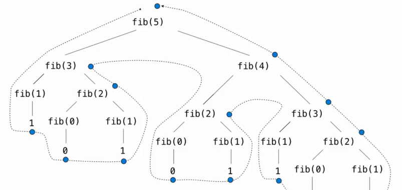
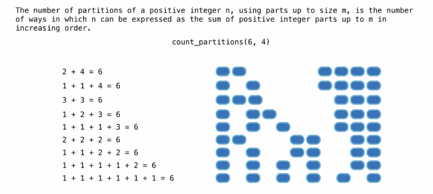
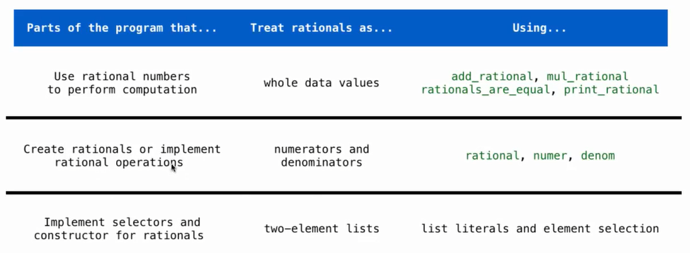
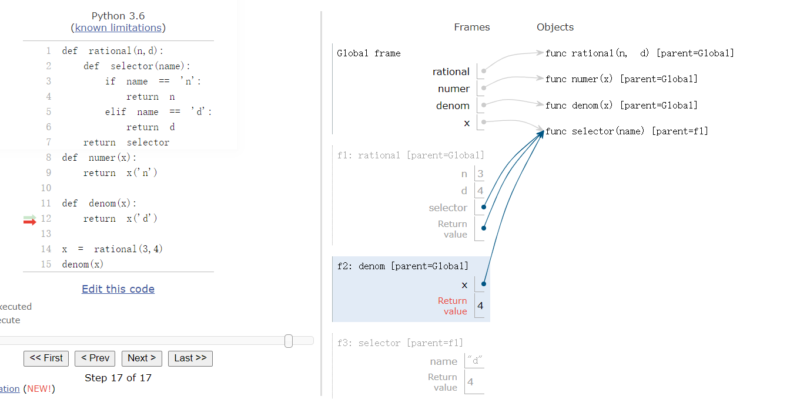
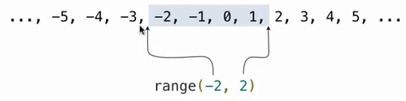
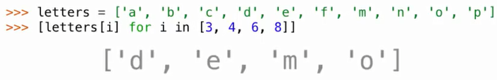
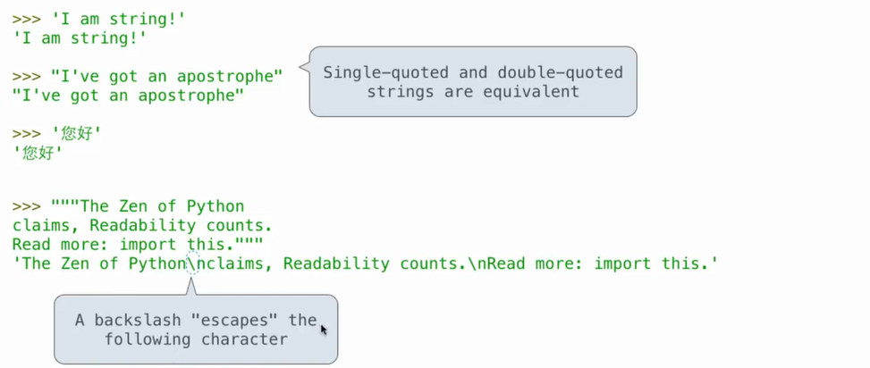
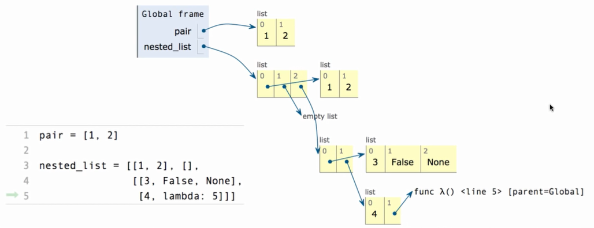
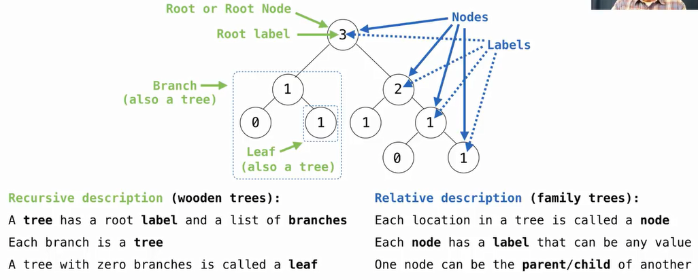

# CS 61A: Structure and Interpretation of Computer Programs 
## Lecture 1: Intro

### What is Computer Science

* 什么样的问题可以通过计算解决
  * Systems/ AI/ Graphics/ 安全/ 计算机网络 ...(每个 sub field 都有很多 sub sub field...)
* 怎样解决这些问题
* 怎样的方法可以找到高效的 solution

所有的计算机领域都要面对一个问题: managing complexity.

### What is CS 61 About

* 管理 复杂度
  * mastering abstraction
  * 编程范式
* Introduction to Programming
  * 全面理解 python 的基础
  * 通过 Implementation 来学习
  * 计算机怎样翻译编程语言

### 表达式

一个表达式描述了一个计算过程并且计算得到其值. 所有的表达式都可以用函数调用来表示

```python
max(2,4)
from operator import mul, add
mul(2,3)
mul(add(2,3),mul(3,5))
```

#### 剖析表达式调用过程

<br>

call 一个函数有特定的形式, 在括号之前的是操作符(operator), 括号之间是操作数(operand, 中间用逗号隔开),操作符和操作数都是表达式, 他们都要 evaluate 成 value, **并且可以嵌套**:

* 首先 evaluate 操作符然后 evaluate 操作数的 subexpressions

* 把从 operator 中 evaluate 得到的 function作用到从 operand subexpression 解析得到的 arguments 上

  <br>

上面的表达式树就是解析表达式的实际过程, 是自下向上解析的. 

#### Functions , Objects and Interpreters

```python
from urllib.request import urlopen
shakespeare = urlopen("http://inst.eecs.berkeley.edu/~cs61a/fa11/shakespeare.txt")
words=set(shakespeare.read().decode().split())
{w for w in words if w[::-1] in words and len(w) == 6}
```

## Lecture 2: Names, Assignment, and User-Defined Functions


assign 的作用是将表达式的值赋予某个变量, 它并不知道值是如何来的:

```python
from math import pi
radius = 10
aera, circle = pi * radius ** 2, 2 * pi * radius
radius = 20 # doesn't change the value of aera
```

此外, names 还可以 Bind to functions:

```python
f = max
f(1,2,3)
max = 7
f(1,2,max)
max = f
```

我们可以使用 `define` 定义自己的函数, 它和值得区别在于, 每次使用的时候都 revaluate 表达式得到的值:

```python
def aera():
    return pi * radius ** 2
radius = 10 
aere()  # Now, it changes 
```

#### 表达式的类型

* primitive 表达式: `2`(number) `add`(Name) `'hello'`(string)
* Call expressions: `max(2,3)` (with operator and operands)

#### Environment Diagrams

使用在线[可视化的界面](http://pythontutor.com/composingprograms.html)观察程序运行的结果, 其基本的界面如下:<br>

<br>

我们对于程序运行过程中的困惑都可以使用该工具来观察:

* assignment statement: 实际上就是 change binding between names and values
  * 首先从左到右 evaluate 等号右边的所有表达式
  * 然后再当下的 frame 中将所有的值 bind 到等号左边的 name 中
  
 ###  Defining Functions

赋值是一种简单的抽象方式, 把 Names 和  Values 绑定在一起, 而 函数定义是更强大的抽象方式, 它 **将 names 和 expressions binding together** :
 ```python
def <name> (<formal parameters>):
  return <return expressions>
 ```

执行 def statement 的顺序如下:

1. 创建一个带有签名(<函数名> (<参数列表>)) 的函数
2. 将所有缩进的 expressions 都设置为函数体
3. 将 names 和函数绑定在一起

#### calling User-Defined Functions

1. 新建一个 Local Frame, 形成一个新的环境
2. 将函数的formal parameters 和该 frame 中的 arguments 绑定
3. 在新的环境中执行函数体

函数的签名非常重要, 他们帮助形成函数调用需要的 local frame. 


#### 在环境中查找 names

理解这部分需要记住两个事情:

1. 一个环境就是 a sequence of frames

2. name evaluates 得到的值和沿着sequence of frames 最早找到的值 <br>

   <br>


## Lecture 3: Control

#### `print` 和 evaluate 的区别

`None` 是一个 special value, 在 python 中代表 nothing. 一个函数如果没有 **显式指定返回值, 那么就会返回`None`**.  但是在 interpreter 中是不会自动 display 的. 


#### Pure Functions & Non-Pure Functions

* Pure Functions: just return values `abs(-2)`, `pow(2, 10)`, ...

* Non-Pure Functions: have side effects, print(-2), input -2, return `None`, side effect 是在终端打印了"-2", side effect 不一定是修改值

  <br>

### Environment
* Def statement: 执行后创建一个新的函数, 在当前frame 中将 function name 和 Body 绑定在一起
* Call expression: evaluate Operator 和 Operand(函数以 operand 为参数调用)
* Calling/Applying: 创建一个新的 frame, 参数绑定到 arguments 中, 在新的 frame 中执行函数体

An Environment 是 sequence of frames:
* The global frame alone
* Function calls introduce multi-frame environment, a local frame , then a global frame

Names 在不同的 environment 中可能有不同的含义:
```python
from operator import mul
def square(square):
    return mul(square,square)
square(4)
```
<br>
### 一些python 特性
#### Operators
我们可以认为这是一种 Built-In functions, 值得注意的是有两种除法:
```python
from operator import truediv, floordiv,mod
2013 / 10 # result is 201.3, truediv(2013,10)
2013 // 10 # result is 201, floordiv(2013,10)
2013 % 10 # result is 2, mod(2013, 10)
```
#### 多个返回值
我们可以在一个语句中给多个 Names 赋值, 同样的一个函数也可以有多个返回值
```python

def divide_exact(n, d=10):
  """ return the quotient and remainder 

  >>> q,r = divide_exact(2013,10)
  >>> q
  201
  >>> r
  3
  """
    return n//d, n%d
quotient,remainder = divide_exact(2013,10)
```

#### 运行 python 文件中的代码
```zsh
$ python -i someFile.py # 交互模式运行
$ python someFile.py    # 直接运行
$ python -m doctest -v lecture01.py # 运行的时候可以进行单元测试
Trying:
    q,r = divide_exact(2013,10)
Expecting nothing
ok
Trying:
    q
Expecting:
    201
ok
Trying:
    r
Expecting:
    3
ok
```
#### statements
A statement is executed by the interpreter to **perform an action**. <br>
<br>
布尔表达式:
* false in python: False , 0, '', None (more to come)
* True values in Python: Anything Else

### 迭代
#### While Statement 的执行规则
1. evaluate header 表达式
2. 如果它为 True, 执行整个 suite, 然后回到 step 1.

## Lecture 4: High-Order Functions
### Designing Functions
函数的特点:
* 函数的 Domain 是 set of possible arguments
* 函数的 Range 是 set of possible return value
* pure 函数的行为是输入和输出的关系

函数设计的 Guide:
* 单一职责: 给每个函数 exactly 一个 Job
* Don't Repeat Youself
* 定义更加通用的 函数

### High-Order functions
我们可以让一个函数更加 general, 如对于不同的数列求和 从 1 到 k, 可以先写出不同数列的通项公式, 然后再调用求和函数:
```python
def identity(k):
  return k

def cube(k):
  return pow(k,3)

def summation(n, func):
  """ sum the first N terms of a sequence 

  >>> summation(5,cube)
  225
  """
  total, k = 0, 1
  while k <= n:
    total, k = total + func(k), k+1
  return total

def sum_cubes(n)
  summation(n, cube)
```
这实际上就是引入了 High-Order function: **a function that take another function as argument or return a function as a return value**. 同样的, 函数除了作为参数还可以作为返回值:
```python
def make_adder(n):
	def adder(k):
		return k + n
	return adder

adder_three = make_adder(3)
adder_three(4) 
# return 7
```
<br>
#### The Purpose of High-Order Functions
* Functions are first-class: 函数可以像值一样使用
  * 可以像计算一样表达 general methods
  * 减少程序中的重复
  * 减少functions 之间的影响

### lambda 表达式
可以使用lamnda 表达式定义一个很简单的函数:
```python
>>> square = lambda x: x * x
>>> square(10)
100
```
这里lambda 参数可以有多个, 和其他的语言中的不同, 这里的 lambda 没有 return 关键词, 而且只能是一个简单的表达式, 和赋值不同, 这个表达式返回的是一个函数而不是值.作为对比, C++ 中的 lambda 表达式就可以有多个语句
```C++
auto f = [](double x)->double {
    		auto temp = x -1;
           return x * (temp+1);
			}
```
#### lambda 表达式 和 def 语句的比较
<br>
区别不是很明显, lambda 先创建一个匿名函数然后通过赋值语句绑定到上面, 而 def 则没有这种先后顺序.<br>

## Lecture 5: 环境
### High-Order Functions 的调用环境
调用一个的 user-defined 函数:
* 创建一个新的 frame
* 将 formal parameter (f和x) 绑定到参数上
* 执行函数体, 返回 f(f(x))
  * 在执行高阶函数内的函数的时候, 也会创建一个新的 frame, 将参数绑定, 然后执行函数体

### Nested definition 的环境
<br>
可以看到, 在没有返回的时候, global frame 是无法 refer to Local frame 中新建的 adder 函数. adder 函数调用的时候, 它的 parent frame 实际上是 make_adder. 需要在 adder 中 Look up for names 时, 现在 adder 的 frame 中查找, 然后在 make_adder 中, 然后才是 Global frame:

* 每个用户自定义的函数都有一个parent frame, 通常是 global
* 它的 parent frame 就是定义函数所在的 frame
* 每个 local frame 也都有一个 parent frame
* 它的 parent frame 就是 function call 所在的 frame

### Local Names
Local Name 在其他非嵌套的函数中是不可见的:<br>
<br>
上面的例子中, f 函数 locally 将 y 绑定为 2, 但是 g 中需要查找 y 的时候, g local frame 中没有, global 中也没有, 就会报错. 而之前的 Make_adder 中生成的 adder 函数就可以找到 make_adder local frame 的 names, 因为他们是 nested.

### Function Composition
<br>

## Lecture 06: Iteration
### Return statement
一个返回语句完成call 语句的求值返回需要的值:
  * f(x) 对于用户自定义的函数 f 做了一下事情: 转到新的环境中, 执行函数体
  * f 中 return 语句做的事情: 回到之前的环境, f(x) 现在有了一个新的值 

在执行语句的时候只有其中一个 return 语句会被执行, 执行完就退出了.

### Self-Reference
```python
def printSums(x):
	print(x)
  def printSum(y):
    return printSums(x+y)
	return printSum

printSums(1)(2)(3)
```
<br>

## Lecture 7: Recursion
### 递归函数
递归函数是在函数体中调用函数自身的函数, 这种调用可以是直接的也可以是间接的. 它的具体结构有下面几个特点:
* def 声明语句和其他函数一样
* 条件语句先检查 base cases 直接求值
* 递归的 case 使用递归调用求值

```python
def split(n):
	return n // 10, n % 10

def sum_of_digits(n):
	if n < 10:
		return n 
	else:
		all_but_last, last = split(n)
		return sum_of_digits(all_but_last) + last 
```
#### 递归函数的环境图解
<br>
* 同一个函数被多次调用
* 在不同的frame 中 track 每次调用中的 argument
* n 的值取决于具体所在的调用环境

递归和迭代的比较:<br>
<br>

#### 递归函数正确性的检查
* 检查 base case 的 正确性
* 将 函数看成是一个 functional 抽象
* 假设 n-1 是正确的
* 在此基础上检查 n 的case 是否正确

### 将递归转为迭代
Iteration is a special case of recursion. 转换的核心在于找出哪个 state 一定要在 iterative 函数中维护.例如在 sum_of_digits(n) 的例子中, 我们需要维护的量实际上是 partial_sum, 即 sum_of_digits(all_but_last):
```python
def sum_of_digits_iter(n):
  partial_sum = 0
  while n > 0:
    n, last = split(n)
    partial_sum = partial_sum + last
  return partial_sum
```
在每次的迭代中, 更新需要维护的 status. 

## Lecture 8: 树递归
### 递归调用的顺序
在一个递归函数的函数体中调用函数本身, 首先执行被调用的函数返回结果, 之后才会往后运行. 这意味着被调用的函数先执行完. 
<br>
这个结果就是上面的输出短的序列被长的夹在中间. 在实现的时候, 我们还可以写成更简单的形式:
```python
def cascade(n):
  print(n)
  if n >= 10:
    cascade(n // 10)
    print(n)
```
<br>
这代码的意思, 就是 grow 函数要求先 n 变小, 然后 print, 而 srink 要求 print 发生在 n 减小之前, 这个名字 grow 可能带来一些误解. <br>

### 树递归
无论何时在一个递归函数体调用超过一次本函数,就会引发树形状的递归调用过程. 如一般递归实现的斐波那契数列就在 return 语句中有两个函数调用:
```python
def fib(n):
  if n==0 or n == 1:
    return n
  else :
    return fib(n-1) + fib(n-1)
```
<br>
函数的调用过程有点像树的后序遍历, 要先知道两个子数调用的结果才能知道自己的值, 函数执行效率低的原因是数中有很多重复的函数调用.<br>

### 例: counting partitions

<br>

* 首先找到一个能够递归分解问题的方式, 将复杂的问题用该问题的一个更简单的实例替代
* 在这里我们就用讨论两种可能性:
  - 使用至少一次 4 
  - 不使用任何4 
* 于是 `count_partitions(6,4)` 就简化成两个更简单的问题:
  * `count_partition(2,4)`
  * `count_partition(6,3)`

```python
def count_partitions(n,m):
    if n == 0:
        return 1
    elif n < 0:
        return 0
    elif m == 0:
        return 0
    else:
        with_m = count_partitions(n-m, m)
        without_m = count_partitions(n-1, m)
        return with_m + without_m
```

## Lecture 9: Function Examples

### 函数抽象
函数抽象使得我们在调用的时候只需要知道函数的参数和行为, 而不用关注其具体的内部实现.在选择函数参数名称的时候有下面几个建议:
* names 应该表达他们绑定值的 meaning
* 绑定到 Name 中的值类型最好在函数的 docstring 中记录
* 函数名应该表达其effect(print)/行为(triple) 或者返回值 (abs)
* 如果长的函数名可以帮助 document your code, 那么就应该这么做
* 如果是用来表达 generic quantities,如 数目/任意的函数/ 数学操作的参数, 那么就可以取一个短的名字

### TDD
测试驱动开发(TDD) 要求我们在实现函数前先写出函数的 test:
* 可以明确函数的 domain/range/ behavior
* 可以帮助确认复杂的 edge cases

增量开发, 在继续新工作前测试每个 piece:
* 我们不能依靠没有测试过的代码
* 如果更改了代码, 重新运行老的测试

交互式地运行程序:
* 不要害怕写完程序后的 experiment
* 交互式的session 可以拷贝称为 docstring 的一部分

```python
def gcd(m,n):
    """Returns the largest k that devides both m and n
    
    k, m, n are all possitive interger
    >>> gcd(25,10)
    10
    >>> gcd(8, 16)
    8
    >>> gcd(5,5)
    5
    """

```

### 函数科里化(currying)
```python
def make_adder(k)
  return lambda n : n + k

>>> make_adder(2)(3)
5
>> add(2,3)
5
```
这两个调用之间的区别在于: 一个是调用两次函数, 一次调用返回一个函数然后再通过函数调用返回值. 另一个是直接调用带有两个参数的函数直接返回值. 
```python
def curry2(f):
	def g(x):
		def h(y):
			return f(x,y)
		return h 
	return g 

curruy2 = lambda f: lambda x : lambda y : f(x,y)
```
科里化: **将一个多参数的函数转化为一个单参数, 高阶的函数**.在理论计算机科学中，柯里化提供了在简单的理论模型中，比如：只接受一个单一参数的lambda演算中，研究带有多个参数的函数的方式。

### 函数修饰器(decorator)
```python
@trace1
def triple(x):
  return 3 * x
# 和下面的语句等价
def triple(x):
  return 3 * x
triple = trace1(triple)
```
简单地说：他们是修改其他函数的功能的函数, 有助于让我们的代码更简短，也更Pythonic. 

## Lecture 10: Data Abstraction
复合(compound)对象将不同的对象组合在一起, 抽象数据类型让我们能够像一个单元那样操纵复合对象, 将两个部分分开:
* 我们怎样去表示数据
* 我们怎样操作/使用数据

### Pair
可以使用list 表示pair:
```python
>>> pair = [1, 2]
>>> x, y = pair
>>> x
1
>>> from operator import getitem
>>> getitem(pair, 0)
1
```
这时候我们可以定义出表示有理数ADT 的构造函数, 在构造函数中加入约分的性质之后就无需在加减乘除中做这种变化了:
```python
from fractions import gcd

def rational(n,d)
  g = gcd(n,d)
  return [n//g,d//g]

def numer(x):
  return x[0]
def denom(x):
  return x[1]
```

### Abstraction Barriers
<br>
下面的操作就违反了 abstraction Barriers:
```python
add_rational([1,2],[1,4])
def add_rational(x,y):
  return [x[0]*y[1], x[1]*y[0]]
```
上面的一段代码违反了很多东西:
* 定义有理数直接用 list 而不是使用构造函数
* 假定rational 内部用 list 实现而直接使用下标取分子分母
* 返回时候也没有使用构造函数

### Data Representations
* 我们需要构造函数和 selector 函数合作实现正确的行为
* 数据抽象使用 selector 和 constructor 去定义行为
* 如果行为的条件被满足, 那么 representation 就是对的

我们可以根据它的行为去辨别出数据抽象. 我们可以改变有理数背后的实现, 之前使用一个list, 现在完全可以使用函数:
```python
def rational(n,d):
  def selector(name):
    if name == 'n':
      return n
    elif name == 'd':
      return d
  return selector
def numer(x):
  return x('n')

def denom(x):
  return x('d')
```
改变实现后, 加减乘除之类的运算不需要做任何改变即可正确运行. <br>
<br>

## Lecture 11: Containers
### List
list 在 python 是使用 `[]` 括起来表示, 序列中的每个元素都分配一个数字 - 它的位置，或索引. 
```python
>>> odds = [41, 43, 47]
>>> odds[0]
41
>>> len(odds)
3
>>> [2,7] + odds * 2
[2, 7, 41, 43, 47, 41, 43, 47]
```
从上面的例子中可以看到, python 的 list 支持下面的操作:
* 得到 list 中元素的个数 `len(odds)`
* 使用 index 访问元素 `odds[0]`/`getitem(odds, 0)`
* 同时可以concatenation(串接) 和 重复(`[2, 7] + odds * 2`/ `add([2,7], mul(odds,2))`)
* list 同时可以嵌套`pairs[[19,20], [21,22]]`

### Containers
list 这种容器支持 in operator:
```python
>>> 1 in [1, 2, 3]
True
>>> [1, 2] in [1, 2, 3]
False
>>> [1, 2] in [[1,2], 3]
True
```
这个操作实际上就是将 list 中的每个元素单独拿出来对比, 看查找的元素在不在其中. 

### For Statement
```python
for <name> in <expression>:
  <suite>
```
1. 对 \<expression> 求值, 对方必须是一个 iterable value(a sequence)
2. 对于 sequence 中的每个元素:
   1. 在 current frame 中将 element 和 <name> 绑定在一起
   2. 执行 \<suite>

在 for 语句中甚至可以将 element unpack(要求sequence中每个元素等长), 这个过程有点像 mutable assignment:
```python
pairs = [[1,2],[1,1],[2,3],[3,3]]
same_count = 0
for x,y in pairs:
  if x == y:
    same_count = same_count +1
print(same_count)
```

### Ranges
The range type: 一个连续的整数组成的 sequence.<br>
<br>
* length : 就是 ending 值 - 初始值
* 选择的element: starting value + index

同时我们可以调用list constructor 将 range 转化为 list
```python
>>> list(range(-2,2))
[-2,-1, 0, 1]
>>> list(range(4))
[0, 1, 2, 3]

```
### List Comprehensions
<br>
我们可以在 list 中做很多操作, 下面是个例子:
```shell
>>> odds = [1,3,5,7,9]
>>> [x for x in odds if 25%x==0]
[1, 5]
```
### String
String 是一种抽象, 可以代表 data/ language/ programs:
```python
>>> 'curry = lambda f: lambda x: lambda y: f(x,y)'
'curry = lambda f: lambda x: lambda y: f(x,y)'
>>> exec('curry = lambda f: lambda x: lambda y: f(x,y)')
>>> curry
<function <lambda> at 0x000001C5303271F0>
```
它可以用三种方式表示:<br>
<br>
此外, String 也是 sequence, 可以用 `len(str)`, 也可以用 index 得到其中一个元素(也是 String), 值得注意的是 **String 的 in operator 和 list 不同**:

```python
>>> 'hell' in 'hello world'
True
```

### 字典
这个容器让我们能够将 key 和 value 关联起来, 之后我们可以用 Key 来查找元素(它们是无序的), 但是不能用value去查找:
```python
>>> {'I': 1, 'V': 5, 'X':10}
{'I': 1, 'V': 5, 'X': 10}
>>> num = {'I': 1, 'V': 5, 'X':10}
>>> num['I']
1
>>> 'I' in num
True
>>> 10 in num
False
>>> num.values()
dict_values([1, 5, 10])
>>> num.keys()
dict_keys(['I', 'V', 'X'])
>>> num.items()
dict_items([('I', 1), ('V', 5), ('X', 10)])
```
字典提供了很多操作方便我们使用, 同样的也有 Comprehensions:
```python
>>> {x:x**2 for x in range(4)}
{0: 0, 1: 1, 2: 4, 3: 9}
```
我们不能有两个 key, 这会被认为是重写 Key 对应的 value:
```python
>>> {1:2, 1:3}
{1: 3}
```
同时 Key 不能是list/dictionary 这种 unhashable 的对象:
```shell
>>> {[1]:"hello"}
Traceback (most recent call last):
  File "<stdin>", line 1, in <module>
TypeError: unhashable type: 'list'
```

## Lecture 12: trees

### Box and Pointer Notation

环境的图示中加入了这个notation 是因为 Data Type 的 Closure 特性: **结果的组合本身可以用同样的 method 组合在一起**. 这个特性非常强大, 它允许我们创建 hierarchical(层次的)结构. 例如, list 可以包含一个list 对象作为一个元素:<br>

<br>

### Slicing(切片)

```python
>>> odds = [3, 5, 7, 9, 11]
>>> [odds[i] for i in range(1,4)]
[5, 7, 9]
>>> odds[1:4]
[5, 7, 9]
```

切片用一种更简单的方式去实现上面两行代码实现的功能, 此外还可以更简单省略初始/结束/初始+结束的index:

```python
>>> odds[:4]
[3, 5, 7, 9]
>>> odds[2:]
[7, 9, 11]
>>> odds[:]
[3, 5, 7, 9, 11]
```

**切片产生的是一个新的对象(values)**. 


### 处理容器的值

偶很多 built-in 函数处理一个可迭代的参数汇总成一个值:

* `sum(iterable[, start])`->value [,start] 中的方括号表示一个可选参数

* `max(iterable [, key=func])`->value 返回最大元素

  ```python
  max(range(10), key = lambda x: 7 - (x-3)*x)
  ```

* `all(iterable)`-> bool 如果 其中的值都是 true, 返回 True, iterable 为空依旧返回 True.

### Trees

<br>

#### 实现一个树

* 一个 tree 有 root label 和一个list 的 branch
* 每个 branch 都是一棵树

```python
def tree(label, branches =[]):
    for branch in branches:
        assert is_tree(branch)
    return [label] + list(branches)
def label(tree):
    return tree[0]
def branches(tree):
    return tree[1:]
def is_tree(tree):
    if type(tree)!= list or len(tree)<1:
        return False
    for branch in branches(tree):
        if not is_tree(branch):
        	return False
    return True
def is_leaf(tree):
    return not branches(tree)
```

在这种实现种, tree 就有一个root label 和 branches 构成的 list.

#### Tree Processing

很多事后涉及树的处理我们都是使用递归来实现的, 例如想要生成一个斐波那契树:

```Python
def fib_tree(n):
    if n <= 1:
        return tree(n)
    else:
        left, right = fib_tree(n-2), fib_tree(n-1)
        return tree(label(left)+label(right),[left, right])
```

一个从其他树中创建新的树的函数经常也是递归的,例如:

```python
def increment(t):
    return tree(label(t)+1,[increment(b) for b in branches(t)])
```

当我们遇到叶节点的时候, 上面的for statement 产生一个空的list, 递归停止即可. 

```python
def print_tree(t,indent = 0):
    print('*'* indent + str(label(t)))
    for branch in branches(t):
        print_tree(branch, indent +1)
```

## Lecture 13: Mutable Values

### Python 中的对象

* 对象可以表示信息
* 它们由data 和 behavior 组成, 绑定在一起形成抽象
* 对象可以表示事务, 可以表示属性/进程/Interaction
* 有种对象是被称为一个类, classes are first-class values in python
* 在 python 中, 所有的值都是一个对象
  * 所有对象都有属性
  * 可以通过方法做很多数据操作
  * 函数只做一件事情, 对象可以做很多相关的事情

### Mutation 操作

