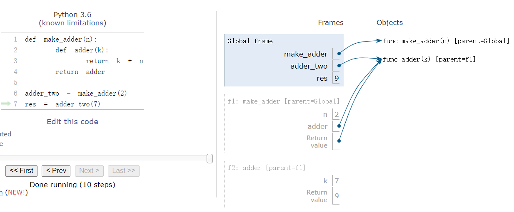

# CS 61A: Structure and Interpretation of Computer Programs 
## Lecture 1: Intro

### What is Computer Science

* 什么样的问题可以通过计算解决
  * Systems/ AI/ Graphics/ 安全/ 计算机网络 ...(每个 sub field 都有很多 sub sub field...)
* 怎样解决这些问题
* 怎样的方法可以找到高效的 solution

所有的计算机领域都要面对一个问题: managing complexity.

### What is CS 61 About

* 管理 复杂度
  * mastering abstraction
  * 编程范式
* Introduction to Programming
  * 全面理解 python 的基础
  * 通过 Implementation 来学习
  * 计算机怎样翻译编程语言

### 表达式

一个表达式描述了一个计算过程并且计算得到其值. 所有的表达式都可以用函数调用来表示

```python
max(2,4)
from operator import mul, add
mul(2,3)
mul(add(2,3),mul(3,5))
```

#### 剖析表达式调用过程

<br>

call 一个函数有特定的形式, 在括号之前的是操作符(operator), 括号之间是操作数(operand, 中间用逗号隔开),操作符和操作数都是表达式, 他们都要 evaluate 成 value, **并且可以嵌套**:

* 首先 evaluate 操作符然后 evaluate 操作数的 subexpressions

* 把从 operator 中 evaluate 得到的 function作用到从 operand subexpression 解析得到的 arguments 上

  <br>

上面的表达式树就是解析表达式的实际过程, 是自下向上解析的. 

#### Functions , Objects and Interpreters

```python
from urllib.request import urlopen
shakespeare = urlopen("http://inst.eecs.berkeley.edu/~cs61a/fa11/shakespeare.txt")
words=set(shakespeare.read().decode().split())
{w for w in words if w[::-1] in words and len(w) == 6}
```

## Lecture 2: Names, Assignment, and User-Defined Functions


assign 的作用是将表达式的值赋予某个变量, 它并不知道值是如何来的:

```python
from math import pi
radius = 10
aera, circle = pi * radius ** 2, 2 * pi * radius
radius = 20 # doesn't change the value of aera
```

此外, names 还可以 Bind to functions:

```python
f = max
f(1,2,3)
max = 7
f(1,2,max)
max = f
```

我们可以使用 `define` 定义自己的函数, 它和值得区别在于, 每次使用的时候都 revaluate 表达式得到的值:

```python
def aera():
    return pi * radius ** 2
radius = 10 
aere()  # Now, it changes 
```

#### 表达式的类型

* primitive 表达式: `2`(number) `add`(Name) `'hello'`(string)
* Call expressions: `max(2,3)` (with operator and operands)

#### Environment Diagrams

使用在线[可视化的界面](http://pythontutor.com/composingprograms.html)观察程序运行的结果, 其基本的界面如下:<br>

<br>

我们对于程序运行过程中的困惑都可以使用该工具来观察:

* assignment statement: 实际上就是 change binding between names and values
  * 首先从左到右 evaluate 等号右边的所有表达式
  * 然后再当下的 frame 中将所有的值 bind 到等号左边的 name 中
  
 ###  Defining Functions

赋值是一种简单的抽象方式, 把 Names 和  Values 绑定在一起, 而 函数定义是更强大的抽象方式, 它 **将 names 和 expressions binding together** :
 ```python
def <name> (<formal parameters>):
  return <return expressions>
 ```

执行 def statement 的顺序如下:

1. 创建一个带有签名(<函数名> (<参数列表>)) 的函数
2. 将所有缩进的 expressions 都设置为函数体
3. 将 names 和函数绑定在一起

#### calling User-Defined Functions

1. 新建一个 Local Frame, 形成一个新的环境
2. 将函数的formal parameters 和该 frame 中的 arguments 绑定
3. 在新的环境中执行函数体

函数的签名非常重要, 他们帮助形成函数调用需要的 local frame. 


#### 在环境中查找 names

理解这部分需要记住两个事情:

1. 一个环境就是 a sequence of frames

2. name evaluates 得到的值和沿着sequence of frames 最早找到的值 <br>

   <br>


## Lecture 3: Control

#### `print` 和 evaluate 的区别

`None` 是一个 special value, 在 python 中代表 nothing. 一个函数如果没有 **显式指定返回值, 那么就会返回`None`**.  但是在 interpreter 中是不会自动 display 的. 


#### Pure Functions & Non-Pure Functions

* Pure Functions: just return values `abs(-2)`, `pow(2, 10)`, ...

* Non-Pure Functions: have side effects, print(-2), input -2, return `None`, side effect 是在终端打印了"-2", side effect 不一定是修改值

  <br>

### Environment
* Def statement: 执行后创建一个新的函数, 在当前frame 中将 function name 和 Body 绑定在一起
* Call expression: evaluate Operator 和 Operand(函数以 operand 为参数调用)
* Calling/Applying: 创建一个新的 frame, 参数绑定到 arguments 中, 在新的 frame 中执行函数体

An Environment 是 sequence of frames:
* The global frame alone
* Function calls introduce multi-frame environment, a local frame , then a global frame

Names 在不同的 environment 中可能有不同的含义:
```python
from operator import mul
def square(square):
    return mul(square,square)
square(4)
```
<br>
### 一些python 特性
#### Operators
我们可以认为这是一种 Built-In functions, 值得注意的是有两种除法:
```python
from operator import truediv, floordiv,mod
2013 / 10 # result is 201.3, truediv(2013,10)
2013 // 10 # result is 201, floordiv(2013,10)
2013 % 10 # result is 2, mod(2013, 10)
```
#### 多个返回值
我们可以在一个语句中给多个 Names 赋值, 同样的一个函数也可以有多个返回值
```python

def divide_exact(n, d=10):
  """ return the quotient and remainder 

  >>> q,r = divide_exact(2013,10)
  >>> q
  201
  >>> r
  3
  """
    return n//d, n%d
quotient,remainder = divide_exact(2013,10)
```

#### 运行 python 文件中的代码
```zsh
$ python -i someFile.py # 交互模式运行
$ python someFile.py    # 直接运行
$ python -m doctest -v lecture01.py 
Trying:
    q,r = divide_exact(2013,10)
Expecting nothing
ok
Trying:
    q
Expecting:
    201
ok
Trying:
    r
Expecting:
    3
ok
```
#### statements
A statement is executed by the interpreter to **perform an action**. <br>
<br>
布尔表达式:
* false in python: False , 0, '', None (more to come)
* True values in Python: Anything Else

### 迭代
#### While Statement 的执行规则
1. evaluate header 表达式
2. 如果它为 True, 执行整个 suite, 然后回到 step 1.

## Lecture 4: High-Order Functions
### Designing Functions
函数的特点:
* 函数的 Domain 是 set of possible arguments
* 函数的 Range 是 set of possible return value
* pure 函数的行为是输入和输出的关系

函数设计的 Guide:
* 单一职责: 给每个函数 exactly 一个 Job
* Don't Repeat Youself
* 定义更加通用的 函数

### High-Order functions
我们可以让一个函数更加 general, 如对于不同的数列求和 从 1 到 k, 可以先写出不同数列的通项公式, 然后再调用求和函数:
```python
def identity(k):
  return k

def cube(k):
  return pow(k,3)

def summation(n, func):
  """ sum the first N terms of a sequence 

  >>> summation(5,cube)
  225
  """
  total, k = 0, 1
  while k <= n:
    total, k = total + func(k), k+1
  return total

def sum_cubes(n)
  summation(n, cube)
```
这实际上就是引入了 High-Order function: **a function that take another function as argument or return a function as a return value**. 同样的, 函数除了作为参数还可以作为返回值:
```python
def make_adder(n):
	def adder(k):
		return k + n
	return adder

adder_three = make_adder(3)
adder_three(4) 
# return 7
```
<br>
#### The Purpose of High-Order Functions
* Functions are first-class: 函数可以像值一样使用
  * 可以像计算一样表达 general methods
  * 减少程序中的重复
  * 减少functions 之间的影响

### lambda 表达式
可以使用lamnda 表达式定义一个很简单的函数:
```python
>>> square = lambda x: x * x
>>> square(10)
100
```
这里lambda 参数可以有多个, 和其他的语言中的不同, 这里的 lambda 没有 return 关键词, 而且只能是一个简单的表达式, 和赋值不同, 这个表达式返回的是一个函数而不是值.
```C++
auto f = [](double x)->double {return x * x;}
``` 
#### lambda 表达式 和 def 语句的比较
<br>
区别不是很明显, lambda 先创建一个匿名函数然后通过赋值语句绑定到上面, 而 def 则没有这种先后顺序.<br>

## Lecture 5: 环境
### High-Order Functions 的调用环境
调用一个的 user-defined 函数:
* 创建一个新的 frame
* 将 formal parameter (f和x) 绑定到参数上
* 执行函数体, 返回 f(f(x))
  * 在执行高阶函数内的函数的时候, 也会创建一个新的 frame, 将参数绑定, 然后执行函数体

### Nested defination 的环境
<br>
可以看到, 在没有返回的时候, global frame 是无法 refer to Loacl frame 中新建的 adder 函数. adder 函数调用的时候, 它的 parent frame 实际上是 make_adder. 需要在 adder 中 Look up for names 时, 现在 adder 的 frame 中查找, 然后在 make_adder 中, 然后才是 Global frame:
* 每个用户自定义的函数都有一个perent frame, 通常是 global
* 它的 parent frame 就是定义函数所在的 frame
* 每个 local frame 也都有一个 parent frame
* 它的 parent frame 就是 function call 所在的 frame

### Loacl Names
Local Name 在其他非嵌套的函数中是不可见的:<br>
<br>
上面的例子中, f 函数 locally 将 y 绑定为 2, 但是 g 中需要查找 y 的时候, g local frame 中没有, global 中也没有, 就会报错. 而之前的 Make_adder 中生成的 adder 函数就可以找到 make_adder local frame 的 names, 因为他们是 nested.

### Function Composition
<br>

## Lecture 06: Iteration
### Return statement
一个返回语句完成call 语句的求值返回需要的值:
  * f(x) 对于用户自定义的函数 f 做了一下事情: 转到新的环境中, 执行函数体
  * f 中 return 语句做的事情: 回到之前的环境, f(x) 现在有了一个新的值 

在执行语句的时候只有其中一个 return 语句会被执行, 执行完就退出了.

### Self-Reference
```python
def printSums(x):
	print(x)
  def printSum(y):
    return printSums(x+y)
	return printSum

printSums(1)(2)(3)
```
<br>

## Lecture 7: Recursion
### 递归函数
递归函数是在函数体中调用函数自身的函数, 这种调用可以是直接的也可以是间接的. 它的具体结构有下面几个特点:
* def 声明语句和其他函数一样
* 条件语句先检查 base cases 直接求值
* 递归的 case 使用递归调用求值

```python
def split(n):
	return n // 10, n % 10

def sum_of_digits(n):
	if n < 10:
		return n 
	else:
		all_but_last, last = split(n)
		return sum_of_digits(all_but_last) + last 
```
#### 递归函数的环境图解
<br>
* 同一个函数被多次调用
* 在不同的frame 中 track 每次调用中的 argument
* n 的值取决于具体所在的调用环境

递归和迭代的比较:<br>
<br>

#### 递归函数正确性的检查
* 检查 base case 的 正确性
* 将 函数看成是一个 functional 抽象
* 假设 n-1 是正确的
* 在此基础上检查 n 的case 是否正确

### 将递归转为迭代
Iteration is a special case of recursion. 转换的核心在于找出哪个 state 一定要在 iterative 函数中维护.例如在 sum_of_digits(n) 的例子中, 我们需要维护的量实际上是 partial_sum, 即 sum_of_digits(all_but_last):
```python
def sum_of_digits_iter(n):
  partial_sum = 0
  while n > 0:
    n, last = split(n)
    partial_sum = partial_sum + last
  return partial_sum
```
在每次的迭代中, 更新需要维护的 status. 

## Letcure 8: 树递归
### 递归调用的顺序
在一个递归函数的函数体中调用函数本身, 首先执行被调用的函数返回结果, 之后才会往后运行. 这意味着被调用的函数先执行完. 
<br>
这个结果就是上面的输出短的序列被长的夹在中间. 在实现的时候, 我们还可以写成更简单的形式:
```python
def cascade(n):
  print(n)
  if n >= 10:
    cascade(n // 10)
    print(n)
```
<br>
这代码的意思, 就是 grow 函数要求先 n 变小, 然后 print, 而 srink 要求 print 发生在 n 减小之前, 这个名字 grow 可能带来一些误解. <br>

### 数递归
