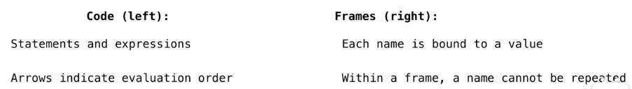
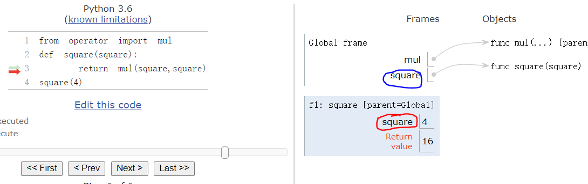
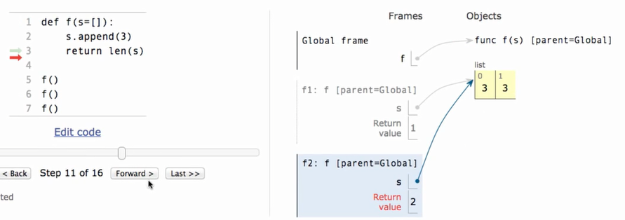
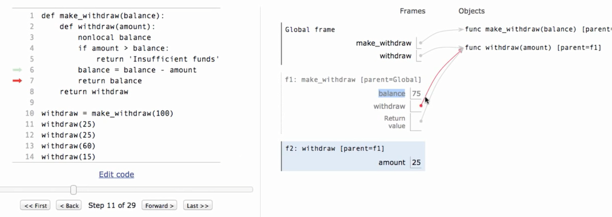
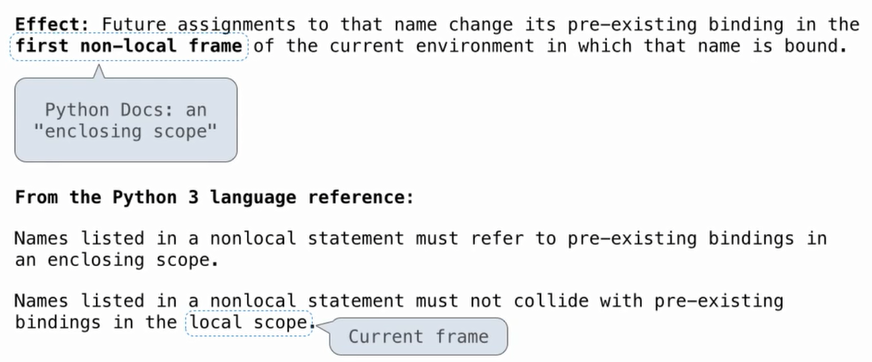
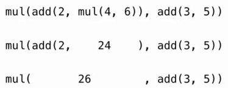
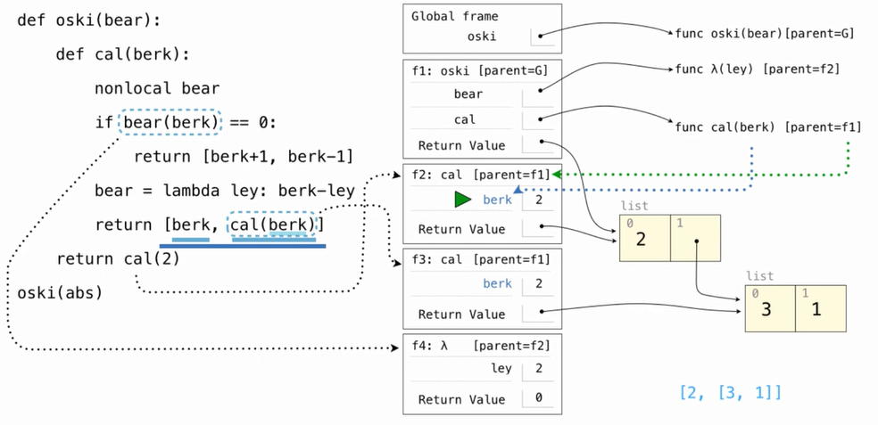
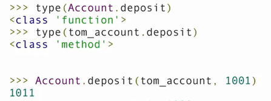
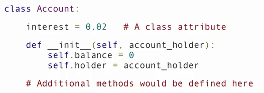
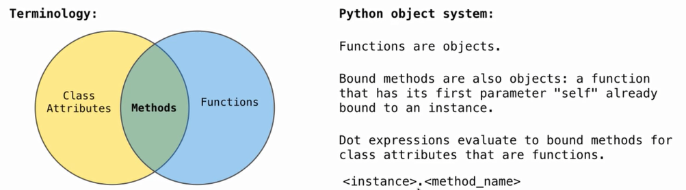

# CS 61A: Structure and Interpretation of Computer Programs 
## Lecture 1: Intro

### What is Computer Science

* 什么样的问题可以通过计算解决
  * Systems/ AI/ Graphics/ 安全/ 计算机网络 ...(每个 sub field 都有很多 sub sub field...)
* 怎样解决这些问题
* 怎样的方法可以找到高效的 solution

所有的计算机领域都要面对一个问题: managing complexity.

### What is CS 61 About

* 管理 复杂度
  * mastering abstraction
  * 编程范式
* Introduction to Programming
  * 全面理解 python 的基础
  * 通过 Implementation 来学习
  * 计算机怎样翻译编程语言

### 表达式

一个表达式描述了一个计算过程并且计算得到其值. 所有的表达式都可以用函数调用来表示

```python
max(2,4)
from operator import mul, add
mul(2,3)
mul(add(2,3),mul(3,5))
```

#### 剖析表达式调用过程

<br>

call 一个函数有特定的形式, 在括号之前的是操作符(operator), 括号之间是操作数(operand, 中间用逗号隔开),操作符和操作数都是表达式, 他们都要 evaluate 成 value, **并且可以嵌套**:

* 首先 evaluate 操作符然后 evaluate 操作数的 subexpressions

* 把从 operator 中 evaluate 得到的 function作用到从 operand subexpression 解析得到的 arguments 上

  <br>

上面的表达式树就是解析表达式的实际过程, 是自下向上解析的. 

#### Functions , Objects and Interpreters

```python
from urllib.request import urlopen
shakespeare = urlopen("http://inst.eecs.berkeley.edu/~cs61a/fa11/shakespeare.txt")
words=set(shakespeare.read().decode().split())
{w for w in words if w[::-1] in words and len(w) == 6}
```

## Lecture 2: Names, Assignment, and User-Defined Functions


assign 的作用是将表达式的值赋予某个变量, 它并不知道值是如何来的:

```python
from math import pi
radius = 10
aera, circle = pi * radius ** 2, 2 * pi * radius
radius = 20 # doesn't change the value of aera
```

此外, names 还可以 Bind to functions:

```python
f = max
f(1,2,3)
max = 7
f(1,2,max)
max = f
```

我们可以使用 `define` 定义自己的函数, 它和值得区别在于, 每次使用的时候都 revaluate 表达式得到的值:

```python
def aera():
    return pi * radius ** 2
radius = 10 
aere()  # Now, it changes 
```

#### 表达式的类型

* primitive 表达式: `2`(number) `add`(Name) `'hello'`(string)
* Call expressions: `max(2,3)` (with operator and operands)

#### Environment Diagrams

使用在线[可视化的界面](http://pythontutor.com/composingprograms.html)观察程序运行的结果, 其基本的界面如下:<br>

<br>

我们对于程序运行过程中的困惑都可以使用该工具来观察:

* assignment statement: 实际上就是 change binding between names and values
  * 首先从左到右 evaluate 等号右边的所有表达式
  * 然后再当下的 frame 中将所有的值 bind 到等号左边的 name 中
  
 ###  Defining Functions

赋值是一种简单的抽象方式, 把 Names 和  Values 绑定在一起, 而 函数定义是更强大的抽象方式, 它 **将 names 和 expressions binding together** :
 ```python
def <name> (<formal parameters>):
  return <return expressions>
 ```

执行 def statement 的顺序如下:

1. 创建一个带有签名(<函数名> (<参数列表>)) 的函数
2. 将所有缩进的 expressions 都设置为函数体
3. 将 names 和函数绑定在一起

#### calling User-Defined Functions

1. 新建一个 Local Frame, 形成一个新的环境
2. 将函数的formal parameters 和该 frame 中的 arguments 绑定
3. 在新的环境中执行函数体

函数的签名非常重要, 他们帮助形成函数调用需要的 local frame. 

#### 在环境中查找 names

理解这部分需要记住两个事情:

1. 一个环境就是 a sequence of frames

2. name evaluates 得到的值和沿着sequence of frames 最早找到的值 <br>

   <br>

## Lecture 3: Control

#### `print` 和 evaluate 的区别

`None` 是一个 special value, 在 python 中代表 nothing. 一个函数如果没有 **显式指定返回值, 那么就会返回`None`**.  但是在 interpreter 中是不会自动 display 的. 

#### Pure Functions & Non-Pure Functions

* Pure Functions: just return values `abs(-2)`, `pow(2, 10)`, ...

* Non-Pure Functions: have side effects, print(-2), input -2, return `None`, side effect 是在终端打印了"-2", side effect 不一定是修改值

  <br>

### Environment
* Def statement: 执行后创建一个新的函数, 在当前frame 中将 function name 和 Body 绑定在一起
* Call expression: evaluate Operator 和 Operand(函数以 operand 为参数调用)
* Calling/Applying: 创建一个新的 frame, 参数绑定到 arguments 中, 在新的 frame 中执行函数体

An Environment 是 sequence of frames:
* The global frame alone
* Function calls introduce multi-frame environment, a local frame , then a global frame

Names 在不同的 environment 中可能有不同的含义:
```python
from operator import mul
def square(square):
    return mul(square,square)
square(4)
```
<br>
### 一些python 特性
#### Operators
我们可以认为这是一种 Built-In functions, 值得注意的是有两种除法:
```python
from operator import truediv, floordiv,mod
2013 / 10 # result is 201.3, truediv(2013,10)
2013 // 10 # result is 201, floordiv(2013,10)
2013 % 10 # result is 3, mod(2013, 10)
```
#### 多个返回值
我们可以在一个语句中给多个 Names 赋值, 同样的一个函数也可以有多个返回值
```python

def divide_exact(n, d=10):
  """ return the quotient and remainder 

  >>> q,r = divide_exact(2013,10)
  >>> q
  201
  >>> r
  3
  """
    return n//d, n%d
quotient,remainder = divide_exact(2013,10)
```

#### 运行 python 文件中的代码
```zsh
$ python -i someFile.py # 交互模式运行
$ python someFile.py    # 直接运行
$ python -m doctest -v lecture01.py # 运行的时候可以进行单元测试
Trying:
    q,r = divide_exact(2013,10)
Expecting nothing
ok
Trying:
    q
Expecting:
    201
ok
Trying:
    r
Expecting:
    3
ok
```
#### statements
A statement is executed by the interpreter to **perform an action**. <br>
<br>
布尔表达式:
* false in python: False , 0, '', None (more to come)
* True values in Python: Anything Else

### 迭代
#### While Statement 的执行规则
1. evaluate header 表达式
2. 如果它为 True, 执行整个 suite, 然后回到 step 1.

## Lecture 4: High-Order Functions
### Designing Functions
函数的特点:
* 函数的 Domain 是 set of possible arguments
* 函数的 Range 是 set of possible return value
* pure 函数的行为是输入和输出的关系

函数设计的 Guide:
* 单一职责: 给每个函数 exactly 一个 Job
* Don't Repeat Youself
* 定义更加通用的 函数

### High-Order functions
我们可以让一个函数更加 general, 如对于不同的数列求和 从 1 到 k, 可以先写出不同数列的通项公式, 然后再调用求和函数:
```python
def identity(k):
  return k

def cube(k):
  return pow(k,3)

def summation(n, func):
  """ sum the first N terms of a sequence 

  >>> summation(5,cube)
  225
  """
  total, k = 0, 1
  while k <= n:
    total, k = total + func(k), k+1
  return total

def sum_cubes(n)
  summation(n, cube)
```
这实际上就是引入了 High-Order function: **a function that take another function as argument or return a function as a return value**. 同样的, 函数除了作为参数还可以作为返回值:
```python
def make_adder(n):
	def adder(k):
		return k + n
	return adder

adder_three = make_adder(3)
adder_three(4) 
# return 7
```
<br>
#### The Purpose of High-Order Functions
* Functions are first-class: 函数可以像值一样使用
  * 可以像计算一样表达 general methods
  * 减少程序中的重复
  * 减少functions 之间的影响

### lambda 表达式
可以使用lamnda 表达式定义一个很简单的函数:
```python
>>> square = lambda x: x * x
>>> square(10)
100
```
这里lambda 参数可以有多个, 和其他的语言中的不同, 这里的 lambda 没有 return 关键词, 而且只能是一个简单的表达式, 和赋值不同, 这个表达式返回的是一个函数而不是值.作为对比, C++ 中的 lambda 表达式就可以有多个语句
```C++
auto f = [](double x)->double {
    		auto temp = x -1;
           return x * (temp+1);
         }
```
#### lambda 表达式 和 def 语句的比较
<br>
区别不是很明显, lambda 先创建一个匿名函数然后通过赋值语句绑定到上面, 而 def 则没有这种先后顺序.<br>

## Lecture 5: 环境
### High-Order Functions 的调用环境
调用一个的 user-defined 函数:
* 创建一个新的 frame
* 将 formal parameter (f和x) 绑定到参数上
* 执行函数体, 返回 f(f(x))
  * 在执行高阶函数内的函数的时候, 也会创建一个新的 frame, 将参数绑定, 然后执行函数体

### Nested definition 的环境
<br>
可以看到, 在没有返回的时候, global frame 是无法 refer to Local frame 中新建的 adder 函数. adder 函数调用的时候, 它的 parent frame 实际上是 make_adder. 需要在 adder 中 Look up for names 时, 现在 adder 的 frame 中查找, 然后在 make_adder 中, 然后才是 Global frame:

* 每个用户自定义的函数都有一个parent frame, 通常是 global
* 它的 parent frame 就是定义函数所在的 frame
* 每个 local frame 也都有一个 parent frame
* 它的 parent frame 就是 function call 所在的 frame

### Local Names
Local Name 在其他非嵌套的函数中是不可见的:<br>
<br>
上面的例子中, f 函数 locally 将 y 绑定为 2, 但是 g 中需要查找 y 的时候, g local frame 中没有, global 中也没有, 就会报错. 而之前的 Make_adder 中生成的 adder 函数就可以找到 make_adder local frame 的 names, 因为他们是 nested.

### Function Composition
<br>

## Lecture 06: Iteration
### Return statement
一个返回语句完成call 语句的求值返回需要的值:
  * f(x) 对于用户自定义的函数 f 做了一下事情: 转到新的环境中, 执行函数体
  * f 中 return 语句做的事情: 回到之前的环境, f(x) 现在有了一个新的值 

在执行语句的时候只有其中一个 return 语句会被执行, 执行完就退出了.

### Self-Reference
```python
def printSums(x):
	print(x)
  def printSum(y):
    return printSums(x+y)
	return printSum

printSums(1)(2)(3)
```
<br>

## Lecture 7: Recursion
### 递归函数
递归函数是在函数体中调用函数自身的函数, 这种调用可以是直接的也可以是间接的. 它的具体结构有下面几个特点:
* def 声明语句和其他函数一样
* 条件语句先检查 base cases 直接求值
* 递归的 case 使用递归调用求值

```python
def split(n):
	return n // 10, n % 10

def sum_of_digits(n):
	if n < 10:
		return n 
	else:
		all_but_last, last = split(n)
		return sum_of_digits(all_but_last) + last 
```
#### 递归函数的环境图解
<br>
* 同一个函数被多次调用
* 在不同的frame 中 track 每次调用中的 argument
* n 的值取决于具体所在的调用环境

递归和迭代的比较:<br>
<br>

#### 递归函数正确性的检查
* 检查 base case 的 正确性
* 将 函数看成是一个 functional 抽象
* 假设 n-1 是正确的
* 在此基础上检查 n 的case 是否正确

### 将递归转为迭代
Iteration is a special case of recursion. 转换的核心在于找出哪个 state 一定要在 iterative 函数中维护.例如在 sum_of_digits(n) 的例子中, 我们需要维护的量实际上是 partial_sum, 即 sum_of_digits(all_but_last):
```python
def sum_of_digits_iter(n):
  partial_sum = 0
  while n > 0:
    n, last = split(n)
    partial_sum = partial_sum + last
  return partial_sum
```
在每次的迭代中, 更新需要维护的 status. 

## Lecture 8: 树递归
### 递归调用的顺序
在一个递归函数的函数体中调用函数本身, 首先执行被调用的函数返回结果, 之后才会往后运行. 这意味着被调用的函数先执行完. 
<br>
这个结果就是上面的输出短的序列被长的夹在中间. 在实现的时候, 我们还可以写成更简单的形式:
```python
def cascade(n):
  print(n)
  if n >= 10:
    cascade(n // 10)
    print(n)
```
<br>
这代码的意思, 就是 grow 函数要求先 n 变小, 然后 print, 而 srink 要求 print 发生在 n 减小之前, 这个名字 grow 可能带来一些误解. <br>

### 树递归
无论何时在一个递归函数体调用超过一次本函数,就会引发树形状的递归调用过程. 如一般递归实现的斐波那契数列就在 return 语句中有两个函数调用:
```python
def fib(n):
  if n==0 or n == 1:
    return n
  else :
    return fib(n-1) + fib(n-1)
```
<br>
函数的调用过程有点像树的后序遍历, 要先知道两个子数调用的结果才能知道自己的值, 函数执行效率低的原因是数中有很多重复的函数调用.<br>

### 例: counting partitions

<br>

* 首先找到一个能够递归分解问题的方式, 将复杂的问题用该问题的一个更简单的实例替代
* 在这里我们就用讨论两种可能性:
  - 使用至少一次 4 
  - 不使用任何4 
* 于是 `count_partitions(6,4)` 就简化成两个更简单的问题:
  * `count_partition(2,4)`
  * `count_partition(6,3)`

```python
def count_partitions(n,m):
    if n == 0:
        return 1
    elif n < 0:
        return 0
    elif m == 0:
        return 0
    else:
        with_m = count_partitions(n-m, m)
        without_m = count_partitions(n-1, m)
        return with_m + without_m
```

## Lecture 9: Function Examples

### 函数抽象
函数抽象使得我们在调用的时候只需要知道函数的参数和行为, 而不用关注其具体的内部实现.在选择函数参数名称的时候有下面几个建议:
* names 应该表达他们绑定值的 meaning
* 绑定到 Name 中的值类型最好在函数的 docstring 中记录
* 函数名应该表达其effect(print)/行为(triple) 或者返回值 (abs)
* 如果长的函数名可以帮助 document your code, 那么就应该这么做
* 如果是用来表达 generic quantities,如 数目/任意的函数/ 数学操作的参数, 那么就可以取一个短的名字

### TDD
测试驱动开发(TDD) 要求我们在实现函数前先写出函数的 test:
* 可以明确函数的 domain/range/ behavior
* 可以帮助确认复杂的 edge cases

增量开发, 在继续新工作前测试每个 piece:
* 我们不能依靠没有测试过的代码
* 如果更改了代码, 重新运行老的测试

交互式地运行程序:
* 不要害怕写完程序后的 experiment
* 交互式的session 可以拷贝称为 docstring 的一部分

```python
def gcd(m,n):
    """Returns the largest k that devides both m and n
    
    k, m, n are all possitive interger
    >>> gcd(25,10)
    10
    >>> gcd(8, 16)
    8
    >>> gcd(5,5)
    5
    """

```

### 函数科里化(currying)
```python
def make_adder(k)
  return lambda n : n + k

>>> make_adder(2)(3)
5
>> add(2,3)
5
```
这两个调用之间的区别在于: 一个是调用两次函数, 一次调用返回一个函数然后再通过函数调用返回值. 另一个是直接调用带有两个参数的函数直接返回值. 
```python
def curry2(f):
	def g(x):
		def h(y):
			return f(x,y)
		return h 
	return g 

curruy2 = lambda f: lambda x : lambda y : f(x,y)
```
科里化: **将一个多参数的函数转化为一个单参数, 高阶的函数**.在理论计算机科学中，柯里化提供了在简单的理论模型中，比如：只接受一个单一参数的lambda演算中，研究带有多个参数的函数的方式。

### 函数修饰器(decorator)
```python
@trace1
def triple(x):
  return 3 * x
# 和下面的语句等价
def triple(x):
  return 3 * x
triple = trace1(triple)
```
简单地说：他们是修改其他函数的功能的函数, 有助于让我们的代码更简短，也更Pythonic. 

## Lecture 10: Data Abstraction
复合(compound)对象将不同的对象组合在一起, 抽象数据类型让我们能够像一个单元那样操纵复合对象, 将两个部分分开:
* 我们怎样去表示数据
* 我们怎样操作/使用数据

### Pair
可以使用list 表示pair:
```python
>>> pair = [1, 2]
>>> x, y = pair
>>> x
1
>>> from operator import getitem
>>> getitem(pair, 0)
1
```
这时候我们可以定义出表示有理数ADT 的构造函数, 在构造函数中加入约分的性质之后就无需在加减乘除中做这种变化了:
```python
from fractions import gcd

def rational(n,d)
  g = gcd(n,d)
  return [n//g,d//g]

def numer(x):
  return x[0]
def denom(x):
  return x[1]
```

### Abstraction Barriers
<br>
下面的操作就违反了 abstraction Barriers:
```python
add_rational([1,2],[1,4])
def add_rational(x,y):
  return [x[0]*y[1], x[1]*y[0]]
```
上面的一段代码违反了很多东西:
* 定义有理数直接用 list 而不是使用构造函数
* 假定rational 内部用 list 实现而直接使用下标取分子分母
* 返回时候也没有使用构造函数

### Data Representations
* 我们需要构造函数和 selector 函数合作实现正确的行为
* 数据抽象使用 selector 和 constructor 去定义行为
* 如果行为的条件被满足, 那么 representation 就是对的

我们可以根据它的行为去辨别出数据抽象. 我们可以改变有理数背后的实现, 之前使用一个list, 现在完全可以使用函数:
```python
def rational(n,d):
  def selector(name):
    if name == 'n':
      return n
    elif name == 'd':
      return d
  return selector
def numer(x):
  return x('n')

def denom(x):
  return x('d')
```
改变实现后, 加减乘除之类的运算不需要做任何改变即可正确运行. <br>
<br>

## Lecture 11: Containers
### List
list 在 python 是使用 `[]` 括起来表示, 序列中的每个元素都分配一个数字 - 它的位置，或索引. 
```python
>>> odds = [41, 43, 47]
>>> odds[0]
41
>>> len(odds)
3
>>> [2,7] + odds * 2
[2, 7, 41, 43, 47, 41, 43, 47]
```
从上面的例子中可以看到, python 的 list 支持下面的操作:
* 得到 list 中元素的个数 `len(odds)`
* 使用 index 访问元素 `odds[0]`/`getitem(odds, 0)`
* 同时可以concatenation(串接) 和 重复(`[2, 7] + odds * 2`/ `add([2,7], mul(odds,2))`)
* list 同时可以嵌套`pairs[[19,20], [21,22]]`

### Containers
list 这种容器支持 in operator:
```python
>>> 1 in [1, 2, 3]
True
>>> [1, 2] in [1, 2, 3]
False
>>> [1, 2] in [[1,2], 3]
True
```
这个操作实际上就是将 list 中的每个元素单独拿出来对比, 看查找的元素在不在其中. 

### For Statement
```python
for <name> in <expression>:
  <suite>
```
1. 对 \<expression> 求值, 对方必须是一个 iterable value(a sequence)
2. 对于 sequence 中的每个元素:
   1. 在 current frame 中将 element 和 <name> 绑定在一起
   2. 执行 \<suite>

在 for 语句中甚至可以将 element unpack(要求sequence中每个元素等长), 这个过程有点像 mutable assignment:
```python
pairs = [[1,2],[1,1],[2,3],[3,3]]
same_count = 0
for x,y in pairs:
  if x == y:
    same_count = same_count +1
print(same_count)
```

### Ranges
The range type: 一个连续的整数组成的 sequence.<br>
<br>
* length : 就是 ending 值 - 初始值
* 选择的element: starting value + index

同时我们可以调用list constructor 将 range 转化为 list
```python
>>> list(range(-2,2))
[-2,-1, 0, 1]
>>> list(range(4))
[0, 1, 2, 3]

```
### List Comprehensions
<br>
我们可以在 list 中做很多操作, 下面是个例子:
```shell
>>> odds = [1,3,5,7,9]
>>> [x for x in odds if 25%x==0]
[1, 5]
```
### String
String 是一种抽象, 可以代表 data/ language/ programs:
```python
>>> 'curry = lambda f: lambda x: lambda y: f(x,y)'
'curry = lambda f: lambda x: lambda y: f(x,y)'
>>> exec('curry = lambda f: lambda x: lambda y: f(x,y)')
>>> curry
<function <lambda> at 0x000001C5303271F0>
```
它可以用三种方式表示:<br>
<br>
此外, String 也是 sequence, 可以用 `len(str)`, 也可以用 index 得到其中一个元素(也是 String), 值得注意的是 **String 的 in operator 和 list 不同**:

```python
>>> 'hell' in 'hello world'
True
```

### 字典
这个容器让我们能够将 key 和 value 关联起来, 之后我们可以用 Key 来查找元素(它们是无序的), 但是不能用value去查找:
```python
>>> {'I': 1, 'V': 5, 'X':10}
{'I': 1, 'V': 5, 'X': 10}
>>> num = {'I': 1, 'V': 5, 'X':10}
>>> num['I']
1
>>> 'I' in num
True
>>> 10 in num
False
>>> num.values()
dict_values([1, 5, 10])
>>> num.keys()
dict_keys(['I', 'V', 'X'])
>>> num.items()
dict_items([('I', 1), ('V', 5), ('X', 10)])
```
字典提供了很多操作方便我们使用, 同样的也有 Comprehensions:
```python
>>> {x:x**2 for x in range(4)}
{0: 0, 1: 1, 2: 4, 3: 9}
```
我们不能有两个 key, 这会被认为是重写 Key 对应的 value:
```python
>>> {1:2, 1:3}
{1: 3}
```
同时 Key 不能是list/dictionary 这种 unhashable 的对象:
```shell
>>> {[1]:"hello"}
Traceback (most recent call last):
  File "<stdin>", line 1, in <module>
TypeError: unhashable type: 'list'
```

## Lecture 12: trees

### Box and Pointer Notation

环境的图示中加入了这个notation 是因为 Data Type 的 Closure 特性: **结果的组合本身可以用同样的 method 组合在一起**. 这个特性非常强大, 它允许我们创建 hierarchical(层次的)结构. 例如, list 可以包含一个list 对象作为一个元素:<br>

<br>

### Slicing(切片)

```python
>>> odds = [3, 5, 7, 9, 11]
>>> [odds[i] for i in range(1,4)]
[5, 7, 9]
>>> odds[1:4]
[5, 7, 9]
```

切片用一种更简单的方式去实现上面两行代码实现的功能, 此外还可以更简单省略初始/结束/初始+结束的index:

```python
>>> odds[:4]
[3, 5, 7, 9]
>>> odds[2:]
[7, 9, 11]
>>> odds[:]
[3, 5, 7, 9, 11]
```

**切片产生的是一个新的对象(values)**. 


### 处理容器的值

偶很多 built-in 函数处理一个可迭代的参数汇总成一个值:

* `sum(iterable[, start])`->value [,start] 中的方括号表示一个可选参数

* `max(iterable [, key=func])`->value 返回最大元素

  ```python
  max(range(10), key = lambda x: 7 - (x-3)*x)
  ```

* `all(iterable)`-> bool 如果 其中的值都是 true, 返回 True, iterable 为空依旧返回 True.

### Trees

<br>

#### 实现一个树

* 一个 tree 有 root label 和一个list 的 branch
* 每个 branch 都是一棵树

```python
def tree(label, branches =[]):
    for branch in branches:
        assert is_tree(branch)
    return [label] + list(branches)
def label(tree):
    return tree[0]
def branches(tree):
    return tree[1:]
def is_tree(tree):
    if type(tree)!= list or len(tree)<1:
        return False
    for branch in branches(tree):
        if not is_tree(branch):
        	return False
    return True
def is_leaf(tree):
    return not branches(tree)
```

在这种实现种, tree 就有一个root label 和 branches 构成的 list.

#### Tree Processing

很多事后涉及树的处理我们都是使用递归来实现的, 例如想要生成一个斐波那契树:

```Python
def fib_tree(n):
    if n <= 1:
        return tree(n)
    else:
        left, right = fib_tree(n-2), fib_tree(n-1)
        return tree(label(left)+label(right),[left, right])
```

一个从其他树中创建新的树的函数经常也是递归的,例如:

```python
def increment(t):
    return tree(label(t)+1,[increment(b) for b in branches(t)])
```

当我们遇到叶节点的时候, 上面的for statement 产生一个空的list, 递归停止即可. 

```python
def print_tree(t,indent = 0):
    print('  ' * indent + str(label(t)))
    for branch in branches(t):
        print_tree(branch, indent +1)
```

## Lecture 13: Mutable Values

### Python 中的对象

* 对象可以表示信息
* 它们由data 和 behavior 组成, 绑定在一起形成抽象
* 对象可以表示事务, 可以表示属性/进程/Interaction
* 有种对象是被称为一个类, classes are first-class values in python
* 在 python 中, 所有的值都是一个对象
  * 所有对象都有属性
  * 可以通过方法做很多数据操作
  * 函数只做一件事情, 对象可以做很多相关的事情

### Mutation 操作

```python
>>> suits = ['coin','string','mariad']
>>> original_suits = suits
>>> suits.remove('string')
>>> original_suits
['coin', 'mariad']
>>> numerials = {'I':1, 'V': 5, 'X': 10}
>>> numerials['L'] = 50
```

两者在前面 binding together, 修改其中一个会影响另一个的值:

* 同一个对象可以在计算中改变其 value

* 所有指向同一个对象的 names 都会被这种 mutation 影响

* 只有 **mutable types** 可以改变: _lists_ & _dictionaries_

* function call 可以改变它 Scope 中的任何对象

  ```python
  def mystery(s):
      s.pop()
      s.pop()
  four = [1, 2, 3, 4]
  mystery(four) # four is now [1,2]
  ```

### Tuples (immutable sequences)

**tuple 的特性导致它可以作为 dictionary 的key**:

```python
{(1,2):3}
```

immutable values are protected from mutation

* 但是和 Name Changes 并不矛盾, 它可以发生在指向 mutable/immutable 的 Names 上, 将 Name refer to 其他的东西. 但是 Object mutation 智能发生在 mutable 对象上.

* 一个 immutable sequence 可能是可以变化的(**如果它的某个元素是 _mutable_ 的话**)

  ```python
  >>> s = ([1,2],3)
  >>> s[0][0] = 0
  >>> s
  ([0, 2], 3)
  ```

于是, 我们有两种判断:

* **Identity**: \<exp0> is \<exp1> , 只有两个表达式 evaluate 到同一个对象时候才为 true
* **Equality**: \<exp0> == \<exp1>, 两个表达式 evaluate 到同一个 value 时候为 true

也就是, 如果两个 Name Identity 为 `False`, 改变其中一个不影响另一个. 这引申出一个问题, **Mutable 的默认值是非常危险的**:<br>

<br>

## Lecture 14: Mutable Functions

mutable 函数是有与其关联的数据发生变化的函数, 例如我们来看一个在不同时间的行为有变化的函数(银行存款程序).我们在 make_withdraw 函数中定义 withdraw(相当于balance 放在 parent 的frame 中), 这个时候我们需要 Persistent Local State.

```python
def make_withdraw(balance):
	""" in this function, we will create a balance
	"""
	def withdraw(amount):
		nonlocal balance # 在withdraw frame 中修改 balance 会影响到 make_withdraw frame
		if amount > balance:
			return 'out of money'
		balance = balance - amount
		return balance
	return make_withdraw
```

<br>

从上面看到, 加入了 nonlocal 后, f2 frame 执行 `balance = balance - amount` 并没有产生新的 local balance, 而是找到了parent 的 balance 并且修改其值.(**如果不声明为 nonlocal 的话只能访问不能修改**)

### Nonlocal 语句的影响

<br>

这个要求是,给 non-local 的 x 赋值时候, **x一定要在 parents frame 中绑定, 但是在 local frame 中不能有**.

python 在调用函数前会 pre-compute 每个 name 在那个 frame中, 在一个函数体内, 每个 name 一定要在同一个 frame中, 如去掉 non-local 后, 比较中的 balance 就是在 parent frame 中, 而 赋值时候的 balance 在 local frame 中, 于是就会报错. 

对于 Mutable value 而言, 无需 nonlocal statement 就可以更改:

```python
def make_withdraw(balance):
	""" in this function, we will create a balance
	"""
	b = [balance]
	def withdraw(amount):
		if amount > b[0]:
			return 'out of money'
		b[0] = b[0] - amount
		return b[0]
	return make_withdraw
```

### Multiple Mutable Functions

把表达式的值和其value替换后不会改变程序的含义, 就称表达式是 referentially transparent. 

<br>

Mutation 操作违反了这种 transparency , 他们不止是返回一个值, **they change the environment**,下面的例子中, 两个 `cal(2)` 返回的结果就不同.

<br>

## Lecture 15 : Objects

### Object-Oriented Programming

一个用于组织模块化程序的方法:

* 抽象壁垒
* 将信息和相关的定位绑定在一起

### Classes

一个类是其实例的模板, 它的声明方式如下:

```python
class <name>:
    <suite>
```

当我们 Call 一个 Class 的时候:

1. 该类的一个新的实例被创建

2. `__init__` 方法被调用, 其第一个参数是新创建的那个实例(`self`), 同时也可以为该方法提供其他的调用参数

   ```python
   class Account(object):
   	"""docstring for Account"""
   	def __init__(self, account_holder):
   		self.balance = 0
   		self.holder = account_holder
   ```


#### Identity

每个作为用户自定义类实例的对象都有自己独一无二的 identity,使用 assignment 方式将一个新的 name 绑定到对象上, 这个过程并不会创建新的对象. 

#### Methods

在 class suite 中定义的函数:

```python
class Account(object):
	"""docstring for Account"""
	def __init__(self, account_holder):
		self.balance = 0
		self.holder = account_holder
	def deposit(self, amount):
		self.balance = self.balance + amount
		return self.balance
	def withdraw(self, amount):
		if amount > self.balance:
			return 'Run out of money'
		self.balance = self.balance - amount
		return self.balance
```

调用方法的时候可以通过 `self` 参数访问对象自己, 所有他们可以访问和操作付I想的状态, 使用 Dot notation 可以自动提供方法的第一个参数. `<expression>.<name>` 

#### Attributes

存在对象实例/或者是类 中的数据, 通过 dot notation / `getattr(john,'balance')`访问. 

此外类也可以调用函数, 这时候需要传入一个对象的实例, method 和 function的区别在于要不要显式传入第一参数:<br>

<br>
Class Attributes: 可以理解为 java 中的静态实例域. 

<br>

## Lecture 16: 继承
首先我们明确一些术语: 所有的对象都有**属性**, 属性是一个 name-value 对, 类本身也是一个对象, 主语区分 _类的属性_ 和 _类实例的属性_. 



可以看到, looking Up Attributes By Name (`<expression>.<name>`)的顺序是这样的:
1. 首先对dot左边的`<expression>` 求职, 得到调用 dot表达式的对象
2. `<name>` 去被这个 instance 的属性匹配, 如果存在的话就返回值
3. 如果不存在, 在 类的属性去找, 结果就是类属性的值
4. 除非是函数, 否则返回一个值, 而函数的话就返回一个 bound method(bound 的意思是调用者 self 已经被绑定到了函数中称为第一个参数)

Assignment to Attributes: 使用 dot 表达式可以给属性赋值
* 如果对象是一个实例, 就是设置实例的 attributes
* 如果对象是一个类, 就是给类的 arrrbutes 赋值

```Python
class Account:
    interest = 0.02
    def __init__(self,holder) -> None:
        self.holder = holder
        self.balance = 0
    
tom_account = Account("Tom")
print(tom_account.interest) # 结果是0.02
Account.interest = 0.04
print(tom_account.interest) # 结果是0.04
tom_account.interest = 0.08
print(tom_account.interest) # 结果是0.08
```
上面这个例子中我们可以发现, 如果实例中没有 interest 的这个属性, 那么实例可以使用类的这个属性, 然而如果实例中自己定义了这个属性之后, 就会覆盖类的属性

### 继承
继承是一种将类关联起来的一种方式, sub class 共享base class 的属性, 它可能会重写(override)某些继承的属性, 但是没有重写的就和基类一样:
```Python
class <namme>(<base class>):
    <suite>
```
Base Class 的 attribute 并没有拷贝到 subclasses 中
<div align=center></div>

### 面向对象设计
继承设计的几点原则:
1. DRY, 使用现有的 implementation
2. 已经被 overridden 的属性依旧可以通过类对象来access
3. look up attributes on instance whenever bossible

#### 继承和组合
* 继承最好对应于 is-a 关系(里氏替换原则)
* 组合最好用于表达 has-a 关系

### 多继承
在 python 中是可以有多继承的(C++ 中可以, 但是 Java 中只能用单继承+实现多个接口).可能在这种情况下会有歧义, 我们只需要记住先从subclass 查找再从 base class 查找.
<div align=center></div>

## Lecture 17: Representation
### String Representation
在 python 中, 所有的对象都产生两种 string representations:
* str is legible to human
* repr is legible to the Python interpreter

很多时候两者是一样的, 但不完全是.使用 `repr`函数可以返回一个 string , 大多数时候就是这个对象的经典表示, 对于大多数对象类型, `eval(repr(object)) == object`, 也是在命令行中输入后显示的样子<br>
而使用`str` 函数返回的一般就是 print 出来的样子, 更加有利于我们去理解
<div align=center></div>

### polymorphic(多态的) Functions
多态的含税值得是一个函数可以应用于多个(ploy)不同形式(morph)类型.上面的 `str` 和 `repr` 就是这样的, 他们两可以应用于任何对象身上.其中的 `repr` 就是调用它参数的一个零参数方法 `__repr__`.<br>
这给我们一个很重要的启发, 我们可以写一个函数, 自身并不做什么事情, 只是调用参数的方法.而 `repr` 的实现就是一个实例调用 `__repr__` 被忽略, 只有class attribute:
```Python
def repr(x):
    return type(x).__repr__(x)
```
`str` 要稍微复杂一点, 同样使用实例的调用被忽略, 同时如果没有 `__str__` 属性, 使用 `repr` string.

#### interface
是一系列的 shared messages, along with a specification of what they mean. 例如实现 `__str__` 方法就是实现产生string representation 的 interface.

### 特殊的方法
有个 Name 很特别, 因为他们有 built-in 行为, 一般用两个下划线开头和结束.
<div align=center></div>

## Lecture 18: Growth
### Measuring Efficiency
我们给斐波那契函数加一个装饰器:
```Python
def fib(n):
    if n == 0 or n == 1:
        return n
    else:
        return fib(n-1)  + fib(n-2)

def count(f):
    def counted(n):
        counted.call_count += 1
        feturn f(n)
    counted.call_count = 0
    return counted
```

### Memoizaiton
一个加速软间运行的办法, 具体想法是, 记住之前已经计算过的结果.
<div align=center></div>

### Space
The Comsumption of Space: 在任何时候都有一系列的 active environment, Value 和 Frames in active environment 都要消耗内存, 而被其他 value 和 frame 利用的内存可以被回收.<br>
##### Active environments
* 任何现在在被求值的函数调用的环境
* 当前 active environment 的 parent environment

<div align=center></div>

<div align=center></div>

从中可以发现, 实际上用内存最多的是调用 Tree 中最常的一个 chain.

### Time
一个函数抽象的不同实现可能需要不同的运行时间.

### Order Of Growth
A method for bounding the resources used by a function by the "size" of a problem.<br>
<div align=center></div>

### 不同增长率的比较
* 常数项不影响
* log 的底数项也不影响
* 对于 nesting, 将内外层的 order 相乘

<div align=center></div>

## Lecture 19 : Composition
### 链表
<div align=center></div>

```Python
class Link:

    empty = ()
    def __init__(self, first, rest=empty):
        assert rest is Link.empty or isinstance(rest, Link)
        self.first = first
        self.rest = rest
```
### Property Methods
有的时候, 我们希望某个 instance attribute 的值只在需要的时候计算.
<div align=center></div>

<div align=center></div>

### Tree
树中的一些定义如下:
<div align=center></div>

```Python
class Tree:
    def __init__(self, label, branches=[]):
        self.label = label
        for branch in branches:
            assert isinstance(branch, Tree)
        self.branches = list(branches)
```

### 树的操作
树的操作往往是使用递归来实现的, 如我们想要将一个斐波那契树的重复分支剪掉, 可以用下面的做法:
```Python
def prune_repeats(t, seen):
    t.branches = [b for b in t.branches if b not in seen]
    seen.append(t)
    for b in t.branches:
        prune_repeats(b,seen)

t = fib_tree(10)
prune_repeats(t, [])
``` 

## Lecture 20 : Ordered Sets
Set 是一种内建的容器类型:
* 使用大括号包起来的元素
* 在创建的时重复元素被删除了
* 元素的顺序是任意的

可以有下面几个操作:
1. 对两个 set 求 union(并) 和 intersection(较)
2. 可以添加或者移除元素. 可以测试某元素是否在 set 中

同样 set 元素不能是 list(不能被 hash).

### Set as Linked List
<div align=center></div>

### Set Operations
我们如果使用已经排序的 LinkList, 很多操作可能更加简单.
<div align=center></div>

<div align=center></div>

上面这两个操作的时间复杂度都是 $\Theta(n)$.

### Set Mutation
例如往其中添加元素的操作:
```Python
def add(s, v):
    if s.first > v :
        s.first, s.rest = v, Link(s.first,s.rest)
    elif s.first < v and empty(s.rest):
        s.rest = Link(v, s.rest)
    elif s.first < v:
        add(s.rest,v)
    return s
```
<div align=center></div>

## Lecture 21: Tree Sets
### 二叉树
一个二叉树是只有两个分支的树, 因此
* 我们要用 empty 将missing left branch 填好.
* 对于 leaf, 我们也要讲它的两个子树填上 empty

<div align=center></div>

### 二叉搜索树
这个做法来自于在sorted list 中的查找, 检查中间的元素然后消除一半的元素.($\Theta(\log N)$)<br>
BST 是满足下面条件的二叉树:
* 左子树所有节点的值都比根节点小
* 右子树所有节点的值都比根节点大

### BST 中的查找
* 如果 element 不在 root, 那么它要么在左边要么在右边
* 根据大小我们可以每次舍弃一个子树

## Lecture 24: Scheme
### Scheme
Scheme 是 Lisp 的一种方言, Scheme 程序由表达式构成, 它们可能是:
* primitive expressions: 2, 3.3, true, +, quotient
* 组合:(quotient 10, 2), (not true)

数字是 self-evaluating, 符号 are bound to values, 调用表达式包含括号内的一个符号加上零个或者多个参数.
<div align=center></div>

### Special Forms
A combination that is not a call expression is a **special form**.
<div align=center></div>

<div align=center></div>

### lambda 表达式
Lambda 表达式是一个匿名函数
<div align=center></div>

## Lecture 25: Exceptions
Handling Errors:Sometimes, Computer programs behave in non-standard ways.
* 函数接收的参数可能类型不匹配
* 有的资源(文件/内存/数据库)可能不可得
* 在数据传输中可能丢失网络连接
  
在 python 中用来处理错误这些行为的机制是 Exceptions:
* 无论什么error 出现, python raise 一个异常
* 异常可以被程序处理, 避免解释器停止运行
* 没有被处理的异常会导致 Python Halt Execution 并且打印一个 stack trace

面对异常的时候需要记住下面两点:
1. 异常是对象, They have classes with constructors
2. They enable non-local continuations of control
   1. 例如 f call g, g call h, 异常可以将控制流在没有等待 g 返回的情况下直接从 h 转移到 f 
3. 我们不要在 standard 行为中使用异常, 而是专门用于 非标准行为

### Raise Exception(抛出异常)
最简单得方式是使用 assert 语句:
```Python
assert <expression>,<string>
```
这时候使用 `-O`(optimized) 可以忽略.<br>
更多时候是使用 Raise 语句, `raise <expression>`, 需要注意的是, 其中的表达式求指后必须是一个 subclass of BaseException 或者一个它的实例.下面是内置的一些异常类型:
<div align=center></div>

### 异常处理
使用 try 局域处理异常, 其基本的形式如下:
<div align=center></div>

1. 首先运行 try 语句, 如果没有异常的话就略过异常处理语句
2. 如果有异常, 异常是 exception class 的子类或者子类实例, 就会执行对应的 except 语句, 执行的时候异常绑定到 name 上

```Python
try:
    x = 1/0
except ZeroDivisionError as e:
    print('handaling a', type(e))
    x = 0
```
此外, 我们可以有 mutiple nested try statements:**控制流会跳转到最近那个可以 handle 这种类型的 except suite 中**. 

<div align=center></div>

## Lecture 26: Calculator
### 解释器
Scheme 的解释器首先要求我们使用递归将读入的数据解释为我们希望的形状:
<div align=center></div>
<div align=center></div>

### 语法分析
一个语义分析器将 text 转化为表达式:
<div align=center></div>

<div align=center></div>

### Calculator
我们之前的工作依赖于一个 pair 类, 它用于表示 Scheme 中的 pairs 和 lists:
<div align=center></div>

Calaulator Syntax: 这个计算语言有基本表达式和call语句
* A Primitive expression is a number
* a call expression is a combination that begins with an operator followed by 0 or more expressions

<div align=center></div>

### The eval function
The eval function computes the value of an expression, which is always a number. 它是一个和表达式类型无关的通用函数.

<div align=center></div>

接下来我们要实现 `cala_apply`:
```python
def calc_apply(operator, args):
    if opearator=='+':
        return reduce(add, args, 0)
    elif ...
    else:
        raise TypeError
```

### Iteractive Interpreters
很多解释型语言的 user interface 就是所谓的 Read-Eval-Print Loop:
* Print a prompt
* Read text input from the user
* Prase the text input into an expression
* evaluate the expression
* if any errors occur, report thoese errors.
* otherwise print the value of the expression and repeat

<div align=center></div>

## Lecture 27: interpreters

解释器的结构:
<div align=center></div>

### Special Form
scheme_eval 函数 dispatches on expression form:
* Symbol are bound to values in the current environment
* Self-evaluating expressions are returned
* all other legal expressions are represented as Scheme lists, called combinations

<div align=center></div>

### Logical Special Forms
<div align=center></div>
需要注意的是这些逻辑表达式不一定会全部 evaluate, 如果 if 是 true , alternative 那里就算有异常也不会被抛出.

### Quotation
quote special form evaluates to the quoted expression , which is not evaluated.
<div align=center></div>

可以使用 `'<expression>` 作为缩写.

### lambda 表达式
lambda expressions evaluate to user-defined procedures.
<div align=center></div>

### Define Expression
Define binds a symbol to a value in the first frame of the current environment.
1. evaluate the expression
2. Bind name to its value in the current frame

过程定义和 lambda 表达式定义带来的结果是一样的:
<div align=center></div>

我们接下来考虑下面一个调用的 frame:
<div align=center></div>

## Lecture 28 : Tail Call
### Dynamic Scope
我们需要注意 lexical scope 和 Dynamic Scope 的区别:
* 在lexical scope 中 the parent of a frame is the environment in which a procedure was **defined**
* 在 Dynamic scope 中, the parent of a frame is the environment in which a procedure was **called**

<div align=center></div>

### Tail Recursion
函数式编程基于下面的假设, 并且在很多方面有着自己的优势:
<div align=center></div>

在 Python 中, 递归调用总是创建一个新的活动帧.
<div align=center></div>
但是 Scheme 对这个有要求:
<div align=center></div>

### Tail Call
A tail call is a call expression in a tail context:
* The last body sub-expression in a lambda expression
* Sub-expressions 2&3 in a tail context if expression
    ```Scheme
    (define (factorial n k)
        (if (= n 0) k
            (factorial (- n  1)
                       (* k n))))
    ```
* All non-predicate(非谓语) sub-expression in a tail context _cond_
* the last sub-expression in a tail context _and_ or _or_ 
* the last sub-expression in a tail context _begin_

在调用中依旧要做更多计算的 Call expression 不是 Tail Call, 例如:
<div align=center></div>

但是我们通常可以重写以变成 tail call:
```Scheme
(define (length-tail s)
    (define (length-iter s n)
        (if (null? s) n
            (length-iter (cdr s)(+ 1 n))))
    (length-iter s 0))
```
Tail Call 的返回值就是当前过程的返回值, 因此Tail Call 不应该增加环境的 size.

### Map and Reduce
```Scheme
(define (deduce procedure s start)
    (if (null? s) start
        (reduce procedure
                (cdr s)
                (procedure start (cars)))))
```
例如, `(reduce * '( 3 4 5) 2) -> (reduce * '(4 5) 6) -> (reduce * '(5) 24)-> 120`.需要注意的是, 最后一行 `procedure ...` 并不一定是 Tail Call, 取决于它的过程具体是什么.
<div align=center></div>

Map 是对一个过程和list操作, 结果是过程对 list 中的每个结果分别做一遍, 返回.
<div align=center></div>

下面是一个尾递归的实现:
<div align=center></div>

## Lecture 29: Macros
### Program as Data
Scheme 的内置 list 数据结构(实际上是一个链表) 可以表示 combinations.在 Scheme 中可以很方便写出生成程序的程序.
```Scheme
(list '+ 1 2)
(define (fac-expression n)
    (if (= n 0) 1
        (list '* n (fac-expression(- n 1)))))
```
<div align=center></div>

上面就是一个程序生成了程序, eval 之后才是一个值. 

### Macro
Macro 是 Scheme 中的一个特性, 它允许你在语言中定义新的 special form, Lisp 中这么做很方便的原因是我们可以将 code 看成是 data.
#### Macros Perform Code Transformations
A macro is an operation preformed on the source code of a program before evaluation. Scheme 中就是用 `define-macro` 这个 special form 来定义一个 source code transformation.
```Scheme
(define-macro (twice expr)
    (list 'begin expr expr))
```
Evaluation macro call expression 的步骤:
1. 首先 evaluate operator sub-expression, 结果就是宏
2. 然后对 operand 表达式调用宏 procedure , **without evaluating them first**
3. Evaluate 宏过程返回的表达式

<div align=center></div>

实际上, 我们使用 define 也可以实现类似的效果, 但是要十分注意引号的使用.使用 macro 的一个好处就是 quotation 和 evaluation 自动帮我们做好了.
```Scheme
(define-macro (check expr)
              (list 'if expr ''passed
                (list 'quote(list 'failed:expr))))
```

### For Macro
我们可以定义一种展开后表达式作用于 sequence 中每个值的宏. 
<div align=center></div>

### Quasi-Quotaition
Quasi-Quotation 相对 Quotation 而言, 它意味着 part of the expression can be evaluated.
<div align=center></div>

有了这个工具后, 我们可以将之前的check 简化:
<div align=center></div>

## Lecture 30 Iterator
