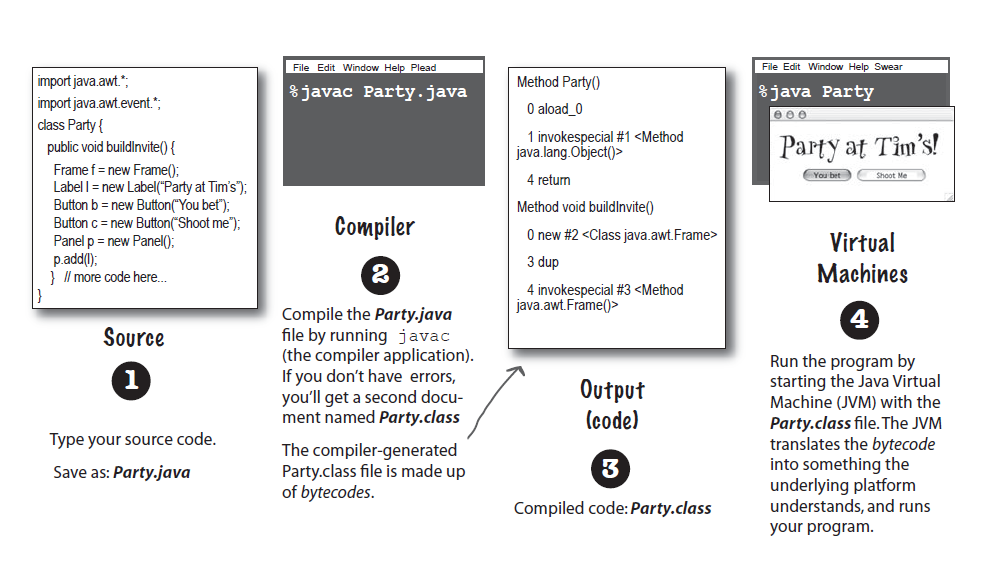

# Head First Java

## Chap 01 进入Java的世界
java将带你进入全新的领域, 同之前的语言不同, 它在设计时候就有下面的特性:
* 友好的语法
* 面向对象
* 内存管理
* 跨平台可移植

Java 程序的执行过程:<br>
<br>
* source file: 拓展名为*.java,用来表示程序的一个组件, 类的内容在声明之后的花括号里
* 类: 带有一个或者多个方法, 方法必须在类的内部声明
* 方法: 花括号中编写的应该执行的指令, 可以理解为是一个函数或者过程(C++中的成员函数)
    - 不管程序多大(含有多少个类),都一定会有个 _Main_ 函数作为程序的起点

在main或者其他方法中, 我们可以
* do something: 声明\设定\调用方法等简单语句
* loop
  * while loop
  * do-while loop
  * for loop
    ```Java
    while(boolean expression){
        ... // do something
    }
    for(    ;   ;   ){
        ... // do some thing
    }
    ```
* branching : 在适当的条件下做某些事情
    ```Java
    if (x == 10) {
        System.out.print("x must be 10");
    } else {
        System.out.print("x isn’t 10");
    }
    if ((x < 3) & (name.equals("Dirk"))) {
        System.out.println("Gently");
    }
    ```

需要注意的是， ==Java 是面向对象的语言， **所有东西都必须包含在类中**==， 并且在条件判断中不支持别的类型到 boolean 的隐式类型转换， 可行的替代做法包括 三元运算法 `? :`/ 位运算/ if-else / 第三方库实现的静态方法。   

## Chap 02: 拜访对象村
<div align=center></div>

在继承中， subclass 会自动继承 superclass 的方法， 并且可以适用自定义的同名方法**覆盖（override）** 父类的方法。 在设计类时， 需要记住对象是靠类模型塑造出来的， 类不是对象， 却是对象的蓝图。我们适用圆点（`.`）来使用对象的变量与方法：
* 实例变量： 对象本身已知的事物
* 方法： 对象可以执行的动作

一般而言 mian 有两个用途， ==真正的 Java 程序会让对象和对象之间交互==：
* 测试真正的类
* 启动 Java 应用程序

在 Java 语言中不存在全局变量的概念， 我们适用 `public/static/final` 等修饰符就可以实现类似的 全局和常量等需求。 

## Chap 03: 认识变量
Java 语言中变量有两种： ==**primitive** 和 **reference**==.并且 Java 是静态类型语言， 注重变量的类型。 
* primitive 类型有八种， 四种整型两种浮点型还有 boolean 和 char, 需要注意的是它们都有指定的范围要避免溢出 <div align=center></div>
* 没有对象变量这样的东西， 有的只是==引用对象的变量==， 保存的是存取对象的方法，对象是放在可以回收的堆上， 而引用可以理解为实际对象的遥控器 <div align=center></div>

实际上引用的大小取决于虚拟机的实现者， 只能保证任意一个虚拟机中所有的引用大小都一样。  
数组就像是一个杯架， 其中的每个元素是变量（可以位基础类型或者引用）， 数组本身也是一个对象， 一旦被声明出来只能装载所声明的类型的元素。 <div align=center></div>

## Chap 04: 对象的行为
对象的状态影响行为，同时行为也会影响状态。例如我们可以给在函数调用的参数中使用实例变量
```Java
class Song{
    String title;
    String artist;
    void play(){
        soundPlayer.playSound(title);
    }
}
class Dog{
    int size;
    String name;
    void bark(){
        if(size >= 60){
            //...
        }
        else if{
            //...
        }
    }
}
```
* 方法中可能会运用形参， 调用时有时候需要传入实参， 实参传入方法后就成了形参， 跟局部变量是一样的。 
* 方法何以有返回值
* 可以向方法中传入多个参数， 但是个数和类型以及顺序要和声明的一致
* Java 是通过值传递， 就是拷贝传递

在处理数据的时候需要注意封装， 就是将实例变量设置为 private, 然后提供 public 的 getter 和 setter 提供对它的访问和修改。   
在 java 中注意局部变量和实例变量的区别：
* 实例变量声明在类内
* 局部变量声明在方法中
* ==局部变量没有默认值， 适用之前必须初始化==
* 实例变量的默认值， 根据类型不同可能为 flase/ 0/ null

## Chap 5: 编写程序 
我们记得以面向对象的方式来思考： ==专注于程序中出现的事物而不是过程==。我们在开发类的过程中遵循下面的流程：
* 找出类应该做的事情
* 列出实例变量和方法
* 编写方法的伪码
* 编写方法的测试用程序
* 实现类
* 测试方法
* 除错或者重新设计

其中的伪码大致包括三个部分：实例变量的声明， 方法的声明和方法的逻辑。 此外， 我们会在所有东西都可以测试之前写出测试用的部分。

## Chap 6: 使用 Java 函数库
java 内置有数百个类， 熟悉其中的功能在很大程度上可以避免重新发明轮子。 
### ArrayList
ArrayList 和普通数组的比较
* 一般数组在创建的时候就必须确定大小
* 在将对象存放到普通数组中时候需要制定存放位置 
* 一般数组用的时候有特殊语法，如`commonArray[i]`， 而 ArrayList 使用时候就是对象调用方法`someArrayList.get(5)`
* Java 5.0 之后的 ArrayList 是参数化的

在使用到 Java 代码库中的类时， 我们有两种方式明确适用的是哪一个
* import, 在源文件最前面 `import java.util.ArrayList;`
* 使用全名， `java.util.ArrayList<Dog> dogs = new java.util.ArrayList<Dog>()`

需要注意的是 import 只是帮助我们减少了类前面的名字， 程序并不会因此变大或者变慢。 而 `java.lang` 是一个预先被引用的包， 可以不必指定名称。  
至于其他更多的 API, 可以在参考书或者[网页](https://docs.oracle.com/javase/8/docs/api/)上查询。

## Chap 7: 继承与多态
规划程序的时候需要考虑到未来。 在设计继承的时候， 我们把共同的程序代码放在某个类中， 然后告诉其他类这个类是它们的父类， 这些子类就继承了父类的 public成员（包括实例变量和方法， 在 C++ 中被称为数据成员和成员函数）。   
在我们设计继承时候**需要考虑防止子类出现重复的程序代码**，还需要寻找使用共同的子类来找出更多抽象化的机会， 在层次结构中， 通过对象的引用调用方法时， 在继承层次树最下方的版本会胜利。  
继承应该是 is-a 关系， 而不是 has-a(Liskov 替换原则)， 并且这种替换关系可以沿着继承链传递。 继承关系不能反过来， 如父类对象想要调用子类的方法， 但是 `super` 关键字可以让子类调用父类的方法。一般而言我们在下面两种情况下使用继承
* 子类比其父类更具有特定的意义时
* 行为程序应该被多个相同基本类型的类所共享时

在继承中， 如果共同的部分需要修改， 新父类如果没有破坏到子类，它编译后， 子类不需要重新编译就能运用带新版本的父类。 
* 避免了重复的程序代码
* 定义出统统的协议

### 多态
* 引用与对象可以是不同的类型， 引用类型可以是实际对象类型的父类
* 参数和返回值类型也可以多态

我们可以通过下列方法阻止一个类被继承
* 存取控制， Classes in a different package won’t be able to subclass (or even use, for that matter) the non-public class.
* 使用 final 修饰符
* 让类只拥有 private 的构造程序

方法就是合约的标志， 在继承体系中覆盖父类的方法遵循下面的规则
* 参数必须相同并且返回类型需要兼容
* 不能降低方法的存取权限

和 overriding 名称类似的是 overloading, 但是实际含义完全不同， 它相当于是定义了名字相同的不同函数
* overloading 可以有不同的返回类型
* 但是不能只改变返回类型
* 可以更改存取权限

## Chap 8: 接口与抽象类
接口是 100% 的抽象类， 抽象类就是无法初始化的类。 适用的时候只需要在类的面前加入关键字 abstract:
```Java
abstract class Canine extend Animal{
    public void roam(){}
}
```
我们无法创建抽象类的实例， 但是可以使用抽象类来声明引用类型在多态中使用。 **抽象类除了被继承外， 是没有用途， 没有值， 没有目的**（抽象类可以有 static 成员）。  
除了抽象类， 我们也可以将方法设置为抽象， 它没有实体， 相当于 C++ 中的纯虚函数。 如果我们声明了一个抽象方法， 就必须将类也标记为抽象类（否则具体类的对象调用没有实现的方法则没有任何意义）。 ==在具体子类中， 我们必须实现所有抽象的方法==。  
Java 中所有类都是从 Object 这个类继承的（但是它不是抽象类）， 我们应该避免在声明中适用， 因为 <font color=red>编译器是根据引用类型来判断哪些方法可以被调用， 而不是根据具体对象的类型</font>。因此我们把对象装进 `ArrayList<Object>` 的时候， 无论原来是什么类型， 都只能当作是 Object， 如果要用它没有的方法， 需要去使用类型转换将其转换为兼容的类型。 

### 接口
在别的语言（如 C++） 中允许多继承， 这时候可能会有菱形继承的问题， 而 Java 中不允许多继承， 而是引入了接口的概念。
```Java
public inerface Pet{
    public abstract void beFriendly();
    public abstract void play();
}
public class Dog extends Canine implements Pet{
    public void beFriendly(){
        // impl the abstract methods
    }
    //...
}
```
我们适用类当作多态类型应用的时候， 相同的类型必须来自同一个继承树， 并且是该类的子类， ==使用接口作为多态类型时， 对象就可以来自任何地方， 只要该对象的类实现了该接口==。  
## Chap 9: 构造器与垃圾收集器
变量可能放在堆或者栈中， 具体取决于它是哪一种变量， 实例变量或者局部变量。
* 实例变量： 被声明在类中而不是方法中
* 局部变量和方法的参数都是声明在方法中， 是暂时的并且生命周期仅限于方法被放在栈上的这段时间

方法会像栈一样被堆在一起,在栈顶的方法就是正在执行的方法：
```Java
public void doStuff() {
   boolean b = true;
   go(4);
}
public void go(int x) {
   int z = x + 24;
   crazy();
   // imagine more code here
}
public void crazy() {
   char c = 'a';
}
```
<div align=center></div>

而当我们新建一个对象的时候， Java 会在堆上找到一个位置， 该区域足以存放该对象所有实例变量。 如果实例是对象的引用时， 这个空间只是引用本身而不是引用的对象所需要的空间。 实际上， 对象的赋值过程是三个步骤： 声明引用变量， 创建对象， 连接引用和对象。  

### 构造 Duck
构造函数没有返回类型， 它**会在对象能够被赋值给引用之前就执行**， 这意味着我们可以在对象被引用之前就介入， 一个常见的做法就是初始化对象的状态， 它不会被继承， 但是我们可以在子类中调用父类的构造函数。   
构造函数可以重载， 如果没有写的话**编译器就会生成一个默认构造函数（没有参数）**， 但是我们写出了有参数的构造函数之后， 编译器不再会帮我们生成。默认构造函数做的事情实际上就是给实例变量赋予初始值， 基本类型赋值为 `0/0.0/false`, 引用类型赋值为 `null`。  
在概念上， 由于对象的实例变量包含一路继承下来的东西， 像个洋葱一样。 ==在创建新对象时，所有继承下来的构造函数都会执行==，这个连锁反应直到 Object 这个顶层类为止， 因为完整的对象当然需要完整的父类核心。<div align=center></div>

调用父类的构造函数应该使用 `super()` 而无法通过类名调用， 如果我们没有写， 编译器会帮我们加上 `super()` 调用， 编译器自动添加的一定是没有参数的版本， ==对 super 的调用必须是构造函数的第一个语句==， 因为我们无法在父辈没有构造之前去执行子类的相关操作。 <div align=center></div>

如果想要调用父类有参数版本的构造函数， 需要显式写出 super 并传入参数：
```Java
public abstract class Animal{
    private String name;
    public Animal(String theName){
        name = theName;
    }
}
class Hippo extends Animal{
    public Hippo(String theName){
        super(theName);
    }
}
```
某个构造器可以通过 this 调用重载版本的另一个构造器， 但是它必须放在第一行， 而且不能和 `super()` 共存。 

### 生命周期
对象的生命周期完全取决于引用变量的生命周期
* 局部变量仅限于声明该变量的方法中存活
* 实例变量的寿命和对象相同

在 Java 中 Life 和 Scope 是不同的， 例如`funcUp()` 调用 `funcButton()`, 在 `funcButton()` 的函数体中， funcUp() 中的局部变量还存活， 但是并不能使用, 就是说**只能使用栈顶函数的变量**。  
引用的规则和 primitive 数据类型相同， 只要有活着的引用， 对象就会活着， 有三种方法可以释放对象的引用：
* 引用永久性地离开了它的范围
* 引用被赋值到了其他对象上
* 直接将引用设定为 null

## Chap 10: 数字与静态
Java 中没有什么东西是 global 的， 但是我们有时候需要一种不依赖实例的变量值的方法， 特别是在数学相关的操作中。   
`static` 可以标记这种**不依靠实例或者说不需要对象**的行为， 带有静态方法的类通常不打算要初始化， 对于静态的方法有很多限制：
* 静态的方法<font color=red>不能调用非静态的变量</font>
* 静态的方法<font color=red>不能调用非静态的方法</font>
* 静态变量对于所有实例都相同，<font color=red>会在任何对象创建之前 & 任何静态方法执行之前就初始化</font>： 用于被同类的所有实例共享的变量， 如计数
* 静态的 final 变量就是常数
  * 静态的 final 变量值必须在声明或者静态初始化语句中赋值
    ```Java
    public class Foo{
        public static final int FOO_CONST = 10;
        public static final double BAR_SIN;
        static{
            BAR_SIN = (double)Math.random();
        }
    }
    ```
final:
* 用于变量表示不能修改其值
* 用于 method 表示不能覆盖掉该 method
* 用于类表示不能从该类派生

### primitive 数据类型的包装
Java 5.0 开始加入的 autoboxing 能够自动地将 primitive 数据类型转化为包装过的对象， 而在 Java 中我们无法使用 primitive type 用于初始化容器。除了容器外， 我们可以在各个地方使用到 autoboxing:
* 方法的参数
* 返回值
* boolean 表达式
* 数值运算
* 赋值

除了上述场合， <font color=blue>包装类有实用的静态方法</font>,如将 primitive 数据和 String 的相互转换:
```Java
String s = "2";
int x = Integer.parseInt(s);
String result = Integer.toString(x);
boolean b = new Boolean("true").booleanValue();
```

### 数字的格式化
Java 5.0 把更具扩展性的功能通过 java.util 中的 Formatter 类提供， 基本上的格式化由两个部分组成：
* 格式指令
* 需要格式化的值

如 `String.format("%,d",100000)`, 就是将 100000 以带逗号的整数方式表示， 格式化说明最多会有 5 个部分，其中只有类型是必须填的：<div align=center></div>

实际上 format 并不是通过函数重载来实现， 而是使用可变参数列表。 而日期的格式化和数值的主要差别在于日期格式的类型是用 t 开头的两个字符来表示：
<div align=center></div>
<div align=center></div>

此外可以使用 `java.util.Calandar` 来操作日期, 它是抽象的无法获取实例，可以通过 `Calendar.getInstance()` 返回具体子类的实例（默认是 `java.util.GregorianCalendar` ）。  

### 静态 Import
Java 5.0 允许静态 Import: 让我们 import 静态的类， 变量 或者 enum ， 这种声明中也可以使用通配符 `*`:
```Java
// old-fasioned code
import java.lang.Math;
class NoStatic {
  public static void main(String [] args) {
   System.out.println("sqrt " + Math.sqrt(2.0));
   System.out.println("tan " + Math.tan(60));
  }
}
// with static import
import static java.lang.Math.*;
import static java.lang.System.out;
class WithStaticImport {
  public static void main(String [] args) {
    out.println("sqrt " + sqrt(2.0));
    out.println("tan " + tan(60));
  }
}
```
## Chap 11: 异常处理
我们在调用有风险的方法（大概率不是自己写的）时候需要注意：调用的方法执行某些有风险的任务， 可能会在运行期间出现状况， 我们<font color=red>必须意识到该方法是有危险的， 并且写出可以在发生状况时候加以处理的程序代码</font>，未雨绸缪。这要借助于 Java 的异常处理机制， 对于有风险的方法其声明有 throw 语句。<div align=center></div>
 
对于有风险的代码， 放在 `try/catch` 语句块中编译器会放心许多:
```Java
try {
    Sequencer s = MidiSystem.getSequencer();
    System.out.println("got a sequencer");
}
catch(MidiUnavailableException ex){
    System.out.println("No Object");
}
```
其中 `throw` 的异常是一种 _Execption_ 类型的对象， 所以我们 `catch` 的也是对象。编写和调用有风险的方法时需要注意：
1. 对于有风险、会抛出异常的程序代码
   1. 必须声明中给出会抛出的异常类型
   2. 在有问题的地方创建异常对象并且抛出
2. 在调用端
   1. 将调用风险方法部分写在 try 语句中
   2. 如果无法恢复，至少用 `some_exception.printStrackTrace()` 列出有用的信息

Java 语言异常相对于 C++ 有个优势就是编译器对于异常处理的保证除了`RuntimeExceptions`（又被称为不检查异常）外：
1. 如果有抛出异常， 一定要在声明中使用 throw 来说明这件事
2. 调用抛出异常的方法， 必须确认知道异常的可能性

不检查 _RuntimeExceptions_ 的原因是它们大多数是程序的逻辑的问题， try-catch 用于处理真正的异常，那些我们无法预测或者防止的执行期失败。  
```Java
try {
  turnOvenOn();
  x.bake();
  turnOvenOff();
} catch (BakingException ex) {
     ex.printStackTrace();
     turnOvenOff();
}
```
* 如果 try 失败， 马上转移到 catch 块， 当 catch 块完成时执行 finally， finally 完成之后才会继续执行其余的部分
* 如果 try 成功， 跳过 catch 进入 finally， finally 完成后才会执行其他部分
* <font color=red>就算 try/catch 中有 return 语句， finally 还是会执行</font>

如果有必要的话， 方法可以抛出多个异常：
1. 声明必须要含有全部可能的检查异常（如果是继承树中有共同父类则可以只声明父类）。  
2. 异常是对象， 可以有多态的引用方式
3. 可以用父类处理异常， 但是不应该这么做
4. 为每个异常单独编写异常的 catch 块， 要从下到大， 不能把大篮子放在小篮子上面， 否则小篮子相当于没有

不想处理异常的时候可以直接 dunk 掉， 具体做法就是将调用的函数也声明为会抛出此异常：
<div align=center></div>

`main` 调用了会抛出异常的 `foo`, 因为本身声明了抛出此异常<div align=center></div>

1. catch 与 finally 不能没有 try
2. try-catch 之间不能有程序
3. try 一定要有 catch or finally
4. 只有 finally 的 try 必须声明异常

