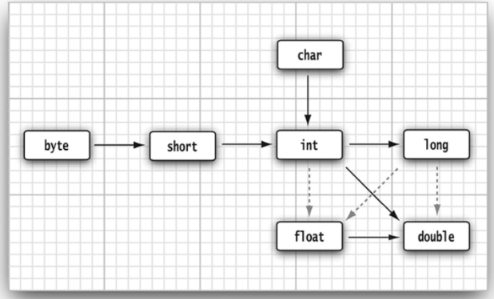
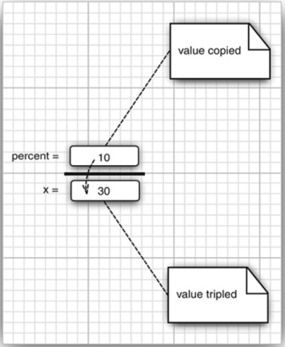
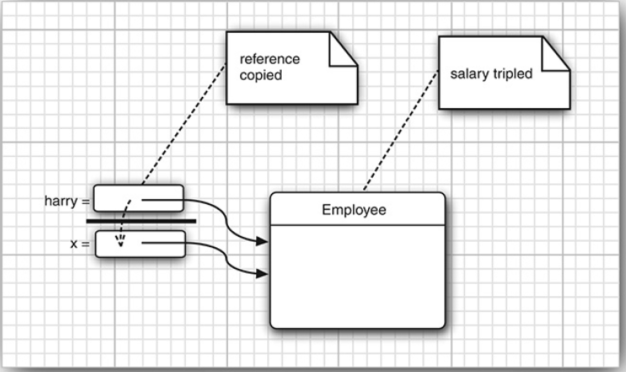
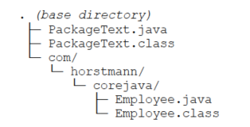
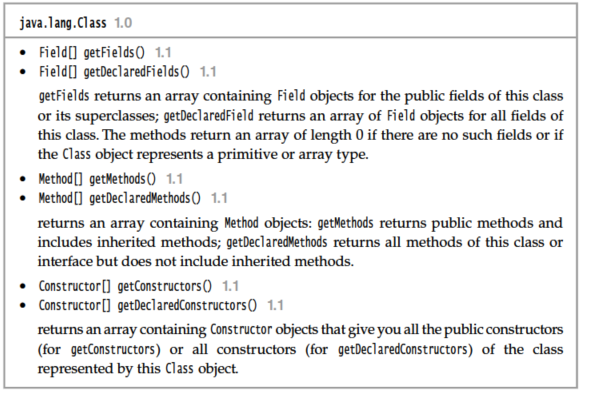
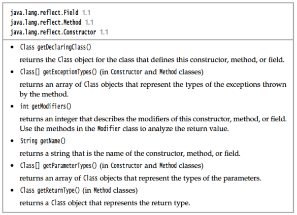
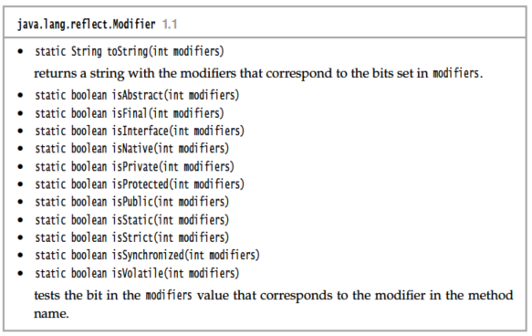
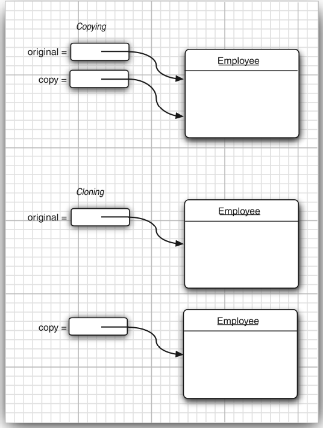

# Java 核心技术 vol 1 : fundamentals
By [Cay Horstmann](https://horstmann.com/corejava/)

## Chap 01 : Intro to java

java 并不是一种程序设计语言, 而是一个完整的平台, 有一个庞大的库,包含了很多可以重用的代码和一个完整的提供诸如安全性\跨操作系统的可移植性以及自动垃圾收集等服务的执行环境. <br>
面向对象是一种程序设计技术, 它将重点放在数据(对象) 和对象的接口上.Java 和 C++的主要不同点在于多继承, 在java中取而代之的是简单的接口(interface)概念. <br>
**体系结构中立**: 编译器生成的是一种体系结构中立的目标文件格式, 一种编译过的代码, 只要有java的运行时系统, 就可以在许多处理器上运行. 解释字节码比全速运行机器指令慢很多, 但是可以将最频繁的字节码序列翻译成为机器码, 这个过程称为 **即时编译**(Just-In-Time).<br>
Java 规范中没有依赖具体实现的地方, 基本数据类型的大小以及相关的算法都有明确地说明. 此外, Java 把多线程的实现交给了底层操作系统或多线程库来完成.<br>
**动态性**: java 与 C/C++ 相比更加具有动态性, 库中可以自由地添加新方法或者实例变量,对客户端却没有影响, 在Java中得到运行时类型信息十分简单.<br>

## Chap 02 : Java 编程环境

| Name | 简称 |   解释      |
| ---- | ---- |  --------- |
| Java Development Kit| JDK | 编写 Java 的程序员使用的软件|
| Java Runtime Environment | JRE | 运行 Java 程序的用户使用的软件|
| Standard Edition | Java SE | The Java platform for use on desktops and simple server applications |
| Enterprise Edition| Java EE | The Java platform for complex server applications |
| Micro Edition| Java ME | 用于微型手机和其他小型设备的Java平台|

安装 Java 开发工具箱
* 下载 JDK
* 设置执行路径如在 Linux 的 shell run command(如 .zshrc)中加入 `export PATH=jdk/bin:$PATH`
* 安装 源代码和库文件 `jdk-doc`, `wget https://horstmann.com/corejava/corejava.zip`
* 命令行界面 / IDE 编写程序

## Chap 03 : java 基本的程序设计结构

对于一个 C++ 程序员员而言, 更需要关注的是两者之间的区别.<br>
* java 语言规范, main 方法必须设置为 public
* java 中所有的函数(方法) 都属于某个类, 因此 main 方法必须有一个外壳类, main 方法设为 void 没有给操作系统返回退出代码, 正常的情况下退出代码为0, 如果要在终止程序时候 **返回其他代码, 调用 `System.exit()` 方法**
* java 为强类型语言, 一共有 8 种基本数据类型, 4种整形. 2种浮点类型 1种用于表示unicode 的 char 还有一种 Boolean, 如果需要在数值计算中不含任何舍入误差, 就应该用 `BigDecimal` 类
* java 为了保证在所有机器上都得到相同的运行结果, 每一种数据类型的取值范围都是固定的, 并且没有任何无符号类型(unsigned type)
* C++ 中指针或者数值可以替代 boolean 值, 但是 java 不行
* C++ 中区别声明与定义一个变量, 但是Java 不做这种区分
    ```C++
    int i = 10 ; // C++ 定义一个变量
    extern int i ; // C++ 声明一个变量
    ```
* Java 中用关键词 `final` 声明一个常量, 表示该变量只能被赋值一次, 如果希望某个常量可以在一个类中的多个方法使用, 可以设置为 `static final`, `const` 是 Java 保留字, 但是没有使用 
* C 中的右移运算都是用 `>>`(实际上是为 unsigned 定义的), 但是在 Java 中 `>>>` 用0 填充高位, `>>` 用sign bit 填充高位
* Java Math 类中的方法(全都是静态方法) 都是使用 计算机浮点单元中的例程, 如果可预测结果比速度重要的话应该用 `StrictMath` 类
* 数值类型之间的相互转换<br>
    <br>
    注意的是不要在 boolean 类型和任何数值类型之间做强制类型转换
* 自定义枚举类型的使用方法如下<br>
    ```Java
    enum Size {Small, Medimum, Large, ExtraLarge};
    Size s = Size.Small;
    ```
* 在 Java 中, 字符串是不可修改的, 只能用 `substring()` 这个方法将老字符串的部分取出来拼接, 这样 <font color=red> 编译器可以让字符串共享 </font>. C++ 重载了操作符 `==` , 但是 Java 中判断两个string 是否相等用的是 `str1.equals(str2)`.java 字符串使用 char 序列构成, 大部分常用的 Unicode 字符使用一个代码单元就可以表示, 辅助用的则是采用 一对. 
* 有时候需要使用较短的字符串构建一个新的字符串, 采用连接的方式效率比较低, 每次都要创建一个新的 string 对象, 使用 StringBuilder 就可以, 添加的时候调用类的 .append(strTail) 方法. 
* 控制台输入是 创建一个 `Scanner` 对象, 并且与 `System.in` 关联,  因为输入可见, 不适合从控制台读取密码, Java SE 6 引入了 `Console` 对象, 格式化输出则沿用了 C 语言库函数 `printf` 的方法
* 文件输入与输出, 就要用 File 对象构造一个 Scanner 对象:
    ```Java 
    Scanner in = new Scanner(Path.of("myfile.txt"), StandardCharsets.UTF_8);
    PrintWriter out = new PrintWriter("myfile.txt", StandardCharsets.UTF_8);
    ```
    如果Scanner 文件找不到的话 或者 PrintWriter 无法创建就会抛出异常 `IOException`.
* 块作用域, 在 C++ 中可以在嵌套的块中重新定义同名变量, 内层会覆盖外层定义的变量, 使用 `::` 可以访问全局定义的该变量, 但是在 Java 中不允许怎么做. 
* Switch 语言的标签 必须是 **整数或者枚举变量**, 不能测试字符串
* 若 基本的整数和浮点数不符合要求, 可以使用 `BigInteger` 和 `BigDecimal` 类, 使用时不能用我们常见的运算符, 因为语言没有重载该运算 Java 程序员没有重载运算符的权力.
* Java 习惯使用 类型与变量名分开的数组声明方法(`int[] a = new int[100]`), 同时支持 range-based for loop.
* Java数组的拷贝, 直接使用 = 将导致两个变量引用同一个数组, 想要实现深拷贝的效果 使用 `Arrays.copyOf(src, src.length())` 静态方法
* Java 的多维数组不能用 for each 自动处理二维数组中每个元素, 而是按行处理, 同时可以用于不规则数组

## Chap 04: Objects and Classes
### 概述
#### 类
Java 语言是完全面向对象的, 每个对象包含对用户公开的特定功能部分以及隐藏的实现部分. 过去说Algorithms + Data Structures = Programs, 而 **OOP 将数据放在第一位, 确定需要操作的数据, 然后再决定操作数据的算法**. <br>
* **类** 是构造对象的模板或者蓝图, 由类构造对象的过程成为创建类的实例(instance)
* **封装**: 将数据和行为组合在一个包内, 并且对对象的使用者隐藏了数据的实现方式.  数据被称为 实例域(instance field), 操纵数据的过程称为方法(method), 封装的关键在于 **绝对不能让类的方法可以直接地访问其他类的实例域**, 程序仅通过对象的方法与对象数据进行交互. 

#### 对象
对象的三个主要特性:
* 对象的行为: 可以对对象施加哪些操作
* 对象的状态: 施加方法时, 对象如何响应
* 对象的标识: 如何辨别具有相同行为与状态的不同对象

对象的状态必须通过方法的调用实现, 否则说明封装性出现了问题. <br>

面向对象的系统没有所谓的顶部, 我们首先从设计类开始, 然后再往每个类中添加方法. 一般而言 方法对应着动词, 实例域对应着名词. 

#### 类之间的关系

类之间常见的关系有:
* 依赖("use a"): 常见的是一个类的方法操纵另一个类的数据
* 聚合("has a"): 类 A 的对象中 包含类 B 的对象
* 继承("is a"): 表示特殊与一般的关系

### 使用现有类
#### 对象与对象变量
想要使用对象, 首先需要构造对象并且指定其初始状态, 然后对 对象施加方法. <br>
Java 中使用构造器(constructor) 构造对象的实例, 它是一种特殊的方法, 用于构造并且初始化对象. 一个对象变量 如 `Data deadline`; 中的deadline 并没有实际包含一个对象, 而仅仅是 初始化之后引用一个对象. 可以显式将对象变量设置为 null, 表明它目前没有引用任何对象. 这种引用和 C++ 中的引用有很大的区别, 比如 C++ 中没有空引用, 而且引用不能被赋值引用其他对象, 行为上, **Java 中的引用变量更像是 C++ 中的对象指针**. Java 中所有对象都是存储在堆中, 不用担心内存管理问题, 垃圾回收器会处理相关的事宜. <br>

#### 更改器方法和访问器方法
需要查询类的信息应该使用类的 get 方法(访问器方法), set/add 方法是对对象的状态进行修改(更改器方法), 在 C++ 中往往会给访问器方法加 const 修饰符(不改变对象的状态), 但是 **Java 并无明显的区分**. 

### 使用用户自定义类
#### 一个简单的雇员类
文件名必须与public类的名字相匹配。在~个 源文件中，只能有一个公有类，但可以有任意数目的非公有类。
```Java
class ClassName
{
    constructor1;
    constructor2;
    ...
    method1; 
    method2;
    ...
    field1;
    field2;
    ...
}
```
#### 多个源文件的使用
如果我们使用的是多个类如 Employee.java + EmployeeTest.java , 那么在编译的时候可以是用两种方式:
* 使用通配符调用 Java 编译器
    ```Shell
    javac Employee*.java
    ```
* 直觉编译 EmployeeTest, 可以理解为 Java 内置了 make 功能, 可以自动查找依赖的 class , 如果依赖的 .java 有新版本, 则会重新编译输出 .class 文件

#### 从构造器开始

我们看雇员类的构造器:
```Java
public Employee(String n, double s, int year, int month, int day) 
{
    name = n;
    salary = s;
    hireDay = LocalDate.of(year, month, day);
}
new Employee("James Bond", 100000, 1950, 1, 1);
```
构造器和类同名,总是伴随 new 操作符的执行被调用, 不能对一个已存在的对象调用构造器实现 实例域 的设置.<font color=red> C++ 程序员容易犯的错误就是忘记 _new_ 操作符 </font>. 

#### 隐式参数与显式参数
* 隐式参数值得是出现在方法名前的 Employee 对象, 相当于 C++ 中默认传入的 this 指针
* 显式参数就是明确在方法声明中列出的参数

```Java
public void raiseSalary(double byPercent){
    double raise = this.salary * byPercent / 100;
    this.salary += raise; // this 其实可以省略
}
```
C++　和 Java 的类其实还有一个重要的区别, C++ 中通常在类的外面实现成员函数, 类内部的实现自动称为 inline 函数, <font color=red>但是在Java 编程中, 所有的方法都必须在类的内部定义</font>, 是否将方法设置内联是 Java 虚拟机的任务. 

#### 封装的优点
需要设置实例域的值, 应该提供 私有的数据域, 公有的域访问器方法, 公有的域更改器方法. 这样做比直接公开数据域复杂, 但是可以有很多好处:
1. 可以改变内部实现, 除了改变类的方法外不会影响其他代码
2. 更改器方法可以执行错误检查, 而直接对域进行赋值不能做这个处理

#### 基于类的访问权限
如比较两个雇员是否为同一人:
```Java
Class Employee{
    ...
    boolean equals(Employee other){
        return name.equals(other.name);
    }
    ...
}
if( peter.equals(boss)) ...
```
equals 方法不仅可以访问 peter 的私有域, 还能访问 boss 的私有域, 这都是合法的, <font color=blue> 因为类的方法可以访问同类的任何一个实例的私有域</font>.<br>

#### 私有方法
很多时候可以将方法设为私有, 如一个计算代码划分为多个辅助的方法, 通常这些方法不应该成为公有接口的一部分, 因为他们往往与当前的实现机制关系非常紧密, 或者需要一个特别的协议以及一个特别的调用顺序.如果数据的表达方式发生变化, 这些私有方法不再需要的时候可以删去它, 因为类外的其他方法不可能直接调用他们. 

#### Final 实例域
将实例域设为final, 构建对象时必须初始化这样的域, 构造器执行后, 其值被设定, 在后面的操作中不能对它进行修改. **一般这种用于基本数据类型 或者不可变类(如 sring)的域, 修饰可变类可能给阅读程序带来混乱.**

### 静态域和静态方法
#### 静态域
如果将域定义为 `static`, 每个类中只有一个这样的域. 普通的域则是类的每一个对象都有一根自己的拷贝. <br>
静态变量用的比较少, 一般是用一个静态的常量, 如 $\pi$ 在 Math 类中可能是这样表示的:
```Java
public class Math {
   ...
   public static final double PI = 3.14159265358979323846;   
   ...
}
double myAera = 3 * 3 * Math.PI;
```

#### 静态方法
可以认为静态方法是不带 this 参数的方法, 静态方法不能操作对象, 所以不能再静态方法中访问实例域, 一般是在下面两种情况下使用静态方法:
* 一个方法不需要访问对象状态, 需要的参数都是通过显式参数的方式提供('Math.pow()')
* 一个方法只需要访问类的静态域

<font size = 4> Factory 方法</font>: 静态方法的另一种常见用途, 产生不同风格的格式对象, 如下面的代码, 使用的原因有两个: 

```Java
NumberFormat currencyFormatter = NumberFormat.getCurrencylnstance();
NumberFormat percentFormatter = NumberFormat.getPercentInstance();
double x = 0.1;
System.out.println(currencyFormatter.format(x)); // prints $0.10
System.out.println(percentFormatter.format(x)); // prints 10 %
```
* 无法命名构造器
* 使用构造器的时候无法改变构造的对象类型

#### Main 方法
不需要使用对象调用静态方法, 而 main 也是静态的, 在启动程序前没有任何一个对象. 值得注意的是, 每一个类可以有一个 Main 方法, 这常常用于进行单元测试.如一个 StaticTest.java 中有两个类, Employee 和public的StaticTest, 那么就可以分别执行
```Shell
java Emplpyee
java StaticTest
```
分别执行两个 main 方法. 

### 方法参数

Java 程序设计语言总是采用值调用的方式, 方法得到的是参数值得一个拷贝, 不能修改传递给它任何参数变量的内容, 方法参数工有两种类型, 基本数据类型和对象引用, 他们作用的方式如下图:
* 基本数据类型<br>
    
* 引用类型(对象的引用 和 它的拷贝引用同一个对象)<br>
    

Java 中对对象采用的不是引用调用, **而是引用进行的值传递, 因此 一个方法不能实现让对象参数引用一个新的对象**.

### 对象构造
对象的构造非常重要, Java 提供了多种编写构造器的方式. 如果过个方法有相同的名字同时参数类型不同, 便产生了重载. 如果编译器找不到匹配的参数, 或者找出多个可能的匹配, 就会产生编译时错误. 

#### 默认初始化
如果在构造器中没有显式地给赋予初值, 那么被自动地赋为默认值: 数值为0, 布尔值为 false, 对象引用为 null. 但一般不建议这么做, 不明确地初始化, 会影响代码的可读性.

#### 默认构造器
指的是没有参数的构造器,  和 C++ 一样, 如果在编写一个类的时候没有编写构造器, 系统就会提供一个默认构造器, 该构造器将所有的实例域设置为默认值. 但是类中提供了至少一个构造器, 但是没有提供默认构造器时, 构造对象不提供参数就会被视为不合法. 

#### 显式初始化
可以在类的定义中, 将一个值赋给任何域, 执行构造器之前, 先执行赋值动作, 初始值不一定是常量:
```Java
class Employee {
   private String name = ""; 
   ...
}
```

#### 调用另一个构造器

关键词 this 还有另一个含义, 可以用来调用同一个类的另一个构造器, 例如:
```Java
public Employee(double s)
{        
    // calls Emiployee (String, double)    
    this("Employee #" + nextId, s);
    nextId++;    
}
```
此外还有一种是初始化语句块, 在类的声明中可以包含多个代码块, 只要构造对象, 这些块就会被执行. 对类的静态域进行初始化的代码比较复杂, 可以采用 静态的初始化块. 

```Java
public Employee(double s)
{        
    ...
    static{
        Random generator = new Random();
        nextId = generator.nextInt(1000);
    }
}
```
#### 对象析构与 _finalize_ 方法
由于Java 有自动的垃圾回收器, 不需要人工回收内存, 所以 Java 不支持析构器. 某些对象使用了内存之外的资源, 当资源不需要的时候将它回收和再利用就比较重要. **可以为一个类添加 finalize() 方法, 它将在垃圾回收器清除之前调用**.

### 包
Java 允许使用包将类组织起来, 使用包的主要原因是确保类名的唯一性. 

#### 类的导入
可以使用 import 语句导入一个特定的类或者整个包:
```Java
import java.util.*;
import java.util.Data;
// 发生命名冲突时,如 sql 和 util 都有date 类
import java.util.*;
import java.sql.* ;
import java.util.Data; // 只使用 Java.util中的 Data
// 两者都要使用的时候, 在每个类前面加入完整的包名
java.util.Data deadline = new java.util.Date();
java.sql.Date today = new java.sql.Date(...);
```

#### 静态导入
import语句还可以导入静态方法和静态域, 常见的两个实际运用在于
* 算术函数, 对math 类进行静态导入, 更自然的方式使用算术函数
    ```Java
    // import
    Math.sqrt(Math.pow(x,2)+Math.pow(y,2));
    // Static Import
    sqrt(pow(x,2)+pow(y,2));
    ```
* 笨重的常量(大量名字冗长的常量, 用静态导入比较方便)

#### 将类放入包中
<br>
在 Employee.java 中可以这样写:
```Java
package com.horstmann.corejava;
public class Employee {
    ...
}
```
编译器在编译文件的时候不检查目录结构, 但是最终 虚拟机找不到类包 可能会导致程序无法运行. <br>
如果没有指定 private 或者 public, 这个部分的方法或者变量可以被同一个包中所有方法访问.<br>

### 类路径
为了使类可以被多个程序共享, 需要做到下面几点
1. 把类放在同一个目录中
2. 将Jar放在一个目录中(如 /home/user/archives)
3. 设置类路径(class path)

Javac 编译器总是能在当前的目录中查找文件, 但是 java 虚拟机仅在classpath 有 "." 才查看当前目录, 默认没有设置classpath 是没有问题的, 但是如果设置的 classpath 而 classpath 不包含 . 目录时, 程序依旧可以通过编译, 但是无法正常运行.
```C
// unix
java -classpath /home/user/classdir:.:/home/user/archives/archive.jar MyProg
// windows
java -classpath c:\classdir;.;c:\archives\archive.jar MyProg
```

### 文档注释
JDK 中包含 javadoc, 可以从源文件中生成一个 Html的文档, 它从下面的特性中抽取信息
* 包
* 公有的类与接口
* 公有的和受保护的方法
* 公有的和受保护的域

类注释: 放在 import 语句后, 类定义之前<br>
方法注释: 通用标记外还能有三种标记(@param variable description,@return description, @throws class description )<br>
通用注释: @author name, @see tag ...
### 类的设计技巧

1. 一定要将数据设计为私有
2. 一定要对数据进行初始化: 最好不要依赖于系统的默认值
3. 不要在类中使用过多的基本数据类型
4. 不是所有的域都需要独立的访问器或者域修改器
5. 采用标准格式进行类的定义
6. 将职责过多的类进行分解
7. 类名和方法名要体现其职责

## Chap 05: Inheritance

继承已经存在的类就是附中这些类方法和域, 在此基础上还可以添加一些新的方法和域, 以满足程序设计的要求.<br>
反射指的是在程序运行期间发现更多的类及其属性的能力, 可以先浏览
//TODO:日后返回来学习.

### 类 超类 和 子类
经理和雇员之间明显存在着 `is-a` 关系(继承的主要特征), 于是我们可以有以下代码:
```Java
public class Manager extends Employee{
    // added methods and fields
}
```
<font color=red> java 中的所有继承都是公有继承, 不存在 C++ 中私有继承,保护继承的概念</font>. 已经存在的类被称为 超类/父类/基类, 新类型被称为 子类/派生类. **子类比超类拥有的功能更加丰富**, 超和子(super-/sub-) 来源于集合论中的术语, 不表示功能多少. <br>
通过拓展超类的方式定义子类的时候, 只需要指出两者的不同之处. 超类的某些方法对于子类不一定使用, 这时候需要用覆盖的方式替代(区别于重载).例如一个 Manager 的工资可能还有 bonus, 需要重载 getSalary 方法:

```Java
public double getSalary() {
   return salary + bonus; // won't work 
}
```
而 **Manager 类无法直接访问超类的私有域**, 就必须从公有方法的接口访问, 如果 getSalary() 调用 getSalary(), 就会造成无限调用自己, 最终的解决方案是 <font color=red>引入了 _super_ 关键字 </font>.

```Java
public double getSalary(){
    double baseSalary = super.getSalary();
    return baseSalary + bonus;
}
```

super 和 this 不同, 它不能理解为一个对象的引用, 只是提示编译器调用超类的方法. 在 C++ 中是使用 `superClassName::method()` 的方式调用. 此外, 可以在构造器中使用 super. 

```Java
public Manager(String name, double salary, int year, int month, int day)
{
    super (name, salary, year, month,);// 调用 super 的构造函数
    bonus = 0; 
}
```
如果子类没有显式调用超类的构造器, 那么将调用超类默认的构造器, 如果超类没有带默认构造器(没有自定义构造器时会自动生成), 那么 Java 编译器会报告错误.运用场景 this 相似, 有两个用途, 其一是隐式类型参数, 其二是调用类的其他构造器.在 C++ 中可以用列表初始化调用父类的构造器, <br>
```Java
Manager::Manager(String name, double salary, int year, int month)          
:Employee(name, salary, year,      month,     day)
{
    bonus = 0; 
}
```
使用的时候, 可以让 Employee 类型的引用变量引用 Manager 的对象(多态), 在运行时自动选择调用哪种方法(动态绑定).<font color=blue> 在 Java 中, 不需要将方法声明为虚拟方法, 动态绑定是默认的处理方式, 如果不希望一个方法具有虚拟特性, 可以将它标志为 _final_ .</font> <br>

#### 继承层次与多态
继承并不一定仅限于一个层次, 层次继承中从某个特定的类型到其祖先的路径被称为该类的 **继承链**. 但是 <font color=red> Java 不支持多继承, 只能通过继承超类 + 实现接口 实现事实上的多继承</font>.<br>
继承体系中有 "is-a" 关系, 即每个对象都是其超类的对象, 但是反过来不成立, 另一种表述就是 "置换原则", 在程序中使用超类对象的任何一个地方都可以用子类对象替换. 对象变量是多态的, 一个 Employee 变量既可以引用 Employee 对象, 也可以引用 Manager 对象. 

```C++
Manager boss = new Manager("Carl Cracker", 80000, 1987, 12, 15); 
boss.setBonus(5000);
Employee staff = new Employee[3]; //OK
staff[0] = boss; 
staff[0].setBonus(5000); // ERROR
```

staff 存的是一个 Employee 类型的对象, **不能直接调用 setBonus 的方法, 需要做强制类型转换之后才能使用**.

#### 动态绑定

首先回顾一下调用过程的详细描述:
1. 编译器查看对象的声明类型和方法名. 调用 x.f(param) 且 x 声明为 C 类的对象. 编译器将意义列举所有 C 类中名为 f 的方法和其超类中访问属性为 public 且名为 f 的方法.
2. 编译器根据调用方法提供的参数类型, 选择方法, 这个过程称为重载解析, 由于允许类型转换(`int -> double`, `Manager -> Employee`...), 这个过程可能很复杂<br>
    如果子类定义了一个与超类签名相同的方法, 这个方法就可以覆盖超类的, 覆盖的时候一定要保证返回类型的兼容, 如:
    ```Java
    // in Employee class
    public Employee getBuddy() { . . . }
    // in Manager class
    public Manager getBuddy() { . . . } // OK to change return type
    ```
    我们称这两个 getBuddy 方法具有可协变的返回类型. 
3. 如果是 private/ static/ final 方法或者构造器, 编译器将准确知道调用哪个方法, 这种被调用方式称为**静态绑定**
4. 程序运行的时候, 采用动态绑定的方式, 虚拟机一定调用与 x 所引用对象 **实际类型最适合的那个类的方法**, 每次调用都进行搜索的时间开销非常大, 虚拟机预先为每个类创建了方法表.

动态绑定的一个重要特性是, **无需对现存的代码进行修改, 就可以对程序进行拓展**, 同时需要注意的是, 覆盖一个方法的时候, <font color=red> 子类方法的可见性不能低于超类方法的可见性 </font>.

#### 阻止继承: final类和方法
不允许拓展的类被称为 _final_ 类, 如不希望人们定义 Executive 的子类, 可以用下面的做法:

```Java
public final class Executive extends Manager { ... }
```

类中的方法也可以设置为 final, 如果这样的话子类就不能覆盖这个方法:

```Java
public class Employee{
    ...
    public final String getName() { return name; }
    ...
}
```

域也可以声明为 final, 对于 final 域, 构造对象之后就不允许改变他们的值了, 如果将一个 类声明为 final, <font color=pink> 那么其中的方法自动转为final, 而不包括域</font>.
有很多程序员认为, 如果没有足够的理由使用多态性, 那么所有的方法都声明为 final, 如 C++/C# 中没有特别地声明, 所有的方法都不具备多态性. 

#### 强制类型转换

正如有时需要将浮点数值类型转换为整型值, 有时候也需要将某个类的对象引用转为另一个类的对象引用. 进行转型的唯一原因是, <font color=red> 在暂时忽视对象的实际类型之后，使用对象的全部功能。</font>  例如我们要将存放在 Employee 数组 staff 中 的 Manager 元素复原成 Manager,只有在使用 Manager 中特有的方法时才需要进行类型转换. 将一个值存入变量时，编译器将检查是否允许该操作。将一个子类的引用赋给一个超类变量，编译器是允许的。但将一个超类的引用赋给一个子类变量，必须进行类型转换，这样才能够通过运行时的检查, 于是应该养成这样一个良好的程序设计习惯：在进行类型转换之前，先查看一下是否能够成功地转换。

```Java
if (staff[1] instanceof Manager) {
  boss = (Manager) staff[1];
}
```
这个转型的用法来源于 C语言, 处理过程类似于 C++ 中的 `dynamic_cast`,  两者的区别在于转型失败的时候C++ 生成一个 null 对象, 而 Java 抛出异常, 异常的成本相对高昂, 于是我们在转型前使用 `instanceof` 运算符检查.

```C++
Manager boss = (Manager) staff[1]; // Java
Manager* boss = dynamic_cast<Manager*>(staff[1]); // C++
```

#### 抽象类

从某种程度看, getName() 这种方法可以放置在更高抽象层次的通用超类中, abstract 关键字用于修饰类和方法, <font color=red> 为了提高程序的清晰度，包含一个或多个抽象方法的类本身必须被声明为抽象的 </font>. 

```Java
public abstract class Person{
    ...
    public abstract String getDescription(); 
}
```
除了抽象方法之外, 抽象类 <font color=pink> 还可以包含具体的数据和具体方法</font>. **许多程序员认为，在抽象美中不能包含具体方法。 建议尽量将通用的域和方法（不管是否是抽象的）放在超类（不管是否是抽象类）中。**<br>
<font color=red>类即使不含抽象方法，也可以将类声明为抽象类, 抽象类的代价是不能被实例化。</font>

```Java
new Person("Vinee Vu"); // error
Person p = new Student("Vince Vu", "Economics"); // correct
```

抽象方法有点类似于 C++ 语言中的纯虚函数 (`virtual void someFunc() = 0;`), C++ 中只需要有一个纯虚函数, 这个类就是抽象类. <br>

如果不在 Person 中定义 `getDescription()` 方法,而是放到 Employee 和 student 中,  就不能通过变量 p 调用getDescription方法了。

#### 受保护访问

人们希望超类中的某些方法允许被子类访问，或允许子类的方法访问超类的某个域。为此，需要将这些方法或域声明为 protected, 将超类Employee 中的hireDay声明为proteced, 而不是私有的，Manager中的方法就可以直接地访问它, **Manager类中的方法只能够访问 Manager 对象中的 hireDay 域，而不能访问其他 Employee 对象中的这个域**, Java 的四种访问修饰符号:
1. 仅对本类可见 ---- private
2. 对所有类可见 ---- public 
3. 对本包和所有子类可见 ---- proctected
4. 对本包可见 ---- 默认, 无需修饰符

### Object: 所有类的超类

Object 类是 Java 中所有类的始祖，在 Java 中每个类都是由它扩展而来的, 这意味着 <font color=red> 可以使用 Object 类型的变量引用任何类型的对象</font> :
```Java
Object obj = new Employee（"Harry Hacker", 35000） ;
Employee e = （Employee） obj;
```

#### _equals_ 方法
Object类中的equals方法用于检测一个对象是否等于另外一个对象。在 Object类中，**这个方法将判断两个对象是否具有相同的引用**。对于用户自定义的类型而言, 这种判断意义不大, 经常需要做的事情是判断两个对象的状态(实例域), 如果两个对象的状态完全一致, 那么就认为这两个对象是相等的. 
```Java
public class Employee
{
    ...
    public boolean equals(Object otherObject)
    {
        // a quick test to see if the objects are identical
        if (this == otherObject) return true;
        // must return false if the explicit parameter is null
        if (otherObject == null) return false;
        // if the classes don't match, they can't be equal
        if (getClass() != otherObject.getClass())
            return false;
        // now we know otherObject is a non-null Employee
        Employee other = (Employee) otherObject;
        // test whether the fields have identical values
            return name.equals(other.name)
            && salary == other.salary
            && hireDay.equals(other.hireDay);
    }
}
```
getClass 将返回对象所属的类, 只有在属于同一个类的情况下才可能相等. 在子类调用 equals 方法之前, 首先调用父类的 equals, 如果父类的域都检测失败则没必要检测子类的.<br>

```Java
public class Manager extends Employee
{
    . . .
    public boolean equals(Object otherObject)
    {
        if (!super.equals(otherObject)) return false;
        // super.equals checked that this and otherObject belong to the same class
        Manager other = (Manager) otherObject;
        return bonus == other.bonus;
    }
}
```
<font color=red size=4> 如果隐式和显式地参数不属于同一个类, equals 将如何处理? </font> <br>
Java语言规范要求equals方法具有下面的特性：

1. **自反性**: 对于任意非空的引用x, _x.equals(x)_ 应该返回 true
2. **对称性**: 对于任何引用 x 和 y, 当且仅当 _y.equals(x)_ 返回 true, _x.equals(y)_ 返回 true
3. **传递性**: 对于任何引用x 、y 和 z , 如果 _x.equals(y)_ 返回 true, _y.equals(z)_ 返回 true, _x.equals(z)_ 也应该返回true
4. **一致性**：如果 x 和 y 引用的对象没有发生变化，反复调用 _x.equals(y)_ 应该返回同样的结果。
5. 对于任意非空引用 x , _x.equals(null)_ 应该返回 false

现在回过头考虑, e 是一个 Employee 对象, m 为一个 Manager 对象, 两者具有相同的姓名/薪水和雇佣日期, 如果 e.equals(m) 在 Employee.equals 中应用 instanceof 关键词进行检测, 则返回 true, 这要求 m.equals(e) 也需要返回 true. 对称性不允许这个方法调用返回 false, 或者抛出异常. 于是可以从两个角度看待这个问题:

1. 如果子类能够拥有自己的相等概念, 则对称性要求建强制采用 getClass 进行检测
2. 如果由超类决定相等概念, 那么就可以使用 instanceof 进行检测, 这样 **可以在不同之类的对象之间进行相等性的检测**.

于是下面给出了一个编写完美 equals 方法的建议:

1. 显式参数命名为 otherObject, 稍后可能需要将它转换为一个叫做 other 的变量
2. 检测 this 和 otherObject 是否是引用同一个对象 (做小代价检测,一种优化)
3. 检测 otherObject 是否为 Null,  这个检测是很有必要的
4. 比较 this 和 otherObject 是否是同一个类, 根据上面两种情况决定是用 getClass 或者 instanceof
5. 将 otherObject 转化为 this 类的对象 other
6. this 和 other 做所有域的比较

#### _hashcode_ 方法

hashCode 方法定义在 Object 类内, 每个对象都有一个默认的散列码, 其值为对象的存储地址. <br>
如果重新定义了 equals 方法, 就必须重新定义hashCode 方法, **equals 和 hashCode 的行为必须一致**, 两个对象 equals 返回是 true, 那么应该产生一样的 hashCode. 例如, 如果使用 员工的 ID 去判断员工是否是同一个, 那么 hashCode 方法就是要用 ID 做散列, 而不是使用姓名或者存储地址.  而数组组成的域就可以调用静态的Array.hashCode 方法计算散列码, 它是由数组元素的散列码组成的.

#### _toString_ 方法

用于返回表示对象值得字符串, **只要对象与一个字符串通过操作符 "+" 连接起来, 编译器就会自动调用这个方法**, 获得一个关于该对象的字符串描述. <br>
数组继承了 Object 的 同String 方法, 数组类型将按照旧的格式打印, 修正的方法是调用静态的方法 `Arrays.toString(arrayName)`, 想要打印多维数组的话需要用 `Arrays.deepToSring(multiArrayName)`.

### 泛型数组方法

在 C 语言中, 必须在编译的时候就确定 non-heap based数组的大小, 而 Java 的情况就好很多, 允许在运行时确定数组的大小, <font color=red> 但是 java 中一旦确定了数组的大小, 改变它就不太容易了</font>. 最简单的解决办法就是使用一种被称为 _ArrayList_ 的类,**它是一种采用类型参数的泛型类, 具备自动调节容量的功能**:

```Java
ArrayList<Employee> staff = new ArrayList<Employee>();
staff.add(new Employee("Harry Hacker", ...));
```
如果可以事先估计数组可能存储的元素数量, 就可以在填充数组之前调用 `staff.ensureCapacity(100)` 或者将参数100 传给 ArrayList 构造器 `ArrayList<Employee> staff = new ArrayList<>(100)`, size() 方法将返回 ArrayList 中实际的元素数目, 一旦确认数组列表的大小不发生变化, 可以调用 `trimToSize` 方法, 垃圾回收器将回收多余的空间. 

#### 访问 ArrayList 元素

ArrayList 不是 java 程序设计语言的一部分, 只是某些人编写并且放在标准库中的一个实用类, 必须使用 get/set 方法实现访问或者改变 数组列表 的某个元素. 

```Java
// staff is an Array List
staff.set(i, harry);
// a is an Array
a[i] = harry;
```

一个技巧可以方便灵活扩展数组同时方便地访问元素:

1. 首先创建一个 ArrayList, 并且添加所有的元素
2. 执行完成之后再使用 toArray 方法将数组元素拷贝到一个数组中

ArrayList 也可以在中间插入/删除元素, 但是这种操作效率比较低, 如果经常需要在大的数组中间插入/删除, 这时候应该考虑链表.

#### 类型化与原始数组列表的兼容性

可以将一个类型化的数组列表传给原始的 ArrayList, 如

```Java 
public class EmployeeDB // Before Java SE 5.0, 没有泛型类
{
    public void update(ArrayList list) { . . . }
    public ArrayList find(String query) { . . . }
}
ArrayList<Employee> staff = . . .;
employeeDB.update(staff);
```
我们可以将类型化的数组列表传递给原始的 数组列表, 而不需要任何的类型转换, 相反地, 将一个原始的 ArrayList 赋值给类型化的 ArrayList 的时候就会出现一个警告, 使用类型转换并不能避免出现警告:

```Java
ArrayList<Employee> result = employeeDB.find(query); // warning
ArrayList<Employee> result = (ArrayList<Employee>) employeeDB.find(query);
                                        // yields another warning
```

### 对象包装器与自动打包

我们可以将几倍类型转换为对象, 这些类被称为包装类 (Wrapper), **对象包装器是不可变的, 一旦构造了包装器, 就不允许更改包装在其中的值**, 包装器类还是 final, 不能定义他们的子类. 

```Java
var list = new ArrayList<Integer>(); // 方括号内不允许基本类型
list.add(3);
// 自动转换成, 这个过程成为自动打包(autoboxing) 
// Integer.valueOf 为一个静态方法
list.add(Integer.valueOf(3));
int n = list.get(i);
// 自动转换成下面: 这个过程称为自动拆包
int n = list.get(i).intValue();
```
基本类型与他们的包装类型是不一样的, 比如两个 Integer a,b, 他们取 == 实际上是看两个变量是否指向同一个对象. 

### 参数数量可变的方法
现在的版本提供了可以用可变的参数数鼠惆用的方法, 有点像 C++ 11 的新特性可变参数模板,具体类似于这种定义:

```Java
public class PrintStream{
    public PrintStream printf(String fmt, Object... args) { return format(fmt, args); }
}
```

其中的 `...` 为 Java 代码的一部分, 表明可以接受任意数量的对象, 对于 printf 的实现者来说, `Obbject...` 参数类型和 `Object[]` 完全一样. 我们可以自定义可变类型参数的方法, 并且将参数指定为任意的类型, 甚至基本类型. 甚至可以将 Main 方法的输入参数这样设置, 下面是两个简单的实现:

```Java
public static double max(double... values)
{
    double largest = Double.NEGATIVE_INFINITY;
    for (double v : values) if (v > largest) largest = v;
    return largest;
}
public static void main(String... args){
    for(var arg:args)
        System.out.println( arg );
}
```

### 枚举类型

```Java
public enum Size { SMALL, MEDIUM, LARGE, EXTRA_LARGE };
```
Java SE 5.0 后允许用户自定义枚举类型, 而定义的类型实际上是一个类, 它刚好有四个实例, 在这里尽量不要构建新对象, 比较两个枚举类型的值时, 永远不要调用 equals, 而是直接使用 `==` 就可以了. <br>
如果需要的话, 可以往枚举类型中添加构造器, 方法 和 域, 下面就是一个简单的例子:

```Java
public enum Size
{
    // 总共四个实例, 每个实例在生成的时候调用构造器 Size
    SMALL("S"), MEDIUM("M"), LARGE("L"), EXTRA_LARGE("XL");
    private String abbreviation;
    private Size(String abbreviation) { this.abbreviation = abbreviation; }
    // getAbbr... 就是一个典型的方法
    public String getAbbreviation() { return abbreviation; }
}
```

### 反射

能够分析类能力的程序被称为反射, 反射库 (reflection library) 提供了一个非常丰富且精心设计的工具集，以便编写能够动态操纵 Java 代码的程序, 反射机制的功能十分强大:
* 在运行时分析类的能力
* 在运行时查看对象
* 实现通用的数组操作代码
* 利用Method 对象，这个对象很像C+＋中的函数指针

#### Class 类

Java 运行时系统始终为对象维护一个被称为运行时的类型标识, 这个信息跟踪着每个对象所属的的类. 保存谢谢信息的类 被称为 Class, getClass 方法将会返回一个 Class 类型的实例, 该类最常见的方法是 getName:

```Java
Employee e;
// ...
Class cl = e.getClass();
System.out.println(e.getClass().getName() + " " + e.getName());
```

如果类在一个包中, `getName()` 将同时包含包名, 如一个 String 对象 str, `str.getClass().getName()` 就会返回 `java.lang.String`. 还可以调用静态方法 `forName(className)` 获得类名对应的 Class 对象, 如 `forName("java.lang.String")` 将得到一个 Class 对象, 和 `str.getClass()` 得到的一样. 启动的时候递归加载需要的类, 会消耗很多时间, 一个技巧十分有用:

1. 确保包含 main 方法的类没有显式地引用其他类
2. 首先显示一个启动画面
3. 通过调用 `Class.forNmae` 手工加载其他类

如果 T 是任意的 Java 类型, T.class 将代表匹配的 Class 对象, 例如 

```Java
Class cl1 = Data.class ;  // if you import java.util.*
Class cl2 = int.class; // int 也可以这样做
```

从 Java SE 5.0 开始, Class 被参数化, Class<Employee> 的类型就是 `Employee.class`. 此外, Java 虚拟机为每个类型管理一个 Class 对象, 可以用 == 实现两个类对象的比较操作. 还提供一个很有用的方法, newInstance() 快速创建一个类的实例 如:
```Java
if (e.getClass() == Employee.class) ...
e.getClass().newInstance() ; // 调用默认构造函数, 得到一个与 e 同类型的实例
// 可以配合 forName 使用
String s = "java.util.Random";
Object m = Class.forName(s).newInstance(); 
```

#### 捕获异常

程序的运行过程中发生错误的时候, 就会 "抛出异常", 如果没有提供异常处理器, 程序就会终止. 将可能抛出已检查异常的一个或者多个方法的调用放在 try 语句块中, 然后再 catch 语句中提供处理代码:
```java
try{  
    Class cl = Class.forName(className);
}
catch(Exception e){
    e.printStackTrace();
}
```

#### 利用反射分析类的能力

<font color = red>在 java.lang.reflect 中有三个类 Field , Method 和 Constructor 分别描述类的域 \ 方法和构造器</font>, 他们都有一个叫做 getName 的方法，用来返回项目的名称。Field 类有一个 getType 方法，用来返回描述域所属类型的 Class 对象。Method 和 Constructor 类有能够报告参数类型的方法， Method 类还有一个可以报告返回类型的方法。这三个类还有一个叫做 getModifiers 的方法，它将返回一个整型数值，用不同的位升关描述public 和 static 这样的修饰符使用状况。我们需要做的全部工作就是调用Modifier 类的相应方法，并对返回的整型数值进行分析. <br>
值得注意的是, 他们可以分析 Java 解释器能够加载的任何类，而不仅仅是编译程序时可以使用的类。之后还将使用这个程序查看Java 编译器自动生成的内部类。<br>

<br>
<br>
<br>

#### 在运行时使用反射分析对象

知道想要查看域名和类型, 查看指定的域是很容易, **而利用反射机制可以查看在编译时候还不清楚的对象域**.
// TODO: Page 191 ~ 203

## Chap 06: 接口与内部类
接口技术, 主要用于描述类有怎样的功能, 而并不给出每个功能的具体实现. 

### 接口
在Java 语言中, 接口不是类, 而是对类需求的一种描述, 实现接口的类要遵从接口描述的同一格式进行定义, 接口的形式如下:
```Java
public interface Comparable {
    int compareTo(Object other); // 任何实现 Comparable 接口的类都需要有这个方法, 参数为 Object, 返回值为int
}
// Since Java SE 5.0
public interface Comparable<T> {
    int compareTo(T other); // parameter has type T 
}
```
接口中绝不能含有实例域, 也不能在接口中实现方法. 在接口中的所有方法都自动是 _public_, 不过在实现接口的时候必须把方法声明为 _public_. 具体接口的实现的例子如下:

```Java
// Before Java EE 5.0 , 需要使用转型实现
public int compareTo(Object otherObject) { 
    Employee other = (Employee) otherObject; 
    return Double.compare(salary, other.salary); 
}
// 将 Object 使用转型不太顺眼, 引入了泛型参数之后就消失了
class Employee implements Comparable<Employee> {
    public int compareTo(Employee other) {
    return Double.compare(salary, other.salary);
    }
    . . .
}
```

Java 是一种强类型语言, 调用方法的时候编译器会检查这个方法是否存在. 

#### 接口的特性

接口不是类, 尤其是 <font color=red>不能使用 _new_ 操作符实例化一个接口, 但是可以声明接口的变量, 可以使用 Instance 查看一个类是否实现了某些接口, 也可以被扩展</font>:

```Java
x = new Comparable(. . .); // ERROR
Comparable x; // OK
x = new Employee(. . .); // OK provided Employee implements Comparable
if (anObject instanceof Comparable) { ... }
public interface Moveable{     // 一个带有 move 方法的类
    void move(double x, double y);
}
public interface Powered extends Moveable{
    double milesPerGallon();
}
```

此外需要注意的是, 接口中不能包含实例域(非 static 的域)或者静态方法, 但是却可以包含常量( 接口中的方法默认是 public, 同时接口中的域被自动设置为 `public static final`):

``` Java
public interface Powered extends Moveable{
    double milesPerGallon(); // 一个 public 的非静态方法
    double SPEED_LIMIT = 95; // a public static final constant
}
```

尽管 Java 中不允许多继承, 但是继承一个超类的同时可以实现多个接口, 这为语言带了了很大的灵活性, 例如 语言中有一个非常重要的内置接口 Cloneable, 实现该接口就可以调用 Object 类的 clone 方法创建对象的一个拷贝.<br>
C++ 语言可以有多继承, 但是带来的一些 虚基类 / 控制规则 / 横向指针类型转换 等复杂特性, 很少有程序员使用多继承, 更多的是使用混合的风格, 一个主要的基类描述父类对象, 其他的基类扮演辅助的角色, 相当于现在 Java 的风格. <br>
可以为接口方法提供一个默认实现,必须用 default 修饰符标记这样一个方法:

```Java
public interface Comparable<T>{
    default int compareTo(T other) { return 0; }
    // By default, all elements are the same
}
```

### 对象克隆
拷贝一个对象和对象克隆有着本质的区别, 前者是两个引用变量引用同一个对象, 而后者默认的实现也是潜拷贝, 如果原始对象与潜克隆对象共享的子对象是不可变的(如String), 这样不会有任何问题. 但是更常见的情况可能是子对象可变, 这时候我们需要实现自己的版本:<br>
<br>
需要注意的是, Object 中的 clone 方法是 proctected的, 子类只能调用 clone 的方法克隆它自己, 为此我们需要重新定义 clone 方法, 并且将它声明为 public, 这样才能让所有的方法克隆对象.  值得注意的是, Cloneable 接口的出现并没有指定 clone 方法, 这个方法是从 Object 类继承而来的. 如果一个对象需要克隆, 但是没有实现 Cloneable 接口, 就会产生一个已检出的异常. 在 clone 默认实现已经满足需求时依旧需要实现这个接口, 并且调用 `super.clone()`, 不满足需求时,为了实现深拷贝, 我们必须克隆所有的可变实例域:

```Java
class Employee implements Cloneable{
// raise visibility level to public, change return type
    public Employee clone() throws CloneNotSupportedException{
      return (Employee) super.clone();
    }
    . . .
}
// deep copy
class Employee implements Cloneable{
    . . .
    public Employee clone() throws CloneNotSupportedException{
        // call Object.clone()
        Employee cloned = (Employee) super.clone();
        // clone mutable fields
        cloned.hireDay = (Date) hireDay.clone();
        return cloned;
    }
}
```

我们必须非常谨慎地实现子类的克隆, Manager 中可能存在一些需要深拷贝的类, 或者包含一些类没有实现 Cloneable 接口的实例域, 没有人保证子类的 clone 一定正确. 

### 接口与回调
回调 (callback) 是一种常见的程序设计模式。在这种模式中，可以指出某个特定事件发生时应该采取的动作。 在Java.swing 包中有一个 Timer 类，可以使用它在到达给定的时间间隔时发出通告。同时, Java 采用的是面向对象的方法, 将某个类的对象传递给定时器, 然后定时器调用该对象的方法. 由于对象可以携带一些附加的信息，所以传递一个对象比传递一个函数要灵活得多, 定时器需要知道自己调用的是哪个方法, 要求传递的对象实现某个接口:

```Java
public interface ActionListener{
    void actionPerformed(ActionEvent event);
}
class TimePrinter implements ActionListener{
    public void actionPerformed(ActionEvent event){
        System.out.println("At the tone, the time is " + new Date());
        Toolkit.getDefaultToolkit().beep();
    }
}
```

方法有一个 ActionEvent 参数, 提供了事件的相关信息. 

### 内部类

内部类 (inner class) 是定义在另一个类中的类, 引入的原因主要有三个:
1. 内部类方法可以访问该类定义所在的作用域中的数据，包括私有的数据。
2. 内部类可以对同一个包中的其他类隐藏起来。
3. 当想要定义一个回调函数且不想编写大量代码时，使用匿名 (anonymous ) 内部类比较便捷。

#### 使用内部类访问对象状态
