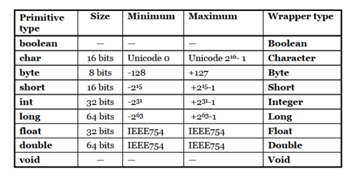

# Thinking in Java
author [Bruce Eckel](https://www.bruceeckel.com)
## Chap 1: 对象导论
### 抽象过程
**所有的语言都提供抽象机制**, Assembly language is a small abstraction of the underlying machine. Many so-called “imperative” languages that followed (such as FORTRAN, BASIC, and C) were abstractions of assembly language.**程序员必须建立机器模型和待解决问题之间的关联**,面向对象编程通过向程序员提供表示问题空间中元素的工具而更进了一步, 这种表示方式非常通用,Java基于的语言之一smalltalk有五个特性:
1. 万物都为对象
2. 程序是对象的集合, 他们通过发送消息来告诉彼此所要做的(调用请求)
3. 每个对象都有自己的由其他对象所构成的存储,因此可以在程序中构建复杂的体系
4. 每个对象都有其类型
5. **某一特定类型的所有对象都可以接收同样的消息**: 可替代性是OOP中最有力的概念

对象具有**状态(内部数据)\行为(方法)和标识(内存中的唯一地址).**
### 每个对象都有一个接口
抽象数据类型的运行方式与内置类型几乎完全一致: __你可以创建某一个类型的变量, 然后操作这些变量__, 类描述了具有相同特性(数据元素) 和 行为(功能)的对象集合.某个对象都只能满足某些请求, 这些请求由对象的接口(interface)定义,决定接口的就是类型,此外,程序中**必须要满足这些请求的代码**,这些代码与隐藏的数据一起构成了实现.

### 每个对象都提供服务
当试图开发/理解OO程序设计时, __最好的办法是将对象想象为"服务的提供者"__ .将对象看成服务提供者有助于提高对象的 __内聚性(cohesiveness)__ , 在良好的OO设计中, 每个对象都恰好完成一个任务,并且并不视图做更多事情.
### 被隐藏的具体实现
程序员的perspective分为类创建者和客户端程序员, 通常类创建者隐藏对象内部脆弱的部分,减少程序的Bug.同时类设计者可以改变内部的工作方式而不影响客户端程序员. Java用`public`(任何人都可以访问的)\ `private`(除了类型创建者和类型内部的方法之外任何人都不能访问的元素) 和`protected`(继承的类可以访问这种成员, 但不能访问private) 设定边界.
### 复用具体实现 
类被创建和测试过后, 理想条件下代表一个有用的代码单元, 可以复用. 最简单的复用方式就是直接使用该类的一个对象,如用组合(composition)的方式,代表一种 _has-a_ 的关系, 在建立新的类时, 应该**优先考虑组合,它更加灵活方便(松耦合)**.
### 继承
继承描述了这样一种观念,两个类可以有相同的特性和行为, 但是其中一个类型可能有更多的特性(属性)并且可以处理更多的信息/以不同的方式来处理信息(行为).这时候用同样的术语将解决方案转换成问题有很多好处, __使用对象\类型层次结构成为了主要模型, 而不需要在问题描述和解决方案之间建立许多中间模型__. 有两种方法处理导出类和基类的差异:<br>
* 直接在导出类中添加新的方法
* 改变现有基类的方法行为(overriding)

#### "是一个"与"像是一个" 关系
可以使用一个导出类对象来完全替代一个基类对象, 通常称之为 _替代原则_, 这是继承的一种理想方式. 还有一种替代并不完美, 因为基类没有新添加的方法, 这种情况可以描述为 _is-like-a_ 关系, 这就拓展了接口.
### 伴随着多态的可互换对象
在有的层次结构中, 方法操作都是基于泛化的对象, 这时通过导出新的子类乐意轻松拓展设计的能力, 极大改善了我们的设计, 同时也降低了软件的维护代价.<br>
在这个目的引导下, 面向对象的程序设计语言使用了 **后绑定** 的概念, 被调用的代码直到运行时才能确定. C++使用 virtual关键字来明确声明动态绑定, 而 在Java中, **动态绑定是默认行为**, 对于一个Circle/Squre...继承Shape的体系, `shap.draw()`的意思不是使用if-else去检查实际可行的代码, 而是说 **shap是一个Shape对象, 我知道你可以 _draw_ 你自己, 那么去做吧, 只要注意细节的正确性**.<br>
Java 是一个单根继承结构, 所有的类最终都继承自 **Object**.<br>
用容器装Object对象,然后取出来使用的时候会有向上和向下转型, 该转型带来非常繁重的运行时开销, 因此Java引入的参数化类型(泛型). <br>
```Java
ArrayList<Shape> shapes = new ArrayList<Shape>();
```
在Java中完全采用了动态内存分配的方式, 同时提供了垃圾回收机制, 它可以自动发现对象何时不再被使用, 继而销毁它. 

## Chap 2 : Everything Is an Object
Although it is based on C++, Java is more of a __“pure” object-oriented language__.<br>
### 用引用操作对象
我们在Java中的操作标识符(对象名)实际上是对对象的一个"引用"(reference, 在语法上更接近C++的引用而不是指针),因此我们可以用new将它和一个新的对象发生关联:
```java
String s = new String("asdf");
```
使用何种存储:
* 寄存器: Java中无法感受到它存在的迹象, 但是 C/C++中可以建议寄存器的分配方式
* 栈: 某些Java对象存在这(如对象的引用),但是对象本身不在这
* 堆: 通用的内存池, 用于存放所有的Java对象
* 常量区: 常常直接存放在程序代码内部, 这样不会被改变
* 非RAM存储: 两个例子,流对象和持久化对象. 

基本类型: 小的,简单的类型放在堆中不是很好处理:<br>
<br>
基本类型都有相应的包装器类(wrapper),用于从堆中创建相应的非基本对象. 此外还有两个用于高精度计算的类 _BigInteger_ and _BigDecimal_ 没有对应的基本类型. 对于数组, Java确保数组会被初始化, 而且不会做越界访问.<br>

### 永远不用销毁对象
在C/C++/Java中, 作用域由花括号的位置决定, 但是Java对象不具备和基本类型一样的生命周期
```Java
{
int x = 12; 
    {
        int x = 96; // Illegal in Java
    }
}
{
    String s = new String("a string"); 
} // S的作用域消失, 但是new的对象依旧占据内存空间
```
Java has a **garbage collector**, which looks at all the objects that were created with new and figures out which ones are **not being referenced anymore**.<br>

### 自定义的类
一旦定义了一个类, 就可以在其中设置两种类型的元素: 字段(fields,也被称为数据成员) 和 方法(有时被称为成员函数).如果类的数据成员是基本数据类型,即使不做初始化Java也确保它能获得一个默认值. 但是只在数据成员中这样,在局部变量定义中无此说明.<br>
Java方法的基本形式,包括名称/参数/返回值和方法体:<br>
```Java
ReturnType methodName( /* Argument list */ ) {
    /* Method body */ 
}
```
Java的机制意味着所有文件都能够自动存活于他们自己的名字空间内, 使用 _import_ 来明确告诉编译器想要的类包是什么.<br>
声明一个事物是static, 就意味着这个域或者方法不会与包含它的那个类的任何对象实例关联在一起.