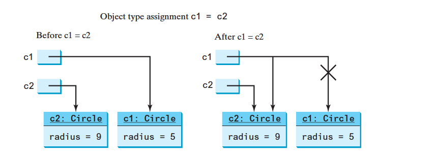
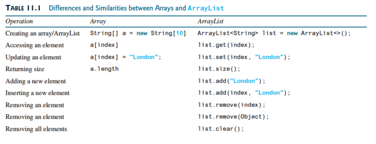
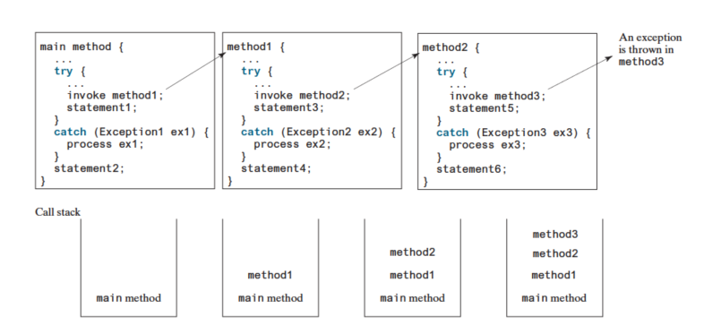
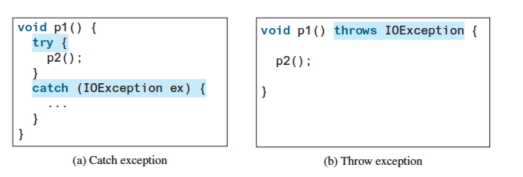
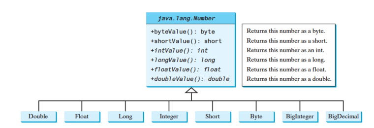

# Java语言程序设计与数据结构
[Y. Daniel Liang](https://yongdanielliang.github.io)
***
## Chap 1: 计算机、程序和java概述
计算机包含软件和硬件两个部分，硬件的组件通过一个总线(bus)子系统连接。<br>
<br>
编程语言:机器语言\汇编语言和高级语言.
<br>
**Java语言规范\ API\ JDK\ JRE** : <br>
- API也称为库, 包含开发Java程序而预定义的类和接口, 在[网站](download.java.net/jdk8/docs/api/)上可以看到最新版的API.
- Java有三个版本, Java标准版(Java SE) Java企业版(Java EE) 和 Java微型版(Java ME), 各个版本都带有开发工具包(Java Development Toolkit, JDK), 它由一组独立程序构成, 都是由命令行调用,用于编译\运行和测试Java程序.Java源程序是区分大小写的.

### 创建\编译\运行 java程序
**Java源程序由.java程序文件, 编译生成.class文件, 该文件由java虚拟机(JVM)执行**.拓展名必须为.java,并且文件名和公共类名字相同,具体的执行过程如下:<br>
<br>
.class字节码是低级语言, 类似于机器指令, 但是在体系结构中是中立的, 可以在任何带有JVM的机器中运行, JVM不是物理机器,而是一种解释JAVA字节码的程序.他们的行为大致可以用下图表示:<br>
<br>
在运行一个JAVA程序的时候, JVM 首先会用一个类加载器(class loader)的程序将类的字节码加载到内存中, 如果程序中还使用到了其他的类, 类加载器会在使用他们之前**动态**加载他们, JVM使用一个称为字节码验证器的程序检查字节码的合法性,确保字节码没有违反Java的安全规范.

## Chap 2: 基本程序设计

* 每一个Java程序都应该有一个main方法, 作为程序运行的入口, 变量名应该使用描述性文字,而不是x和y这种名字. 
* java的基本数据类型: **byte**, short, int, long, float 和 double

## Chap 3: 选择

### boolean 数据类型
保存布尔值的变量称为boolen variable, 只能是true和flase, **并且无法和int类型相互转换**.

### if 分支结构常见问题
* 在if行出现分号, 相当于一个空语句, 后面的语句块无论如何都会运行
* 悬空的else出现错位: 同一个块中, else总是和它最近的If子句匹配
* 浮点值的相等测试

常见的陷阱:
* 简化bool变量赋值
* 避免相同情形下的重复代码

条件操作`boolen-expression ? expression1: expression2;`
java产生随机数的方法`(int)(Math.random()*10)` .逻辑操作符和c++中的情形一直, 也是有!/&&/||/^用于产生复合布尔表达式.

### switch 语句
```Java
switch(status){
    case 0 : // do something
            break;
    case 1 : // do something
            break;
    default: // do something
}
```

* status必须计算出一个char, byte,short, int 或者String 类型, 必须用括号括住
* value必须是和status相同的类型, 而且是**常量表达式**

### 逻辑操作符
`&&` 和 `||` 都有短路计算的特点, 和C++中一致.

## Chap 4: 数学函数\字符和字符串

### 常见的数学函数
Java在Math类中提供了很多实用的方法,用来计算常用的数学函数, 例如`Math.PI`和`Math.toDegrees()`,他们主要可以划分成三个类型,
1. 三角函数方法
2. 指数函数方法
3. 服务方法

### 字符数据操作
1. Java的字符数据类型用于表示单个字符,如 `char letter = 'A'`;
2. Java支持Unicode(如 `char letter= '\u6B22'`) 和ASCII的字符编码
3. 对于特殊的字符, 需要有转义序列
4. char数据类型可以转换为任何一种数值类型,反之亦然
    ```java
    char ch = (char)0xAB0041; // 只保留了最后符合utf-8的那些位,显示为A
    char ch2 = (char)65.25; // float cast 成了 int 然后cast成char 'A'
    ```
    0 ~ FFFF中的任何一个十六进制正整数都可以隐式转为字符型数据, 而不在此范围内的任何其他数值都 __必须显示转为`char`__
5. java 的character类提供了很多方法用于字符测试

### String类型
String和System以及Scanner类一样,都是java库中一个预定义的类, 它是一个 _reference type_ ,同样的String对象有很多简单的方法, 如 length(), chatAt(index),concat(s1)等,他们都是 **实例方法**, 和Math类中的方法不同, Math类中的方法都是静态方法.调用方法分别为 `s1.length()`和 `Math.pow(2,2.5)`.<br>
* 从某个名为inp的Scanner读取String的方法有两种, `inp.next()`读取以空白结束的字符串,`inp.nextLine()`可以读取一整行.<br>
* 两个String对象s1,s2都是reference type,用 ==只能判断他们是否是指向同一个对象, 而字符串的比较需要使用String的方法, 如`s1.equals(s2)`,`s1.compareTo(s2)`.<br>
* `s1.substring(beginIndex,endIndex)`可以得到一个子串.<br>
* 使用 `Integer.paraseInt(s1)` 可以实现string向 int 的转换,同样的可以有 _Double.paraseDouble(s1)_,而数值类型转为String就只需要一个连接符, `String s = value + ""`

## Chap 5: 循环
我们经常使用一个循环变量count来执行对循环贷额计数, 但是我们需要注意两个问题:
1. 要保证循环的继续条件最终可以变成false
2. 程序员经常犯的错误就是循环多执行一次或者少执行一次(off-by-one error)

一次增加一个步骤的渐进编码是一个很好的习惯, 在我们不知道如何编写循环的时候, __可以编写只执行一次的代码, 然后再规划如何重复执行这些代码__, 从这里我们得到了循环设计的策略:
* stage 1: 确定需要重复的语句
* stage 2: 将这个语句写在一个循环中
    ```java
    while(true){
        // chunk of codes
    }
    ```
* stage 3: 为循环的条件编码, 并为控制循环添加合适的语句
    ```java
    while(循环继续条件){
        // chunk of codes
        用于控制循环的语句
    }
    // example: 用户确认或者标记控制循环
    Scanner input = new Scanner(System.in);
    char continueLoop = 'Y';
    while(continueLoop == 'Y'){
        // execute the loop once
        ...
        System.out.print("Enter Y to continue or N to quit:");
        continueLoop = input.nextLine().charAt(0);
    }
    ```
警告 : 不要使用浮点值相等来进行循环控制, 因为他们都是近似值,如 2.0 可能在实际存储是2.000...3.<br>
`do{...}while( );` 这种循环和while loop的唯一区别在于前者可以保证至少循环一次, 而 for loop 具有编写循环的简明语法, 和 C++ 一样, 如果循环控制变量只在循环内使用, 那么在初始操作中声明它是一个比较好的编程习惯:<br>
```java
for(初始操作 ; 循环继续条件; 每次迭代之后的操作){
    // 循环体
}
```
上面的初始操作和迭代后的操作都可以有多个使用逗号隔开的语句, 但是这不是好的编程习惯, 那会使得程序的可读性变差.<br>
三种loop在表达上是等价的,可以根据习惯在语境中选择自己觉得最直观/舒服的一种循环语句, __各种循环语句中多写一个分号是错误的,往往会造成严重的问题__:
```java
for(int i = 0; i < 10; i++);
{
    System.out.println("i is " + i);
    // 实际上这句话只打印一次 
}
int i = 0;
while(i < 10); //这里进入一个死循环
{
    System.out.println("i is " + i);
    i++;
}
```
但是在do-while loop中是需要"_;_"的, 一个循环可以嵌套在另一个循环之中, 而嵌套循环往往可能需要很长的运行时间.和C++一样, 在循环中也可以使用`continue`跳过当前这轮迭代,或者使用`break`跳过整个循环语句.<br>

## Chap 6 : 方法
方法可以用于定义可重用的代码以及组织和简化编码, 方法的定义由 方法名称\参数\返回值类型以及方法体组成:
```Java
修饰符  返回值类型 方法名(参数列表){
    // 方法体
}
```
<br>
方法名和参数列表一起构成方法的签名(method signature), 需要注意的是,在方法头中需要对每一个参数进行单独的数据类型声明,如 `public static int max(int num1, num2)` 就是错误的,在Java语言中,带返回值的方法也可以当语句调用, 只需要忽略返回值即可.方法可以带来代码的共享和重用, 在新类中,可以使用 `ClassName.MethodName()` 调用方法(c++中是 `ClassName::functionName()`).<br>
调用方法和别的语言一样,在系统中是用一种被称为call stack的内存结构实现,void方法不返回值,但是return可以用于提前终止程序,因此只能作为语句而不能出现在表达式中.<br>
在java中, **所有的方法调用都是通过传值的方式将实参传给形参**, 因此一般意义上对int之类值的swap函数, 调用完毕之后两个参数的值本身并没有发生交换.此外,实参必须与方法签名中定义的形参在次序和数量上相匹配, 并且在类型上兼容(隐式类型转换可以发生).<br>
<br>
使用方法封装的优点:
1. 将不同的问题分开, 可以使程序的逻辑更加清晰, 同时提高代码的可读性
2. 将实现某个功能的代码和错误都限制在方法中,缩小了调试范围
3. 其他程序可以复用这部分代码

和C++一样, 我们也可以重载方法, 实现使用同一个名字来定义不同的方法, __只要他们的参数列表是不同的__, <font color = red> 不能基于不同的修饰符或者返回值类型重载方法 . </font> <br>
变量的作用域指的是变量 __可以在程序中被引用的范围__,可以在一个方法的不同块中声明同名的局部变量, 但是不能在嵌套块或者通一个块中两次声明同一个局部变量(在C++中嵌套块内声明的同名变量会将外部的同名变量隐藏起来).<br>
软件开发的关键在于应用抽象的概念, 而抽象有多种层次, 方法抽象(method abstraction)是通过将方法的使用和它的实现分离实现的,这就被称为信息隐藏(information hiding) 或者 封装, 在编写一个大型程序的时候,可以使用分治的策略, 逐步求精,将大问题分解成子问题. <br>

## Chap 7 : 一维数组
单个的数组变量可以引用一个大的数据的集合,Java中提供了一个被称为array的数据结构,用来存储一个 __元素个数固定且类型相同的有序集合__, 数组一旦被创建, 那么它的大小就是固定的. <br>
```Java
// 声明数组
elementType[] arrayRefVar;
elementType arrayRefVar[]; // 为了方便从C转过来的程序员, 也允许这种写法, 但是不推荐
double[] myList; 
// 创建数组
arrayRefVar = new elementType[arraySize];
```
创建数组做了两个事情:
1. 使用 new语句创建了一个具有某种size 和 类型的array
2. 将该array的引用交给了 `arrayRefVal`

上面这些声明和赋值的语句也可以放在一起:
``` Java
elementType[] arrayRefVar = new elementType[arraySize];
// 例如
double[] arrayDoubRef = new double[100];
```
创建之后, 就可以使用Index访问数组中的某个元素 : `arrayRefVar[1] = 6.0;`, 值得注意的是, 数组变量看起来是存储了一个数组的数据, 实际上存储的是指向数组的引用.数组创建之后可以得到它的大小(`arrayRefVar.length`), 同时如果不赋值的话它的元素会有默认值(数值型的为 _0_, char的为 `\u0000`,boolen为 _false_)<br>
数组初始化有简写方式,这时候它们不能用new, 同时声明和初始化要放在同一个语句中:
```java
elementType[] arrayRefVar = {avlue0, value1, value2, ... , valuek};
double[] myList = {1.9, 2.0 , 4.0 };
// 错误的例子
double[] myList;
myList = {1.9, 2.0 , 4.0 };
```
Java 支持一个 foreach循环(类似于C++中的range-based for loop):
```java
for(double ele: myList){
    System.out.println(ele);
}
```
使用下标遍历的时候下标不能超过 arrayRefVar.length -1 , 否则会抛出一个运行时错误. __复制数组的时候需要将每个元素复制到另一个数组(深拷贝)__ : <br>

```Java
int[] sourceArray = {2, 3, 1, 5, 10};
int[] targetArray = new int[sourceArray.length];
for (int i = 0; i < sourceArray.length; i++) {
    targetArray[i] = sourceArray[i];
}
// 或者使用java.lang.System中的arraycopy方法
System.arraycopy(sourceArray, 0, targetArray, 0, sourceArray.length);
```
将一个数组作为参数传给方法时, **数组的引用将传给方法**, 这与基本类型的数据传给方法有一些不同:
* 对于基本数据类型参数, 传递的是实参的值, 在方法中修改不会影响方法外的数据
* 对于引用类型的数据, 传递的是对于数据的引用(hander),在方法内改变数组的值, 这种改变在方法外面也可以看到

这是因为数组在Java语言中是对象,Jvm将对象存储在一个被称为堆的内存区域.同样的, 在方法返回一个数组时,返回的是数组的引用.<br>
__可变长参数列表__ : 具有同样类型的数目可变的参数可以传递给方法, 并作为数组对待:
```Java
// 形式如 : typeName... parameterName
1 public class VarArgsDemo {
2 public static void main(String[] args) {
3 printMax(34, 3, 3, 2, 56.5);
4 printMax(new double[]{1, 2, 3});
5 }
6
7 public static void printMax(double... numbers) {
8 if (numbers.length == 0) {
9 System.out.println("No argument passed");
10 return;
11 }
12
13 double result = numbers[0];
14
15 for (int i = 1; i < numbers.length; i++)
16 if (numbers[i] > result)
17 result = numbers[i];
18
19 System.out.println("The max value is " + result);
20 }
21 }
```

Arrays类 : 在 `java.util.Arrays` 中包含了一些用于数组的常见方法, 如排序和查找:
1. You can use the `sort` or `parallelSort` method to sort a whole array or a partial array.
    ```Java
    double[] numbers = {6.0, 4.4, 1.9, 2.9, 3.4, 3.5};
    java.util.Arrays.sort(numbers); // Sort the whole array
    java.util.Arrays.parallelSort(numbers); // Sort the whole array
    char[] chars = {'a', 'A', '4', 'F', 'D', 'P'};
    java.util.Arrays.sort(chars, 1, 3); // Sort part of the array
    java.util.Arrays.parallelSort(chars, 1, 3); // Sort part of the array
    ```
2. You can use the `binarySearch` method to search for a key in an array.
    ```Java
    int[] list = {2, 4, 7, 10, 11, 45, 50, 59, 60, 66, 69, 70, 79};
    System.out.println("1. Index is " +
                        java.util.Arrays.binarySearch(list, 11));
    ```
3. You can use the `equals` method to check whether two arrays are strictly equal. Two arrays

main方法从命令行读取输入参数的方式和C/C++ 基本一致.

## Chap 8: 多维数组
在Java中可以用二维数组表示表或者矩阵中的数据:
```Java
double[][] distances = {
{0, 983, 787, 714, 1375, 967, 1087},
{983, 0, 214, 1102, 1763, 1723, 1842},
{787, 214, 0, 888, 1549, 1548, 1627},
{714, 1102, 888, 0, 661, 781, 810},
{1375, 1763, 1549, 661, 0, 1426, 1187},
{967, 1723, 1548, 781, 1426, 0, 239},
{1087, 1842, 1627, 810, 1187, 239, 0},
};
```
二维数组的声明方式如下:
```Java
elementType[][] arrayRefVar;
elementType arrayRefVar[][]; // Allowed, but not preferred
// 如一个int 矩阵
int[][] matrix;
matrix = new int[5][5];// 给这个矩阵分配一定的空间
```
和C++一样, 二维数组实际上是一个每个元素都是一维数组的数组, 也可以用 `length`方法获取数组的长度,同时,多维数组每行的长度可以不同(不规则数组, ragged array):
```Java
int[][] triangleArray = {
{1, 2, 3, 4, 5},
{2, 3, 4, 5},
{3, 4, 5},
{4, 5},
{5}
};
```
将二维数组传递给方法的时候,数组的引用 传递给了方法:
```Java
public static int sum(int[][] m) {
    int total = 0;
    for (int row = 0; row < m.length; row++) {
        for (int column = 0; column < m[row].length; column++) {
            total += m[row][column];
        }
    }
    return total;
 }
```
__多维数组__ : 同样的, 三维数组可以看成是一个每个元素都是二维数组的数组.

## Chap 9: 类和对象
__Object-oriented programming enables you to develop large-scale software and GUIs effectively__,一个类为该类的对象定义属性和行为(类似于C++中的数据成员和成员函数),使用一个通用类来定义同一类型的对象, 可以说, 类就是对象的蓝图.<br>
类使用变量定义数据域, 使用方法定义行为, 除此之外还提供一种特殊的方法--构造方法(constructor),目的在于完成初始化动作.<br>
可以把两个类放在同一个文件中,但是一个文件中 __只能有一个公共类__, 在这里, 不同的类也可以用组合的方式相互协作, 在Java中使用 _new_ 操作符调用构造方法创建对象,构造方法有以下特殊的地方:
1. 构造方法的名字和所在类的名字相同, 可以重载
2. 构造方法没有返回值类型, 连 _void_ 也没有
3. 构造方法在创建対想的时候由 _new_ 操作符调用, 构造方法的作用是初始化对象.

同样的, 用户没有定义构造方法的时候类会 __隐式定义一个无参构造方法(默认构造方法)__.<br>
对象是通过 __对象引用变量__ 来访问的, 该变量包含了对对象的引用, 声明的语法如下:<br>
```Java
    ClassName objectRefVar;<br>
    Circle myCircle;
    myCircle = new Circle(5.0);// myCircle 存放的是对对象的引用
```
对象的数据访问和方法调用都可以使用 dot operator(.)来进行.值得注意的是前面也提到了, Java中数组也被看做是对象,存放的是对对象的引用,如果引用类型的数据没有指向任何对象, 那么该数据域就有一个特殊的引用类型的字面值 `null`. 对基本类型变量和引用类型变量之间的区别可以用下面的图表示出来:<br>
<br>
<br>
Java API中包含了丰富的类的集合,如 Data, Random,Point2D, 用于简化Java程序的开发.<br>
#### 静态类 常量和方法
静态变量被类中的所有对象所共享, __静态方法不能访问类中的实例成员(i.e., instance data fields and method)__, 典型的例子就是Math类中的很多方法都是静态的.<br>
在UML图中,静态方法和属性都是使用下划线标记,类中的常量是该类中所有对象共享, 因此因该声明为 _final static_:
```Java
final static double PI = 3.14159265358979323846;
```
而实例方法和实例属性是属于实例的, 必须在实例创建之后才能使用.<br>

#### 可见性修饰符
包可以用来组织类, 使用时应该放在第一个非注释非空的行:<br>
_package packageName_<br>
`private` 修饰的方法和数据域只能在自己的类中被访问,只用于修饰类的成员, 如果一个类没有被定义成为共有类, 只能在同一个包中被访问.
为了防止对数据的直接修改, 应该使用private修饰符将数据域声明为私有( _数据封装_).

#### 向方法传递对象
给方法传递一个对象, 是将对象的引用传递给方法,在语义上最好的描述是按共享传参( _pass-by-sharing_), 数组除了存储基本类型, 也也可存储对象,这实际上就是引用变量的数组.<br>
<br>
使用new操作符创建对象数组后, 其中的每个元素默认值都是引用变量 _null_.
<br>可以定义不可变类来产生不可变对象, 不可变对象的内容不能被改变. 这意味着, 它的所有数据都是私有的, 而且没有对任何一个数据域提供 _public_ 的设置方法, 且没有一个指向可变数据域引用的访问器方法.
<br> 实例变量和静态变量的作用域都是整个类, 无论变量是在哪里声明的, 如果一个局部变量和类变量具有相同的名字, 那么局部变量优先而且同名的类变量被隐藏:

```Java
public class F {
    private int x = 0;  // Instance variable
    private int y = 0;
    public F() { }
    public void p() {
    int x = 1;          // Local variable
    System.out.println("x = " + x); 
    System.out.println("y = " + y);
    }
}
```
关键词this引用对象自身, 可以在构造方法内部调用同一个类的其他构造方法(类似于C++中的委托沟造函数).可以用 `this.x` 这样的方式引用上面被隐藏的实例数据域.

## Chap 10 : 面向对象思考
类的抽象指的是将类的实现和类的使用分离开, 实现的细节被封装并且对用户隐藏. 类抽象就是将类的实现和使用分离, 类的创建者描述类的功能, 让使用者明白如何使用类. 从类外可以访问的Public构造方法, 普通方法和数据域的集合以及对这些成员预期行为的描述, 被称为类的合约( class's contract).<br>
传统的面向过程式编程是动作驱动, __数据和动作是分离的__,面向对象的范式重点在于, 对象动作和数据一起定义在对象中.前者的重点在于设计方法, 而后者的软件设计重点在于 __对象以及对象上的操作__, 这在某种程度是一种反映真实世界的方式组织软件.

### 类的关系
为了设计类, 需要探究类之间的关系, 通常有 关联\聚合\组合与继承. 
#### 关联
关联是一种常见的二元关系, 描述两个类之间的活动, 关联中涉及的每个类可以给定一个多样性( _multiplicity_),这种多样性可以是一个数字或者区间:<br>
<br>
<br>

#### 聚集和组合
聚集是关联的一种特殊形式, 代表了两个类之间的从属关系, 它对 _has-a_ 的关系进行建模. 组合暗示了 __独占性__ 的拥有, 在下图中暗示可能有多个学生的地址是相同的, 但是学生却拥有各自的名字. <br>
<br>
<br>

### 将基本数据类型的值作为对象处理
基本数据的值不是对象, 但是可以用Java API中的包装类来包装称为一个对象(e.g., wrapping an int into an _Integer_ object, wrapping a double into a _Double_ object, and wrapping a char into a _Character_ object), 这些类中包含了方法将 __对象转为基本值类型__, 包装类没有无参构造方法, __所有包装类的实例都是不可变的__.<br>
<font color=red>根据上下文环境, 基本数据值类型可以使用包装类自动转换成一个对象,反之也可以</font>:<br>
<br>
要进行非常大的数的计算或者非常高精度的浮点值计算, 可以使用 _BigInteger_ and _BigDecimal_ classes in the _java.math_ package. <br>

### 字符串类
__String 类对象是不可变的, 字符串一旦创建, 内容不能再改变__<br>
```java
String s = "Java";
s = "HTML";
```
<br>
JAVA 虚拟机为了节约内存, 对具有相同字符序列的字符串字面值会使用同一个实例, 这被称为 驻留的(interned)字符串<br>
<br>
除了这些常见的特性, Java还提供了下列字符串相关的方法:
1. 替换和拆分字符串
2. 使用模式匹配\替换和拆分
3. 字符串转换成为char array ( `s.toCharArray()`)
4. 字符和数值转换称为字符串
5. 格式化字符串

`StringBuilder` 和 `StringBuffer` 类似于String类, 区别在于后者是不可变的. 

## Chap 11 : 继承和多态
面向对象的编程支持从已经存在的类中定义新来的类, 这称为继承. 这种方式使得你可以定义一个通用的类(Parents),之后继承该类成为一个更特定的类(Child). 子类和父类形成了一种(is-a)的关系, 这意味着所有父类的方法和属性都被子类继承, 子类可以完全替代父类.其定义方法如下:<br>
<br>
* 子类并不是父类的一个子集, 它常常有比父类更多的属性和方法
* 父类的私有数据域在该类之外是不可访问的, 因此 __不能在子类中直接使用__, 但是如果父类中有公用的访问器/修改器, 那么可以通过这些设施访问/修改 它们
* 直觉上的"is-a"关系并不一定满足类继承中的is-a要求, 如正方形继承矩形就会出现语义上的问题
* 一个java类只能继承自一个父类( _single inheritance_),多重继承是通过接口继承实现的.

### Super关键字
在java中用super代指父类, 可用于调用父类的普通方法和构造方法. 调用父类的构造方法的语句是:<br>
```java
super();
//或者
super(arguments);
// 例如一个Circle中的构造函数
public Circle(double radius, String color, boolean filled) { 
    super(color, filled); // 先调用父类的构造函数
    this.radius = radius; 
}
```
构造方法可以调用重载的构造方法(类似于C++中的委托构造函数)或者父类的构造方法, 如果他们都没有被显示调用, 编译器自动将`super()`作为构造方法的第一条语句:<br>
<br>
在任何情况下, 构造一个类的实例的时候都会沿着继承链调用所有父类的构造方法, 这就是构造方法链( _constructor chainning_),因此**设计一个可以被继承的类时, 最好提供一个无参构造方法**, 以避免这个链调用时候出错.<br>
<br>
此外,super可以引用父类的其他方法:
```Java
super.method(arguments);
//一个简单的例子:
public void printCircle() {
System.out.println("The circle is created " +
                    super.getDateCreated() + " and the radius is " + radius); 
}
```

### 方法重写
To override a method, the method must be defined in the subclass using __the same signature__ as in its superclass.<br>
子类有时候需要修改父类定义的方法的实现, 这种被称为方法重写(method overriding, 区别于 overloading),在做overriding的时候,需要注意下面几点:
* 重写的方法必须与被重写的方法有一样的签名, 以及一样或者兼容的返回值类型(兼容的意思是返回值可以是被重写方法返回值类型的子类型)
* 实例方法可以被访问的时候才可以被重写, 私有方法是不能被重写的
* 静态方法可以被继承, 但是不能被重写,If a static method defined in the superclass is redefined in a subclass, the method defined in the superclass is hidden. The hidden static methods can be invoked using the syntax `SuperClassName.staticMethodName`.

为了避免错误,java 支持重写标注,在子类的方法前加一个 `@Override`:
```Java
public class Circle extends GeometricObject {
    // Other methods are omitted
    @Override     
    public String toString() { 
        return super.toString() + "\nradius is " + radius; 
    }
}
```

**Object 类 和 toString() 方法**:
Java中的所有类都继承自`java.lang.Object`, 这个类中有`toString()`方法, 默认是返回`ClassNmae@memoryAddress`, 也可以重写这个类.

### 多态
面向对象程序设计的三大支柱是: __封装, 继承和多态__.多态意味着父类型的变量可以引用子类型的对象,使用父类的地方都可以使用子类对象, 这就是通常说的多态.<br>
方法可以在沿着继承链的多个类中出现, JVM 决定运行时调用哪个方法, 为了了解实际中调用哪个方法, 我们首先需要了解 **声明类型** 和 **实际类型**.前者是指的变量在声明时候指定的类型, 后者值得是变量实际引用的对象的类型.如:<br>
```Java
Object o = new GeometricObject(); 
System.out.println(o.toString());
```
实际上o调用哪个方法由它的实际类型决定, 这个过程被称为 **动态绑定**.匹配方法的签名和绑定方法的实现是两个不同的问题,引用变量的声明决定了编译时匹配哪个方法, 就是说, 编译时, 编译器根据参数类型\参数个数和参数顺序寻找匹配的方法, 一个方法可能在沿着继承链的多个类中实现.<br>
一个对象的引用可以转化为另一个对象的引用, 这称为对象转换:
```Java
m(new Student());
//相当于
Object o = new Student(); // 这个语句是合法的, 它被称为隐式转换
m(o);
Student b = o; // ERROR
Student b = (Student) o; // OK, 如果o不是Student的实例, 就会抛出 ClassCastException的异常
```
不能将o赋值给b, 因为Student对象总是Object对象, 但是Object对象不一定是Student, 因此需要显式告诉编译器.可以使用 _instanceof_ 关键词得到对象是不是某个类的实例
```java
void someMethod(Object myObjet) {
... // Some lines of code 
/** Perform casting if myObject is an instance of Circle */
    if (myObject instanceof Circle) {
    System.out.println("The circle diameter is " +
                        ((Circle)myObject).getDiameter()); 
    ...
    }
}
```

#### Object类的equals 方法
对象类中有一个equals的方法, 其函数签名为 `public boolean equals(Object o)`, 默认的实现为:
```java
public boolean equals(Object obj) {
    return this == obj;
}
```
可以重写这个方法, 如在String等中重写用于对比两个引用所引用的对象是否相同, 而比较符号 `==` 的意思是判断两个基本类型是否相等, 或者两个引用类似是否指向同一个对象.<br>

### ArrayList 类
ArrayList对象 **可以存储一个对象列表**, 它是一个泛型类, 可以指定一个具体的类型替代泛型类型 E, 如:
```Java
ArrayList<String> cities = new ArrayList<String>();
// Since JDK 7, type inference is introduced
ArrayList <AConcreteType> list = new ArrayList<AConcreteType>();
// can be simplified as
ArrayList<AConcreteType> list = new ArrayList< >();
```
对于数组的实现和 `ArrayList`的实现, 他们的区别可以用下表表示:
<br>
值得注意的是, ArrayList 无法用于存储基本类型, 但是可以存储对他们的引用:
```Java
ArrayList<int> listOfIntegers = new ArrayList<>(); //ERROR
ArrayList<Integer> listOfIntegers = new ArrayList<>(); // OK
```
* _ArrayList_ 大小是灵活的, 无需提前知道它的大小, 而创建一个数组的时候, 我们必须指定大小
* _ArrayList_ 包含很多有用的方法, 如果使用数组, 必自己实现这些方法

我们同时可以使用foreach 来遍历其中的元素:
```Java
for (elementType element: arrayList) {
    // Process the element
}
```
**Java 提供了一些方法, 用于从数组创建列表, 对列表排序, 找到列表中的最大/小 元素, 以及打乱列表**.<br>
protected 修饰符, 他们修饰的成员的可见性见下表,需要注意的是子类可以重写父类的protected方法, 并且将其改为 _public_, 但是这不改变父类方法的可见性:<br>
<br>
可以使用 _final_ 来防止数据的修改, 一个被final修饰的类和方法都不能被继承, 被final修饰的数据域是一个常数.The modifiers _public, protected, private, static, abstract_ and _final_ are used on classes and class members (data and methods), except that the _final_ modifier can also be used on **local variables** in a method. A final local variable is a constant inside a method.

## Chap 12: 异常处理和文本IO
异常是运行时错误, 异常处理使得程序可以处理运行时错误, 并且继续通常的执行. __一般而言, JVM监测出一个不可能执行的操作, 就会出现运行时错误(runtime error)__, 如果异常没有被处理, 那么程序就会非正常终止.<br>
异常是从方法抛出的, 方法的调用者可以捕获以及处理该异常.如我们使用一个method处理除法的问题, 在没有异常处理之前, 我们可能是直接退出:
```Java
public static int quotient(int number1, int number2) { 
    if (number2 == 0) { 
        System.out.println("Divisor cannot be zero"); 
        System.exit(1); 
    }
    return number1 / number2; 
}
```
但是, 我们 **不应该让方法来终止程序, 应该由调用者决定是否终止程序**, 可以让方法抛出一个异常:
```Java
public class QuotientWithException { 
    public static int quotient(int number1, int number2) { 
        if (number2 == 0) 
            throw new ArithmeticException("Divisor cannot be zero"); 
        return number1 / number2; 
    }
    public static void main(String[] args) { 
        Scanner input = new Scanner(System.in); 
        // Prompt the user to enter two integers
        System.out.print("Enter two integers: "); 
        int number1 = input.nextInt();
        int number2 = input.nextInt(); 
        try {        
            int result = quotient(number1, number2); 
            System.out.println(number1 + " / " + number2 + " is "         + result); 
        }
       catch (ArithmeticException ex) { // 如果出现异常ArithmeticException
            System.out.println("Exception: an integer " +
           "cannot be divided by zero ");
        }
        System.out.println("Execution continues ..."); 
    }
}
```
在上面的语句中, 出现异常之后, 构造方法 _ArithmeticException(str)_ 被调用构建一个异常对象, str是描述异常的消息. 从调用段看, 调用方法的语句包含一个 _try_ block(在正常的时候执行) 和一个 _catch_ block (用于处理异常). <br>
一个异常可能是通过try中的 _throw_ 语句直接抛出, 或者调用一个可能抛出异常的方法, 异常处理的优点在于, 它能使方法抛出一个异常为调用者, 并由 __调用者处理该异常__, 库方法可以检出错误, 但是一般只有调用者才知道出现异常时候应该做什么, 本质上就是将 __检测错误从处理错误中分离出来__.<br>
**异常是对象, 而对象都由类来定义, 异常的根类是 `java.lang.Throwable`**:<br>
<br>
这些异常可以分为三种类型: 系统错误(system error), 异常(exception) 和运行时异常(runtime exception).<br>
runtime exception ,error以及他们的子类都被称为免检异常, 反映出程序涉及上不可恢复的逻辑错误, 所有其他异常都被称为必检异常(checked exception),编译器会强制程序员检查并且通过try-catch处理他们.<br>
异常处理器是通过从当前的方法开始, 沿着方法调用链, 按照异常的反向传播方向找到的.Java的异常处理模型基于三种操作: 声明一个异常, 抛出一个异常和捕获一个异常:<br>
<br>
1. 每个方法都必须声明它能抛出的必检异常的类型, 方法也可能抛出多个异常,具体的形式如下:
    ```Java
    public void myMethod() throws Exception1, Exception2, ..., ExceptionN;
    ```
    值得注意的是, 如果父类方法中没有声明异常, 那么就不能在子类中重写时声明异常.
2. 检测到错误的程序可以创建一个合适异常类型的实例并且抛出它, 这称为 _throwing an exception_, 根据偏好, 可以用下面两种方式:
    ```Java
    IllegalArgumentException ex = new IllegalArgumentException("Wrong Argument");
    throw ex;
    //or
    throw new IllegalArgumentException("Wrong Argument");
    ```
3. 当抛出一个异常时, Java跳过剩余的语句, 然后处理这个异常代码, 从当前的方法开始, 沿着方法调用链, 按照异常的反向传播方向找到这个处理器.
    ```Java
    try {
    statements; // Statements that may throw exceptions
    }
    catch (Exception1 exVar1) { handler for exception1; }
    catch (Exception2 exVar2) { handler for exception2; }
    ...
    catch (ExceptionN exVarN) { handler for exceptionN; }
    ```
    <br>
java 强制程序员处理必检异常, 如果p1调用方法p2,而后者可能会抛出一个必检异常(ie. IOException),那么必须用下面的方式之一编写代码:<br>
<br>
异常对象中包含关于异常的有价值的信息, 可以调用 _java.lang.Throwable_ 的成员方法得到, 如 `getMessage()`, `printStackTrace()`. 万一出现了异常, 执行仍然会继续, 而如果异常处理器没有捕捉到这个异常, 程序就会突然中断.<br>
**如果异常处理器无法处理一个异常, 或者只是简单地希望它的调用者注意到该异常, java 允许该异常处理器重新抛出异常**, 与另一个异常一起抛出的一个异常, 构成了链式异常.<br>

一般来说, 一个项目的多个类都会发生的共同异常应该设计为一个异常类, 通过继承 _java.lang.Exception_ 来定义一个自定义的异常类.原则上也可以继承 _RuntimeException_, 但是它是一个免检异常, 为了能让编译器在程序中强制捕捉这些异常, 最好不要这么做.

### File 类
File类提供一种抽象, 这种抽象是指以不依赖机器的的方式来处理很多依赖机器的文件和路径名的复杂性. 斜杠(/)是Java的目录分隔符, 语句 `new File("image/yes.png")` 在 unix/Windows或者其他任何系统上都能正常工作. <br>
使用 _Scanner_ 类从文件中读取数据, 使用 _PrintWriter_ 类向文本文件写入数据. 
#### 使用 _PrintWriter_ 写数据
```Java
PrintWriter output = new PrintWriter(filename);
```
之后, 就可以调用 print/ println 和 printf 方法写入数据. _PrintWriter_ 构造方法会抛出一个 I/O 异常, Java __强制要求编写代码来处理这类异常__ . 此外常常忘记关闭文件, JDK-7 提供 **_try-with-resources_ 语法来自动关闭文件**:
```Java
try (declare and create resources) { 
    //Use the resource to process the file; 
}
// 例如:
try (java.io.PrintWriter output = new java.io.PrintWriter(file); ) {
    output.print("John T Smith "); 
    // do some print stuff
}
```
#### 使用 _Scanner_ 读取数据
```Java
Scanner input = new Scanner(System.in);
Scanner input = new Scanner(new File(filename));
```
同样的, Invoking the constructor `new Scanner(File)` may throw an I/O exception, so the main method declares `throws Exception`.
## Chap 13: 抽象类和接口
父类中顶hi了相关子类中的共同行为, 接口可以用于定义类的共同行为(**包括非相关的类**). __抽象类不可以用于创建对象__, 抽象类可以包含抽象方法, 这些方法将在具体的子类中实现.抽象方法在方法头中使用 _abstract_ 修饰符表示,抽象类的构造方法被定义为 _proctected_, 它只能被子类使用, 一个包含抽象方法的类必须声明为抽象类.<br>
抽象类的定义和使用中值得注意的几点:
* 抽象方法 __不能包含在非抽象类中__, 也就是说, 继承自抽象类的非抽象子类, __一定要override实现所有的抽象方法__
* 抽象类不能用 _new_ 来实现初始化, 但是可以定义抽象类的构造方法,并且在子类中调用这种方法, 此外抽象类可以用于声明数据类型
* 包含抽象方法的类必须是抽象的, 但是即使父类是具体的, 子类也可以是抽象的, 如 Object类是具体的, 它的子类 如 GeometricObject 可以是抽象的.

Case Study: Number 抽象类<br>
<br>
将它设置类数值类的父亲, 就是可以定义方法来实现数值类的共同操作.

### 接口
接口是一种与类相似的结构, 用于为对象定义共同的操作.为了区分接口和类, Java使用下面的语法来定义接口:
```java
modifier interface InterfaceName {
    /** Constant declarations */
    /** Abstract method signatures */
}
// 例如
public interface Edible {
    /** Describe how to eat */
    public abstract String howToEat(); 
}
```
使用接口看起来有点像是使用抽象类, 例如可以使用接口作为引用变量的数据类型或者类型转换的结果, 不能使用new操作符创建接口的实例, 类需要实现接口的时候, 使用关键字 _implements_, 类和接口之间的关系被称为接口继承. <br>
1. 接口中所有数据域都是 _public static final_, 所有的方法都是 _public abstract_ , 因此在实践中可以省略. 
2. Java 8 引入关键字 _default_ 的默认接口方法, 实现该接口的类可以简单地使用方法的默认实现, 或者使用一个新的实现来重写该方法.

<font size=4> _Comparable_ 接口 </font> : 该接口定义了compareTo方法, 用于比较对象.如果对象是Comparable接口的实例的话, 就可以使用 `java.util.Arrays.sort(Object[])` 之类的方法进行比较和排序.<br>
<font size=4> _Cloneable_ 接口</font>: 该接口指定了一个对象能否被克隆, 这个接口是空的, 一个方法体为空的接口被称为标记接口.

### 接口与抽象类
一个类可以实现多个接口, 但是它只能继承自一个父类.从变量和方法去看两者之间的区别<br>
<br>
