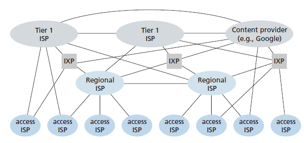
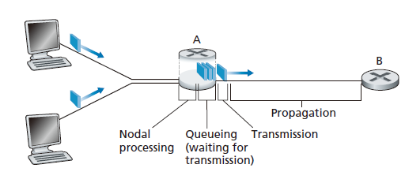

# [计算机网络: 自顶向下方法](https://gaia.cs.umass.edu/kurose_ross/ )

## Chap 1: 计算机网络和因特网

### 什么是 the Internet
我们有很多种方式去回答这个问题: 
:1st_place_medal: 一种是描述因特网的具体组成: 构成因特网的基本硬件和软件组件.  
:2nd_place_medal:一种是根据为分布式应用提供服务的基础设施来描述互联网. 
#### 具体组成描述
因特网是一个世界范围内的计算机网络, 连接了传统的桌面PC/服务器和非传统的物品(游戏机/平板电脑/温度调节装置...), 所有的这些设备都被称为 **主机**(host) 或 **端系统**(end system). 端系统通过 **通信链路**(communication link) 和 **分组交换机**(packet switch)连接到一起. 
packet switch 从一条入通信链路接收已经到达的分组, 并从一条出通信链路转发该分组, 最常见的两种packet switch 就是路由器和链路层交换机. 一个分组所经历的一系列通信链路和分组交换机成为通过该网络的路径. 

#### 服务描述
我们可以认为互联网是为应用程序提供服务的基础设施,例如与因特网相连的端系统提供了一个套接字借口, 规定了运行在一个端系统上的程序请求因特网基础设施向运行在另一个端系统上的特定目的地程序交付数据的方式.

#### 什么是协议
在因特网中，涉及两个或多个远程通信实体的所有活动都受协议的制约, 协议（protocol） **定义了在两个或多个通信实体之间交换的报文的格式和顺
序，以及报文发送和/或接收一条报文或其他事件所釆取的动作**。

### 网络边缘
通常把与因特网相连的计算机和其他设备称为端系统,它有时候被称为主机(host), 有时候又进一步分成两类,客户端(client) 和 服务器(server) 
 

#### 接入网
接入网是指将端系统物理连接到其边缘路由器(edge routers)的网络, 边缘路由器是指端系统到任何其他远程端系统的路径上的第一台路由器. 
1. 家庭接入
   1. 数字用户线(Digital Subscriber Line): 接入是上下不对等的
   2. 电缆因特网接入(cable Internet access): 利用了有限电视公司现有的有线电视基础设施, 需要特殊的调制解调器
   3. 光纤到户(Fiber To The Home,FTTH), 对于共享的光纤网络, 分成有源光纤网络和无源光纤网络两种体系结构. 
       
2. 企业接入: 以太网和WiFi
3. 广域无线接入:3G/LTE/5G

无线的网络有两种:
* wireless local aera networks(WLAN)
* wide-aera celluar access networks

#### 物理媒体
比特从源到目的地传输时, 通过一系列的发送-接收对, 每个发送接收对都跨越一种物理媒体(physical medium) 传播电磁波或光脉冲, 物理媒体分成导引型媒体和非导引型媒体. 
1. 双绞铜线
2. 同轴电缆
3. 光纤
4. 陆地无线电信道
5. 卫星无线电信道

### 网络核心
网络核心的两个 Key function
* forwarding(alias switching): 是一个 **local action**, 由 forwarding table 控制
* routing: 是一个 **global action**, 由 routing 算法决定 packet 从 source 到 destination 的路径

#### 分组交换
在各种网络应用中, 端系统彼此交换**报文**(message), 源将长报文划分为较小的数据块, 称之为**分组**(packet),每个分组都通过通信链路和分组交换机(packet switch, 主要有路由器和链路层交换机)传送.
##### 存储转发传输
多数分组交换机在链路的输入端使用**存储转发传输**, 开始向输出链路传输该分组的第一个比特之前, 必须接收整个分组. 就是说**仅当路由器已经接收完该分组的所有比特之后, 它才能开始向出链路传输**.于是通过N条速率为 R 的链路组成的路径, 看到的端到端时延是
\[
    d_{End2End}= N \frac{L}{R}
\]
##### 排队时延和分组丢失
每台分组交换机有多条链路与之相连,但是对于每条相连的链路, 该分组交换机只有一个**输出缓存**(output buffer),因此到达的分组需要传输到某台链路, 发现链路中还有其他忙于传输的分组, 该到达分组必须在输出缓存中等待. 因此除了存储转发时延以外, 分组还需要曾受输出缓存的**排队时延**(queuing delay), 而缓存空间是有限的, 一个到达的分组可能又发现该还魂已经被其他等待传输的分组完全占满了, 这时候会出现 **分组丢失**(packet loss).
##### 转发表和路由选择协议
当一个分组到达网络中的路由器时, **路由器检查该分组的目的地址的一部分, 并且向一台相邻的路由器转发该分组**, 每一台路由器都有一个转发表(forwarding table), 用于讲目的地址映射称为输出链路.而具体的转发表如何配置, 那是因为因特网具有一些特殊的 **路由选择协议**(routing protocol), 用于自动地设置这些转发表.

#### 电路交换
通过网络电路和交换机移动数据有两种基本的方法, 电路交换 和 分组交换. 
电路交换网络中, 在端系统间通信回话期间预留了端系统沿着路径通信所要的资源, **在发送方能够接受信息前, 该网络必须在发送方和接收方之间建立一条名副其实的连接**. 而在分组交换网络中, 这些资源不是预留的.
##### 电路交换网络的复用
链路中的电路是通过频分复用(frequency-division multiplexing,FDM) 或者时分复用(time-division multiplexing,TDM) 实现的.电路交换因为在静默期专用电路空闲而不够经济. 
##### 分组交换和电路交换的对比
分组交换有几个好处:
1. 比电路交换提供了更好的宽带共享
2. 比电路交换更简单/高效/实现成本低

#### A Network of Networks
 

### 分组交换中的时延/丢包和吞吐量
#### 时延概述
时延最重要的几个是:节点处理时延, 排队时延, 传输时延和传播时延.
 
1. 处理时延: order of microsecond or less, 检查分组首部和决定将该分组导向何处所需时间是其一部分, 还有诸如检查比特级别差错所需要的时间
2. 排队时延: 实际可以是 microsecond 到 milisecond 量级
3. 传输时延: 用L 表示长度, R 表示带宽, 差不多是 L/R, 通常也是微秒到毫秒数量级
4. 传播时延: 与距离和传播速率(取决于具体的物理媒介)有关

#### 排队和丢包
