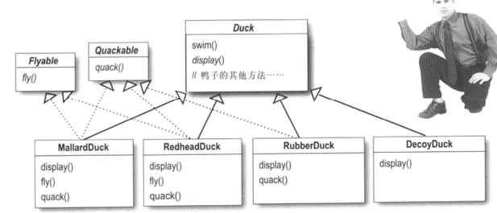

# Head First 设计模式

## Chap 1: intro
使用设计模式最好的方法是, 把设计模式装进脑子里, 然后在你的设计和已有的应用中, 寻求何处可以使用他们.<br>
case study: 使用继承的做法来实现鸭子的行为, 发现在 __基类的改变会牵一发而动全身, 造成所不希望的改变__.<br>
使用接口的话, 将 Flyable 和 Quackable 单独提取出来, 这样的话就解决了有的鸭子不会叫或者不会飞的问题.<br>
<br>
但是问题依旧没有解决, 这带来了代码无法复用的问题, 我们会用老的方法找出一个解决之道: **使用良好的OO设计原则.**<br>
一个设计原则: 找出应用中可能 **<font color=red>需要变化的地方, 将它们独立出来, 不要和那些不需要变化的代码混在一起</font>**.我们知道fly() 和 quack() 两个方法会随着鸭子的不同而改变, 于是将它们从Duck中取出来,建立一组新类来代表每个行为.<br>
这时候, 我们应该在鸭子类中包含设定行为的方法, 这样就可以 **在运行时动态地改变特定鸭子的飞行行为**. 这就引出了另一个设计原则: **<font color=red>针对接口编程, 而不是针对实现编程</font>**, 而针对接口的意思是针对超类型编程, 变量声明往往是超类型(抽象类或者接口), 只要是实现该超类型的对象都可以指定给这个对象, 在运行时决定该对象的行为. 
```Java
// 针对实现编程
Dog d = new Dog();
d.bark();
// 针对接口编程
a = getAnimal();
a.makeSound();
```
<font size=4> case study: 整合鸭子的行为</font><br>
1. 在Duck类中 __加入两个实例变量__, 分别是`flyBehavior`和`quackBehavior`, 声明为接口类型<br>
2. 然后再实现 peformQuack();
3. 接下来考虑如何设定 flyBehavior 和 qucakBehavior 的实例变量(在后面可能使用工厂模式等来实现)

