# Unstanding and Using C Pointers

## Introduction

一个重要的问题是程序运行过程中变量的**scope**
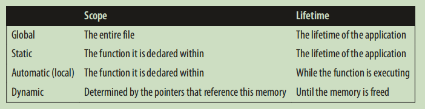<br>
因此，使用指针的时候常常出现下列问题：<br>
* Accessing arrays and other data structures beyond their bounds.
* Referencing automatic variables after they have gone out of existence.
* Referencing heap allocated memory after it has been released.
* Dereferencing a pointer before memory has been allocated to it.
<font color=red> 使用dynamic 分配内存，意味着这些部分将由自己管理分配，使用完没有释放的情况下就会出现内存泄漏。</font>

总之，问题分成两类，释放了内存之后依然用指针引用，还没分配内存就使用。<br>
**如何阅读声明** 从后往前读，如`const int *pci` pci is a pointer to const integer,`const int* const pci` cpci is a const pointer to const integer.<br>
**virtual memory** The addresses return by a program running in a virtual operation system, the operation system maps the virtual address to a real physical memory address when needed.<br>
**concent of Null** null在使用的时候有多种意思，具体要结合语境，因此特别容易搞混淆。NULL分配给了一个指针，就是说明该指针不含任何东西。NULL concept是对null指针的抽象，两个指向不同类型的空指针应该是相等的。在语言中是使用宏来实现
```c
#define NULL (void*(0))
```
同时我们要知道，空指针和未初始化的指针不是一回事，前者不指向任何地方，后者有可能指向任何地方。<br>
<font color=red> 有一个非常不安全的事情，就是空指针可以作为int被强制类型转化为0</font>,如作为函数的输入,在c++中有一个类型安全的空指针nullptr。<br>
**Pointer to void** 其中的两个特性：<br>
* 使用pointer to char来实现，在内存分配之类的上
* 无法==其他的pointer，特例是两个NULL的void pointer是相等的

使用pointer to void时候需要注意，如一个int point 被 cast 成 void，再可以cast成其他类型，这是非常危险的。<br>
**全局和静态pointer** 
```c
int *globalpi;
void foo() {
 static int *staticpi;
 ...
}
int main() {
 ...
}
```
其中，可以发现他们的存储结构可以认为是没有从堆栈中要空间，是全局的。<br>
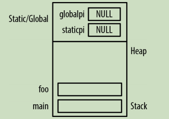<br>
**Pointer Size and Types** 
* 不同编译器和系统中的pointer size可能不同，但是一般所有data pointer 都是等长的
* pointer to function 的 size可能和其他pointer不同

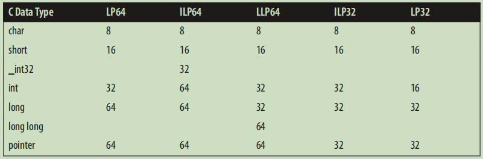<br>
几个常用的数据类型，在处理pointer时候有优势：<br>
* size_t size type,本质上是一种unsigned int 
* ptrdiff_t 使用处理pointer之间的算术
* `intptr_t & uintptr_t` is a new invention, created after 64-bit and even 128-bit memory addresses were imagined.If you ever need to cast a pointer into an integer type, always use `intprt_t`.<br>
<font color = red> 使用强制类型转换可以把其他的类型cast成intprt_t,但是永远不要将pointer 转换成int。</font>
```
#ifndef __SIZE_T
#define __SIZE_T
typedef unsign int size_t
#endif
```
normally,the maximum possible vaule for size_t is `SIZE_MAX`.<br>

**Pointer Arithmeric**
* 指针自增/自减
* 两个指针之间作差/对比

## Dynamic Memory Management in C

动态分配内存一个很大的作用就是帮助实现高级的数据结构，如linked list 或者 queue<br>
**动态分配步骤**
* 使用malloc分配内存
* 使用内存完成程序的部分
* 使用free释放内存

```c
int *pi = (int*)malloc(sizeof(int));
*pi = 5;
printf("*pi:%d\n",*pi);
free(pi);
```

malloc 使用的argument决定了分配内存的大小，成功返回一个指向heap地址的指针，失败则返回NLLL.<br>
在实际使用中发现，有时候free的内存仍可以通过指针取它的地址，因此一个合理的做法是free之后的指针赋NULL。<br>
**Memory leaks**<br>
losing the address:
```c
int *pi = (int *) malloc(sizeof(int));
*pi = 5;
...
int *pi = (int *) malloc(sizeof(int));
```
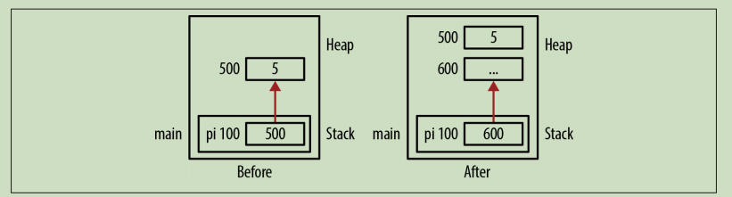<br>

还有一种，就是指针遍历之后变成了NULL，就丢失了相应的信息。<br>
**hiden memory leaks**

**Allocation Functions**<br>
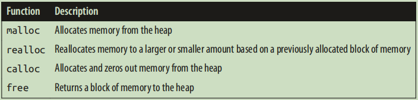<br>
malloc的函数原型为<br>
`void* malloc(size_t)`
具体作的事情，有几点需要注意：<br>
* memory从heap中分配
* 除非cleared，内存不会变化
* 返回的为第一个byte的地址

**cast or not** 在早期没有void类型的pointer时候，分配内存要显示表示出来pointer的类型，但是void指针可以指向任何东西，现在就不需要了，但是基于下面两个理由，我们依旧认为cast是一个好的习惯：<br>
* 方便记录malloc的类型
* 和c++/早期的C兼容

**几个典型的错误**<br>
* 分配了内存，但是没有往里面写东西就取数据，特别是面对char*想用作string时候问题特别明显
* malloc要的内存size不对
* 使用malloc初始化global 或者static的指针，但是我们可以用于赋值。
```c
static int *pi;
pi = malloc(sizeof(int));
```
这种做法是允许的。

**Using the calloc Funciton** `void *callloc(size_t numElement, size_t elementSize)` , 用来辅助malloc的运行，相当于`malloc(numElement*elementSize)`之后再`memset`为0.<br>
**Using the realloc Function** `void *realloc(viod *ptr, size_t size)`,它的具体行为如下：<br>
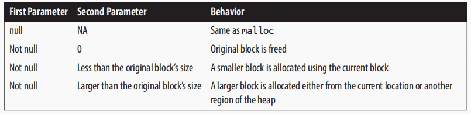<br>
其中重要的一点是，使用它要求分配更多的内存，地址可能会发生变化。<br>
**Variable Length Arrays** (since c99) <font color = red >允许在函数中的变长数组</font>.
```c
void compute(int size){
    char* buffer[size];
    ...
}
```

size大小为runtime确定，而此前数组大小必须在编译时候确定。<br>
**Deallocating Memory Using free Function** <br>
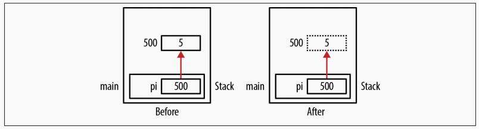<br>
但是需要注意，free不是由malloc定义的指针是未定义的行为。
```c
int mun;
int *pi = &num;
free(pi);
```

此外，free之后指针再取地址上的值也是未定义的行为，free之后再定义为NULL.<br>
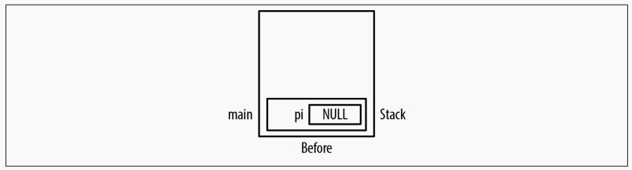<br>
**Double Free** 一个很重要事情是，不要对同一块内存free两次，如
```c
p1  = (int*)malloc(sizeof(int));
int *p2 = p1;
free(p1);
...
free(p2);
```

这种做法相当于对同一个内存做了两次free, 会引起corrupt heap和程序终止.<br>
**Dangling Pointers** pointer被free之后依然指向原来的地址，会带来一系列的问题：<br>
* 对该地址取值导致不可预测的行为
* 该地址不可accessible时候的分割错误
* 安全问题

常见的问题就是多个指针指向同一个东西，然后一个free之后另外的指针还在操作。<br>
```c
int *p1 = (int *) malloc(sizeof(int));
*p1 = 5;
...
int *p2 = p1;
...
free(p1);
...
*p2 = 10;//Dangling Pointer
```

还有一种可能是在语句块中，一般将他们处理成stack frame,其中释放之后，还有指针指向这些地方。<br>
```c
{
    int tmp = 5;
    pi = &tmp;
}//pi 这时候成了dangling pointer
foo();
```

其地址如下图所示：<br>
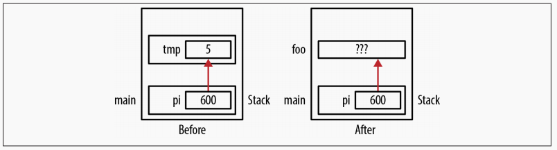<br>
**Dealing with Dangling Pointers** 有很多处理这种的方式，包括：<br>
* free的指针设置成NULL
* 使用自己定义的free函数
* 第三方工具检查

## Pointers and Functions

**程序的堆和栈** 
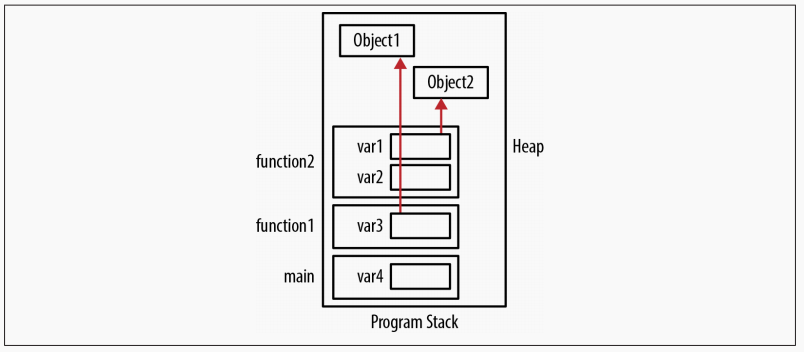<br>
一般而言，自己管理的内存在于程序的堆区，而函数调用栈和堆分别占用内存的低地址区和高地址区域，main调用的funciton1调用了function2,这样从上面就可以看出函数调用栈的LIFO特性（<font color= red> Last In First Out</font>）<br>
**管理stack frame** <br>
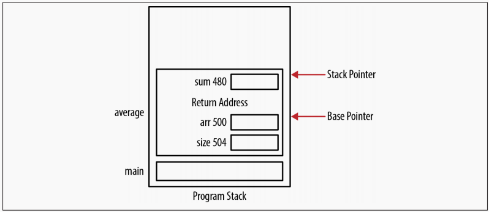<br>
每个stack frame有很多东西，其中包括系统管理的stack and base pointer用于管理stack,返回地址，local data和parameter的存储。<br>
它们一般是按照Opposite的order去Push到stack中，而一个语句块相当于mini function。<br>
**Passing and returning by Pointers** <br>
by pointer很重要的一点是可以改变pointer指向的地址的值，同时对于比较大的数据结构，拷贝带来的消耗也明显减少。<br>
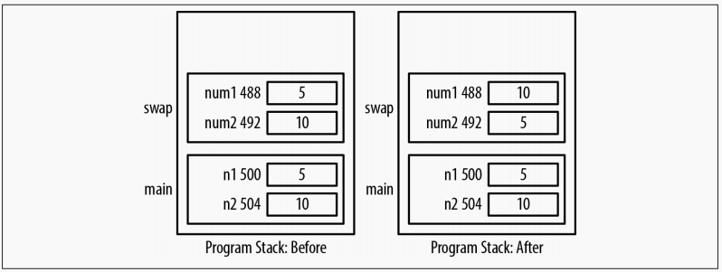<br>
对于不想要修改的数据，可以选择<font color=red> passing a Pointer to const </font>.
```c
void passingAddressOfConst(const int* num1,int *num2){
    *num2 = *num1;
}
```
返回一个指针很简单，只需要将函数声明为对应的指针类型，一般有两种做法：<br>
* 在函数内部分配内存(malloc),处理完返回指针，这时候调用者需要自己deallocatingei内存。
* 将内存地址传参进入函数，这时候调用人需要自己分配和释放内存。

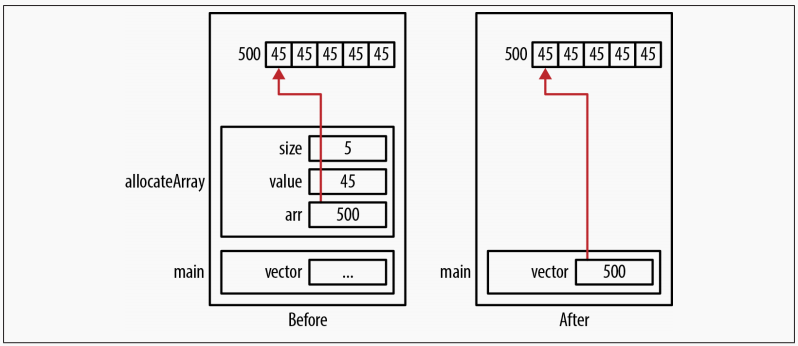<br>
常见的问题有以下的部分：<br>
* 返回没有初始化的内存
* 返回一个invalid的地址
* 返回一个<font color=red>local </font> 变量的地址
* 返回了地址但是用完之后没有free

**Passing Null Pointers** <br>
```c
int* allocateArray(int *arr,int size,int value){
    if(arr != NULL){
        for(int i = 0; i < size; i++){
            arr[i] = value;
        }
    }
    return arr; // arr为一个pointer
}
```
调用的时候，首先使用一个malloc分配好内存，再传入函数。<br>


# Pointers and Arrays

