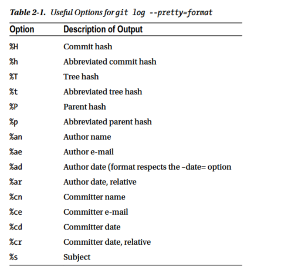
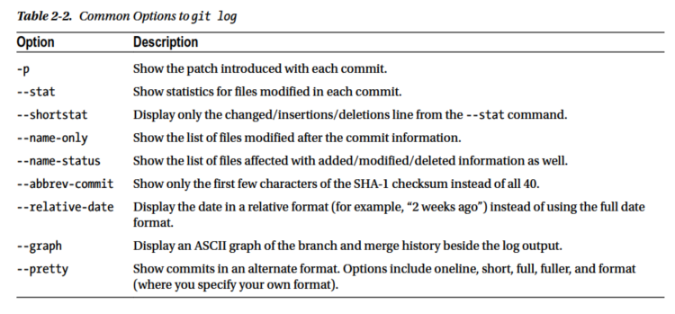
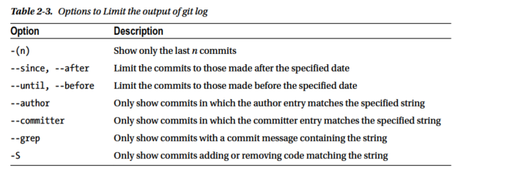

# Pro Git , 2nd Edition

## Chap 1 : Intro

### 版本控制系统
分布式版本控制系统, 并非仅仅是检出文件的最新快照, 而是对代码仓库进行完整的镜像,不管是哪个服务器出现故障, 任何一个客户端都应该使用自己的本地镜像来恢复服务器. 
在Git 中, 文件可以处于以下三种状态: committed(已提交), modified(已修改), and staged(已暂存), 因此引入了Git项目中的三个主要区域, Git目录, 工作目录 和暂存区:  

### Git 首次使用的配置

**设置编辑器** : `git config --global core.editor emacs` 
**用户身份**: 
* `git config --global user.name "John Doe"`
* `git config --global user.email johndoe@example.com`

**检查个人设置** :`git config --list `  

## Chap 2: Git Basics

### 创建一个Git 仓库
* $ _git init_ 
* $ _git clone https://github.com/libgit2/libgit2 mylibgit_ 

### 记录变更
* 查看当前文件状态 $ `git status`, _-s_ 选项可以更简洁的方式显示
* 跟踪新文件 $ `git add someFile`

#### 忽略文件
可以创建 _.gitignore_ 文件, 它的具体规则如下:
- [x] Blank lines or lines starting with # are ignored. 
- [x] 支持标准的glob格式(使用 *等符号, 来写一个glob规则,像在shell里一样,获取匹配对应规则的文件)
- [x] 用斜杠(/)开头的模式可以用于禁止递归匹配
- [x] 用斜杠(/)结尾的模式表示目录
- [x] 用感叹号(!)开始的模式表示取反

#### 查看已暂存和未暂存的变更
`git diff`命令可以查看修改的具体内容, 这个是列出没有暂存的更改, 而把变更加入暂存区之后就不在显示. 
`git commit` with _-a_ 选项, 把已经跟踪的所有文件更改添加到暂存区, 然后再提交. 
`git rm someFile` 把文件从已跟踪文件列表移除(从暂存区移除), _-f_ 选项强制移除,这样被移除之后无法快速修复 
`git rm --cached someFile` 保留文件, 但是不希望git跟踪这些文件 
`git mv file_from file_to` git 不会显式跟踪文件的移动,这个相当于 _mv file\_from file\_to_ , _git rm file\_from_, _git add file\_to_  
`git log ` 查看提交历史, 最常用的选项是 _-p_, 会显示每次提交所引入的差异, _--state_ 查看每个提交摘要信息统计, _--pretty=format_ 查看更详细的信息: 
 
git log 的其他常用选项列举如下: 
 
此外, git log 还可以限制历史的输出范围, 如 `git log --since=2.weeks`, 其具体使用方法列举如下: 
 

### 撤销操作
`git commit --amend` 尝试重新提交(之前忘记了添加某些文件或者写错了提交信息) 

#### 撤销已经暂存的文件
`git reset HEAD someFile` 把某个文件移除暂存区, 而git reset 加上 _--hard_ 参数之后会非常危险,
#### 撤销对文件的修改
`git checkout -- someFile`, 这个很危险, 对文件的更改都会丢失

### 远程仓库的使用
`git remote -v` 列出每个远程仓库和对应的URL 
`git remote add [shortName] [URL] ` 从链接添加远程的仓库, 并且提供别名供拉取/提交操作使用 
`git fetch [shortName]` 从指定的远程厂库获取数据, 但是**不会自动合并到当前本地的工作成果中**  
`git push [remote-name] [branch-name]` 将数据推送到远程仓库 
`git remote show [remote-name]` 显示仓库的信息 
`git remote rename [remote-name-before] [remote-name-after] ` 重命名仓库

### 标记
`git tag` 列出可用标签 
`git tag -l "v1.8.7=5" ` 按照某个特定的模式搜索标签 
`git tag -a v1.4 -m "my version 1.4"` 只要用 _-a_ 就可以轻易添加标签 
`git show v1.4` 查看标签数据以及对应的标签 
